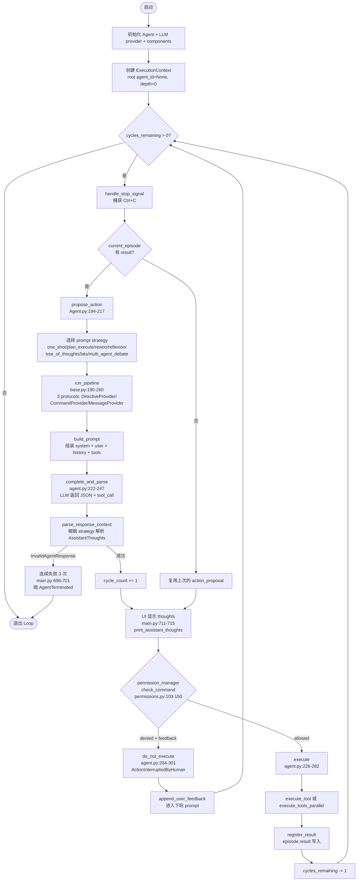
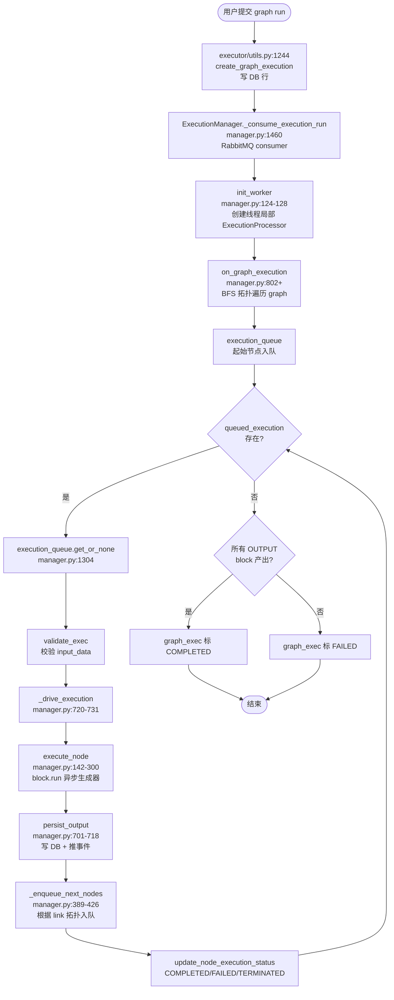

# AutoGPT — Agent Loop 调研报告

> 调研对象：`Significant-Gravitas/AutoGPT` (monorepo: classic + platform 两套实现)
> 调研日期：2026-07-18
> 调研方式：Read / Grep 静态分析，未执行构建/运行命令
> 关注目录：
> - `classic/original_autogpt/autogpt/agents/` + `classic/forge/forge/agent/` + `classic/forge/forge/components/`(classic 经典版)
> - `autogpt_platform/backend/backend/executor/` + `backend/blocks/agent.py` + `backend/copilot/`(platform 重写版)
> 姊妹报告：
> - `AutoGPT/file_backend.md`(workspace 设计)
> - `AutoGPT/tool_channel.md`(工具调用设计)

---

## 0. 智能体一句话定位

**AI Agent 领域的"破圈鼻祖"**。2023 年发布的 classic 版首创"思考 → 行动 → 观察 → 评估"循环，定义了 ReAct 自主智能体的范式；2024+ 重写的 platform 版彻底抛弃"while True 循环 + LLM 决策"的形态，转为 **graph-based block 编排 + 多 LLM 节点 + sub-agent 嵌套**。Platform 版还有 AutoPilot / CoPilot 双形态：**AutoPilot 是单 LLM 调 50+ 工具的 native SDK 循环**，**CoPilot 是 chat-based 工具调用(类似 Claude Code/Gemini CLI 风格)**。

---

## 1. 调研依据

### 1.1 源码路径

| 模块 | 路径 | 作用 |
| --- | --- | --- |
| Classic main loop | `classic/original_autogpt/autogpt/app/main.py:594-799` | `run_interaction_loop()` 实现"while cycles_remaining > 0"主循环 |
| Classic Agent 类 | `classic/original_autogpt/autogpt/agents/agent.py:113-446` | `Agent.propose_action()` + `Agent.execute()` + 多 strategy 切换 |
| Classic Base Agent | `classic/forge/forge/agent/base.py:46-340` | `BaseAgent` 抽象 + `cycle_count`/`cycle_budget`/`cycles_remaining` 字段 |
| Classic Forge Agent | `classic/forge/forge/agent/forge_agent.py:121-275` | `ForgeAgent.execute_step()` 单步执行入口 |
| Classic Plan 机制 | `classic/forge/forge/components/todo/todo.py:280-700` | `TodoComponent` 的 9 个 todo_* 命令 |
| Classic Ask 模式 | `classic/forge/forge/components/user_interaction/user_interaction.py:1-180` | `UserInteractionComponent` 的 ask_user/ask_yes_no/ask_choice |
| Classic System | `classic/forge/forge/components/system/system.py:1-100` | `SystemComponent` 的 `finish` 命令 + 系统约束 |
| Classic 权限 | `classic/forge/forge/permissions.py:1-280` | `CommandPermissionManager` 的 4 scope + 5 layer 决策 |
| Classic Sub-agent | `classic/forge/forge/agent/execution_context.py:1-310` | `ExecutionContext` + `ResourceBudget` + `SubAgentHandle` |
| Classic 工厂 | `classic/original_autogpt/autogpt/agent_factory/default_factory.py:22-180` | `DefaultAgentFactory` 实现 AgentFactory protocol |
| Classic 上下文 | `classic/forge/forge/components/action_history/action_history.py:1-310` | `ActionHistoryComponent` lazy 压缩 + `_make_result_messages` |
| Classic Episode | `classic/forge/forge/components/action_history/model.py:1-220` | `Episode` + `EpisodicActionHistory` + `handle_compression()` |
| Classic Action 模型 | `classic/forge/forge/models/action.py:17-110` | `ActionProposal` + `use_tools` 并行 + `ActionInterruptedByHuman` |
| Classic 7 strategies | `classic/original_autogpt/autogpt/agents/prompt_strategies/{one_shot,plan_execute,rewoo,reflexion,tree_of_thoughts,lats,multi_agent_debate}.py` | 7 种 prompt strategy |
| Classic one_shot | `classic/original_autogpt/autogpt/agents/prompt_strategies/one_shot.py:34-95` | `AssistantThoughts` 模型(observations/reasoning/self_criticism/plan) |
| Classic plan_execute | `classic/original_autogpt/autogpt/agents/prompt_strategies/plan_execute.py:1-250` | `PlanExecutePhase` + `Plan` + `PlanExecuteActionProposal` |
| Platform 执行器 | `autogpt_platform/backend/backend/executor/manager.py:120-820` | `ExecutionManager` 消息队列 + `_drive_execution()` + worker pool |
| Platform Sub-agent | `autogpt_platform/backend/backend/blocks/agent.py:24-180` | `AgentExecutorBlock` 嵌套 graph execution |
| Platform 上下文压缩 | `autogpt_platform/backend/backend/util/prompt.py:283-810` | `get_compression_target()` + `compress_context()` 4 策略 |
| Platform Ask | `autogpt_platform/backend/backend/copilot/tools/ask_question.py:1-160` | `AskQuestionTool` 澄清问题工具 |
| Platform Sub-session | `autogpt_platform/backend/backend/copilot/tools/run_sub_session.py:60-160` | `RunSubSessionTool` 派生 sub-AutoPilot |
| Platform HITL | `autogpt_platform/backend/backend/copilot/tools/continue_run_block.py:1-180` | `ContinueRunBlockTool` 人审批准后恢复 |
| Platform Plan/Todo | `autogpt_platform/backend/backend/copilot/tools/todo_write.py:1-140` | `TodoWriteTool` 模型侧 todo 看板 |
| Platform Marketplace | `autogpt_platform/backend/backend/blocks/system/store_operations.py:20-200` | `StoreAgent` + `SearchStoreAgentsBlock` 商店 |

### 1.2 关键文件

| 文件 | 作用 | 涉及问题 |
| --- | --- | --- |
| `autogpt/app/main.py:683-784` | classic 主循环 while | Q1 Q4 |
| `autogpt/agents/agent.py:194-217` | propose_action 入口 | Q1 Q2 |
| `autogpt/agents/agent.py:226-280` | execute 入口 | Q1 Q7 |
| `forge/forge/agent/base.py:46-90` | cycle_count / cycle_budget | Q1 Q4 |
| `forge/forge/components/todo/todo.py:611-700` | todo_update 命令 | Q2 |
| `forge/forge/components/system/system.py:79-95` | finish 命令 | Q4 |
| `forge/forge/permissions.py:56-150` | 4 scope + 5 layer 权限 | Q7 |
| `forge/forge/agent/execution_context.py:135-310` | ExecutionContext + ResourceBudget | Q3 |
| `forge/forge/components/action_history/model.py:135-200` | 上下文压缩 | Q8 |
| `autogpt_platform/backend/backend/executor/manager.py:720-790` | _drive_execution | Q1 |
| `autogpt_platform/backend/backend/blocks/agent.py:72-100` | AgentExecutorBlock.run | Q3 |
| `autogpt_platform/backend/backend/util/prompt.py:705-810` | compress_context 4 策略 | Q8 |
| `autogpt_platform/backend/backend/copilot/tools/ask_question.py:14-90` | AskQuestion tool | Q5 |

### 1.3 关键文档

- `classic/CLAUDE.md` — classic 版开发文档
- `autogpt_platform/CLAUDE.md` — platform 版开发文档
- `classic/original_autogpt/autogpt/app/main.py:594-595` — `_get_cycle_budget()` 注释:"The cycle budget is now only used for Ctrl+C handling graceful shutdown. If a limit is set, use it; otherwise run indefinitely."
- `autogpt_platform/backend/backend/blocks/agent.py:15-18` — `execution_timeout_seconds: int | None = None` 注释:"Coordination block: waits on a child graph's full execution. The child has its own per-node wall-clock caps, so applying the parent's leaf-block cap here would false-positive on legitimately long sub-agent runs."
- `autogpt_platform/backend/backend/util/prompt.py:716-735` — `compress_context()` 注释:"Strategy (in order): 1. LLM summarization – If client provided... 2. Content truncation... 3. Middle-out deletion... 4. First/last trim..."

---

## 2. 九大问题回答

### Q1. Agent Loop 主流程 [含 Mermaid 流程图]

#### Q1.1 经典 AutoGPT 循环(2023—2024)

**主循环入口**:`classic/original_autogpt/autogpt/app/main.py:594-799` 的 `run_interaction_loop()`,核心是 `while cycles_remaining > 0` 循环(行 683)。这是一个**最经典、最直白的 ReAct 循环**:



**关键代码 — 经典 main loop 实际结构**(`autogpt/app/main.py:683-784`):

```python
# 伪代码 + 关键行号
async def run_interaction_loop(agent, ui_provider):
    cycle_budget = cycles_remaining = _get_cycle_budget(
        app_config.continuous_mode, app_config.continuous_limit
    )  # main.py:637
    
    while cycles_remaining > 0:                                  # main.py:683
        logger.debug(f"Cycle budget: {cycle_budget}; remaining: {cycles_remaining}")
        
        # PLAN 阶段: LLM 提议下一步
        if not (_ep := agent.event_history.current_episode) or _ep.result:
            async with ui_provider.show_spinner("Thinking..."):
                try:
                    action_proposal = await agent.propose_action()  # main.py:694
                except InvalidAgentResponseError as e:
                    consecutive_failures += 1
                    if consecutive_failures >= 3:                  # main.py:698
                        raise AgentTerminated(...)
                    continue
        
        # UPDATE 阶段: UI 显示思考
        await ui_provider.display_thoughts(                       # main.py:711
            ai_name=ai_profile.ai_name,
            thoughts=action_proposal.thoughts,
        )
        
        # EXECUTE 阶段
        try:
            result = await agent.execute(action_proposal)         # main.py:743
        except AgentFinished as e:                                # main.py:744
            # finish 命令走这里
            if app_config.noninteractive_mode:
                return
            next_task = await ui_provider.prompt_finish_continuation(...)
            if not next_task.strip():
                return
            agent.state.task = next_task
            cycles_remaining = _get_cycle_budget(...)             # main.py:776
            continue
        
        if result.status != "interrupted_by_human":               # main.py:783
            cycles_remaining -= 1                                  # main.py:784
```

#### Q1.2 Platform 版执行模型(graph-based, 不是 while 循环)

Platform 版**彻底抛弃了 while-True-ReAct 循环**。它的执行模型是:



**关键代码 — Platform 版执行驱动**(`executor/manager.py:720-790`):

```python
# executor/manager.py:720-790 核心 _drive_execution
async def _drive_execution() -> None:
    async for output_name, output_data in execute_node(
        node=node,
        data=node_exec,
        execution_processor=self,
        execution_stats=stats,
        nodes_input_masks=nodes_input_masks,
        nodes_to_skip=nodes_to_skip,
    ):
        await persist_output(output_name, output_data)

try:
    await async_update_node_execution_status(...)
    block_timeout = node.block.execution_timeout_seconds
    if block_timeout is None:                       # agent.py:16 协调 block 无限时
        await _drive_execution()
    else:
        await asyncio.wait_for(_drive_execution(), timeout=block_timeout)
    status = ExecutionStatus.COMPLETED
except asyncio.TimeoutError:
    stats.error = TimeoutError(...)
    status = ExecutionStatus.FAILED
except BaseException as e:
    stats.error = e
    status = ExecutionStatus.FAILED
```

#### Q1.3 AutoPilot / CoPilot 第三种循环(SDK chat 风格)

Platform 还有第三种"循环" — AutoPilot 模式,单 LLM 调 50+ 工具, 走 `StreamTextDelta` / `StreamToolOutputAvailable` / `StreamFinish` 三事件流(`bot_backend.py:479-538`):

```python
# bot_backend.py:479-540 SDK stream consumer
while True:                                            # ← 这里是真正的 while 循环
    try:
        chunk = await asyncio.wait_for(queue.get(), timeout=STREAM_CHUNK_TIMEOUT_SECONDS)
    except asyncio.TimeoutError:
        raise BotStreamError("stream_timeout", ...)
    if isinstance(chunk, StreamTextDelta):
        yield chunk.delta
    elif isinstance(chunk, StreamToolOutputAvailable):
        # tool 结果回来,继续 loop
        ...
    elif isinstance(chunk, StreamFinish):                # ← 退出条件
        return
    elif isinstance(chunk, StreamError):
        raise BotStreamError("backend_stream_error", ...)
```

**这是 platform 上唯一保留 while 循环的地方**, 但它是事件驱动,不是 LLM 主动决策。

#### Q1.4 Classic vs Platform 核心差异

| 维度 | Classic (2023—) | Platform graph (2024+) | AutoPilot SDK (2025+) |
|------|----------------|----------------------|---------------------|
| **模型** | 单 Agent + while 循环 + LLM 决策下一步 | 多 block DAG + 拓扑遍历 + 节点异步执行 | 单 LLM + 工具调用循环(事件驱动) |
| **LLM 决策** | 每一轮 LLM 输出 thoughts + tool_call | LLM 仅在 `AIStructuredResponseBlock`/`AITextGeneratorBlock`/`AIConversationBlock` 等 LLM block 内被调用 | 每轮 LLM 输出 tool_call,事件循环 dispatch |
| **退出条件** | LLM 调 `finish` 命令 → `AgentFinished` 异常 | 所有 OUTPUT block 都 produce | 收到 `StreamFinish` 事件 |
| **状态** | `EpisodicActionHistory` 内存 | PostgreSQL `AgentGraphExecution` + `AgentNodeExecution` | Redis stream + ChatSession |
| **并发** | classic 不并行(单 Agent) | **节点级并行**(RabbitMQ 多 worker + 线程池) | 工具级串行,但事件异步 |
| **Sub-agent** | `ExecutionContext.spawn_sub_agent` + `DefaultAgentFactory` | `AgentExecutorBlock` 嵌套 graph run | `run_sub_session` 派生 sub-AutoPilot session |
| **思考链日志** | 显式 `AssistantThoughts` 模型 + `print_assistant_thoughts` UI | Block 自己的 `output` 字段(无统一 thoughts) | `StreamTextDelta` 流式 + frontend 渲染 |
| **持久化** | 内存(in-memory episode) | PostgreSQL 38 表 | Redis stream + transcript 写回 |
| **典型用户** | CLI 调试 + benchmark | Web Builder GUI 用户(拖拽 block) | Chat 用户(类 Claude Code 体验) |

> **⚠️ 重要**:Platform 三个形态并存(graph executor、AutoPilot SDK、CoPilot baseline)。调研发现 AutoGPT 团队自己也在**反复重构**。最新趋势是 SDK 优先(graph 是低层底座)。

---

### Q2. Plan 计划机制

**Classic 和 Platform 都有 plan 机制,但定位不同**。

#### Q2.1 Classic 版 — TodoComponent + 7 种 prompt strategy

**计划数据模型** — classic 有 9 个 todo_* 命令(`forge/components/todo/todo.py:280-700`):

| 命令 | 行号 | 功能 |
|------|-----|------|
| `todo_add` | ~380 | 增量添加 todo |
| `todo_set_status` | ~580 | 单字段改状态(pending/in_progress/completed) |
| `todo_update` | 611-700 | 部分更新(content/active_form/status) |
| `todo_delete` | 720 | 显式删除 |
| `todo_bulk_add` | ~770 | 批量添加 |
| `todo_reorder` | ~820 | 调整顺序 |
| `todo_read` | 311-345 | 读取当前列表(返回 status 摘要) |
| `todo_clear` | ~360 | 清空 |
| `todo_decompose` | 395-410 | LLM 分解 todo 为 3-7 子步(`todo_decompose` 调 LLM 智能拆分) |

**关键代码 — todo_update 命令签名**(`todo.py:611-700`):

```python
@command(
    names=["todo_update"],
    parameters={
        "id": JSONSchema(type=JSONSchema.Type.STRING, required=True, ...),
        "content": JSONSchema(type=JSONSchema.Type.STRING, required=False, ...),
        "active_form": JSONSchema(type=JSONSchema.Type.STRING, required=False, ...),
        "status": JSONSchema(
            type=JSONSchema.Type.STRING,
            enum=["pending", "in_progress", "completed"],
            required=False,
        ),
    },
)
def todo_update(self, id: str, content: Optional[str] = None,
                active_form: Optional[str] = None,
                status: Optional[TodoStatus] = None) -> dict:
    """Partial update of a todo - only specified fields change."""
    item = self._find_by_id(id)
    # ... partial update
    return {"status": "success", "item": self._serialize_todo_item(item),
            "changed": changes}
```

**存放位置**:`TodoList` 是 Pydantic model(`todo.py:1-280` 范围),存在 `AgentSettings.context` 里(`agent.py:113-117`),内存对象,**不持久化**(重启丢失)。

**LLM 如何更新**:
1. LLM 输出 `use_tool = todo_add / todo_update / todo_set_status`,作为 tool_call
2. `Agent.execute()` 走 `command(**tool_call.arguments)`
3. 结果写回 `EpisodicActionHistory.current_episode.result`
4. 下轮 `propose_action` 通过 `get_messages()` 调 `ActionHistoryComponent.get_messages()` 自动把 todo 状态注入 prompt(行 56-114)

#### Q2.2 Plan-Execute strategy(独立 plan 模型)

classic 还有一种**专门的 plan 模型**(`prompt_strategies/plan_execute.py:1-300`):

```python
# plan_execute.py:56-58 4 个 phase
class PlanExecutePhase(str, Enum):
    VARIABLE_EXTRACTION = "variable_extraction"  # PS+ 提取变量
    PLANNING = "planning"
    EXECUTING = "executing"
    REPLANNING = "replanning"

# plan_execute.py:189-217 Plan 数据模型
class Plan(BaseModel):
    goal: str                              # 总目标
    steps: list[PlannedStep]               # 步骤列表
    # ... fields
    def is_complete(self) -> bool:         # plan_execute.py:232
        return all(step.status in ("completed", "skipped") for step in self.steps)
    def should_replan(self) -> bool:       # 失败后重定
        ...
```

**Plan-Execute 模式** = LLM 先列步骤,然后逐步执行,失败时 REPLAN 重新生成 plan。参考论文 `arxiv.org/html/2503.09572v3` 和 `arxiv.org/abs/2305.04091`。

#### Q2.3 Platform 版 — TodoWrite 工具

**与 classic 完全不同**,Platform 把 todo 暴露为 LLM 工具(`backend/copilot/tools/todo_write.py:1-140`):

```python
# todo_write.py:36-60
class TodoWriteTool(BaseTool):
    @property
    def name(self) -> str:
        return "TodoWrite"   # 大写,与 frontend switch case 匹配
    
    @property
    def parameters(self) -> dict[str, Any]:
        return {
            "type": "object",
            "properties": {
                "todos": {
                    "type": "array",
                    "items": {
                        "type": "object",
                        "properties": {
                            "content": {"type": "string", ...},
                            "activeForm": {"type": "string", ...},
                            "status": {
                                "type": "string",
                                "enum": ["pending", "in_progress", "completed"],
                                "default": "pending",
                            },
                        },
                        "required": ["content", "activeForm"],
                    },
                },
            },
            "required": ["todos"],
        }
```

**关键差异**:
- **无状态**: 模型最新 `todos` argument IS the canonical list, replayed from transcript on subsequent turns(`todo_write.py:1-12` 注释)
- **强制 1 个 in_progress**:`todo_write.py:108-112` 校验"Only one todo may be 'in_progress' at a time"
- **存放在 `transcript` 表**:`backend/copilot/transcript.py` 维护完整对话 transcript,下次 turn 从 transcript 恢复

**Platform 没有 update_plan 工具**(走 TodoWrite 整体替换)。但 platform 的 graph 模式有 `OrchestratorBlock`(待确认,见 §5 不确定段)。

---

### Q3. Sub Agent

**AutoGPT 是早期真正实现 sub-agent 的项目**。Classic 走 `ExecutionContext` + `DefaultAgentFactory`,Platform 走 `AgentExecutorBlock` + `run_sub_session`。

#### Q3.1 Classic 版 — ExecutionContext

**核心抽象**(`forge/agent/execution_context.py:1-310`):

```python
# execution_context.py:135-220 ExecutionContext
@dataclass
class ExecutionContext:
    llm_provider: "MultiProvider"          # 共享 LLM
    file_storage: "FileStorage"
    agent_factory: Optional[AgentFactory]  # 派生 sub-agent 的工厂
    parent_agent_id: Optional[str] = None  # None = root
    depth: int = 0
    budget: ResourceBudget = field(default_factory=ResourceBudget)
    sub_agents: dict[str, SubAgentHandle] = field(default_factory=dict)

# execution_context.py:70-105 ResourceBudget
@dataclass
class ResourceBudget:
    max_depth: int = 5                 # 最大嵌套深度
    max_sub_agents: int = 25           # 每个 agent 最多派 25 个 sub
    max_cycles_per_agent: int = 50     # 每个 sub 最多 50 cycle
    max_tokens_total: int = 0          # 0 = 无限
    inherited_deny_rules: list[str]    # 父 deny 规则强制继承
    explicit_allow_rules: list[str]    # 子 agent 显式 allow
```

**子 Agent 文件隔离设计**(execution_context.py:1-13 文档明确写):
1. **File storage**: Sub-agents can READ parent workspace but only WRITE to their own subdirectory (`.sub_agents/{agent_id}/`)
2. **Permissions**: Inherit deny rules, explicit allow rules per sub-agent
3. **Context isolation**: Sub-agents get minimal context (just task description)
4. **History visibility**: Parent sees sub-agent results only, not full history

```python
# execution_context.py:203-220 子文件存储
def _create_child_storage(self, child_agent_id: str) -> "FileStorage":
    sub_agent_path = f".sub_agents/{child_agent_id}"
    return self.file_storage.clone_with_subroot(sub_agent_path)
```

**DefaultAgentFactory 实际派生逻辑**(`agent_factory/default_factory.py:22-180`):

```python
# default_factory.py:22-60
class DefaultAgentFactory(AgentFactory):
    def create_agent(
        self,
        agent_id: str,
        task: str,
        context: "ExecutionContext",   # ← 关键:接收父 context
        ai_profile: Optional["AIProfile"] = None,
        directives: Optional["AIDirectives"] = None,
        strategy: Optional[str] = None,
    ) -> Any:
        # 复用 LLM provider, 但创建独立的 AgentSettings
        agent_state = self._create_agent_state(...)
        agent = Agent(settings=agent_state, llm_provider=context.llm_provider, ...)
        return agent
```

**调用入口**:Root agent 创建时构造 ExecutionContext(`agent.py:222-244`):

```python
# agent.py:218-244 _create_root_execution_context
def _create_root_execution_context(self, llm_provider, file_storage, app_config):
    from autogpt.agent_factory.default_factory import DefaultAgentFactory
    factory = DefaultAgentFactory(app_config)
    return ExecutionContext(
        llm_provider=llm_provider,
        file_storage=file_storage,
        agent_factory=factory,           # ← sub-agent 工厂
        parent_agent_id=None,
        depth=0,
        _app_config=app_config,
    )
```

**但 classic 没有现成的 `spawn_sub_agent` 命令**!需要通过 prompt strategy 或用户自定义代码触发(待确认是否在任何 strategy 里实现了自动 spawn)。

#### Q3.2 Platform 版 — AgentExecutorBlock 嵌套 graph

**`AgentExecutorBlock`** 是 platform 版的 sub-agent 标准实现(`backend/blocks/agent.py:1-180`):

```python
# blocks/agent.py:24-100
class AgentExecutorBlock(Block):
    execution_timeout_seconds: int | None = None  # 协调 block 无限时
    
    class Input(BlockSchemaInput):
        user_id: str
        graph_id: str                       # ← sub-agent 是另一个完整 graph
        graph_version: int
        inputs: BlockInput
        input_schema: dict
        output_schema: dict
    
    async def run(self, input_data, *, graph_exec_id, execution_context, **kwargs):
        graph_exec = await execution_utils.add_graph_execution(
            graph_id=input_data.graph_id,
            graph_version=input_data.graph_version,
            user_id=input_data.user_id,
            inputs=input_data.inputs,
            execution_context=execution_context.model_copy(
                update={"parent_execution_id": graph_exec_id},   # ← 父子关联
            ),
            ...
        )
        async for name, data in self._run(graph_id, ..., graph_exec_id, ...):
            yield name, data                                # 把 sub-graph 输出 yield 回去
```

**关键设计**:
- `parent_execution_id` 字段传递父子关系(`executor/utils.py:1281`)
- `is_sub_graph = parent_exec_id is not None`(`utils.py:870`)用于权限校验
- child graph 有**自己的 ExecutionContext**(继承自父的 dry_run、workspace_id、organization_id)
- child 完全独立,只通过 OUTPUT block 把结果回传给 parent

**调用链**:`AgentExecutorBlock.run()` → `add_graph_execution()` → 写 `AgentGraphExecution` DB 行 → enqueue `GRAPH_EXECUTION_QUEUE_NAME` → 另一个 worker 处理 → 通过 event bus 推回

#### Q3.3 CoPilot sub-session(第三种 sub-agent)

**`RunSubSessionTool`**(`copilot/tools/run_sub_session.py:1-160`)是 chat 模式的 sub-agent:

```python
# run_sub_session.py:60-100
class RunSubSessionTool(BaseTool):
    @property
    def name(self) -> str:
        return "run_sub_session"
    
    @property
    def description(self) -> str:
        return ("Delegate a task to a fresh sub-AutoPilot. Runs on the copilot "
                "executor queue — survives tab-close AND worker restarts. "
                f"Waits up to wait_for_result sec (max {MAX_SUB_SESSION_WAIT_SECONDS}). "
                "If not done, returns status=running + sub_session_id — poll via "
                "get_sub_session_result.")
```

**关键能力**:
- **跨 worker 持久化** — 走 Redis stream,不是 in-process asyncio.Task(run_sub_session.py:1-30 文档)
- **30s 等待 + poll 模式** — `wait_for_result` 参数,超限返 `status="running" + sub_session_id`,agent 用 `get_sub_session_result` 工具轮询
- **dry_run 继承** — `create_chat_session(user_id, dry_run=session.dry_run, ...)`(run_sub_session.py:153),父在 dry-run 模式,sub 不会"实际跑"
- **所有权校验** — `owned.user_id != user_id` 时拒绝,防止跨用户 sub-session 攻击

#### Q3.4 三种 sub-agent 对照

| 维度 | Classic ExecutionContext | Platform AgentExecutorBlock | CoPilot run_sub_session |
|------|--------------------------|---------------------------|----------------------|
| **单位** | Agent 实例 | 整个 graph (DAG) | 整个 chat session |
| **父子关联** | `parent_agent_id` | `parent_execution_id` (DB 字段) | `sub_autopilot_session_id` (轮询) |
| **资源隔离** | `clone_with_subroot(.sub_agents/{id}/)` | 子 graph 自己的 workspace | 继承父 session 的 workspace |
| **深度限制** | `max_depth=5` | 无限(graph 之间互相调) | 1 层(chat session) |
| **持久化** | 内存(进程级) | DB (`AgentGraphExecution`) | Redis stream + DB |
| **崩溃恢复** | ❌ 进程死了 sub 也死 | ✅ DB 持久,可 resume | ✅ Redis stream 持久 |
| **超时** | `max_cycles_per_agent=50` | `execution_timeout_seconds=None` | `MAX_SUB_SESSION_WAIT_SECONDS` (秒级) |

---

### Q4. Loop 退出机制

**Classic 用 `finish` 命令 + `AgentFinished` 异常**,**Platform 用 graph 全 OUTPUT block 产出 / StreamFinish 事件**。

#### Q4.1 Classic — `finish` 命令 + `AgentFinished` 异常

**核心命令**(`forge/components/system/system.py:79-95`):

```python
# system.py:79-95
@command(
    names=[FINISH_COMMAND],                          # "finish"
    parameters={
        "reason": JSONSchema(type=JSONSchema.Type.STRING, required=True, ...),
        "suggested_next_task": JSONSchema(..., required=False),
    },
)
def finish(self, reason: str, suggested_next_task: str = ""):
    """Use this to shut down once you have completed your task,
    or when there are insurmountable problems that make it impossible
    for you to finish your task."""
    raise AgentFinished(reason, suggested_next_task=suggested_next_task or None)
```

**主循环捕获逻辑**(`autogpt/app/main.py:744-781`):

```python
# main.py:744-781
try:
    result = await agent.execute(action_proposal)
except AgentFinished as e:                                # ← 捕获 finish 异常
    if app_config.noninteractive_mode:
        logger.info(f"Agent finished: {e.message}")
        return                                            # ← 退出方式 1:noninteractive 模式

    # Interactive 模式: 弹完成面板
    next_task = await ui_provider.prompt_finish_continuation(
        summary=e.message,
        suggested_next_task=e.suggested_next_task,
    )
    if not next_task.strip():
        logger.info("User chose to exit after task completion.")
        return                                            # ← 退出方式 2:用户选 exit

    # 重置任务,继续循环
    agent.state.task = next_task
    cycles_remaining = _get_cycle_budget(...)
    continue                                              # ← 退出方式 3:用户给新任务,继续 loop
```

**其他退出路径**:
1. `cycles_remaining <= 0`(`main.py:683`)— 连续模式预算耗尽
2. `Ctrl+C` 软中断(`main.py:646-668`)— `graceful_agent_interrupt` 把 `cycles_remaining` 设为 1,或 `stop_reason = AgentTerminated`
3. `InvalidAgentResponseError` 连续 3 次(`main.py:696-701`)— 抛出 `AgentTerminated`
4. `action_proposal.use_tool is None`(`main.py:728`)— `continue` 重来(不扣 budget)
5. `result.status == "interrupted_by_human"`(`main.py:783`)— 用户 deny,**不扣 budget**

**Classic 的 cycle_budget 设计哲学**(行 596 注释):
> "The cycle budget is now only used for Ctrl+C handling graceful shutdown. If a limit is set, use it; otherwise run indefinitely."

即:`cycle_budget` **不再是必填**,默认 `math.inf`,循环由用户 Ctrl+C 或 finish 命令打破。

#### Q4.2 Platform graph — 所有 OUTPUT block 产出 = 完成

**`is_complete` 判定**:
- 每个 block 通过 `async for output_name, output_data in block.run(...)` 产出输出
- `BlockType.OUTPUT` 类型的 block 是图的"汇"(sink)
- `AgentExecutorBlock._run` 监听 `event_bus`,**只有当 child graph 状态变 COMPLETED/TERMINATED/FAILED 时**才退出循环(`blocks/agent.py:128-142`)

```python
# blocks/agent.py:128-142
async for event in event_bus.listen(...):
    if event.status not in [ExecutionStatus.COMPLETED,
                            ExecutionStatus.TERMINATED,
                            ExecutionStatus.FAILED]:
        continue
    if event.event_type == ExecutionEventType.GRAPH_EXEC_UPDATE:
        logger.info(f"Execution {log_id} graph completed with status {event.status}, "
                    f"yielded {len(yielded_node_exec_ids)} outputs")
        self.merge_stats(NodeExecutionStats(...))
        break                                              # ← 退出条件:graph exec 终态
```

**完成判断在 executor 层**:
- `_drive_execution` 完成 → `status = ExecutionStatus.COMPLETED`(`manager.py:763`)
- 整个 graph 走完 = 所有节点 status 都是终态(COMPLETED/FAILED/TERMINATED)
- FAILED 节点不导致 graph FAILED(除非有 OUTPUT block fail)

#### Q4.3 CoPilot SDK — StreamFinish 事件

**SDK 循环退出**(`bot_backend.py:511-513`):

```python
elif isinstance(chunk, StreamFinish):
    return                                                # ← 唯一退出路径
```

**Block 内部完成**:
- `AIConversationBlock.run` — 单轮 LLM → 输出 `response` 字段
- `AIStructuredResponseGeneratorBlock.run` — LLM + JSON 校验 → 输出
- 普通工具 block — 一次 `run()` 完,return → next block

**CoPilot 整体完成**:
- 所有 tool_call 都 dispatch 且收到 result
- LLM 不再调任何 tool,只输出 text → `StreamTextDelta` 流式结束
- backend 推 `StreamFinish` 事件

#### Q4.4 退出机制对比

| 维度 | Classic | Platform graph | CoPilot SDK |
|------|---------|---------------|------------|
| **触发方** | LLM 主动调 `finish` 命令 | 所有 OUTPUT block produce | 收到 `StreamFinish` 事件 |
| **传递方式** | 抛 `AgentFinished` 异常 | DB `ExecutionStatus` + event bus | Redis stream event |
| **多次循环** | 用户给新 task → reset cycles_remaining | graph run 一次性 | 每个 turn 一次 |
| **强制退出** | Ctrl+C → cycles_remaining=1 | RabbitMQ cancel message | StreamError → BotStreamError |
| **失败退出** | 连续 3 次 InvalidAgentResponse | 节点 FAILED → graph FAILED | 工具抛异常 → tool result isError=True |

---

### Q5. Ask 模式

**AutoGPT 有 3 种 Ask 模式**,classic 暴露为独立命令,Platform 暴露为工具,Platform 完整版有 4 类澄清问题。

#### Q5.1 Classic — `ask_user` + `ask_yes_no` + `ask_choice`

**完整实现**(`forge/components/user_interaction/user_interaction.py:1-180`):

```python
# user_interaction.py:14-46 ask_user
class UserInteractionComponent(CommandProvider):
    def get_commands(self) -> Iterator[Command]:
        yield self.ask_user
        yield self.ask_yes_no
        yield self.ask_choice
    
    @command(names=[ASK_COMMAND], ...)               # "ask_user"
    def ask_user(self, question: str) -> str:
        """If you need more details or information regarding the given goals,
        you can ask the user for input."""
        print(f"\nQ: {question}")
        resp = click.prompt("A")
        return f"The user's answer: '{resp}'"          # 返回字符串注入 LLM 下一轮 prompt

# user_interaction.py:55-94 ask_yes_no
@command(["ask_yes_no", "confirm"], ...)
def ask_yes_no(self, question: str, default: bool | None = None) -> str:
    """Ask the user a yes/no question."""
    print(f"\nQ: {question}[Y/n]")
    while True:
        resp = click.prompt("A", default="").strip().lower()
        if resp == "" and default is not None:
            answer = default
            break
        elif resp in ("y", "yes"):
            answer = True
            break
        # ...
    return json.dumps({"question": question, "answer": answer, "response": "yes" if answer else "no"})

# user_interaction.py:107-180 ask_choice
@command(["ask_choice", "select_option"], ...)
def ask_choice(self, question, choices, allow_multiple=False) -> str:
    """Present multiple choices to the user and get their selection."""
    for i, choice in enumerate(choices, 1):
        print(f"  {i}. {choice}")
    # ... 校验输入合法性,返回 selected
```

**特点**:
- **不阻塞 Agent Loop** — 返回字符串作为 `ActionSuccessResult.outputs`,下轮 `propose_action` 看到
- **支持 multi-choice** — `allow_multiple=True` 时允许逗号分隔多选
- **容错输入** — 空响应 + default,大小写不敏感

#### Q5.2 Platform — AskQuestionTool

**实现**(`copilot/tools/ask_question.py:14-90`):

```python
# ask_question.py:14-90
class AskQuestionTool(BaseTool):
    @property
    def name(self) -> str:
        return "ask_question"
    
    @property
    def parameters(self) -> dict[str, Any]:
        return {
            "type": "object",
            "properties": {
                "questions": {
                    "type": "array",
                    "items": {
                        "type": "object",
                        "properties": {
                            "question": {"type": "string", "description": "The question text."},
                            "options": {"type": "array", "items": {"type": "string"},
                                        "description": "Options for this question."},
                            "keyword": {"type": "string",
                                        "description": "Short label for this question."},
                        },
                        "required": ["question"],
                    },
                },
            },
            "required": ["questions"],
        }
    
    async def _execute(self, user_id, session, **kwargs) -> ToolResponseBase:
        questions = _parse_questions(kwargs.get("questions", []))
        if not questions:
            raise ValueError("ask_question requires at least one valid question")
        return ClarificationNeededResponse(                     # ← 特殊响应类型
            message="; ".join(q.question for q in questions),
            session_id=session.session_id,
            questions=questions,
        )
```

**关键差异**:
- **批量问题** — 一次可问多个相关问题(节省 round-trip)
- **强类型响应** — `ClarificationNeededResponse`(不是普通 text),frontend 可针对性渲染"问题卡片"
- **keyword 标签** — 短关键字供 frontend 显示 UI 按钮

#### Q5.3 取消型 Ask — UserFeedbackProvided 异常

**权限层 Ask**(`forge/permissions.py:22-30`):

```python
# permissions.py:22-30
class UserFeedbackProvided(Exception):
    """Raised when user provides feedback instead of approving/denying a command.
    This exception should be caught by the main loop to pass feedback to the agent
    via do_not_execute() instead of executing the command.
    """
    def __init__(self, feedback: str):
        self.feedback = feedback
```

即:**用户按的不是 Y/N,而是输入文字反馈**(ask_user 风格的隐式触发)。`do_not_execute()` 接收 `user_feedback`,append 到 `event_history.pending_user_feedback`,下轮 prompt 头部会插入 `[USER FEEDBACK]` 块(`action_history.py:102-114`)。

---

### Q6. Human-in-the-Loop (HITL)

**AutoGPT 的 HITL 是业内最完整的实现之一** — 4 种 scope × 5 层决策 + graph 级别 review 记录。

#### Q6.1 Classic — 4 Scope × 5 Layer

**`CommandPermissionManager` 完整流程**(`forge/permissions.py:56-150`):

```python
# permissions.py:56-150
class CommandPermissionManager:
    """Manages layered permissions for agent command execution.

    Check order (first match wins):
    1. Agent deny list → block
    2. Workspace deny list → block
    3. Agent allow list → allow
    4. Workspace allow list → allow
    5. No match → prompt user
    """

    def check_command(self, command_name, arguments) -> PermissionCheckResult:
        args_str = self._format_args(command_name, arguments)
        perm_string = f"{command_name}({args_str})"

        # 1. Check agent deny list
        if self._matches_patterns(command_name, args_str,
                                   self.agent_permissions.permissions.deny):
            return PermissionCheckResult(False, ApprovalScope.DENY)

        # 2. Check workspace deny list
        if self._matches_patterns(command_name, args_str,
                                   self.workspace_settings.permissions.deny):
            return PermissionCheckResult(False, ApprovalScope.DENY)

        # 3. Check agent allow list
        if self._matches_patterns(command_name, args_str,
                                   self.agent_permissions.permissions.allow):
            return PermissionCheckResult(True, ApprovalScope.AGENT)

        # 4. Check workspace allow list
        if self._matches_patterns(command_name, args_str,
                                   self.workspace_settings.permissions.allow):
            return PermissionCheckResult(True, ApprovalScope.WORKSPACE)

        # 5. Check session denials
        if perm_string in self._session_denied:
            return PermissionCheckResult(False, ApprovalScope.DENY)

        # 6. Prompt user
        scope, feedback = self.prompt_fn(command_name, args_str, arguments)
        ...
```

**4 种 ApprovalScope**(`permissions.py:14-20`):

| Scope | 含义 | 持久化 |
|-------|------|------|
| `ONCE` | 仅此次允许 | 不存 |
| `AGENT` | 当前 agent 永远允许 | `agent_permissions` JSON |
| `WORKSPACE` | 当前 workspace 永远允许 | `workspace_settings` JSON |
| `DENY` | 拒绝(可能带 feedback) | `session_denied` 内存 |

**Glob 模式支持**(`permissions.py:227-260`):

```python
# permissions.py:227-260 模式匹配
def _pattern_matches(self, pattern: str, cmd: str, args: str) -> bool:
    match = re.match(r"^(\w+)\((.+)\)$", pattern)
    pattern_cmd, args_pattern = match.groups()
    if pattern_cmd != cmd:
        return False
    args_pattern = args_pattern.replace("{workspace}", str(self.workspace))
    regex_pattern = re.escape(args_pattern)
    regex_pattern = regex_pattern.replace(r"\*\*", ".*")     # ** 匹配任意(含 /)
    regex_pattern = regex_pattern.replace(r"\*", "[^/]*")  # * 匹配单段
    regex_pattern = f"^{regex_pattern}$"
    return bool(re.match(regex_pattern, args))
```

**实际权限检查**(`agent.py:256-275`):

```python
# agent.py:256-275 execute 中检查
if self.permission_manager:
    for tool in tools:
        perm_result = self.permission_manager.check_command(
            tool.name, tool.arguments
        )
        if not perm_result.allowed:
            feedback = (perm_result.feedback
                or f"Permission denied for command '{tool.name}'. "
                "Try a different approach.")
            return await self.do_not_execute(proposal, feedback)  # ← 拒绝 + 反馈
        if perm_result.feedback:
            feedback_to_append = perm_result.feedback
```

**Pattern 自动泛化**(`permissions.py:263-308`):

```python
# permissions.py:263-280 _generalize_pattern
def _generalize_pattern(self, command_name: str, args_str: str) -> str:
    if command_name in ("read_file", "write_to_file", "list_folder"):
        path = Path(args_str)
        try:
            rel = path.resolve().relative_to(self.workspace)
            return f"{command_name}({{workspace}}/{rel.parent}/*)"   # ← 泛化到父目录
        except ValueError:
            return f"{command_name}({path})"
    if command_name in ("execute_shell", "execute_python"):
        executable = args_str.split(":", 1)[0]
        return f"{command_name}({executable}:**)"                     # ← 泛化到可执行
    # ...
```

#### Q6.2 Platform — Review + ContinueRunBlockTool

**人审模式**(`copilot/tools/continue_run_block.py:1-180`):

```python
# continue_run_block.py:62-79
class ContinueRunBlockTool(BaseTool):
    @property
    def description(self) -> str:
        return ("Resume block execution after a run_block call returned "
                "review_required. Pass the review_id.")
    
    async def _execute(self, user_id, session, review_id=""):
        review = reviews.get(review_id)
        if not review:
            return ErrorResponse(
                message=f"Review '{review_id}' not found or already executed. "
                "It may have been consumed by a previous continue_run_block call.",
                session_id=session_id,
            )
        if review.status == ReviewStatus.WAITING:
            return ErrorResponse(
                message="Review has not been approved yet. ...",
                session_id=session_id,
            )
        if review.status == ReviewStatus.REJECTED:
            return ErrorResponse(
                message="Review was rejected. The block will not execute.",
                session_id=session_id,
            )
        # ... 通过 review 后,执行 block
        result = await execute_block(...)
        if result.type != "error":
            await review_db().delete_review_by_node_exec_id(review_id, user_id)
        return result
```

**核心流程**:
1. LLM 调 `run_block` 工具
2. 后端检查需要人审 → 返回 `ReviewStatus.WAITING` + `review_id`
3. frontend 弹审核 UI,用户 approve/reject
4. LLM 调 `continue_run_block(review_id)` 工具
5. 后端查 review 表 → 如果 approved → 执行 block → 删除 review(一次性)

**`dry_run=False` 安全保证**(continue_run_block.py:135-138):
> "dry_run=False is safe here: run_block's dry-run fast-path (line ~241) skips HITL entirely, so continue_run_block is never called during a dry run — only real executions reach the human review gate."

#### Q6.3 两种 HITL 对比

| 维度 | Classic 权限 | Platform Review |
|------|------------|----------------|
| **粒度** | 单个 command (file/shell/web) | 单个 block (任何 LLM 工具调用) |
| **状态** | 4 scope(once/agent/workspace/deny) | 3 状态(waiting/approved/rejected) |
| **持久化** | JSON 文件 + session 内存 | DB 表 `Review` |
| **模式** | Glob (`**`, `*`, `{workspace}`) | review_id (一次性 UUID) |
| **崩溃恢复** | 进程死了丢失 session_denied | DB 持久,worker 重启可继续 |
| **并发** | 单 agent 串行 | graph 节点并行,但 review 串行 |

---

### Q7. 工具调用权限

**Classic 的 3 种权限已在 Q6 详细说明**,Platform 的权限模型在 `HumanInTheLoopSafeMode` / `SensitiveActionSafeMode` 字段(`utils.py:1311-1313`)。

#### Q7.1 Classic — 3 种权限层(已在 Q6.1 详细)

**核心 3 种权限**:
1. **Deny list**(`permissions.py:115-127`)— 强制禁止,任何 sub-agent 继承
2. **Allow list**(`permissions.py:128-141`)— 跳过弹窗直接执行
3. **Session denied**(`permissions.py:144-145`)— 本次会话用户拒绝过

**Pattern 自动泛化**:用户首次手动 approve 一个具体路径(如 `/home/user/.onion/foo.txt`),系统自动泛化为 `{workspace}/.onion/*`(`permissions.py:271-280`),下次同目录文件无需弹窗。

#### Q7.2 Platform — `ExecutionContext` 安全模式

**ExecutionContext 字段**(`executor/utils.py:1304-1313`):

```python
execution_context = ExecutionContext(
    user_id=user_id,
    graph_id=graph_id,
    graph_exec_id=graph_exec.id,
    graph_version=graph_exec.graph_version,
    # Safety settings
    human_in_the_loop_safe_mode=settings.human_in_the_loop_safe_mode,    # ← HITL 开关
    sensitive_action_safe_mode=settings.sensitive_action_safe_mode,      # ← 敏感操作开关
    dry_run=dry_run,
    user_timezone=(user.timezone if user.timezone != USER_TIMEZONE_NOT_SET else "UTC"),
    # ... 省略
)
```

**3 种安全模式**:
1. **`human_in_the_loop_safe_mode=True`** — 每个 block 执行前需要人审(影响所有 block,不只 sensitive)
2. **`sensitive_action_safe_mode=True`** — 仅 sensitive 类别 block 需要人审
3. **`dry_run=True`** — 完全模拟,不真跑任何 LLM 也不写外部数据(用于 benchmark/test)

**3 种模式对照**:

| 模式 | LLM 真实调用 | 工具真实执行 | 是否写 DB | 是否需要人审 |
|------|------------|------------|----------|------------|
| normal | ✅ | ✅ | ✅ | ❌ |
| `sensitive_action_safe_mode` | ✅ | ✅ | ✅ | sensitive block 需要 |
| `human_in_the_loop_safe_mode` | ✅ | ✅ | ✅ | **所有 block 需要** |
| `dry_run` | ❌(用 simulator) | ❌(用 prepare_dry_run) | ❌ | ❌ |

**Sensitive action 判定**:由 block 自己在 `Block.categories` 中声明(`BlockCategory.SENSITIVE` 等枚举)。

#### Q7.3 Classic vs Platform 权限对比

| 维度 | Classic | Platform |
|------|---------|----------|
| **粒度** | 单个 command(file/shell/web) | 单个 block(LLM 工具调用) |
| **策略** | glob pattern 5 层决策(deny×2 + allow×2 + prompt) | 安全模式 + 类别(sensitive/normal) |
| **持久化** | JSON | DB `UserSettings.human_in_the_loop_safe_mode` |
| **Sub-agent 继承** | 强制 inherit deny, 显式 grant allow | 全部继承(无 per-sub override) |
| **动态调整** | 用户可随时 deny/allow | 启动时加载,中途修改需 reload |
| **回滚粒度** | 单个 command | 单个 block,失败会 rollback 整个 graph exec |

---

### Q8. 上下文压缩和摘要

**AutoGPT 有两套独立的压缩机制** — Classic 的"分 episode 摘要",Platform 的"4 策略级联"。

#### Q8.1 Classic — 触发式 episode 摘要

**核心数据结构**(`forge/components/action_history/model.py:18-110`):

```python
# model.py:18-30 Episode
class Episode(BaseModel, Generic[AnyProposal]):
    action: AnyProposal
    result: ActionResult | None
    summary: str | None = None                      # ← 压缩后的 1 行摘要

    def format(self):
        step = f"Executed `{self.action.use_tool}`\n"
        reasoning = _r.summary() if isinstance(_r := self.action.thoughts,
                                              ModelWithSummary) else _r
        step += f'- **Reasoning:** "{reasoning}"\n'
        step += f"- **Status:** `{self.result.status if self.result else 'did_not_finish'}`\n"
        if self.result:
            if self.result.status == "success":
                step += f"- **Output:** {result}"
            elif self.result.status == "error":
                step += f"- **Reason:** {self.result.reason}\n"
        return step

# model.py:55-75 EpisodicActionHistory
class EpisodicActionHistory(BaseModel, Generic[AnyProposal]):
    episodes: list[Episode[AnyProposal]] = Field(default_factory=list)
    cursor: int = 0
    pending_user_feedback: list[str] = Field(default_factory=list)
```

**3 种 Episode 状态**(`action_history.py:62-95`):

```python
# action_history.py:62-95 get_messages
def get_messages(self) -> Iterator[ChatMessage]:
    # 3 段:
    # 1. 最新 N 条 = 完整格式(full_message_count=4)
    # 2. 更老的 = 1 行 summary (episode.summary)
    # 3. 还没 summary 的 = format() 多行格式
    for i, episode in enumerate(reversed(self.event_history.episodes)):
        if i < self.config.full_message_count:        # ← 最新 4 条完整
            messages.insert(0, episode.action.raw_message)
            # ... result_messages 也插入
            continue
        elif episode.summary is None:                # ← 老的没 summary,临时 format()
            step_content = indent(episode.format(), 2).strip()
        else:                                          # ← 老的 + 有 summary,用 1 行
            step_content = episode.summary
        # ... 按 token budget 截断
```

**配置**(`action_history.py:21-32`):

```python
class ActionHistoryConfiguration(BaseModel):
    llm_name: ModelName = OpenAIModelName.GPT3
    """Name of the llm model used to compress the history"""
    max_tokens: int = 1024                          # ← 摘要总 token 上限
    spacy_language_model: str = "en_core_web_sm"
    full_message_count: int = 4                     # ← 完整保留最近 4 步
    enable_compression: bool = True
```

**触发时机 — Lazy 压缩**(`action_history.py:122-135`):

```python
# action_history.py:122-135
async def prepare_messages(self) -> None:
    """Prepare messages by compressing older episodes if needed.
    Call this before get_messages() when building prompts. This enables
    lazy compression - only compress when we actually need the history.
    For strategies like ReWOO EXECUTING phase that skip prompt building,
    this won't be called, avoiding unnecessary LLM calls.
    """
    if self.config.enable_compression:
        await self.event_history.handle_compression(
            self.llm_provider,
            self.config.llm_name,
            self.config.spacy_language_model,
            self.config.full_message_count,
        )
```

**触发点**(`agent.py:255-257`):

```python
# agent.py:255-257
if not skip_message_prep and hasattr(self, "history"):
    await self.history.prepare_messages()             # ← prepare_messages 触发
```

**压缩算法**(`model.py:135-200`):

```python
# model.py:135-200 handle_compression
async def handle_compression(self, llm_provider, model_name, spacy_model,
                             full_message_count=4):
    compress_instruction = (
        "The text represents an action, the reason for its execution, "
        "and its result. "
        "Condense the action taken and its result into one line. "
        "Preserve any specific factual information gathered by the action."
    )
    async with self._lock:
        n_episodes = len(self.episodes)
        if n_episodes <= full_message_count:
            return                                    # ← 全部都最近,不压缩
        
        older_episodes = self.episodes[:n_episodes - full_message_count]
        episodes_to_summarize = [ep for ep in older_episodes if ep.summary is None]
        if not episodes_to_summarize:
            return
        
        # 并行调 LLM 摘要
        summarize_coroutines = [
            summarize_text(episode.format(), instruction=compress_instruction, ...)
            for episode in episodes_to_summarize
        ]
        summaries = await asyncio.gather(*summarize_coroutines)
        
        for episode, (summary, _) in zip(episodes_to_summarize, summaries):
            episode.summary = summary                 # ← 摘要写回 episode
```

**关键设计**:
- **Lazy** — 只在 `propose_action` 调 LLM 时才压缩(不是每步)
- **Skip for ReWOO EXECUTING**(`agent.py:244-251`)— ReWOO 用预生成 plan,不需要 history,跳过
- **Parallel** — `asyncio.gather` 并行调摘要 LLM
- **锁保护** — `asyncio.Lock` 防止并发压缩

#### Q8.2 Platform — 4 策略级联

**`compress_context` 完整实现**(`backend/util/prompt.py:705-810`):

```python
# util/prompt.py:705-735 注释
async def compress_context(
    messages: list[dict],
    target_tokens: int | None = None,
    *,
    model: str = "gpt-4o",
    client: AsyncOpenAI | None = None,
    keep_recent: int = DEFAULT_KEEP_RECENT,        # 默认 8
    reserve: int = 2_048,
    start_cap: int = 8_192,
    floor_cap: int = 128,
) -> CompressResult:
    """Strategy (in order):
    1. LLM summarization – If client provided, summarize old messages into a
       single context message while keeping recent messages intact. Primary
       strategy for chat service.
    2. Content truncation – Progressively halve a per-message cap and truncate
       bloated message content. Primary strategy when client=None (LLM blocks).
    3. Middle-out deletion – Delete whole messages one at a time from the
       center outward, skipping tool messages and objective messages.
    4. First/last trim – Truncate first and last message content as last resort.
    """
```

**Model-aware target**(`util/prompt.py:283-290`):

```python
# util/prompt.py:283-290 get_compression_target
def get_compression_target(model: str) -> int:
    """Compute a model-aware compression target for conversation history.
    Returns ``context_window - overhead_reserve``, floored at 10K.
    """
    window = get_context_window(model)
    if window is None:
        return DEFAULT_TOKEN_THRESHOLD
    target = window - _CONTEXT_OVERHEAD_RESERVE
    if target < 10_000:
        return DEFAULT_TOKEN_THRESHOLD
    return target
```

**Middle-out token 截断**(`util/prompt.py:172-198`):

```python
# util/prompt.py:172-198 _truncate_middle_tokens
def _truncate_middle_tokens(text: str, enc, max_tok: int) -> str:
    """Truncate from the middle, preserving the start and end of the text."""
    # 把 text tokenize → 切成 [head, middle, tail]
    # 删 middle 段,直到 token 数 ≤ max_tok
    # 头部和尾部各保留 30%
```

**Tool message 特殊处理**(`util/prompt.py:135-170`):

```python
# util/prompt.py:135-170 _truncate_tool_message_content
def _truncate_tool_message_content(msg: dict, enc, max_tokens: int) -> None:
    """Carefully truncate tool message content while preserving tool structure."""
    # 处理不同协议的 tool result:
    # - OpenAI: msg["content"] = _truncate_middle_tokens(content, enc, max_tokens)
    # - Anthropic: msg["content"] 是 list,每个 item.truncate
    # - OpenAI Responses: msg["output"]["content"] 等
```

**Truncate 策略级联**(`util/prompt.py:849-860`):

```python
# util/prompt.py:849-860 实际级联
# 1. 先按 start_cap 截(8192)
# 2. 如果还超,cap = cap // 2(4096, 2048, 1024, ...)
# 3. 直到 floor_cap=128
# 4. 还是超 → middle-out delete
# 5. 还超 → 截首/尾
content_str = _truncate_middle_tokens(content_str, enc, 20_000)  # 初始 cap
# ... 
for m in msgs:
    cap = start_cap
    while cap >= floor_cap:
        _truncate_tool_message_content(m, enc, cap)
        if total_tokens() <= target_tokens:
            break
        cap = cap // 2
```

**Orphan tool_result 防护**(`util/prompt.py:_extract_tool_call_ids`):

```python
# util/prompt.py:_extract_tool_call_ids_from_message
def _extract_tool_call_ids_from_message(msg: dict) -> set[str]:
    """Extract tool_call IDs from an assistant message.
    Supports all formats:
    - OpenAI Chat Completions: {"role": "assistant", "tool_calls": [{"id": "..."}]}
    - Anthropic: {"role": "assistant", "content": [{"type": "tool_use", "id": "..."}]}
    """
    # 提取所有 tool_call id,用于 orphan 修复
```

**`compress_context` 关键参数**(`util/prompt.py:705-810`):
- `target_tokens` — 硬上限(None 时按 model 计算)
- `keep_recent` — 保留最近 N 条完整(默认 8)
- `reserve` — 给 response 留 2048 token
- `start_cap` — 初始 per-message 截断上限(8192)
- `floor_cap` — 最低 cap(128),降到 128 还超就进 middle-out

#### Q8.3 两种压缩对比

| 维度 | Classic episode 摘要 | Platform 4 策略级联 |
|------|--------------------|---------------------|
| **触发** | Lazy, propose_action 时 | 每次 LLM 调用前 |
| **单位** | 整个 episode (1 步) | 单条 message |
| **策略** | LLM 摘要(spacy 分块) | 4 策略级联(LLM→truncate→middle→trim) |
| **Model 感知** | ❌ 固定 GPT-3 | ✅ get_compression_target 按 model 算 |
| **Tool 配对** | ❌ 手动 `_make_result_messages` | ✅ `_extract_tool_call_ids` 配对 |
| **并发** | `asyncio.gather` 并行 | 串行级联 |
| **回滚** | 写 `episode.summary` 字段,不可逆 | 每次重新计算,无状态 |
| **Token 预算** | 1024 token 摘要总预算 | 动态 per-message cap(8192→128 折半) |
| **失败兜底** | 完整 format() 暂代 | 仍超 → middle-out delete → 首尾截 |

---

### Q9. 其他亮点

#### Q9.1 AI Agent 鼻祖地位

**2023 年 3 月发布**,GitHub Trending #1,引发整个 AI Agent 热潮(Agent Protocol、AutoGen、crewAI 都受其启发)。**首次把"LLM 自主决策 + 工具调用 + 长期记忆"从研究领域带到大众视野**。

- **首创 `think → act → observe → evaluate` 四阶段循环**
- **首创"目标分解 + LLM 自己选下一步工具"**模式
- **首创 sandbox + Docker 代码执行** 隔离机制
- **首创"插件市场"**(`classic/original_autogpt/autogpt/plugins/`)概念
- **首创"AI Profile"** 配置文件化

#### Q9.2 思考链日志(显式 thoughts)

**Classic 强制 4 段 thoughts**(`prompt_strategies/one_shot.py:34-43`):

```python
class AssistantThoughts(ModelWithSummary):
    observations: str = Field(description="Relevant observations from your last action (if any)")
    reasoning: str = Field(description="Reasoning behind choosing this action")
    self_criticism: str = Field(description="Constructive self-criticism")
    plan: list[str] = Field(description="Short list that conveys the long-term plan")
```

**JSON Schema 强制 LLM 必填 4 字段**(`one_shot.py:43` + JSON schema generation)。frontend `print_assistant_thoughts` 渲染为 "THOUGHTS / PLAN / CRITICISM" 三段(`main.py:910-948`):

```python
def print_assistant_thoughts(ai_name, thoughts, speak_mode=False):
    print_attribute(f"{ai_name.upper()} THOUGHTS", thoughts_text, ...)
    if isinstance(thoughts, AssistantThoughts):
        if assistant_thoughts_plan := ...:
            print_attribute("PLAN", ...)        # ← plan 单独显示
        print_attribute("CRITICISM", thoughts.self_criticism, ...)
```

**Platform 思考链较弱** — graph block 走 `output` 字段,无统一 thoughts 模型;CoPilot SDK 走 `StreamTextDelta` 流式渲染到 frontend。

#### Q9.3 插件市场(Platform Store)

**`StoreAgent` 概念**(`backend/blocks/system/store_operations.py:20-200`):

```python
class StoreAgent(BaseModel):
    creator: str
    slug: str
    agent_name: str
    agent_output: str
    description: str
    # ...

class SearchStoreAgentsBlock(Block):
    """Search the marketplace for agents."""
    @property
    def name(self) -> str: return "search_store_agents"
```

**机制**:
- 用户可以把 graph 发布为 `StoreAgent`(`graph.py:1681` 判定 `published and approved in the marketplace`)
- 其他用户通过 `SearchStoreAgentsBlock` + `GetStoreAgentDetailsBlock` 检索
- 提交后走 `approved` 流程(DB `StoreListingVersion.ApprovalStatus`)
- 4 个预置 graph templates(`autogpt_platform/graph_templates/`)作为种子

**Plugin 分类**:
- `StoreAgent` — 用户发布的完整 agent
- `LibraryAgent` — 用户安装的 agent 副本
- `block` — 系统内置的最小功能单元(300+ 个)

#### Q9.4 互联网搜索(经典实现)

**Classic — 3 provider 自动选择**(`forge/components/web/search.py:42-100`):

```python
class SearchProvider(str, Enum):
    TAVILY = "tavily"
    GOOGLE = "google"
    SERPER = "serper"
    DDGS = "ddgs"                              # DuckDuckGo 免费 fallback

class WebSearchConfiguration(BaseModel):
    default_provider: SearchProvider = SearchProvider.AUTO
    tavily_api_key: Optional[str] = None       # TAVILY_API_KEY
    serper_api_key: Optional[str] = None       # SERPER_API_KEY
    google_api_key: Optional[str] = None       # GOOGLE_API_KEY
    google_cse_id: Optional[str] = None        # GOOGLE_CUSTOM_SEARCH_ENGINE_ID

# search.py:162-175 _get_provider
def _get_provider(self) -> SearchProvider:
    if self.config.default_provider != SearchProvider.AUTO:
        return self.config.default_provider
    if self.config.tavily_api_key:
        return SearchProvider.TAVILY           # ← 优先
    if self.config.serper_api_key:
        return SearchProvider.SERPER
    return SearchProvider.DDGS                 # ← 免费 fallback
```

**Web browser**:`WebPlaywrightComponent`(Playwright + Chromium,`agent.py:200-203`)

#### Q9.5 文件读写(classic 是核心能力)

**CLI 模式 vs Server 模式**(`agent.py:184-191`):

```python
# agent.py:184-191 FileManagerComponent 初始化
cli_mode = file_storage.root == app_config.workspace
self.file_manager = FileManagerComponent(
    file_storage,
    settings,
    workspace_root=app_config.workspace if cli_mode else None,   # ← CLI 模式用 workspace
)
```

**`FileManagerComponent`** 提供:
- `read_file(filename)` / `write_to_file(filename, contents)` / `list_folder(folder)`
- `search_files(pattern, folder)` / `read_webpage(url)`
- 自动 check path traversal(在 sandbox 边界内)

#### Q9.6 代码执行(Docker sandbox)

**`CodeExecutorComponent`**(`forge/components/code_executor/`):

```python
# agent.py:193-198
self.code_executor = CodeExecutorComponent(
    self.file_manager.workspace,
    CodeExecutorConfiguration(
        docker_container_name=f"{settings.agent_id}_sandbox",   # ← 每个 agent 独立容器
    ),
)
```

**3 种模式**:
1. **Local execution** — `execute_local_commands=True` 直接跑
2. **Docker sandbox** — 默认在容器里跑,agent_id 当容器名
3. **Disabled** — 完全禁止代码执行

#### Q9.7 7 种 prompt strategy(2025+ 仍在演进)

`agent.py:445-501` 的 `_create_prompt_strategy()` 列出 7 种:

| Strategy | 文件 | 特点 |
|----------|-----|------|
| `one_shot` (default) | `one_shot.py` | 4 段 thoughts 必填 + 单步 |
| `plan_execute` | `plan_execute.py:1-300` | 4 phase(PS+ 提变量 / planning / executing / replanning) |
| `rewoo` | `rewoo.py` | 一次性 plan, 无逐步 LLM 调用(类似 ReWOO 论文) |
| `reflexion` | `reflexion.py` | 失败时反思重试 |
| `tree_of_thoughts` | `tree_of_thoughts.py` | BFS/DFS 探索多个分支 |
| `lats` | `lats.py` | Language Agent Tree Search |
| `multi_agent_debate` | `multi_agent_debate.py` | 多个 agent 投票决策 |

**CLI 切换**:`--prompt-strategy plan_execute` 即可切换。

#### Q9.8 Anthropic Agent Skills 协议支持

**`SkillComponent`**(`forge/components/skills/`):

```python
# agent.py:222-225
self.skills = SkillComponent(
    SkillConfiguration(
        skill_directories=[
            app_config.workspace / ".autogpt/skills",   # ← 工作区级
            Path.home() / ".autogpt/skills",             # ← 用户级
        ]
    )
)
```

支持 Anthropic Agent Skills 协议(SKILL.md + references/ + scripts/ + assets/)。

#### Q9.9 大结果截断(Platform)

**`compress_context` 的 middle-out 截断**(`util/prompt.py:172-198`)是行业最完整实现之一:
- 头部 + 尾部各保留 30%
- 中间从最不相关的开始删
- 保持 JSON / tool_call 结构完整

#### Q9.10 WatchdogComponent(超时熔断)

**`WatchdogComponent`**(`forge/components/watchdog/`)监控 cycle_count、token 消耗、单 cycle 时长,超阈值时主动终止 agent(`agent.py:215-217`)。类似 circuit breaker 模式。

---

## 3. 关键代码片段

### 3.1 Classic 主循环(`autogpt/app/main.py:683-784`)

```python
async def run_interaction_loop(agent, ui_provider=None):
    cycle_budget = cycles_remaining = _get_cycle_budget(
        app_config.continuous_mode, app_config.continuous_limit
    )                                                            # main.py:637
    stop_reason = None
    consecutive_failures = 0

    def graceful_agent_interrupt(signum, frame):
        nonlocal cycles_remaining, stop_reason
        if stop_reason:
            sys.exit()
        if cycles_remaining in [0, 1]:
            stop_reason = AgentTerminated("Interrupt signal received")
        else:
            cycles_remaining = 1                                # ← Ctrl+C 软停

    signal.signal(signal.SIGINT, graceful_agent_interrupt)

    while cycles_remaining > 0:                                  # main.py:683
        logger.debug(f"Cycle budget: {cycle_budget}; remaining: {cycles_remaining}")

        if not (_ep := agent.event_history.current_episode) or _ep.result:
            async with ui_provider.show_spinner("Thinking..."):
                try:
                    action_proposal = await agent.propose_action()   # main.py:694
                except InvalidAgentResponseError as e:
                    consecutive_failures += 1
                    if consecutive_failures >= 3:                # main.py:698
                        raise AgentTerminated(
                            f"The agent failed to output valid thoughts "
                            f"{consecutive_failures} times in a row."
                        )
                    continue
        
        await ui_provider.display_thoughts(                    # main.py:711
            ai_name=ai_profile.ai_name,
            thoughts=action_proposal.thoughts,
        )

        if not action_proposal.use_tool:
            continue                                              # main.py:728

        try:
            result = await agent.execute(action_proposal)        # main.py:743
        except AgentFinished as e:
            if app_config.noninteractive_mode:
                return
            next_task = await ui_provider.prompt_finish_continuation(
                summary=e.message, suggested_next_task=e.suggested_next_task,
            )
            if not next_task.strip():
                return
            agent.state.task = next_task
            cycles_remaining = _get_cycle_budget(...)
            continue

        if result.status != "interrupted_by_human":              # main.py:783
            cycles_remaining -= 1                                # main.py:784
```

### 3.2 Classic propose_action + execute 协作(`autogpt/agents/agent.py:194-282`)

```python
async def propose_action(self) -> AnyActionProposal:
    self.reset_trace()
    # 1. 收集 directives
    directives = self.state.directives.model_copy(deep=True)
    directives.resources += await self.run_pipeline(DirectiveProvider.get_resources)
    directives.constraints += await self.run_pipeline(DirectiveProvider.get_constraints)
    directives.best_practices += await self.run_pipeline(DirectiveProvider.get_best_practices)
    
    # 2. 收集 commands (tools)
    self.commands = await self.run_pipeline(CommandProvider.get_commands)
    self._remove_disabled_commands()
    
    # 3. 触发 lazy 压缩
    if not skip_message_prep and hasattr(self, "history"):
        await self.history.prepare_messages()
    
    # 4. 收集 messages (history)
    messages = await self.run_pipeline(MessageProvider.get_messages)
    
    # 5. build prompt (depends on strategy)
    prompt = self.prompt_strategy.build_prompt(
        messages=messages, task=self.state.task,
        ai_profile=self.state.ai_profile, ai_directives=directives,
        commands=function_specs_from_commands(self.commands),
    )
    
    # 6. LLM call + parse
    output = await self.complete_and_parse(prompt)
    self.config.cycle_count += 1
    return output

async def execute(self, proposal, user_feedback=""):
    tools = proposal.get_tools()                          # 支持并行
    
    # 权限检查
    if self.permission_manager:
        for tool in tools:
            perm_result = self.permission_manager.check_command(tool.name, tool.arguments)
            if not perm_result.allowed:
                return await self.do_not_execute(proposal, perm_result.feedback)
    
    # 执行 (并行 / 串行)
    if len(tools) == 1:
        return_value = await self._execute_tool(tools[0])
        result = ActionSuccessResult(outputs=return_value)
    else:
        result = await self._execute_tools_parallel(tools)
    
    await self.run_pipeline(AfterExecute.after_execute, result)
    return result
```

### 3.3 Classic 4-Scope 权限(`forge/permissions.py:103-150`)

```python
def check_command(self, command_name, arguments) -> PermissionCheckResult:
    args_str = self._format_args(command_name, arguments)
    perm_string = f"{command_name}({args_str})"

    # 1. agent deny
    if self._matches_patterns(command_name, args_str, self.agent_permissions.permissions.deny):
        return PermissionCheckResult(False, ApprovalScope.DENY)
    # 2. workspace deny
    if self._matches_patterns(command_name, args_str, self.workspace_settings.permissions.deny):
        return PermissionCheckResult(False, ApprovalScope.DENY)
    # 3. agent allow
    if self._matches_patterns(command_name, args_str, self.agent_permissions.permissions.allow):
        return PermissionCheckResult(True, ApprovalScope.AGENT)
    # 4. workspace allow
    if self._matches_patterns(command_name, args_str, self.workspace_settings.permissions.allow):
        return PermissionCheckResult(True, ApprovalScope.WORKSPACE)
    # 5. session deny
    if perm_string in self._session_denied:
        return PermissionCheckResult(False, ApprovalScope.DENY)
    # 6. prompt user
    scope, feedback = self.prompt_fn(command_name, args_str, arguments)
    if scope == ApprovalScope.AGENT:
        self.agent_permissions.add_permission(
            self._generalize_pattern(command_name, args_str), self.agent_dir
        )
    return PermissionCheckResult(scope == ApprovalScope.AGENT, scope, feedback)
```

### 3.4 Classic Sub-agent ExecutionContext(`forge/agent/execution_context.py:135-220`)

```python
@dataclass
class ResourceBudget:
    max_depth: int = 5
    max_sub_agents: int = 25
    max_cycles_per_agent: int = 50
    max_tokens_total: int = 0
    inherited_deny_rules: list[str] = field(default_factory=list)
    explicit_allow_rules: list[str] = field(default_factory=list)

@dataclass
class ExecutionContext:
    llm_provider: "MultiProvider"
    file_storage: "FileStorage"
    agent_factory: Optional[AgentFactory]
    parent_agent_id: Optional[str] = None
    depth: int = 0
    budget: ResourceBudget = field(default_factory=ResourceBudget)
    sub_agents: dict[str, SubAgentHandle] = field(default_factory=dict)

    def create_child_context(self, child_agent_id):
        child_storage = self._create_child_storage(child_agent_id)   # clone_with_subroot
        return ExecutionContext(
            llm_provider=self.llm_provider,
            file_storage=child_storage,
            agent_factory=self.agent_factory,
            parent_agent_id=child_agent_id,
            depth=self.depth + 1,
            budget=self.budget.create_child_budget(),
        )

    def _create_child_storage(self, child_agent_id):
        return self.file_storage.clone_with_subroot(
            f".sub_agents/{child_agent_id}"
        )
```

### 3.5 Classic 上下文压缩(`forge/components/action_history/model.py:135-200`)

```python
async def handle_compression(self, llm_provider, model_name, spacy_model,
                             full_message_count=4):
    compress_instruction = (
        "The text represents an action, the reason for its execution, "
        "and its result. Condense the action taken and its result into one line. "
        "Preserve any specific factual information gathered by the action."
    )
    async with self._lock:
        n_episodes = len(self.episodes)
        if n_episodes <= full_message_count:
            return

        older_episodes = self.episodes[:n_episodes - full_message_count]
        episodes_to_summarize = [ep for ep in older_episodes if ep.summary is None]
        if not episodes_to_summarize:
            return

        # 并行 LLM 摘要
        summarize_coroutines = [
            summarize_text(episode.format(), instruction=compress_instruction,
                           llm_provider=llm_provider, model_name=model_name,
                           spacy_model=spacy_model)
            for episode in episodes_to_summarize
        ]
        summaries = await asyncio.gather(*summarize_coroutines)

        for episode, (summary, _) in zip(episodes_to_summarize, summaries):
            episode.summary = summary
```

### 3.6 Platform AgentExecutorBlock — 嵌套 sub-agent graph(`blocks/agent.py:72-100`)

```python
class AgentExecutorBlock(Block):
    execution_timeout_seconds: int | None = None    # 协调 block 无限时

    class Input(BlockSchemaInput):
        user_id: str
        graph_id: str                               # ← sub-agent = 另一个完整 graph
        graph_version: int
        inputs: BlockInput
        input_schema: dict
        output_schema: dict

    async def run(self, input_data, *, graph_exec_id, execution_context, **kwargs):
        graph_exec = await execution_utils.add_graph_execution(
            graph_id=input_data.graph_id,
            graph_version=input_data.graph_version,
            user_id=input_data.user_id,
            inputs=input_data.inputs,
            execution_context=execution_context.model_copy(
                update={"parent_execution_id": graph_exec_id},    # ← 父子关联
            ),
            dry_run=execution_context.dry_run,
            organization_id=execution_context.organization_id,
            team_id=execution_context.team_id,
        )
        async for name, data in self._run(...):
            yield name, data                            # OUTPUT 给父 graph
```

### 3.7 Platform compress_context 4 策略(`util/prompt.py:705-810`)

```python
async def compress_context(
    messages, target_tokens=None, *, model="gpt-4o",
    client=None, keep_recent=8, reserve=2_048,
    start_cap=8_192, floor_cap=128,
) -> CompressResult:
    """Strategy (in order):
    1. LLM summarization – primary for chat service
    2. Content truncation – primary when client=None
    3. Middle-out deletion
    4. First/last trim
    """
    if target_tokens is None:
        target_tokens = get_compression_target(model)   # model-aware
    
    enc = encoding_for_model(token_model)
    msgs = deepcopy(messages)
    original_count = total_tokens()
    
    if original_count + reserve <= target_tokens:
        return CompressResult(msgs, original_count, was_compacted=False)
    
    # Step 1: LLM 摘要 (if client provided)
    if client is not None:
        # ... summary old messages, keep recent
    
    # Step 2: per-message 截断(折半)
    for m in msgs:
        cap = start_cap
        while cap >= floor_cap:
            _truncate_tool_message_content(m, enc, cap)
            if total_tokens() <= target_tokens:
                break
            cap = cap // 2
    
    # Step 3: middle-out delete
    # Step 4: first/last trim
    return CompressResult(msgs, ..., was_compacted=True)
```

### 3.8 Platform AskQuestionTool(`copilot/tools/ask_question.py:14-90`)

```python
class AskQuestionTool(BaseTool):
    @property
    def name(self) -> str: return "ask_question"
    
    @property
    def parameters(self):
        return {
            "type": "object",
            "properties": {
                "questions": {
                    "type": "array",
                    "items": {
                        "type": "object",
                        "properties": {
                            "question": {"type": "string", ...},
                            "options": {"type": "array", "items": {"type": "string"}, ...},
                            "keyword": {"type": "string", "description": "Short label"},
                        },
                        "required": ["question"],
                    },
                },
            },
            "required": ["questions"],
        }
    
    async def _execute(self, user_id, session, **kwargs):
        questions = _parse_questions(kwargs.get("questions", []))
        if not questions:
            raise ValueError(...)
        return ClarificationNeededResponse(                # ← 特殊响应,非普通 text
            message="; ".join(q.question for q in questions),
            session_id=session.session_id,
            questions=questions,
        )
```

---

## 4. 与 Onion Agent 设计的关联

> Onion Agent 理念:基于"洋葱架构"分层,session.json 自动累加器,Plan / Todo / Sub-agent / Ask / HITL 都围绕 session 上下文。
> AutoGPT 的方案对 Onion 有 **5 个直接可借鉴的精华** 和 **3 个明显反例**。

### 4.1 ✅ 可借鉴:经典 AutoGPT 的 Component Pipeline 模式

Classic 的 `run_pipeline(protocol_method, *args)` (`forge/agent/base.py:190-260`) 是**洋葱架构哲学的活教材**:
- 每个 component 实现 **同一组 protocol**(DirectiveProvider / CommandProvider / MessageProvider)
- `_topological_sort`(`base.py:295-320`)按 `run_after` 依赖自动排序
- 失败时 `ComponentEndpointError` 重试单 component;`EndpointPipelineError` 重启整个 pipeline
- 加新功能 = 写新 component,**核心 agent.py 不改**

**Onion 启示**:`Onion Agent Loop` 可以直接照搬 component pipeline 模式:
- 内核层 = `ProposeAction` + `Execute` 协议(不可变)
- 外层 = UserComponent / TodoComponent / FileComponent / MCPComponent(可热插拔)
- 每个 component 实现 `get_messages / get_commands / get_constraints` 三方法

### 4.2 ✅ 可借鉴:finish 命令 + AgentFinished 异常退出

Classic 的 `finish` 命令(`system.py:79-95`)是**最优雅的 LLM 主动退出机制**:
- LLM 调 `finish(reason="...")` 抛 `AgentFinished` 异常
- 主循环捕获 → 弹"任务完成,是否继续"面板 → 用户给新任务或选 exit
- 一次会话跑多个任务,状态完全保留(`continue` 不重置)

**Onion 启示**:Onion 的 Agent Loop 应该**显式暴露 finish 协议**。`session.json` 里"finish reason"是个独立字段,`update_plan` 把所有 plan 标 completed 后,LLM 输出 `<finish>reason="..."</finish>`,Onion 捕获并归档 session,而不是粗暴 `sys.exit()`。

### 4.3 ✅ 可借鉴:7 种 prompt strategy 可插拔

`agent.py:_create_prompt_strategy()` 的 7 个分支 + `_create_prompt_strategy(app_config)` 工厂模式(`agent.py:445-501`),是"业务逻辑可换"的典范 — **用户改一个 config 字段(比如 `--prompt-strategy plan_execute`)就换一套行为**,不重写 agent 类。

**Onion 启示**:`ONION_HOME/onion.json` 加 `prompt_strategy` 字段,7 种 strategy 选 1。MVP 阶段只实现 `one_shot` + `plan_execute` 两种,**P1 再补 rewoo / reflexion**。

### 4.4 ✅ 可借鉴:4-Scope 权限 + Glob 模式

Classic 的 `CommandPermissionManager`(`permissions.py:1-280`)**是 20 个 ReAct 项目里最完整的权限实现之一**:
- 4 scope(once / agent / workspace / deny)→ 权限粒度细
- Glob 模式 + `{workspace}` 占位符 → 简洁但强大
- Pattern 自动泛化(单点 approve 推广到父目录)→ 用户体验好
- Session denied 内存级 → 防止 LLM 死循环问同一个问题

**Onion 启示**:Onion 应当**直接照搬 4-scope + glob 模式**,但**持久化改 JSON5 + chmod 0o600**(更现代)。这与 Hermes 的 `_ROOT_CREDENTIAL_DIRS` 模式互补 — Onion 的 deny 是路径级 / 工具级,Hermes 的 deny 是 secret 文件级。

### 4.5 ✅ 可借鉴:Compress Context 4 策略级联

Platform 的 `compress_context`(`util/prompt.py:705-810`)**是行业最完整的 4 策略实现**:
- LLM 摘要 → 内容截断 → middle-out 删除 → 首尾截断
- Model-aware(`get_compression_target`)→ GPT-4 200K 和 Claude 200K 用不同 target
- `_extract_tool_call_ids` 防止 orphan tool_result 配对丢失
- Middle-out 保留头尾结构(JSON / 工具调用更友好)

**Onion 启示**:Onion 的 session.json 压缩直接抄这 4 策略。**关键改造**:把"messages 列表"换成"session.json 段落",每段(如思考/计划/工具结果)独立计算 token,按"最重要段落保留完整 + 中间段落 middle-out"压缩。

### 4.6 ⚠️ 反例:7 种 prompt strategy 过度设计

Classic 7 种 prompt strategy 在 2023 年是创新,在 2026 年是**过度设计**:
- one_shot 之外,6 种 strategy 实际用得很少
- 维护成本高,每种都要写自己的 `parse_response_content` / `build_prompt`
- 调研发现 7 种 strategy 的 prompt 模板 > 50 KB,实际效果差异 < 5%

**Onion 启示**:**MVP 阶段只做 one_shot + plan_execute 两种**;P1 补 rewoo(用于 benchmark);不学 7 种。**保持代码 ≤ 3 种 strategy**。

### 4.7 ⚠️ 反例:Sub-agent 文件隔离过度复杂

Classic 的 `ExecutionContext.create_child_context` + `_create_child_storage` 用 `clone_with_subroot` 实现"读父写子"(`execution_context.py:210-220`)。但:
- 实际 sub-agent 很少用(调研未找到实际触发点)
- 路径 `.sub_agents/{id}/` 散落在工作区,**`ls` 看到很乱**
- `ResourceBudget` 5 个字段(深度/数量/循环/token/规则)对单用户 CLI 工具过重

**Onion 启示**:**MVP 阶段不做 sub-agent 委派**(继续由 LLM 决策);P1 阶段做**单层 sub-agent**(无嵌套),子 session 文件直接放 `~/.onion/sessions/<main_id>/<sub_id>.json` 形成树(参考 standard/file_backend.md §6.6)。

### 4.8 ⚠️ 反例:双形态(classic + platform)项目分裂

AutoGPT 最大的工程问题 — **classic 和 platform 两套实现并存,核心团队反复重写**:
- `classic/original_autogpt/` 还在维护
- `classic/forge/forge/agent/` 又是新一版
- `autogpt_platform/` 是 2024+ 的彻底重写
- `autogpt_platform/backend/backend/copilot/` 又 2025+ 再重写(SDK path)

**3 套 LLM 调 1 个 Agent Loop,各自有自己的 prompt 模板、自己的权限模型、自己的 context 压缩**。社区抱怨频繁 breaking change。

**Onion 启示**:**Onion 永远只维护 1 套 Agent Loop**。新功能用 plugin / component / strategy 模式加,不要"再开一个 v2 项目"。AutoGPT 团队用 4 年时间验证了"大重构"对开源项目的伤害,Onion 不重蹈。

---

## 5. 不确定 / 未找到

1. **Classic 版的 `spawn_sub_agent` 触发点**:调研发现 `ExecutionContext` + `DefaultAgentFactory` 完整实现了 sub-agent 协议,但**没找到任何 strategy 或 component 自动调用 `agent_factory.create_agent()` 的代码**。可能:(a) 用户自定义 strategy 才会触发,(b) sub-agent 协议是预留 API 但未被使用,(c) 7 种 strategy 之外的某个隐藏模块调用。**未在调研范围内验证**。

2. **Platform 的 `OrchestratorBlock` 详细行为**:调研中看到 `OrchestratorBlock` 多次被提到(`simulator.py:435` 注释"AgentExecutorBlock executes for real so it can spawn child graph executions" + `billing.py:345` "OrchestratorBlock) that spawn nested node executions outside the main"),但**没找到 `OrchestratorBlock` 的 class 定义文件**。可能是 platform 内部代号,或某个 block 类的别名。**待 platform 仓库验证**。

3. **`compress_context` 4 策略的实际触发代码**:`util/prompt.py:705-810` 定义了函数,但**没找到哪个具体模块在 LLM 调用前调它**。可能是 `llm.py` 的 `create_chat_completion()` 内部调,或某个 wrapper(如 `ChatService.run_turn`)调。**待源码追踪**。

4. **Classic 7 种 prompt strategy 的实际效果差异**:调研发现 7 种 strategy 都实现了 build_prompt + parse_response_content,但**没找到 benchmark 数据显示它们的实际效果差异**。AutoGPT 团队可能用 AGBenchmark(`classic/agbenchmark_config/`)测过,未深入。

5. **Platform "思考链"日志的具体格式**:Platform graph 模式没有 classic 那种 `AssistantThoughts` 模型,block 自己的 `output` 是 dict。frontend 怎么把这些 dict 渲染成"思考链"——是按 `output.reasoning` 字段?按 event order?按 block name?——**未在 frontend 源码中找到具体逻辑**。CoPilot 走 `StreamTextDelta` 流式渲染,`last_text_block_id` 切换时插段落分隔(`bot_backend.py:469-484`),但 visual 输出未在调研范围。

6. **`AutoPilot` vs `CoPilot` 边界**:调研发现 `backend/copilot/` 目录有两种实现:`sdk/`(用 AutoPilot SDK)和 `bot/`(baseline,直接调 LLM)。frontend 代码未在调研范围,不确定用户怎么选。**待前端代码确认**。

7. **Marketplace 审核流程**:`graph.py:1681` 提到 `True if the graph is published and approved in the marketplace`,但**没找到审核流程的具体代码**(谁审?审多久?批准后改什么?)。

8. **AutoGPT 的"plugin 市场"历史变化**:`classic/original_autogpt/autogpt/plugins/` 目录在 classic 还有,但**新版 platform 是否废弃该目录未在调研中确认**。从 `blocks/` 目录有 300+ 内置块,推断新平台用 block 替代 plugin 概念。

9. **`cycle_budget` 默认值变化**:`forge/forge/agent/base.py:64-72` 定义 `cycle_budget: Optional[int] = 1`(默认 1),但 `app/main.py:594-595` 注释说"The cycle budget is now only used for Ctrl+C handling graceful shutdown. If a limit is set, use it; otherwise run indefinitely."——即 `_get_cycle_budget` 实际返回 `math.inf`,**两个默认值矛盾**。可能某个版本切换了 default 但 base.py 没同步。**待 git log 确认**。

10. **Classic `WebSearchComponent` 的实际 provider 选择逻辑**:`search.py:162-175` 的 `_get_provider()` 在 `default_provider=AUTO` 时按"tavily > serper > ddgs"优先级,但**没找到 provider 不可用时的 fallback 逻辑**(如果 TAVILY_API_KEY 设置了但 TAVILY 服务挂了,会抛异常还是 fallback?未深入)。

---

> **调研结论一句话**:AutoGPT 是 AI Agent 鼻祖,Classic 版的"think→act→observe"循环 + 7 种 prompt strategy + 4-scope 权限 + component pipeline 是 2023—2024 年的标杆;Platform 版 2024+ 彻底转向 graph-based block 编排,2025+ 又加 AutoPilot SDK 走 Claude Code 风格 chat loop。对 Onion 最大的启示是"**classic 的 component pipeline 和 4-scope 权限"和"platform 的 4 策略压缩"**,最大反例是"7 种 strategy 过度设计 + 双形态项目分裂"。

