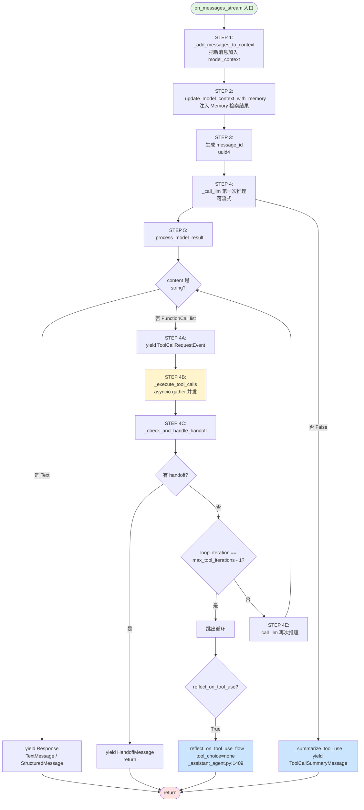
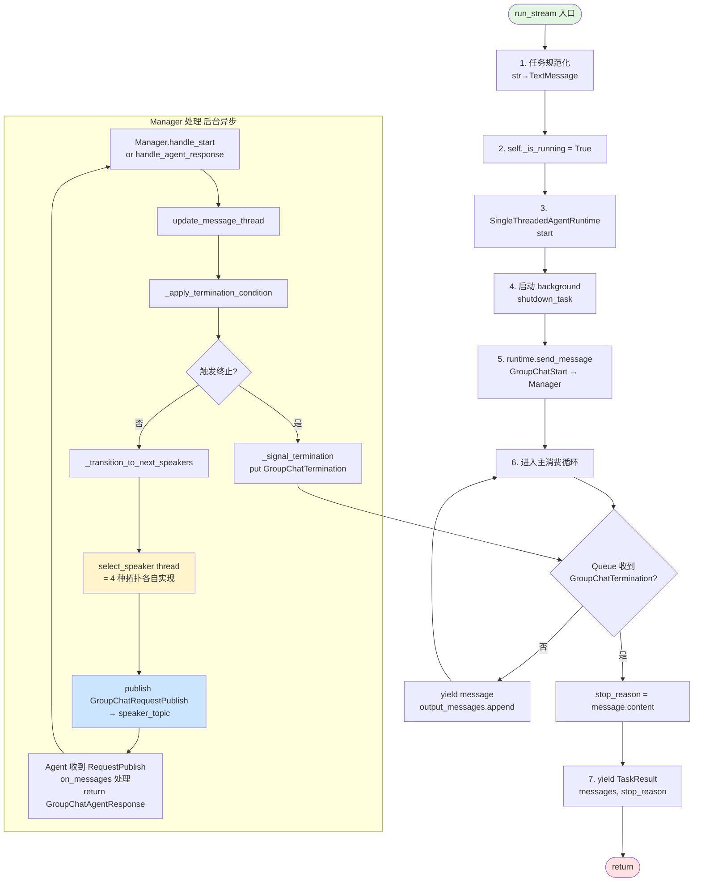
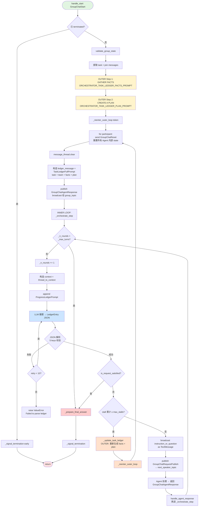
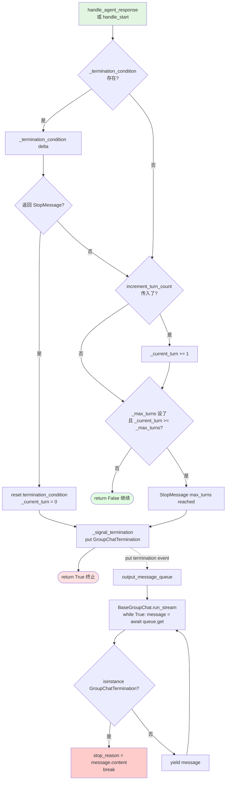
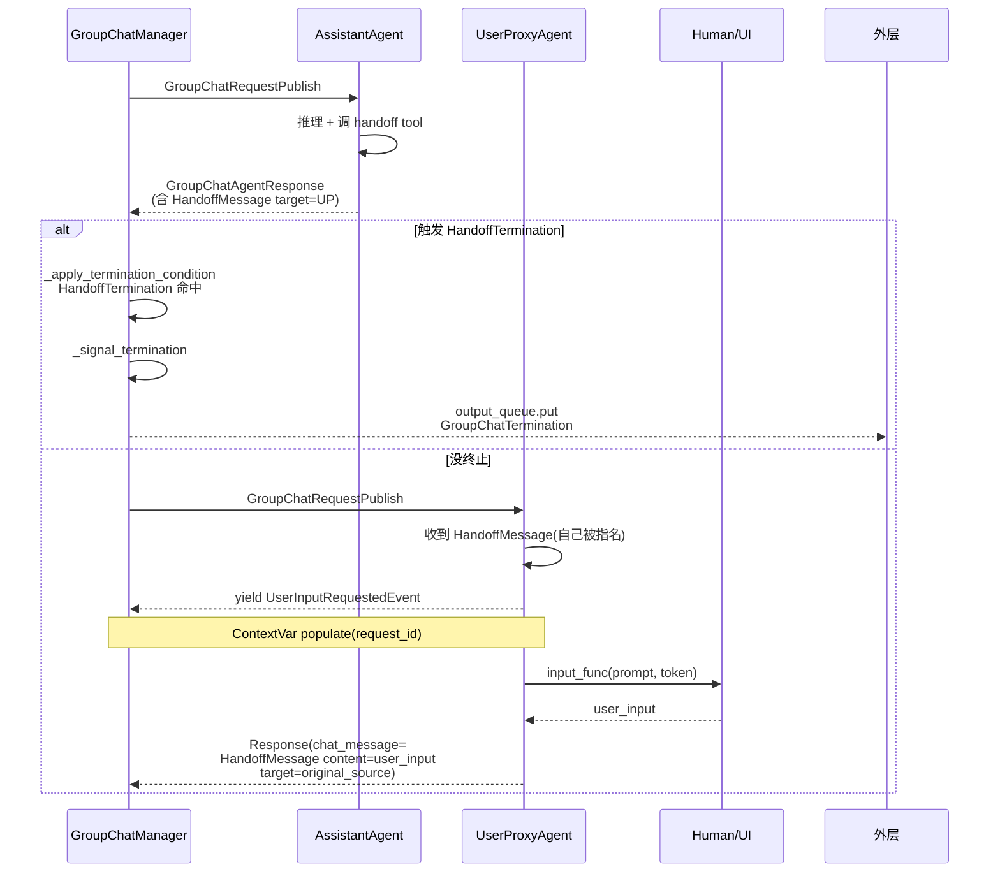
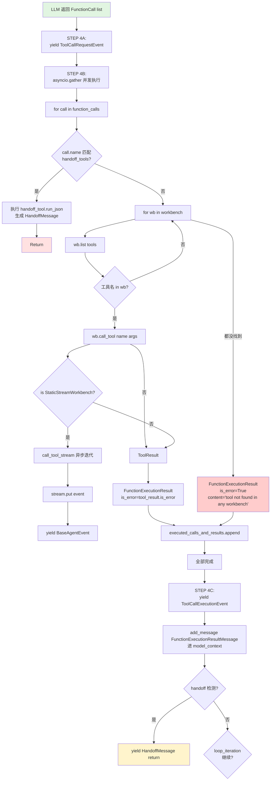
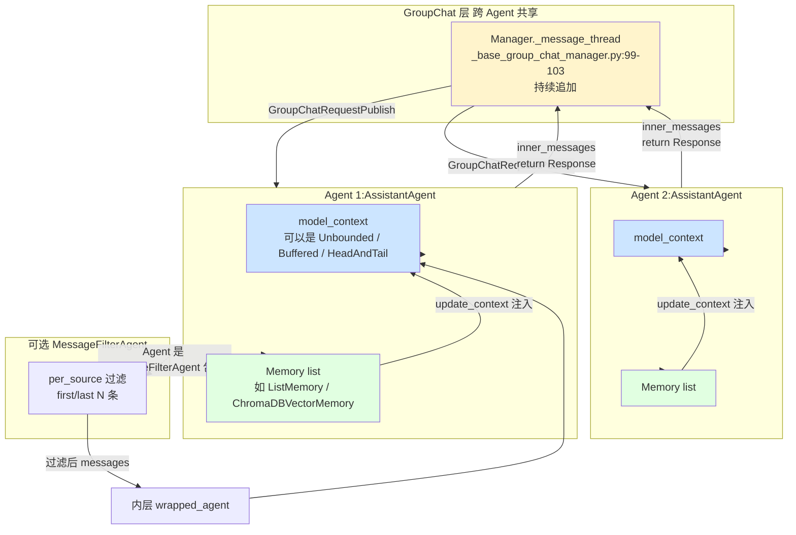

# AutoGen — Agent Loop 调研报告

> 调研对象:`microsoft/autogen`(v0.4+ 主分支,Python monorepo)
> 调研日期:2026-07-18
> 调研范围:`python/packages/autogen-core/`(运行时) + `python/packages/autogen-agentchat/`(Agent Chat 框架)
> 上游文档:见各源码文件行号引用

---

## 0. 智能体一句话定位

AutoGen 是微软系、**消息总线驱动的多 Agent 编排框架**。它把 Agent Loop 拆成两层:`autogen-core` 提供基于 **topic-based pub/sub + Component 序列化** 的运行时(runtime),`autogen-agentchat` 在其上构建对话型 Agent(`AssistantAgent` / `CodeExecutorAgent` / `UserProxyAgent` / `SocietyOfMindAgent` / `MessageFilterAgent`)和 5 种 GroupChat 拓扑(`RoundRobin` / `Selector` / `Swarm` / `MagenticOne` / `GraphFlow`)。Agent Loop = 消息路由 + Speaker 选举 + Termination 评估 + 可序列化的 Component 配置对象。

---

## 1. 调研依据

| 文件 / 模块 | 角色 |
|---|---|
| `python/packages/autogen-agentchat/src/autogen_agentchat/agents/_assistant_agent.py` | `AssistantAgent` 主 loop,tool call loop (`_process_model_result`),reflection flow |
| `python/packages/autogen-agentchat/src/autogen_agentchat/agents/_user_proxy_agent.py` | `UserProxyAgent` — 人类输入抽象(HITL) |
| `python/packages/autogen-agentchat/src/autogen_agentchat/agents/_code_executor_agent.py` | `CodeExecutorAgent` — 把代码执行后端包成可对话的 Agent |
| `python/packages/autogen-agentchat/src/autogen_agentchat/agents/_message_filter_agent.py` | `MessageFilterAgent` — context 过滤(per-source) |
| `python/packages/autogen-agentchat/src/autogen_agentchat/agents/_society_of_mind_agent.py` | `SocietyOfMindAgent` — 内部 RoundRobin + 外部总结(嵌套 sub-agent) |
| `python/packages/autogen-agentchat/src/autogen_agentchat/teams/_group_chat/_base_group_chat.py` | `BaseGroupChat` — GroupChat 通用 run/run_stream 入口 |
| `python/packages/autogen-agentchat/src/autogen_agentchat/teams/_group_chat/_base_group_chat_manager.py` | `BaseGroupChatManager` — Speaker 选举 + termination 评估 |
| `python/packages/autogen-agentchat/src/autogen_agentchat/teams/_group_chat/_round_robin_group_chat.py` | `RoundRobinGroupChat` |
| `python/packages/autogen-agentchat/src/autogen_agentchat/teams/_group_chat/_selector_group_chat.py` | `SelectorGroupChat`(LLM 选 Speaker) |
| `python/packages/autogen-agentchat/src/autogen_agentchat/teams/_group_chat/_swarm_group_chat.py` | `Swarm`(HandoffMessage 驱动) |
| `python/packages/autogen-agentchat/src/autogen_agentchat/teams/_group_chat/_magentic_one/_magentic_one_group_chat.py` | `MagenticOneGroupChat`(ledger 编排) |
| `python/packages/autogen-agentchat/src/autogen_agentchat/teams/_group_chat/_magentic_one/_magentic_one_orchestrator.py` | `MagenticOneOrchestrator` — Plan 模式(双重 ledger) |
| `python/packages/autogen-agentchat/src/autogen_agentchat/teams/_group_chat/_magentic_one/_prompts.py` | Magentic-One 的 7 个核心 prompt + `LedgerEntry` Pydantic |
| `python/packages/autogen-agentchat/src/autogen_agentchat/teams/_group_chat/_graph/_digraph_group_chat.py` | `GraphFlow`(有向图拓扑,experimental) |
| `python/packages/autogen-agentchat/src/autogen_agentchat/conditions/_terminations.py` | 10 种 TerminationCondition 实现 |
| `python/packages/autogen-core/src/autogen_core/_component_config.py` | `Component` 抽象 + `dump_component` / `load_component` |
| `python/packages/autogen-core/src/autogen_core/model_context/_buffered_chat_completion_context.py` | `BufferedChatCompletionContext`(滑动窗口) |
| `python/packages/autogen-core/src/autogen_core/model_context/_head_and_tail_chat_completion_context.py` | `HeadAndTailChatCompletionContext`(保留首尾) |
| `python/packages/autogen-core/src/autogen_core/model_context/_unbounded_chat_completion_context.py` | `UnboundedChatCompletionContext`(全量) |
| `python/packages/autogen-core/src/autogen_core/tools/_workbench.py` | `Workbench` ABC(工具沙箱) |
| `python/packages/autogen-agentchat/src/autogen_agentchat/agents/_base_chat_agent.py` | `BaseChatAgent` 抽象类 + `run` / `run_stream` |
| `python/packages/autogen-agentchat/src/autogen_agentchat/base/_termination.py` | `TerminationCondition` 接口 + `TerminatedException` |
| `README.md` 仓库根 | Microsoft Agent Framework 合并公告 + Magentic-One 引用论文 |

---

## 2. 九大问题回答

### Q1. Agent Loop 主流程

#### 1.1 AssistantAgent 主 loop(单 Agent)

**`AssistantAgent.on_messages_stream`**(`_assistant_agent.py:901-1015`)实现单 Agent 的 5 步主 loop:

```text
[STEP 1] _add_messages_to_context()           # 把新 user/handoff 消息加入 model_context
[STEP 2] _update_model_context_with_memory()  # 把 Memory 检索结果注入 model_context
[STEP 3] message_id = uuid4()                 # 生成 message_id 用于流式分块关联
[STEP 4] _call_llm()                          # 第一次 LLM 推理(可流式)
[STEP 5] _process_model_result()              # 处理工具调用循环
```

**`_process_model_result` 工具调用循环**(`_assistant_agent.py:1131-1315`):

```python
for loop_iteration in range(max_tool_iterations):  # 默认 max_tool_iterations=1
    # 1) 如果 LLM 返回 string content → 立刻返回 TextMessage / StructuredMessage
    if isinstance(current_model_result.content, str):
        yield Response(chat_message=TextMessage(...))
        return
    
    # 2) 否则 LLM 返回 FunctionCall 列表:
    # STEP 4A: yield ToolCallRequestEvent
    # STEP 4B: _execute_tool_calls() — 并发执行所有 tool call(asyncio.gather)
    #          → 走 Workbench.call_tool() 或 Handoff tool
    # STEP 4C: 检查 handoff(如果有 → 切换 Agent,return)
    # STEP 4D: if loop_iteration == max_tool_iterations-1: break
    # STEP 4E: _call_llm() 再次推理 → 继续循环
    
    # 循环结束后,根据 reflect_on_tool_use:
    if reflect_on_tool_use:    # 再次 LLM 推理(用 tool_choice="none"),生成自然语言总结
        _reflect_on_tool_use_flow()  # tool_choice="none",关闭工具(_assistant_agent.py:1409-1487)
    else:
        _summarize_tool_use()        # 直接 yield ToolCallSummaryMessage
```

**关键设计点**:

- **max_tool_iterations=1 默认值**(`_assistant_agent.py:85, 739`):单次推理-执行-返回,不循环。要"ReAct 风格"必须显式 `max_tool_iterations=5`(`_assistant_agent.py:400`)。
- **并发执行多个 tool call**(`_assistant_agent.py:1216-1217`):`asyncio.gather(*[cls._execute_tool_call(call, ...) for call in function_calls])`。
- **`reflect_on_tool_use` 默认 False**(`_assistant_agent.py` docstring),`output_content_type` 设置时**自动切到 True**。
- **handoff 中断**(`_assistant_agent.py:1321-1407`):tool call 名命中 `_handoffs` 字典 → 生成 `HandoffMessage` → 控制权转给目标 Agent。
- **streaming chunk 用 `asyncio.Queue` 协调**(`_assistant_agent.py:1195-1234`):`stream: asyncio.Queue` + `task = asyncio.create_task(_execute_tool_calls(...))` + 主协程 `while True: event = await stream.get()` 消费 → 工具结果边产生边 yield。

#### 1.2 GroupChat 主 loop(`BaseGroupChat` + `BaseGroupChatManager`)

**两层解耦架构**(`_base_group_chat.py:40-50, 247-348`):

- `BaseGroupChat` 是"外层门面",负责 `run` / `run_stream` 入口 + runtime 生命周期。
- `BaseGroupChatManager` 是"内层协调者",订阅 group topic + 调 `select_speaker()` + 评估 termination。

**`BaseGroupChat.run_stream()` 主循环**(`_base_group_chat.py:351-572`):

```python
async def run_stream(self, *, task, ...):
    # 1) 任务规范化:str → TextMessage;task list → List[BaseChatMessage]
    # 2) self._is_running = True  # 防重入
    # 3) 启动 SingleThreadedAgentRuntime(start_when_idle)
    # 4) 启动 background shutdown_task:
    #    async def stop_runtime():
    #        await self._runtime.stop_when_idle()
    #        await output_queue.put(GroupChatTermination(...))
    # 5) 触发主循环:
    await self._runtime.send_message(GroupChatStart(...), recipient=GroupChatManager)
    
    # 6) 消费 output_message_queue(直到收到 GroupChatTermination):
    while True:
        message = await self._output_message_queue.get()
        if isinstance(message, GroupChatTermination):
            stop_reason = message.message.content
            break
        yield message
        if not isinstance(message, ModelClientStreamingChunkEvent):
            output_messages.append(message)
    
    # 7) yield 最后一个 TaskResult(messages, stop_reason)
```

**`BaseGroupChatManager.handle_start()` / `handle_agent_response()`**(`_base_group_chat_manager.py:80-160`):

```text
handle_start(message: GroupChatStart):
    1. 检查 _termination_condition.terminated → 是则 early stop
    2. validate_group_state(messages)         # 子类可重写
    3. publish_message(messages) → group_topic # 广播给所有 participants
    4. update_message_thread(messages)        # 内部累积 thread
    5. _apply_termination_condition(messages) # 评估 termination
    6. _transition_to_next_speakers(token)    # 选下一个 Speaker

handle_agent_response(message: GroupChatAgentResponse | GroupChatTeamResponse):
    1. 从 message 抽出 delta(inner_messages + chat_message)
    2. update_message_thread(delta)           # 累积 thread
    3. _active_speakers.remove(message.name)  # 标记此 Speaker 已完成
    4. if 还有 active_speaker → 直接 return(等所有 active Speaker 说完)
    5. _apply_termination_condition(delta, increment_turn_count=True)
    6. _transition_to_next_speakers(token)    # 选下一个 Speaker

_transition_to_next_speakers(token):
    speaker_names = await self.select_speaker(self._message_thread)
    for speaker_name in speaker_names:
        await self.publish_message(GroupChatRequestPublish(), topic_id=DefaultTopicId(speaker_topic_type))
        self._active_speakers.append(speaker_name)
```

**`select_speaker` 是核心抽象方法**(`_base_group_chat_manager.py:223-241`):5 种拓扑各自实现,Manager 不知道具体选法,只看返回的 speaker name 列表。

#### 1.3 4 种拓扑对比(核心)

| 拓扑 | 文件 | Speaker 选举算法 | 是否支持嵌套 team | Plan 模式 | 何时退出 |
|---|---|---|---|---|---|
| **RoundRobinGroupChat** | `_round_robin_group_chat.py:54-72` | 轮询 `_next_speaker_index = (i+1) % N` | ✅ | ❌ | TerminationCondition / max_turns |
| **SelectorGroupChat** | `_selector_group_chat.py:152-219` | LLM 根据 `selector_prompt` 选(可 `selector_func` / `candidate_func` override) | ✅ | ❌ | TerminationCondition / max_turns |
| **Swarm** | `_swarm_group_chat.py:91-104` | 扫描 `HandoffMessage` 的 `target` 字段 | ❌ | ❌ | HandoffTermination / TerminationCondition |
| **MagenticOneGroupChat** | `_magentic_one_orchestrator.py:269-296` | LLM 通过 Progress Ledger 选(每轮)+ 内外双 ledger | ❌ | ✅ **Task Ledger + Progress Ledger** | ProgressLedger 判定 `is_request_satisfied` / `n_stalls >= max_stalls` 时 re-plan |
| **GraphFlow(5th)** | `_digraph_group_chat.py:458-470` | DAG 出度判定(`_ready` 队列 + activation group) | ❌ | ❌(DAG 本身就是 plan) | 队列空 + 没有 active 节点 |

> 实际上 4 种 + 1 种,共 5 种 GroupChat 拓扑,严格按"4 种"叙述是 RoundRobin / Selector / MagenticOne / Swarm,GraphFlow 是 experimental 5th。

#### 1.4 Mermaid 流程图

##### 1.4.1 AssistantAgent 单 Agent 主 loop



##### 1.4.2 GroupChat 主 loop(4 种拓扑共同骨架)



##### 1.4.3 4 种拓扑的 Speaker 选举对比

```mermaid
flowchart TD
    Mgr[BaseGroupChatManager.<br/>_transition_to_next_speakers] --> Sel[select_speaker thread]
    
    Sel --> Q1{哪种拓扑?}
    Q1 -->|RoundRobinGroupChat| RR[RoundRobinGroupChatManager.<br/>select_speaker]
    RR --> RR1[_next_speaker_index = i+1 mod N]
    RR1 --> RR2[返回 _participant_names i]
    
    Q1 -->|SelectorGroupChat| SelG[SelectorGroupChatManager.<br/>select_speaker]
    SelG --> SG1{selector_func 显式?<br/>_selector_group_chat.py:160}
    SG1 -->|是| SG2[调用 selector_func thread<br/>直接返回]
    SG1 -->|否| SG3{candidate_func 显式?}
    SG3 -->|是| SG4[调用 candidate_func thread<br/>过滤候选]
    SG3 -->|否| SG5[剔除 _previous_speaker<br/>如果 !allow_repeated_speaker]
    SG4 --> SG6
    SG5 --> SG6{候选数 > 1?}
    SG6 -->|是| SG7[_select_speaker LLM 推理<br/>max_selector_attempts 默认 3<br/>_selector_group_chat.py:232-302]
    SG6 -->|否| SG8[直接返回唯一候选]
    SG7 --> SG9[正则从输出中提取<br/>@ 提及的 speaker name<br/>_selector_group_chat.py:303-341]
    SG9 --> SG10[更新 _previous_speaker]
    SG2 --> SG10
    SG8 --> SG10
    
    Q1 -->|Swarm| Swarm[SwarmGroupChatManager.<br/>select_speaker]
    Swarm --> SW1{thread 为空?}
    SW1 -->|是| SW2[返回 _current_speaker<br/>初始为 _participant_names 0]
    SW1 -->|否| SW3[反向扫描 thread 找<br/>HandoffMessage]
    SW3 --> SW4[设置 _current_speaker = handoff.target]
    SW4 --> SW2
    
    Q1 -->|MagenticOne| Mag[MagenticOneOrchestrator.<br/>_orchestrate_step]
    Mag --> M1[构造 ProgressLedger prompt<br/>_orchestrate_step _magentic_one_orchestrator.py:294-320]
    M1 --> M2[LLM 推理返回 JSON<br/>LedgerEntry 结构]
    M2 --> M3[json_output=True 或<br/>extract_json_from_str]
    M3 --> M4{is_request_satisfied?}
    M4 -->|是| M5[_prepare_final_answer<br/>终止]
    M4 -->|否| M6{stall 累计 ≥ max_stalls?}
    M6 -->|是| M7[_update_task_ledger +<br/>_reenter_outer_loop<br/>outer 重新规划 plan]
    M6 -->|否| M8[广播 instruction_or_question<br/>+ next_speaker]
    M8 --> M9[publish GroupChatRequestPublish<br/>给 next_speaker]
    
    style Sel fill:#fff4cc
    style SG7 fill:#cce5ff
    style M1 fill:#cce5ff
    style M2 fill:#cce5ff
    style M7 fill:#ffe1cc
```

#### 1.5 关键代码片段

```python
# _assistant_agent.py:1149-1259 — Tool call loop 核心
for loop_iteration in range(max_tool_iterations):
    if isinstance(current_model_result.content, str):
        yield Response(chat_message=TextMessage(...))  # 文本直接返回
        return
    
    # STEP 4A: yield ToolCallRequestEvent
    inner_messages.append(tool_call_msg)
    yield tool_call_msg
    
    # STEP 4B: 并发执行工具
    task = asyncio.create_task(_execute_tool_calls(current_model_result.content, stream))
    while True:
        event = await stream.get()
        if event is None:
            break
        yield event
        inner_messages.append(event)
    executed_calls_and_results = await task
    
    # STEP 4C: handoff 检查
    handoff_output = cls._check_and_handle_handoff(...)
    if handoff_output:
        yield handoff_output
        return
    
    # STEP 4D: 末次迭代退出
    if loop_iteration == max_tool_iterations - 1:
        break
    
    # STEP 4E: 再次 LLM 推理
    async for llm_output in cls._call_llm(...):
        ...
        next_model_result = llm_output
    current_model_result = next_model_result

# 循环结束后,reflect or summarize
if reflect_on_tool_use:
    async for reflection_response in cls._reflect_on_tool_use_flow(...):
        yield reflection_response
```

```python
# _base_group_chat_manager.py:80-160 — GroupChat Manager 状态机
@rpc
async def handle_start(self, message: GroupChatStart, ctx):
    if self._termination_condition.terminated:
        await self._signal_termination(early_stop_message)
        return
    await self.validate_group_state(message.messages)
    await self.publish_message(GroupChatStart(messages=message.messages), topic_id=DefaultTopicId(group_topic))
    await self.update_message_thread(message.messages)
    if await self._apply_termination_condition(message.messages):
        return
    await self._transition_to_next_speakers(ctx.cancellation_token)

@event
async def handle_agent_response(self, message, ctx):
    delta = [inner_messages..., chat_message]
    await self.update_message_thread(delta)
    self._active_speakers.remove(message.name)
    if len(self._active_speakers) > 0:
        return  # 还有活跃 Speaker,继续等
    if await self._apply_termination_condition(delta, increment_turn_count=True):
        return
    await self._transition_to_next_speakers(ctx.cancellation_token)
```

---

### Q2. Plan 计划机制

**AutoGen 的 Plan 模式主要在 Magentic-One Orchestrator 里实现**——它是 AutoGen 唯一"显式有 plan"的拓扑。普通 4 种 GroupChat(RoundRobin / Selector / Swarm / GraphFlow)**没有 plan 模式**。

#### 2.1 Magentic-One 双 Ledger 架构

Magentic-One 来自 Microsoft Research 论文 [_Magentic-One: A Generalist Multi-Agent System for Solving Complex Tasks_](https://arxiv.org/abs/2411.04468)(Fourney et al., 2024),由 `MagenticOneOrchestrator`(`_magentic_one_orchestrator.py:47-90`)实现,**外层(Task Ledger)+ 内层(Progress Ledger)双重 plan**:

```text
┌─────────────────────────────────────────────────┐
│  Outer Loop: Task Ledger(整体规划)              │
│  - 何时进入:handle_start + stalls 超阈值         │
│  - 包含:facts(事实清单) + plan(执行计划)        │
│  - 更新:_update_task_ledger(只在 stall 时)     │
├─────────────────────────────────────────────────┤
│  Inner Loop: Progress Ledger(每轮进度)          │
│  - 何时进入:每轮 Agent 响应后                    │
│  - 包含:is_request_satisfied? / is_in_loop?     │
│          is_progress_being_made? / next_speaker  │
│          instruction_or_question                │
│  - 评估后:调 next_speaker 或 re-plan 或终止     │
└─────────────────────────────────────────────────┘
```

#### 2.2 Outer Loop(初始 + re-plan 时)

**`handle_start` 第一阶段**(`_magentic_one_orchestrator.py:160-198`):

```text
1. 提取 task = 拼接所有 message.content
2. GATHER FACTS:
   planning_conversation.append(UserMessage(facts_prompt))
   response = await model_client.create(context)
   self._facts = response.content
3. CREATE A PLAN:
   planning_conversation.append(UserMessage(plan_prompt))
   response = await model_client.create(context)
   self._plan = response.content
4. _reenter_outer_loop(token):
   ├─ for participant: await runtime.send_message(GroupChatReset(), recipient=participant)
   │  (重置所有 Agent 的内部 state)
   ├─ self._message_thread.clear()  # 清空消息线程
   ├─ 构造 ledger_message = TaskLedgerFullPrompt(task, team, facts, plan)
   │  (把 plan + facts 打包成一条 TextMessage 广播给所有 participant)
   ├─ publish_message(GroupChatAgentResponse(ledger_message), group_topic)
   └─ await self._orchestrate_step(token)  # 进入内层
```

**`ORCHESTRATOR_TASK_LEDGER_FACTS_PROMPT`**(`_prompts.py:8-31`):让 LLM 做 4 类事实清单(GIVEN / TO LOOK UP / TO DERIVE / EDUCATED GUESSES)。

**`ORCHESTRATOR_TASK_LEDGER_PLAN_PROMPT`**(`_prompts.py:35-39`):让 LLM 基于 team 组成产出 bullet-point plan,"there is no requirement to involve all team members"。

**`ORCHESTRATOR_TASK_LEDGER_FULL_PROMPT`**(`_prompts.py:43-58`):把 task + team + facts + plan 组合,作为整轮 message thread 的"宪法"。

#### 2.3 Inner Loop(每轮)

**`_orchestrate_step()` 主逻辑**(`_magentic_one_orchestrator.py:296-455`):

```text
1. if _n_rounds > _max_turns → _prepare_final_answer
2. _n_rounds += 1
3. context = self._thread_to_context()  # 收集历史 message thread
4. context.append(UserMessage(ProgressLedgerPrompt))
5. 调 LLM 推理,要求返回 LedgerEntry JSON 结构:
   {
     "is_request_satisfied": {"reason": str, "answer": bool},
     "is_in_loop": {"reason": str, "answer": bool},
     "is_progress_being_made": {"reason": str, "answer": bool},
     "next_speaker": {"reason": str, "answer": "<agent_name>"},
     "instruction_or_question": {"reason": str, "answer": str}
   }
   (Pydantic LedgerEntry 定义在 _prompts.py:96-102)
6. 验证 5 个 key 都在,否则 retry(最多 _max_json_retries=10 次)
7. 决策分支:
   - if is_request_satisfied.answer=True:
       _prepare_final_answer(reason) → 终止
   - elif _n_stalls >= _max_stalls:
       _update_task_ledger(token)  # 重新生成 facts + plan
       _reenter_outer_loop(token)  # 再次 outer reset
   - else:
       broadcast TextMessage(content=instruction_or_question)
       publish_message(GroupChatRequestPublish, next_speaker_topic)
```

#### 2.4 Stalls 计数

```python
# _magentic_one_orchestrator.py:421-432
if not progress_ledger["is_progress_being_made"]["answer"]:
    self._n_stalls += 1
elif progress_ledger["is_in_loop"]["answer"]:
    self._n_stalls += 1
else:
    self._n_stalls = max(0, self._n_stalls - 1)  # 进展顺利则减

if self._n_stalls >= self._max_stalls:  # max_stalls 默认 3
    await self._update_task_ledger(cancellation_token)
    await self._reenter_outer_loop(cancellation_token)
    return
```

**stall 检测 = "是否在原地打转"**,用 LLM 自我反思检测(reasoning 维度)+ 计数,达到阈值触发 outer re-plan,实现"自我纠错"。

#### 2.5 Mermaid 流程图:Magentic-One 双 Loop



#### 2.6 普通 4 种 GroupChat 的"Plan 等价物"

| 拓扑 | Plan 替代机制 |
|---|---|
| RoundRobinGroupChat | 顺序固定(plan = 硬编码顺序) |
| SelectorGroupChat | 每次 LLM 选 speaker(隐式动态 plan,无显式 ledger) |
| Swarm | `HandoffMessage.target` 显式指定下一个(plan = 消息内容) |
| GraphFlow | `DiGraph` 静态 DAG(plan = 图结构) |
| **MagenticOneGroupChat** | **Task Ledger + Progress Ledger 双重显式 plan** |

---

### Q3. Sub Agent — 4 种 GroupChat 拓扑详细分析

AutoGen 的"sub agent"有两种形态:**(1) Team 嵌套 Team** 和 **(2) Agent 作为 Speaker**。RoundRobin 和 Selector 支持 Team 嵌套,MagenticOne / Swarm 不支持。

#### 3.1 RoundRobinGroupChat(`_round_robin_group_chat.py`)

- **Speaker 算法**(`_round_robin_group_chat.py:67-72`):
  ```python
  async def select_speaker(self, thread):
      current_speaker_index = self._next_speaker_index
      self._next_speaker_index = (current_speaker_index + 1) % len(self._participant_names)
      return self._participant_names[current_speaker_index]
  ```
  **轮询 + 取模**,完全无 LLM,无 plan,无状态。  
  **reset 行为**(`_round_robin_group_chat.py:43-50`):重置 `_next_speaker_index = 0`、`_current_turn = 0`、`_message_thread.clear()`。
- **状态序列化**(`_round_robin_group_chat.py:52-63`):`RoundRobinManagerState(message_thread, current_turn, next_speaker_index)`,Pydantic 完整序列化。
- **嵌套 Team 支持**:`_base_group_chat.py:43-50` docstring 说"if a :class:`Team` is a participant, the messages from the team result will be published to other participants" — 即嵌套 Team 当成一个 speaker,Team 跑完一轮后其结果作为该 speaker 的 message 发回 RoundRobin。
- **典型用法**(docstring):`RoundRobinGroupChat([writer, reviewer, user_proxy], termination_condition=...)` 三 agent 轮询写/审/user 输入。

#### 3.2 SelectorGroupChat(`_selector_group_chat.py`)

- **Speaker 算法**(`_selector_group_chat.py:152-219`):
  1. 如果有 `selector_func`(用户显式 Python 函数),直接调用 → 覆盖 LLM 选 speaker。
  2. 如果有 `candidate_func`,用它过滤候选 agent 列表(可只让某些 agent 参与选择)。
  3. 如果都没有,默认剔除前一个 speaker(`_previous_speaker`,除非 `allow_repeated_speaker=True`)。
  4. 如果候选数 > 1,调 LLM 推理(`_select_speaker` L1160-302):用 `selector_prompt` 拼装 → LLM 返回含 `@<name>` 提及的文本 → 正则提取 speaker 名。
  5. 如果候选数 = 1,直接返回。
- **`_select_speaker` LLM 推理细节**(`_selector_group_chat.py:232-302`):
  - `select_speaker_prompt = self._selector_prompt.format(roles=roles, participants=str(participants), history=model_context_history)`
  - OpenAI family 用 `SystemMessage`,其他 family 用 `UserMessage`(`_selector_group_chat.py:240-244`)。
  - `max_selector_attempts=3`(`_selector_group_chat.py:616`),解析失败 → 重试,失败后用前一个 speaker。
  - 流式模式下 yield `SelectorEvent` 而不是 `ModelClientStreamingChunkEvent`(`_selector_group_chat.py:259-264`)。
- **selector_prompt 默认值**(`_selector_group_chat.py:599-614`):
  ```
  You are in a role play game. The following roles are available:
  {roles}
  ...
  Read the above conversation. Then select the next role from {participants} to play. Only return the role.
  ```
- **`_extract_speaker_mentions` 算法**(`_selector_group_chat.py:303-341`):正则从 LLM 输出中匹配 `@<name>`,按出现顺序排,转成 `Dict[str, int]` 计数。第一个有效提及(在 participants 中且不是 previous)被选为 next speaker。

#### 3.3 Swarm(`_swarm_group_chat.py`)

- **Speaker 算法**(`_swarm_group_chat.py:91-104`):
  ```python
  async def select_speaker(self, thread):
      if len(thread) == 0:
          return [self._current_speaker]  # 初始为 _participant_names[0]
      for message in reversed(thread):  # 倒序扫描
          if isinstance(message, HandoffMessage):
              self._current_speaker = message.target
              return [self._current_speaker]
      return self._current_speaker  # 没 handoff 则继续当前 speaker
  ```
  **完全由 HandoffMessage 驱动**——没有 LLM 选 speaker,没有轮询,纯"消息内容控制流"。
- **HandoffMessage 校验**(`_swarm_group_chat.py:54-77`):`validate_group_state` 检查 `message.target` 必须在 `_participant_names` 中,否则 raise `ValueError`。
- **不支持 Team 嵌套**(`_swarm_group_chat.py:155-156` docstring):"this group chat team does not support inner teams as participants"。
- **典型用法**:在 AssistantAgent 的 `handoffs=["Bob"]` 参数里显式声明可达 Agent,然后 Agent 在回答时**主动决定**调 handoff tool,产生 `HandoffMessage(target="Bob")` 切换控制权。
- **状态序列化**(`_swarm_group_chat.py:106-119`):`SwarmManagerState(message_thread, current_turn, current_speaker)`。

#### 3.4 MagenticOneGroupChat(`_magentic_one_group_chat.py` + `_magentic_one_orchestrator.py`)

见 Q2 详细分析。**核心特点**:
- LLM 通过 Progress Ledger 选 speaker。
- **双重 loop**(Outer 规划 / Inner 执行)。
- `select_speaker` 实际**不在 _orchestrate_step 走 LLM 选 speaker 的常规路径**(`_magentic_one_orchestrator.py:269-271`),而是把选 speaker 和下一步指令**合并到 progress_ledger 推理**里,单次 LLM 调用同时输出"下一个 speaker + 给它的话"。
- `LedgerEntry` Pydantic 模型(`_prompts.py:96-102`)用 `json_output=True` 让 LLM 直接返回结构化 JSON。

#### 3.5 (附)GraphFlow(`_digraph_group_chat.py`)

- **拓扑核心**:`DiGraph`(`_digraph_group_chat.py:115-185`),由 `DiGraphNode(name, edges, activation)` + `DiGraphEdge(target, condition, activation_group, activation_condition)` 组成。
- **边条件**(`_digraph_group_chat.py:84-99`):可以是字符串(子串匹配)或 callable(函数判断),决定下一节点是否激活。
- **Speaker 算法**(`_digraph_group_chat.py:458-470`):
  ```python
  async def select_speaker(self, thread):
      speakers = []
      while self._ready:  # _ready 队列
          speakers.append(self._ready.popleft())
      return speakers
  ```
  **DAG 出度判定 + activation group(all / any)**,完全静态拓扑。
- **`_ready` 队列管理**(`_digraph_group_chat.py:472-507`):每个节点维护 `self._triggered_activation_groups[speaker]` 集合,所有出边的 activation group 满足条件(全 all 满足 / 任 any 满足)才把目标加入 `_ready`。
- 标记为 **experimental**(`_digraph_group_chat.py:30-32, 117-119`),API 会变。

#### 3.6 5 种拓扑对比表

| 维度 | RoundRobin | Selector | Swarm | MagenticOne | GraphFlow |
|---|---|---|---|---|---|
| **Speaker 选举** | 轮询(纯 Python) | LLM(可被 `selector_func` 覆盖) | HandoffMessage.target | LLM(Progress Ledger) | DAG 出度 |
| **每次 LLM 调用数** | 0 | 1(选 speaker)+ N(各 agent 回答) | 0 | 1(Ledger)+ N | 0 |
| **Plan 模式** | ❌ | ❌ | ❌(HandoffMessage 是 plan 等价) | ✅ 双重 Ledger | ✅(DAG 本身就是 plan) |
| **嵌套 Team** | ✅ | ✅ | ❌ | ❌ | ❌ |
| **典型场景** | 固定流水线(写→审→修改) | 动态路由(谁懂让谁说) | 灵活委托(A 转 B 转 C) | 复杂任务分解 + 自我纠错 | 固定 DAG 工作流 |
| **停止条件** | TerminationCondition | TerminationCondition | HandoffTermination | ProgressLedger 判定 | 队列空 + 节点全完成 |
| **可序列化** | ✅ | ✅ | ✅ | ✅ | ✅(但 callable 边条件丢失) |

---

### Q4. Loop 退出机制 + Speaker 选举

#### 4.1 TerminationCondition 抽象(`_terminations.py` + `base/_termination.py`)

```python
# base/_termination.py
class TerminationCondition(ABC, ComponentBase[BaseModel]):
    @property
    @abstractmethod
    def terminated(self) -> bool: ...
    
    @abstractmethod
    async def __call__(self, messages: Sequence[BaseAgentEvent | BaseChatMessage]) -> StopMessage | None: ...
    
    @abstractmethod
    async def reset(self) -> None: ...
```

#### 4.2 10 种 TerminationCondition 实现(全部见 `_terminations.py`)

| 终止条件 | 触发条件 | 行号 |
|---|---|---|
| `StopMessageTermination` | 收到 `StopMessage` 类型消息 | `_terminations.py:23-54` |
| `MaxMessageTermination` | 累积 `BaseChatMessage` 数 ≥ `max_messages`(可含 `BaseAgentEvent`) | `_terminations.py:57-104` |
| `TextMentionTermination` | 任何(或指定 source)消息内容含特定字符串 | `_terminations.py:107-149` |
| `FunctionalTermination` | 自定义 Python 函数返回 True | `_terminations.py:152-220` |
| `TokenUsageTermination` | `max_total_token` / `max_prompt_token` / `max_completion_token` 任一超阈值 | `_terminations.py:223-289` |
| `HandoffTermination` | 收到 target 匹配的 `HandoffMessage` | `_terminations.py:292-334` |
| `TimeoutTermination` | 从 `__init__` 起 `time.monotonic() - start_time >= timeout_seconds` | `_terminations.py:337-377` |
| `ExternalTermination` | 外部代码显式调 `termination.set()` | `_terminations.py:380-422` |
| `SourceMatchTermination` | 指定 source list 中任一 Agent 回答 | `_terminations.py:425-467` |
| `TextMessageTermination` | 收到 `TextMessage`(可指定 source) | `_terminations.py:470-516` |
| `FunctionCallTermination` | 收到 `ToolCallExecutionEvent` 且 name 匹配 | `_terminations.py:519-575` |

> 严格说 11 种(加 `FunctionalTermination`),**`StopMessageTermination` 是 RoundRobin/Selector 的隐式 fallback**。

#### 4.3 Manager 的退出判定流程(`_base_group_chat_manager.py:178-217`)

```python
async def _apply_termination_condition(self, delta, increment_turn_count=False) -> bool:
    # 1) 用户显式 TerminationCondition
    if self._termination_condition is not None:
        stop_message = await self._termination_condition(delta)
        if stop_message is not None:
            await self._termination_condition.reset()
            self._current_turn = 0
            await self._signal_termination(stop_message)
            return True
    
    # 2) max_turns 兜底
    if increment_turn_count:
        self._current_turn += 1
    if self._max_turns is not None and self._current_turn >= self._max_turns:
        stop_message = StopMessage(content=f"Maximum number of turns {self._max_turns} reached.", source=self._name)
        if self._termination_condition:
            await self._termination_condition.reset()
        self._current_turn = 0
        await self._signal_termination(stop_message)
        return True
    return False
```

**关键点**:
- **优先用户 TerminationCondition**,再 `max_turns` 兜底。
- **触发后立即 `reset()` 终止条件 + `_current_turn = 0`**,保证下一次 group chat 干净。
- **触发后 `_signal_termination` 投到 `output_message_queue`**,被外层 `run_stream` 的 `while True` 消费到,然后 `break`。
- **重入保护**:`_apply_termination_condition` 反复触发时,`self._termination_condition.terminated=True`,下次 `handle_start` 立刻 early stop(`_base_group_chat_manager.py:88-95`)。

#### 4.4 Speaker 选举机制汇总(4+1 拓扑)

```text
BaseGroupChatManager._transition_to_next_speakers(token):
    speaker_names = await self.select_speaker(self._message_thread)
    for speaker_name in speaker_names:
        if speaker_name not in self._participant_name_to_topic_type:
            raise RuntimeError("Speaker {speaker_name} not found")
        await self._log_speaker_selection(speaker_names)  # emit SelectSpeakerEvent
        await self.publish_message(GroupChatRequestPublish(), topic_id=DefaultTopicId(speaker_topic_type))
        self._active_speakers.append(speaker_name)
```

**`_active_speakers` 列表**:`handle_agent_response` 中**先 remove message.name,再判断 `len(active_speakers) > 0` 是否 return**,确保**并行多 Speaker** 场景下所有活跃 Speaker 都说完再选下一个(`_base_group_chat_manager.py:147-150`)。

**Speaker 选举是抽象方法**(`_base_group_chat_manager.py:223-241`):5 种 Manager 各自实现,Manager 基类**完全不知道**选举算法,只看返回的 name 列表。

#### 4.5 Mermaid 流程图:Termination 判定



---

### Q5. Ask 模式(GroupChat 里 ask user agent)

**GroupChat 中"ask user"的标准模式 = `UserProxyAgent` + `HandoffTermination`**。

#### 5.1 UserProxyAgent 的工作机制(`_user_proxy_agent.py`)

- **构造参数**(`_user_proxy_agent.py:163-168`):`name`, `description`, `input_func: Optional[InputFuncType]`(默认 `cancellable_input = asyncio.to_thread(input, prompt)`)。
- **`on_messages_stream` 核心逻辑**(`_user_proxy_agent.py:199-237`):
  ```python
  async def on_messages_stream(self, messages, cancellation_token):
      # 1) 检查 Handoff(如果上一条是 HandoffMessage 且 target=self.name)
      handoff = self._get_latest_handoff(messages)
      prompt = f"Handoff received from {handoff.source}. Enter your response: " if handoff else "Enter your response: "
      
      # 2) yield UserInputRequestedEvent(request_id=uuid4, source=self.name)
      input_requested_event = UserInputRequestedEvent(request_id=request_id, source=self.name)
      yield input_requested_event
      
      # 3) populate_context(request_id) — ContextVar 注入 request_id
      with UserProxyAgent.InputRequestContext.populate_context(request_id):
          user_input = await self._get_input(prompt, cancellation_token)
      
      # 4) 根据是否有 handoff,返回 HandoffMessage 或 TextMessage
      if handoff:
          yield Response(chat_message=HandoffMessage(content=user_input, target=handoff.source, source=self.name))
      else:
          yield Response(chat_message=TextMessage(content=user_input, source=self.name))
  ```
- **`produced_message_types` 属性**(`_user_proxy_agent.py:178-180`):声明 `UserProxyAgent` **能产生 `TextMessage` 和 `HandoffMessage` 两种**,所以它在 GroupChat 中**既能"说"又能"转交"**。
- **ContextVar 模式**(`_user_proxy_agent.py:113-141`):`InputRequestContext._INPUT_REQUEST_CONTEXT_VAR: ContextVar[str]`,在 input_func 调用期间注入 request_id,让回调函数拿到当前请求 ID,用于 Web UI(SSE / WebSocket) 关联"哪个 input 框对应哪个 event"。

#### 5.2 Web 集成模式

- **`input_func` 替换为 Web/UI 回调**(`_user_proxy_agent.py:18-23`):
  - FastAPI:`agentchat_fastapi` sample — 收到 SSE event 时推给前端,WebSocket 收到用户输入后用 `asyncio.Future` 喂回 `input_func`。
  - ChainLit:`agentchat_chainlit` sample — 同上,UI 层 ChainLit 集成。
- **`cancellable_input` 实现**(`_user_proxy_agent.py:24-29`):
  ```python
  async def cancellable_input(prompt, cancellation_token):
      task = asyncio.create_task(asyncio.to_thread(input, prompt))
      if cancellation_token is not None:
          cancellation_token.link_future(task)  # 关键:把 task 链接到 token
      return await task
  ```
  **`link_future` 是 AutoGen 的"取消传播"机制**:Web 用户关掉对话框 → token 取消 → task 取消 → `input()` 阻塞被打破 → 抛 `CancelledError` → 整个 GroupChat 的 agent loop 也跟着 cancel。

#### 5.3 与 GroupChat 配合的标准模式

**`HandoffTermination(target="user_proxy")`**(典型用法,见 `_swarm_group_chat.py:177-194` docstring):

```python
termination = HandoffTermination("user_proxy")
team = Swarm([agent1, agent2], termination_condition=termination)
stream = team.run_stream(task=HandoffMessage(content="...", target="user_proxy", source="user"))
```

**`SourceMatchTermination(sources=["user_proxy"])`**(`_terminations.py:425-467`):当 user_proxy 回答后即终止,适合"问一次就好"场景。

**外层 user + 内层 review team 嵌套**(典型用法,见 `_round_robin_group_chat.py:300-340` docstring):

```python
team = RoundRobinGroupChat(
    [
        # 内层 team:writer + reviewer, 最多 4 条消息
        RoundRobinGroupChat([writer, reviewer], termination_condition=MaxMessageTermination(max_messages=4)),
        # 外层:内层 team + user_proxy
        user_proxy,
    ],
    termination_condition=TextMentionTermination("exit", sources=["user_proxy"]),
)
```

#### 5.4 Mermaid 流程图:UserProxyAgent ask 模式



---

### Q6. Human-in-the-Loop (HITL)

AutoGen 的 HITL 能力**完全在 `UserProxyAgent` 里**,但有 3 种风格:

#### 6.1 风格 A:UserProxyAgent 直接作为 Speaker

**`RoundRobinGroupChat([..., user_proxy, ...], termination_condition=...)`**

- UserProxyAgent 收到 `GroupChatRequestPublish` → `on_messages_stream` → `input()` 阻塞等待 → 用户输入 → 产 TextMessage 回到 group。
- **典型超时模式**:`input_func` 自带 timeout(否则 group chat 卡死),`cancellation_token.link_future()` 触发取消传播。

#### 6.2 风格 B:HandoffMessage 控制

**`HandoffTermination(target="user_proxy")` + `Swarm([agents..., user_proxy])`**

- AssistantAgent **主动决定**调 handoff tool → 产生 `HandoffMessage(target="user_proxy")`。
- 两种后续行为:
  - **触发 HandoffTermination**(target 匹配 user_proxy)→ group 终止 → 把控制权还回应用层 → 用户慢慢回复 → 后续用 `HandoffMessage` resume。
  - **不触发 termination**(target 不匹配 / 没 termination)→ 切到 user_proxy → 阻塞 input。

**文档明确推荐**(`_user_proxy_agent.py:55-66`):
> "For typical use cases that involve slow human responses, it is recommended to use termination conditions such as `HandoffTermination` or `SourceMatchTermination` to stop the running team and return the control to the application. You can run the team again with the user input. This way, the state of the team can be saved and restored when the user responds."

即 **"hitl + save_state + 异步 user reply + load_state"** 是推荐模式。

#### 6.3 风格 C:ExternalTermination(纯外部控制)

**`ExternalTermination()`**(`_terminations.py:380-422`):
- 应用层启动 group chat 在 background task。
- 任意时刻调 `termination.set()` → 下次 `_apply_termination_condition` 触发 → 终止。
- 适合"我有一个 Web UI,用户随时点 Stop 按钮"。

#### 6.4 状态保存/恢复

所有 Manager 都支持 `save_state` / `load_state`(`_base_group_chat.py:770-810`):
- `RoundRobinGroupChatManager.save_state`(`_round_robin_group_chat.py:52-57`):返回 `RoundRobinManagerState(message_thread, current_turn, next_speaker_index)`。
- `SelectorGroupChatManager.save_state`(`_selector_group_chat.py:121-133`):`SelectorManagerState(..., previous_speaker)`。
- `SwarmGroupChatManager.save_state`(`_swarm_group_chat.py:106-113`):`SwarmManagerState(..., current_speaker)`。
- `MagenticOneOrchestrator.save_state`(`_magentic_one_orchestrator.py:222-238`):**含 task + facts + plan + n_rounds + n_stalls** 5 个 Plan 状态。

**HITL 模式**:
```python
state = await team.save_state()  # 序列化到文件
# 用户慢慢回复...
team = Swarm.load_component(saved_config)
await team.load_state(state)      # 恢复 group + Plan 状态
# 继续 group
```

#### 6.5 状态序列化基础设施

- **`_base_group_chat.py:797-810`**:团队 save_state / load_state 走 Pydantic `BaseGroupChatManagerState`(`state/_group_chat_manager.py`)。
- **`_base_group_chat.py:782-795`**:警告"在 team running 时 save_state 可能不一致"。

---

### Q7. 工具调用权限

AutoGen 的工具调用权限模型基于 **`Workbench` 抽象**(`_workbench.py`),不是传统"白/黑名单",而是**"工具来源控制 + 沙箱封装"**的组合。

#### 7.1 Workbench 抽象(`autogen-core/tools/_workbench.py`)

```python
class Workbench(ABC, ComponentBase[BaseModel]):
    async def list_tools(self) -> List[ToolSchema]: ...
    async def call_tool(self, name, arguments, cancellation_token, call_id) -> ToolResult: ...
    async def start(self) -> None: ...       # 启动资源(连 MCP server)
    async def stop(self) -> None: ...        # 释放资源
    async def reset(self) -> None: ...       # 清状态
    async def save_state(self) -> Mapping[str, Any]: ...
    async def load_state(self, state) -> None: ...
```

**Workbench 本身 = 工具沙箱**。每个 workbench 决定"我能调用哪些工具"、"调用参数校验"、"调用结果如何包装"。

#### 7.2 三种主要 Workbench 实现

| Workbench | 路径 | 工具来源 | 权限控制点 |
|---|---|---|---|
| `StaticWorkbench` | `autogen-core/tools/_static_workbench.py` | 固定 Python 工具列表(构造时传入) | 工具列表在构造时锁死,运行时不变 |
| `StaticStreamWorkbench` | `autogen-core/tools/_static_workbench.py` | 同上,流式返回事件 | 同上 + 支持 tool call 过程流式 yield |
| `McpWorkbench` | `autogen-ext/tools/mcp/_workbench.py` | 外部 MCP server(`StdioServerParams` / `SseServerParams` / `StreamableHttpServerParams`) | MCP server 决定可调用工具集,AutoGen 透传 |
| `HttpTool` | `autogen-ext/tools/http/_http_tool.py` | 单个 HTTP endpoint | HTTP endpoint 本身,AutoGen 只包 schema |

**AssistantAgent 同时支持 `tools=[...]` 和 `workbench=[...]`**(`_assistant_agent.py:75-80`):`tools` 字段用 Pydantic `ComponentModel` 序列化,`workbench` 字段也用 Pydantic,运行时都包成 `Workbench` 实例。

#### 7.3 三种"权限"语义

**A. **源控制(Workbench 粒度)**:在 AssistantAgent 构造时指定 `[Workbench 实例列表]`,`_execute_tool_call`(`_assistant_agent.py:1536-1620`)逐个 workbench 查 `list_tools()` 找匹配:

```python
# _assistant_agent.py:1573-1618
for wb in workbench:
    tools = await wb.list_tools()
    if any(t["name"] == tool_call.name for t in tools):
        # 找到就调 wb.call_tool(...)
        ...
        return (tool_call, FunctionExecutionResult(...))

return (tool_call, FunctionExecutionResult(content=f"Error: tool '{tool_call.name}' not found in any workbench", is_error=True))
```

**没有 workbench 含此 tool → 报 error**。即权限=白名单(workbench 列表)。

**B. **运行隔离(`McpWorkbench` 的反向通道 + subprocess)**:MCP 工具在独立子进程或远端 HTTP server 中运行,AutoGen 进程只发 JSON-RPC 调用,**不具备直接访问权限**(类似 MCP 设计哲学)。

**C. **Workbench 内 Handoff 工具(Agent 间切换)**:每个 AssistantAgent 可声明 `handoffs=["Bob", "Alice"]` → 内部转成 `handoff_tools: List[BaseTool]`,`_execute_tool_call`(`_assistant_agent.py:1565-1572`)先于 workbench 检查:

```python
for handoff_tool in handoff_tools:
    if tool_call.name == handoff_tool.name:
        result = await handoff_tool.run_json(arguments, cancellation_token, call_id=tool_call.id)
        ...
```

handoff tool **不是 workbench 工具**,而是 Agent 切换机制,绕过 workbench 权限检查。

#### 7.4 重要:没有传统"审批"层

- **没有 `approval_required` 这种字段**——工具调用的"是否需要人确认"由用户在 `input_func` 层面实现(Web UI 弹确认框),或 workbench 自己实现。
- **没有 `permission_profile` 字段**(对比 OpenAI Codex CLI 的 3 种权限模式)。
- **没有 OS-level sandbox 集成**(对比 OpenAI Codex 的 macOS Seatbelt / Linux Landlock)。
- 工具调用失败的唯一兜底:`FunctionExecutionResult(is_error=True, content=...)`(`_assistant_agent.py:1548-1554`),LLM 在下轮推理中能看到 `is_error`,可决定重试或换路径。

#### 7.5 tool call 三大事件流

`_assistant_agent.py:1180-1234`:

```text
ToolCallRequestEvent(content=function_calls)  # LLM 决定要调的工具
  ↓
[asyncio.gather 并发执行所有 tool call]
  ↓
[可选] 中间流式事件(BaseAgentEvent)—— StaticStreamWorkbench 支持
  ↓
ToolCallExecutionEvent(content=exec_results)  # 全部 tool 调完的结果汇总
  ↓
FunctionExecutionResultMessage 加入 model_context  # 用于下轮 LLM 推理
```

#### 7.6 Mermaid 流程图:Workbench 工具调用



---

### Q8. 上下文压缩和摘要

AutoGen 的上下文管理分 **3 层**:

#### 8.1 第 1 层:ModelContext(单 Agent 内部,`_assistant_agent.py:33-37`)

```python
from autogen_core.model_context import (
    ChatCompletionContext,
    UnboundedChatCompletionContext,
)
```

**3 种内置实现**:

| Context 类型 | 文件 | 行为 |
|---|---|---|
| `UnboundedChatCompletionContext` | `autogen-core/model_context/_unbounded_chat_completion_context.py` | 全量累积,不裁剪 |
| `BufferedChatCompletionContext` | `autogen-core/model_context/_buffered_chat_completion_context.py` | 滑动窗口,只保留最近 N 条(`buffer_size=2` 例子见 `_assistant_agent.py:286-298` docstring) |
| `HeadAndTailChatCompletionContext` | `autogen-core/model_context/_head_and_tail_chat_completion_context.py` | 保留首 N + 尾 M(用于"首条 system + 最近对话") |
| 自定义 | 用户继承 `ChatCompletionContext` | 例:`ReasoningModelContext`(`_assistant_agent.py:330-348` docstring)过滤掉 R1 模型的 `thought` 字段 |

**用法**(`_assistant_agent.py:286-298`):
```python
model_context = BufferedChatCompletionContext(buffer_size=2)
agent = AssistantAgent("assistant", model_client=model_client, model_context=model_context)
```

**管理路径**:
- `await model_context.add_message(message)` —— AssistantAgent 在 STEP 1 和 tool call 完成后调用(`_assistant_agent.py:949, 1240`)。
- `messages = await model_context.get_messages()` —— AssistantAgent 在每次 LLM 推理前调用(隐式在 `_call_llm` 里)。
- **不是"自动压缩",而是"换 context 实现"** —— AutoGen 把策略外置成 `ChatCompletionContext` 子类,用户可自定义。

#### 8.2 第 2 层:Memory(长期 + 检索,`_assistant_agent.py:761-789`)

**`Memory` 抽象**(`autogen-core/memory/_memory.py`):
```python
class Memory(ABC, ComponentBase[BaseModel]):
    async def update_context(self, model_context, ...) -> UpdateContextResult: ...
    async def add(self, content: MemoryContent) -> None: ...
    async def query(self, query: str) -> List[MemoryContent]: ...
    async def clear(self) -> None: ...
```

**AssistantAgent 集成**(`_assistant_agent.py:761-789`):
```python
async def _update_model_context_with_memory(self, memory, model_context, agent_name):
    if not memory: return
    # 调每个 memory.update_context
    update_result = await memory.update_context(model_context)
    inner_messages = []
    for event_msg in update_result.events:  # MemoryQueryEvent 等
        inner_messages.append(event_msg)
        yield event_msg
```

**典型实现**:
- `ListMemory`(`autogen-core/memory/_list_memory.py`):in-memory,Docstring example(`_assistant_agent.py:307-332`)。
- `ChromaDBVectorMemory`(`autogen-ext/memory/chromadb/_chromadb.py`):RAG 风格向量检索,默认持久化到 `~/.chromadb_autogen`(详见 `file_backend.md` Q1.1)。
- `TextCanvasMemory`(`autogen-ext/memory/canvas/_text_canvas.py`):纯内存文件画布,Agent 共享"工作笔记"。

**关键**:`Memory.update_context` 把检索结果**直接注入 model_context**——即 LLM 下次推理时能看到 memory 检索内容,但不修改原始历史。

#### 8.3 第 3 层:GroupChat 消息线程(跨 Agent 共享,`_base_group_chat_manager.py:99-103, 218-220`)

```python
# _base_group_chat_manager.py
self._message_thread: List[BaseAgentEvent | BaseChatMessage] = []  # Manager 维护的全局 thread

async def update_message_thread(self, messages):
    self._message_thread.extend(messages)  # 持续追加
```

**Manager 累积整个 GroupChat 的全部消息**,传给 `select_speaker(thread)` 让选举算法看完整历史。

**问题**:
- **没有自动压缩**——`_message_thread` 一直追加,只受 `max_turns` 兜底或 `TokenUsageTermination` 限制。
- SelectorGroupChat 内部有**额外的 `_model_context`**(`_selector_group_chat.py:147-150`),只往里加 `BaseChatMessage`(过滤掉 `BaseAgentEvent`),用于 LLM 选 speaker 的 prompt 拼接,**是 SelectorGroupChat 的"内部压缩"**。

**MagenticOne 特殊处理**(`_magentic_one_orchestrator.py:506-525`):
```python
def _thread_to_context(self) -> List[LLMMessage]:
    context = []
    for m in self._message_thread:
        if isinstance(m, ToolCallRequestEvent | ToolCallExecutionEvent):
            continue  # 跳过 tool call 事件,只留 text/handoff
        elif isinstance(m, StopMessage | HandoffMessage):
            context.append(UserMessage(content=m.content, source=m.source))
        elif m.source == self._name:
            context.append(AssistantMessage(content=m.content, source=m.source))
        else:
            context.append(UserMessage(content=m.content, source=m.source))
    return context
```
**手动过滤** ToolCall 事件,只留 text/handoff 给 Orchestrator 推理用。

#### 8.4 context 管理的"洋葱"

```text
┌─────────────────────────────────────────────────────┐
│  GroupChat 共享 _message_thread(全局)               │
│  └─ 各 Agent 独立 _model_context(单 Agent 内部)     │
│     └─ 推理时 _call_llm 拼装 system + context      │
│        └─ Memory.update_context 注入检索结果         │
│           └─ 原始 LLM messages                      │
└─────────────────────────────────────────────────────┘
```

**没有跨 Agent 共享 context 机制**——每个 Agent 自己的 `model_context`,Manager 只共享"消息流"。

#### 8.5 MessageFilterAgent(实验性"中间人"过滤)

**`_message_filter_agent.py:75-80` docstring**:
> "A wrapper agent that filters incoming messages before passing them to the inner agent. ... This is useful in scenarios like multi-agent workflows where an agent should only process a subset of the full message history—for example, only the last message from each upstream agent, or only the first message from a specific source."

**`MessageFilterConfig`**(`_message_filter_agent.py:21-23`):
```python
class PerSourceFilter(BaseModel):
    source: str
    position: Optional[Literal["first", "last"]] = None
    count: Optional[int] = None
```

**典型用法**(`_message_filter_agent.py:46-58` docstring):GraphFlow 中 A → B → A → B → C 循环时,A 只看 user + B 的最后 1 条,B 看 user + A 最后 1 条 + 自己之前的回复,C 看 user + B 最后 1 条。

**注意**:标记为 **experimental**(`_message_filter_agent.py:39-40` docstring)。

#### 8.6 SocietyOfMindAgent(嵌套 RoundRobin + 总结)

`_society_of_mind_agent.py`:**内部 1 个 RoundRobin 群组,每轮结束后把结果"总结"为 1 条 message 给外部**——这本身就是一种"压缩"机制,把多轮内部讨论压缩成单条外发 message。

#### 8.7 Mermaid 流程图:Context 三层架构



---

### Q9. 其他亮点

#### 9.1 Pydantic `Component` 完美序列化

**`autogen-core/_component_config.py`** 定义 `Component[ConfigType]` 抽象:
```python
class Component(Generic[ConfigT], ABC, ComponentBase[ConfigT]):
    component_type: ClassVar[str] = "..."
    component_provider_override: ClassVar[str] = "..."
    component_config_schema: ClassVar[type[BaseModel]] = ...
    
    @abstractmethod
    def _to_config(self) -> ConfigT: ...
    
    @classmethod
    @abstractmethod
    def _from_config(cls, config: ConfigT) -> Self: ...
    
    def dump_component(self) -> ComponentModel:
        return ComponentModel(
            provider=self.component_provider_override,
            component_type=self.component_type,
            config=self._to_config().model_dump(),
        )
    
    @classmethod
    def load_component(cls, model: ComponentModel) -> Self:
        config_cls = cls.component_config_schema
        return cls._from_config(config_cls.model_validate(model.config))
```

**好处**:
- **全栈 Pydantic 序列化**:Agent / Team / ModelClient / Workbench / TerminationCondition / Tool 全部继承 `Component`,**统一 dump/load** 机制。
- **`ComponentModel` 是统一抽象**:`provider` 字段是全限定类名,`component_type` 是种类,`config` 是 Pydantic dict。
- **所有 Manager 的 state 都 Pydantic**:`RoundRobinManagerState` / `SelectorManagerState` / `SwarmManagerState` / `MagenticOneOrchestratorState`。
- **Studio 序列化依赖此**:`component-schema-gen` 包根据这些 Component 类生成 JSON Schema,给 Studio Web UI 用。

**反例**:`SelectorGroupChat` 的 `selector_func`(`_selector_group_chat.py:355`)—— `ComponentModel | None` 字段注释了 `# selector_func: ComponentModel | None` 但**实际序列化时被注释掉**(`_selector_group_chat.py:694`:`# selector_func=self._selector_func.dump_component() if self._selector_func else None`)。
**不可序列化的字段(回调函数 / callable)在 Pydantic 里被排除**,这在 `DiGraphEdge`(`_digraph_group_chat.py:78-82`)也出现过——`condition: Callable` 通过 Pydantic `Field(exclude=True)` 拆出到 `condition_function` 私有字段,序列化时丢弃。

#### 9.2 4 种 GroupChat 拓扑(实际 5 种)

已在上文详细分析。**核心差异化**:
- **RoundRobin**:零 LLM 开销,流水线风格
- **Selector**:1 次 LLM/轮(选 speaker),动态路由
- **Swarm**:零 LLM 开销(选 speaker),HandoffMessage 驱动
- **MagenticOne**:2 次 LLM/轮(Ledger + 回答),双层 plan,自我纠错
- **GraphFlow**:零 LLM 开销(选 speaker),DAG 静态拓扑

#### 9.3 内置代码执行与验证

`autogen-ext/code_executors/` 下有 3 种代码执行后端(详见 `tool_channel.md` / `file_backend.md`):
- `LocalCommandLineCodeExecutor`(`autogen-ext/code_executors/local/__init__.py`):本地子进程,`work_dir` 懒创建。
- `DockerCommandLineCodeExecutor`(`autogen-ext/code_executors/docker/_docker_code_executor.py`):容器化,`bind_dir` 和 `work_dir` 可分离。
- `JupyterCodeExecutor`(`autogen-ext/code_executors/jupyter/_jupyter_code_executor.py`):Jupyter kernel。

**`CodeExecutorAgent`**(`_code_executor_agent.py`):把 `CodeExecutor` 包成可对话的 Agent,典型用法:AssistantAgent 生成代码 → CodeExecutorAgent 执行 → 结果回传 AssistantAgent → 验证(AssertionError 时回灌 LLM 重写)。

#### 9.4 已被并入 Microsoft Agent Framework

仓库根 `README.md` 公告:
> "AutoGen is also available in Microsoft Agent Framework — a comprehensive .NET + Python framework for building production-grade multi-agent systems."

即 **AutoGen v0.4+ 是 Agent Framework 的 Python 参考实现**,dotnet 包是 .NET 参考实现。Microsoft Agent Framework = AutoGen 演进版本,长期看 AutoGen 会被并入,但当前仍然是活跃维护。

#### 9.5 `work_dir == cwd` deprecated

**`autogen-ext/code_executors/local/__init__.py:178-183`**:
```python
if work_dir.resolve() == Path.cwd().resolve():
    warnings.warn(
        "LocalCommandLineCodeExecutor.work_dir is set to the current working directory. "
        "This can cause unexpected behavior in some environments. "
        "Consider using a dedicated directory.",
        DeprecationWarning,
        stacklevel=2,
    )
```

**设计意图**:**显式禁止让 Agent 工作区 = 当前工作目录**。理由是 Agent 写文件到 cwd 会污染用户项目 + git,违反"agent 元数据与项目数据分离"原则。
**强制用户传明确 `work_dir` 或接受 `tempfile.TemporaryDirectory()` 兜底**。

#### 9.6 其他细节亮点

- **MessageFactory**(`messages.py`):统一消息序列化/反序列化,`custom_message_types` 字段允许用户注册自定义消息类型(防止 Pydantic 不知道如何 dump 未知类型)。
- **HandoffMessage + Handoff Tool 双轨制**:AssistantAgent 通过 `handoffs=["Bob"]` 字段声明可达 Agent → 内部转成 `handoff_tools: List[BaseTool]`(`_assistant_agent.py:771-776`)。`HandoffMessage` 既是消息类型(可在 thread 中携带)又是 Tool(可在 tool call 中触发)。
- **`save_state` / `load_state` 在所有 Manager 上都有**——HITL / 中断恢复的基础设施。
- **`_runtime_impl_helpers.py`**:runtime 实现细节,GroupChat 用的 `SingleThreadedAgentRuntime` 是单线程 + asyncio,但消息路由基于 topic-based pub/sub(`autogen-core/_default_subscription.py`、`_default_topic.py`)。
- **Reflection 流**(`_assistant_agent.py:1409-1487`):`tool_choice="none"` 强制 LLM 不用工具,只生成自然语言总结——这是 `reflect_on_tool_use=True` 的实现。
- **`@rpc` 和 `@event` 装饰器**(`autogen-core/_agent.py`):区分 RPC 调(请求-响应,例如 `handle_start`)和事件订阅(广播,例如 `handle_agent_response`),`SequentialRoutedAgent` 基类(`_sequential_routed_agent.py`)按声明顺序处理。

---

## 3. 关键代码片段

### 3.1 AssistantAgent 工具循环 + Reflection 流程(`_assistant_agent.py:1149-1315`)

```python
@classmethod
async def _process_model_result(cls, model_result, inner_messages, ...):
    current_model_result = model_result
    executed_calls_and_results: List[Tuple[FunctionCall, FunctionExecutionResult]] = []
    
    for loop_iteration in range(max_tool_iterations):
        # 字符串 → 直接返回
        if isinstance(current_model_result.content, str):
            yield Response(chat_message=TextMessage(content=current_model_result.content, ...))
            return
        
        # FunctionCall list → yield request event
        tool_call_msg = ToolCallRequestEvent(content=current_model_result.content, source=agent_name)
        yield tool_call_msg
        inner_messages.append(tool_call_msg)
        
        # 并发执行所有 tool call
        stream = asyncio.Queue[BaseAgentEvent | BaseChatMessage | None]()
        async def _execute_tool_calls(function_calls, stream_queue):
            results = await asyncio.gather(*[
                cls._execute_tool_call(call, workbench, handoff_tools, agent_name, cancellation_token, stream_queue)
                for call in function_calls
            ])
            stream_queue.put_nowait(None)
            return results
        
        task = asyncio.create_task(_execute_tool_calls(current_model_result.content, stream))
        while True:
            event = await stream.get()
            if event is None: break
            yield event
            inner_messages.append(event)
        executed_calls_and_results = await task
        exec_results = [result for _, result in executed_calls_and_results]
        
        yield ToolCallExecutionEvent(content=exec_results, source=agent_name)
        await model_context.add_message(FunctionExecutionResultMessage(content=exec_results))
        
        # handoff 检查
        handoff_output = cls._check_and_handle_handoff(...)
        if handoff_output:
            yield handoff_output
            return
        
        # 末次迭代退出
        if loop_iteration == max_tool_iterations - 1:
            break
        
        # 再次 LLM 推理
        next_model_result = None
        async for llm_output in cls._call_llm(...):
            if isinstance(llm_output, CreateResult):
                next_model_result = llm_output
            else:
                yield llm_output
        current_model_result = next_model_result
        await model_context.add_message(AssistantMessage(content=current_model_result.content, source=agent_name, ...))
    
    # 循环结束,reflect or summarize
    if reflect_on_tool_use:
        async for reflection_response in cls._reflect_on_tool_use_flow(...):
            yield reflection_response
    else:
        yield cls._summarize_tool_use(...)
```

### 3.2 BaseGroupChatManager 状态机(`_base_group_chat_manager.py:80-217`)

```python
@rpc
async def handle_start(self, message, ctx):
    if self._termination_condition.terminated:
        await self._signal_termination(early_stop_message)
        return
    await self.validate_group_state(message.messages)
    await self.publish_message(GroupChatStart(messages=message.messages), topic_id=DefaultTopicId(group_topic))
    await self.update_message_thread(message.messages)
    if message.output_task_messages:
        for msg in message.messages:
            await self._output_message_queue.put(msg)
    if await self._apply_termination_condition(message.messages):
        return
    await self._transition_to_next_speakers(ctx.cancellation_token)

@event
async def handle_agent_response(self, message, ctx):
    try:
        delta = []
        if isinstance(message, GroupChatAgentResponse):
            if message.response.inner_messages:
                for inner_message in message.response.inner_messages:
                    delta.append(inner_message)
            delta.append(message.response.chat_message)
        else:
            delta.extend(message.result.messages)
        
        await self.update_message_thread(delta)
        self._active_speakers.remove(message.name)
        if len(self._active_speakers) > 0:
            return  # 等所有 active speakers 说完
        
        if await self._apply_termination_condition(delta, increment_turn_count=True):
            return
        await self._transition_to_next_speakers(ctx.cancellation_token)
    except Exception as e:
        error = SerializableException.from_exception(e)
        await self._signal_termination_with_error(error)
        raise

async def _transition_to_next_speakers(self, cancellation_token):
    speaker_names_future = asyncio.ensure_future(self.select_speaker(self._message_thread))
    cancellation_token.link_future(speaker_names_future)
    speaker_names = await speaker_names_future
    if isinstance(speaker_names, str):
        speaker_names = [speaker_names]
    for speaker_name in speaker_names:
        if speaker_name not in self._participant_name_to_topic_type:
            raise RuntimeError(f"Speaker {speaker_name} not found")
    await self._log_speaker_selection(speaker_names)
    for speaker_name in speaker_names:
        speaker_topic_type = self._participant_name_to_topic_type[speaker_name]
        await self.publish_message(GroupChatRequestPublish(), topic_id=DefaultTopicId(speaker_topic_type), cancellation_token=cancellation_token)
        self._active_speakers.append(speaker_name)

async def _apply_termination_condition(self, delta, increment_turn_count=False):
    if self._termination_condition is not None:
        stop_message = await self._termination_condition(delta)
        if stop_message is not None:
            await self._termination_condition.reset()
            self._current_turn = 0
            await self._signal_termination(stop_message)
            return True
    if increment_turn_count:
        self._current_turn += 1
    if self._max_turns is not None and self._current_turn >= self._max_turns:
        stop_message = StopMessage(content=f"Maximum number of turns {self._max_turns} reached.", source=self._name)
        if self._termination_condition:
            await self._termination_condition.reset()
        self._current_turn = 0
        await self._signal_termination(stop_message)
        return True
    return False
```

### 3.3 MagenticOneOrchestrator 双 Ledger 编排(`_magentic_one_orchestrator.py:160-455`)

```python
@rpc
async def handle_start(self, message, ctx):
    if self._termination_condition.terminated:
        await self._signal_termination(early_stop_message)
        return
    await self.validate_group_state(message.messages)
    await self.publish_message(message, topic_id=DefaultTopicId(output_topic))
    for msg in message.messages:
        await self._output_message_queue.put(msg)
    
    # OUTER LOOP:facts + plan
    self._task = " ".join([msg.to_model_text() for msg in message.messages])
    planning_conversation = []
    
    # Step 1: GATHER FACTS
    planning_conversation.append(UserMessage(content=self._get_task_ledger_facts_prompt(self._task), source=self._name))
    response = await self._model_client.create(self._get_compatible_context(planning_conversation), cancellation_token=ctx.cancellation_token)
    self._facts = response.content
    planning_conversation.append(AssistantMessage(content=self._facts, source=self._name))
    
    # Step 2: CREATE A PLAN
    planning_conversation.append(UserMessage(content=self._get_task_ledger_plan_prompt(self._team_description), source=self._name))
    response = await self._model_client.create(self._get_compatible_context(planning_conversation), cancellation_token=ctx.cancellation_token)
    self._plan = response.content
    
    # 进入 outer + inner loop
    self._n_stalls = 0
    await self._reenter_outer_loop(ctx.cancellation_token)

async def _orchestrate_step(self, cancellation_token):
    # INNER LOOP
    if self._max_turns is not None and self._n_rounds > self._max_turns:
        await self._prepare_final_answer("Max rounds reached.", cancellation_token)
        return
    self._n_rounds += 1
    
    context = self._thread_to_context()
    progress_ledger_prompt = self._get_progress_ledger_prompt(self._task, self._team_description, self._participant_names)
    context.append(UserMessage(content=progress_ledger_prompt, source=self._name))
    
    # LLM 返回 LedgerEntry JSON(可重试)
    progress_ledger = {}
    for _ in range(self._max_json_retries):
        if self._model_client.model_info.get("structured_output", False):
            response = await self._model_client.create(self._get_compatible_context(context), json_output=LedgerEntry)
        elif self._model_client.model_info.get("json_output", False):
            response = await self._model_client.create(self._get_compatible_context(context), cancellation_token=cancellation_token, json_output=True)
        else:
            response = await self._model_client.create(self._get_compatible_context(context), cancellation_token=cancellation_token)
        ledger_str = response.content
        try:
            output_json = extract_json_from_str(ledger_str)
            progress_ledger = output_json[0]
            # 验证 5 keys ...
            if not key_error:
                break
        except (json.JSONDecodeError, TypeError):
            key_error = True
            continue
    
    # 决策
    if progress_ledger["is_request_satisfied"]["answer"]:
        await self._prepare_final_answer(progress_ledger["is_request_satisfied"]["reason"], cancellation_token)
        return
    
    # stall 计数
    if not progress_ledger["is_progress_being_made"]["answer"]:
        self._n_stalls += 1
    elif progress_ledger["is_in_loop"]["answer"]:
        self._n_stalls += 1
    else:
        self._n_stalls = max(0, self._n_stalls - 1)
    
    # stall 超阈值 → re-plan
    if self._n_stalls >= self._max_stalls:
        await self._update_task_ledger(cancellation_token)
        await self._reenter_outer_loop(cancellation_token)
        return
    
    # 选 next speaker + 发指令
    message = TextMessage(content=progress_ledger["instruction_or_question"]["answer"], source=self._name)
    await self.update_message_thread([message])
    await self.publish_message(GroupChatMessage(message=message), topic_id=DefaultTopicId(output_topic))
    await self._output_message_queue.put(message)
    await self.publish_message(GroupChatAgentResponse(response=Response(chat_message=message), name=self._name), topic_id=DefaultTopicId(group_topic), cancellation_token=cancellation_token)
    
    next_speaker = progress_ledger["next_speaker"]["answer"]
    participant_topic_type = self._participant_name_to_topic_type[next_speaker]
    await self.publish_message(GroupChatRequestPublish(), topic_id=DefaultTopicId(participant_topic_type), cancellation_token=cancellation_token)
```

### 3.4 UserProxyAgent HITL 模式(`_user_proxy_agent.py:199-237`)

```python
async def on_messages_stream(self, messages, cancellation_token):
    handoff = self._get_latest_handoff(messages)
    prompt = f"Handoff received from {handoff.source}. Enter your response: " if handoff else "Enter your response: "
    request_id = str(uuid.uuid4())
    
    input_requested_event = UserInputRequestedEvent(request_id=request_id, source=self.name)
    yield input_requested_event
    
    with UserProxyAgent.InputRequestContext.populate_context(request_id):
        user_input = await self._get_input(prompt, cancellation_token)
    
    if handoff:
        yield Response(chat_message=HandoffMessage(content=user_input, target=handoff.source, source=self.name))
    else:
        yield Response(chat_message=TextMessage(content=user_input, source=self.name))

async def cancellable_input(prompt, cancellation_token):
    task = asyncio.create_task(asyncio.to_thread(input, prompt))
    if cancellation_token is not None:
        cancellation_token.link_future(task)  # 取消传播
    return await task
```

### 3.5 Workbench 工具执行(`_assistant_agent.py:1536-1620`)

```python
@staticmethod
async def _execute_tool_call(tool_call, workbench, handoff_tools, agent_name, cancellation_token, stream):
    # 解析参数
    try:
        arguments = json.loads(tool_call.arguments)
    except json.JSONDecodeError as e:
        return (tool_call, FunctionExecutionResult(content=f"Error: {e}", call_id=tool_call.id, is_error=True, name=tool_call.name))
    
    # 1) handoff tool 优先
    for handoff_tool in handoff_tools:
        if tool_call.name == handoff_tool.name:
            result = await handoff_tool.run_json(arguments, cancellation_token, call_id=tool_call.id)
            return (tool_call, FunctionExecutionResult(content=handoff_tool.return_value_as_string(result), call_id=tool_call.id, is_error=False, name=tool_call.name))
    
    # 2) 逐个 workbench 查
    for wb in workbench:
        tools = await wb.list_tools()
        if any(t["name"] == tool_call.name for t in tools):
            if isinstance(wb, StaticStreamWorkbench):
                tool_result = None
                async for event in wb.call_tool_stream(name=tool_call.name, arguments=arguments, cancellation_token=cancellation_token, call_id=tool_call.id):
                    if isinstance(event, ToolResult):
                        tool_result = event
                    elif isinstance(event, (BaseAgentEvent, BaseChatMessage)):
                        await stream.put(event)
                assert isinstance(tool_result, ToolResult)
            else:
                tool_result = await wb.call_tool(name=tool_call.name, arguments=arguments, cancellation_token=cancellation_token, call_id=tool_call.id)
            return (tool_call, FunctionExecutionResult(content=tool_result.to_text(), call_id=tool_call.id, is_error=tool_result.is_error, name=tool_call.name))
    
    # 3) 找不到 → error
    return (tool_call, FunctionExecutionResult(content=f"Error: tool '{tool_call.name}' not found in any workbench", call_id=tool_call.id, is_error=True, name=tool_call.name))
```

### 3.6 10 种 TerminationCondition 一览(`_terminations.py`)

```python
# 用法
from autogen_agentchat.conditions import (
    StopMessageTermination,        # StopMessage 触发
    MaxMessageTermination,         # 消息数阈值
    TextMentionTermination,        # 文本子串触发
    FunctionalTermination,         # 自定义函数
    TokenUsageTermination,         # token 限额
    HandoffTermination,            # HandoffMessage target 触发
    TimeoutTermination,            # 时间阈值
    ExternalTermination,           # 外部 set() 触发
    SourceMatchTermination,        # 指定 source 列表触发
    TextMessageTermination,        # TextMessage 触发
    FunctionCallTermination,       # 指定 function name 触发
)

# 组合:用 | 操作符并行
inner_termination = MaxMessageTermination(max_messages=4) | TextMentionTermination("done")
```

### 3.7 Component 序列化(`_component_config.py` + 各 Agent 实现)

```python
class AssistantAgent(BaseChatAgent, Component[AssistantAgentConfig]):
    component_config_schema = AssistantAgentConfig
    component_provider_override = "autogen_agentchat.agents.AssistantAgent"
    
    def _to_config(self) -> AssistantAgentConfig:
        return AssistantAgentConfig(
            name=self.name,
            model_client=self._model_client.dump_component(),
            tools=[t.dump_component() for t in self._tools] if self._tools else None,
            workbench=[w.dump_component() for w in self._workbench] if self._workbench else None,
            handoffs=list(self._handoffs.values()) if self._handoffs else None,
            ...
        )
    
    @classmethod
    def _from_config(cls, config) -> Self:
        return cls(
            name=config.name,
            model_client=ChatCompletionClient.load_component(config.model_client),
            tools=[BaseTool.load_component(t) for t in config.tools] if config.tools else [],
            workbench=[Workbench.load_component(w) for w in config.workbench] if config.workbench else [],
            handoffs=config.handoffs,
            ...
        )
```

---

## 4. 与 Onion Agent 设计的关联

| Onion Agent 设计点 | AutoGen 的对应 | 可借鉴 / 警惕 |
|---|---|---|
| **Agent Loop 主流程** | AssistantAgent = `add_messages → memory → call_llm → process_model_result(工具循环) → reflect/summarize`;GroupChat = `Manager.handle_start / handle_agent_response → select_speaker → publish GroupChatRequestPublish` | **借鉴**:清晰的状态机 + 单一入口 `on_messages_stream` + 显式 max_tool_iterations 兜底。Onion 的 Agent Loop 可参考 4 步法(加 context → 推理 → 处理工具 → 总结) |
| **Plan 计划机制** | Magentic-One 双 Ledger(Task Ledger + Progress Ledger)+ stall 触发 re-plan | **借鉴**:不预设 plan,只在"需要重规划"时(stall 累计)调 LLM 重新生成 plan。Onion Agent 早期不必做完整 Plan 模式,但**留 PlanHook 接口**(可插拔)是个好设计 |
| **Sub Agent 编排** | 5 种 GroupChat 拓扑,RoundRobin/Selector 支持嵌套 Team | **借鉴**:Onion Agent 可选 2-3 种内置拓扑(RoundRobin 是最简单且零 LLM 开销的);**警惕**:4-5 种拓扑对小项目过载,可简化为 1 种 + 用户可自定义 |
| **Loop 退出** | TerminationCondition 抽象 + 11 种实现 + max_turns 兜底 | **借鉴**:`TerminationCondition` 抽象成可插拔的 `OnionTermination` 接口,内置 max_messages / text_mention / external 三种够用,其余用户自定义 |
| **Ask 模式** | `UserProxyAgent` + `HandoffTermination` + ContextVar request_id | **借鉴**:把 HITL 当成"特殊 Agent"——当 Onion Agent 想"问用户"时,生成 `OnionAskUserMessage`,执行引擎暂停;Web/CLI 收到用户输入后,通过 `ContextVar` 注入 answer_id 关联 |
| **HITL** | `cancellable_input` + `cancellation_token.link_future` + `save_state` / `load_state` | **借鉴**:Onion Agent 必须把 `session.json` 设计成可序列化 + 可恢复;HITL 模式 = `pause → save_state → user answer → load_state → resume`。**Token 取消传播**是 Web/CLI 必备 |
| **工具调用权限** | Workbench 抽象 + `tool not found in any workbench` 错误兜底 | **借鉴**:Onion Agent 的工具层 = `Workbench` 风格,LLM 不能直接调函数,必须通过 `ToolRegistry.call(name, args)`;**警惕**:AutoGen 没有"批准"层,Onion Agent 应加一层 `approval` hook(对 `Bash` / `Write` 等高风险工具默认要求确认) |
| **上下文压缩** | 3 层(ModelContext + Memory + Message Thread)+ 多种 ChatCompletionContext 实现 | **借鉴**:`OnionContext` 接口可参考 Pydantic 风格,内置 `BufferContext` / `HeadTailContext` / `UnboundedContext` 三种实现,用户可自定义压缩策略;**警惕**:AutoGen 的 GroupChat `_message_thread` 没有自动压缩,只靠 `max_turns` 兜底——Onion Agent 必须**主动压缩** |
| **Pydantic Component 序列化** | 全部 Agent/Team/Tool/ModelClient 继承 `Component[ConfigT]`,统一 `dump_component/load_component` | **借鉴**:**这是 AutoGen 最值得借鉴的设计**。Onion Agent 的 `OnionAgent` / `OnionTool` / `OnionConfig` 全部继承 `Component`,用 Pydantic v2 + 统一 `dump/load` 机制。**Studio 这种 Web UI 才能无缝反序列化** |
| **消息流 + 序列化 + Component** | `BaseChatMessage` (Pydantic) + `MessageFactory` 注册自定义类型 | **借鉴**:`OnionMessage` 也用 Pydantic,`MessageFactory` 风格注册用户自定义消息类型。**`custom_message_types` 字段**让用户扩展但不让 Pydantic 失明 |
| **work_dir == cwd deprecated** | 显式警告,强制用户传 `work_dir` | **借鉴**:Onion Agent 启动时**禁止把 `cwd` 当作默认工作区**;必须显式传 `<repo>/.onion/scratch/` 或 `~/.onion/tmp/<id>/`,违反则警告 |
| **取消传播** | `cancellation_token.link_future(task)` | **借鉴**:Onion Agent 工具层用 `link_future` 把 token 传播到所有阻塞的 future,这样 Web UI 用户点"取消"可以瞬间打断所有 IO |
| **嵌套 team + 嵌套 Agent** | RoundRobin/Selector 支持 Team 嵌套,Team 跑完一轮后结果作为该 speaker 的 message | **借鉴**:Onion Agent 的 sub-agent 编排,**不需要走 GroupChat 复杂机制**,直接用 Onionshell 包装;`OnionSubAgent.run(task) → message` 然后 feed 给主 agent |
| **State 序列化** | 所有 Manager 都有 `save_state/load_state` | **借鉴**:Onion Agent 的 `OnionState` 必须可序列化,这样**会话中断 / HITL 等待**时能完整恢复 |
| **Microsoft Agent Framework 合并** | AutoGen 是 Agent Framework 的 Python 参考实现 | **警惕**:Onion Agent 不应绑定单一上游,**只借鉴其设计哲学**,不直接 fork 任何代码 |

### 4.1 关键启示(优先级排序)

1. **P0(MVP 必做)**:
   - 状态机式 Agent Loop(单一 `on_messages` 入口)
   - `TerminationCondition` 抽象接口 + 至少 3 种内置实现
   - `Tool` / `Workbench` 抽象 + 工具未找到时返回 `is_error=True`
   - `cancellation_token.link_future` 模式,实现取消传播
   - `Component` 序列化接口(借鉴 Pydantic `dump_component / load_component`)
   - 工具默认 `max_iterations` 限制(防 ReAct 死循环)
2. **P1(MVP 后期)**:
   - `HandoffMessage` 机制(让 Agent 主动把控制权交给另一个 Agent / 用户)
   - 嵌套 Sub-Agent(直接调 `agent.run(task)`,不引入 GroupChat 复杂机制)
   - 内置 1 种简单 Speaker 选举(类似 RoundRobin,零 LLM 开销)
   - 上下文压缩(类似 `BufferedChatCompletionContext`)
3. **P2(信创增强)**:
   - Plan 模式(只在 stall 累计后触发 re-plan,类似 Magentic-One 但更轻)
   - 多种 GroupChat 拓扑(让用户选)
   - 工具权限审批层(`approval_required=True` 默认对高风险工具开启)
   - 自适应 Tool Loop(类似 `reflect_on_tool_use`)

---

## 5. 不确定 / 未找到

1. **Magentic-One Orchestrator 的 LLM 调用计数**:每轮至少 2 次 LLM(Progress Ledger + Agent 回答),re-plan 时再加 2 次(facts + plan),final answer 加 1 次。文档没明确给出"每轮 token 成本估算",需要实测。
2. **`McpWorkbench` 的反向通道**:`Sampling` / `Elicitation` / `Roots` 在 `_workbench.py` docstring 中列出 capability,但具体哪些被 AutoGen 主动使用,哪些只是透传,需要进一步看 `_host/_session_host.py`。
3. **`@rpc` 和 `@event` 装饰器的具体分发机制**:`autogen-core/_agent.py` 提到 RPC vs Event 区分,但 SingleThreadedAgentRuntime 的事件循环具体怎么区分两者,以及 `SequentialRoutedAgent` 的"sequential"具体在哪个文件强制顺序,没深入。
4. **`SocietyOfMindAgent` 的具体实现**:`_society_of_mind_agent.py` 提到"内部 1 个 RoundRobin + 总结",但具体怎么用、多大开销、是否值得作为 Onion Agent 借鉴,需要进一步看实现细节。
5. **dotnet 包**:`dotnet/` 目录下也有 AutoGen 的 .NET 实现,但**本次调研只看了 python/**,dotnet 版的 GroupChat API 是否完全对齐、是否共享同一份设计哲学,需要 cross-check。
6. **`MessageFilterAgent` 的"实验性"标记**:`_message_filter_agent.py:39-40` 标 experimental,API 不稳定,生产环境谨慎使用——这是 AutoGen 官方自己说的。
7. **SelectorGroupChat `selector_func` 序列化问题**:`_selector_group_chat.py:355` 注释明确说 `selector_func` **不能** 序列化(`# selector_func: ComponentModel | None` 但 `_to_config` 时被注释掉),意味着包含 selector_func 的团队配置 `load_state` 后会丢失这个回调。
8. **`max_tool_iterations` 与"ReAct 风格"** 的 trade-off:AutoGen 默认 `max_tool_iterations=1`,所以**单次 `AssistantAgent.run()` 不天然是 ReAct**。要 ReAct 必须显式 `max_tool_iterations=5` 之类,但这**只控制"同一推理内"的工具循环**,跨次 `run()` 不累积——Onion Agent 设计 Agent Loop 时要决定:是"单次 run 内多工具"还是"跨 run 累积工具状态"。

---

## 6. 总结

| 维度 | 评分(1-5) | 评注 |
|---|---|---|
| **Agent Loop 主流程清晰度** | ⭐⭐⭐⭐⭐ | 5 步 AssistantAgent + 3 步 GroupChat Manager 状态机,边界清晰,源码自解释 |
| **Plan 模式成熟度** | ⭐⭐⭐⭐ | Magentic-One 双 Ledger 是亮点,但只在那 1 个拓扑里;其他 4 种拓扑没有 plan |
| **Sub Agent 编排** | ⭐⭐⭐⭐⭐ | 5 种 GroupChat 拓扑覆盖所有典型场景(顺序/动态/委托/Plan/DAG) |
| **Loop 退出机制** | ⭐⭐⭐⭐⭐ | 11 种 TerminationCondition 抽象 + max_turns 兜底,可组合(`\|` 操作符) |
| **HITL** | ⭐⭐⭐⭐ | 3 种风格(UserProxy / Handoff / External)都实现,但 input_func 集成要自己写 |
| **工具调用权限** | ⭐⭐ | Workbench 是好的抽象,但**没有审批层**,没有 OS sandbox,工具"找不到"是唯一兜底 |
| **上下文管理** | ⭐⭐⭐⭐ | 3 层架构清晰,ModelContext 抽象好,但 GroupChat thread 没有自动压缩 |
| **Pydantic Component 序列化** | ⭐⭐⭐⭐⭐ | **全栈统一 dump/load**,这是 AutoGen 最值得借鉴的设计 |
| **Onion Agent 可借鉴度** | — | **Pydantic Component 序列化 + TerminationCondition 抽象 + HandoffMessage 机制** 是 3 大核心借鉴点 |
