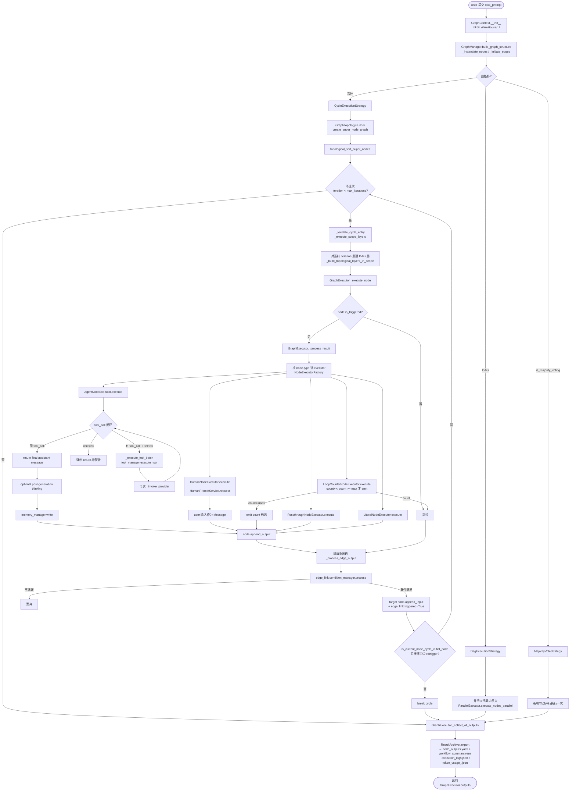

# ChatDev — Agent Loop 调研报告

> **调研对象**:`OpenBMB/ChatDev` 仓库 `main` 分支的当前 `HEAD`(`README.md` 自报为 **ChatDev 2.0 (DevAll)**,2026-01-07 发布;**不是经典的 ChatDev 1.0 "CEO/CTO/Programmer"**)。
> **经典 ChatDev 1.0** 已迁到 `chatdev1.0` 分支(`README.md:7-9`),但 **1.0 的工作流已被"翻译"成 YAML DAG 形式**,以 `yaml_instance/ChatDev_v1.yaml`(`yaml_instance/ChatDev_v1.yaml:1-695`)保留在 `main` 分支里 —— **本调研两套都会分析**。
> **调研日期**:2026-07-18

---

## 0. 智能体一句话定位

**"ChatDev 2.0 (DevAll)":一个零代码的 YAML-DAG 多智能体编排框架**。Agent Loop 不再是 ChatDev 1.0 那个写死的"ChatChain → Phase → Role"链式循环,而是**用户用 YAML 声明一张有向图(含环)**,运行时用 Tarjan 强连通分量 + 拓扑排序拆出"超节点(super-node)"层,**每一个图节点都是一个完整的"agent 内部 tool-call 循环"**;**外层图循环和内层 ReAct 循环是两层独立的循环**。经典 1.0 的"CEO/CTO/程序员/测试员"已被翻译成同一个框架里的若干 `agent` + `loop_counter` + `literal` 节点,语义不变但形态从代码变成数据。

---

## 1. 调研依据

| 文件/目录 | 用途 |
| --- | --- |
| `README.md:1-50` | 明确 `main` = ChatDev 2.0 (DevAll);1.0 迁到 `chatdev1.0` 分支 |
| `yaml_instance/ChatDev_v1.yaml:1-695` | 经典 ChatDev 1.0 "CEO/CTO/Programmer/Code Reviewer/Software Test Engineer/CPO" 工作流的 YAML 重写版,共 25 节点 / 55 边 |
| `workflow/graph_manager.py:1-220` | 主图管理器:节点实例化、边解析、循环检测、拓扑分层 |
| `workflow/graph.py:48-120,225-300` | `GraphExecutor` —— 整个 Agent Loop 的大脑;负责 strategy 选择、取消、最终输出 |
| `workflow/executor/cycle_executor.py:60-300` | **外层循环**:`_execute_cycle_with_iterations` 实现"环中节点拓扑执行 + 退出条件检测" |
| `workflow/cycle_manager.py:1-50,90-160` | `CycleManager` / `CycleDetector`(Tarjan) / `CycleInfo` 状态机 |
| `workflow/topology_builder.py:1-200` | 静态方法集合:`detect_cycles` / `build_dag_layers` / `topological_sort_super_nodes` |
| `workflow/executor/dag_executor.py:1-50` | 纯 DAG 执行器,层间并行,层内串行 + 串行化 Human 节点 |
| `workflow/executor/parallel_executor.py:1-120` | 线程池并行执行器(`ThreadPoolExecutor`) |
| `workflow/runtime/execution_strategy.py:1-120` | 三个 Strategy:`DagExecutionStrategy` / `CycleExecutionStrategy` / `MajorityVoteStrategy` |
| `workflow/runtime/runtime_context.py:1-30` | `RuntimeContext` —— 跨节点共享的工具 / memory / token 跟踪 / 附件存储 |
| `runtime/node/executor/agent_executor.py:60-280` | **内层 ReAct 循环**:`_handle_tool_calls` while-True,直到 LLM 不再产生 tool_call 或命中 loop_limit=50 |
| `runtime/node/executor/human_executor.py:1-50` | `HumanNodeExecutor` —— 触发 `HumanPromptService` 让用户接管 |
| `runtime/node/executor/loop_counter_executor.py:1-60` | `LoopCounterNodeExecutor` —— **基于计数的循环退出闸门** |
| `runtime/node/executor/passthrough_executor.py:1-50` | `PassthroughNodeExecutor` —— 透传节点(用于 DAG 中无操作的连接) |
| `runtime/node/executor/literal_executor.py` | 静态文本节点(常驻 prompt template) |
| `utils/human_prompt.py:1-160` | `HumanPromptService` / `PromptChannel` / `CliPromptChannel` |
| `entity/configs/node/agent.py:60-200,320-360` | `AgentConfig` / `AgentRetryConfig` —— agent 节点的完整 schema |
| `entity/configs/node/node.py:60-260,440-460` | `Node` dataclass + `is_triggered` / `reset_triggers` / `context_window` 语义 |
| `entity/configs/edge/edge.py:1-130` | `EdgeConfig`:`trigger`/`condition`/`carry_data`/`keep_message`/`clear_context`/`clear_kept_context`/`process`/`dynamic` 八字段 |
| `entity/configs/edge/edge_condition.py:60-100,140-200` | `FunctionEdgeConditionConfig` + `KeywordEdgeConditionConfig` + 注册中心 |
| `runtime/edge/conditions/builtin_types.py:1-20` | 注册两个内置条件类型:`function` / `keyword` |
| `functions/function_calling/file.py:30-110` | `FileToolContext` —— **沙箱化**:`workspace_root` / `session_root` / `resolve_under_workspace` / `resolve_under_session`,`Path` 越界即抛 `ValueError` |
| `server/services/session_store.py:70-145` | `WorkflowSessionStore` —— **纯内存** Dict,服务重启即丢(`self._sessions: Dict[str, WorkflowSession] = {}`) |
| `server/services/workflow_run_service.py:144-155` | Server 端 `GraphConfig.from_definition(name=f"session_{session_id}", output_root=WARE_HOUSE_DIR, ...)` |
| `runtime/sdk.py:21-130` | Python SDK `run_workflow()` 入口;`OUTPUT_ROOT = Path("WareHouse")` 写死 |
| `runtime/bootstrap/schema.py` | `ensure_schema_registry_populated()` —— 启动时注册所有节点/边/工具类型 |
| `frontend/public/tutorial-zh.md:642-649` | 4 件套(`node_outputs.yaml` / `workflow_summary.yaml` / `execution_logs.json` / `token_usage_<session>.json`)目录说明 |

> **重要观察**:ChatDev 2.0 把 ChatDev 1.0 的"ChatChain → Phase → Role"硬编码结构 **完全重构成了"图 + 节点 + 边"的数据驱动形式**。**所有"角色"都是 agent 节点**;**所有"phase"都是 `loop_counter` 节点 + DAG 路径**;**所有"ChatChain"都是带 trigger/condition 的边集合**。

---

## 2. 九大问题回答

### Q1. Agent Loop 主流程

**结论**:ChatDev 2.0 的 Agent Loop 是**双层循环**:
- **外层图循环**(`workflow/executor/cycle_executor.py`):YAML DAG(含环)的拓扑执行,**每个环独立按"超节点层"迭代**,直到环的入口节点不再被环内边触发或命中 `max_iterations=100` 默认上限;
- **内层 ReAct 循环**(`runtime/node/executor/agent_executor.py:210-260`):单个 `agent` 节点内的 `while True`,**LLM → tool_call → execute → 回灌 tool_result → 再次 LLM**,直到 LLM 不再产生 tool_call 或命中 `tool_loop_limit=50`。

两套循环**互不感知** —— 外层把每个节点当成"一个函数"调用,内层把"一次 LLM 调用"当成"一轮"。整个系统支持三种图模式:**DAG / Cycle / Majority Voting**,运行时按 `GraphManager._initiate_edges` 决定走哪条 Strategy。

#### 1.0 阶段化软件工程的 loop(经典 ChatDev 1.0,以 YAML 形式保留在 `main` 分支)

经典 1.0 的工作流是 **4 个有向环 + 5 个 `loop_counter` 闸门 + 1 个 PSEUDO 汇流** —— **"环"就是 phase,`loop_counter` 就是 phase 边界**。完整逻辑见 `yaml_instance/ChatDev_v1.yaml`:

| Phase(由 loop_counter 标志) | 角色(agent 节点) | 节点 ID | 退出条件 |
| --- | --- | --- | --- |
| **Manual Phase**(`Manual Phase Loop Counter`,max=1) | CEO + Chief Product Officer | `Chief Executive Officer` / `Chief Product Officer` | `loop_counter` 第 1 次 emit → `FINAL` |
| **Coding Phase** | Programmer | `Programmer Coding` | 1 步到位(单次) |
| **Code Complete Phase**(`Code Complete All Phase Loop Counter`,max=5) | Programmer | `Programmer Code Complete` | 输出含 `<INFO> FINISHED` 关键字或 5 次到限 |
| **Code Review Phase**(`Code Review Phase Loop Counter`,max=10) | Code Reviewer + Programmer | `Code Reviewer` / `Programmer Code Review` | 关键字 `<INFO> Finished` 或 10 次到限 |
| **Test Phase**(`Test Phase Loop Counter`,max=3) | Software Test Engineer + Programmer | `Software Test Engineer` / `Programmer Test Error Summary` | `<INFO> Finished` 或 3 次到限 |
| **Test Modification Phase**(`Test Modification Phase Loop Counter`,max=5) | Programmer | `Programmer Test Modification` | `<INFO> Finished` 或 5 次到限 |

> **关键观察 1**:经典 1.0 的"ChatChain"在 2.0 里**变成 `edges: [...]` 列表**;每条边自带 `trigger`(决定是否触发后继)和 `condition`(决定是否满足),**`trigger: false` 的边是"数据注入边"(`USER → Programmer Coding` 全是 trigger:false)**,这是 1.0 时代"phase 之间共享上下文"的 2.0 翻译。

> **关键观察 2**:`PSEUDO`(`yaml_instance/ChatDev_v1.yaml:55-59`)是 **passthrough 节点**(`runtime/node/executor/passthrough_executor.py:1-50`),**作用是"汇流/汇合分支"** —— 多个 phase 通过 PSEUDO 汇合后,再向下一个 phase 广播。这是 1.0 时代"phase 是顺序的"这一约束在 2.0 里的图结构体现。

#### 2.0 YAML DAG 编排的 loop(DevAll 主线)

**Agent Loop 主流程 Mermaid 流程图(以 ChatDev_v1.yaml 为例)**:



**关键节点说明(对应源码)**:

| 流程图节点 | 源码位置 |
| --- | --- |
| `GraphContext.__init__` | `workflow/graph_context.py:60-86` —— 隐式 `mkdir` WareHouse |
| `GraphManager.build_graph_structure` | `workflow/graph_manager.py:18-23` |
| 拓扑决策(DAG/Cycle/Vote) | `workflow/graph.py:228-251` —— `is_majority_voting` / `has_cycles` 三分支 |
| `CycleExecutionStrategy` | `workflow/runtime/execution_strategy.py:35-53` |
| `_validate_cycle_entry` | `workflow/executor/cycle_executor.py:140-180` —— **环入口必须唯一**,否则 `ValueError` |
| `_execute_cycle_with_iterations` | `workflow/executor/cycle_executor.py:200-260` —— 主环循环 |
| `GraphExecutor._execute_node` | `workflow/graph.py:445-540` —— 单节点调度 |
| `AgentNodeExecutor._handle_tool_calls` | `runtime/node/executor/agent_executor.py:485-540` —— **内层 ReAct 循环** |
| `tool_loop_limit` 默认 50 | `runtime/node/executor/agent_executor.py:1186-1198`(`_get_tool_loop_limit`) |
| `ResultArchiver.export` | `workflow/runtime/result_archiver.py:1-25` |

#### ChatChain 怎么串起来 —— 边作为"事件总线"

ChatDev 2.0 已经没有 ChatChain 类(`grep chat_chain` 全仓库 0 命中),**边集合就是"ChatChain"**:
- **每条边是一个 `EdgeLink`**(`entity/configs/edge/edge.py:11-25`),带 `triggered: bool` 运行时标记;
- **节点执行后**:`GraphExecutor._execute_node` 末尾遍历 `node.iter_outgoing_edges()`,对每条边调 `manager.process(edge_link, source_result, from_node, log_manager)`(`workflow/graph.py:373-400`);
- **条件满足时**:边把消息灌入 `target_node.append_input()` 并把 `edge_link.triggered = True`;
- **下一轮**:`_execute_node` 开头调 `node.reset_triggers()` 清掉 `edge_link.triggered`(`workflow/graph.py:452`),并对所有 enabled 节点重测 `is_triggered()`(`entity/configs/node/node.py:452-455`);
- **跨 cycle 共享上下文**:`edge_config.carry_data: bool`(`entity/configs/edge/edge.py:13`)—— **True 表示把源节点输出消息传入目标节点的 input 列表;False 表示不传**。`USER → Programmer Coding` 这条边 `carry_data: true` + `trigger: false`(`yaml_instance/ChatDev_v1.yaml:524-528`),是经典的"USER 上下文广播"。

---

### Q2. Plan 计划机制

**结论**:ChatDev 2.0 **没有"动态生成 plan"的概念**;**plan 就是 YAML 设计本身**。`yaml_instance/*.yaml` 是用户在 IDE / 前端(`frontend/`)上设计好的"工作流图" = **静态 plan**。运行时 `GraphManager` 读 YAML、构建节点/边、检测环,然后 `GraphTopologyBuilder` 算拓扑序,**不再有"agent 自行规划下一步"**。

#### 代码证据

| 位置 | 关键点 |
| --- | --- |
| `runtime/sdk.py:84-90` | `design = load_config(yaml_path, fn_module=fn_module, vars_override=variables)` —— **plan 来自 YAML 文件** |
| `entity/configs/graph.py` | `DesignConfig` / `GraphDefinition` dataclass,持有 `nodes: List[Node]` / `edges: List[EdgeConfig]` —— **plan 的 schema** |
| `workflow/graph_manager.py:18-23` | `build_graph_structure` 读 `self.graph.config.get_node_definitions()` / `get_edge_definitions()` —— **plan 实例化** |
| `frontend/`(Vue) | **plan 在前端 UI 里"画"出来**,然后导出 YAML。这是 2.0 区别 1.0 的关键 —— 1.0 的 plan 写在 `ChatChainConfig.json` 里 |
| `runtime/bootstrap/schema.py` | `ensure_schema_registry_populated()` —— 启动时注册所有节点/边/工具类型的 schema,**plan schema 本身是"声明式"的** |

#### "动态"成分(仅在运行时,不在 plan 阶段)

| 动态部分 | 位置 | 说明 |
| --- | --- | --- |
| **Dynamic edge fan-out** | `entity/configs/edge/dynamic_edge_config.py` + `workflow/executor/dynamic_edge_executor.py` | 边可声明 `dynamic.split.json_path: "$.items"`,运行时把上节点输出按 JSONPath 拆开,**单节点 fan-out 成 N 个并行实例** |
| **Loop counter 重置** | `runtime/node/executor/loop_counter_executor.py:31-33` | `reset_on_emit: true` 触发时计数归零,**plan 不能"重启整个环"但 runtime 可以** |
| **Runtime 决定的 start nodes** | `workflow/graph_manager.py:170-200` | `definition.start_nodes` 是 YAML 显式配置的;若缺则抛 `ConfigError` |
| **Majority voting** | `workflow/runtime/execution_strategy.py:55-120` | 图本身无边,所有节点并行跑,最后投票 —— **这是 1.0 完全没有的模式** |

#### 与 ChatDev 1.0 的对比

| 维度 | 1.0 | 2.0 |
| --- | --- | --- |
| Plan 形态 | `ChatChainConfig.json`(手工写 JSON,声明 phase 链) | `*.yaml`(UI 设计导出 YAML,声明 DAG + Cycle) |
| Plan 包含什么 | 链式 phase + 每个 phase 的 role 列表 | 节点列表 + 边列表 + 边条件 + loop counter 上限 |
| Plan 谁生成 | 开发者手写 | 开发者用前端 UI 画 / 手写 YAML |
| 运行时再 plan? | 无 | 无 |
| 子图 | 无 | **`subgraph` 节点 + 嵌套 GraphContext**(`workflow/graph_manager.py:48-105`),可以把子图当单节点嵌进父图 |

#### 一句话总结

**Plan = 静态 YAML 设计,运行时只"实例化"不"再规划"**。YAML 里可声明 `subgraph` 形成"plan 嵌套",但**没有"agent 看完任务后动态生成子任务列表"的机制**。所有"步骤"都是设计期固定的。

---

### Q3. Sub Agent

**结论**:ChatDev 2.0 的"sub agent" = **`agent` 节点**。**角色分工不是 class**,**是 YAML 里 `role: \|` 字段的 prompt template**。同一个 `AgentConfig` 类,通过 YAML `role` 字段可以实例化成 CEO、Programmer、Code Reviewer 等任意角色。

#### 角色分工实现机制(以 `ChatDev_v1.yaml` 为例)

| 角色 | 节点 ID | YAML 路径 | 实现方式 |
| --- | --- | --- | --- |
| **Chief Executive Officer** | `Chief Executive Officer` | `yaml_instance/ChatDev_v1.yaml:80-114` | `type: agent` + `role: \|` 注入"You are Chief Executive Officer. ... Your main responsibilities include being an active decision-maker..." |
| **Chief Product Officer** | `Chief Product Officer` | `yaml_instance/ChatDev_v1.yaml:213-240` | `type: agent` + `role: \|` 注入"You are Chief Product Officer. ..." |
| **Programmer(Coding)** | `Programmer Coding` | `yaml_instance/ChatDev_v1.yaml:178-208` | `type: agent` + `role: \|` 注入"You are Programmer. ..." |
| **Programmer(Code Complete)** | `Programmer Code Complete` | `yaml_instance/ChatDev_v1.yaml:152-176` | 同上 system prompt |
| **Programmer(Code Review)** | `Programmer Code Review` | `yaml_instance/ChatDev_v1.yaml:29-58` | 同上 |
| **Programmer(Test Error Summary)** | `Programmer Test Error Summary` | `yaml_instance/ChatDev_v1.yaml:247-274` | 同上 |
| **Programmer(Test Modification)** | `Programmer Test Modification` | `yaml_instance/ChatDev_v1.yaml:54-78` | 同上 |
| **Code Reviewer** | `Code Reviewer` | `yaml_instance/ChatDev_v1.yaml:280-308` | `role: \|` 注入"You are Code Reviewer. ..." |
| **Software Test Engineer** | `Software Test Engineer` | `yaml_instance/ChatDev_v1.yaml:337-374` | `role: \|` 注入"You are Software Test Engineer. ..." |

> **关键观察 1**:**所有 agent 节点用同一个 `AgentConfig` dataclass**(`entity/configs/node/agent.py:60-200`),**`role` 字段就是 system prompt 模板**,通过 `_build_system_prompt(node, skill_manager)` 注入到 `conversation[0]`(`runtime/node/executor/agent_executor.py:236-260`):
> ```python
> def _build_system_prompt(self, node: Node, skill_manager) -> str | None:
>     parts: List[str] = []
>     if node.role:
>         parts.append(node.role)  # ← YAML 里的 role 字符串直接进 system prompt
>     ...
>     return "\n\n".join(part for part in parts if part)
> ```

> **关键观察 2**:**工具集差异化** —— 不同 agent 节点配不同的 `tooling` 列表。例如:
> - `Programmer` 类节点配 `apply_text_edits` / `create_folder` / `save_file` / `delete_path` 等"写"工具;
> - `Code Reviewer` / `Programmer Test Error Summary` 配 `describe_available_files` / `read_file_segment` / `search_in_files` 等"只读"工具;
> - **工具集差异是"角色能力"差异的唯一显式表达** —— `role` prompt 是"软约束",tooling 是"硬约束"。

> **关键观察 3**:**节点 ID 和"角色"是同义关系**(`yaml_instance/ChatDev_v1.yaml:80` 的节点 `id: Chief Executive Officer` 就是 CEO 这个角色)。**节点 ID 既是 dag 拓扑里的标识符,也是"人话可读的角色名"** —— 没有 `Role` 类,没有 `BaseRole` 基类(1.0 时代的 `chatdev/role.py` 已废弃)。

#### Sub Agent 隔离(workspace / memory / token 共享)

| 维度 | 共享还是隔离? | 代码证据 |
| --- | --- | --- |
| **工具(tools)** | 隔离 —— 每个 agent 节点的 `tooling` 列表独立 | `entity/configs/node/agent.py` `AgentConfig.tooling: List[ToolingConfig]` |
| **Token 跟踪** | **共享** —— `RuntimeContext.token_tracker` 单例,所有 agent 节点写入同一个 `TokenTracker` | `workflow/runtime/runtime_context.py:21-22` + `runtime/sdk.py:115-117` |
| **Memory** | **可选共享** —— `AgentConfig.memories: List[MemoryAttachmentConfig]` 引用 `global_memories` 字典里的全局存储 | `workflow/graph.py:130-160` + `entity/configs/node/memory.py` |
| **File system workspace** | **共享** —— `RuntimeContext.code_workspace` 单例,所有 Python 节点写到 `code_workspace/` 下,Python 节点在 `python_workspace_root` global_state 里共享同一目录 | `runtime/node/executor/python_executor.py:69-83` + `functions/function_calling/file.py:30-110` |
| **模型调用 client** | **每个 agent 节点独立创建** | `runtime/node/executor/agent_executor.py:90-100`(`provider = provider_class(agent_config); client = provider.create_client()`) |
| **Thinking 状态** | **每节点独立** —— `thinking_managers: Dict[node_id, ThinkingManagerBase]` | `workflow/graph.py:75-80` |

#### Memory 类型(per-agent vs global)

`runtime/node/agent/memory/` 目录提供了 **6 种 memory 实现**:

| Memory 类 | 文件 | 说明 |
| --- | --- | --- |
| `MemoryBase` | `runtime/node/agent/memory/memory_base.py` | 抽象基类 |
| `SimpleMemory` | `runtime/node/agent/memory/simple_memory.py` | 简单 in-memory 列表 |
| `FileMemory` | `runtime/node/agent/memory/file_memory.py` | 文件系统持久化 |
| `BlackboardMemory` | `runtime/node/agent/memory/blackboard_memory.py` | 跨 agent 共享"黑板"模式 |
| `Mem0Memory` | `runtime/node/agent/memory/mem0_memory.py` | 第三方 Mem0 集成(向量库) |
| `Embedding` | `runtime/node/agent/memory/embedding.py` | embedding 检索支持 |

`AgentConfig.memories: List[MemoryAttachmentConfig]` 让每个 agent 节点**按需引用** 1 个或多个全局 memory store,实现"CEO 看历史决策 / Programmer 看历史代码"。

#### 一句话总结

**Sub Agent = `agent` 节点 + YAML `role` 字段 + 差异化 `tooling` 列表**。没有代码层的 Role 类(对比 1.0 的 `chatdev/role.py`);**所有"角色"都是 prompt + tooling 的不同组合**。Memory / Token / Workspace 共享,Tool / Model client 隔离。

---

### Q4. Loop 退出机制

**结论**:ChatDev 2.0 有 **5 层退出机制**,按层次从外到内:

| 层次 | 退出条件 | 代码位置 | 默认上限 |
| --- | --- | --- | --- |
| **L1: 图整体结束** | 没有任何节点 `is_triggered()` | `workflow/executor/cycle_executor.py:255-265` | 无上限(由图结构决定) |
| **L2: 环迭代上限** | `iteration_count >= max_iterations` | `workflow/cycle_manager.py:60-75`(`CycleInfo.get_max_iterations`) | **100** |
| **L3: Loop counter 闸门** | `count >= config.max_iterations` 时 `emit` 消息到下游,否则返回 `[]` | `runtime/node/executor/loop_counter_executor.py:20-40` | YAML 配置(`max_iterations: 5/10/3/5/1` 等) |
| **L4: agent 内层 ReAct 循环** | LLM 不再产生 `tool_call` OR `iteration >= tool_loop_limit` | `runtime/node/executor/agent_executor.py:510-540` | **50** |
| **L5: 单次 LLM 调用** | tenacity 退避重试耗尽 | `runtime/node/executor/agent_executor.py:280-340` | `AgentRetryConfig.max_attempts=5` |

#### 详细代码证据

**L2: 环迭代上限(`workflow/cycle_manager.py:48-75`)**
```python
@dataclass
class CycleInfo:
    cycle_id: str
    nodes: Set[str]
    max_iterations: Optional[int] = None
    max_iterations_default: int = 100  # ← 默认 100

    def get_max_iterations(self) -> int:
        return self.max_iterations if self.max_iterations is not None else self.max_iterations_default
```

**L2 主循环(`workflow/executor/cycle_executor.py:200-260`)**
```python
def _execute_cycle_with_iterations(self, cycle_id, cycle_nodes, initial_node_id, max_iterations):
    iteration = 0
    while iteration < max_iterations:
        # 1. 重新构建 scoped DAG
        execution_layers = self._build_topological_layers_in_scope(...)
        # 2. 执行 scoped DAG,若有 external node 被触发,return(退出环)
        external_nodes = self._execute_scope_layers(...)
        if external_nodes:
            return external_nodes
        # 3. 检查 initial_node 是否被环内边重新触发
        if not self._is_initial_node_retriggered(initial_node_id, cycle_nodes):
            break  # ← 退出环
        iteration += 1
    if iteration >= max_iterations:
        self.log_manager.warning(f"Cycle {cycle_id} reached max iterations ({max_iterations})")
    return set()
```

**L3: Loop counter 节点退出(`runtime/node/executor/loop_counter_executor.py:15-50`)**
```python
def execute(self, node, inputs):
    config = node.as_config(LoopCounterConfig)
    state = self._get_state()
    counter = state.setdefault(node.id, {"count": 0})
    counter["count"] += 1
    count = counter["count"]

    if count < config.max_iterations:
        return []  # ← 不 emit,下游不被触发

    if config.reset_on_emit:
        counter["count"] = 0  # ← 触发后清零(为下一轮 phase 准备)

    return [Message(role=ASSISTANT, content=config.message or f"Loop limit reached ({config.max_iterations})")]
```

**L4: agent 内层 ReAct 循环退出(`runtime/node/executor/agent_executor.py:490-540`)**
```python
def _handle_tool_calls(self, ...):
    loop_limit = self._get_tool_loop_limit(node)  # 默认 50
    iteration = 0
    while True:
        # 1. 收集 assistant message 到 conversation
        conversation.append(cloned_assistant)
        if not assistant_message.tool_calls:
            return self._finalize_tool_trace(assistant_message, trace_messages, True, node.id)  # ← LLM 自发退出
        if iteration >= loop_limit:
            self.log_manager.warning(f"[Node: {node.id}] Tool call limit {loop_limit} reached, returning last assistant response")
            return self._finalize_tool_trace(assistant_message, trace_messages, False, node.id)  # ← 强制退出
        iteration += 1
        # 2. 执行工具
        tool_call_messages, tool_events = self._execute_tool_batch(...)
        # 3. 再次调用 LLM
        follow_up_response = self._invoke_provider(...)
        assistant_message = follow_up_response.message
```

**L5: 单次 LLM 调用重试(`runtime/node/executor/agent_executor.py:280-340`)**
```python
def _execute_with_retry(self, node, retry_config, func):
    retrier = Retrying(
        stop=stop_after_attempt(retry_config.max_attempts),  # 默认 5
        wait=wait_random_exponential(min=1.0, max=6.0),
        retry=retry_if_exception(lambda exc: retry_config.should_retry(exc)),
        ...
    )
    return retrier(func)
```

#### "软退出"机制:Edge condition 关键字触发

**ChatDev 1.0 经典模式**:`Programmer` 输出 `<INFO> FINISHED` / Code Reviewer 输出 `<INFO> Finished` / Test Engineer 输出 `<INFO> Finished` → **触发到 `PSEUDO` 节点的边**(`yaml_instance/ChatDev_v1.yaml:553-557`):
```yaml
- from: Programmer Code Complete
  to: Code Review Comment Phase Prompt for Assistant
  trigger: true
  condition:
    type: keyword
    config:
      any: ['<INFO> FINISHED']  # ← 软退出
      none: []
      regex: []
      case_sensitive: true
```

> **关键观察**:**软退出靠 `keyword` 边条件**(`entity/configs/edge/edge_condition.py` + `runtime/edge/conditions/builtin_types.py:13-18`)。"硬退出"靠 `loop_counter` 闸门(L3)或环 `max_iterations` 兜底(L2)。**两层防御**确保 phase 不会无限循环。

#### 与 ChatDev 1.0 的对比

| 维度 | 1.0 | 2.0 |
| --- | --- | --- |
| Phase 退出 | `ChatChain` 内的 `phase.phaseConfig.max_loop` 字段 | `loop_counter` 节点 `max_iterations` + `keyword` 边条件 |
| 环退出 | `ChatChain.phase` 顺序遍历,无显式"环"概念 | Tarjan SCC + 拓扑排序 + 100 次默认上限 |
| Agent 退出 | "等 LLM 不再 tool_call" | 同 1.0 + `tool_loop_limit=50` 兜底 |
| LLM 调用退出 | 直接挂 | tenacity + retry 5 次 + 退避 |

#### 一句话总结

**5 层防御,最内最严**:`tool_loop_limit=50` < `loop_counter.max_iterations` (YAML,通常 1-10) < 环 `max_iterations=100` < 图自然结束 < LLM 调用 retry=5。**任意一层触发都会退出**,但**只要图结构稳定,最常用的是 L3 loop_counter 闸门**。

---

### Q5. Ask 模式

**结论**:ChatDev 2.0 的 "ask user" 通过 **`type: human` 节点 + `HumanPromptService` + 可插拔 `PromptChannel`** 三层抽象实现。**CLI 模式用 `input()` 阻塞,Server 模式用 WebSocket 推送到前端**。

#### 核心代码(`utils/human_prompt.py:1-160`)

```python
class CliPromptChannel:
    """Default channel that prompts the operator via CLI input()."""
    input_func: Callable[[str], str] = input

    def request(self, *, node_id, task, inputs=None, metadata=None) -> PromptResult:
        header = ["===== HUMAN INPUT REQUIRED ====="]
        if inputs:
            header.append("=== Node inputs ===")
            header.append(inputs)
        header.append(f"=== Task for human ({node_id}) ===")
        header.append(task)
        header.append("=== Your response: ===")
        prompt = "\n".join(header) + "\n"
        response = self.input_func(prompt)  # ← 阻塞读 stdin
        return PromptResult(text=response, blocks=[MessageBlock.text_block(response or "")])


class HumanPromptService:
    """Coordinates human feedback collection across nodes and tools."""
    def __init__(self, *, log_manager, channel, session_id=None):
        self._lock = threading.Lock()  # ← 全局 lock,防止并发 human 节点竞态

    def request(self, node_id, task_description, *, inputs=None, metadata=None) -> PromptResult:
        with self._lock:
            with self._log_manager.human_timer(node_id):
                raw_result = self._channel.request(node_id=node_id, task=task_description, inputs=inputs, metadata=meta)
        ...
```

#### Human 节点执行器(`runtime/node/executor/human_executor.py:1-50`)

```python
class HumanNodeExecutor(NodeExecutor):
    def execute(self, node, inputs) -> List[Message]:
        human_config = node.as_config(HumanConfig)
        human_task_description = human_config.description
        input_data = self._inputs_to_text(inputs)  # ← 把上游消息拍平给用户看

        prompt_service = self.context.get_human_prompt_service()
        if prompt_service is None:
            raise RuntimeError("HumanPromptService is not configured; cannot execute human node")

        prompt_result = prompt_service.request(
            node.id,
            human_task_description or "",
            inputs=input_data,
            metadata={"node_type": "human"},
        )

        return [self._build_message(
            MessageRole.USER,                    # ← 用户的回复以 USER 角色塞回 conversation
            prompt_result.as_message_content(),
            source=node.id,
        )]
```

#### 可插拔 PromptChannel

`utils/human_prompt.py:107-130` 提供 `resolve_prompt_channel(workspace_hook)`:
- **CLI 模式**:`workspace_hook` 不提供 channel → fallback 到 `CliPromptChannel`(`workflow/graph.py:152-160`);
- **Server 模式**:`workspace_hook.get_prompt_channel()` 返回 `WebSocketPromptChannel`(`server/services/prompt_channel.py`),**WebSocket 把 prompt 推到前端 UI,前端用户填完发回**;
- **Headless / Batch 模式**:Server `batch_run_service.py:163-217` 把"ask human"作为 `metadata.fixed_output_dir=True` 的 batch 任务,**自动把 prompt 写到 `batch_results.csv` 不阻塞**。

#### User 反馈进 LLM 的链路

```
HumanNodeExecutor.execute
  ↓ prompt_service.request (via CliPromptChannel / WebSocketPromptChannel)
  ↓ [PromptResult(text, blocks, metadata)]
  ↓ _build_message(MessageRole.USER, content)
  ↓ return [Message(role=USER, content="user input")]
  ↓ node.append_output(msg)
  ↓ _process_edge_output 灌给后续 agent 节点
  ↓ 下游 agent 节点 LLM conversation 看到 user role 的最新消息
```

> **关键观察**:**用户输入 = 新一轮 USER role message**。agent 节点下一次 LLM 调用会把它作为对话历史的一部分读到。这与 OpenClaw / Hermes 等的 `ask_user` 工具行为**完全一致**。

#### 与 ChatDev 1.0 的对比

| 维度 | 1.0 | 2.0 |
| --- | --- | --- |
| 触发方式 | `--config "Human"` + `Reviewer` 角色 | `type: human` 节点 + YAML `description: \|` |
| CLI 实现 | `chatdev/human.py` 内嵌 input() | `CliPromptChannel` 抽象 + `input_func` 可注入(mock 测试友好) |
| Web 集成 | SaaS 平台专属 | `WebSocketPromptChannel` 通过 `workspace_hook.get_prompt_channel()` 注入 |
| 并发安全 | 无显式 lock | `HumanPromptService._lock = threading.Lock()` —— **全局 lock 防止并发 human 节点竞态** |
| 反馈回 LLM | `Message(role=USER, content=user_input)` | 同 1.0 |

#### 一句话总结

**Human 节点 = `HumanPromptService` + `PromptChannel`(可插拔)+ 锁**。**默认 CLI input() 阻塞**,Server 模式换成 WebSocket,Batch 模式降级成"写 CSV 不阻塞"。**人类反馈 = USER role message 灌回 conversation**。

---

### Q6. Human-in-the-Loop (HITL)

**结论**:ChatDev 2.0 的 HITL 有 **3 种模式**,按"agent 跑到哪里需要人"区分:

| 模式 | 触发 | 实现 | 适用场景 |
| --- | --- | --- | --- |
| **A. 阻塞式 HITL**(纯 ask) | `type: human` 节点被触发 | `HumanNodeExecutor` 阻塞等用户输入 | 需要决策/审批的 phase 边界 |
| **B. Reviewer 角色** | `role: \|` 字段让某个 agent 节点扮演 reviewer 角色 | **普通 agent 节点**,不是真"人" | 1.0 时代的 `Human-Agent-Interaction` 模式现在用 `agent` + `role: "You are Reviewer. ..."` 模拟 |
| **C. Cancel/Interrupt** | 调用 `GraphExecutor.request_cancel(reason=...)` | `workflow/graph.py:120-135` —— 设置 `_cancel_event`,各 `NodeExecutor._ensure_not_cancelled()` 检查 | 服务端 Web UI "停止" 按钮 |

#### A 模式:阻塞 HITL(同 Q5)

已见 Q5。补充 **`_ensure_not_cancelled()` 钩子**:`runtime/node/executor/base.py` + 各 executor 在每个 tool/LLM 调用前都检查 cancel event。

#### B 模式:Reviewer 角色(1.0 时代 "--config Human")

**经典 1.0 `Human-Agent-Interaction` 模式** 在 `yaml_instance/ChatDev_v1.yaml` 里的实现是 **`agent` 节点 + `role: "You are Code Reviewer. ..."`**(`yaml_instance/ChatDev_v1.yaml:280-308`)。**不是真"人",是一个 LLM 模拟的 reviewer**。**真正的"人类 reviewer"需要业务方自己加 `type: human` 节点替代**。

> **关键观察**:1.0 README 提到的 `"Human-Agent-Interaction" mode ... playing the role of reviewer and making suggestions to the programmer`(`README.md:131-136`)**现在已经不是产品特性,只是 YAML 写法**。任何用户都可以自己写一个 `type: human` 节点 + `role: "You are Reviewer. Please comment on the code."` 来做真正的"人 review"。

#### C 模式:Cancel/Interrupt

`workflow/graph.py:120-135`:
```python
def request_cancel(self, reason: Optional[str] = None) -> None:
    if reason:
        self._cancel_reason = reason
    elif not self._cancel_reason:
        self._cancel_reason = "Workflow execution cancelled"
    self._cancel_event.set()
    self.logger.info(f"Cancellation requested for workflow {self.graph.name}")

def is_cancelled(self) -> bool:
    return self._cancel_event.is_cancelled() if hasattr(self._cancel_event, 'is_cancelled') else self._cancel_event.is_set()
```

`AgentNodeExecutor` 多个关键点检查:`agent_executor.py:60`(`_ensure_not_cancelled()`)、`agent_executor.py:430`(`while True` 入口)、`agent_executor.py:550`(`_execute_tool_batch` 每个 tool call 前)。

#### Server 端 WebSocket 整合

`server/services/websocket_executor.py` + `server/services/prompt_channel.py`:
- **前端"开始运行"** → `POST /api/workflow/execute` → `WorkflowSessionStore.add()` → `GraphExecutor.execute_graph` 启动
- **前端"暂停/取消"** → `WebSocket` 消息 → `executor.request_cancel(reason="User cancelled from UI")`
- **Human 节点触发** → `WebSocketPromptChannel.request()` → `WebSocketManager` 把 prompt 推到前端 → 前端用户填完 → WebSocket 回灌
- **节点执行日志** → `WebSocketLogger` 实时推流(`server/services/websocket_logger.py`)

#### 一句话总结

**HITL 三种**:阻塞式 `human` 节点(真用户)、`role: "Reviewer"` 的 agent 节点(LLM 模拟)、Web UI cancel(中断)。**Server 端用 WebSocket 把"阻塞式"转成"异步推送"**,前端 UX 与 CLI 阻塞本质相同。

---

### Q7. 工具调用权限

**结论**:ChatDev 2.0 **没有传统"三种权限(YOLO / auto-edit / ask)"**,而是**通过 3 道防护实现"硬沙箱"**:

| 防护层 | 实现 | 代码位置 |
| --- | --- | --- |
| **L1. 工具集白名单** | 每个 agent 节点的 `tooling: List[ToolingConfig]` —— **写死的白名单**,LLM 看不到列表外的工具 | `entity/configs/node/agent.py` `AgentConfig.tooling` |
| **L2. Workspace 路径校验** | `FileToolContext.resolve_under_workspace` / `resolve_under_session` —— **`Path.resolve()` 后必须以 `workspace_root` 为父**,否则 `ValueError` | `functions/function_calling/file.py:60-100` |
| **L3. 附件目录只读** | `_check_attachments_not_modified` —— 任何对 `attachments/` 子目录的写操作 `ValueError` | `functions/function_calling/file.py:108-110` |
| **L4. shell 命令白名单(部分)** | `uv_related.py` 拒绝带 flag 的 package 名 | `functions/function_calling/uv_related.py:75` |

#### 详细证据

**L1: 工具集白名单**

`yaml_instance/ChatDev_v1.yaml:34-44`(Programmer Code Review 节点):
```yaml
tooling:
  - type: function
    config:
      tools:
        - name: uv_related:All
        - name: apply_text_edits
        - name: create_folder
        - name: describe_available_files
        - name: delete_path
        - name: read_file_segment
        - name: search_in_files
        - name: save_file
        - name: list_directory
```

`Code Reviewer` 节点(`yaml_instance/ChatDev_v1.yaml:286-298`)**没有 `apply_text_edits` / `create_folder` / `save_file` 等写工具**:
```yaml
tooling:
  - type: function
    config:
      tools:
        - name: uv_related:All
        - name: describe_available_files
        - name: read_file_segment
        - name: search_in_files
        - name: list_directory
```

> **关键观察**:**工具集差异是"角色能力"差异的核心**。`Code Reviewer` 只能读,不能写 —— **靠工具集白名单实现"Reviewer 不能改代码"**,不需要单独的"权限层"。

**L2: Workspace 路径校验(`functions/function_calling/file.py:60-100`)**

```python
def resolve_under_workspace(self, relative_path: str | Path) -> Path:
    rel = Path(relative_path)
    target = rel.resolve() if rel.is_absolute() else (self.workspace_root / rel).resolve()
    if self.workspace_root not in target.parents and target != self.workspace_root:
        raise ValueError("Path is outside workspace")
    return target

def resolve_under_session(self, relative_path: str | Path) -> Path:
    raw = Path(relative_path)
    candidates = []
    if raw.is_absolute():
        candidates.append(raw.resolve())
    else:
        candidates.append((self.session_root / raw).resolve())
        candidates.append(raw.resolve())
    for target in candidates:
        if self.session_root in target.parents or target == self.session_root:
            return target
    raise ValueError("Path is outside session directory")
```

> **关键观察 1**:`Path.resolve()` 防符号链接绕过 —— **核心安全约束**。
> **关键观察 2**:`uv_related.py:57-60` 有同样的 `workspace_root not in absolute.parents` 校验 —— **统一的安全边界**。

**L3: 附件目录只读(`functions/function_calling/file.py:108-110`)**

```python
def _check_attachments_not_modified(path: str) -> None:
    if path.startswith("attachments"):
        raise ValueError("Modifications to the attachments directory are not allowed")
```

**L4: MCP 协议防护**

`runtime/node/agent/tool/tool_manager.py:50-200`:
- 工具名带 `prefix` 防冲突 + 重复检测(`tool_manager.py:114-126`);
- MCP 客户端 `fastmcp.Client` 隔离进程;
- **MCP server 没显式 allow/deny 列表** —— 信任 MCP 协议本身的认证/授权。

#### 与 ChatDev 1.0 的对比

| 维度 | 1.0 | 2.0 |
| --- | --- | --- |
| 文件系统权限 | 进程内 Python 调用,无显式沙箱 | `FileToolContext` 强制 `Path.resolve()` + `workspace_root` 边界 |
| 工具权限 | 写死 `chatdev/` 下的 `BaseAction` 子类 | YAML `tooling` 列表(白名单)+ tool spec 校验 |
| 网络权限 | LLM 直出 shell 命令 | `apply_text_edits` / `read_file_segment` 等 function,无 `bash` 工具(主流程) |
| 审批/询问 | 无 | 无显式"ask before tool call"—— 靠 tool 集白名单 + workspace 沙箱做"事前预防" |

#### "三种权限"如何实现 —— 反例与对照

| 概念 | ChatDev 2.0 怎么实现 |
| --- | --- |
| **YOLO(auto-accept all)** | 默认就是 YOLO —— 任何工具调用,只要在白名单 + workspace 内,**直接执行,无弹窗** |
| **Auto-edit(读自由,写询问)** | **没有**。所有写工具(apply_text_edits / save_file)一旦白名单内,**直接执行**。需要"询问"必须自己加 `type: human` 节点 + 触发前先 stop |
| **Plan mode(只读不写)** | **没有**。需要"只读"必须自己写一个 agent 节点,tooling 只挂 read 工具(如 `Code Reviewer`) |
| **Sandbox(read-only / workspace-write / danger-full)** | **没有显式三态**。最接近的是"tooling 白名单 + workspace 沙箱" |

> **关键观察**:**ChatDev 2.0 是"YOLO + 沙箱"模式**,不学 Codex / Claude Code 的"ask before write"模式。这与它的"演示型 / 研究型"产品定位一致 —— **用户信赖工具白名单设计**,不再做"运行时询问"。

#### 一句话总结

**没有"三种权限",只有"YOLO + 沙箱"**。`tooling` 白名单控制"能不能调",`FileToolContext` 路径校验控制"调哪"。`type: human` 节点是唯一"运行时询问"机制(但只在 phase 边界触发,不是 per-tool)。

---

### Q8. 上下文压缩和摘要

**结论**:ChatDev 2.0 **没有"自动 LLM 摘要压缩"**,而是**靠 4 个机制做上下文管理**:

| 机制 | 实现 | 作用 |
| --- | --- | --- |
| **1. Node-level `context_window`** | `Node.context_window: int` —— `0`=清空,`-1`=无限,正数=保留最新 N 条 | 每个节点执行后清空 input,只保留 `keep_message=True` 的 |
| **2. Edge `clear_context` / `clear_kept_context`** | `EdgeConfig.clear_context: bool` / `clear_kept_context: bool` | 边触发时**主动清空**目标节点的 input 队列 |
| **3. Edge `keep_message` / `carry_data`** | `EdgeConfig.keep_message: bool` / `carry_data: bool` | 控制消息是否常驻 input、是否传到下游 |
| **4. Memory 持久化** | `MemoryBase` 6 种实现 + `MemoryManager.retrieve` 检索 | **长程上下文用 memory 替代** in-conversation 携带 |

#### 详细代码证据

**1. Node-level `context_window`(`entity/configs/node/node.py:113-260`)**

```python
@dataclass
class Node:
    context_window: int = 0  # 0 = clear all, -1 = unlimited, >0 = keep newest N

def clear_input(self, *, preserve_kept: bool = False, context_window: int = 0) -> int:
    if not preserve_kept:
        self.input = []  # ← 直接清空
        return len(self.input)
    if context_window < 0:
        return len(self.input)  # ← -1 保留全部
    if context_window == 0:
        # 0 = 只清非 keep 消息
        self.input = [m for m in self.input if getattr(m, "keep", False)]
        return len(self.input)
    # >0 = 保留最新 N 条 + 所有 keep 消息
    keep_count = sum(1 for m in self.input if getattr(m, "keep", False))
    allowed_non_keep = max(0, context_window - keep_count)
    ...
```

**触发点**:`workflow/graph.py:480-490`:
```python
if node.context_window != -1:
    preserved_inputs = node.clear_input(preserve_kept=True, context_window=node.context_window)
```

**2. Edge `clear_context` / `clear_kept_context`(`entity/configs/edge/edge.py:14-15`)**

`ChatDev_v1.yaml` 里**几乎每条边都设 `clear_context: true`**(从 phase A 进 phase B 时强制清空),保证 phase 间**不残留旧消息**:
- `Coding Phase Prompt for Assistant → Programmer Coding`(`yaml_instance/ChatDev_v1.yaml:355-360`):`clear_context: true`
- `Code Review Comment Phase Prompt for Assistant → Code Reviewer`(`yaml_instance/ChatDev_v1.yaml:577-582`):`clear_context: true`
- 等等,共 20+ 条 `clear_context: true` 的边

**3. Edge `keep_message` / `carry_data`**

`USER → Programmer Coding` 等 7 条边(`yaml_instance/ChatDev_v1.yaml:523-548`):
```yaml
- from: USER
  to: Programmer Coding
  trigger: false
  condition: 'true'
  carry_data: true
  keep_message: true   # ← USER 消息常驻 Programmer 的 input
```

**4. Memory(`runtime/node/agent/memory/`)**

`AgentConfig.memories: List[MemoryAttachmentConfig]` 让 agent 节点引用全局 memory:
- **写**:`AgentNodeExecutor._update_memory`(`agent_executor.py:1240-1337`)在节点执行完时,把 input + output 写入所有引用的 memory store;
- **读**:`AgentNodeExecutor._apply_memory_retrieval`(`agent_executor.py:380-415`)在 LLM 调用前,**把检索到的 memory formatted_text 插到 conversation 里**(`_insert_memory_message` 或合并到最后一条 user message);
- **检索阶段**:`memory_config.retrieve_stage: [pre_gen_thinking, gen, post_gen_thinking, finished]` 决定**在哪一步检索**(4 个 hook 点)。

#### 伪"上下文压缩"效果

| 阶段 | 实际行为 |
| --- | --- |
| 节点执行完 | `node.clear_input(context_window=N)` 清掉旧 input,**等价于"硬截断"** |
| 边触发时 | `edge.clear_context=True` 时强制清空 target.input,**等价于"phase 边界"** |
| 跨 phase | `keep_message=True` 的边保留,**等价于"长期变量"** |
| 跨整个 graph | `MemoryManager` 写 + 读,**等价于"长期记忆"** |

> **关键观察 1**:**没有 LLM-based 摘要压缩**。ChatDev 2.0 选择"硬截断 + phase 边界 + memory 检索"的组合,**避免 LLM 摘要引入的误差**。
> **关键观察 2**:**`context_window=-1`(永不清空)的节点是"长程记忆节点"**。`ChatDev_v1.yaml:74` `Programmer Code Review` 设 `context_window: -1`,意味着它的 input 一直累积 —— **这是 1.0 时代"Reviewer 看完整历史"的 2.0 翻译**。

#### 与 ChatDev 1.0 的对比

| 维度 | 1.0 | 2.0 |
| --- | --- | --- |
| 跨 phase 上下文 | 隐式(`chain.phase[].role` 共享 role pool) | 显式(`edge.carry_data` / `keep_message` / `clear_context`) |
| 自动摘要 | 无 | 无 |
| 长期记忆 | `chatdev/memory.py` 单实现 | 6 种 memory 实现(`simple` / `file` / `blackboard` / `mem0` / embedding-aware) |
| 单节点上下文 | 隐式(无 window 控制) | `Node.context_window: int` 显式 3 态(-1/0/N) |

#### 一句话总结

**硬截断 + 边控制 + memory 检索 = ChatDev 2.0 的上下文管理**。**没有 LLM 摘要**。**phase 边界靠 `clear_context: true` 边**;**长期变量靠 `keep_message: true` 边**;**跨 graph 靠 `MemoryManager` 检索**。

---

### Q9. 其他亮点

#### 1. OpenBMB 出品 + 学术血统

`README.md:71-80` 提到 `Multi-Agent Collaboration via Evolving Orchestration` 论文(NeurIPS 2025)、MacNet、MultiAgentEbook 等。**OpenBMB 的 ChatDev 系列是学术 + 工业结合的范本**,2.0 把"演示型软件"升级为"通用编排平台"。

#### 2. 扁平结构 `WareHouse/<session>/{4 件套}`

(file_backend.md 已详尽描述,本节只补与 Agent Loop 相关的部分)

每次运行产生:
```
WareHouse/<session>_<ts>/
├── code_workspace/           # 共享代码/产物
│   ├── attachments/          # 用户上传/agent 生成文件
│   │   └── attachments_manifest.json
│   ├── <node_id>.py          # Python 节点第一次执行脚本
│   └── <node_id>_run-N.py    # 后续执行(全审计)
├── node_outputs.yaml         # 每个节点最终输出
├── workflow_summary.yaml     # workflow 元数据
├── execution_logs.json       # 执行流日志
└── token_usage_<session>.json# token 计费/成本
```

**`GraphContext.record(outputs)`**(`workflow/graph_context.py:90-102`)只写 `node_outputs.yaml` + `workflow_summary.yaml`;**`ResultArchiver.export`**(`workflow/runtime/result_archiver.py:1-25`)写 `execution_logs.json` + `token_usage_<session>.json` + 移动 logs。**两套机制分别写不同文件,职责清晰**。

#### 3. Server 端 session 纯内存反例

`server/services/session_store.py:70-145`:
```python
class WorkflowSessionStore:
    def __init__(self):
        self._sessions: Dict[str, WorkflowSession] = {}  # ← 纯内存 Dict

    def add_session(self, session_id, session):
        self._sessions[session_id] = session

    def get_session(self, session_id):
        return self._sessions.get(session_id)
    ...
```

> **关键观察**:**服务重启即丢所有 session**。这是 `file_backend.md` 标注的明确反例。`session_<id>/batch_results.csv` 等 batch 模式产物会落盘,但**单次 interactive session 不持久化**。设计上可能是"短期会话 + 落盘产物即可"的权衡,但**多副本部署时所有副本各自维护内存 Dict,无一致性**。

#### 4. `fixed_output_dir=True` 复用

`server/services/batch_run_service.py:163-217`:
```python
output_root = WARE_HOUSE_DIR / f"session_{session_id}"
graph_config.metadata["fixed_output_dir"] = True
```

**配合 `GraphContext.__init__` 的 `if fixed_output_dir or "session_" in config.name`**(`workflow/graph_context.py:79-85`),**同一 session_id 的多次 batch run 会写到同一目录**(无时间戳后缀),**实现"增量续跑"**。

> **关键观察 1**:`fixed_output_dir` 是**隐式契约**(`metadata["fixed_output_dir"]=True` 才生效)—— 比"显式 `fixed_dir: bool`"字段更隐式。
> **关键观察 2**:`name` 含 `session_` 前缀会**自动**触发 fixed dir(无 metadata)。**两个条件 OR**:`workflow/graph_context.py:81-85`。
> **关键观察 3**:`mkdir(exist_ok=True)` 不报错,直接复用 —— **适合 batch 模式,但 interactive 模式不应该有同名 session**。

#### 5. 教学 / 研究 / 软件开发过程演示

ChatDev 系列论文累计引用过千,GitHub `OpenBMB/ChatDev` 是多智能体研究的事实标准案例。`yaml_instance/` 目录提供了 **20+ 开箱即用的工作流**:
- `ChatDev_v1.yaml` —— 经典软件工程(本报告核心分析对象)
- `data_visualization_basic.yaml` / `data_visualization_enhanced_v2.yaml` / `data_visualization_enhanced_v3.yaml` —— 数据可视化三阶段
- `deep_research_v1.yaml` + `deep_research_executor_sub.yaml` —— 深度研究 + 子图
- `blender_3d_builder_hub.yaml` / `blender_3d_builder_simple.yaml` / `blender_scientific_illustration.yaml` —— 3D 建模
- `demo_dynamic.yaml` / `demo_code.yaml` / `demo_context_reset.yaml` —— 演示

**每个 YAML 都是一个完整的"工作流范本"**,可以直接 `python run.py --path <yaml>` 跑通,无需配置。**这是 ChatDev 2.0 区别于 1.0 的最大产品价值** —— **1.0 需要懂 `ChatChainConfig.json` 内部结构,2.0 看 YAML 就能理解流程**。

#### 6. Schema 自我描述 + 自动 Web UI

`schema_registry` 目录提供 130+ `ConfigFieldSpec`(`entity/configs/base.py` + 各类 `FIELD_SPECS` 字典),**所有 YAML schema 都是 self-describing**。前端 Vue(`frontend/`)根据这些 spec 自动渲染表单 + DAG 编辑器,用户**不需要手写 YAML 就能设计工作流**。

#### 7. 三种 Strategy:DAG / Cycle / Majority Voting

`workflow/runtime/execution_strategy.py:1-120`:
- **`DagExecutionStrategy`**:无环图,按拓扑层执行,层内并行;
- **`CycleExecutionStrategy`**:有环图,Tarjan SCC → 超节点 → 拓扑 → 环内迭代(默认 100 次);
- **`MajorityVoteStrategy`**:无边图,所有节点并行,**投票选最多输出**。**这是 1.0 完全没有的模式**,适用于"同一任务给多个 agent 选最优解"。

#### 8. `WorkspaceArtifactHook` 自动捕获变更

`workflow/hooks/workspace_artifact.py:1-260`(file_backend.md 已详尽描述)—— **每个节点执行前对 `code_workspace/` 拍 before 快照,执行后拍 after 快照,差异文件自动 register 到 `AttachmentStore`**。**agent 写到 workspace 的文件零成本变成可下载附件**。

#### 9. Sub-graph 嵌套(plan 嵌套)

`yaml_instance/ChatDev_v1.yaml` 不含 subgraph,但 `yaml_template/design.yaml:54-66` 有完整 schema:
```yaml
<variant[config]=subgraph>:
  type: <string> | [config, file]
  config:
    <variant[config]=config>:
      id: <string> | required
      description: <string> | None
      log_level: <enum:LogLevel> | ...
      is_majority_voting: <bool> | false
      nodes:
      - '<recursive[Node] ...>': ...
      edges:
      - from: <string> | required
        to: <string> | required
        trigger: <bool> | true
        condition:
          type: <string> | [function, keyword]
```

**`type: file` 可引用外部 YAML 文件**(`workflow/subgraph_loader.py:1-100`),**`type: config` 可内联子图**。`deep_research_v1.yaml` 用 `deep_research_executor_sub.yaml` 作为子图,**实现"工作流组件化"**。

#### 10. Python 节点每次执行保留历史脚本

`runtime/node/executor/python_executor.py:96-105`:
```python
def _write_script_file(self, node, workspace, code):
    counters = self.context.global_state.setdefault(self.COUNTER_KEY, {})
    safe_node_id = re.sub(r"[^0-9A-Za-z_\-]", "_", node.id)
    run_count = counters.get(node.id, 0) + 1
    counters[node.id] = run_count
    suffix = f"_run-{run_count}" if run_count > 1 else ""
    filename = f"{safe_node_id}{suffix}.py"
    path = (workspace / filename).resolve()
    path.write_text(code + ("\n" if not code.endswith("\n") else ""), encoding="utf-8")
    return path
```

**全审计,可重放**。

#### 11. 协议中立(provider-agnostic)

`runtime/node/agent/providers/` 目录:基类 `ModelProvider` + `openai_provider.py` + `gemini_provider.py` + `response.py`(统一响应结构)。**Provider 切换 = adapter 切换**,**agent 代码零改动**。**这与 OpenHands 的 LiteLLM 模式、opencode 的 AI SDK 模式、Cline 的 Vercel AI SDK 模式完全同质**。

#### 12. Token 跟踪 + 成本可视化

`utils/token_tracker.py`(`TokenTracker`)单例,所有 agent 调用写入。`workflow/runtime/result_archiver.py:17-18` 输出 `token_usage_<session>.json`,**用户能精确看到每个 session 的 token 成本**。

---

## 3. 关键代码片段

### 3.1 `CycleExecutor._execute_cycle_with_iterations` —— 外层环循环核心

`workflow/executor/cycle_executor.py:200-260`:

```python
def _execute_cycle_with_iterations(
    self,
    cycle_id: str,
    cycle_nodes: List[str],
    initial_node_id: str,
    max_iterations: int,
) -> Set[str]:
    """Execute a cycle with multiple iterations."""
    iteration = 0

    while iteration < max_iterations:
        self.log_manager.debug(
            f"Cycle {cycle_id} iteration {iteration + 1}/{max_iterations}"
        )

        # Step 1: Detect nested cycles in the scoped subgraph
        inner_cycles = self._detect_cycles_in_scope(cycle_nodes, initial_node_id)

        # Build topological layers (whether there are nested cycles or not)
        execution_layers = self._build_topological_layers_in_scope(
            cycle_nodes, initial_node_id, inner_cycles,
            is_first_iteration=(iteration == 0)
        )

        # Execute the topological layers
        external_nodes = self._execute_scope_layers(
            execution_layers,
            cycle_id,
            cycle_nodes,
            initial_node_id=initial_node_id,
            is_first_iteration=(iteration == 0)
        )

        if external_nodes:
            # ← 环内某节点触发了环外节点,环退出
            self.log_manager.debug(
                f"Cycle {cycle_id} exited - external nodes triggered: {sorted(external_nodes)}"
            )
            return external_nodes

        # Step 4: Check if initial node is retriggered
        if not self._is_initial_node_retriggered(initial_node_id, cycle_nodes):
            # ← 入口节点不再被环内边触发,环退出
            self.log_manager.debug(
                f"Cycle {cycle_id} completed - initial node not retriggered"
            )
            break

        iteration += 1

    if iteration >= max_iterations:
        self.log_manager.warning(
            f"Cycle {cycle_id} reached max iterations ({max_iterations})"
        )
    return set()
```

> **设计点**:**"环退出"靠两个条件**:
> 1. **外触发** —— 环内某节点的某条出边指向环外节点且 `triggered=True`;
> 2. **内收敛** —— 环的入口节点不再被环内边重新触发。
>
> 任意一个条件先满足,环就退出。**这是经典的"reactive loop"模式**。

### 3.2 `AgentNodeExecutor._handle_tool_calls` —— 内层 ReAct 循环核心

`runtime/node/executor/agent_executor.py:490-540`:

```python
def _handle_tool_calls(
    self,
    node: Node,
    provider: ModelProvider,
    client: Any,
    conversation: List[Message],
    timeline: List[Any],
    call_options: Dict[str, Any],
    initial_response: ModelResponse,
    tool_specs: List[ToolSpec],
    skill_manager: AgentSkillManager | None,
) -> Message:
    """Handle tool calls until completion or until the loop limit is reached."""
    assistant_message = initial_response.message
    trace_messages: List[Message] = []
    loop_limit = self._get_tool_loop_limit(node)  # 默认 50
    iteration = 0

    while True:
        self._ensure_not_cancelled()
        cloned_assistant = self._clone_with_source(assistant_message, node.id)
        conversation.append(cloned_assistant)
        trace_messages.append(cloned_assistant)

        if not assistant_message.tool_calls:
            # ← LLM 不再产生 tool_call,循环退出
            return self._finalize_tool_trace(assistant_message, trace_messages, True, node.id)

        if iteration >= loop_limit:
            # ← 强制退出(防无限循环)
            self.log_manager.warning(
                f"[Node: {node.id}] Tool call limit {loop_limit} reached, returning last assistant response"
            )
            return self._finalize_tool_trace(assistant_message, trace_messages, False, node.id)

        iteration += 1

        tool_call_messages, tool_events = self._execute_tool_batch(
            node,
            assistant_message.tool_calls,
            tool_specs,
            skill_manager,
        )
        conversation.extend(tool_call_messages)
        timeline.extend(tool_events)
        trace_messages.extend(self._clone_with_source(msg, node.id) for msg in tool_call_messages)

        follow_up_response = self._invoke_provider(
            provider, client, conversation, timeline, call_options, tool_specs, node,
        )
        assistant_message = follow_up_response.message
```

> **设计点**:**外层 `_execute_node` 把 agent 当一个"函数"调**,**内层 `_handle_tool_calls` 才是真正的 ReAct 循环**。**两个循环互不感知,职责清晰**。`_finalize_tool_trace` 把整个 tool call 序列存到 `metadata.context_trace`,**支持"上下文回放"**(`workflow/graph.py:500-510` 的 `_restore_context_trace`)。

### 3.3 `GraphManager._initiate_edges` —— 边解析 + 循环检测

`workflow/graph_manager.py:90-160`:

```python
def _initiate_edges(self) -> None:
    """Initialize edges and determine layers or cycle execution order."""
    # For majority voting mode, there are no edges by design
    if self.graph.is_majority_voting:
        print("Majority voting mode detected - skipping edge initialization")
        self.graph.edges = []
        all_node_ids = list(self.graph.nodes.keys())
        self.graph.layers = [all_node_ids]
        return

    self.graph.edges = []
    for edge_config in self.graph.config.get_edge_definitions():
        src = edge_config.source
        dst = edge_config.target
        if src not in self.graph.nodes or dst not in self.graph.nodes:
            print(f"Edge references unknown node: {src}->{dst}")
            continue

        condition_config = edge_config.condition
        if condition_config is None:
            condition_config = EdgeConditionConfig.from_dict("true", path=...)
        condition_value = condition_config.to_external_value()
        process_config = edge_config.process
        process_value = process_config.to_external_value() if process_config else None
        dynamic_config = edge_config.dynamic
        payload = {
            "trigger": edge_config.trigger,
            "condition": condition_value,
            "condition_config": condition_config,
            "condition_label": condition_config.display_label(),
            "condition_type": condition_config.type,
            "carry_data": edge_config.carry_data,
            "keep_message": edge_config.keep_message,
            "clear_context": edge_config.clear_context,
            "clear_kept_context": edge_config.clear_kept_context,
            "process_config": process_config,
            "process": process_value,
            "process_type": process_config.type if process_config else None,
            "dynamic_config": dynamic_config,
        }
        self.graph.nodes[src].add_successor(self.graph.nodes[dst], payload)
        self.graph.nodes[dst].add_predecessor(self.graph.nodes[src])
        self.graph.edges.append({...})

    # Check for cycles and build appropriate execution structure
    cycles = self._detect_cycles()
    self.graph.has_cycles = len(cycles) > 0

    if self.graph.has_cycles:
        print(f"Detected {len(cycles)} cycle(s) in the workflow graph.")
        self.graph.layers = self._build_cycle_execution_order(cycles)
    else:
        self.graph.layers = self._build_dag_layers()
```

> **设计点**:**`condition` / `process` / `dynamic` 三个可插拔子对象** + 8 个布尔/标量字段(`trigger` / `carry_data` / `keep_message` / `clear_context` / `clear_kept_context` 等)= **高度可配置**。`EdgeConditionConfig` 抽象出 `function` / `keyword` 两种内置条件,可注册新条件类型(`runtime/edge/conditions/registry.py`)。

### 3.4 `LoopCounterNodeExecutor` —— 循环退出闸门

`runtime/node/executor/loop_counter_executor.py:1-50`:

```python
class LoopCounterNodeExecutor(NodeExecutor):
    STATE_KEY = "loop_counter"

    def execute(self, node: Node, inputs: List[Message]) -> List[Message]:
        config = node.as_config(LoopCounterConfig)
        if config is None:
            raise ValueError(f"Node {node.id} missing loop_counter configuration")

        state = self._get_state()  # ← global_state["loop_counter"][node_id]
        counter = state.setdefault(node.id, {"count": 0})
        counter["count"] += 1
        count = counter["count"]

        if count < config.max_iterations:
            self.log_manager.debug(
                f"LoopCounter {node.id}: iteration {count}/{config.max_iterations} (suppress downstream)"
            )
            return []  # ← 不 emit,下游不被触发(环继续转)

        if config.reset_on_emit:
            counter["count"] = 0  # ← 重置(为下一轮 phase 准备)

        content = config.message or f"Loop limit reached ({config.max_iterations})"
        metadata = {
            "loop_counter": {
                "count": count,
                "max": config.max_iterations,
                "reset_on_emit": config.reset_on_emit,
            }
        }

        self.log_manager.debug(
            f"LoopCounter {node.id}: iteration {count}/{config.max_iterations} reached limit, releasing output"
        )

        return [Message(
            role=MessageRole.ASSISTANT,
            content=content,
            metadata=metadata,
        )]
```

> **设计点**:**"不 emit 即不触发"** —— `return []` 意味着 `_process_edge_output` 不会跑,**下游节点 input 不增加**,**`is_triggered()` 不会被点亮**。这是 1.0 时代 `phase.phaseConfig.max_loop` 字段的 2.0 翻译。

### 3.5 `FileToolContext` —— 沙箱化路径校验

`functions/function_calling/file.py:30-110`:

```python
class FileToolContext:
    """Helper to read runtime context injected via `_context` kwarg."""

    def __init__(self, ctx: Dict[str, Any] | None):
        if ctx is None:
            raise ValueError("_context is required for file tools")
        self._ctx = ctx
        self.attachment_store = self._require_store(ctx.get("attachment_store"))
        self.workspace_root = self._require_workspace(ctx.get("python_workspace_root"))
        self.session_root = self._require_session_root(ctx.get("graph_directory"), self.workspace_root)

    @staticmethod
    def _require_workspace(root: Any) -> Path:
        if root is None:
            raise ValueError("python_workspace_root missing from _context")
        path = Path(root).resolve()
        path.mkdir(parents=True, exist_ok=True)
        return path

    def resolve_under_workspace(self, relative_path: str | Path) -> Path:
        rel = Path(relative_path)
        target = rel.resolve() if rel.is_absolute() else (self.workspace_root / rel).resolve()
        if self.workspace_root not in target.parents and target != self.workspace_root:
            raise ValueError("Path is outside workspace")
        return target

    def resolve_under_session(self, relative_path: str | Path) -> Path:
        raw = Path(relative_path)
        candidates = []
        if raw.is_absolute():
            candidates.append(raw.resolve())
        else:
            candidates.append((self.session_root / raw).resolve())
            candidates.append(raw.resolve())
        for target in candidates:
            if self.session_root in target.parents or target == self.session_root:
                return target
        raise ValueError("Path is outside session directory")
```

> **设计点**:`Path.resolve()` 防符号链接绕过 + workspace_root 必须为父路径 = **OS 级别沙箱**(虽然不是 Landlock/Seatbelt 那种强隔离,但**对 LLM 调用足够**)。**`workspace_root` 由 `RuntimeContext.code_workspace` 注入**(`workflow/runtime/runtime_builder.py`),**全 graph 共享一个 workspace**。

### 3.6 `GraphTopologyBuilder` —— 静态拓扑工具

`workflow/topology_builder.py:1-200`:

```python
class GraphTopologyBuilder:
    @staticmethod
    def detect_cycles(nodes: Dict[str, Node]) -> List[Set[str]]:
        """Detect cycles in the given node set using Tarjan's algorithm."""
        detector = CycleDetector()
        return detector.detect_cycles(nodes)

    @staticmethod
    def create_super_node_graph(
        nodes: Dict[str, Node],
        edges: List[Dict[str, Any]],
        cycles: List[Set[str]]
    ) -> Dict[str, Set[str]]:
        """Create a super-node graph where each cycle is treated as a single node."""
        super_nodes = {}
        node_to_super = {}

        for i, cycle_nodes in enumerate(cycles):
            super_node_id = f"super_cycle_{i}"
            super_nodes[super_node_id] = set()
            for node_id in cycle_nodes:
                node_to_super[node_id] = super_node_id

        for node_id in nodes.keys():
            if node_id not in node_to_super:
                super_node_id = f"node_{node_id}"
                super_nodes[super_node_id] = set()
                node_to_super[node_id] = super_node_id

        for edge_config in edges:
            from_node = edge_config["from"]
            to_node = edge_config["to"]
            if from_node not in nodes or to_node not in nodes:
                continue
            from_super = node_to_super[from_node]
            to_super = node_to_super[to_node]
            if from_super != to_super:
                super_nodes[to_super].add(from_super)

        return super_nodes

    @staticmethod
    def topological_sort_super_nodes(
        super_node_graph: Dict[str, Set[str]],
        cycles: List[Set[str]]
    ) -> List[List[Dict[str, Any]]]:
        """Perform topological sort on super-node graph."""
        in_degree = {
            super_node: len(predecessors)
            for super_node, predecessors in super_node_graph.items()
        }
        ready = [node for node, degree in in_degree.items() if degree == 0]
        execution_layers = []

        cycle_lookup = {}
        for i, cycle_nodes in enumerate(cycles):
            cycle_id = f"cycle_{i}_{cycle_nodes}"
            cycle_lookup[f"super_cycle_{i}"] = {
                "cycle_id": cycle_id,
                "nodes": cycle_nodes
            }

        while ready:
            current_layer = ready[:]
            ready.clear()
            layer_items = []
            for super_node in current_layer:
                if super_node.startswith("super_cycle_"):
                    cycle_data = cycle_lookup[super_node]
                    layer_items.append({
                        "type": "cycle",
                        "cycle_id": cycle_data["cycle_id"],
                        "nodes": list(cycle_data["nodes"])
                    })
                elif super_node.startswith("node_"):
                    node_id = super_node.replace("node_", "")
                    layer_items.append({
                        "type": "node",
                        "node_id": node_id
                    })
                for dependent in super_node_graph:
                    if super_node in super_node_graph[dependent]:
                        super_node_graph[dependent].remove(super_node)
                        in_degree[dependent] -= 1
                        if in_degree[dependent] == 0:
                            ready.append(dependent)
            if layer_items:
                execution_layers.append(layer_items)

        return execution_layers
```

> **设计点**:**有环图 → 超节点 DAG → 拓扑排序** 的三步法是**经典编译原理**。**"环"在超节点层就是一个点**;**环的内部嵌套关系由 `CycleExecutor._execute_scope_layers` 递归处理**。**这是 2.0 处理"有环 DAG"的工业级实现**。

---

## 4. 与 Onion Agent 设计的关联

### 4.1 借鉴(对 Onion Agent 有价值的部分)

| ChatDev 2.0 做法 | 对 Onion Agent 的启示 |
| --- | --- |
| **YAML DAG = 静态 plan** | Onion Agent 可用 YAML / JSON 描述"工作流图"作为 plan,**比纯 prompt 引导 LLM 自规划更可控、更可审计** |
| **`agent` 节点 + `role: \|` + 差异化 `tooling`** | Onion Agent 的"sub-agent"抽象 = `BaseTool`/`SubAgent` + role prompt template + tool 白名单。**role 是 prompt,tooling 是能力边界** —— 借 ChatDev 2.0 的"软约束 + 硬约束"分离 |
| **5 层 loop 退出防御** | Onion Agent 的 agent loop 也应该有类似防御:**`tool_loop_limit=50` + `loop_counter=N` + `cycle.max_iterations=100` + graph 自然结束 + LLM retry=5**。**多层防御比单层 `finish_loop` 更稳健** |
| **Edge `clear_context` / `keep_message` / `carry_data` 三件套** | Onion Agent 的 phase 间消息管理可借鉴:**显式字段控制跨 phase 上下文流,避免 LLM 看不到/看到太多历史**。**Onion 的 session.json 累加器可加"per-step clear_input"等价物** |
| **`Node.context_window: int`(3 态 -1/0/N)** | Onion Agent 的 session.json 压缩可走"硬截断"路线:**不清空 = 无限,清空 = 0,保留最新 N = N**。**避免 LLM 摘要引入误差** |
| **Memory 6 种实现(simple / file / blackboard / mem0 / embedding)** | Onion Agent 的 memory 子系统可采用类似分层:`SimpleMemory` 起步 → `FileMemory` 落盘 → `BlackboardMemory` 跨 agent → `Mem0Memory` 向量化。**MVP 阶段 1-2 种够用,后期可扩展** |
| **Edge condition `keyword` + `function` 两种内置** | Onion Agent 的"phase 退出条件"可借鉴:**`<INFO> FINISHED` 软退出 + `loop_counter` 硬退出**。**比纯 LLM 自我判断更稳定** |
| **3 种 Strategy(DAG / Cycle / Majority Voting)** | Onion Agent 可选:`SequentialStrategy`(类 DAG) + `ReactiveLoopStrategy`(类 Cycle) + `VotingStrategy`(类 Majority)。**MVP 阶段 Sequential + Reactive 两种够用** |
| **Schema self-describing + 自动 Web UI** | Onion Agent 的"工作流编辑器"(如果有)可借鉴:**所有 config dataclass 带 `FIELD_SPECS`,前端根据 spec 自动渲染表单** |
| **`WorkspaceArtifactHook` 自动捕获变更** | file_backend.md 已记录,Onion Agent 必须有等价机制 |
| **Provider 抽象(`ModelProvider` 基类)** | Onion Agent 必须做:**OpenAI / Anthropic / Ollama 各自 adapter,业务代码零改动**。**这与 tool_channel.md §1.1 协议中立原则一致** |
| **Python 节点每次保留 `<node_id>_run-N.py`** | Onion Agent 的 `exec_python` / `exec_bash` 工具应保留所有执行历史 |
| **4 件套审计文件** | file_backend.md 已记录,Onion Agent 推荐保留 |
| **Subgraph 嵌套** | Onion Agent 的"工作流组件化"可借鉴:`workflows/code-review.yaml` 可被 `workflows/full-dev.yaml` 当子图引用 |

### 4.2 规避(ChatDev 2.0 的坑)

| ChatDev 2.0 坑 | Onion Agent 应规避 |
| --- | --- |
| **写死 `Path("WareHouse")` 3 处硬编码** | file_backend.md 已记录,Onion Agent 用 `ONION_HOME` 单一 env |
| **Server 端 session 纯内存**(`WorkflowSessionStore`) | file_backend.md 已记录,Onion Agent server 必须落盘 |
| **`metadata["fixed_output_dir"]=True` 隐式契约** | Onion Agent 用显式 `SessionConfig.fixed_dir: bool` 字段 |
| **`session_` 前缀触发固定目录**(隐式行为) | Onion Agent 不要做"看字符串前缀"的隐式行为 |
| **没有 LLM-based 摘要压缩** | Onion Agent 可选 P1 加(Aider 反例 + Hermes 部分),但 MVP 走"硬截断 + 边控制" |
| **5 层防御默认 100/50/5,可能太宽松** | Onion Agent 应根据场景调:`cycle.max_iterations=20`、`tool_loop_limit=30`、`retry=3`,**避免 LLM 跑飞** |
| **没有"运行时询问 tool 权限"**(纯 YOLO) | Onion Agent 如果要 Codex-style 三态权限(`WorkspaceWrite` / `ReadOnly` / `DangerFull`),需要**额外加 permission layer** |
| **`YAML` plan 不能在运行时动态调整** | Onion Agent 如果要"agent 看完任务后调整 plan",需要 plan = data structure 运行时可修改(YAML 太静态) |
| **`USER` 节点硬编码**(`yaml_instance/ChatDev_v1.yaml:50-54` 是个 passthrough 节点 ID 叫 `USER`) | Onion Agent 不要把"用户"硬编码成图节点,**用户是 agent loop 的输入参数,不是节点** |
| **`PSEUDO` 节点是 hack**(`yaml_instance/ChatDev_v1.yaml:55-59`) | Onion Agent 应有"显式汇流节点"或"虚拟节点"语法,不用 hack `passthrough` |
| **`config.py` 里大量 `try/except`**(e.g. `try: schema = get_node_schema(node_type) except SchemaLookupError as exc: raise ConfigError(...)`) | Onion Agent 应当**fail-fast + 显式错误信息** |
| **Schema 验证规则散落在 `from_dict`** | Onion Agent 用 **Pydantic v2 反射 + `model_validator`**,**所有校验集中** |

### 4.3 直接可落地到 Onion Agent 的 3 条

#### 1. Plan = YAML DAG(初期可 JSON 兼容)

```yaml
# onion/workflows/code-review.yaml (Onion 改造版)
version: "1.0"
nodes:
  - id: ceo
    type: agent
    role: |
      You are CEO. Decide high-level strategy.
    tooling: [decision_tools]
  - id: programmer
    type: agent
    role: |
      You are Programmer. Implement based on CEO's decision.
    tooling: [code_tools]
  - id: code_reviewer
    type: agent
    role: |
      You are Code Reviewer. Only read, never write.
    tooling: [read_tools]  # ← 硬约束:不能写
  - id: loop_counter
    type: loop_counter
    config:
      max_iterations: 3  # ← 硬退出
      reset_on_emit: true
  - id: final
    type: passthrough
edges:
  - from: ceo
    to: programmer
    trigger: true
    clear_context: true      # ← phase 边界清空
  - from: programmer
    to: code_reviewer
    trigger: true
    clear_context: true
  - from: code_reviewer
    to: loop_counter
    trigger: true
  - from: loop_counter
    to: programmer
    trigger: true
    condition:
      type: keyword
      config:
        any: ["<INFO>"]       # ← 软退出(LLM 输出 <INFO> 才继续)
start: [ceo, loop_counter]   # 显式 start(避免 LLM 自由选起点)
```

#### 2. 5 层 Loop 退出防御(关键)

```python
# onion/agent/loop.py (Onion 设计)
class AgentLoop:
    def run(self):
        # L5: graph-level cancel
        while not self._cancel_event.is_set():
            # L1: cycle iteration
            for cycle in self.cycles:
                for iteration in range(cycle.max_iterations):  # 默认 20
                    # L2: loop_counter gate
                    if cycle.loop_counter and cycle.loop_counter.count < cycle.loop_counter.max:
                        cycle.loop_counter.count += 1
                        continue
                    # L3: graph structure natural end
                    if not any(node.is_triggered() for node in self.nodes):
                        return self.final_output
                    # L4: agent ReAct loop
                    for node in cycle.iter_ready_nodes():
                        result = self._execute_single_agent(node, inputs)  # ← 内层 ReAct
                        for edge in node.outgoing_edges:
                            if edge.condition.matches(result):
                                edge.target.append_input(result)
                            if edge.is_external_to_cycle(cycle):
                                return self.final_output

    def _execute_single_agent(self, node, inputs):
        # 内层 ReAct
        for iteration in range(self.config.tool_loop_limit):  # 默认 30
            response = self.llm.call(conversation=node.conversation, tools=node.tool_specs)
            if not response.tool_calls:
                return response.message
            for tc in response.tool_calls:
                result = self._execute_tool_with_sandbox(tc)
                node.conversation.append(ToolMessage(tool_call_id=tc.id, content=result))
        return node.conversation[-1]  # 强制退出
```

#### 3. Schema self-describing + 工具集白名单

```python
# onion/tools/registry.py (Onion 设计)
@dataclass
class ToolSpec:
    name: str
    description: str
    parameters: dict  # JSON Schema
    risk_level: str = "low"  # low / medium / high
    requires_approval: bool = False

# agent 节点配 tooling
@dataclass
class AgentConfig:
    role: str
    provider: str
    tooling: List[ToolSpec]  # ← 白名单
    tool_loop_limit: int = 30
    retry_policy: RetryPolicy

# Code Reviewer agent 只配 read 工具
code_reviewer = AgentConfig(
    role="You are Code Reviewer. Only review, never edit.",
    tooling=[
        ToolSpec(name="read_file", ...),
        ToolSpec(name="grep", ...),
        ToolSpec(name="glob", ...),
        # 没有 apply_text_edits / write_file / bash
    ]
)
```

---

## 5. 不确定 / 未找到

| 项 | 说明 |
| --- | --- |
| **经典 ChatDev 1.0 源码** | 已迁到 `chatdev1.0` 分支,本调研 clone 只有 `main`。**1.0 的 `chatdev/chat_chain.py` / `BaseRole.py` / `Role.py` / `Phase.py` 不在本仓库**。**但 `yaml_instance/ChatDev_v1.yaml` 是 1.0 工作流的 YAML 重写版,可作 1.0 行为的"参考实现"**。如果有时间,应当再开调研读 `chatdev1.0` 分支源码,做"1.0 硬编码 vs 2.0 数据驱动"的对比 |
| **`start_nodes` 显式声明** | 1.0 时代没有 start nodes 概念(从 `ChatChain` 第一 phase 开始);**2.0 强制 YAML 显式声明 `start:` 字段**(`workflow/graph_manager.py:170-200` 的 `_determine_start_nodes`),**否则抛 `ConfigError`**。这与"自动选 start node"的常见做法不同 —— **ChatDev 2.0 选择 fail-fast 防止歧义** |
| **`context_window=0` 节点的 `_build_conversation` 行为** | 节点的 `context_window=0` 意味着执行完**清空 input**(`workflow/graph.py:480-490`),但 `input` 只是节点的本地存储。**LLM 看到的 `conversation` 是 `_prepare_prompt_messages(node, input_data, ...)` 重新拼的**(`runtime/node/executor/agent_executor.py:145-180`),**与 `node.input` 列表不同**。**两者关系未在文档里说清楚** |
| **Thinking 与 memory 的优先级** | `agent_config.thinking.type = "reflection"` 走 `self_reflection.py`(`runtime/node/agent/thinking/self_reflection.py`),`memory.retrieve_stage` 是 `[pre_gen_thinking, gen, post_gen_thinking, finished]`。**两者都在 4 个 hook 点运行,但**顺序和优先级未文档化**。猜测:thinking 先 → memory 后,但需要查 `runtime/node/agent/thinking/thinking_manager.py` 确认 |
| **`is_majority_voting` 是否可以与 cycle 共存** | `workflow/graph_manager.py:108-113` 显示 majority voting 模式下直接 skip edge init,**无环**;但用户能否在有环图里声明 `is_majority_voting: true`? 代码看似乎**会忽略 edges**,但没报错。**实际行为需要跑测试确认** |
| **`/loop_timer` 节点的用途** | `entity/configs/node/loop_timer.py` 存在,`loop_timer_executor.py` 存在,**但 `yaml_instance/` 里的示例都没用**。**这是 P1 阶段才用得上的"超时控制"节点** |
| **`/subgraph` 的边条件与父图冲突时如何处理** | 子图是独立 `GraphContext`(`workflow/graph_manager.py:48-105`),`subgraph_executor.py` 把子图当单节点。**子图内部的 `loop_counter` / 环 / `clear_context` 都只影响子图内部,不影响父图**。**这个隔离机制未在文档强调** |
| **`WorkspaceArtifactHook` 与 `node.clear_input` 的关系** | `workspace_artifact.py:65-130` 拍快照 + diff + register,`clear_input` 清空 message 列表。**两者独立,`WorkspaceArtifactHook` 不依赖 `clear_input`**。**但如果父图边 `clear_context: true`,子节点 output 重新清空 —— 与 WorkspaceArtifactHook 无关**。**两条机制并行不冲突** |
| **OpenAI / Anthropic 协议支持完整度** | `runtime/node/agent/providers/openai_provider.py` 是主路径,`gemini_provider.py` 是 Gemini SDK,**Anthropic provider 未找到独立文件** —— 可能由 `openai_provider.py` 兼容 OpenAI 兼容模式? 需要进一步读 `builtin_providers.py` |
| **ChatDev 2.0 是否支持 streaming 增量输出** | `agent_executor.py:50-100` 全是非流式 `provider.call_model` 调用。`tool_channel.md` 也标注 ChatDev `grep "stream=True" 0 命中`。**ChatDev 2.0 不支持流式响应**,只等 LLM 完整返回 |
| **`process` 边处理器的内置实现** | `runtime/edge/processors/builtin_types.py` + `function_processor.py` + `regex_processor.py` 应该有注册,但本调研没深挖。**`process: regex` 可以从 LLM 输出里抽 JSON / 关键字** —— 这是 1.0 时代手工 parsing 的 2.0 翻译 |

---

## 6. 一句话结论

**ChatDev 2.0 (DevAll) 是一个"YAML DAG 驱动的双层循环多智能体编排框架"** —— 外层图循环用 Tarjan SCC + 拓扑排序处理有环图(默认 100 次上限),内层 ReAct 循环处理单 agent 的 tool_call 序列(默认 50 次上限);5 层防御(LLM retry / tool loop / loop counter / cycle max / graph 自然结束) + 8 字段边配置(`trigger`/`condition`/`carry_data`/`keep_message`/`clear_context` 等) 让流程高度可控但仍保持数据驱动;经典 1.0 的 "CEO/CTO/Programmer" 已翻译成同一框架的若干 `agent` 节点(差异仅在 `role` 字段 + `tooling` 白名单);**优点是 schema self-describing + 3 种 Strategy + Sub-graph 嵌套 + 全审计 Python 节点,缺点是 Server 端纯内存 + 写死 `WareHouse` + 无 LLM 摘要压缩 + 无运行时工具询问**。借鉴时**必须**补齐"用户级 home + 显式 fixed_dir + LLM 摘要 + 三态工具权限 + 流式响应"这五件事。
