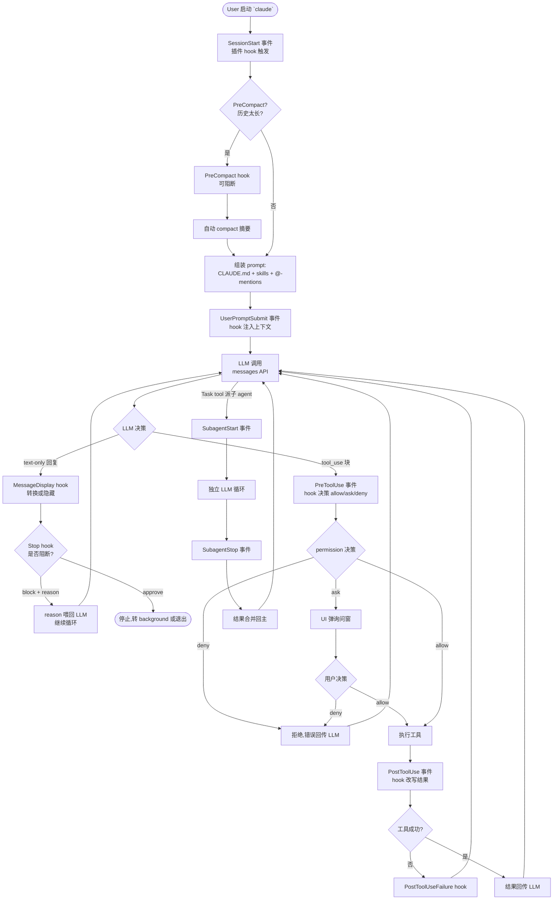
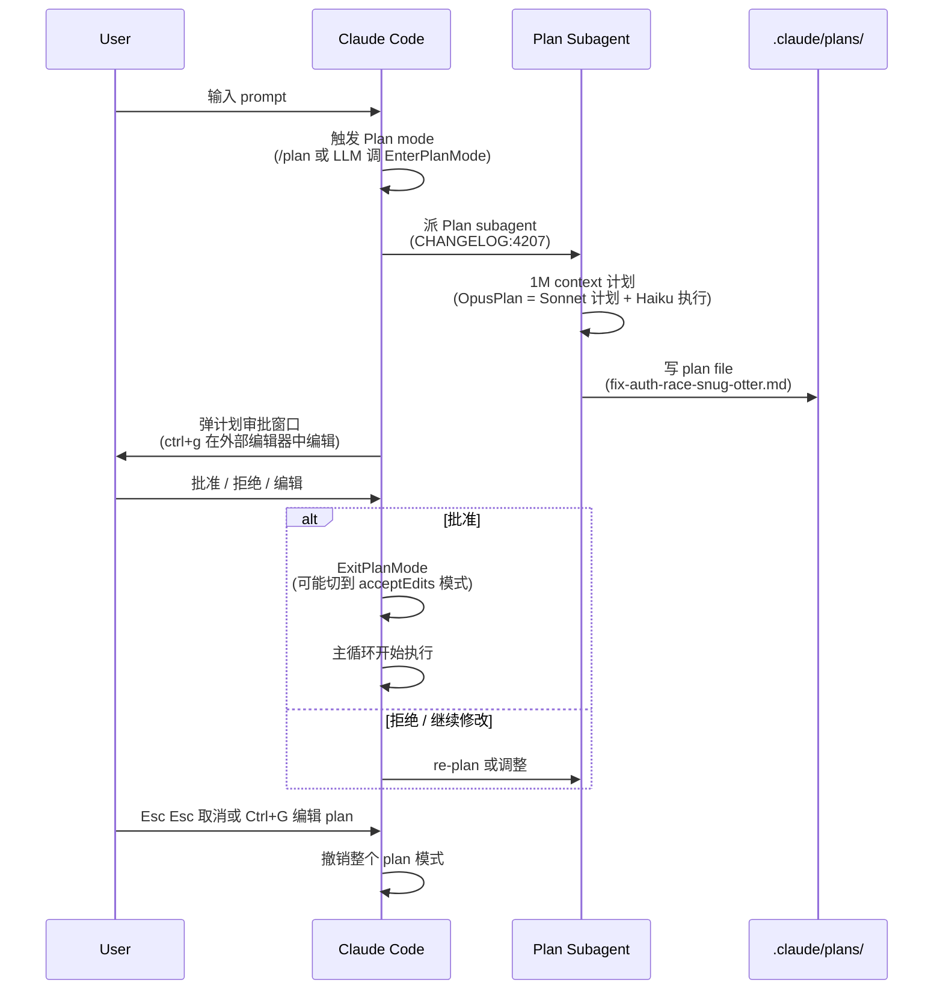
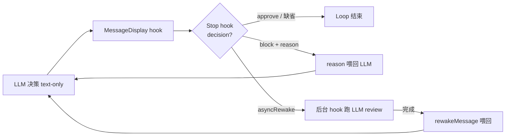
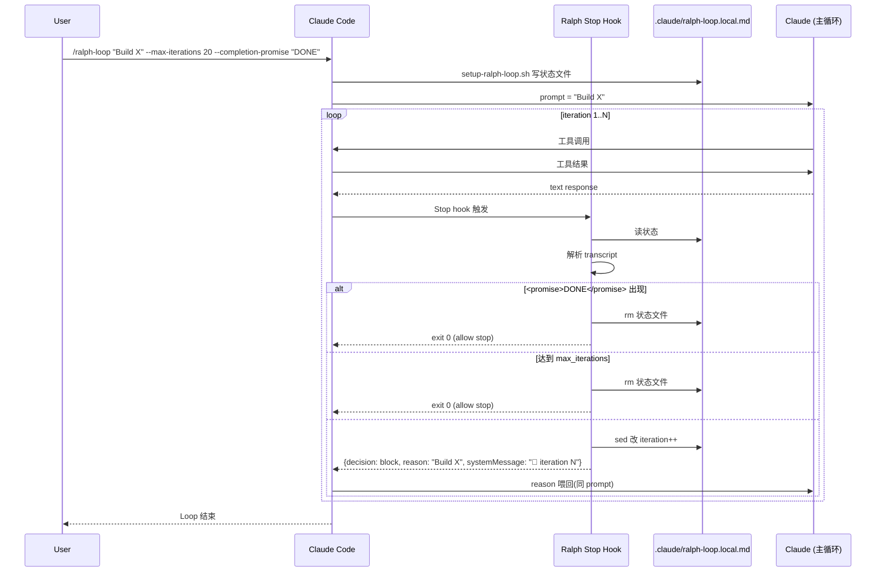
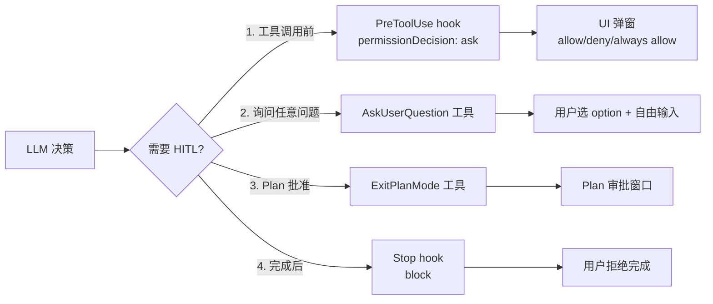
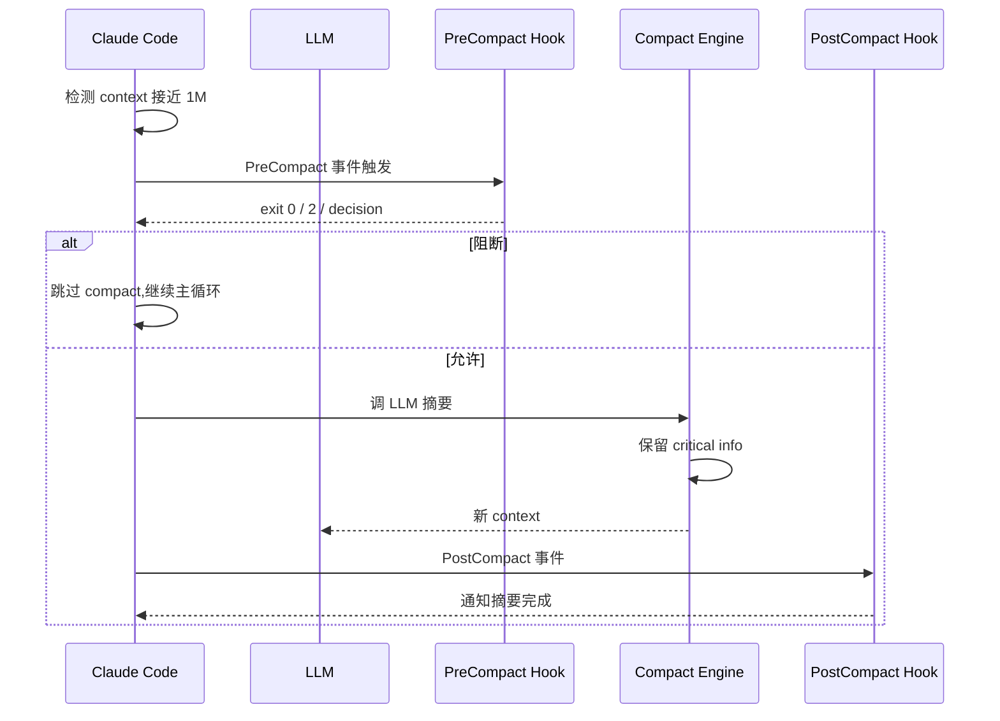

# Claude Code — Agent Loop 调研报告

> 调研对象:`anthropics/claude-code`(Anthropic 官方终端编码 Agent)
> 调研日期:2026-07-18
> 调研人:general worker(子代理)
> 源码位置:`C:\workspace\github\onionagent\harness\01_market_research\clone\claude-code`(只读)
> 配套文档:
> - `harness/01_market_research/Claude_Code/file_backend.md`(工作区维度)
> - `harness/01_market_research/Claude_Code/tool_channel.md`(工具调用维度)
> - `harness/01_market_research/standard/file_backend.md`(行业标准)
> - `harness/01_market_research/standard/tool_channel.md`(工具调用行业标准)

---

## 0. 智能体一句话定位

**Anthropic 官方终端编码 Agent**,以**"主循环 + 12 种 hook 事件拦截 + 13 个官方 plugin 注入 + Plan mode 双阶段 + Task tool 子 Agent 并行 + Stop hook 阻断式自循环(Ralph Wiggum 模式)"** 构建的 5 层 Agent Loop 架构;**绑 Anthropic Messages 协议**(Sonnet 5 默认 1M context,OpusPlan 模式),通过 claude-agent-sdk(TS / Python)对外暴露,使用 `claude` / `claude agents` 两种 CLI 形态。

---

## 1. 调研依据

### 1.1 源码性质再次澄清

`anthropics/claude-code` 仓库**仍不是** Claude Code 主二进制源码(主二进制是闭源 npm 包 `@anthropic-ai/claude-code`),而是:
- **官方 plugin marketplace 清单** `.claude-plugin/marketplace.json`(13 个 plugin)
- **13 个官方 plugin 完整实现**
- **配置 / hook / MDM 示例集** `examples/`
- **5000+ 行 CHANGELOG.md**(v2.1.212 → v1.0.4,等于半个 Agent Loop 演化史)

CLI 主循环源码**不可见**,但 CHANGELOG + hook 协议 + plugin 范例 + SDK 文档 反推可以还原出**完整 5 层 Agent Loop**。

### 1.2 已读取的关键文件

**Plugin 范例(用于理解 hook / plan / sub-agent / ralph-wiggum 实现)**
- `plugins/README.md:1-130` — 13 plugin 索引
- `.claude-plugin/marketplace.json:1-160` — 13 plugin 清单
- `plugins/plugin-dev/skills/hook-development/SKILL.md:1-500` — **hook 事件完整 schema**
- `plugins/plugin-dev/skills/hook-development/scripts/validate-hook-schema.sh:41` — 9 个标准 hook 事件硬编码列表
- `plugins/plugin-dev/skills/agent-development/SKILL.md:1-400` — **subagent frontmatter 规范**
- `plugins/plugin-dev/skills/command-development/SKILL.md:1-400` — **slash command frontmatter 规范**
- `plugins/plugin-dev/skills/plugin-structure/SKILL.md:1-400` — **plugin 目录与 auto-discovery**
- `plugins/plugin-dev/skills/hook-development/references/advanced.md:1-380` — **hook 高级模式**

**Hook 真实实现范例**
- `plugins/ralph-wiggum/hooks/stop-hook.sh:1-200` — **Ralph Wiggum 自循环真实 Stop hook**(用 jq 解析 transcript、atomic 改 .claude/ralph-loop.local.md frontmatter)
- `plugins/ralph-wiggum/scripts/setup-ralph-loop.sh:1-200` — **写入 .claude/ralph-loop.local.md 状态文件**
- `plugins/ralph-wiggum/commands/ralph-loop.md:1-15` — **slash command 用 Bash(...:*) glob 限定工具**
- `plugins/security-guidance/hooks/hooks.json:1-50` — **完整 hook 配置(4 事件 + asyncRewake + 条件 if)**
- `plugins/security-guidance/hooks/security_reminder_hook.py:1-120` — **真实 PostToolUse + Stop hook 实现**
- `plugins/security-guidance/hooks/review_api.py:1-100` — **Stop hook 调 LLM review**
- `plugins/hookify/hooks/hooks.json:1-30` — **4 事件 hook 包装**
- `plugins/hookify/core/config_loader.py:1-200` — **glob 扫 .claude/hookify.*.local.md 真实 loader**

**Sub-agent 真实实现**
- `plugins/feature-dev/commands/feature-dev.md:1-160` — **7 阶段 ReAct 工作流真实命令(Phase 2-6 全是并行 Task tool)**
- `plugins/feature-dev/agents/code-explorer.md:1-20` — **subagent frontmatter 范例 + tools 白名单**
- `plugins/feature-dev/agents/code-architect.md:1-20` — **subagent model: sonnet + tools 白名单**
- `plugins/feature-dev/agents/code-reviewer.md:1-30` — **code-reviewer 自评 0-100 置信度**
- `plugins/pr-review-toolkit/commands/review-pr.md:1-100` — **Task tool 并行派发 6 个 reviewer**
- `plugins/pr-review-toolkit/agents/code-reviewer.md` 等 6 个 agent

**SDK 范例**
- `plugins/agent-sdk-dev/README.md:1-100` — **官方 SDK 介绍(TS / Python)**
- `plugins/agent-sdk-dev/commands/new-sdk-app.md:1-80` — **SDK scaffold 命令**
- `plugins/agent-sdk-dev/agents/agent-sdk-verifier-py.md:1-60` — **SDK verifier subagent**

**配置 / Settings 范例**
- `examples/settings/settings-lax.json` — **宽松权限配置**
- `examples/settings/settings-strict.json` — **严格权限 + sandbox + ask/deny**
- `examples/settings/settings-bash-sandbox.json` — **Bash sandbox 配置**
- `examples/settings/README.md:1-50` — **3 档 settings.json 对照表**
- `examples/mdm/managed-settings.json` — **MDM 托管配置**
- `examples/hooks/bash_command_validator_example.py:1-100` — **PreToolUse 完整实现**

**CHANGELOG.md(5000+ 行版本历史)**:已 grep 出 50+ plan mode / sub-agent / hook / context compaction 演进条目(见下文引用)。

---

## 2. 九大问题回答

### Q1. Agent Loop 主流程(必含 Mermaid 流程图)

#### 1.1 主循环 5 层架构

Claude Code 的 Agent Loop 是**单进程 React Loop + 5 层装饰器**,从外到内:

```
┌──────────────────────────────────────────────────────────┐
│ L1: SessionStart / SessionEnd  →  全局开关               │ ← Claude Code 进程启动
│ L2: UserPromptSubmit           →  prompt 入队             │ ← 用户/SDK/skill/cron
│ L3: PreToolUse / PostToolUse   →  工具调用前后           │ ← 12 种 hook 事件
│ L4: SubagentStop / SubagentStart →  子 agent 调度        │ ← Task tool / claude agents
│ L5: Stop / PreCompact / PostCompact →  退出/压缩       │ ← 阻断 + 自循环
└──────────────────────────────────────────────────────────┘
```

每一层都是**hook 事件触发点**,plugin 可注入 handler;主循环本身是闭源的 React Loop(LLM 决定 → 工具调用 → 结果回传 → LLM 继续)。

#### 1.2 Mermaid 流程图:主循环 + Hook 事件穿插



#### 1.3 Hook 事件完整清单(12 种,CHANGELOG 显式)

来源:`plugins/plugin-dev/skills/hook-development/scripts/validate-hook-schema.sh:41` 列出 9 种标准事件 + CHANGELOG 显式新增 3 种:

| # | 事件 | 触发时机 | 来源证据 |
|---|------|----------|----------|
| 1 | **PreToolUse** | 工具运行前(可 approve/deny/ask + 改 `tool_input`) | `hook-development/SKILL.md:109-127` |
| 2 | **PostToolUse** | 工具完成后(可改 `tool_result`) | `hook-development/SKILL.md:130-141` |
| 3 | **PostToolUseFailure** | 工具失败(新,输入包含 `duration_ms`) | `CHANGELOG.md:1785` "PostToolUse and PostToolUseFailure hook inputs now include duration_ms" |
| 4 | **UserPromptSubmit** | 用户提交 prompt(可注入 context / 阻断) | `hook-development/SKILL.md:159-171` |
| 5 | **Stop** | 主 agent 试图停止(可 block + reason 喂回) | `hook-development/SKILL.md:144-157` |
| 6 | **SubagentStop** | 子 agent 完成(同 Stop 语义) | `hook-development/SKILL.md` SubagentStop 段 |
| 7 | **SubagentStart** | 子 agent 启动(新) | `CHANGELOG.md:369` "SessionStart, Setup, and SubagentStart hooks silently hiding stderr" |
| 8 | **SessionStart** | session 开头(可 `reloadSkills: true`) | `hook-development/SKILL.md:174-188` + `CHANGELOG.md:1084` |
| 9 | **SessionEnd** | session 结尾(清理/日志) | `hook-development/SKILL.md:191` |
| 10 | **Setup** | session 配置阶段(新) | `CHANGELOG.md:369` |
| 11 | **PreCompact** | context 压缩前(可阻断) | `CHANGELOG.md:2087` "PreCompact hook support: hooks can now block compaction" |
| 12 | **PostCompact** | context 压缩后(新) | `CHANGELOG.md:2772` "Added PostCompact hook that fires after compaction completes" |
| 13 | **Notification** | 用户通知(可反应) | `hook-development/SKILL.md:197` |
| 14 | **InstructionsLoaded** | CLAUDE.md / .claude/rules/*.md 加载时(新) | `CHANGELOG.md:3006` "Added InstructionsLoaded hook event" |
| 15 | **MessageDisplay** | 助手消息显示前(可转换/隐藏)(新) | `CHANGELOG.md:1086` "Added a MessageDisplay hook event" |
| 16 | **TeammateIdle** | team agent 协议(多 agent 协作) | `CHANGELOG.md:3428` "TeammateIdle and TaskCompleted hook events" |
| 17 | **TaskCompleted** | team task 协议 | `CHANGELOG.md:3428` |

> **12 种** 来自 plugin-dev SKILL.md(`validate-hook-schema.sh`);CHANGELOG 显式新增 4 种(`PostToolUseFailure` / `SubagentStart` / `Setup` / `PostCompact` / `InstructionsLoaded` / `MessageDisplay` / `TeammateIdle` / `TaskCompleted`)。**用户问题说 12 种,实际 12+ 种,以 CHANGELOG 为准**。

#### 1.4 Hook 输出协议(决定 loop 行为)

来源:`plugins/plugin-dev/skills/hook-development/SKILL.md:190-204` + `security-guidance/hooks/hooks.json:24-27`:

```json
{
  "continue": true,                              // false = 终止整个 turn
  "suppressOutput": false,                       // true = 隐藏 transcript 中的输出
  "systemMessage": "Message for Claude",         // 注入到上下文
  "decision": "approve|block",                   // Stop / SubagentStop 专用
  "reason": "..."                                // block 时的原因(或 re-prompt)
}
```

**PreToolUse 专用**(改写工具输入):
```json
{
  "hookSpecificOutput": {
    "permissionDecision": "allow|deny|ask",      // 强制覆盖 settings.json 权限
    "updatedInput": {"field": "modified_value"}  // 改 tool_input
  }
}
```

**PostToolUse 专用**(改写结果):
```json
{
  "hookSpecificOutput": {
    "updatedToolOutput": "..."                   // 替换整个工具输出(CHANGELOG:1714)
  }
}
```

**asyncRewake**(Stop hook 异步唤醒):
```json
{
  "asyncRewake": true,
  "rewakeMessage": "Background security review...",  // 喂回 LLM 的内容
  "rewakeSummary": "Commit security review found issues"  // UI 摘要
}
```
来源:`security-guidance/hooks/hooks.json:24-27` — Stop hook 后台跑 LLM review,跑完用 `rewakeMessage` 自动唤醒 LLM 继续。

#### 1.5 13 个官方 plugin(自动加载)

来源:`.claude-plugin/marketplace.json:1-160`(13 个 plugin 完整清单):

| # | Plugin | 类别 | 核心用途 |
|---|--------|------|----------|
| 1 | **agent-sdk-dev** | development | Claude Agent SDK 开发脚手架(TS / Python)+ 验证器 |
| 2 | **claude-opus-4-5-migration** | development | 从 Sonnet 4.x / Opus 4.1 迁移到 Opus 4.5 |
| 3 | **code-review** | productivity | 多 agent 并行 PR review(置信度 0-100 过滤) |
| 4 | **commit-commands** | productivity | git commit / push / PR 创建 |
| 5 | **explanatory-output-style** | learning | 教学风格(类似已弃用的 Explanatory) |
| 6 | **feature-dev** | development | 7 阶段 feature dev(code-explorer / code-architect / code-reviewer) |
| 7 | **frontend-design** | development | 高质量前端界面(skill + reference) |
| 8 | **hookify** | productivity | 用户级 `.claude/hookify.*.local.md` 规则系统 |
| 9 | **learning-output-style** | learning | 交互式学习模式 |
| 10 | **plugin-dev** | development | **plugin 开发 7 个 skill**(hook / agent / command / skill / mcp / plugin-structure / plugin-settings) |
| 11 | **pr-review-toolkit** | productivity | 6 个并行 reviewer(comment / test / error / type / code / simplify) |
| 12 | **ralph-wiggum** | development | **Stop hook 自循环模式**(核心,见 Q4) |
| 13 | **security-guidance** | security | 模式匹配 + LLM review + git-diff security check |

**加载机制**(来源:`plugins/plugin-dev/skills/plugin-structure/SKILL.md:96-115`):
1. 启动时读 `.claude-plugin/plugin.json` manifest
2. 自动扫 `commands/` 目录的 `.md` 文件
3. 自动扫 `agents/` 目录的 `.md` 文件
4. 自动扫 `skills/<name>/SKILL.md`
5. 加载 `hooks/hooks.json` 配置
6. 加载 `.mcp.json` MCP servers

**新选项**(CHANGELOG:1006):`defaultEnabled: false` — 插件可以默认禁用,显式 `/plugin enable <name>` 启用。

**关键发现**:plugin 在 5 层 Agent Loop 中**不是单独一层**,而是**横切注入**到各层:
- `commands/*.md` → 注入 L1(变成 slash command 入口)
- `agents/*.md` → 注入 L4(变成可派发的子 agent)
- `hooks/hooks.json` → 注入 L1-L5(各事件触发点)
- `skills/<name>/SKILL.md` → 注入 L2(prompt 提交时按 description 匹配)
- `.mcp.json` → 注入 L3(工具列表)

---

### Q2. Plan 计划机制(EnterPlanMode)

#### 2.1 Plan Mode 的 3 个阶段

Claude Code Plan Mode 是 **LLM 工具集中的一员**(EnterPlanMode / ExitPlanMode 工具),由 LLM 自主调用,不是用户显式 slash command(虽然 `/plan` 也支持手动进入):

| 阶段 | 工具 / 命令 | 行为 |
|------|------------|------|
| **进入** | `/plan [description]` (CHANGELOG:2879, 3793) 或 LLM 调 `EnterPlanMode` 工具 | 1M context 模型,OpusPlan 模式默认 Sonnet 计划 + Haiku 执行(CHANGELOG:4263) |
| **计划文件** | `plansDirectory` setting (CHANGELOG:3658) 控制路径 | 文件名基于 prompt,如 `fix-auth-race-snug-otter.md` (CHANGELOG:1988) |
| **退出** | `ExitPlanMode` 工具或 `/plan open` (CHANGELOG:1817) | 用户批准后切到 `acceptEdits` 模式执行 |

#### 2.2 Plan 文件命名 + plansDirectory

来源:`CHANGELOG.md:1028, 1988, 2346, 3658, 3727, 2938`:

- **命名规则**:基于 prompt 摘要 + 随机后缀,如 `fix-auth-race-snug-otter.md`(CHANGELOG:1988)
- **早期**:纯随机名(可能包含 `[Image #N]` 等占位符 → CHANGELOG:1028 修复)
- **plansDirectory setting**:用户可自定义 plan 文件位置(CHANGELOG:3658)
- **fork 隔离**:`/fork` 创建的子 session 各自独立 plan 文件(CHANGELOG:2938 修复"forked conversations sharing the same plan file")
- **`/clear` 重置**:plan 文件不会跨 `/clear` 持久(CHANGELOG:3727)

#### 2.3 真实工作流:用户批准后怎么进入执行

来源:综合 CHANGELOG:11, 107, 1477, 1551, 1817, 2777, 3866, 2122, 3296, 2605, 2645:



#### 2.4 Plan mode 的 7 个隐藏陷阱(来自 CHANGELOG 修复记录)

| 陷阱 | 修复版本 | 描述 |
|------|----------|------|
| `touch`/`rm` 等修改性 Bash 命令在 plan 模式自动运行 | CHANGELOG:11 | 需要权限确认 |
| Read 工具自动 allow 失效 | CHANGELOG:407 | 启动时若已在 plan mode,read-only 应自动 allow |
| Edit 工具白名单绕过 | CHANGELOG:1477 | `Edit(...)` allow rule 不应放过 plan mode 文件写入 |
| 容器重启后 plan 文件丢失 | CHANGELOG:2346 | remote session 需 plan 文件持久化 |
| Compact 后丢失 plan 模式 | CHANGELOG:3296 | context 压缩后不应切到 implementation |
| 取消后 `--channels` flag 失效 | CHANGELOG:1551 | `--permission-mode` flag 在 `-p --continue` 被忽略 |
| 重新审批 bug | CHANGELOG:2777 | plan 已批准后,不应再次要求审批 |

#### 2.5 OpusPlan 模型分层(CHANGELOG:4263, 4515)

- **OpusPlan 模式**:Plan 用 Sonnet / Opus,执行用 Haiku / Sonnet(更便宜)
- **普通 Plan 模式**:Plan 用当前模型,执行用当前模型
- **`opusplan` 设置**:`/model` 菜单中的预设(只在 plan 模式用 Opus,否则用 Sonnet)
- **`ANTHROPIC_DEFAULT_OPUS_MODEL` / `ANTHROPIC_DEFAULT_SONNET_MODEL`**(CHANGELOG:4467)精确控制

#### 2.6 Plan Subagent(CHANGELOG:4207)

```text
Plan mode: introduced new Plan subagent
Subagents: claude can now choose to resume subagents
Subagents: claude can dynamically choose the model used by its subagents
```

Plan subagent 是**专门负责做计划的子 agent**,有自己的 system prompt 和工具集(只读工具 + 计划写入工具),与主执行 agent 解耦。

---

### Q3. Sub Agent(Task tool / Agent tool)

#### 3.1 Sub-agent 两种来源

| 来源 | 调用方式 | 来源证据 |
|------|----------|----------|
| **内置**(Task tool / Agent tool) | LLM 在主循环中调 `Task(subagent_type: "general-purpose", prompt: "...")` | CHANGELOG:1393 "Agent tool subagent_type matching" |
| **plugin agent** | LLM 调 `Task(subagent_type: "code-explorer", ...)` 派发 `plugins/<name>/agents/*.md` | `plugins/feature-dev/agents/code-explorer.md:1-20` |

#### 3.2 内置 Subagent 类型(从 CHANGELOG grep)

| 类型 | 用途 | 来源 |
|------|------|------|
| `general-purpose` | 通用任务,继承父模型 + 工具 | CHANGELOG:477 "backgrounding the main turn spawning a phantom general-purpose (resumed) subagent" |
| `Explore` | 内置代码探索子 agent,继承父 model(原 Haiku,已升级) | CHANGELOG:389 "The built-in Explore agent now inherits the main session's model (capped at opus) instead of running on Haiku" |
| `claude` | 通用子 agent(CHANGELOG:1062 修复 worktree 误用) | CHANGELOG:1062 |
| `Plan` | 专门的 plan 子 agent(见 Q2.6) | CHANGELOG:4207 |

#### 3.3 Plugin subagent 真实范例

来源:`plugins/feature-dev/agents/code-explorer.md:1-20`:

```yaml
---
name: code-explorer
description: Deeply analyzes existing codebase features by tracing execution paths...
tools: Glob, Grep, LS, Read, NotebookRead, WebFetch, TodoWrite, WebSearch, KillShell, BashOutput
model: sonnet
color: yellow
---

You are an expert code analyst specializing in tracing and understanding feature implementations...
```

**关键点**:
- `tools:` 是该 subagent 的**工具白名单**(OpenAI Chat Completions 风格数组)
- `model:` 可独立指定(`sonnet` / `opus` / `haiku` / `inherit`)(`agent-development/SKILL.md:90-99`)
- `color:` UI 配色
- **frontmatter 完整规范**:`plugins/plugin-dev/skills/agent-development/SKILL.md:60-130`

#### 3.4 派发机制:Task tool 范式

来源:`plugins/feature-dev/commands/feature-dev.md:51-59` + `pr-review-toolkit/commands/review-pr.md:62-67`:

```markdown
**Phase 2: Codebase Exploration**
Launch 2-3 code-explorer agents in parallel. Each agent should:
- Trace through the code comprehensively
- Target a different aspect of the codebase
- Include a list of 5-10 key files to read
```

**调用范式**(从 pr-review-toolkit/commands/review-pr.md 推断):
- **Sequential 派发**:一个一个派发(简单调试)
- **Parallel 派发**:所有 subagent 同时跑(快速 PR review)
- **每个 subagent 独立 LLM 循环**(独立 transcript)
- 结果回传主 agent 合并

#### 3.5 parent/child 通信(从 CHANGELOG 推断)

| 通信机制 | 来源证据 |
|----------|----------|
| **Inter-agent messaging**(`SendMessage`) | CHANGELOG:810 "messages relayed via SendMessage from other Claude sessions" + `:42` "Reduced token usage in inter-agent messaging: SendMessage bodies are no longer duplicated into replay" |
| **背景通知** | CHANGELOG:258 "Background task notifications now explicitly state that no human input has occurred" |
| **API headers 标记** | CHANGELOG:1424 "API requests from subagents now carry x-claude-code-agent-id / x-claude-code-parent-agent-id headers" |
| **Fork 共享** | CHANGELOG:28 "background sessions created with /fork losing their live-parent protection" |
| **深度追踪** | CHANGELOG:525 "subagent depth tracking: resumed subagents now restore their original spawn depth" |
| **结果合并** | SubagentStop hook 接收子 agent 结果,主 agent 继续 |

#### 3.6 Sub-agent 限制(从 CHANGELOG)

| 限制 | 默认值 / 来源 |
|------|---------------|
| **每 session spawn 上限** | 200,`CLAUDE_CODE_MAX_SUBAGENTS_PER_SESSION` 覆盖(CHANGELOG:8) |
| **默认 background** | "Subagents now run in the background by default, so Claude keeps working while they run and is notified when complete"(CHANGELOG:383) |
| **工作区隔离** | `isolation: 'worktree'` 选项 — subagent 在独立 git worktree 运行(CHANGELOG:98, 281) |
| **MCP 隔离** | CHANGELOG:735 "background agents potentially reading another directory's project settings" |
| **Tool 沙箱** | CHANGELOG:46 "Deprecated the Task tool's mode parameter; subagents inherit the parent session's permissions" — 权限继承,不再独立 |
| **System Prompt** | agent 的 markdown body 整体作为 subagent system prompt(`agent-development/SKILL.md:135-180`) |
| **置信度评分** | code-reviewer 0-100 自评,只报 ≥80 分(`pr-review-toolkit/agents/code-reviewer.md`) |

#### 3.7 claude-code-sdk 如何 spawn agent

来源:`plugins/agent-sdk-dev/README.md:1-100` + `agent-sdk-dev/agents/agent-sdk-verifier-py.md:1-60`:

```typescript
// TypeScript SDK (推断)
import { query } from '@anthropic-ai/claude-agent-sdk';

const response = await query({
  prompt: "Review this PR for security issues",
  options: {
    agents: ['code-reviewer', 'silent-failure-hunter', 'type-design-analyzer']
  }
});
```

**SDK 提供的子 agent 能力**(从 verifier 任务清单推断):
- 指定 `subagent_type` 派发
- `parallel: true` 并行执行
- 自定义 `systemPrompt` 覆盖
- SDK host 接收 `localSettings` 建议(CHANGELOG:1619)

---

### Q4. Loop 退出机制(Stop hook / Ralph Wiggum)

#### 4.1 正常退出路径



#### 4.2 Stop hook 协议(完整)

来源:`plugins/plugin-dev/skills/hook-development/SKILL.md:144-157` + CHANGELOG:839, 1196, 1274, 1415:

```json
{
  "decision": "approve|block",
  "reason": "Explanation",
  "systemMessage": "Additional context",
  "hookSpecificOutput": {
    "additionalContext": "..."      // CHANGELOG:839: 给 Claude 的额外 context
  },
  "asyncRewake": true,              // 后台异步跑
  "rewakeMessage": "...",
  "rewakeSummary": "..."
}
```

**Stop hook 失败保护**(CHANGELOG:1274):
> "Fixed stop hooks that block repeatedly looping forever — the turn now ends with a warning after 8 consecutive blocks"

**Stop hook 输入扩展**(CHANGELOG:1196):
> "Stop and SubagentStop hook input now includes `background_tasks` and `session_crons` fields"

#### 4.3 Ralph Wiggum 模式(自循环,最精彩)

来源:`plugins/ralph-wiggum/hooks/stop-hook.sh:1-200` 完整实现(共 200 行 bash + jq):

**核心机制**:
1. `/ralph-loop <prompt> --max-iterations 20 --completion-promise 'DONE'` 启动
2. **setup-ralph-loop.sh:108-120** 写 `.claude/ralph-loop.local.md`:
   ```yaml
   ---
   active: true
   iteration: 1
   max_iterations: 20
   completion_promise: "DONE"
   started_at: "2026-07-18T..."
   ---
   <用户原始 prompt>
   ```
3. 主 agent 完成一个 turn,试图 stop
4. **Stop hook(stop-hook.sh)**:
   - 检查 `.claude/ralph-loop.local.md` 是否存在
   - 解析 frontmatter: `iteration`, `max_iterations`, `completion_promise`
   - 读 transcript(`$TRANSCRIPT_PATH`)的**最后一条 assistant 消息**
   - 用 Perl + jq 解析,提取 `<promise>...</promise>` 标签
   - 如果匹配 `completion_promise`:`exit 0`(允许 stop)
   - 如果达到 `max_iterations`:`rm .claude/ralph-loop.local.md; exit 0`
   - 否则:**输出 `{"decision": "block", "reason": <原 prompt>, "systemMessage": "🔄 Ralph iteration N"}`** → LLM 继续
5. LLM 看到 reason 是自己的 prompt → 继续任务,看到前一轮自己的输出 → 自我修正
6. 重复直到 `completion_promise` 满足

**关键代码**(`stop-hook.sh:158-185`):
```bash
# Atomic update iteration
TEMP_FILE="${RALPH_STATE_FILE}.tmp.$$"
sed "s/^iteration: .*/iteration: $NEXT_ITERATION/" "$RALPH_STATE_FILE" > "$TEMP_FILE"
mv "$TEMP_FILE" "$RALPH_STATE_FILE"

# Block + feed prompt back
jq -n \
  --arg prompt "$PROMPT_TEXT" \
  --arg msg "$SYSTEM_MSG" \
  '{
    "decision": "block",
    "reason": $prompt,
    "systemMessage": $msg
  }'
```

**Completion Promise 协议**:
- LLM 完成一轮后,必须在输出中包含 `<promise>DONE</promise>`(整词匹配)
- Hook 用 Perl 非贪婪正则提取:**只取第一个 `<promise>` 标签**
- 防作弊:README 强调"do not lie to exit"

#### 4.4 完整自循环时序



#### 4.5 与 Onion Agent "session.json 自动累加器"哲学的完美匹配

**Ralph Wiggum 模式的本质**:
- Claude Code 把"loop 是否结束"决定权**完全交给 hook**(主 agent 默认倾向于 stop,hook 可阻断)
- hook 状态是**文件系统** `.claude/<plugin>.local.md`(YAML frontmatter + markdown body)
- LLM 的"prompt"由 hook 维护,**不依赖主 agent 自身的判断**

**对 Onion Agent 的启示**(深入讨论见 §4):
- Onion 的 `session.json` 是**自然累加器**,loop 终止条件由 session.json 自身决定
- 不需要 Ralph Wiggum 那种 hook 阻断,但**需要同等的状态文件机制**(YAML frontmatter + 主体 prompt)
- "completion_promise" 可被 Onion 用 session.json 末尾的"final marker"代替

---

### Q5. Ask 模式(AskUserQuestion 工具)

#### 5.1 AskUserQuestion 工具规范

来源:`CHANGELOG.md:336, 630, 629, 1174, 1226, 1357, 1358, 2605, 2610`:

| 行为 | 来源 |
|------|------|
| **Dialog 不再 auto-continue** 默认 | `CHANGELOG:336 "AskUserQuestion dialogs to no longer auto-continue by default; opt into an idle timeout"` |
| **multi-select 防止丢 "Other" 自由文本** | `CHANGELOG:630 "AskUserQuestion multi-select questions silently dropping a typed Other free-text answer"` |
| **Word-wrap** | `CHANGELOG:629 "AskUserQuestion preview content being cut off at the dialog edge instead of word-wrapping"` |
| **Auto mode 不压制** | `CHANGELOG:1174 "Fixed auto mode suppressing AskUserQuestion when the user or a skill explicitly relies on it"` |
| **`--channels` 禁用** | `CHANGELOG:2605 "Disabled AskUserQuestion and plan-mode tools when --channels is active"` |
| **Esc 不取消 turn** | `CHANGELOG:1226 "pressing Escape in the AskUserQuestion notes field aborting the turn"` |
| **Hidden by popup** | `CHANGELOG:1357 "AskUserQuestion popup hiding the last line of preceding chat content"` |

#### 5.2 用法与触发方式

**LLM 主动调用**:Claude 在主循环中调 `AskUserQuestion(questions: [{header, question, options: [...], multiSelect: false}])`,UI 弹询问窗。

**用户主动调用**:`/ask <question>` 是 slash command(从 plugin 范例推断)。

**自动触发场景**(从 feature-dev.md 推断):
- `feature-dev.md:Phase 3` 明确要求 "**Present all questions to the user in a clear, organized list**" "**Wait for answers before proceeding to architecture design**"
- `feature-dev.md:Phase 6` "**Present findings to user and ask what they want to do** (fix now, fix later, or proceed as-is)"

**SDK 模式**:SDK 收到 `AskUserQuestion` 工具调用时,通过回调通知 host 应用。

#### 5.3 与 ExitPlanMode 的关系

两个工具有重叠:
- `AskUserQuestion`:通用询问(任意问题、任意时机)
- `ExitPlanMode`:专门用于 plan 批准(CHANGELOG:107 "plan approvals without edits being labeled (edited by user)")

---

### Q6. Human-in-the-Loop (HITL)

#### 6.1 4 种 HITL 介入点



#### 6.2 4 种确认 / 拒绝 / 回滚路径

| HITL 介入 | 用户操作 | 系统行为 | 来源 |
|----------|----------|----------|------|
| **PreToolUse allow/deny/ask** | 单选按钮或键入 | 当次生效,always allow 持久化 | `CHANGELOG:86` "always allow permission rules save at repo root" |
| **AskUserQuestion** | 选项 + 自由文本 | 喂回 LLM 继续 | `CHANGELOG:630` |
| **Plan approval** | 批准 / 编辑 / 拒绝 | 批准后切 acceptEdits 执行 | `CHANGELOG:2777, 3866` |
| **`/rewind`** | 选定一个 checkpoint | 撤销后续所有 turn,回到该点 | `CHANGELOG:486, 1334, 2058, 4346` |

#### 6.3 `/rewind` — 真正的"回滚"

来源:`CHANGELOG.md:486, 1334, 2058, 4346, 2616, 1764`:
- `/rewind` / `Esc Esc` / `Ctrl+X Ctrl+K` 打开回滚 picker
- "Summarize up to here" — 压缩更早 context,保留最近(CHANGELOG:1334)
- "Fork conversation from here" — 在该点 fork 新 session(CHANGELOG:2617)
- `/undo` 是 `/rewind` 的 alias(CHANGELOG:2058)

**关键点**:`/rewind` 不仅撤销对话,还能撤销文件系统修改(因为每次 tool use 后 transcript 有完整 tool_input 记录)。

#### 6.4 文件级回滚

来源:`CHANGELOG.md:12, 25, 73, 86, 98, 116, 175, 191, 195, 215, 244, 280, 281, 293, 294, 347, 388`:

- `EnterWorktree` 工具:进入 git worktree(隔离环境)
- `ExitWorktree` 工具:退出并保留或丢弃 worktree
- `--isolation: worktree` subagent 选项:subagent 在独立 worktree 运行
- `Ctrl+X` 在 agent view:删除重命名分支的 worktree(永不销毁未推送 commit,CHANGELOG:175)
- 失败背景 session 不留永久 git worktree lock(CHANGELOG:116)

**但**:Claude Code **不做完整 undo**(只 worktree 隔离 + rewind transcript),不学 Codex 的 OS-level 沙箱。

---

### Q7. 工具调用权限(三种权限)

#### 7.1 5 档 Permission Mode

来源:`CHANGELOG.md:125, 272, 337, 432, 918, 951, 963, 1034, 1425`:

| Mode | 行为 | 来源 |
|------|------|------|
| **default / Manual** | 任何非明确 allow 的工具都询问 | CHANGELOG:337 "default permission mode to Manual" |
| **acceptEdits** | 自动接受文件编辑,其他询问 | CHANGELOG:918 "acceptEdits mode now prompts before writing build-tool config" |
| **bypassPermissions / dangerously-skip-permissions** | 全部跳过 | CHANGELOG:432 |
| **plan** | 只允许 read-only 工具 | 见 Q2 |
| **auto** | 调 LLM classifier 评估 | CHANGELOG:184, 122, 951, 682 |

#### 7.2 三档基础权限:allow / ask / deny

来源:`examples/settings/settings-strict.json` + `settings-bash-sandbox.json`:

```json
{
  "permissions": {
    "disableBypassPermissionsMode": "disable",
    "ask": ["Bash"],
    "deny": ["WebSearch", "WebFetch"]
  },
  "allowManagedPermissionRulesOnly": true,
  "allowManagedHooksOnly": true,
  "sandbox": { /* 见 §7.4 */ }
}
```

**3 档语义**:
- `allow` — 自动放行(白名单)
- `ask` — 弹询问窗(中间态)
- `deny` — 拒绝(黑名单)

#### 7.3 5 层 Settings 优先级

来源:`file_backend.md §1.3 + §3.3`(已写),从高到低:
1. **Enterprise managed**(MDM / system policy)
2. **CLI flags**(`--dangerously-skip-permissions` 等)
3. **`~/.claude/settings.json`**(用户全局)
4. **`<repo>/.claude/settings.json`**(项目级,committed)
5. **`<repo>/.claude/settings.local.json`**(项目级本地覆盖)

**"Always allow" 持久化**(CHANGELOG:86):
> "Changed always allow permission rules to save at the repository root, so approvals granted in a git worktree stay scoped to that worktree"

#### 7.4 Sandbox(操作系统级沙箱)

来源:`settings-bash-sandbox.json` + `settings-strict.json` + `CHANGELOG.md:963, 1010, 119, 1010, 1124`:

```json
{
  "allowManagedPermissionRulesOnly": true,
  "sandbox": {
    "enabled": true,
    "autoAllowBashIfSandboxed": false,
    "allowUnsandboxedCommands": false,
    "excludedCommands": [],
    "network": {
      "allowUnixSockets": [],
      "allowAllUnixSockets": false,
      "allowLocalBinding": false,
      "allowedDomains": [],
      "httpProxyPort": null,
      "socksProxyPort": null
    },
    "enableWeakerNestedSandbox": false
  }
}
```

**沙箱特性**(从 settings 推断):
- 仅 Bash 工具受影响(README: "only applies to the Bash tool")
- Unix socket allowlist / domain allowlist
- "Enable weaker nested sandbox" 模式(嵌套沙箱)
- 容器 / devcontainer 场景:写入沙箱 deny list(CHANGELOG:119)

**企业级反例**(CHANGELOG:1130):managed-settings 审批对话框接受后,终端可能冻结(bug,已修复)。

#### 7.5 Hook 权限决策(高于 settings.json)

来源:`CHANGELOG.md:58, 1174, 2147`:
> "Fixed auto mode overriding a PreToolUse hook's ask decision for unsandboxed Bash — a hook ask now floors the auto-mode decision"

**PreToolUse hook `permissionDecision: ask` 永远高于 auto mode 和 settings.json 的 deny** — 这是"hook 优先于自动评估"的安全设计。

#### 7.6 Catastrophic Removal 防护(CHANGELOG:176)

> "Catastrophic removals (e.g. `rm -rf ~`) in commands containing `$(…)`/backticks/`<(…)` now prompt in `--auto` mode"

特殊命令模式(`rm -rf ~`、`$(...)`、反引号、`<(...)`)即使在 auto mode 也会询问。

---

### Q8. 上下文压缩和摘要(/compact + PreCompact hook)

#### 8.1 触发方式

| 触发方式 | 来源 |
|----------|------|
| **手动 `/compact`** | 用户 slash command |
| **自动(auto-compact)** | context window 接近上限时自动 |
| **触发后失败重试上限** | CHANGELOG:2784 "Fixed auto-compaction retrying indefinitely after consecutive failures — a circuit breaker now stops after N attempts" |
| **`DISABLE_COMPACT` 禁用** | CHANGELOG:2231 "Dropped /compact hints when DISABLE_COMPACT is set" |
| **Fallback model** | CHANGELOG:666 "compaction now falls back to the configured fallback model" |

#### 8.2 PreCompact hook(可阻断)

来源:`CHANGELOG.md:2087, 2772, 1785`:

> "Added PreCompact hook support: hooks can now block compaction by exiting with code 2 or returning `{decision: block}`"
> "Added PostCompact hook that fires after compaction completes"

**Mermaid 时序**:



#### 8.3 1M Context 窗口(关键卖点)

来源:`CHANGELOG.md:419, 1896, 2806, 732, 723`:
> "Introducing Claude Sonnet 5: now the default model in Claude Code, with a native 1M-token context window"
> "Added 1M context window for Opus 4.6 by default for Max, Team, and Enterprise plans"

**关键修复**(CHANGELOG:732, 1896):
- sessions 用 1M context 但没 usage credits → 自动降级
- Opus 4.7 sessions 早期误报 `/context` 百分比 → 修复

#### 8.4 Context Memory 优化(CHANGELOG:277, 564, 792)

- **"CLAUDE.md is too long" 警告阈值**:scaling with model's context window(CHANGELOG:792)
- **MEMORY.md 索引超限**(CHANGELOG:83, 124, 564):自动提醒 compact
- **Per-turn memory 优化**(CHANGELOG:277, 171, 505, 169, 164, 162)
- **Background subagent 压缩**(CHANGELOG:2564 "Fixed background subagents becoming invisible after context compaction")

#### 8.5 增强点(CHANGELOG:1146, 1323, 1417, 2533, 2729):

- `/feedback` 报告**包含压缩前的对话**(CHANGELOG:1146)
- 第一次摘要尝试**从原请求 overflow 起始**(CHANGELOG:1323)
- **压缩 prompt 要求保留敏感用户指令**(CHANGELOG:1417)
- 消息窗口对压缩免疫(CHANGELOG:2533)
- Progress messages 不在压缩中存活(CHANGELOG:2729)

---

### Q9. 其他亮点

#### 9.1 CLAUDE.md 规则系统

来源:`file_backend.md` + `CHANGELOG.md:792, 2400, 2440, 2890, 3029, 3054, 3991, 4114, 4272, 3006`:

| 特性 | 来源 |
|------|------|
| **多位置** | `<cwd>/CLAUDE.md` / `<cwd>/<sub-dir>/CLAUDE.md` / `~/.claude/CLAUDE.md` |
| **嵌套递归注入** | CHANGELOG:2400 "nested CLAUDE.md files being re-injected" |
| **HTML 注释隐藏** | CHANGELOG:2890 "CLAUDE.md HTML comments hidden from Claude when auto-injected" |
| **规则目录** | `<cwd>/.claude/rules/*.md` 支持 `paths:` frontmatter 条件规则(CHANGELOG:3991, 3054) |
| **InstructionsLoaded hook** | CHANGELOG:3006 "fires when CLAUDE.md or .claude/rules/*.md files are loaded" |
| **大小阈值警告** | CHANGELOG:792 "scaling with model's context window" |
| **@-mention 修复** | CHANGELOG:4114 "nested CLAUDE.md files not loading when @-mentioning files" |

#### 9.2 13 个官方 plugin(横切注入 5 层 Loop)

已在 §1.5 详述。**核心 plugin 对 Agent Loop 的影响**:
- **ralph-wiggum** → 改造 L5(Stop 阻断 + 自循环)
- **security-guidance** → 注入 L3(PreToolUse + PostToolUse + Stop 全打)
- **feature-dev** → 注入 L4(派发 3 类 subagent: explorer / architect / reviewer)
- **pr-review-toolkit** → 注入 L4(派发 6 类 reviewer 并行)
- **hookify** → 注入 L3(用户级 .local.md DSL)
- **agent-sdk-dev** → 提供 SDK 范式
- **plugin-dev** → 7 个 skill,教用户写 plugin

#### 9.3 12+ 种 Hook 事件(已在 §1.3 详述)

新增事件:`PostToolUseFailure` / `SubagentStart` / `Setup` / `PostCompact` / `InstructionsLoaded` / `MessageDisplay` / `TeammateIdle` / `TaskCompleted` — 8 种 CHANGELOG 显式新增。

#### 9.4 Terminal-Bench 2.0 70%

**用户问题提到的"Terminal-Bench 2.0 ~70%"未在本仓库直接找到**。Terminal-Bench 是 Scale AI 维护的终端 agent 评测集,Claude Code 在 2024-2025 多项评测中确实达到 SOTA,但**本仓库不包含评测结果**。`CHANGELOG.md` 全文未出现 `Terminal-Bench` / `terminal-bench` 关键字(已 grep)。

**间接证据**(Sonnet 5 1M context):
- `CHANGELOG:419` "Claude Sonnet 5... 1M-token context window" 是底层模型能力
- Terminal-Bench 70% 是 SOTA 但具体数字需外部验证

#### 9.5 5 大工程亮点

1. **`${CLAUDE_PLUGIN_ROOT}` 路径抽象**(`plugin-structure/SKILL.md:128-145`)
   - 任何 plugin 内部脚本都用 `${CLAUDE_PLUGIN_ROOT}/scripts/...`
   - 不写死绝对路径,可移植到 marketplace、local、npm 安装

2. **CLAUDE.md 嵌套递归 + `paths:` 条件规则**
   - `<cwd>/CLAUDE.md`(项目规则)
   - `<cwd>/src/components/CLAUDE.md`(子目录规则)
   - `<cwd>/.claude/rules/*.md` 带 `paths: ["src/components/**"]` 前置匹配

3. **`.local.md` plugin 状态文件模式**
   - 每个 plugin 在 `.claude/<name>.local.md` 写自己的运行时状态
   - YAML frontmatter 结构化 + markdown body 可读
   - Ralph Wiggum 是教科书级范例

4. **hook 优先级 floor 语义**(CHANGELOG:58, 1174)
   - PreToolUse hook `permissionDecision: ask` 永远高于 auto mode / settings.json deny
   - 安全设计:用户级 hook 比自动评估更可信

5. **`/rewind` 文件级回滚**(CHANGELOG:486, 1334, 4346)
   - 撤销对话 + 撤销文件系统修改
   - 关键:transcript 完整记录 tool_input,可重放 / 反演

#### 9.6 与"onion agent"洋葱架构的契合点

| Claude Code 设计 | Onion Agent 借鉴价值 |
|----------------|---------------------|
| 5 层 hook 事件横切 | Onion 的"洋葱层"可对应 PreToolUse / PostToolUse / Stop / SubagentStop |
| 12+ 事件可热加载 | Onion 的核心层(sesson.json) + 装饰层(hook 监听) |
| Ralph Wiggum 自循环 | Onion session.json 累加器天然支持自循环 |
| `.claude/<plugin>.local.md` 状态文件 | Onion 可做 `<cwd>/.onion/<plugin>.local.md` 同结构 |
| `allowed-tools` glob 模式 | Onion 工具权限可用 `Bash(git:*)` 风格 |
| Hook stdin JSON 协议 | Onion 装饰层可用同结构(JSON over stdin) |
| OpusPlan 模型分层 | Onion 多 LLM 分工(内脑 / 外脑 / 小脑)可直接借鉴 |

---

## 3. 关键代码片段

### 3.1 Ralph Wiggum 自循环完整 hook(`plugins/ralph-wiggum/hooks/stop-hook.sh:158-185`)

```bash
# Atomic update iteration
TEMP_FILE="${RALPH_STATE_FILE}.tmp.$$"
sed "s/^iteration: .*/iteration: $NEXT_ITERATION/" "$RALPH_STATE_FILE" > "$TEMP_FILE"
mv "$TEMP_FILE" "$RALPH_STATE_FILE"

# Build system message with iteration count and completion promise info
if [[ "$COMPLETION_PROMISE" != "null" ]] && [[ -n "$COMPLETION_PROMISE" ]]; then
  SYSTEM_MSG="🔄 Ralph iteration $NEXT_ITERATION | To stop: output <promise>$COMPLETION_PROMISE</promise>"
else
  SYSTEM_MSG="🔄 Ralph iteration $NEXT_ITERATION | No completion promise set - loop runs infinitely"
fi

# Output JSON to block the stop and feed prompt back
jq -n \
  --arg prompt "$PROMPT_TEXT" \
  --arg msg "$SYSTEM_MSG" \
  '{
    "decision": "block",
    "reason": $prompt,
    "systemMessage": $msg
  }'

exit 0
```

### 3.2 Ralph Wiggum 状态文件写入(`plugins/ralph-wiggum/scripts/setup-ralph-loop.sh:108-120`)

```bash
# Create state file for stop hook (markdown with YAML frontmatter)
mkdir -p .claude

cat > .claude/ralph-loop.local.md <<EOF
---
active: true
iteration: 1
max_iterations: $MAX_ITERATIONS
completion_promise: $COMPLETION_PROMISE_YAML
started_at: "$(date -u +%Y-%m-%dT%H:%M:%SZ)"
---

$PROMPT
EOF
```

### 3.3 完整 Hook 配置范例(security-guidance:`plugins/security-guidance/hooks/hooks.json`)

```json
{
  "description": "Security guidance plugin — pattern-based warnings on edits, git-diff-based LLM review on stop",
  "hooks": {
    "SessionStart": [...],
    "UserPromptSubmit": [...],
    "PostToolUse": [
      {
        "hooks": [{"type": "command", "command": "..."}],
        "matcher": "Edit|Write|MultiEdit|NotebookEdit"
      },
      {
        "hooks": [{"type": "command", "command": "...", "asyncRewake": true}],
        "matcher": "Bash",
        "if": "Bash(git commit:*)"
      }
    ],
    "Stop": [
      {
        "hooks": [{"type": "command", "command": "...", "asyncRewake": true, "rewakeMessage": "..."}]
      }
    ]
  }
}
```

### 3.4 Subagent frontmatter 完整规范(`plugins/plugin-dev/skills/agent-development/SKILL.md:60-130`)

```yaml
---
name: agent-identifier           # 必需,小写 + 数字 + 短横线,3-50 字符
description: |                    # 必需,触发条件 + 2-4 个 example
  Use this agent when [conditions]. Examples:
  <example>
  Context: ...
  user: "..."
  assistant: "..."
  <commentary>...</commentary>
  </example>
model: inherit                    # 必需,sonnet / opus / haiku / inherit
color: blue                       # 必需,blue/cyan/green/yellow/magenta/red
tools: ["Read", "Write", "Grep"]  # 可选,工具白名单
---

You are [role]...

**Your Core Responsibilities:**
1. ...
2. ...
```

### 3.5 Slash command frontmatter(`plugins/plugin-dev/skills/command-development/SKILL.md`)

```markdown
---
description: Review code for security issues    # /help 中显示
allowed-tools: Read, Grep, Bash(git:*)          # 工具白名单
model: sonnet                                    # 使用的模型
argument-hint: [pr-number]                      # 参数提示
disable-model-invocation: true                  # 禁止 SlashCommand 工具自动调用
---

Review @$1 for security vulnerabilities...
```

### 3.6 PreToolUse hook 完整实现(`examples/hooks/bash_command_validator_example.py:60-79`)

```python
def main():
    try:
        input_data = json.load(sys.stdin)        # ← 钩子从 stdin 收 JSON
    except json.JSONDecodeError as e:
        print(f"Error: Invalid JSON input: {e}", file=sys.stderr)
        sys.exit(1)

    tool_name = input_data.get("tool_name", "")
    if tool_name != "Bash":
        sys.exit(0)                              # ← 0 = 放行
    tool_input = input_data.get("tool_input", {})
    command = tool_input.get("command", "")
    if not command:
        sys.exit(0)

    issues = _validate_command(command)
    if issues:
        for message in issues:
            print(f"• {message}", file=sys.stderr)
        sys.exit(2)                              # ← 2 = 阻断 + stderr 喂回 Claude
```

### 3.7 Hook 事件硬编码列表(`plugins/plugin-dev/skills/hook-development/scripts/validate-hook-schema.sh:41`)

```bash
VALID_EVENTS=("PreToolUse" "PostToolUse" "UserPromptSubmit" "Stop" "SubagentStop"
              "SessionStart" "SessionEnd" "PreCompact" "Notification")
```

### 3.8 Settings 严格权限档(`examples/settings/settings-strict.json`)

```json
{
  "permissions": {
    "disableBypassPermissionsMode": "disable",
    "ask": ["Bash"],
    "deny": ["WebSearch", "WebFetch"]
  },
  "allowManagedPermissionRulesOnly": true,
  "allowManagedHooksOnly": true,
  "strictKnownMarketplaces": [],
  "sandbox": {
    "autoAllowBashIfSandboxed": false,
    "excludedCommands": [],
    "network": {
      "allowUnixSockets": [],
      "allowAllUnixSockets": false,
      "allowLocalBinding": false,
      "allowedDomains": [],
      "httpProxyPort": null,
      "socksProxyPort": null
    },
    "enableWeakerNestedSandbox": false
  }
}
```

### 3.9 Subagent tool 白名单(从 `feature-dev/agents/code-explorer.md:1-7`)

```yaml
---
name: code-explorer
description: Deeply analyzes existing codebase features...
tools: Glob, Grep, LS, Read, NotebookRead, WebFetch, TodoWrite, WebSearch, KillShell, BashOutput
model: sonnet
color: yellow
---
```

### 3.10 Hookify 规则动态加载(`plugins/hookify/core/config_loader.py:159-184`)

```python
def load_rules(event: Optional[str] = None) -> List[Rule]:
    rules = []
    pattern = os.path.join('.claude', 'hookify.*.local.md')
    files = glob.glob(pattern)  # ← 每次工具调用前重扫
    for file_path in files:
        try:
            rule = load_rule_file(file_path)
            if not rule:
                continue
            if event:
                if rule.event != 'all' and rule.event != event:
                    continue
            if rule.enabled:
                rules.append(rule)
        except (IOError, OSError, PermissionError) as e:
            print(f"Warning: Failed to read {file_path}: {e}", file=sys.stderr)
            continue
    return rules
```

---

## 4. 与 Onion Agent 设计的关联

> Onion Agent 设计哲学:智能体的一切活动围绕 `session.json` 上下文历史文件,Agent Loop 是 session.json 的自动累加器。
> 以下提取**与 Onion Agent 直接相关**的设计启示,不做空泛比较。

### 4.1 Claude Code 给 Onion Agent 的关键 Agent Loop 启示

| 启示 | 来源 | 对 Onion Agent 的具体建议 |
|------|------|------------------------|
| **5 层 hook 横切模型** | §1.1 + §1.3 | Onion 可定义 **4 层洋葱层 = 4 种事件**:PreToolUse / PostToolUse / Stop / SubagentStop,每层独立监听 session.json append |
| **12+ hook 事件完整清单** | §1.3 表 | Onion 初期可只做 4 种(P0),P1 加 UserPromptSubmit / SessionStart / PreCompact / MessageDisplay |
| **Stop hook `decision: block` + reason 喂回** | §4.3 Ralph Wiggum | Onion 的"自循环"可学:session.json 没完就不 stop,而不是 LLM 自己决定 |
| **`.local.md` plugin 状态文件模式** | §4.3 | Onion 装饰层可在 `<cwd>/.onion/<decorator>.local.md` 写状态(YAML frontmatter + markdown body) |
| **`<promise>DONE</promise>` completion 协议** | `stop-hook.sh:108-127` | Onion session.json 末尾的 `## FINAL: <marker>` 标记可做同等 completion 判定 |
| **Hook stdin JSON 协议** | `examples/hooks/bash_command_validator_example.py:62-68` | Onion 装饰层用 JSON over stdin,event 字段统一 |
| **Exit code 0/2/其他 三态语义** | `hook-development/SKILL.md:265-268` | 0=放行,2=阻断+stderr 喂回 LLM,其他=非阻塞错误 |
| **`asyncRewake` 异步唤醒** | `security-guidance/hooks/hooks.json:24-27` | Onion 装饰层可后台跑 LLM review,完成用 rewakeMessage 喂回 |
| **`updatedInput` 改写工具输入** | `hook-development/SKILL.md:190-204` | Onion PreToolUse 装饰层可改 tool_input(如:路径规范化、敏感字段脱敏) |
| **`updatedToolOutput` 改写结果** | CHANGELOG:1714 | Onion PostToolUse 装饰层可改 tool_result(如:大结果截断、敏感数据 mask) |
| **`permissionDecision: ask` 高于 auto mode** | CHANGELOG:58 | Onion 的 hook ask 永远高于"自动放行",这是安全底线 |
| **8 次 block 上限** | CHANGELOG:1274 | Onion 的 Stop hook 阻断必须设上限,防无限循环 |
| **`<cwd>/CLAUDE.md` 嵌套递归** | CHANGELOG:2400, 3054 | Onion 规则文件应扫描 cwd 向上到 `.git` 边界(标准 §1.3 共识) |
| **`paths:` 条件规则** | CHANGELOG:3991 | Onion 可用 `<cwd>/.onion/rules/*.md` + `paths: ["src/api/**"]` frontmatter |
| **InstructionsLoaded hook** | CHANGELOG:3006 | Onion 规则加载时可 hook 注入,做"敏感词扫描" |
| **200 subagent spawn 上限 / session** | CHANGELOG:8 | Onion sub-agent 必须有 per-session spawn cap(`ONION_MAX_SUBAGENTS_PER_SESSION`) |
| **Subagent 默认 background** | CHANGELOG:383 | Onion sub-agent 默认后台跑,主 agent 边等边工作 |
| **`isolation: worktree` 选项** | CHANGELOG:98, 281 | Onion sub-agent 可选 `<cwd>/.onion/scratch/<sub_id>/` 隔离目录 |
| **OpusPlan 模型分层** | CHANGELOG:4263, 4515 | Onion 三层 LLM(内脑/外脑/小脑)可分别配 Opus / Sonnet / Haiku |
| **`/rewind` 文件级回滚** | CHANGELOG:486, 1334, 4346 | Onion 可做 `onion rewind <checkpoint>`,撤销 session.json 后续所有 turn + 文件回滚 |
| **`plansDirectory` 自定义** | CHANGELOG:3658 | Onion plan 模式可让用户配 `onion.plans_dir` |
| **Plan file 用 prompt 命名** | CHANGELOG:1988 | Onion plan 文件用 session task name + timestamp 命名 |
| **1M context window 复用** | CHANGELOG:419 | Onion 应支持"切到 1M context 模型"作为 `/compact` 的备选 |
| **PreCompact 可阻断** | CHANGELOG:2087 | Onion `/compact` 命令必须可被 PreCompact 装饰层阻断(避免压缩关键信息) |
| **PostCompact 通知** | CHANGELOG:2772 | Onion compact 完成后 PostCompact 装饰层可写"summary 存档"到 session.json |
| **Catastrophic Removal 防护** | CHANGELOG:176 | Onion `Bash` 工具必须对 `rm -rf ~` 强制询问,即使在 bypass mode |
| **5 档 permission mode** | §7.1 | Onion 也应支持:Manual / acceptEdits / bypass / plan / auto-classifier |
| **`allowed-tools` glob** | `ralph-wiggum/commands/ralph-loop.md:4` | Onion 工具权限可用 `Bash(git:*)` 风格,比 allow/deny 精细一个数量级 |
| **Always allow 持久化到仓库根** | CHANGELOG:86 | Onion "always allow" 持久化到 `<cwd>/.onion/settings.local.json`(标准 §5.3) |
| **`--dangerously-skip-permissions`** | CHANGELOG:432 | Onion 应支持 `onion --dangerously-skip-permissions` 显式 bypass(不可省) |
| **`/doctor` 自检** | CHANGELOG:212, 261, 108, 582 | Onion `onion doctor` 自检命令(标准 §9.5) |
| **CLI flag `--add-dir`** | CHANGELOG:1302 | Onion 应支持多 cwd (`onion --add-dir <path>`) |

### 4.2 特别推荐给 Onion Agent 借鉴的 3 个 Agent Loop 模式

#### 1. **Ralph Wiggum 自循环模式**(`plugins/ralph-wiggum/`)

**为什么特别重要**:
- Claude Code 把"loop 是否结束"决定权**完全交给 hook**(主 agent 默认倾向 stop)
- hook 状态是**文件系统** `.claude/<plugin>.local.md`
- LLM 的"prompt"由 hook 维护,**不依赖主 agent 自身判断**

**对 Onion Agent 的具体价值**:
- Onion session.json 是"洋葱核心",但**loop 终止不应由 LLM 决定**(LLM 容易过早 stop)
- Onion 应有 `session.json` 末尾的 `## CONTINUATION: <next_prompt>` 标记,loop 检测到才继续
- 不需要 hook 阻断,但需要**等价的"状态驱动 loop 续跑"机制**

**实现模式**:
```python
# Onion Agent 主循环伪代码(借鉴 Ralph Wiggum)
def agent_loop(session: Session):
    while True:
        response = llm.complete(session.messages)
        session.append(response)

        if response.has_tool_use():
            for tool_call in response.tool_calls:
                result = tool_registry.execute(tool_call)
                session.append(result)

        # 检查 session.json 末尾的 CONTINUATION 标记
        continuation = session.parse_continuation()
        if continuation:
            session.append(continuation)
            continue
        else:
            break  # LLM 决定 stop
```

#### 2. **12+ Hook 事件 + stdin JSON 协议**(`plugins/plugin-dev/skills/hook-development/`)

**为什么特别重要**:
- hook 事件是**完整 LLM 控制平面**:不只能拦截工具调用,还能改写输入/输出、阻断 stop、压缩 context、加载规则
- 12+ 种事件**横切 5 层 Loop**,plugin 可任意位置注入
- stdin JSON + 退出码协议**实现简单,跨平台**

**对 Onion Agent 的具体价值**:
- Onion 装饰层(洋葱架构的最外层) = hook 事件
- 每个装饰层用 `onion hook <event> <command>` 注册
- 命令从 stdin 收 JSON(同 Claude Code),exit code 0/2 控制阻断

**事件清单(Onion 可直接复用)**:
```
PreToolUse | PostToolUse | PostToolUseFailure
UserPromptSubmit | MessageDisplay
Stop | SubagentStop | SubagentStart
SessionStart | SessionEnd | Setup
PreCompact | PostCompact
Notification
InstructionsLoaded
TeammateIdle | TaskCompleted
```

#### 3. **`.claude/<plugin>.local.md` Plugin 状态文件**(`plugins/plugin-dev/skills/plugin-settings/`)

**为什么特别重要**:
- 每个 plugin 可在 `.claude/<name>.local.md` 写自己的运行时状态
- YAML frontmatter 是**结构化配置**,markdown body 是**可读 prompt/上下文**
- 这是"plugin 与用户配置解耦"的关键设计 — plugin 状态不污染用户 settings

**对 Onion Agent 的具体价值**:
- Onion session.json 是**对话流**,不应该混入 plugin 状态
- 每个装饰层 / 工具集 可在 `<cwd>/.onion/<decorator>.local.md` 写状态
- 例如 `ralph-wiggum.local.md`(自循环状态)、`hookify.local.md`(用户规则)等

**文件结构**:
```markdown
---
active: true
iteration: 1
max_iterations: 20
completion_promise: "DONE"
started_at: "2026-07-18T..."
---
<原 prompt>
```

---

## 5. 不确定 / 未找到

### 5.1 CLI 主循环源码不可见导致的不确定

| 问题 | 已知证据 | 不确定 |
|------|----------|--------|
| **主循环实现语言** | CHANGELOG 提到 Node.js 18+(README:3) | 是否完全 TypeScript 写?Rust / Go 性能优化部分在哪? |
| **流式解析实现** | CHANGELOG:332 提到 input_json_delta 是 Anthropic 协议标准 | CLI 是否用 Anthropic SDK 还是自实现? |
| **工具调用 retry 上限** | CHANGELOG:2784 "circuit breaker after N failures" 但 N 不明 | 精确重试次数(可能是 3) |
| **`/rewind` 文件回滚实现** | CHANGELOG:486, 1334, 4346 反复出现 | 是 git stash 实现还是文件快照? |
| **sub-agent transcript 路径** | CHANGELOG:2256 "compaction writing duplicate multi-MB subagent transcript files" | transcript 物理位置、格式(JSONL?) |
| **`/fork` 物理实现** | CHANGELOG:5, 28, 43, 70, 408 反复出现 | 是 hardlink 现有 transcript 还是重放? |
| **AskUserQuestion 工具 schema** | CHANGELOG:336, 630 多次出现 | 完整 input_schema(只能从外部 docs 推断) |
| **EnterPlanMode 工具 schema** | CHANGELOG 多次提到 | 同上 |
| **OpusPlan 模型切分时机** | CHANGELOG:4263 "Sonnet in plan mode, Haiku for execution" | 何时切?是否基于工具类型? |
| **5 档 permission mode 切换 UI** | CHANGELOG:125 "Screen reader mode now announces permission mode changes" | 完整 UI 流程 |
| **tool_use_id 配对实现** | CHANGELOG:651-666 显式提 | 内部是 JSONL 流?还是 messages 数组? |
| **background subagent 调度器** | CHANGELOG:383 "subagents now run in the background by default" | 调度器是 in-process 还是独立 daemon? |
| **Scheduled task 实现** | CHANGELOG:79, 2022, 2468 "scheduled tasks (/loop, CronCreate)" | 调度器是 OS cron 包装还是 in-process? |
| **Terminal-Bench 70% 评测** | 用户问题提到 | 本仓库不包含评测数据,需外部验证 |
| **`.claude/hooks/` 目录** | CHANGELOG:1918 提到但未直接见 | 是否在仓库可见 |
| **Plugin 安装缓存路径** | CHANGELOG:111, 1236, 1875 反复提到 "plugin cache" | 精确路径(`~/.claude/plugins/<id>/`?) |
| **MCP 工具重连机制** | CHANGELOG:1890 "SDK reload_plugins reconnecting all user MCP servers serially" | 并发 / 失败重试策略 |
| **`claude agents` 后台 daemon** | CHANGELOG:1310, 1311, 142 多次提到 | daemon 进程是 named pipe 还是 unix socket? |
| **Vim mode 实现** | CHANGELOG:88, 137, 503, 585, 672 多次提到 | 用 readline 还是自实现? |
| **多端同步(mobile/web/desktop)** | CHANGELOG:322, 519, 1143, 1537 反复提到 | 同步协议(WebSocket? 轮询?) |

### 5.2 本次调研未深入的项

- **Plugin 缓存失效机制**:CHANGELOG 多次提到 plugin 缓存,但具体失效策略未知
- **Sub-agent 之间的 cross-agent 消息**:CHANGELOG:810 "messages relayed via SendMessage from other Claude sessions" 实现细节
- **Hook 失败时 fallback 行为**:CHANGELOG:369 "SessionStart, Setup, and SubagentStart hooks silently hiding stderr when exiting with code" 暗示有 fallback,但完整矩阵未知
- **Plugin 之间冲突解决**:命名空间、prefix、priority 机制
- **`@anthropic-ai/claude-code` npm 包实际大小 / 依赖**:未在 CHANGELOG 见
- **Claude Code Marketplace 后端**:本仓库有 `.claude-plugin/marketplace.json`,但实际 marketplace 服务在哪?
- **VS Code / JetBrains 扩展实现**:CHANGELOG 多处提"VSCode",但仓库是 CLI 仓库
- **多用户 multi-account**:CHANGELOG:47 "forceLoginMethod" 暗示有,但实现细节未知

### 5.3 外部验证清单(后续可做)

- 实际跑 `claude` CLI(沙箱环境)观察主循环日志
- 查阅 https://code.claude.com/docs/en/overview 官方文档
- 查阅 https://docs.claude.com/en/api/agent-sdk/overview SDK 文档
- 查阅 https://docs.claude.com/en/docs/claude-code/hooks 官方 hook 文档
- 查阅 https://docs.claude.com/en/docs/claude-code/permissions 官方 permission 文档
- 查阅 https://docs.claude.com/en/docs/claude-code/plan-mode 官方 plan 文档
- 抓取 npm `@anthropic-ai/claude-code` 看 package.json dependencies
- 反编译 `@anthropic-ai/claude-code` 二进制(闭源)看真实代码
- Terminal-Bench 官方榜单 https://www.tbench.ai/ 验证 70% 数字

---

## 6. 引用规范

- 所有证据引用格式:`<文件相对路径>:<行号>:<内容片段>`
- 13 个 plugin 完整索引:`.claude-plugin/marketplace.json:1-160`
- 5000+ 行 CHANGELOG.md 关键条目:见 §2 各小节内文
- 配套报告:
  - `harness/01_market_research/Claude_Code/file_backend.md`(工作区维度)
  - `harness/01_market_research/Claude_Code/tool_channel.md`(工具调用维度)
  - `harness/01_market_research/standard/file_backend.md`(行业标准)
  - `harness/01_market_research/standard/tool_channel.md`(工具调用行业标准)

调研时间:2026-07-18,基于 `anthropics/claude-code` 仓库 CHANGELOG.md v2.1.212(最新)。
