# Cline — Agent Loop 调研报告

> 调研对象: `cline/cline` (本仓库路径 `clone/cline/`)
> 调研日期: 2026-07-18
> Cline 版本: **v4.0.0** (CHANGELOG.md:1, 重磅一版:VS Code 扩展从 legacy Task 全面迁移到共享 Cline SDK)
> 前序报告: `Cline/file_backend.md` (工作区/存储)、`Cline/tool_channel.md` (工具调用/协议)
> 本报告范围: Agent Loop 主流程、Plan/Act 双模式、Kanban / Sub-Agent、HITL、上下文压缩、三形态集成

---

## 0. 智能体一句话定位

**Cline = SDK / VSCode / JetBrains / CLI / Kanban 五形态的自主编码 Agent,核心 loop 在 `@cline/agents` 包的 `AgentRuntime`,完全 OpenAI function calling 协议(非 XML)**。Plan/Act 双模式通过**系统 prompt 切分 + 工具集裁剪 + 一次性 session 重建**实现,Kanban 是独立 npm 包 `kanban@latest`,多 Agent 通过 `enableSpawnAgent`(parent-child)或 `enableAgentTeams`(peer-to-peer 持久化)双轨实现。

---

## 1. 调研依据

### 1.1 关键源码文件(行号 `path:line`,仓库根 `clone/cline/`)

| 主题 | 文件 | 说明 |
|---|---|---|
| **Agent Loop 主循环** | `sdk/packages/agents/src/agent-runtime.ts:560-867` | `AgentRuntime.execute()` — while 循环 + turn |
| Loop 退出条件(终态工具) | `agent-runtime.ts:717-729` | `findCompletingToolMessage` 检测 `lifecycle.completesRun` |
| Loop 退出条件(abort) | `agent-runtime.ts:595-600, 732-789` | AbortController + ControlledStopError |
| Loop 退出条件(mistake 限) | `session-runtime-orchestrator.ts:303-340` | `MistakeTracker`,默认 6 次连续错误 |
| Loop 退出条件(loop 检测) | `runtime/safety/loop-detection.ts` | `LoopDetectionTracker`,默认 3 个不同工具或 6 个相同 |
| **Cline SDK 主入口** | `sdk/packages/core/src/ClineCore.ts:95-630` | `ClineCore` 类,组合 runtime host + automation + telemetry |
| **Session Runtime 编排** | `sdk/packages/core/src/runtime/orchestration/session-runtime-orchestrator.ts:268-300` | `SessionRuntime` 类,跨 turn 状态机 |
| Run/continue 实现 | `session-runtime-orchestrator.ts:618-868` | `executeRunInternal` — 重建 AgentRuntime per run |
| **Plan/Act 系统 prompt** | `sdk/packages/shared/src/prompt/cline.ts:21-45` | `MODE_TAG_INSTRUCTIONS` + `PLAN_MODE_INSTRUCTIONS` |
| Plan/Act 工具预设 | `sdk/packages/core/src/extensions/tools/presets.ts:23-105` | `ToolPresets.plan/act/yolo/search/minimal` |
| switch_to_act_mode 工具(IDE) | `apps/vscode/src/sdk/sdk-session-config-builder.ts:33-78` | `createSwitchToActModeTool`,带 `lifecycle.completesRun=true` |
| switch_to_act_mode 工具(CLI) | `apps/cli/src/runtime/interactive/mode.ts:30-72` | CLI 侧同款 |
| **Plan/Act 模式切换** | `apps/vscode/src/sdk/sdk-mode-coordinator.ts:107-413` | `SdkModeCoordinator.togglePlanActMode` + `rebuildSessionForMode` |
| 自动续跑(act) | `sdk-mode-coordinator.ts:121-128` | `ACT_MODE_CONTINUATION_PROMPT = "The user approved switching to act mode. Continue with the approved plan now."` |
| 模式通知标签 | `sdk/packages/shared/src/prompt/format.ts:18-93` | `<user_input mode="...">` + `<mode_notice>` 包装 |
| **Sub-Agent spawn** | `sdk/packages/core/src/extensions/tools/team/spawn-agent-tool.ts:1-186` | `createSpawnAgentTool` |
| Sub-Agent 运行时 | `sdk/packages/core/src/extensions/tools/team/delegated-agent.ts:101-145` | `createDelegatedAgent` 复用 `SessionRuntime` |
| Team 多 Agent | `sdk/packages/core/src/extensions/tools/team/team-tools.ts` | `team_spawn_teammate` / `team_delegate_task` / `team_check_status` / `team_get_result` |
| **Sub-agent 会话持久化** | `sdk/packages/core/src/session/team/team-child-session-manager.ts:1-150` | `TeamChildSessionManager` 父子会话管理 |
| **Kanban(独立 npm 包)** | `apps/cli/src/commands/kanban.ts:1-307` | 启动 `kanban@latest` npm 包 |
| Kanban 迁移通知 | `apps/cli/src/kanban-migration/notice.ts:62-103` | 首次启动提示用户试用 Kanban |
| Kanban 文档 | `docs/kanban/core-workflow.mdx`、`docs/kanban/remote-access.mdx` | 详细工作流:worktree + 依赖链 + diff + checkpoint |
| **HITL 工具审批(核心)** | `sdk/packages/agents/src/agent-runtime.ts:1265-1320` | `requestToolApproval` — 阻塞等待回调 |
| ToolPolicy 协议 | `sdk/packages/shared/src/llms/tools.ts:7-13` | `{ enabled?, autoApprove? }` |
| IDE 侧审批回调 | `apps/vscode/src/sdk/vscode-session-host.ts:53-59` | `VscodeSessionHostOptions.requestToolApproval` |
| CLI 侧审批控制器 | `apps/cli/src/runtime/interactive/approvals.ts:39-55` | `createInteractiveApprovalController` |
| 三档权限 | `apps/cli/src/runtime/tool-policies.ts:3-10, 30-46` | `SAFE_AUTO_APPROVE_TOOL_NAMES` + `resolveInteractiveAutoApprovePolicy` |
| **Ask 模式** | `sdk/packages/core/src/extensions/tools/definitions.ts:715-739` | `createAskQuestionTool`,2-5 选项 |
| **上下文压缩** | `sdk/packages/core/src/extensions/context/compaction.ts:229-450` | `createContextCompactionPrepareTurn` |
| 压缩策略 | `compaction.ts:84-99` | `basic` (截断) + `agentic` (LLM 摘要) |
| 压缩触发阈值 | `extensions/context/compaction-shared.ts` | `COMPACTION_TRIGGER_RATIO = 0.75` |
| **CLI 主入口** | `apps/cli/src/main.ts:1185-1231` | `runInteractive` / `runAgent` / `runZen` 分发 |
| CLI 交互 runtime | `apps/cli/src/runtime/interactive/session-runtime.ts:84-200` | `createInteractiveSessionRuntime` |
| CLI 提示词构造 | `apps/cli/src/runtime/prompt.ts` | `resolveSystemPrompt` |
| IDE 主入口 | `apps/vscode/src/extension.ts`、`apps/vscode/src/sdk/cline-session-factory.ts` | 全部通过 `ClineCore.create()` |
| **多平台 Connector** | `apps/cli/src/connectors/registry.ts:21-71` | 注册 telegram/slack/discord/gchat/linear/whatsapp |
| Connector 审批 | `apps/cli/src/connectors/connector-host.ts:998-1085` | Telegram 用户回复 Y/N 处理 |
| **Runtime Host 三模式** | `sdk/packages/core/src/runtime/host/host.ts:18-30, 136-235` | `local` / `hub` / `remote` / `auto` |

### 1.2 文档站点速查(全部本地化)

- `docs/core-workflows/plan-and-act.mdx` — Plan/Act 用户视角
- `docs/features/auto-approve.mdx` — 三档权限官方说明
- `docs/kanban/core-workflow.mdx` — Kanban 工作流(worktree/依赖链/diff/checkpoint)
- `docs/sdk/architecture/overview.mdx` — 四层包依赖图(`@cline/sdk` → `core` → `agents`/`llms`/`shared`)
- `docs/features/subagents.mdx` — Sub-Agent 高级用法
- `.agents/skills/cline-sdk/references/multi-agent/REFERENCE.md` — Sub-Agent vs Teams 选型指南
- `.clinerules/cline-overview.md:508-549` — Plan/Act 旧版说明(已 deprecated)

### 1.3 关键架构图(来自 SDK 官方文档)

```
Your application / CLI / VS Code / JetBrains
          │
          ▼
@cline/core
Sessions, storage, built-in tools, hub, automation, telemetry
          │
          ├── @cline/agents
          │   Browser-compatible AgentRuntime / Agent loop
          │
          ├── @cline/llms
          │   Provider handlers, gateway, model catalogs
          │
          └── @cline/shared
              Types, schemas, tools, hooks, extension contracts
```

(来源: `docs/sdk/architecture/overview.mdx:7-20`)

---

## 2. 九大问题回答

### Q1. Agent Loop 主流程 [Mermaid 流程图 - Plan/Act 双模式]

#### 1.1 整体架构:Cline SDK 的五层栈

Cline v4.0.0 的最大动作是把整个 VSCode 扩展从 legacy `Task` 迁到共享 SDK。Agent Loop 的实际执行者分层如下:

| 层 | 路径 | 角色 | 浏览器兼容 |
|---|---|---|---|
| **应用层** | `apps/{cli,vscode,cline-hub}` + `kanban` 独立包 | 宿主(UI/RPC/工具替换) | 否 |
| **ClineCore** | `sdk/packages/core/src/ClineCore.ts:95` | 会话/持久化/内置工具/Hub 传输 | 否 |
| **SessionRuntime** | `sdk/packages/core/src/runtime/orchestration/session-runtime-orchestrator.ts:268` | 单会话编排器(MistakeTracker / LoopTracker / MessageBuilder / Hook) | 否 |
| **AgentRuntime** ⭐ | `sdk/packages/agents/src/agent-runtime.ts:431` | **核心 while loop、tool 执行、abort、event emit** | ✅ |
| **LLM 网关** | `sdk/packages/llms` | 任意 OpenAI 兼容 provider | ✅ |

**关键设计**:`AgentRuntime` 是**完全无状态可重入**的 —— `SessionRuntime` 每次 turn 调 `run("")` 时**重新创建**一个 AgentRuntime,把全部 hook/extension/初始 messages 装进去。这让"中途改 model / 改 mode / OAuth 刷新 / 单步重放"都能直接做,不需要"还原整个会话状态"。

#### 1.2 核心 Agent Loop(AgentRuntime.execute 内部)

源码: `agent-runtime.ts:560-867`,以下为逻辑骨架:

```typescript
async execute(input) {
    // 1. 初始化:AbortController + reset state
    this.abortController = new AbortController()
    this.state.runId = createUID("run")
    this.state.iteration = 0
    
    // 2. beforeRun hooks
    await this.callBeforeRunHooks()
    await this.emit({ type: "run-started" })
    
    // 3. 追加 input 消息
    for (const message of input ? normalizeInput(input) : []) {
        this.state.messages.push(message)
        await this.emit({ type: "message-added" })
    }
    
    // 4. completion policy reminder(可选,例如 YOLO 模式强制 submit_and_exit)
    if (completionToolReminder) {
        await this.addUserReminderMessage(...)
    }
    
    // 5. **核心 while 循环**
    while (this.config.maxIterations === undefined || 
           this.state.iteration < this.config.maxIterations) {
        this.throwIfAborted()                              // 检查 abort
        this.state.iteration += 1
        await this.emit({ type: "turn-started" })
        
        // 5a. 调 LLM
        const { message, finishReason } = await this.generateAssistantMessage()
        //    ↑ 内部串行处理 stream:
        //    text-delta / reasoning-delta / tool-call-delta / usage / finish
        //    ↑ 跑 beforeModel hooks(包含 prepareTurn → context compaction)
        //    ↑ 重建 model request { systemPrompt, messages, tools, signal, options }
        //    ↑ 流式累积 → emit("assistant-text-delta"...) / emit("assistant-reasoning-delta"...)
        
        // 5b. 检查 model 完成原因
        if (finishReason === "aborted") throw normalizeAbortError()
        if (message.content.length === 0) throw new Error("empty")
        if (finishReason === "max-tokens" && toolCalls.length === 0)
            throw new Error(MAX_TOKENS_INCOMPLETE_TURN_MESSAGE)
        if (finishReason === "error" && toolCalls.length === 0)
            throw new Error(lastError ?? "Model stream failed")
        
        // 5c. 记录 assistant message + emit
        this.state.messages.push(message)
        await this.emit({ type: "assistant-message" })
        
        // 5d. **没有 tool calls → 自然结束**
        if (toolCalls.length === 0) {
            await this.emit({ type: "turn-finished" })
            
            // Completion policy guard: YOLO 模式下若模型忘了调 submit_and_exit
            // 就追加 reminder message,让 loop 继续走下一个 turn
            const reminderMessages = this.getCompletionReminderMessages()
            if (reminderMessages.length > 0) {
                for (const m of reminderMessages) {
                    await this.addUserReminderMessage(m)
                }
                continue
            }
            
            // 真正结束
            const result = this.finishRun("completed", finalAssistantMessage)
            await this.callAfterRunHooks(result)
            await this.emit({ type: "run-finished" })
            return result
        }
        
        // 5e. **有 tool calls → 执行**
        const toolMessages = await this.executeToolCalls(toolCalls)
        //    ↑ prepareToolExecution: 跑 beforeTool hooks → 政策检查 →
        //    ↑ tool policy { enabled, autoApprove } → requestToolApproval 回调
        //    ↑ executePreparedTool: emit("tool-started") → tool.execute() → emit("tool-finished")
        //    ↑ 注意 toolExecution 模式: "sequential" / "parallel"
        
        for (const tm of toolMessages) {
            this.state.messages.push(tm)
            await this.emit({ type: "message-added" })
        }
        await this.emit({ type: "turn-finished" })
        
        // 5f. **终态工具检测** → 任何 tool.lifecycle.completesRun === true 且 result.isError === false
        const terminalToolMessage = this.findCompletingToolMessage(toolCalls, toolMessages)
        if (terminalToolMessage) {
            const result = this.finishRun("completed", finalAssistantMessage, 
                textFromToolMessage(terminalToolMessage) || undefined)
            await this.callAfterRunHooks(result)
            await this.emit({ type: "run-finished" })
            return result
        }
    }
    
    // 6. 超过 maxIterations
    throw new Error(`Agent runtime exceeded maxIterations (${this.config.maxIterations})`)
}
```

#### 1.3 三形态的入口差异(SDK/IDE/CLI 都最终调用 AgentRuntime.execute)

| 形态 | 入口 | 怎么调到 AgentRuntime |
|---|---|---|
| **SDK 消费者** | 用户代码 | `new SessionRuntime(config).run(userMessage)` → 内部 `executeRunInternal` → 重建 `AgentRuntime` → `runtime.run("")` |
| **VS Code 扩展** | `apps/vscode/src/sdk/cline-session-factory.ts` → `ClineCore.create()` | `VscodeSessionHost.start()` → `ClineCore.start()` → `host.startSession()` → `LocalRuntimeHost` → `SessionRuntime.run()` |
| **CLI 交互模式** | `apps/cli/src/main.ts:1202-1231` → `runInteractive` | `createInteractiveSessionRuntime` → `createCliCore` (= ClineCore) → `manager.start()` → 同上 |
| **CLI 单次执行** | `apps/cli/src/runtime/run-agent.ts` | `runAgent(prompt, config)` → 直接建 ClineCore → `start()` → 同步等结束 |
| **CLI Zen 后台** | `apps/cli/src/runtime/run-zen.ts` | 同上但 detached |
| **Hub 模式** | `sdk/packages/core/src/hub/runtime-host/hub-runtime-host.ts` | TUI 通过 websocket 连 hub daemon,hub 进程跑 SessionRuntime |

#### 1.4 Plan/Act 双模式主流程图(Mermaid)

```mermaid
flowchart TD
    Start([用户启动 Session<br/>ClineCore.create]) --> ModeInit{读取 globalState<br/>mode 字段}
    ModeInit -->|"mode='plan'"| PlanBuild[Plan 配置<br/>sdk-session-config-builder.ts:33-78]
    ModeInit -->|"mode='act'"| ActBuild[Act 配置]
    ModeInit -->|"mode='yolo'"| YoloBuild[Yolo 配置<br/>presets.ts:115-128]
    
    PlanBuild --> PlanPrompt[追加 PLAN_MODE_INSTRUCTIONS<br/>到 systemPrompt<br/>cline.ts:32-45]
    PlanPrompt --> PlanTools[工具集:<br/>✅ read_files search_codebase run_commands<br/>ask_question skills<br/>❌ editor apply_patch<br/>✅ switch_to_act_mode<br/>+ 'editor' enableEditor=false<br/>presets.ts:35-52]
    ActTools[工具集:<br/>✅ 全部 8 个工具 + spawn_agent + team<br/>+ enableEditor=true<br/>presets.ts:23-33]
    YoloBuild --> YoloTools[工具集:<br/>✅ 全部 + submit_and_exit<br/>✅ 全部 toolPolicy.autoApprove=true<br/>presets.ts:115-128]
    
    PlanTools --> LoopStart
    ActTools --> LoopStart
    YoloTools --> LoopStart
    
    LoopStart[SessionRuntime.executeRun<br/>session-runtime-orchestrator.ts:618]
    LoopStart --> Hook1[beforeRun hooks<br/>mergeRuntimeHooks]
    Hook1 --> Emit1[emit run-started]
    Emit1 --> Input[追加 user input 消息<br/>append to ConversationStore]
    
    Input --> Loop{while iteration &lt; maxIterations<br/>agent-runtime.ts:565}
    Loop -->|continue| TurnStart[emit turn-started<br/>session-runtime-orchestrator.ts:handleRuntimeEvent]
    TurnStart --> PrepTurn[prepareTurnForModelRequest<br/>→ 跑 prepareTurn hooks]
    PrepTurn --> Compaction[createContextCompactionPrepareTurn<br/>compaction.ts:229<br/>触发条件: requestInputTokens<br/>≥ 0.75 × maxInputTokens]
    Compaction --> BMHook[beforeModel hooks<br/>merge + baseHooks + stop 逻辑]
    BMHook --> LLM[streamText → LLM<br/>流式累积 text-delta / reasoning-delta<br/>tool-call-delta]
    
    LLM --> HasToolCalls{有 tool calls?}
    HasToolCalls -->|"no"| Natural[emit turn-finished]
    Natural --> Reminder{有 completion<br/>tool reminder?}
    Reminder -->|"yes"| AddReminder[追加 reminder user message<br/>getCompletionToolReminderMessage<br/>agent-runtime.ts:564-567]
    AddReminder --> Loop
    Reminder -->|"no"| Finish1[finishRun completed<br/>emit run-finished]
    
    HasToolCalls -->|"yes"| Exec[executeToolCalls<br/>sequential / parallel]
    Exec --> PrepTool[prepareToolExecution<br/>跑 beforeTool hooks<br/>合并 policyOverride]
    PrepTool --> PolicyCheck{tool policy<br/>enabled? autoApprove?}
    PolicyCheck -->|"enabled=false"| Skip1[skipReason = policy disabled]
    PolicyCheck -->|"autoApprove=false"| Approval[requestToolApproval<br/>回调 IDE/CLI/Connector]
    Approval -->|"approved"| ExecTool
    Approval -->|"denied/timeout"| Skip2[skipReason = not approved]
    PolicyCheck -->|"autoApprove=true"| ExecTool
    Skip1 --> ToolMsg
    Skip2 --> ToolMsg
    ExecTool[tool.execute input, context<br/>emit tool-started → tool-finished<br/>并发模式: Promise.all]
    
    ToolMsg[构造 tool-result message<br/>isError = skipReason != null]
    ToolMsg --> Emit2[emit turn-finished]
    Emit2 --> TerminalCheck{findCompletingToolMessage<br/>任何 tool.lifecycle.completesRun === true<br/>且 result.isError === false?}
    
    TerminalCheck -->|"yes"| Finish2[finishRun completed<br/>finalOutput = textFromToolMessage<br/>emit run-finished<br/>return AgentResult]
    TerminalCheck -->|"no"| Loop
    
    Finish1 --> End([Session 等待 next turn])
    Finish2 --> End
    
    Finish2 -.->|"tool.name ===<br/>switch_to_act_mode"| SwitchAct[plan-mode 专属路径<br/>sdk-mode-coordinator.ts:88-105<br/>queueSwitchToActMode → applyPendingModeChange]
    SwitchAct --> ApplyMC{读取 pendingModeChange}
    ApplyMC -->|applyPendingModeChange| Rebuild[rebuildSessionForMode<br/>sdk-mode-coordinator.ts:155-413]
    Rebuild --> Cancel[abort 当前 run<br/>rebuildSessionForMode:309-319]
    Cancel --> BuildNew[按新 mode 调 buildSessionConfig<br/>创建新 SessionRuntime]
    BuildNew --> Rec[new session 注入<br/>act-mode tools]
    Rec --> AutoCont[autoContinue=true<br/>appendAndEmit user_feedback<br/>fireAndForgetSend<br/>ACT_MODE_CONTINUATION_PROMPT<br/>sdk-mode-coordinator.ts:362-378]
    AutoCont --> LoopStart
    
    Loop -->|"maxIterations 耗尽"| Throw[throw Error<br/>exceeded maxIterations]
    Throw --> CatchErr[catch → build AgentResult<br/>status: failed/aborted]
    
    Loop -->|"abort called"| AbortErr[AgentRuntimeAbortError<br/>catch → status: aborted]
    
    style SwitchAct fill:#f9e,stroke:#333
    style AutoCont fill:#bbf,stroke:#333
    style Finish1 fill:#9f9,stroke:#333
    style Finish2 fill:#9f9,stroke:#333
    style Throw fill:#fbb,stroke:#333
    style AbortErr fill:#fbb,stroke:#333
```



> **关键发现**:Plan/Act 模式切换**不是 in-place 替换 prompt + tools**,而是**完整销毁旧 SessionRuntime + 创建新 SessionRuntime**(`rebuildSessionForMode`,`sdk-mode-coordinator.ts:155-413`)。这是为了避免中途切 mode 时 plan 模式的 read-only tools 和 act 模式的写 tools 在同一个 session 里"打架"。新 session 启动后会自动 send 一条 `ACT_MODE_CONTINUATION_PROMPT` 继续执行。

---

### Q2. Plan 计划机制 [重点 - Plan/Act 双模式]

#### 2.1 Plan 模式的三层实现

| 层 | 机制 | 关键代码 |
|---|---|---|
| **系统 prompt** | 在 system prompt 末尾追加 `MODE_TAG_INSTRUCTIONS` + `PLAN_MODE_INSTRUCTIONS` 两大段 | `sdk/packages/shared/src/prompt/cline.ts:21-45`,`buildClineSystemPrompt` 拼装 |
| **工具集裁剪** | Plan 模式预设 `enableEditor=false`,Act 模式 `enableEditor=true` | `sdk/packages/core/src/extensions/tools/presets.ts:23-52`,`ToolPresets.plan/act/yolo` |
| **额外工具** | Plan 模式注入 `switch_to_act_mode` 工具,Act 模式移除 | `apps/vscode/src/sdk/sdk-session-config-builder.ts:33-78`,`apps/cli/src/runtime/interactive/mode.ts:30-72` |

#### 2.2 Plan mode system prompt(完整原文)

来源: `sdk/packages/shared/src/prompt/cline.ts:21-45`

```typescript
export const MODE_TAG_INSTRUCTIONS = `# Plan / Act Modes

User messages arrive wrapped in a <user_input mode="..."> tag. The mode attribute is the interaction mode the user was in when they sent that message: "plan" means plan-mode constraints applied (explore, analyze, and align on a plan -- no edits or state-changing commands), while "act" (or "yolo") means implementation was allowed. If the mode attribute changes between messages, the user switched modes -- the newest message's mode is what governs right now, regardless of what earlier messages allowed. A <mode_notice> block inside a message marks exactly when such a switch happened.`

export const PLAN_MODE_INSTRUCTIONS = `# Plan Mode

You are in Plan mode. Your role is to explore, analyze, and plan -- not to execute.

- Read files, search the codebase, and gather context to understand the problem
- Ask clarifying questions when requirements are ambiguous
- Present your plan as a structured outline with clear steps
- Explain tradeoffs between different approaches when they exist
- Do NOT edit files, write code, run destructive commands, or make any changes
- Do NOT implement anything -- focus on understanding and alignment first

The run_commands tool remains available in plan mode strictly for read-only inspection -- listing files, searching (grep), reading configs, inspecting git history and diffs, checking tool versions, and the like. Never use it to change anything: no creating, modifying, or deleting files, no writing scripts that make changes, and no state-changing commands (installs, migrations, database or schema changes, container commands that mutate state, etc.). If the task requires a mutation, put it in the plan; it happens only after the user switches to act mode.

Once the user has reviewed your plan and explicitly approved it in a follow-up message, use the switch_to_act_mode tool to switch to act mode and begin implementation. Calling switch_to_act_mode immediately starts execution, so never call it in the same turn you present a plan and never treat the original task request as approval -- end your turn after presenting the plan and wait for the user's response.`
```

#### 2.3 计划存在哪里?

Cline 的"计划"**不显式持久化** —— 它是 model 输出的自然语言文本,存在于 `state.messages` 里,作为 `assistant-message`(text part)出现。

- 运行时:`SessionRuntime.conversation.getMessages()`(完整 transcript)
- 持久化:`SessionManifestStore` 写到 `~/.cline/data/sessions.db`(SQLite)和 `<workspace>/.cline/...`(per-session messages 文件)。`session-message-history-loader` 启动时按 sessionId 加载
- 用户视角:VSCode webview 的 chat panel、CLI TUI 的 `chat-entry` 组件(`apps/cli/src/tui/components/chat-entry.tsx:191` 有 `case "switch_to_act_mode"` 特殊处理,UI 不显示该工具的 output)

**没有显式 "plan file"**:Cline **不**像某些 agent 那样在 plan mode 把"计划"写到 `<workspace>/.plan.md` 之类的文件。如果用户想要计划可追溯,需要 model 主动用 `editor`/`apply_patch` 写一个 plan 文件 —— 但 plan mode 禁用了这两个工具,所以这只能"用 shell 的 `cat > plan.md <<EOF` 间接实现"或"在用户切到 act mode 后立刻落盘"。

#### 2.4 Plan → Act 切换的两条路径

**路径 A:用户在 UI 上手动切换 mode(tab 键 / slash command)**

```typescript
// apps/vscode/src/sdk/sdk-mode-coordinator.ts:107-134
async togglePlanActMode(modeToSwitchTo: Mode, chatContent?: ChatContent): Promise<boolean> {
    const currentMode = this.options.stateManager.getGlobalSettingsKey("mode")
    if (currentMode === modeToSwitchTo) return false
    
    const activeSession = this.options.sessions.getActiveSession()
    if (activeSession) {
        // 关键:只有"非 running + phase 是 awaiting_followup"才自动续跑
        // (即模型刚出了计划正在等用户回复的状态)
        const planPresented = !activeSession.isRunning && 
                              this.options.getTurnPhase() === "awaiting_followup"
        const autoContinue = modeToSwitchTo === "act" && planPresented
        const userPrompt = chatContent?.message?.trim() || undefined
        const continuationSent = await this.rebuildSessionForMode(modeToSwitchTo, {
            autoContinue,
            userContinuationPrompt: autoContinue ? userPrompt : undefined,
            // ...
            source: "ui",
        })
        return continuationSent && hasUserContent
    }
    
    this.options.stateManager.setGlobalState("mode", modeToSwitchTo)
    await this.options.postStateToWebview()
    return false
}
```

**路径 B:Model 自己调 `switch_to_act_mode` 工具(必须先得到用户批准)**

```typescript
// apps/vscode/src/sdk/sdk-session-config-builder.ts:53-78
private createSwitchToActModeTool(): AgentTool {
    return createTool({
        name: "switch_to_act_mode",
        description: "Switch from plan mode to act mode. Switching to act mode immediately starts executing the plan, so only call this after the user has explicitly approved the plan in a message sent AFTER you presented it...",
        inputSchema: { type: "object", properties: {} },
        timeoutMs: 5000,
        retryable: false,
        maxRetries: 0,
        lifecycle: { completesRun: true },  // ← 关键:这让 tool 执行完 loop 立刻结束
        execute: async () => {
            const currentMode = this.options.stateManager.getGlobalSettingsKey("mode")
            if (currentMode === "act") return "Already in act mode."
            this.options.onSwitchToActMode()  // ← queueSwitchToActMode()
            return "You successfully switched to act mode, proceed with the plan. ..."
        },
    })
}
```

**关键安全机制**:`completesRun: true` 让 tool result 立刻触发 `finishRun("completed")`,**强制 loop 结束**。这是为了避免 model 在 plan 模式下调了 switch_to_act_mode 后,又想"再想想"导致 plan 执行意外开始。

#### 2.5 模式切换的执行流程(rebuildSessionForMode)

源码: `apps/vscode/src/sdk/sdk-mode-coordinator.ts:155-413`,核心步骤:

1. **状态写盘**:`stateManager.setGlobalState("mode", newMode)` 持久化
2. **取消当前 turn**:如果 `wasRunning` 则 `oldManager.abort(oldSessionId)` + 终结当前 message
3. **加载历史消息**:`loadInitialMessages(oldManager, oldSessionId)` 从 SQLite 重新读
4. **重新 build config**:`sessionConfigBuilder.build({ cwd, mode: newMode })` —— **关键**:Plan 模式 build 出的 config **带 `switch_to_act_mode` 工具**,Act 模式 build 出的 config **不带**
5. **检查新模式的 auth 状态**:如果新 mode 的 provider 缺 API key,回滚 mode 设置,emit auth error
6. **替换 active session**:`sessions.replaceActiveSession({ ... })` —— 这会销毁旧 SessionRuntime 实例,创建新实例
7. **可选 auto-continue**:
   - 记录 `<mode_notice>`(只在 `source === "ui"` 时):`recordModeSwitchNotice(sessionId, previousMode, newMode)` —— 让下一条 user message 携带模式变更提示
   - 如果 `autoContinue=true`:调 `fireAndForgetSend(sdkHost, startResult.sessionId, prompt, ...)` 发送续跑 prompt
8. **续跑 prompt**:
   - `autoContinue && userPrompt` → 用用户输入的文本
   - `autoContinue && !userPrompt` → 用 `ACT_MODE_CONTINUATION_PROMPT = "The user approved switching to act mode. Continue with the approved plan now."`
9. **webview 同步**:`postStateToWebview()`

**关键测试**(`sdk-mode-coordinator.test.ts:511-518`)验证:`switch_to_act_mode` 触发的 mode change **不**记录 `<mode_notice>`(因为 tool result 文本本身已经声明了"你已切到 act mode"),只有用户 UI 切换才记录,避免重复。

#### 2.6 Plan 模式下的 `<user_input mode="plan">` 包装

所有 send 出去的消息都会被 `formatUserInputBlock(input, mode)`(`prompt/format.ts:18-20`)包装:

```html
<user_input mode="plan">user 的实际输入</user_input>
```

这样 model 看到对话历史时,能区分每条 user message 是在 plan 还是 act 模式下发的。`<mode_notice>` 标签(`prompt/format.ts:43-46`)则标记**模式切换点**。

---

### Q3. Sub Agent [重点 - Kanban]

#### 3.1 Sub-Agent vs Teams:Cline 的两套多 Agent 机制

来源: `.agents/skills/cline-sdk/references/multi-agent/REFERENCE.md:1-30`

| 维度 | Sub-Agent | Teams |
|---|---|---|
| 启用 | `enableSpawnAgent: true` | `enableAgentTeams: true` |
| 持久化 | **仅 session 内** | 跨 session |
| 协调方式 | Parent-child 层级 | Peer-to-peer 任务板 |
| 共享状态 | 无 | task-board.json / mailbox.json / mission-log.json |
| 适用场景 | 一次性并行 | 复杂多 session 项目 |

#### 3.2 Sub-Agent 工具集(SDK 启用 `enableSpawnAgent` 后注入)

来源: `.agents/skills/cline-sdk/SKILL.md:39-44`,`.agents/skills/cline-sdk/references/multi-agent/REFERENCE.md:35-46`

| 工具 | 描述 |
|---|---|
| `start_subagent` | 后台启动一个 sub-agent,带 task description |
| `message_subagent` | 给运行中的 sub-agent 发消息 |
| `handoff_to_agent` | 把当前任务**完全**委托给另一个 agent |
| `submit_and_exit` | 标记完成 |

#### 3.3 Sub-Agent 实际实现:复用 `SessionRuntime`

源码: `sdk/packages/core/src/extensions/tools/team/delegated-agent.ts:101-145`

```typescript
export function createDelegatedAgent(options): SessionRuntime {
    const config = buildDelegatedAgentConfig(options)
    const session = new SessionRuntime(config)  // ← 同一个 SessionRuntime 类!
    if (config.onEvent) {
        session.subscribeEvents(config.onEvent)
    }
    return session
}
```

**核心洞察**:**Sub-Agent 不是新机制,而是嵌套的 SessionRuntime**。Parent agent 调 `start_subagent` 时,实际是 `new SessionRuntime({ parentAgentId: this.agentId, ... })`。`session-runtime-orchestrator.ts:128-141` 把 `parentAgentId` 写进 agentId 命名,用于 telemetry 归属。

#### 3.4 Sub-agent 持久化:父子会话链表

源码: `sdk/packages/core/src/session/team/team-child-session-manager.ts:38-150`

- Sub-agent 在 `SessionRow` 表里标记 `is_subagent: true` + `parent_session_id` / `parent_agent_id`
- `TeamChildSessionManager.queueSpawnRequest` 监听 `tool_call` hook event,当 `event.tool_call.name === "spawn_agent"` 且 `parent_agent_id !== null` 时把请求 enqueue 到 SQLite
- 启动时调 `adapter.claimSpawnRequest(rootSessionId, parentAgentId)` 领出待执行任务
- Artifacts 存到 `<data-dir>/teams/<team>/...` 下,subagent 自己的 messages 写到 `subagentArtifactPaths(sessionId, agentId)` 路径

#### 3.5 Teams 工具集(`enableAgentTeams: true` 注入)

源码: `sdk/packages/core/src/extensions/tools/team/team-tools.ts`

| 工具 | 描述 |
|---|---|
| `team_spawn_teammate` | 新建一个 role+task 的 teammate |
| `team_delegate_task` | 派发任务给现有 teammate |
| `team_check_status` | 查询进行中的任务 |
| `team_get_result` | 拉取 teammate 的最终结果 |

**Teams 共享状态**(`~/.cline/data/teams/[team-name]/`):
- `task-board.json` — 任务分配和状态
- `mailbox.json` — agent 间消息
- `mission-log.json` — 协调日志

CLI 用法: `cline --team-name auth-sprint "Continue the auth refactor"` — 同一个 team 跨 session 共享状态。

#### 3.6 Kanban:Web 任务板,不是 SDK 的一部分

**重要澄清**:`npm i -g kanban` 安装的是**独立 npm 包** `kanban@latest`,**不是** Cline 仓库的子包。仓库: `https://github.com/cline/kanban`(独立 repo,文档里 `docs/kanban/core-workflow.mdx:1-3` 引用)。

CLI 集成方式(`apps/cli/src/commands/kanban.ts`):

```typescript
const KANBAN_INSTALL_COMMANDS = [
    { packageManager: "npm", command: "npm", args: ["install", "-g", "kanban@latest"] },
    { packageManager: "pnpm", command: "pnpm", args: ["add", "-g", "kanban@latest"] },
    { packageManager: "bun",  command: "bun",  args: ["add", "-g", "kanban@latest"] },
]
```

CLI 检测本地没装 Kanban 就 spawn 一个 child process 跑 `kanban@latest`。

#### 3.7 Kanban 工作流(`docs/kanban/core-workflow.mdx`)

| 步骤 | 用户操作 | 内部发生了什么 |
|---|---|---|
| 1. Create | 点添加按钮 / sidebar chat 输入 | Task 卡片出现;可以 ⌘+click 链接成依赖链 |
| 2. Link | ⌘+click 卡片 | 依赖链建立;前一个任务完成移到 trash 时下一个自动 start |
| 3. Start | 点 play 按钮 | **关键**:为该任务创建 **ephemeral git worktree**;`node_modules` 从主仓库 symlink;agent 在 worktree 里独立工作;每个任务一个 worktree,互不冲突 |
| 4. Review | 点卡片 | 看 agent TUI + 完整 diff(含 **checkpoint 系统** — 按 message range 切片);**inline comments** 通过回送消息纠正 agent |
| 5. Ship | 点 Commit / Open PR | Agent 接收 prompt,自动处理 merge conflict,合到 base branch 或开新 PR |
| 6. Cleanup | 移到 trash | 删 worktree,保留 **resume ID** 用于日后恢复 |

**架构亮点**:
- 默认绑定 `127.0.0.1:3484`,可通过 `KANBAN_RUNTIME_HOST=0.0.0.0` 局域网访问
- 支持 Tailscale / Cloudflare Tunnel / Ngrok / SSH Tunnel / Docker 部署
- 多个 task **并行**运行,各自独立 worktree → 永远不会 merge conflict
- 文档化配置 `cline.kanban.config.json` 短命令快捷方式(本仓库 `.kanban/config.json`:`Build & Link CLI`)

#### 3.8 Kanban 与主 agent 的关系

**Kanban 不是 `ClineCore` 的多 session 包装,而是独立 Web 应用**。它:
- 在浏览器 UI 显示任务板
- 每个卡片背后是**独立 worktree + 独立 Cline session**
- 通过 side-panel 显示每个 agent 的 TUI(应该是**嵌入式 CLI 实例**或**直接连 ClineCore RPC**)
- 与 SDK 内的 `enableSpawnAgent`/`enableAgentTeams` **没有直接耦合**

**Sidebar chat agent 可以创建任务**:核心 workflow 第 1 步提到"open the sidebar chat and ask the agent to break down a piece of work into tasks"—— 这暗示 Kanban 内部有 1 个 chat session,接受用户分解任务的 prompt,然后 model 调某种"创建任务"工具。

#### 3.9 Cline 仓库内的 multi-agent 示例

源码: `apps/examples/multi-agent/README.md`

`Agent War Room` 示例演示:
- 在浏览器输入 mission
- 后端 `Promise.all` 同时启 4 个 `Agent`(Architect / Security Analyst / Pragmatist / Skeptic)
- 每个 Agent 用 `subscribe()` 独立流式输出 → SSE 推到浏览器 → 渲染到独立 card
- 4 个完成后,Synthesizer agent 综合结果 → 决策简报

**用到的 SDK 概念**:
- 多个 `AgentRuntime` 并发
- `agent.subscribe()` 独立 event stream
- Agent composition(把 agent A 的 output 作为 agent B 的 input)

---

### Q4. Loop 退出机制

来源: `agent-runtime.ts:560-867`, `session-runtime-orchestrator.ts:268-413`, `runtime/safety/{mistake-tracker,loop-detection}.ts`

#### 4.1 退出条件总览

| 退出条件 | Plan 模式 | Act 模式 | YOLO 模式 | 触发处 |
|---|---|---|---|---|
| **自然结束**(无 tool call) | ✅ | ✅ | ✅ | `agent-runtime.ts:695-716` |
| **终态工具**(`lifecycle.completesRun=true`) | ✅(`switch_to_act_mode`) | ✅(`submit_and_exit`) | ✅(强制 `submit_and_exit`) | `agent-runtime.ts:717-729` |
| **用户 abort** | ✅ | ✅ | ✅ | `agent-runtime.ts:435-444` AbortController |
| **maxIterations 耗尽** | ✅ | ✅ | ✅ | `agent-runtime.ts:864-866` |
| **模型流错误**(finishReason=error 且无 tool call) | ✅ | ✅ | ✅ | `agent-runtime.ts:672-679` |
| **max-tokens 但无 tool call** | ✅ | ✅ | ✅ | `agent-runtime.ts:669-671` |
| **MistakeTracker 连续 6 次错误** | ✅ | ✅ | ✅ | `session-runtime-orchestrator.ts:303-340` |
| **LoopDetectionTracker 重复工具** | ✅ | ✅ | ✅ | `runtime/safety/loop-detection.ts` |
| **Completion policy reminder 用尽仍不调终态工具** | ❌(plan 模式) | ❌(默认) | ✅(强制 submit_and_exit) | `agent-runtime.ts:559-578` |
| **YOLO 模式忘记调 submit_and_exit**(显式补) | n/a | n/a | ✅(追加 reminder) | `getCompletionToolReminderMessage` |

#### 4.2 Plan vs Act 的退出差异

**最大差异在 `lifecycle.completesRun` 工具集**:
- **Plan 模式**:可用的 completion 工具 = `switch_to_act_mode`(只能切到 act,不能直接结束)
- **Act 模式**:可用的 completion 工具 = `submit_and_exit`(永久结束)
- **YOLO 模式**:`submit_and_exit` 是内置工具,模型必须调它才能结束,否则 reminder 会让 loop 继续跑

**completion policy**(`agent-runtime.ts:526-578`):

```typescript
private getCompletionToolReminderMessage(): string | undefined {
    const terminalToolNames = this.getRequiredCompletionToolNames()
    if (terminalToolNames.length === 0) return undefined
    return `[SYSTEM] This run is not complete until you call one of these terminal completion tools: ${terminalToolNames.join(
        ", "
    )}. Continue working if requirements are not met. If the task is complete, call the appropriate terminal completion tool now.`
}
```

`getRequiredCompletionToolNames()` 扫描所有 tool,过滤 `tool.lifecycle?.completesRun === true`,取 `.name` 排序返回。

#### 4.3 误检测退出(连续错误/循环工具)

**MistakeTracker**(`runtime/safety/mistake-tracker.ts`,由 `session-runtime-orchestrator.ts:303-340` 装配):
- 默认 `maxConsecutiveMistakes: 6`(`session-runtime-orchestrator.ts:312`)
- 触发条件:**所有 tool call 都 isError 且无任何成功 call** —— `session-runtime-orchestrator.ts` 在 `turn-finished` event 时检查 `currentTurnSuccessfulTools === 0 && currentTurnFailedTools > 0`,调 `mistakeTracker.record({...})`
- 到达上限 → `onLimitReached` 回调(host 通常 emit error 事件给 UI,等待用户决策)

**LoopDetectionTracker**(`runtime/safety/loop-detection.ts`):
- 监测**重复工具调用模式**(例如连续调同一个 read_files 3 次)
- 默认配置:3 个不同工具 或 6 个相同工具
- 触发时通过 telemetry 记录,host 可决定 abort 或只是日志

#### 4.4 Abort 机制

```typescript
// agent-runtime.ts:435-444
abort(reason?: unknown): void {
    if (!this.abortController) return
    const abortError = reason instanceof AgentRuntimeAbortError
        ? reason
        : new AgentRuntimeAbortError(reason)
    this.state.lastError = abortError.message
    this.abortController.abort(abortError)  // ← signal 传到 LLM stream
}

// execute() 的 catch 块 (line 732-789):
const isAborted = this.abortController.signal.aborted || isControlledStop
const status = isAborted ? "aborted" : "failed"
// → 返回 AgentResult { status: "aborted" | "failed", error: ... }
```

`SessionRuntime.abort(reason)` 转发到 `activeRuntime.abort(message)`,并有 `void this.activeRunPromise.catch(() => {})` 防止 hub 模式下 rejection 被误判为未处理(详细注释在 `session-runtime-orchestrator.ts:540-588`)。

---

### Q5. Ask 模式

#### 5.1 Ask Question 工具

源码: `sdk/packages/core/src/extensions/tools/definitions.ts:715-739`

```typescript
export function createAskQuestionTool(executor: AskQuestionExecutor): AgentTool {
    return {
        name: "ask_question",
        description: "Ask user a question for clarifying or gathering information needed to complete the task. ... You should only ask one question. Provide an array of 2-5 options for the user to choose from. Never include an option to toggle to Act mode.",
        inputSchema: zodToJsonSchema(AskQuestionInputSchema),
        retryable: false,
        maxRetries: 0,
        execute: async (input, context) => {
            const validatedInput = validateWithZod(AskQuestionInputSchema, input)
            return executor(validatedInput.question, validatedInput.options, context)
        },
    }
}
```

**输入 schema**:
- `question: string` — 单一问题
- `options: string[]` — 2-5 个选项
- 显式禁止:提供"切到 act mode"作为选项(防止 model 用 ask_question 绕过 plan 模式的 switch_to_act_mode 工具)

#### 5.2 Plan 模式下默认开启,Act 模式下可选

工具预设(`presets.ts:23-52`):
- `ToolPresets.plan.enableAskQuestion: true` — **默认开**
- `ToolPresets.act.enableAskQuestion: true` — **也开**
- `ToolPresets.yolo.enableAskQuestion: false` — 关

**实现路径**:
- IDE 侧:tool 实际执行依赖 host 提供的 `askQuestion` 回调(`vscode-session-host.ts:55-58`):
  ```typescript
  askQuestion?: (question: string, options: string[], context: AgentToolContext) => Promise<string>
  ```
- CLI 侧:由 `askQuestionRef.current` 引用,实时指向 TUI 的 prompt handler(`session-runtime.ts:139-143`)

#### 5.3 Cline v3 之前的 `ask_followup_question`

旧版 Cline 用 `ask_followup_question`(`docs/features/auto-approve.mdx` 引用),有 `options: [{ label, description, preview }]` 结构 — 可在选项上预览 diff。新版 Cline(v3→v4) 统一改名为 `ask_question`,简化 schema。

#### 5.4 异步处理(SDK 等待 host 响应)

`ask_question` 工具 **不**是 fire-and-forget —— `executor(question, options, context)` 返回 `Promise<string>`,AgentRuntime 调 `tool.execute()` 时 await 这个 promise。所以 model 必须等用户选完才能拿到 tool result。tool result 是用户选择的字符串(例如 "Option B"),model 据此继续推理。

#### 5.5 Ask 模式 ≠ Ask Mode

注意区分:
- **Ask 工具**(`ask_question`):model 主动问用户 → user 选择 → 继续
- **Ask 模式**(用户视角):用户输入 "?" 或在 UI 点 "ask" 按钮 → model 用只读工具集回答问题 — Cline 没有这个独立 "Ask 模式"(虽然 docs 偶尔这么叫)

---

### Q6. Human-in-the-Loop (HITL)

#### 6.1 HITL 的核心:`requestToolApproval` 回调

源码: `agent-runtime.ts:1265-1320` — 所有"有副作用的工具"在执行前,都会**同步阻塞**等待 host 的 `requestToolApproval` 回调返回 `{ approved: boolean, reason?: string }`。

```typescript
// agent-runtime.ts:1265-1320
private async requestToolApproval(
    toolCall: AgentToolCallPart,
    input: unknown,
    policy: ToolPolicy,
): Promise<ToolApprovalResult> {
    const requestApproval = this.config.requestToolApproval
    if (!requestApproval) {
        return {
            approved: false,
            reason: `Tool "${toolCall.toolName}" requires approval but no approval callback is configured`,
        }
    }
    try {
        return await requestApproval({
            sessionId: ...,
            agentId: ...,
            conversationId: ...,
            iteration: this.state.iteration,
            toolCallId: toolCall.toolCallId,
            toolName: toolCall.toolName,
            input,
            policy,
        })
    } catch (error) {
        return { approved: false, reason: `... approval request failed: ${error.message}` }
    }
}
```

如果 host **没有**配置 `requestToolApproval`,所有 `autoApprove=false` 的工具调用会**默认拒绝**(安全默认)。

#### 6.2 IDE 侧的"弹窗"实现

源码: `apps/vscode/src/sdk/vscode-session-host.ts:53-59` — `VscodeSessionHostOptions.requestToolApproval` 由 webview 侧的 `message-translator.ts` 处理,实际弹出 VSCode 原生 `vscode.window.showInformationMessage` 或自定义 webview modal 等待用户选 Approve / Reject。

#### 6.3 CLI 侧的审批控制器

源码: `apps/cli/src/runtime/interactive/approvals.ts:39-55` — `createInteractiveApprovalController`:

```typescript
const requestToolApproval = async (request: ToolApprovalRequest): Promise<ToolApprovalResult> => {
    if (autoApproveAllRef.current) {
        return { approved: true }
    }
    if (request.policy?.autoApprove === true) {
        return { approved: true }
    }
    if (refs.tuiToolApprover.current) {
        return refs.tuiToolApprover.current(request)  // TUI 弹交互
    }
    return { approved: false }
}
```

TUI 弹"Approve? (y/n)"提示(`apps/cli/src/tui/components/dialogs/tool-approval.tsx:103`)。

#### 6.4 Connector 侧(Telegram/Slack/...)

源码: `apps/cli/src/connectors/connector-host.ts:998-1085`

```typescript
onApprovalRequested: async (approval) => {
    input.pendingApprovals.set(input.thread.id, approval)
    await postConnectorText(
        input.thread,
        input.transport,
        formatConnectorApprovalPrompt(approval),  // "Approve run_commands 'rm -rf /' (y/n)?"
    )
}
```

用户**在聊天里**回复 `Y` 或 `N`(`parseConnectorApprovalDecision` 解析),通过 `client.respondToolApproval({ approvalId, approved, reason, responderClientId })` 推回 hub 端的 `HubSessionClient`。

#### 6.5 Hub 模式下的多客户端审批

Hub 模式下,可能多个 client 同时订阅同一 session(`subscriberId`)。审批请求会 fanout 到所有 client,**第一个响应**的 client 决定结果,后续响应被忽略。`HubSessionClient.respondToolApproval` 包含 `responderClientId` 防止重复。

---

### Q7. 工具调用权限(三种权限)

Cline 的权限模型实际是**三档**(`docs/features/auto-approve.mdx` + `tool-policies.ts`),但 Cline 的代码中**前两档合并**为"非 YOLO + autoApprove",本质上是 2 + 1 = 三档。

#### 7.1 三档权限总览

| 档位 | 行为 | 触发条件 | 危险度 |
|---|---|---|---|
| **Per-tool approval**(每调用弹窗) | 默认。**所有**非 `autoApprove=true` 的工具调用前都弹窗 | `toolPolicies["*"]?.autoApprove !== true` + `toolPolicies[toolName]?.autoApprove !== true` | ✅ 安全 |
| **Auto-Approve 选择性**(`autoApprove`) | 工具级 `toolPolicies.<name> = { autoApprove: true }` 跳过弹窗;CLI 默认对 7 个安全工具 `autoApprove=true` | `toolPolicies[toolName]?.autoApprove === true` | 中等(需用户配置) |
| **YOLO 模式**(全自动) | **所有**工具 `autoApprove=true`,**自动 plan→act 切换** | `mode === "yolo"` | ⚠️ 高危 |

#### 7.2 工具 policy 的合并规则

源码: `agent-runtime.ts:142-160` + `session-runtime-orchestrator.ts:107-125`

```typescript
function resolveToolPolicy(toolName: string, policies: ...): ToolPolicy {
    return {
        ...(policies?.["*"] ?? {}),      // ① 全局默认
        ...(policies?.[toolName] ?? {}),  // ② 单工具覆盖
    }
}
```

**优先级**: 工具名特化 > 全局 `*`。YOLO 模式下(`presets.ts:115-128`):

```typescript
const yoloPolicy: ToolPolicy = { enabled: true, autoApprove: true }
const policies: Record<string, ToolPolicy> = {
    "*": yoloPolicy,
}
for (const toolName of ALL_DEFAULT_TOOL_NAMES) {
    policies[toolName] = yoloPolicy  // 每个工具也单独设
}
```

#### 7.3 CLI 的"安全工具白名单"

源码: `apps/cli/src/runtime/tool-policies.ts:3-10`

```typescript
const SAFE_AUTO_APPROVE_TOOL_NAMES = [
    "ask_followup_question",
    "ask_question",
    "fetch_web_content",
    "read_files",
    "search_codebase",
    "skills",
    "submit_and_exit",
]
```

**关键设计**:
- CLI 默认对**只读工具 + 终结工具**自动 approve,不弹窗
- "Edit files / Run commands / Use MCP" 等**有副作用工具**默认 autoApprove=false
- 用户在 TUI 用 `/yolo on|off|toggle` 切换全局 autoApprove

#### 7.4 工具策略的运行时切换

`SessionRuntime` 不重启即可切换策略 —— 通过 `updateConnection` 或 `addTools` 方法(`session-runtime-orchestrator.ts:511-545`)。例如 CLI 用户切 `/yolo on` 时:

```typescript
// tool-policies.ts:48-79
function applyInteractiveAutoApproveOverride(input) {
    const nextPolicies = input.enabled
        ? Object.fromEntries(
            Object.entries(input.baselinePolicies).map(([name, policy]) => [
                name, { ...policy, autoApprove: true },
            ]),
        )
        : Object.fromEntries(
            Object.entries(input.baselinePolicies).map(([name, policy]) => [
                name, { ...policy, autoApprove: SAFE_AUTO_APPROVE_TOOLS.has(name) 
                    ? (policy.autoApprove ?? true) : false },
            ]),
        )
    // ...
}
```

但这种切换是"在同一个 SessionRuntime 内改 config",**不**触发 session 重建。tool policy 改动下次 `prepareToolExecution` 时生效。

#### 7.5 YOLO 模式的特殊行为

**YOLO 模式不止"跳过弹窗"**(`presets.ts:115-128` + `docs/features/auto-approve.mdx:75-117`):

1. ✅ 所有工具 autoApprove
2. ✅ **Mode 切换自动 plan→act**(`mode: yolo` 时没有 plan 概念,直接进入 act;YOLO_SYSTEM_PROMPT 强制要求 `submit_and_exit`)
3. ✅ 自动 commit + push
4. ⚠️ 没有任何安全网,model 想做什么就做什么

**`mode: yolo` vs `mode: act` + 全局 autoApprove**:
- 区别在于 `toolPresets.yolo` 还启用了 `submitAndExit: true`(强制模型必须显式结束)
- `YOLO_CLINE_SYSTEM_PROMPT`(`prompt/system.ts:36-67`)是单独的 prompt,**强制**模型在完成时调 `submit_and_exit`,否则视为未完成
- `getCompletionToolReminderMessage`(`agent-runtime.ts:559-578`)每轮都会检查,如果忘了调就追加 reminder user message 让 loop 继续

---

### Q8. 上下文压缩和摘要

#### 8.1 压缩总览

来源: `sdk/packages/core/src/extensions/context/compaction.ts` + `compaction-shared.ts`

| 维度 | 配置 |
|---|---|
| **触发条件** | `requestInputTokens ≥ 0.75 × maxInputTokens`(`COMPACTION_TRIGGER_RATIO`) |
| **内置策略** | `basic`(截断) + `agentic`(LLM 摘要) |
| **手动触发** | CLI `/compact` 命令,目标比例默认 0.5 |
| **执行时机** | `prepareTurn` hook → `beforeModel` hook 之前 |
| **状态存储** | `SessionCompactionState`(sidecar) |
| **Telemetry** | `task.compaction_executed` / `task.compaction_skipped` |

#### 8.2 策略对比

| 策略 | 算法 | 优点 | 缺点 |
|---|---|---|---|
| **`basic`** | 保留最近 N token 对话(`preserveRecentTokens`,默认 4000);更早的 user/assistant pair 按目标 token 数截断 | 快速、无额外 LLM 调用、token 节省可预测 | 摘要质量差,可能丢失关键上下文 |
| **`agentic`** | 用 LLM 生成 narrative summary 替代历史 | 保留语义、易于追踪 | 多一次 LLM 调用、耗时 |

代码: `compaction.ts:84-99` 的 `BUILTIN_COMPACTION_STRATEGIES` 字典。

#### 8.3 触发流程

```typescript
// compaction.ts:300-340
return async (context) => {
    const apiMessageTokens = context.apiMessages.reduce(...)  // 实际 API 序列化后的 token 数
    const requestInputTokens = estimateRequestInputTokens({...})  // 含 system prompt + tools
    
    const maxInputTokens = resolveEffectiveMaxInputTokens({...}) ?? DEFAULT_MAX_INPUT_TOKENS
    const requestTriggerTokens = maxInputTokens * COMPACTION_TRIGGER_RATIO  // 0.75
    
    if (mode === "auto" && requestInputTokens < requestTriggerTokens) {
        return undefined  // 不触发
    }
    
    // 计算目标 token 数
    const requestTargetTokens = mode === "auto" 
        ? resolveAutoRequestTargetTokens({...})  // 默认 = triggerTokens × DEFAULT_TARGET_RATIO
        : ...// manual
    const messageTargetTokens = requestTargetTokens - requestOverheadTokens
    
    // 跑 strategy
    const result = userCompaction?.compact
        ? await userCompaction.compact(context)
        : await runBuiltinStrategy({...})
    
    // emit telemetry + status notice
}
```

#### 8.4 `long conversation` 自适应

`compaction.ts:131-148` 的 `resolveAutoRequestTargetTokens`:

```typescript
const targetTokens = messagePairCount >= 5 &&
    typeof modelMaxTokens === "number" &&
    Number.isFinite(modelMaxTokens) &&
    modelMaxTokens < maxInputTokens
    ? Math.floor(maxInputTokens * LONG_CONVERSATION_TARGET_RATIO)  // 0.5
    : Math.floor(triggerTokens * DEFAULT_TARGET_RATIO)
```

**对长对话做更激进的压缩**:5 对以上 user/assistant 且 `maxTokens < maxInputTokens` 时,目标降到 50%(从默认 ≈75%)。这是因为长对话中"模型完整回看全部历史"的边际收益递减。

#### 8.5 已知 Gap

源码注释: `compaction.ts:264-271` —

> Known gap: compactions performed via plugin `registerMessageBuilder()` or via the `beforeModel` runtime hook bypass this wrapper entirely, so they do not emit compaction telemetry. If we want coverage there too, the plugin/hook pipelines must be instrumented separately.

通过插件或 `beforeModel` hook 做的"压缩"**绕过了 telemetry** —— 第三方实现压缩时不会触发 `task.compaction_executed` 事件。

#### 8.6 手动压缩(CLI `/compact`)

源码: `apps/cli/src/runtime/interactive/compaction.ts:62-100`

```typescript
export async function compactInteractiveMessages(input) {
    const compact = createContextCompactionPrepareTurn(
        { providerConfig: ..., mode: { mode: "manual" } },
        { mode: "manual" },  // ← mode 强制 manual
    )
    // ... 用全 transcript 跑一次压缩,override prior sidecar
}
```

`mode: "manual"` 行为差异:
- 不做触发条件检查(直接压缩)
- `manualTargetRatio` 默认 0.5(比自动 0.75 更激进)
- **故意**不重用上次的 sidecar summary,避免 "summary-of-summary drift"(`compaction.ts:62-100` 注释)

---

### Q9. 其他亮点

#### 9.1 SDK/IDE/CLI 三形态共享同一 AgentRuntime

| 形态 | 入口 | 走的代码路径 |
|---|---|---|
| **SDK** | `npm install @cline/sdk` | `AgentRuntime`(`@cline/agents`,浏览器兼容)→ 可选 `SessionRuntime`(`@cline/core`) |
| **VS Code 扩展** | `cline.cline` Marketplace | `VscodeSessionHost`(`vscode-session-host.ts`)→ `ClineCore.create()`(`backendMode: "local"`) |
| **JetBrains 插件** | Marketplace | (仓库内无代码,推测同 SDK 路径,通过 `WORKSPACE_STORAGE_DIR` env 跳过 hash) |
| **CLI** | `npm i -g cline` | `createCliCore`(`apps/cli/src/session/session.ts`)→ `ClineCore.create()` |
| **Desktop 示例** | `apps/examples/desktop-app` | Electron wrapper → ClineCore |
| **Kanban** | `npm i -g kanban` | 独立 Web 应用 |

**Hub 模式**(`cline-hub` daemon):TUI 和 runtime 可在**不同进程**。`ClineCore.create({ backendMode: "hub" })` 通过 `HubRuntimeHost` 连本地 hub daemon,daemon 进程跑实际的 SessionRuntime。CLI 启动时 `prewarmDetachedHubServer()` 后台预热 daemon,降低首次交互延迟。

#### 9.2 多平台消息 Connector

源码: `apps/cli/src/connectors/registry.ts:21-71` + `apps/cli/src/connectors/adapters/{telegram,slack,discord,gchat,whatsapp,linear}.ts`

| 平台 | Adapter | 关键命令 | 文档 |
|---|---|---|---|
| **Telegram** | `adapters/telegram.ts`(1135 行) | `cline connect telegram -k "$BOT_TOKEN"` | `adapters/telegram.md` |
| **Slack** | `adapters/slack.ts` | `cline connect slack` | 类似 |
| **Discord** | `adapters/discord.ts` | `cline connect discord` | 类似 |
| **Google Chat** | `adapters/gchat.ts` | `cline connect gchat` | 类似 |
| **WhatsApp** | `adapters/whatsapp.ts` | `cline connect whatsapp` | 类似 |
| **Linear** | `adapters/linear.ts` | `cline connect linear` | 任务集成 |

**统一架构**:全部基于 `@chat-adapter/{platform}` npm 包 + `chat` SDK;`HubSessionClient.respondToolApproval` 提供跨平台审批(Y/N 回复)。

**特殊能力**:
- Telegram 长消息自动分片;tool/status update 走原始 thread post 路径
- Telegram group 命令 `/help@my_bot` 自动归一化(只匹配本 bot)
- `--no-tools` / `--allowed-user-id 12345` / `--hook-command` 三层安全控制
- 每个 Telegram thread → 独立 Cline session(独立历史、cwd、tools 配置)

#### 9.3 任意 OpenAI 兼容 API + 本地模型

`@cline/llms` 包通过 **Vercel AI SDK** 抽象 provider:

| Provider 类型 | 例子 |
|---|---|
| 商业 | Anthropic / OpenAI / Google Gemini / AWS Bedrock / Azure / Vertex / SAP AI Core |
| OpenAI 兼容 | OpenRouter / Together / Fireworks / Groq / LiteLLM / Cerebras / Ollama / LM Studio / vLLM |
| 自定义 | OpenAI-compatible 自部署网关 + BYOK API key |

**Vercel AI SDK 网关**(`sdk/packages/llms/src/providers/ai-sdk.ts`):
- 统一 `streamText({ model, tools, messages })` 接口
- Provider 无关的 function calling 协议
- `repairMalformedToolCall` 自动修复半截 JSON
- 详细 model catalog(`sdk/packages/llms/src/catalog/`)含 maxTokens / contextWindow / maxInputTokens / 定价

#### 9.4 插件系统(Plugins)

来源: `CHANGELOG.md:25-29`,`apps/vscode/src/core/extensions/plugin/`

**Plugin 模型**:
- Plugin 是 npm 包,含 `package.json` manifest
- Plugin 内部可注册:tools / hooks / skills / MCP server
- 用户通过 **Customize marketplace** 在 extension UI 内安装/卸载
- 安装位置: `<workspace>/.cline/plugins/` 或 `~/.cline/plugins/`
- 例如: 团队定制"数据库迁移 reviewer"plugin,自动给 PR 注入 schema diff 检查

#### 9.5 Agent Skills(Progressive Disclosure)

`SKILL.md` 模式(参考 Anthropic Agent Skills spec):
- 每个 Skill = 一个子目录,内含 `SKILL.md`(YAML frontmatter + markdown body)
- 启动时只**扫 frontmatter**(`name` + `description`)→ 注入 system prompt
- **不读 body**,直到 model 显式调 `skills` 工具按需加载(progressive disclosure)
- 6 个扫描目录:`.clinerules/skills`(deprecated)、`.cline/skills`、`.claude/skills`(Anthropic 兼容)、`.agents/skills`(legacy)、`~/.cline/skills`、`~/.agents/skills`
- 优先级:`remote > disk-global > project`(`tools.ts` 用数组 + 反向遍历实现 last-wins)

#### 9.6 Hooks(7 类生命周期事件)

源码: `apps/vscode/src/core/hooks/`

| Event | 触发时机 | 用途 |
|---|---|---|
| `PreToolUse` | 工具调用前 | 拦截/修改/拒绝 |
| `PostToolUse` | 工具调用后 | 审计/响应修改 |
| `UserPromptSubmit` | 用户发送消息后 | prompt 注入 |
| `TaskStart` | 新 task 开始 | 初始化/资源分配 |
| `TaskResume` | task 恢复 | 上下文重建 |
| `TaskComplete` | task 完成 | 清理/通知 |
| `TaskCancel` | task 取消 | 回滚/通知 |

配置路径: `<workspace>/.clinerules/hooks/` 或 `~/.cline/hooks/`

#### 9.7 MCP 完整支持

- 配置:`~/.cline/data/settings/cline_mcp_settings.json`
- 3 种 transport:`stdio` / `SSE` / `streamableHttp`
- OAuth 完整支持(`McpOAuthManager`)
- chokidar 热重载(防自循环:`lastConnectionFingerprint`)
- 原子写:`temp → fs.link → unlink` 三步(`disk.ts:getMcpSettingsFilePath:114-127`)
- Marketplace 远端安装 + 远端配置(`remoteConfigured: true`)

#### 9.8 Workflows(斜杠命令)

`<workspace>/.clinerules/workflows/*.md` → slash commands(例如 `/deep-planning`、`/compact`、`/clear`)

#### 9.9 Checkpoints(任意回滚点)

每个 message 范围生成 git diff snapshot,UI 可"跳到任意点回放"。CLI 沙箱默认开启,IDE 扩展默认关闭(可手动开)。

#### 9.10 多根工作区(Multi-root)

`workspaceRoots` / `primaryRootIndex` / `multiRootEnabled` 字段支持多 git 仓库在同一 workspace;CLI 通过 `--cwd` 单根。

#### 9.11 Cron 定时任务

源码: `sdk/packages/core/src/cron/`(完整 cron 子系统,见 `cron/service/cron-service.ts`)

- `~/.cline/cron/*.md` 定义 spec
- `~/.cline/data/db/cron.db` SQLite 存 trigger 时间
- 三档 mode: `act` / `plan` / `yolo`
- CLI: `cline schedule create/list/trigger/delete`

#### 9.12 Telemetry(企业级 OpenTelemetry)

来源: `docs/enterprise-solutions/monitoring/opentelemetry-events.mdx`

- 30+ 事件类型:`task.started` / `task.completed` / `task.failed` / `tool.executed` / `compaction.executed` / `mistake_limit_reached` / `yolo_mode_toggled` / `subagent.spawned` / ...
- OTLP 导出到任意 collector
- Team 维度 + Provider 维度 + Cost 维度 + Latency 维度
- 支持 PII 脱敏(`sessionId` 可哈希)

---

## 3. 关键代码片段

### 3.1 AgentRuntime 主循环(`agent-runtime.ts:560-867`)

```typescript
private async execute(input?: AgentRunInput): Promise<AgentRunResult> {
    await this.ensureInitialized()
    if (this.state.status === "running") throw new Error("Agent runtime is already running")
    
    this.abortController = new AbortController()
    this.state.runId = createUID("run")
    this.state.status = "running"
    this.state.iteration = 0
    this.state.lastError = undefined
    this.state.usage = cloneUsage(DEFAULT_USAGE)
    
    try {
        await this.callBeforeRunHooks()
        await this.emit({ type: "run-started", snapshot: this.snapshot() })
        
        for (const message of input ? normalizeInput(input) : []) {
            this.state.messages.push(message)
            await this.emit({ type: "message-added", snapshot: this.snapshot(), message })
        }
        
        const completionToolReminder = this.getCompletionToolReminderMessage()
        if (completionToolReminder) await this.addUserReminderMessage(completionToolReminder)
        
        let finalAssistantMessage: AgentMessage | undefined
        while (this.config.maxIterations === undefined || this.state.iteration < this.config.maxIterations) {
            this.throwIfAborted()
            this.state.iteration += 1
            await this.emit({ type: "turn-started", snapshot: this.snapshot(), iteration: this.state.iteration })
            
            const { message, finishReason } = await this.generateAssistantMessage()
            if (finishReason === "aborted") throw this.normalizeAbortError()
            if (message.content.length === 0) {
                throw new Error(finishReason === "error" ? (this.state.lastError ?? "Model stream failed") : "Model returned empty response")
            }
            const toolCalls = message.content.filter(p => p.type === "tool-call")
            finalAssistantMessage = message
            this.state.messages.push(message)
            await this.emit({ type: "message-added", snapshot: this.snapshot(), message })
            await this.emit({ type: "assistant-message", snapshot: this.snapshot(), iteration: this.state.iteration, message, finishReason })
            
            if (finishReason === "max-tokens" && toolCalls.length === 0) throw new Error(MAX_TOKENS_INCOMPLETE_TURN_MESSAGE)
            if (finishReason === "error" && toolCalls.length === 0) throw new Error(this.state.lastError ?? "Model stream failed")
            this.state.pendingToolCalls = toolCalls.map(p => p.toolCallId)
            
            if (toolCalls.length === 0) {
                await this.emit({ type: "turn-finished", snapshot: this.snapshot(), iteration: this.state.iteration, toolCallCount: 0 })
                const completionReminderMessages = this.getCompletionReminderMessages()
                if (completionReminderMessages.length > 0) {
                    for (const m of completionReminderMessages) await this.addUserReminderMessage(m)
                    continue
                }
                const result = this.finishRun("completed", finalAssistantMessage)
                await this.callAfterRunHooks(result)
                await this.emit({ type: "run-finished", snapshot: this.snapshot(), result })
                return result
            }
            
            const toolMessages = await this.executeToolCalls(toolCalls)
            this.state.pendingToolCalls = []
            for (const tm of toolMessages) {
                this.state.messages.push(tm)
                await this.emit({ type: "message-added", snapshot: this.snapshot(), message: tm })
            }
            await this.emit({ type: "turn-finished", snapshot: this.snapshot(), iteration: this.state.iteration, toolCallCount: toolCalls.length })
            
            const terminalToolMessage = this.findCompletingToolMessage(toolCalls, toolMessages)
            if (terminalToolMessage) {
                const result = this.finishRun("completed", finalAssistantMessage, textFromToolMessage(terminalToolMessage) || undefined)
                await this.callAfterRunHooks(result)
                await this.emit({ type: "run-finished", snapshot: this.snapshot(), result })
                return result
            }
        }
        throw new Error(`Agent runtime exceeded maxIterations (${this.config.maxIterations})`)
    } catch (error) {
        // ... 构造 failed/aborted AgentResult
    } finally {
        this.abortController = undefined
    }
}
```

### 3.2 Plan/Act 工具预设(`presets.ts:23-128`)

```typescript
export const ToolPresets = {
    act: { // 实施模式 - 全套工具
        enableReadFiles: true, enableSearch: true, enableBash: true, enableWebFetch: true,
        enableApplyPatch: false, enableEditor: true, enableSkills: true,
        enableAskQuestion: true, enableSubmitAndExit: false,
        enableSpawnAgent: true, enableAgentTeams: true,
    },
    plan: { // 计划模式 - 禁写工具
        enableReadFiles: true, enableSearch: true, enableBash: true, enableWebFetch: true,
        enableApplyPatch: false, enableEditor: false, // ← 关键差异!
        enableSkills: true, enableAskQuestion: true, enableSubmitAndExit: false,
        enableSpawnAgent: true, enableAgentTeams: true,
    },
    yolo: { // YOLO 模式 - 强制 submit_and_exit
        enableReadFiles: true, enableSearch: false, enableBash: true, enableWebFetch: false,
        enableApplyPatch: false, enableEditor: true, enableSkills: false,
        enableAskQuestion: false, enableSubmitAndExit: true, // ← 强制结束
        enableSpawnAgent: false, enableAgentTeams: false,
    },
    // search, minimal ...
}
```

### 3.3 switch_to_act_mode 工具(IDE 侧,`sdk-session-config-builder.ts:53-78`)

```typescript
private createSwitchToActModeTool(): AgentTool {
    return createTool({
        name: "switch_to_act_mode",
        description: "Switch from plan mode to act mode. Switching to act mode immediately starts executing the plan, so only call this after the user has explicitly approved the plan in a message sent AFTER you presented it (e.g. 'looks good', 'go ahead', 'switch to act mode'). Never call this in the same turn you present a plan, never call it proactively, and never treat the original task request as approval.",
        inputSchema: { type: "object", properties: {} },
        timeoutMs: 5000,
        retryable: false, maxRetries: 0,
        lifecycle: { completesRun: true },  // ← 关键:工具执行完 loop 立刻结束
        execute: async () => {
            const currentMode = this.options.stateManager.getGlobalSettingsKey("mode")
            if (currentMode === "act") return "Already in act mode."
            this.options.onSwitchToActMode()  // → queueSwitchToActMode
            return "You successfully switched to act mode, proceed with the plan. ..."
        },
    })
}
```

### 3.4 模式切换执行(`sdk-mode-coordinator.ts:155-413`)

```typescript
async rebuildSessionForMode(newMode, options): Promise<boolean> {
    const operation = this.options.rebuilds.runExclusive(() => this.performRebuildSessionForMode(newMode, options))
    this.rebuildInFlight = operation.then(() => undefined, () => undefined)
    return operation
}

private async performRebuildSessionForMode(newMode, options) {
    const previousMode = this.options.stateManager.getGlobalSettingsKey("mode")
    this.options.stateManager.setGlobalState("mode", newMode)
    
    const activeSession = this.options.sessions.getActiveSession()
    if (!activeSession) {
        await this.options.postStateToWebview()
        return false
    }
    
    const { sdkHost: oldManager, sessionId: oldSessionId } = activeSession
    const wasRunning = activeSession.isRunning
    
    if (wasRunning) await this.cancelRunningTurnForModeChange(oldManager, oldSessionId)
    
    let autoContinueStarted = false
    let continuationSent = false
    let sessionReplaced = false
    try {
        const initialMessages = await this.options.loadInitialMessages(oldManager, oldSessionId)
        const cwd = await this.options.getWorkspaceRoot()
        const config = await this.options.sessionConfigBuilder.build({ cwd, mode: newMode })  // ← 重新 build
        config.sessionId = oldSessionId
        
        if (usesClineAccountAuth(config.providerId) && !config.apiKey) {
            this.options.stateManager.setGlobalState("mode", previousMode)  // 回滚
            this.options.emitClineAuthError()
            return false
        }
        
        const startInput = this.options.buildStartSessionInput(config, { cwd, mode: newMode })
        const rebuildResult = await this.options.sessions.replaceActiveSession({
            expectedSession: activeSession, startInput, initialMessages, disposeReason: "modeChange",
        })
        if (!rebuildResult) return false
        sessionReplaced = true
        const { sdkHost, startResult } = rebuildResult
        
        if (options.source === "ui") {
            this.recordModeSwitchNotice(startResult.sessionId, previousMode, newMode)
        }
        if (options.autoContinue) {
            autoContinueStarted = true
            this.options.sessions.setRunning(true)
            this.options.onAutoContinueStarting()
            const prompt = userPrompt 
                ? await this.options.resolveContextMentions(userPrompt) 
                : ACT_MODE_CONTINUATION_PROMPT
            this.options.sessions.fireAndForgetSend(sdkHost, startResult.sessionId, prompt, userImages, userFiles)
            continuationSent = true
        }
        await this.options.postStateToWebview()
    } catch (error) {
        if (!sessionReplaced) this.options.stateManager.setGlobalState("mode", previousMode)
        // ... 错误处理
    }
    return continuationSent
}
```

### 3.5 Tool approval 请求(`agent-runtime.ts:1265-1320`)

```typescript
private async requestToolApproval(toolCall, input, policy): Promise<ToolApprovalResult> {
    const requestApproval = this.config.requestToolApproval
    if (!requestApproval) {
        return { approved: false, reason: `Tool "${toolCall.toolName}" requires approval but no approval callback is configured` }
    }
    try {
        return await requestApproval({
            sessionId: this.config.sessionId?.trim() || this.config.conversationId?.trim() || this.state.runId || this.state.agentId,
            agentId: this.state.agentId,
            conversationId: this.config.conversationId?.trim() || this.state.runId || this.state.agentId,
            iteration: this.state.iteration,
            toolCallId: toolCall.toolCallId,
            toolName: toolCall.toolName,
            input, policy,
        })
    } catch (error) {
        return { approved: false, reason: `Tool "${toolCall.toolName}" approval request failed: ${error.message}` }
    }
}
```

### 3.6 Tool policy 合并(`agent-runtime.ts:142-160` + `session-runtime-orchestrator.ts:107-125`)

```typescript
function resolveToolPolicy(toolName: string, policies): ToolPolicy {
    return { ...(policies?.["*"] ?? {}), ...(policies?.[toolName] ?? {}) }
}

// 评估顺序:
//   1. global default ("*"): 全局 autoApprove
//   2. tool-specific: 单工具覆盖
//   3. YOLO 模式下: ALL_DEFAULT_TOOL_NAMES 都 explicit 设为 { enabled: true, autoApprove: true }

// CLI 默认安全工具(presets.ts: SAFE_AUTO_APPROVE_TOOL_NAMES):
//   ask_followup_question, ask_question, fetch_web_content, read_files,
//   search_codebase, skills, submit_and_exit
```

### 3.7 上下文压缩触发(`compaction.ts:300-360`)

```typescript
const requestInputTokens = estimateRequestInputTokens({
    systemPrompt: context.systemPrompt,
    messages: context.apiMessages,
    tools: context.tools,
})
const messageInputTokens = context.messages.reduce((sum, m) => sum + estimateMessageTokens(m), 0)
const requestOverheadTokens = Math.max(0, requestInputTokens - apiMessageTokens)
const maxInputTokens = resolveEffectiveMaxInputTokens({...}) ?? DEFAULT_MAX_INPUT_TOKENS
const requestTriggerTokens = maxInputTokens * COMPACTION_TRIGGER_RATIO  // 0.75

const shouldCompact = requestInputTokens >= requestTriggerTokens
if (mode === "auto" && !shouldCompact) return undefined  // 不触发

// long conversation adaptation (5+ pairs AND modelMaxTokens < maxInputTokens):
// target = maxInputTokens * 0.5 (vs default = triggerTokens * 0.75)
```

### 3.8 Sub-agent 创建(`delegated-agent.ts:101-145`)

```typescript
export function createDelegatedAgent(options: BuildDelegatedAgentConfigOptions): SessionRuntime {
    const config = buildDelegatedAgentConfig(options)
    const session = new SessionRuntime(config)  // ← 复用同一 SessionRuntime 类
    if (config.onEvent) session.subscribeEvents(config.onEvent)
    return session
}

// buildDelegatedAgentConfig:
//   kind: "subagent" → buildSubAgentSystemPrompt
//   kind: "teammate" → buildTeammateSystemPrompt
// 继承 parent 的: providerId, modelId, apiKey, baseUrl, headers, hooks, extensions
// 强制: parentAgentId = parent's agentId
```

### 3.9 系统 prompt 拼装(`prompt/cline.ts:115-145`)

```typescript
export function buildClineSystemPrompt(options: ClineSystemPromptOptions): string {
    const { mode, overridePrompt, providerId, ... } = options
    if (overridePrompt?.trim()) return overridePrompt.trim()  // 显式 override 最高优先级
    
    const basePrompt = mode === "yolo" ? YOLO_CLINE_SYSTEM_PROMPT : DEFAULT_CLINE_SYSTEM_PROMPT
    
    // 关键: rules slot 拼装 mode 语义
    const effectiveRules = [
        rules,                              // 用户/caller rules
        MODE_TAG_INSTRUCTIONS,              // 永远包含 - 解释 <user_input mode="..."> 标签
        mode === "plan" ? PLAN_MODE_INSTRUCTIONS : undefined,  // 只在 plan mode
    ].filter(Boolean).join("\n\n")
    
    return basePrompt
        .replace("{{PLATFORM_NAME}}", platform)
        .replace("{{CWD}}", workspaceRoot)
        .replace("{{CURRENT_DATE}}", new Date().toLocaleDateString())
        .replace("{{IDE_NAME}}", ide)
        .replace("{{CLINE_METADATA}}", isCline ? buildWorkspaceMetadata(...) : "")
        .replace("{{CLINE_RULES}}", effectiveRules)
        .trim()
}
```

### 3.10 Connector approval 跨平台处理(`connector-host.ts:1045-1085`)

```typescript
export async function maybeHandleConnectorApprovalReply(input) {
    const pending = input.pendingApprovals.get(input.thread.id)
    if (!pending) return false
    const decision = parseConnectorApprovalDecision(input.text, input.deniedReason)
    if (!decision) {
        await postConnectorText(input.thread, input.transport ?? "",
            `Approval pending for "${pending.toolName}". Reply "Y" to approve or "N" to deny.`)
        return true
    }
    input.pendingApprovals.delete(input.thread.id)
    await input.client.respondToolApproval({
        approvalId: pending.approvalId,
        approved: decision.approved,
        reason: decision.reason,
        responderClientId: input.clientId,
    })
    // ...
}
```

---

## 4. 与 Onion Agent 设计的关联

> **Onion Agent 哲学**: 一切围绕一个 `session.json` 上下文历史文件,Agent Loop 是 session 文件的自动累加器。
> **Cline 哲学**: Session = runtime event stream + ConversationStore + MistakeTracker + LoopTracker + HookBag + ContributionRegistry;AgentRuntime 是**可重入无状态**的 while 循环,每次 turn 重建。

### 4.1 核心差异:Cline 是事件流,Onion 是文件流

| 维度 | Cline | Onion Agent(假设) |
|---|---|---|
| Loop 状态 | 内存 `state.messages: AgentMessage[]` + event stream | `session.json` 文件 |
| 持久化时机 | `replaceMessages()` 整段覆写 | 每次 event append |
| Loop 重建 | 每次 run 重新构造 AgentRuntime | 单例 Agent |
| Mistake tracking | per-session `MistakeTracker` | (未设计) |
| Loop detection | per-session `LoopDetectionTracker` | (未设计) |
| Multi-Agent | Sub-Agent = 嵌套 SessionRuntime,Teams = 跨 session 共享文件 | (未设计) |
| Plan/Act | session 重建 + tool preset | (未设计) |
| HITL | `requestToolApproval` 同步回调,host 提供 | (未设计) |
| Compaction | `prepareTurn` hook + 2 策略 | (未设计) |

### 4.2 对 Onion 可借鉴的设计

| Cline 特性 | Onion 可借鉴什么 |
|---|---|
| **ConversationStore**(`session-runtime-orchestrator.ts:381-389`) | Onion 可在 `session.json` 旁开 `index.json`,记 `iteration` / `pendingTools` / `currentTurnFailedCount`,加速启动 |
| **MistakeTracker**(`mistake-tracker.ts`) | Onion 应加 `mistake.json` 旁文件,连续 5-6 次错误触发 `onLimitReached` 回调(给用户决策:continue / abort / 改 mode) |
| **LoopDetectionTracker**(`loop-detection.ts`) | Onion 可检测"连续 3 个 tool 是同一类"或"输出 N 字符内 80% 重复",触发提示或自动 break |
| **AgentRuntime 重建**(`executeRunInternal`) | Onion 可以做"无状态 Agent" —— 每次 turn 从 session.json 读 + 跑 loop + 写回。这样天然支持 OAuth 刷新 / model 切换 / 中途加工具 |
| **Plan/Act 工具集裁剪**(`presets.ts`) | Onion 可加 `mode` 字段,plan 模式只暴露 read 工具,act 模式开放 edit。CLI 一行 `onion --mode plan` 切 |
| **switch_to_act_mode + completesRun**(`sdk-session-config-builder.ts:53-78`) | Onion 在 plan 模式下注入 `finish_plan` 工具,工具的 `completesRun=true` 强制 loop 结束 + 触发 mode 切换 |
| **`<user_input mode="...">` + `<mode_notice>`**(`prompt/format.ts:18-93`) | Onion 在 session.json 里给每条 user message 加 `mode: "plan"|"act"` 字段,中途切换时追加 `mode_notice` 段 |
| **Hub 模式**(`runtime/host/host.ts`) | Onion 可设计 `onion hub` daemon,TUI 和 runtime 分进程跑(便于移动端 / IDE 等不同前端共享同一个 runtime) |
| **Connector 多平台**(`connectors/registry.ts`) | Onion 可加 `onion connect telegram/slack/discord`,统一用 `askQuestion`/`requestToolApproval` 在聊天里跑 |
| **Compaction**(`compaction.ts`) | Onion 应加 compaction hook,75% 触发,basic 截断 + agentic 摘要可选,manual `/compact` 走 0.5 target |
| **submit_and_exit 终态工具**(`createTool({ lifecycle: { completesRun: true } })`) | Onion 可设计 `onion finish "summary"` CLI 命令 = 终态工具,tool result 后 loop 立即结束 |
| **Provider 网关**(`@cline/llms`) | Onion 不自己造 model client,**用 LiteLLM/Portkey/Vercel AI SDK** 接任意 OpenAI 兼容 + 本地模型 |
| **Mistake policy 遥测**(`mistake-tracker.ts` 嵌入 session) | Onion 可在 session.json 加 `errors: { toolName, count, lastError }` 数组,UI 直接渲染"卡了 3 次"提示 |

### 4.3 Cline 的可规避问题

| 问题 | Cline 表现 | Onion 应规避 |
|---|---|---|
| **session 重建开销** | Plan→Act 切换 = 完整 abort + reload + restart(几百 ms 到几秒) | Onion 可设计"in-place mode 切换",改 system prompt + tool 列表即可(不重建) |
| **completion policy 强推 submit_and_exit** | YOLO 模式下忘记调就循环提醒,有时反而浪费 token | Onion 默认不强制,给用户 `mode: "strict" | "loose"` 开关 |
| **多套 state 路径** | `~/.cline/` + `~/.cline/data/` + `~/Documents/Cline/` + 5 个 per-workspace 路径 | Onion 只保 1 套:`~/.onion/` + `<workspace>/.onion/` |
| **mistake limit 触发后无自动恢复** | Cline 把决策权交回 host(host 通常 emit error 等用户) | Onion 可设计"3 次自动重试 + 改 prompt" → 6 次再回退给用户 |
| **Loop detection 阈值硬编码** | 默认 3 个不同工具或 6 个相同,无法 per-workspace 配置 | Onion 读 `<workspace>/.onion/config.json` 覆盖 |
| **Completion reminder 不可关闭** | YOLO 模式下忘调 submit_and_exit 每轮都加 reminder | Onion 给"completesRun optional"标记,用户 opt-in |
| **hub 模式 vs local 模式行为差异** | local backend 直跑,hub backend 经 daemon websocket,出错信息不一致 | Onion 单一 backend,不要分模式 |
| **sub-agent 全局可见** | `parentAgentId` 共享 session 状态,所有 sub-agent 看完整 conversation | Onion sub-agent 默认只看 task 描述 + 主 agent 显式传入的 context |
| **JetBrains 不开源** | `.gitmodules` 缺,只能从注释推协议 | Onion 如果做多 IDE,务必 monorepo 内全包 |

### 4.4 关键架构洞察(对 Onion 决策)

1. **Cline 已用"`AgentRuntime` 每次 turn 重建"替代"持久 state 累积"** —— 这是**洋葱架构**思想的现代化实现(可换内核 + 文件是真相源)。Onion 的 `session.json` 模式类似但更"重":全程单例。Cline 模式更适合"中途换 model / 加 plugin / OAuth 刷新"等场景。
2. **Plan/Act 模式切换的 session 重建不是"奢侈"而是"必要"** —— 因为 plan 模式的 read-only tool 集和 act 模式的 write tool 集在同一个 session 里难以做权限隔离(session 状态会污染)。Onion 如果想做 plan/act,建议**学 Cline:切换时重启 session,新 session 从 session.json 读历史**。
3. **Multi-Agent 的两套机制(Sub-Agent vs Teams)本质是"session-scoped vs cross-session"** —— Sub-Agent 复用 `SessionRuntime` 嵌套,Teams 用共享 JSON 文件做协作。Onion 如果做 multi-agent,建议**只做 Sub-Agent(parent-child)**,除非有强需求,否则不要碰 Teams 复杂度。
4. **HITL 的"`requestToolApproval` 同步回调"模式比"异步事件"模式更易推理** —— Cline 选的就是同步,Cline 实际在 hub 模式下用 `responderClientId` 解决"多 client 抢答"。Onion 可直接抄。
5. **Compaction 必须有"manual override"** —— Cline `/compact` 走 0.5 目标比例 + 故意不重用上次的 sidecar summary 是"经验之谈",Onion 应学。
6. **YOLO 模式是"双刃剑"** —— 强制 `submit_and_exit` + 自动 plan→act 的设计在 trusted 自动化场景很有用,但容易失控。Onion 如果做,务必**默认关闭 + 显式确认 + 仅 CLI/headless 模式允许**。

---

## 5. 不确定 / 未找到

| # | 不确定点 | 备注 |
|---|---|---|
| 1 | JetBrains 形态的完整仓库代码 | 本仓库无 `jetbrains/` 目录,`file_backend.md:1.1` 已说明 WORKSPACE_STORAGE_DIR 协议,推测是独立 repo 或由 partner 维护 |
| 2 | Kanban 的内部 SDK 调用细节 | `docs/kanban/core-workflow.mdx` 只说"each card gets an ephemeral worktree + agent",没暴露它如何调 Cline SDK;推测是直接 `new ClineCore()` + spawn 多个 session,或复用 CLI 进程 |
| 3 | `ClineCore` 在 hub 模式下 multi-tab 行为 | `HubRuntimeHost` 接受 `subscribe`,但单个 session 的 fanout 顺序保证(尤其审批时)没找到 spec |
| 4 | Sub-agent `parentSessionId` 在 SQLite 里的具体持久化 schema | `team-child-session-manager.ts` 用了 `makeSubSessionId(rootSessionId, agentId)`,但 `Agent` 抽象层对 parent visibility 没做限制,推测 sub-agent 能看见主 session 全 conversation(可能想让它做 summary 任务) |
| 5 | Compaction `agentic` 策略的具体 prompt | `compaction.ts` 只 call `runAgenticCompaction`,prompt 内容在另一文件 `agentic-compaction.ts` 未深读 |
| 6 | `<mode_notice>` 标签的 UI 渲染细节 | TUI `hydrate-messages.ts:46` 注释说要 "strip" mode notices from display,但 IDE 侧 `message-translator.ts` 怎么过滤没看 |
| 7 | YOLO 模式在 IDE 侧的 toggle UI | `docs/features/auto-approve.mdx:117` 说"Navigate to Cline Settings, then Features",具体 webview 组件路径未定位 |
| 8 | `Team` 模式与 Sub-Agent 模式在 IDE 侧的 UI 区分 | `webview-ui/src/components/settings/sections/FeatureSettingsSection.tsx:158-173` 有 `subagentsEnabled`,但 `enableAgentTeams` 的 UI 路径未确认 |
| 9 | Hub daemon (`cline-hub`) 与 TUI 的 websocket 协议 | `sdk/packages/core/src/hub/runtime-host/hub-runtime-host.ts` 是 host,server 在 `hub/server/`,但 RPC 协议未细看 |
| 10 | Compaction 在 sub-agent 中的执行顺序 | `prepareTurn` hook 是 session 级还是 turn 级?sub-agent 触发时是否独立 compaction? |
| 11 | Linear / Slack / Discord 适配器的发布情况 | 仓库内代码完整,但 docs/kanban 之外的官方文档(connectors/{telegram,slack,...}.md)未提供 |
| 12 | YOLO mode 在 multi-agent 场景的禁止逻辑 | `ToolPresets.yolo.enableSpawnAgent: false, enableAgentTeams: false` 显式禁了,但"用户用 YOLO 模式后能否切回普通 sub-agent 模式"未确认 |

---

## 附录 A:Cline v4.0.0 vs v3.x 关键差异

| 维度 | v3.x(legacy) | v4.0.0(当前) |
|---|---|---|
| 工具调用协议 | **XML**(`<write_to_file>...</write_to_file>`) | **OpenAI function calling**(JSON Schema) |
| VSCode 架构 | monorepo 根目录 + 自定义 `Task` 类 | monorepo 重构,`apps/{vscode,cli,cline-hub,examples}` + `sdk/packages/*` |
| Agent loop 位置 | `src/core/task/index.ts` | `sdk/packages/agents/src/agent-runtime.ts`(共享) |
| 会话持久化 | VSCode `globalState` 私有 | `~/.cline/data/db/sessions.db` SQLite(共享) |
| Plan mode 工具 | `plan_mode_respond` + 旧 `<plan_respond>` XML | `switch_to_act_mode` OpenAI tool |
| 模式切换 | `chatSettings.mode` 字段切换 + 部分 prompt 替换 | 全 session 重建 + 新 session 注入 |
| 协议层 | gRPC(protobuf)`apps/vscode/proto/` | 大部分用 `CoreSessionEvent` 内存事件;proto 仍存在但仅 IDE 旧接口 |
| 工具注册 | `src/core/tools/`(单一仓库) | `sdk/packages/core/src/extensions/tools/` + plugins + MCP + skills |
| Kanban | 文档规划中 | `npm i -g kanban` 独立包,功能完整 |
| Multi-Agent | 仅文档提及 | `enableSpawnAgent` + `enableAgentTeams` 双轨 |
| 跨 IDE | VSCode only | SDK + VSCode + JetBrains + CLI + Kanban + Desktop |
| 模型接入 | 自家 provider | Vercel AI SDK 网关 + 任意 OpenAI 兼容 |
| Compaction | 无(只截断) | `basic` + `agentic` 策略 + manual `/compact` |
| Hooks | 无 | 7 类 lifecycle event + contribution registry |
| Plugins | 无 | npm 包 + marketplace + per-host discovery |

---

## 附录 B:Agent Loop 关键设计模式总结

| 模式 | Cline 实现 | 文件:行 |
|---|---|---|
| **无状态循环** | AgentRuntime 每次 turn 重建;状态在 SessionRuntime | `agent-runtime.ts:478-560`,`session-runtime-orchestrator.ts:678-868` |
| **事件流** | 8 种 `AgentRuntimeEvent`:`run-started` / `turn-started` / `assistant-text-delta` / `assistant-reasoning-delta` / `tool-started` / `tool-finished` / `turn-finished` / `run-finished` | `agent-runtime.ts:583-867` |
| **Hook 链** | `beforeRun` / `afterRun` / `beforeModel` / `afterModel` / `beforeTool` / `afterTool` / `onEvent` | `agent-runtime.ts:420-548` |
| **流式累积** | model stream → text-delta / reasoning-delta / tool-call-delta → 累积到 `content[]` 数组 → emit | `agent-runtime.ts:841-1000` |
| **Tool approval** | `prepareToolExecution` → policy 合并 → `requestToolApproval` 同步回调 → approved/denied | `agent-runtime.ts:1190-1320` |
| **并行工具** | `toolExecution: "sequential" \| "parallel"`(`config.toolExecution`)→ `Promise.all` 或串行 | `agent-runtime.ts:1152-1170` |
| **终态工具** | `lifecycle.completesRun: true` → tool result 立即触发 `finishRun` | `agent-runtime.ts:719-729` |
| **Mode 切换** | 完整 session 重建 + 自动续跑 prompt | `sdk-mode-coordinator.ts:155-413` |
| **Multi-Agent** | Sub-Agent = 嵌套 SessionRuntime;Teams = 跨 session JSON 共享 | `delegated-agent.ts:101-145`,`team-tools.ts` |
| **Context Compaction** | `prepareTurn` hook → requestInputTokens ≥ 75% 触发 | `compaction.ts:229-450` |
| **Mistake Tracking** | per-session `MistakeTracker` → 默认 6 连续错误 → `onLimitReached` | `session-runtime-orchestrator.ts:303-340` |
| **Loop Detection** | per-session `LoopDetectionTracker` → 默认 3 工具 / 6 重复 | `loop-detection.ts` |
| **Abort** | `AbortController` + `signal` 传到 model stream | `agent-runtime.ts:435-444` |
| **HitL 跨平台** | `requestToolApproval` 回调 host 实现;Connector 用 Y/N 文本回复 | `connector-host.ts:998-1085` |
| **Checkpoint** | per-message git diff snapshot + UI 回放 | `sdk-checkpoints.ts` |
| **Provider 抽象** | Vercel AI SDK 网关 + 任意 OpenAI 兼容 | `@cline/llms` |
| **Hub/Spoke 架构** | daemon + 多 client + websocket RPC | `hub/runtime-host/hub-runtime-host.ts` |
| **Skill Progressive Disclosure** | 启动只读 frontmatter;`skills` 工具按需读 body | `skills.ts:loadSkillMetadata:178-220` |
| **Plugin Marketplace** | npm 包 + `package.json` manifest + per-host discovery | `extensions/plugin/` |
