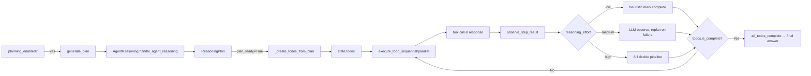

# CrewAI — Agent Loop 调研报告

> 调研对象:`crewAIInc/crewAI`(55,395 ⭐,2026-07-17 本机快照)
> 调研日期:2026-07-18
> 报告版本:v1.0
> 源码路径:`C:\workspace\github\onionagent\harness\01_market_research\clone\crewAI`
> 配套报告:本目录 `file_backend.md`、`tool_channel.md`,以及 `../standard/file_backend.md` / `../standard/tool_channel.md`

---

## 0. 智能体一句话定位

**`Role + Goal + Tools + Process` 编排的角色化多 Agent 框架** —— `Agent` / `Task` / `Crew` 三件套定义"谁、用什么工具、做什么任务",由 `Process.sequential`(顺序)或 `Process.hierarchical`(自动派生 manager agent 分层委派)驱动多 Agent 协作,新版本 (`crewai.experimental.AgentExecutor`) 把每个 agent 的内部循环升级为 **Plan-and-Act + ReAct 双形态** 的 Flow 图,顶层另提供独立的 **CrewAI Flow 编排引擎**(`@start / @listen / @router / and_ / or_ / @human_feedback / @persist`)用于跨 agent / crew 的事件驱动 DAG。

---

## 1. 调研依据

### 1.1 仓库结构(单仓多包 monorepo)

- `lib/crewai/` — 核心 SDK,`src/crewai/` 才是真正源码
- `lib/crewai-core/` — 跨包共享(路径常量、settings、token、printer、message 工具)
- `lib/crewai-cli/` — `crewai` CLI(`crewai create / run / chat / memory / reset_memories / checkpoint`)
- `lib/crewai-tools/`、`lib/crewai-files/` — 工具与文件生态(独立子仓)

### 1.2 关键文件 / 行号

| 模块 | 路径(行号) | 作用 |
|---|---|---|
| Process 枚举 | `lib/crewai/src/crewai/process.py:6-10` | `Process.sequential` / `Process.hierarchical` |
| `Agent` | `lib/crewai/src/crewai/agent/core.py:172-179`(类声明 + 字段) | 单个角色化 agent,含 `planning` / `reasoning` / `allow_delegation` / `multimodal` / `apps` / `mcps` / `max_iter` / `max_rpm` / `security_config.fingerprint` |
| `Agent.execute_task` | `lib/crewai/src/crewai/agent/core.py:760-812` | 同步执行一个 task(可能命中 max_execution_time 超时) |
| `Agent.aexecute_task` | `lib/crewai/src/crewai/agent/core.py:885-940` | 异步执行 |
| `Agent.create_agent_executor` | `lib/crewai/src/crewai/agent/core.py:1067-1080+` | 创建并填充 `AgentExecutor`(现在是 `crewai.experimental.AgentExecutor`)或旧的 `CrewAgentExecutor` |
| **老 executor**(`CrewAgentExecutor`) | `lib/crewai/src/crewai/agents/crew_agent_executor.py:104-132`(字段),`:208-249`(`invoke`),`:309-468`(`_invoke_loop_react` 完整 ReAct 文本循环),`:484-595`(`_invoke_loop_native_tools` 原生 function calling 循环) | 老的 ReAct 风格 executor,被 `DeprecationWarning` 标记 |
| **新 executor**(`crewai.experimental.AgentExecutor`) | `lib/crewai/src/crewai/experimental/agent_executor.py:126-160`(`AgentExecutorState` 模型),`:164-220`(`AgentExecutor` 字段 + PrivateAttr),`:337-397`(`@start() generate_plan` — Plan-and-Act 入口),`:633-770`(`observe_step_result` 决策 + 三档 reasoning_effort 路由),`:968-1042`(`continue_plan` / `goal_achieved` / `replan_now`),`:1093-1208`(`execute_todo_sequential`),`:1210-1344`(`execute_todos_parallel`),`:2108-2246`(`continue_iteration` / `check_max_iterations` 退出闸门) | 新的 Flow-based executor,同时支持 ReAct 与 Plan-and-Act |
| `BaseAgentExecutor` | `lib/crewai/src/crewai/agents/agent_builder/base_agent_executor.py:19-29`(字段),`:33-71`(`_save_to_memory`) | 抽象基类,定义 `iterations / max_iter / messages` |
| `Task` | `lib/crewai/src/crewai/task.py:141-285`(字段),`:199-205`(`output_file` 字段),`:227-229`(`human_input` 字段),`:246-275`(`guardrail` / `guardrails` / `guardrail_max_retries`),`:487-525`(`output_file_validation` 路径白名单),`:572-580`(`execute_sync`),`:596-610`(`execute_async` 用 `Future` + `threading.Thread` + `contextvars.copy_context`),`:791-940`(`_execute_core` 同步 task 执行核心,含 Pre/Post Step Hook) | 任务对象,执行入口 |
| `Crew` | `lib/crewai/src/crewai/crew.py:159-236`(类声明),`:475-482`(replay 时反推执行 agent),`:707-721`(`check_manager_llm` — hierarchical 必须给 manager_llm 或 manager_agent),`:752-770`(`validate_tasks` — sequential 必须每个 task 都有 agent),`:826-845`(`validate_async_task_cannot_include_sequential_async_tasks_in_context`),`:1487-1526`(`_run_sequential_process` / `_run_hierarchical_process` / `_create_manager_agent` — 关键:manager 必须 `allow_delegation=True`,默认拿 `AgentTools(agents=self.agents).tools()` —— 这就是"委派"工具的源头),`:1536-1605`(`_execute_tasks` — sequential 主循环,async 任务压栈、sync 任务原地执行),`:1622-1810`(`_prepare_tools` — 给 task 准备工具时按"allow_delegation / allow_code_execution / multimodal / apps / mcps / memory / files"逐项注入),`:1954-1975`(`_process_async_tasks` — 收 Future) | Crew 主循环 |
| `Crew.kickoff` | `lib/crewai/src/crewai/crew.py:978-1056` | 顶层同步入口;`crew.py:1035-1042` 按 `process` 字段派发到 `_run_sequential_process()` / `_run_hierarchical_process()` |
| `Crew.kickoff_async` | `lib/crewai/src/crewai/crew.py:1109-1161` | 顶层异步入口 |
| `Crew.kickoff_for_each` / `kickoff_for_each_async` | `crew.py:1073-1107` / `1163-1308` | 跨多组 inputs 并行跑同一 crew |
| DelegateWorkTool | `lib/crewai/src/crewai/tools/agent_tools/delegate_work_tool.py:14-25` | 委派任务给指定 coworker;继承 `BaseAgentTool` |
| AskQuestionTool | `lib/crewai/src/crewai/tools/agent_tools/ask_question_tool.py:14-22` | 询问指定 coworker;同样继承 `BaseAgentTool` |
| `BaseAgentTool._execute` | `lib/crewai/src/crewai/tools/agent_tools/base_agent_tools.py:60-120` | 匹配 coworker role → 临时构造 `Task` → `selected_agent.execute_task(task)` |
| `AgentTools` | `lib/crewai/src/crewai/tools/agent_tools/agent_tools.py:21-44` | 把所有 coworker 名字拼进 `description`,动态生成这两个工具 |
| `RecallMemoryTool` / `RememberTool` | `lib/crewai/src/crewai/tools/memory_tools.py:25-115`(`create_memory_tools` 在 read-only 时省略 `RememberTool`) | 长期记忆读写 |
| `PlanningConfig` | `lib/crewai/src/crewai/agent/planning_config.py:11-150` | `reasoning_effort` ∈ `low / medium / high`,`max_attempts` / `max_replans` / `max_steps` / `llm` 等 |
| `AgentReasoning` | `lib/crewai/src/crewai/utilities/reasoning_handler.py:30-103`(类型),`:107-254`(`handle_agent_reasoning` 公开入口 → `_execute_planning` → `_create_initial_plan` → `_refine_plan_if_needed` 循环) | Plan 生成 + refine,输出 `ReasoningPlan(plan, steps, ready)` |
| `PlannerObserver` | `lib/crewai/src/crewai/agents/planner_observer.py:39-300+` | 每步执行后观测 + 决定是否 replan / refine / goal-achieved |
| `TodoList` / `TodoItem` / `PlanStep` / `StepObservation` | `lib/crewai/src/crewai/utilities/planning_types.py:14-100`,`:198-260` | Plan 状态模型 |
| `Task.human_input` | `lib/crewai/src/crewai/task.py:227-229` | task 级别的人审开关 |
| `HumanInputProvider` | `lib/crewai/src/crewai/core/providers/human_input.py:60-145`(接口),`:154-300+`(`SyncHumanInputProvider` 实现) | 问询 → 等待 → 反馈 → 再 invoke 的循环 |
| `crewai.event_bus` & `crewai_event_bus.emit(...)` | `agents/crew_agent_executor.py:38-40`,`agent/core.py:783-790` 等几十处 | Crew 内部基于 event bus 的可观测性,所有 hook 点都发事件 |
| `@CrewBase` / `base_directory` | `lib/crewai/src/crewai/project/crew_base.py:135-144`(`_set_base_directory` 用 `inspect.getfile(cls).parent`),`:351-353`(`_load_config` 拼 `base_directory / config_path`),`:368-374`(`load_configurations`) | 自动把 `base_directory` 绑到 `@CrewBase` 类所在文件目录 |
| `@agent / @task / @crew / @tool / @before_kickoff / @after_kickoff / @callback / @output_json / @output_pydantic / @cache_handler` | `lib/crewai/src/crewai/project/annotations.py:42-160`,`:180-258` | 函数级装饰器 |
| Flow DSL | `lib/crewai/src/crewai/flow/dsl/_start.py:18-77`(`@start`),`_listen.py:18-50`(`@listen`),`_router.py:97-145+`(`@router`),`_conditions.py:22-30`(`or_ / and_`),`_human_feedback.py:23-100`(`@human_feedback`) | 顶层 Flow 装饰器 |
| Flow 运行时 | `lib/crewai/src/crewai/flow/runtime/__init__.py:428-525`(`Flow` 类 + `FlowMeta`),`:1933-1995`(`kickoff`),`:1998-2050+`(`kickoff_async`),`:2506-2593`(`_execute_start_method`),`:2832-3030`(`_execute_listeners` — router 串行、listener 并行) | Flow 执行引擎 |
| `@persist` | `lib/crewai/src/crewai/flow/persistence/decorators.py:147-200+` | 类级 / 方法级 SQLite 持久化 |
| `SQLiteFlowPersistence` | `lib/crewai/src/crewai/flow/persistence/sqlite.py:55+` | 默认 `flow_states.db` |
| `security_config.fingerprint` | `lib/crewai/src/crewai/security/security_config.py:20-90`,`security/fingerprint.py:1-100+`(`Fingerprint` UUID) | 每个 agent/task 一个 Fingerprint;在 `tool_usage.py:1023-1050+`(`_build_fingerprint_config`)注入到工具 `config` |
| `output_file` 路径校验 | `lib/crewai/src/crewai/task.py:487-525`(`output_file_validation`) | 禁 `..` / `~` / `$` / `|` `>` `<` `&` `;` |
| `crewai memory --storage-path` 反例 | `lib/cli/src/crewai_cli/cli.py:391-394` | help 文案说 "If omitted, uses ./.crewai/memory",但实际 `lancedb_storage.py:67-74` 走 `appdirs.user_data_dir(Path.cwd().name, "CrewAI")/memory/`(`crewai_core/paths.py:16-25`) |

### 1.3 三个核心抽象层级

```
┌──────────────────────────────────────────────────────────────┐
│ 顶层编排: CrewAI Flow(FlowMeta + Runtime)                │
│   @start / @listen / @router / and_ / or_ / @human_feedback│
│   状态: FlowState  (SQLite 持久化 + checkpoint restore) │
├──────────────────────────────────────────────────────────────┤
│ Crew 多 Agent 编排: Process.sequential | Process.hierarchical│
│   sequential:  按 self.tasks 顺序 execute_sync / 抽 future    │
│   hierarchical: 自动派 manager agent,所有 task 都改用 manager │
├──────────────────────────────────────────────────────────────┤
│ 单 Agent Loop: AgentExecutor (experimental) 或 CrewAgentExecutor│
│   形态 A: ReAct 文本循环  (_invoke_loop_react)               │
│   形态 B: Native function-calling 循环 (_invoke_loop_native_tools)│
│   形态 C: Plan-and-Act + TodoList (新 executor 默认)         │
└──────────────────────────────────────────────────────────────┘
```

---

## 2. 九大问题回答

### Q1. Agent Loop 主流程(必须画 Mermaid)

#### 1.1 单 Agent Loop —— 形态 A:`CrewAgentExecutor` 的 ReAct 文本循环(老路径,`crew_agent_executor.py`)

```text
invoke(inputs)                                                  (crew_agent_executor.py:208)
   ↓
_setup_messages(inputs)  ← 注入 system + user prompt,挂 mark_cache_breakpoint
   ↓
_inject_multimodal_files(inputs)                                (:258-281)
   ↓
self.ask_for_human_input = bool(inputs["ask_for_human_input"])  (:227)
   ↓
_invoke_loop()                                                   (:309-328)
   ↓
  if LLM.supports_function_calling() and original_tools:
     → _invoke_loop_native_tools()                              (:484-595)
  else:
     → _invoke_loop_react()                                     (:330-468)
   ↓
if ask_for_human_input:
   → _handle_human_feedback(formatted_answer)
   → SyncHumanInputProvider.handle_feedback / _handle_regular_feedback
     循环 until ask_for_human_input == False
   ↓
_save_to_memory(formatted_answer)                               (base_agent_executor.py:33-71)
```

`_invoke_loop_react` while 循环(crew_agent_executor.py:341-468):

```text
while not isinstance(formatted_answer, AgentFinish):
   if has_reached_max_iterations(iterations, max_iter):         (agent_utils.py)
      → handle_max_iterations_exceeded → 强制 Final Answer → break
   enforce_rpm_limit(rpm_controller)
   answer = get_llm_response(llm, messages, ...)               ← 真正的 LLM 调用
   formatted_answer = process_llm_response(answer, use_stop_words)
   if isinstance(formatted_answer, AgentAction):                ← 解析出 Action
      tool_result = execute_tool_and_check_finality(...)        (tool_utils.py)
      formatted_answer = _handle_agent_action(...)
   _invoke_step_callback(formatted_answer)
   _append_message(formatted_answer.text)
   iterations += 1
```

`_invoke_loop_native_tools` while 循环(crew_agent_executor.py:501-595):

```text
while True:
   if has_reached_max_iterations: → force Final Answer, return
   answer = get_llm_response(llm, messages, tools=openai_tools, ...)
   if answer 是 tool_calls 列表:
      tool_finish = _handle_native_tool_calls(answer, available_functions)
      if tool_finish is not None: return tool_finish
      continue
   if isinstance(answer, str):      → AgentFinish(text=answer), return
   if isinstance(answer, BaseModel): → AgentFinish(text=output_json), return
   → AgentFinish(text=str(answer)), return
   (exceptions:)
   if is_native_tool_calling_unsupported_error:
      _append_text_tool_calling_fallback_message()  ← 注入 ReAct 文本指令
      return _invoke_loop_react()                   ← 降级到 ReAct 文本
   if is_context_length_exceeded: handle_context_length → continue(摘要)
   iterations += 1
```

#### 1.2 单 Agent Loop —— 形态 C:`crewai.experimental.AgentExecutor` 的 Plan-and-Act + ReAct 双形态(新默认)

这是 CrewAI **当前主推的 executor**,继承 `Flow[AgentExecutorState]`(`experimental/agent_executor.py:164`),状态机用 Pydantic 装入 `messages / iterations / use_native_tools / plan / plan_ready / todos / replan_count / last_replan_reason / observations / pending_tool_calls`(`agent_executor.py:126-160`)。

```mermaid
flowchart TD
    Start([Crew.kickoff / Agent.kickoff]) --> MP[Setup messages<br/>mark cache breakpoint]
    MP --> GP{planning_enabled?}
    GP -- Yes --> PlanGen[@start generate_plan<br/>AgentReasoning.handle_agent_reasoning<br/>ReasoningPlan.plan + steps + ready]
    PlanGen --> InjectTodos[_create_todos_from_plan<br/>state.todos = TodoList items]
    PlanGen --> NoTodos{plan_ready and steps?}
    InjectTodos --> NoTodos
    NoTodos -- No --> Init
    NoTodos -- Yes --> Init
    GP -- No --> Init
    Init[@router initialize_reasoning<br/>emit initialized] --> ChkMax[@router check_max_iterations<br/>has_reached_max_iterations]
    ChkMax -- max reached --> Force[force_final_answer<br/>ensure_force_final_answer]
    Force --> Fin
    ChkMax -- use_native_tools --> NativeLLM[@router call_llm_native_tools<br/>get_llm_response with openai_tools]
    ChkMax -- default --> ReActLLM[@router call_llm_and_parse<br/>get_llm_response + process_llm_response]
    NativeLLM --> RouteType{route_by_answer_type}
    ReActLLM --> RouteType
    RouteType -- "tool_call list" --> ExecNative[@router execute_native_tool<br/>tool.ainvoke / tool.invoke]
    RouteType -- "string / BaseModel" --> MarkComplete[mark_todo_complete]
    RouteType -- "AgentAction" --> ExecAct[@router execute_tool_action<br/>execute_tool_and_check_finality]
    RouteType -- parser_error --> RecvParse[recover_from_parser_error → initialized]
    RouteType -- context_error --> RecvCtx[recover_from_context_length → initialized]
    ExecNative --> ChkTodo{check_native_todo_completion}
    ChkTodo -- "todo_satisfied" --> MarkComplete
    ChkTodo -- "todo_not_satisfied" --> IncContinue
    ExecAct --> ChkTodo2{check_todo_completion}
    ChkTodo2 -- "todo_satisfied" --> MarkComplete
    ChkTodo2 -- "todo_not_satisfied" --> IncContinue
    MarkComplete[@listen mark_todo_complete] --> MoreT{check_more_todos}
    MoreT -- "has_todos" --> GetReady[@router get_ready_todos_method]
    MoreT -- "no_todos / goal_achieved" --> AllDone[all_todos_complete]
    GetReady -- "single_todo_ready" --> ExecSeq[@router execute_todo_sequential]
    GetReady -- "multiple_todos_ready" --> ExecPar[@router execute_todos_parallel<br/>asyncio.gather over _run_step]
    ExecSeq --> SingleDone[parallel_todos_complete] --> AfterPar[after_parallel_execution] --> GetReady
    ExecPar --> AfterPar
    AllDone --> Finish[all_todos_complete listener<br/>→ handle_final_answer → agent_finished]
    IncContinue[@router increment_and_continue] --> Init
    Finish([AgentFinish output]) --> Fin
    Fin([end])
```

**关键设计点(Plan-and-Act 路径)**:

- **state 集中化**:`AgentExecutorState`(`agent_executor.py:126-160`)用 Pydantic BaseModel 把 ReAct 状态与 Plan-and-Act 状态装进同一个被校验的容器。
- **Plan generation 入口**:`@start() generate_plan`(`agent_executor.py:337-378`)只在 `self.agent.planning_enabled` 为真时触发,内部用 `AgentReasoning.handle_agent_reasoning`(`reasoning_handler.py:187-210`)生成 `ReasoningPlan(plan: str, steps: list[PlanStep], ready: bool)`,再 `_create_todos_from_plan`(`agent_executor.py:380-397`)转成 `TodoList`。
- **三档 reasoning_effort**(`agent_executor.py:633-770`):`low` 走 heuristic,`medium` 走 LLM 观测 + 失败重规划,`high` 走完整 decide pipeline(goal-achieved / replan / refine / continue)。
- **Plan 重规划**:`@router handle_replan_now`(`agent_executor.py:1001-1042`)和 `@router handle_replan`(`agent_executor.py:2655-2678`)会重置 `state.todos` 并回到 `has_todos` 分支。
- **退出机制**:`_invoke_loop_native_no_tools` (`crew_agent_executor.py:597-633`)是无 tool 时的单次 LLM 调用;新 executor 中 `force_final_answer`(`agent_executor.py:1379-1401`)在 `iterations >= max_iter` 时强制出 Final Answer;`agent_finished` 是 Flow 终点。
- **并发执行多个 ready todos**:`execute_todos_parallel`(`agent_executor.py:1210-1344`)用 `asyncio.gather` 跑 `_run_step`(`agent_executor.py:1229-1240`)。但这里有锁 `_execution_lock` / `_finalize_lock`(`agent_executor.py:209-213`)防止并发 finalize 同一个 executor 实例。
- **Cache breakpoint**:`mark_cache_breakpoint` 标记 system / user 消息边界,提供 LLM provider 层的 prompt cache 复用。

#### 1.3 Crew 主循环 —— 顺序与分层差异

**`Crew.kickoff`**(`crew.py:978-1056`)是顶层入口,`_run_sequential_process()` / `_run_hierarchical_process()`(`crew.py:1487-1494`)按 `self.process` 派发,两者都调 `_execute_tasks(self.tasks)`。

`_execute_tasks(tasks)`(`crew.py:1536-1605`):

```text
for task_index, task in enumerate(tasks):
   exec_data, task_outputs, last_sync_output = prepare_task_execution(...)  # replay skip / agent resolve / tools prep
   if exec_data.should_skip: continue
   if isinstance(task, ConditionalTask): ...                  # task.cond(context) 决定跳过
   if task.async_execution:
      future = task.execute_async(agent, context, tools)     # threading.Thread + Future
      futures.append((task, future, task_index))
   else:
      if futures: task_outputs.extend(_process_async_tasks(futures)) ; futures.clear()
      context = _get_context(task, task_outputs)             # 把所有前置 task 输出拼成 context
      task_output = task.execute_sync(agent, context, tools)
      task_outputs.append(task_output)
      _process_task_result(task, task_output)                 # 日志
      _store_execution_log(task, task_output, ...)
if futures: task_outputs.extend(_process_async_tasks(futures))
return _create_crew_output(task_outputs)
```

**关键差异**(`crew.py:1487-1533`):

| 维度 | sequential | hierarchical |
|---|---|---|
| 每个 task 实际使用的 agent | `task.agent`(`crew.py:1692-1695 _get_agent_to_use`) | `self.manager_agent`(自动创建,如果用户没传) |
| `_create_manager_agent` 是否自动执行 | 否 | 是 —— 自动建一个 `role="Manager"` 的 Agent,`allow_delegation=True`,`tools=AgentTools(agents=self.agents).tools()`(`crew.py:1496-1526`) |
| manager 的 tools 来源 | n/a | **5 个 AgentTool**:`DelegateWorkTool` + `AskQuestionTool` + 知识/记忆/平台/MCP 工具(`crew.py:1622-1810 _prepare_tools`) |
| task 是否必须有 agent | 是(`crew.py:752-770 validate_tasks` 严格校验) | 否,manager 统一委派 |
| `kickoff_for_each` 并行 | 是 | 是(只复用同一 crew) |

#### 1.4 Flow 模式(顶层事件驱动 DAG)

`@start / @listen / @router / and_ / or_ / @human_feedback / @persist`(`flow/dsl/_start.py:18-77`、`_listen.py:18-50`、`_router.py:97-150`、`_conditions.py:22-30`、`_human_feedback.py:23-100`、`persistence/decorators.py:147-200+`)。

```mermaid
flowchart TD
    K[Flow.kickoff / kickoff_async<br/>runtime/__init__.py:1933+] --> InitRest[restore_from_checkpoint or _restore_state]
    InitRest --> EmitStarted[FlowStartedEvent]
    EmitStarted --> LoopStart
    subgraph LoopStart[_execute_start_method for each start]
        S1[method execution: run user-defined @start body]
        S1 --> SFin[MethodExecutionFinishedEvent]
    end
    SFin --> L[_execute_listeners<br/>runtime/__init__.py:2832-3030]
    L --> R{router_only?}
    R -- Yes --> Router[for router in _find_triggered_methods:<br/>await _execute_single_listener<br/>router_result = its return value]
    Router --> RouterMore{another router triggered?}
    RouterMore -- Yes --> Router
    RouterMore -- No --> Normal
    R -- No --> Normal
    Normal[for listener in _find_triggered_methods:<br/>asyncio.gather _execute_single_listener]
    Normal --> LastCheck{current_trigger in router_results<br/>and _start_condition_triggered_by?}
    LastCheck -- Yes --> ReStart[clear _is_execution_resuming<br/>await _execute_start_method]
    ReStart --> S1
    LastCheck -- No --> LoopStart
    LoopStart -. all start methods done .-> EmitFinished[FlowFinishedEvent]
    EmitFinished --> End([return method_outputs[-1]])
```

**关键点**:

- **router 串行 + listener 并行**:`_execute_listeners`(`runtime/__init__.py:2832-3030`)的注释明确说"routers are executed sequentially to maintain flow control, normal listeners are executed in parallel"。
- **@router 返回字符串作为下一轮 trigger**:`_find_triggered_methods`(`runtime/__init__.py:2953+`)扫描所有 listener 的 `condition`,匹配当前 trigger name 才 fire;`@router("method_name")` 上一个 router 返回的字符串会成为下一个 router/listener 的 trigger。
- **or_ 一次性 trigger**:`@router(or_("a", "b"))` 触发后会被加入 `_fired_or_listeners`(`runtime/__init__.py:714`),默认不会重 arm,直到 `_rearm_or_listeners_for_trigger` 显式重置。
- **@human_feedback 路由**:`@human_feedback(message=..., emit=["APPROVED", "REJECTED"], default_outcome=...)`(`dsl/_human_feedback.py:23-100`)在方法返回时插入 `HumanFeedbackRequestedEvent`,终端阻塞读 input,把 outcome 字符串塞回 listener 调度链。
- **持久化**:`@persist(SQLiteFlowPersistence(db_path=...))` 在每个方法完成时调 `persist_state`(`persistence/decorators.py:71-130`),`@persist` 也支持类级 + 方法级叠加。
- **Checkpoint**:`from_checkpoint` / `restore_from_state_id` 两种互斥的恢复机制(`flow/runtime/__init__.py:1938-1951`)—— 前者用事件 checkpoint,后者用 `state.id` 找历史 `state` 快照。

#### 1.5 整体调用链(端到端)

```text
crew.kickoff(inputs)
  └─ _run_sequential_process() | _run_hierarchical_process()
       └─ _execute_tasks(tasks)
            └─ for each task:
                 ├─ prepare_task_execution()         # resolve agent / tools (含 delegation/code-exec/memory/mcp)
                 ├─ task.execute_sync(agent, context, tools)
                 │    └─ _execute_core()
                 │         └─ agent.execute_task(task, context, tools)
                 │              └─ _execute_without_timeout()
                 │                   └─ self.agent_executor.invoke({...})
                 │                        └─ _invoke_loop()  → _invoke_loop_react() / _invoke_loop_native_tools()
                 │                             └─ loop: LLM call → parse → execute tool → append message → 直到 AgentFinish
                 │                        └─ _handle_human_feedback()  (若 ask_for_human_input)
                 │                        └─ _save_to_memory()
                 └─ (output_file → _save_file)
                 └─ (callback / crew.task_callback)
```

---

### Q2. Plan 计划机制(Task list 怎么管理)

**结论:CrewAI 的"计划机制"是 Plan-and-Act 模式,由 `AgentReasoning` 一次性生成 `ReasoningPlan`,转成 `TodoList` 持续追踪,每步用 `PlannerObserver` 观测后决定 replan / refine / goal-achieved。** 同时存在"老 Crew 级"和"新 Agent 级"两套 plan,分别服务于 hierarchical manager 委派 和 Plan-and-Act 单 agent 内部。

#### 2.1 存储位置(四个层级,职责分明)

| 层级 | 数据结构 | 位置 | 生命周期 |
|---|---|---|---|
| 1. Crew 级 Plan | `list[Task]` + `Task.context` | `Crew.tasks` 字段(`crew.py:236`),`Task.context`(`task.py:161`)指定依赖上游 task 列表 | 整个 kickoff;async_execution 任务并行 |
| 2. 整个 kickoff 的执行计划(老路径) | `CrewPlanner._handle_crew_planning` 输出的 `PlannerTaskPydanticOutput.list_of_plans_per_task` | `utilities/planning_handler.py:60-100` | 在 `Crew.kickoff` 早期一次性生成 |
| 3. Agent 级 Plan-and-Act | `ReasoningPlan(plan: str, steps: list[PlanStep], ready: bool)` | `utilities/reasoning_handler.py:30-37` | 单 task 内部,planning phase |
| 4. **TodoList(执行态)** | `TodoList(items: list[TodoItem])` 存在 `AgentExecutorState.todos` | `utilities/planning_types.py:27-95` + `experimental/agent_executor.py:144-147, 380-397` | 单 task 内部,每步 mutate |
| 5. 观测结果 | `state.observations: dict[int, StepObservation]` | `utilities/planning_types.py:198-260` | 单 task 内部,每步追加 |
| 6. Replan 计数 | `state.replan_count: int` / `state.last_replan_reason: str` | `experimental/agent_executor.py:148-152` | 单 task 内部,replan 自增 |

#### 2.2 Plan 生成流程

**入口**:`@start() generate_plan`(`experimental/agent_executor.py:337-378`),只触发一次,内部直接调 `AgentReasoning.handle_agent_reasoning()`(`reasoning_handler.py:187-210`)。

`AgentReasoning._execute_planning`(`reasoning_handler.py:244-254`):

```text
plan, steps, ready = _create_initial_plan()        # 首次 LLM 调用
if not ready:                                      # 还没确认就绪
   plan, steps, ready = _refine_plan_if_needed(...) # 循环 refine,max_attempts 次
return ReasoningPlan(plan, steps, ready)
```

**Plan 输出 schema**(`reasoning_handler.py:30-37` + `:50-103`):

```text
ReasoningPlan {
    plan:  str                ← 高层 plan 概要
    steps: list[PlanStep]     ← 结构化 step,带 step_number / description / tool_to_use / depends_on
    ready: bool               ← 计划是否已就绪可执行
}
```

`PlanStep` 字段(`planning_types.py:14-23`):

```text
PlanStep {
    step_number: int
    description: str
    tool_to_use: str | None     ← 这一步预期用哪个 tool(由 LLM 在 plan 时决定)
    depends_on: list[int]        ← DAG 依赖;todo 调度时已支持
}
```

**Plan → Todo**(`agent_executor.py:380-397`):

```python
def _create_todos_from_plan(self, steps: list[PlanStep]) -> None:
    todos = []
    for step in steps:
        todos.append(TodoItem(
            step_number=step.step_number,
            description=step.description,
            tool_to_use=step.tool_to_use,
            depends_on=step.depends_on,
            status="pending",
        ))
    self.state.todos = TodoList(items=todos)
```

`TodoItem.status` ∈ `pending / running / completed / failed`(`planning_types.py:13`),并提供 `current_todo / next_pending / is_complete / pending_count / completed_count` 等查询属性。

#### 2.3 Plan 的更新与重新加载

**没有 `update_plan` 内置工具**(和 LangChain 的 `update_plan` / `update_todo` 工具不同)。Plan/Todo 的更新 **完全由 executor 自己的 `@router` 节点根据 PlannerObserver 决策** 完成(`agent_executor.py:633-1042`):

- **@router observe_step_result**(633-700):根据 `reasoning_effort` 决定下一步;
- **@router handle_step_observed_low** / `_medium` / `_high**(700-920):把 observation 转成 `mark_todo_completed` / `mark_todo_failed` / 路由到 `replan_now` / `refine_and_continue` / `goal_achieved`;
- **@router handle_replan_now**(1001-1042):增量 replan;
- **@router handle_replan**(2655-2678):完整 replan,清空 `state.todos` 重建;
- **@router handle_refine_and_continue**(922-966):in-place 改 `todo.description` 而不重建列表;
- **@router handle_goal_achieved**(975-999):早期终止,跳到 `all_todos_complete`。
- **@router check_more_todos**(2219-2236):若 router 触发了 start 条件,可以再次 `_execute_start_method`(循环式 re-execution)。

**`PlannerObserver.observe`**(`agents/planner_observer.py:111-180`)是真正的"规划观测器",它接收 LLM 的 `StepObservation`(`planning_types.py:212-260`),字段:

```text
StepObservation {
    step_completed_successfully: bool
    key_information_learned: str
    remaining_plan_still_valid: bool
    needs_full_replan: bool
    replan_reason: str | None
    goal_already_achieved: bool
    suggested_refinements: list[StepRefinement]   ← 局部细化建议
}
```

#### 2.4 Crew 级的"Plan"(`utilities/planning_handler.py:60-130`)

> 这是 2024 年的老接口,被新的 `AgentReasoning` / `PlannerObserver` 取代。**注意:`CrewPlanner` 走的还是基于 `Agent + Task(output_pydantic=PlannerTaskPydanticOutput)` 的"agent 一次 LLM 调用"模式,而新 `AgentReasoning` 是基于 function calling 的多步 refine 模式。**

`PlannerTaskPydanticOutput.list_of_plans_per_task`(`planning_handler.py:28-34`)是 per-task 的 plan 文本,用于"在 crew 启动前一次性生成所有 task 的执行计划",**没有 update 接口**。

#### 2.5 状态/事件的完整流转



---

### Q3. Sub Agent(Agent 是 sub agent 吗?`allow_delegation` / `agent.delegate` 怎么工作)

**结论:CrewAI 的 `Agent` **本身就是 sub-agent 抽象** —— hierarchical 模式下 manager agent 通过 `DelegateWorkTool` 把"子任务"委派给 crew 内其它 agent,sequential 模式下每个 task 自带 agent。所有 agent 都 `execute_task(task)` 即可,本质上所有 Agent 互相是对方的"潜在 sub-agent"(`agent_tools/agent_tools.py:21-44`、`agent_tools/base_agent_tools.py:60-120`)。**

#### 3.1 `allow_delegation` 的开启方式

```python
agent = Agent(
    role="Researcher",
    allow_delegation=True,   # ← 关键开关
    tools=[...],
)
```

**`allow_delegation` 不直接挂载工具**,而是在 `_prepare_tools(agent, task, tools)`(`crew.py:1622-1810`)里被读出来:

- `if process == Process.hierarchical`:
  - `self.manager_agent` 必须存在
  - `_update_manager_tools(task, tools)`(`crew.py:1831+`)给 manager **动态绑定当前 task 相关的 worker tools**(`AgentTools(agents=self.agents).tools()`)
- `elif agent`: `tools = self._add_delegation_tools(task, tools)`(`crew.py:1798+`)→ 给非 manager agent 注入 `DelegateWorkTool` + `AskQuestionTool` + `i18n` 描述(把 coworker 列表拼进 tool description)

Crew 初始化时(`crew.py:919-921`),所有 agent 的 `allow_delegation` 会被 **强制设为 False**(防 sequential 模式下"委派"被乱开),然后 hierarchical 模式下 `_create_manager_agent`(`crew.py:1498`)再把 manager 的 `allow_delegation` 置为 True。

#### 3.2 `agent.delegate` 的实际机制 —— `DelegateWorkTool` + `BaseAgentTool._execute`

`tools/agent_tools/agent_tools.py:21-44` 是动态工厂:

```python
class AgentTools:
    def __init__(self, agents: Sequence[BaseAgent]) -> None: self.agents = agents
    def tools(self) -> list[BaseTool]:
        coworkers = ", ".join([f"{agent.role}" for agent in self.agents])
        return [
            DelegateWorkTool(agents=self.agents, description=...format(coworkers)...),
            AskQuestionTool(agents=self.agents,   description=...format(coworkers)...),
        ]
```

`DelegateWorkTool._run(task, context, coworker)`(`delegate_work_tool.py:14-25`)→ `BaseAgentTool._execute(coworker, task, context)`(`base_agent_tools.py:60-120`):

```text
1. 清洗 coworker 名(sanitize_agent_name:casefold + 去引号)
2. 在 self.agents 中按 role 模糊匹配 → selected_agent
3. 临时构造 Task(description=task, agent=selected_agent, expected_output="manager_request")
4. selected_agent.execute_task(task_with_assigned_agent, context)
   └─ 这就是真正的递归 sub-agent call: 调 selected_agent 的 ReAct 循环,生成 AgentFinish
5. 把 result string 返回给 manager agent(变成它下次 LLM 调用的 tool result)
```

`AskQuestionTool` 流程完全相同,只是语义是"问一句"而不是"派活"。

#### 3.3 `agent.delegate` 不存在 vs 真实调用方式

- 没有 `agent.delegate(...)` 这种 Python API 入口(只有 `_run` 工具入口)。
- LLM 通过 `tool_calls` 返回 `{"name": "Delegate work to coworker", "arguments": {"task": "...", "coworker": "Researcher", "context": "..."}}`,由 `ToolUsage`(`tools/tool_usage.py:300-600+`)调度到 `DelegateWorkTool._run`。
- 委派是 **同进程同步阻塞**(用 `Future[TaskOutput]` + `threading.Thread` 隔离 `contextvars`),返回 string 后塞回 manager 的 messages。
- **委派产生的 task 输出会自动写回 context**:`base_agent_tools.py:100-105` 中,每次委派都新建一个 `Task`,`Task.processed_by_agents.add(agent.role)`(`task.py:243-245`)记录谁跑过,避免同一 agent 无限递归。
- **memory 防止重复写**:`base_agent_executor.py:35-37` 的 `_save_to_memory` 检测到 `output.text` 含 `Action: Delegate work to coworker` 时直接 return,**避免把 manager 的委派结果污染到 memory**。

#### 3.4 与 LangGraph / Cline / MiniMax Code 的对比(放在这里,作为横向)

| 维度 | CrewAI | LangGraph sub-graph | MiniMax Code `Task` tool |
|---|---|---|---|
| sub agent 的创建 | 复用 crew 内既有 agent(角色匹配) | 显式 `create_react_agent` 子图 | 内置 `general-purpose / statusline-setup` 等 sub-agent 类型 |
| sub agent 的工具 | 继承该 agent 的 tools | 子图独立 | 由 sub-agent type 决定(白名单) |
| 上下文传递 | `context` 字符串(用户填) | `state` 全量(可被 reducer 控制) | `prompt` 字段(用户填) |
| 递归控制 | `Task.processed_by_agents` 集合 | 显式 `recursion_limit` | 不支持(只能靠 type 隐式) |
| 并行 | `async_execution=True` 在 crew 级可用 | `Send()` / `Branch` 原语 | `run_in_background: true` |

---

### Q4. Loop 退出机制(Crew / Task 怎么结束?async_execution 怎么工作)

**结论:CrewAI 的退出机制是 **多层防护**:1) ReAct 文本循环 `while not isinstance(formatted_answer, AgentFinish)`;2) `iterations >= max_iter` 强制 Final Answer;3) Plan-and-Act 路径的 `all_todos_complete` + `force_final_answer`;4) `lite_agent` / `task.execute_async` 的 `Future[TaskOutput]`;5) Flow 引擎的 `state.is_finished` / Flow 自终止。**

#### 4.1 单 Agent ReAct 循环的退出

`_invoke_loop_react`(`crew_agent_executor.py:341-468`)的退出条件:

| 退出条件 | 触发位置 | 行为 |
|---|---|---|
| 解析出 `AgentFinish`(LLM 输出"Final Answer"或文本不含 `Action:`) | `process_llm_response` | while 条件不满足,自然 break |
| `iterations >= max_iter` | `has_reached_max_iterations(agent_utils.py)` + `handle_max_iterations_exceeded` | 强制 prompt 让 LLM 出 Final Answer;若仍不成功,抛 `RuntimeError` |
| 上下文超长 | `is_context_length_exceeded` | `handle_context_length(respect_context_window=True)` → 摘要压缩 → continue |
| native tool calling 不被支持 | `is_native_tool_calling_unsupported_error` | 切回 ReAct 文本(`_invoke_loop_react`) |
| 工具自己设了 `result_as_answer=True` | `tools/tool_usage.py:???` | tool result 直接变 Final Answer |

`_invoke_loop_native_tools`(`crew_agent_executor.py:501-595`)是 while True,但因为每个分支都有 `return`,没有显式 break。

`max_iter` 默认值:
- 老 `CrewAgentExecutor`:`BaseAgentExecutor.max_iter=25`(`base_agent_executor.py:27`)
- `LiteAgent.max_iterations=15`(`lite_agent.py:222-224`)
- 新 `AgentExecutor.max_iter=25` + `max_method_calls = max_iter * 10`(`agent_executor.py:251-253`)

#### 4.2 单 Agent Plan-and-Act 的退出

`@router check_max_iterations`(`agent_executor.py:2114-2126`):

```python
if has_reached_max_iterations(self.state.iterations, self.max_iter):
    return "force_final_answer"
```

`@router ensure_force_final_answer`(`agent_executor.py:1379-1401`)会调 `handle_max_iterations_exceeded` 强出 Final Answer。

Plan-and-Act 自然终止:`@listen(or_("all_todos_complete", ...))`(`agent_executor.py:2248-2350`)→ `handle_final_answer` → `agent_finished`。

#### 4.3 Task 级退出

`Task._execute_core`(`task.py:791-940`)是单次执行,**不是循环**:执行一次 `agent.execute_task()` → 跑 guardrail → 写 output_file → 发 `TaskCompletedEvent` → return。

**但 `async_execution=True` 把 task 变成 Future 派发**(`task.py:596-610`):

```python
def execute_async(self, agent=None, context=None, tools=None) -> Future[TaskOutput]:
    future: Future[TaskOutput] = Future()
    ctx = contextvars.copy_context()
    threading.Thread(
        daemon=True,
        target=ctx.run,
        args=(self._execute_task_async, agent, context, tools, future),
    ).start()
    return future
```

`_execute_task_async`(`task.py:628-651`)是真正的执行体,**用 `contextvars.copy_context()` 保证 contextvars 在新线程里也生效**(CrewAI 的 event bus / OpenTelemetry baggage 大量用 ContextVar)。

#### 4.4 Crew 级退出

`_execute_tasks`(`crew.py:1536-1605`)是一个 for 循环,每个 task 跑完就 append 到 `task_outputs`,**遇到 `async_execution` 的 task 就塞 `futures` 列表并继续**;下一轮 sync task 触发时 **先把 `futures` 里所有 future result 取完**(`_process_async_tasks` `crew.py:1954-1975`)。整个 for 循环跑完就 `_create_crew_output(task_outputs)` 返回。

**退出异常路径**:
- `kickoff` 的 try/except(`crew.py:1042-1056`)会发 `CrewKickoffFailedEvent`;
- 任何 task 失败 → `TaskFailedEvent`(`task.py:932-935`)→ 异常向上冒 → kickoff 失败。
- `Guardrail` 失败 → 自动重试 `guardrail_max_retries` 次(`task.py:273-275, 880-905`)→ 还失败则抛。

#### 4.5 Flow 模式退出

`Flow.kickoff` 在 `_run_flow()` 跑完所有 start method + 它们触发的 listener 后 → `_drain_memory_writes` → 发 `FlowFinishedEvent` → `return method_outputs[-1]`(`flow/runtime/__init__.py:1467-1500+`)。

**racing listener**(`flow/runtime/__init__.py:1116-1200+`):多个 `@listen` 监听同一 trigger 时,`_execute_racing_listeners` 跑第一个成功的就 cancel 其余 —— 这也是另一种"提前退出"。

#### 4.6 max_execution_time(硬超时)

`Agent.execute_task` → `_execute_with_timeout`(`agent/core.py:843-880`)用 `ThreadPoolExecutor + future.result(timeout=...)` 实现 **wall-clock 超时**,超时抛 `TimeoutError`。

---

### Q5. Ask 模式(Agent 如何问用户?)

**结论:CrewAI **没有专门的 `AskQuestionTool` 给"问人类"用** —— `AskQuestionTool`(`tools/agent_tools/ask_question_tool.py:14-22`)是 "问 **coworker agent**" 的工具。问用户由 `core/providers/human_input.py` 的 `HumanInputProvider` 协议负责,通过 `task.human_input=True` 开关启用,且与 `@human_feedback`(`flow/dsl/_human_feedback.py:23-100`)一起覆盖两种 ask 场景。**

#### 5.1 Crew / Task 级别的 Ask(单 Agent 完成 Final Answer 后)

`Task.human_input: bool` 字段(`task.py:227-229`):

```python
human_input: bool | None = Field(
    description="Whether the task should have a human review the final answer of the agent",
    default=False,
)
```

`Agent._execute_without_timeout` 把 `task.human_input` 透传给 executor 的 `inputs["ask_for_human_input"]`(`agent/core.py:884` + `:1006`)→ executor.invoke 读到后置 `self.ask_for_human_input = True`(`crew_agent_executor.py:227`)→ LLM 出 Final Answer 后走 `_handle_human_feedback(formatted_answer)`(`crew_agent_executor.py:243-244` + `:1121-1122`)。

`SyncHumanInputProvider.handle_feedback`(`core/providers/human_input.py:154-300+`):

```text
feedback = _prompt_input(crew)                 # 终端 input() + rich panel
if crew._train:
   → _handle_training_feedback → 写 training data + 跑一次 _invoke_loop
else:
   while context.ask_for_human_input:
      if feedback.strip() == "": break         # 空回车 = 接受
      context.messages.append(_format_feedback_message(feedback))
      answer = context._invoke_loop()          # 再跑一次 LLM
      feedback = _prompt_input(crew)           # 继续问
return answer
```

**关键点**:
- **空回车 = 接受**:`_handle_regular_feedback` 收到空字符串就把 `ask_for_human_input` 置 False 并 break。
- **支持多轮反馈**:LLM 出 Final Answer → 用户反馈 → 把反馈作为 user message 塞回 messages → 再 invoke,直到用户满意(空回车)。
- **可以替换 provider**:`HumanInputProvider` 是 `runtime_checkable Protocol`,有 `setup_messages / post_setup_messages / handle_feedback / handle_feedback_async`(`core/providers/human_input.py:60-145`)四个方法,可以注入自定义(例如不接终端,接 Slack / Web UI)。
- **Async 版本**:`handle_feedback_async` + `_prompt_input_async`(`core/providers/human_input.py:200-220` + `:300-385+`)用 `asyncio.get_event_loop().run_in_executor` 把阻塞 `input()` 移到 thread pool,避免阻塞 event loop。

#### 5.2 Flow 级别的 Ask:`@human_feedback` 装饰器

```python
class MyFlow(Flow[State]):
    @start()
    def draft(self): ...

    @listen(draft)
    @human_feedback(
        message="Approve this draft?",
        emit=["APPROVED", "REJECTED"],
        default_outcome="REJECTED",
    )
    def review(self) -> str:
        return state.decision  # 没用,装饰器会替换返回值
```

`@human_feedback`(`flow/dsl/_human_feedback.py:23-100`):
- **挂载位置**:`@human_feedback` 必须在 `@listen / @start / @router` 之后(顺序敏感)。
- **触发**:`_handle_human_feedback`(`flow/runtime/__init__.py:3320-3500+`)在方法完成后发 `HumanFeedbackRequestedEvent` → 终端读 input → 发 `HumanFeedbackReceivedEvent` → 把 outcome 字符串塞回 listener 调度链。
- **`emit` 列表**:`@human_feedback(emit=["APPROVED", "REJECTED"])` 让本方法变成 router,只接受指定 outcome;`flow_definition.py:691-697` 的 `_canonicalize_human_feedback_routing` 会自动把 `router=True` 启用,这就是"ask 用户拿选项"的实现。
- **AI-assisted 决策**:可选 `llm="gpt-5.4-mini"`(`flow/dsl/_human_feedback.py:26`),让 LLM 帮用户做判断(基于 `metadata` 和 `message`),只把"不确定"的推到真人。

#### 5.3 CrewAI 缺什么

- ❌ **没有"问用户拿 select / choice / multi-choice"的 LLM-driven 工具**(对比 MiniMax Code `AskUserQuestion`、Cline `ask_followup_question`)。
- ✅ CrewAI 的 ask 模式是 **terminal / 文本回环**(`input()` + `_prompt_input` 的 rich Panel),**不是 in-prompt 选项选择**。
- ✅ 但 `@human_feedback(emit=[...])` 已经具备 "LLM 出选项 → 路由到不同下一步" 的能力,只是入口是 method 装饰器,而不是 LLM 调用的 tool。

---

### Q6. Human-in-the-Loop (HITL)

**结论:HITL 贯穿 4 个层级 —— ① `Task.human_input` 在 task 结束后弹审 ② `crewai chat` CLI 持续对话 ③ Flow `@human_feedback` 在 method 完成后阻塞 ④ 训练模式(`crew._train=True`)把用户反馈写成 pickle 训练数据。**

| 层级 | 入口 | 触发时机 | 退出 |
|---|---|---|---|
| Task 结束审 | `Task.human_input=True`(`task.py:227`) | `_execute_core` 跑完后,见 `agent/core.py:884` | 终端空回车 / 一直反馈到满意 |
| Crew AI 持续对话 | `crewai chat` CLI / `Agent.chat(...)` | 进入 REPL 模式,每轮发 user 消息 | `/exit` 或 EOF |
| Flow 中间审 | `@human_feedback(...)`(`flow/dsl/_human_feedback.py:23`) | 任何 `@listen` / `@start` / `@router` 方法完成后 | 终端输入 outcome 字符串;空回车 → `default_outcome` |
| 训练模式 | `crew._train=True` + `crewai train` / `Crew(..., train=True)` | `agent/core.py:216-228` 的 `apply_training_data` | 把 feedback 写进 `trained_agents_data.pkl`,下次 kickoff 自动加载 |
| 异步 HITL | `AsyncExecutorContext`(`core/providers/human_input.py:140-152`) | `ainvoke` 路径上 | 用 `asyncio.get_event_loop().run_in_executor(input)` 异步读 |

#### 6.1 `crewai chat` 持续对话模式

`utilities/crew_chat.py`(整文件 18KB)实现 `CrewChat` 类:用 `prompt_toolkit` 做终端补全,支持 `/exit / /help / /memory` 等 slash command,把 user input 当成 task description 注入 crew。

#### 6.2 训练模式(Training mode)

`crew._train=True` 切换 prompt 为训练模式(`core/providers/human_input.py:325-340`):

```text
TRAINING MODE: Provide feedback to improve the agent's performance.
This will be used to train better versions of the agent.
Please provide detailed feedback about the result quality and reasoning process.
```

反馈后 `_handle_training_feedback`(`core/providers/human_input.py:225-245`)调 `_handle_crew_training_output` 把对话写成 `trained_agents_data.pkl`,再 `context._invoke_loop()` 跑一次让 agent 改进。

#### 6.3 Flow 的持久化 + 恢复(checkpoint + restore_from_state_id)

`@persist` + `Flow.kickoff(from_checkpoint=...)` / `Flow.kickoff(restore_from_state_id=...)`(`flow/runtime/__init__.py:1938-1990`)实现 **"长流程被人类暂停 / 重启后从断点续跑"** —— 这是 HITL 的进阶形式。

#### 6.4 缺什么

- ❌ **没有 IDE 集成 / Web UI HITL**(只能走终端)。要 GUI 必须自己包 `HumanInputProvider`。
- ❌ **没有 time-budget 等待**(用户 60 分钟不回,任务自动 fail)。可扩展,但要自定义 provider。

---

### Q7. 工具调用权限(三种模式:永远同意 / LLM 决定 / 永远禁止)

**结论:CrewAI **没有显式的"三档权限开关"**(对比 Cline `always_ask / always_allow / never`),但通过 **4 层机制**实现等价能力:1) `allow_delegation` / `allow_code_execution` / `multimodal` 等 agent 字段充当"是否挂载"开关(永远禁止 = 字段 False);2) `function_calling_llm` 分离(用更小 / 安全的 LLM 决定 tool 调 = LLM 决定);3) `ToolUsage` 里的 `before_llm_call_hooks` / `after_llm_call_hooks` / `tool_hooks`(`hooks/` 目录)充当"永远同意 / 永远禁止"的中断点;4) `tools_handler.last_used_tool` 与"是否启用"机制决定是否执行。**

#### 7.1 永远禁止 = 不挂载(类比"never")

```python
agent = Agent(role="...", allow_code_execution=False)  # 永远禁止 code execution
crew = Crew(agents=[agent], process=Process.sequential)
# _prepare_tools(crew.py:1640-1643) 看到 allow_code_execution=False → 不会调 _add_code_execution_tools
```

同理 `allow_delegation=False` → 不挂 `DelegateWorkTool` / `AskQuestionTool`(`crew.py:1626-1638`);`multimodal=False` → 不挂多模态工具(`crew.py:1645-1651`);`agent.apps=[]` → 不挂平台工具;`agent.mcps=[]` → 不挂 MCP 工具。

#### 7.2 永远同意 = Cache 命中跳过(`tools/agent_tools/cache_tools/cache_tools.py:8`)

`crewai.agents.cache.cache_handler.CacheHandler`(`agent_builder/base_agent.py:55+`)→ 在 `ToolUsage._execute`(`tool_usage.py:265-350` 与 `:500-600`)的 call 之前,先用 `(tool_name, tool_args)` 作为 key 查 cache → 命中直接返回旧 result。**这等价于"如果之前同意过,且参数没变,就跳过 LLM 决策"**。

```python
agent = Agent(..., cache=True)  # 开启 cache
crew = Crew(..., cache=True)    # crew 级共享 cache_handler
```

**`cache=True` 才是"永远同意"的近似**:第一次需要 LLM 同意,后续同参数直接复用。

#### 7.3 LLM 决定 = 默认模式

默认所有 tool call 都由 LLM 在每次 ReAct 循环里 `Action: tool_name\nAction Input: {...}` 决定。`function_calling_llm`(`agent.py:220-227`)允许"用更便宜的 LLM 做 tool 选择",和权限模式无关,但能减少主 LLM 的 token 成本。

#### 7.4 自定义拦截 = `before_llm_call_hooks` / `tool_hooks`

```python
from crewai.hooks import before_tool_call, after_tool_call

@before_tool_call
def block_dangerous_tools(ctx):
    if ctx.tool_name in {"shell", "rm", "sudo"}:
        ctx.cancel("DANGEROUS TOOL BLOCKED")
```

`hooks/llm_hooks.py` + `hooks/tool_hooks.py` 提供 `run_before_tool_call_hooks` / `run_after_tool_call_hooks`(`crew_agent_executor.py:55-65`),会在 `_handle_native_tool_calls` / `_handle_agent_action` 之前 / 之后被调,这是 **"prompt-as-permission"** 的工程化实现。

#### 7.5 `security_config.fingerprint` —— 审计用的"指纹"

`security/security_config.py:20-90` + `security/fingerprint.py:1-100+` 给每个 agent / task 生成一个 UUID `Fingerprint`。`tools/tool_usage.py:1023-1050+` 的 `_build_fingerprint_config` 把 `agent_fingerprint` + `task_fingerprint` 注入到 tool `config`,**让 tool 内部能审计"谁 + 哪个 task 调了我"**。这不是权限模式,但配套用可实现"按指纹的 rate limit / quota"。

#### 7.6 横向对比

| 项目 | 永远同意 | LLM 决定 | 永远禁止 | 自定义拦截 |
|---|---|---|---|---|
| **CrewAI** | `cache=True` 命中 | 默认 | agent 字段 = False | `@before_tool_call` |
| Cline | `allowedCommands` + 首次同意 | 默认 | `deniedCommands` | (走 IDE 扩展) |
| MiniMax Code | `permissions.allow` 列表 | 默认 | `permissions.deny` 列表 | `.claude/settings.local.json` 钩子 |
| LangChain | (靠 user code) | 默认 | (靠 user code) | `tool_call_limit` / middleware |

#### 7.7 缺什么

- ❌ **没有"per-tool 的 allow / deny 白名单"**(只能按 agent 字段粗粒度开关)。
- ❌ **没有"危险等级"分类**(如 Read=安全, Write=中等, Shell=危险),Cline 已经做了。
- ❌ **没有 UI 弹窗**(对比 Claude Code 的 permission dialog),只能走 hook + cache。

---

### Q8. 上下文压缩和摘要(Agent 上下文管理)

**结论:CrewAI 提供 **5 条独立路径**管理上下文,优先级自下而上:1) `mark_cache_breakpoint` 复用 LLM provider 端 prompt cache 2) `respect_context_window + summarize_messages` 触发 LLM 摘要压缩 3) `Memory` (LanceDB) 长期记忆 4) `Knowledge` (ChromaDB) RAG 5) `input_files` 附件(原始 PDF / 文本不进 messages)。** 没有自动 token-counting 触发,而是 **LLM 抛 `context_length_exceeded` 异常** 才触发。

#### 8.1 LLM 端 Prompt Cache(`mark_cache_breakpoint`)

`crew_agent_executor.py:184-198` 在 system / user 消息边界加 `mark_cache_breakpoint`,LLM provider 层(Anthropic / OpenAI)会自动复用 cache 块,等价于"压缩":

```python
self.messages.append(mark_cache_breakpoint(format_message_for_llm(system_prompt, role="system")))
self.messages.append(mark_cache_breakpoint(format_message_for_llm(user_prompt)))
```

**好处**:token 成本不降,但 **延迟大幅降低**。`cache` 失效边界是 user prompt 之后,ReAct 循环的 tool call 不会破坏 system cache。

#### 8.2 摘要压缩(`summarize_messages`)

`utilities/agent_utils.py:930-1005` 实现 `summarize_messages(messages, llm, ...)`:

- **触发条件**:`is_context_length_exceeded(exception)` 识别出"上下文超长" → `handle_context_length(respect_context_window=True, ...)`(`agent_utils.py:722-760`)→ 调 `summarize_messages`。
- **算法**:
  1. 把 messages 按 chunk 切;
  2. 多 chunk 时用 `asyncio.gather` 并行摘要(`_asummarize_chunks` `agent_utils.py:894-928`);
  3. 合并所有 chunk 摘要成一个 `merged_summary`;
  4. `messages.clear()` → 只保留 system messages + 一条 `summary` 消息;
  5. **保留 `files` 附件**(`preserved_files`),summary 消息继续带。
- **关闭**:`respect_context_window=False` → 抛 `SystemExit`("Context length exceeded and user opted not to summarize")。
- **i18n prompt**:`I18N_DEFAULT.slice("summarizer_system_message")` + `"summarize_instruction"`,可在 `crewai/translations/` 改。

**注意**:摘要只在 **context_length_exceeded 异常** 时触发,**没有定时或 token 阈值触发**,所以长 ReAct 循环 + 短上下文窗口的 agent 会一直跑到爆。

#### 8.3 Memory(LanceDB 长期记忆)

`memory/unified_memory.py:76-80` + `memory/recall_flow.py` + `memory/encoding_flow.py`:

- **写入**:`BaseAgentExecutor._save_to_memory(formatted_answer)`(`base_agent_executor.py:33-71`)在 `invoke` 末尾被调 → `memory.extract_memories(raw)` → 提取结构化记忆 → `memory.remember_many(...)`。带 delegation 的不写(避免污染)。
- **读取**:`Agent._retrieve_memory_context(task, task_prompt)`(`agent/core.py:557-625`)在每次 `execute_task` 准备 prompt 时调,把 recall 结果拼到 task_prompt 末尾。
- **scope**:`MemoryScope` / `MemorySlice`(`memory/memory_scope.py`)支持 hierarchical scope 命名,`root_scope=/crew/<crew-name>/agent/<agent-role>`。
- **read-only 模式**:`create_memory_tools(memory)`(`tools/memory_tools.py:104-115`)在 `memory.read_only=True` 时只挂 `RecallMemoryTool`,不挂 `RememberTool`。
- **两个 tool**:`RecallMemoryTool`(`tools/memory_tools.py:25-71`)和 `RememberTool`(`tools/memory_tools.py:75-100`)让 agent 可以**在循环内部主动调用** 读 / 写记忆。

#### 8.4 Knowledge(ChromaDB RAG)

`agent/utils.py:119-198` 的 `handle_knowledge_retrieval`:

- **触发**:`_get_knowledge_search_query(task_prompt, task)`(`agent/core.py:1320-1380`)用 LLM 改写 query → 同时查 agent 自己 + crew 的 knowledge source → 把召回的文本块拼到 `task_prompt`。
- **存储**:`knowledge/knowledge.py` + `rag/chromadb/`,默认 ChromaDB。
- **input_files**(`task.py:214-218`):附件是"原生 token",不参与摘要压缩,会和 summary 消息一起保留(`agent_utils.py:1009-1010`)。

#### 8.5 Token 控制(显式但有限)

- `Agent.max_iter` + `Agent.max_rpm` 控制循环 + 速率,**不控制 message 数**。
- 没有 sliding window,没有 "丢弃最早的 observation" 策略。
- `TokenCalcHandler`(`utilities/token_counter_callback.py`)是统计回调,不会裁剪。

#### 8.6 横向对比

| 项目 | 自动摘要 | 长期记忆 | Prompt Cache | 滑动窗口 |
|---|---|---|---|---|
| **CrewAI** | 异常触发 (✅) | LanceDB (✅) | Anthropic/OpenAI 端 (✅) | ❌ |
| LangChain | `ConversationSummaryBufferMemory` (✅) | 向量库外接 (✅) | 取决于 model | (✅) |
| MiniMax Code | auto-compact (✅) | `claude.md` 文件 (✅) | (✅) | (✅) |
| Cline | `slidingWindow` (✅) | (❌,靠 prompt) | (✅) | (✅) |

#### 8.7 缺什么

- ❌ **没有 token 阈值自动摘要**(必须等 LLM 报错)。
- ❌ **没有 message 数 / char 数 limit**。
- ❌ **没有"保留最近 N 轮 observation,丢弃更早"的策略**。

---

### Q9. 其他亮点

#### 9.1 `@CrewBase` 元类自动绑定 `base_directory`

`project/crew_base.py:135-144`:

```python
def _set_base_directory(cls: type[CrewClass]) -> None:
    try:
        cls.base_directory = Path(inspect.getfile(cls)).parent
    except (TypeError, OSError):
        cls.base_directory = Path.cwd()
```

`project/crew_base.py:351-353` 在 `_load_config` 时拼成 `self.base_directory / config_path`,**所以 `agents.yaml` / `tasks.yaml` 默认就找 `crew.py` 同目录的 `config/` 子目录**。这避免了"配置文件在哪"的歧义,也不需要 CWD 黑魔法。

配套装饰器:
- `@agent` / `@task` / `@crew` / `@tool` / `@callback`(`project/annotations.py:42-160, 180-258`)
- `@before_kickoff` / `@after_kickoff`(`annotations.py:42-56`)
- `@output_json` / `@output_pydantic`(`annotations.py:102-122`)
- `@cache_handler`(`annotations.py:150-160`)
- `@llm`(`annotations.py:90-96`)

`CrewBaseMeta.__new__`(`project/crew_base.py:209-256`)把 `load_configurations` / `_load_config` / `map_all_agent_variables` 等十几种方法自动 inject 到类上,**用户写 `@CrewBase class MyCrew` 就完事**。

#### 9.2 `Process.hierarchical` 自动派生 manager agent

`crew.py:1491-1533` `_run_hierarchical_process` → `_create_manager_agent`:

```python
if self.manager_agent is None:
    self.manager_llm = create_llm(self.manager_llm)
    manager = Agent(
        role=i18n.retrieve("hierarchical_manager_agent", "role"),
        goal=i18n.retrieve("hierarchical_manager_agent", "goal"),
        backstory=i18n.retrieve("hierarchical_manager_agent", "backstory"),
        tools=AgentTools(agents=self.agents).tools(),     # ← 拿到所有 worker 的 delegate / ask tool
        allow_delegation=True,                            # ← 必须
        llm=self.manager_llm,
        verbose=self.verbose,
    )
    self.manager_agent = manager
```

**关键点**:
- **manager 不应该有自己的 tools**(`crew.py:1500-1503`),否则会报"Manager agent should not have tools"并清空。
- **自动拿到 `AgentTools(agents=self.agents).tools()`** —— 即所有 worker 都能被 delegate / ask。
- `_update_manager_tools(task, tools)`(`crew.py:1831+`)会让 manager 在每个 task 切换时,根据 task 重新拼 worker 列表(动态调整 description)。

#### 9.3 sequential / hierarchical 两种流程的硬约束

| 流程 | 必需参数 | 校验位置 |
|---|---|---|
| `Process.sequential` | `manager_llm / manager_agent` 不需要;每个 task 都要有 `agent` | `crew.py:707-770`(`check_manager_llm` + `validate_tasks`) |
| `Process.hierarchical` | 必须有 `manager_llm` 或 `manager_agent`;task.agent 可空 | `crew.py:707-721 check_manager_llm` |

#### 9.4 与 LangChain 工具生态深度集成

- `BaseTool.from_langchain(...)`(`tools/base_tool.py:380`)把 LangChain `BaseTool` 适配成 CrewAI `BaseTool`。
- `crewai-tools` 子仓提供 100+ LangChain 工具封装,可通过 `module:ClassName` 字符串引用(`project/json_loader.py:1880 lookup_crewai_tool_class`)。
- LLM 协议:同一份 `tools` 列表会自动按 provider 转换 —— `agent_utils.py:1321-1390` 的 `convert_tools_to_openai_schema` + 各 provider 的 `completion.py` 适配层(详见 `tool_channel.md`)。

#### 9.5 `Task.output_file` 路径校验(安全加固)

`task.py:487-525` 的 `output_file_validation`:

```python
if ".." in value:        raise ValueError("Path traversal attempts are not allowed")
if value.startswith(("~", "$")): raise ValueError("Shell expansion characters are not allowed")
if any(char in value for char in ["|", ">", "<", "&", ";"]):
                         raise ValueError("Shell special characters are not allowed")
if "{" in value or "}" in value:
    # 模板变量路径,只接受 {var} 形式,var.isidentifier() 必须 True
    ...
if value.startswith("/"):
    return value[1:]   # 普通路径剥掉前导 /
return value
```

**很细致**:`..` / `~` / `$` / shell 字符全禁;模板变量 `{var}` 必须 Python identifier;但前导 `/` 自动剥 —— 这种"安全但宽容"的策略比"完全禁止绝对路径"更友好。

#### 9.6 `crewai memory --storage-path` help 文本与实际行为不一致(反例)

`lib/cli/src/crewai_cli/cli.py:391-394`:

```python
@crewai.command()
@click.option(
    "--storage-path",
    type=str,
    default=None,
    help="Path to LanceDB memory directory. If omitted, uses ./.crewai/memory.",
)
```

`help` 说"省略就用 `./.crewai/memory`",**但实际** `lancedb_storage.py:67-74` + `crewai_core/paths.py:16-25`:

```python
# lancedb_storage.py
if path is None:
    storage_dir = os.environ.get("CREWAI_STORAGE_DIR")
    if storage_dir:
        path = Path(storage_dir) / "memory"
    else:
        from crewai_core.paths import db_storage_path
        path = Path(db_storage_path()) / "memory"   # ← 实际值

# crewai_core/paths.py
def db_storage_path() -> str:
    app_name = os.environ.get("CREWAI_STORAGE_DIR", Path.cwd().name)  # ← 用 CWD 目录名
    app_author = "CrewAI"
    data_dir = Path(appdirs.user_data_dir(app_name, app_author))      # ← 平台 user data dir
    data_dir.mkdir(parents=True, exist_ok=True)
    return str(data_dir)
```

**实际行为**:
- Linux: `~/.local/share/CrewAI/<cwd-name>/memory/`
- macOS: `~/Library/Application Support/CrewAI/<cwd-name>/memory/`
- Windows: `%APPDATA%\CrewAI\<cwd-name>\memory\`
- 唯一例外:设置 `CREWAI_STORAGE_DIR=...` 时才会用 `Path($CREWAI_STORAGE_DIR)/memory`

**所以 `--storage-path` help 是错的**:`./.crewai/memory` 在真实代码里 **永远不会出现**。这跟 file_backend.md 里已经记的"跨项目用户级 + CWD 命名空间"约定一致,但 help 没改。

**Onion 启示**:CLI help 必须和实际默认值一致,否则用户配错路径。

#### 9.7 `Task.guardrail` 既是函数也可以是 LLM 描述(`utilities/guardrail.py` + `tasks/llm_guardrail.py`)

```python
Task(
    description="...",
    agent=agent,
    guardrail="Result must include a JSON object with field 'summary'",  # ← 字符串:用 LLM 校验
    guardrail_max_retries=3,
)
# 或
def check_length(result) -> tuple[bool, str]:
    return (len(result) > 100, "Result too short")

Task(..., guardrail=check_length, guardrail_max_retries=3)  # ← 函数:用代码校验
```

`task.py:302-456` 的 `ensure_guardrail_is_callable` / `ensure_guardrails_is_list_of_callables` 自动判别 string → 走 `LLMGuardrail`(起一个 LLM 校验),callable → 走 `GuardrailCallable`(直接调)。失败后 `_invoke_guardrail_function` 会把失败信息塞回 task,自动重试 `guardrail_max_retries` 次。

#### 9.8 `ConditionalTask` —— 基于前序 task 输出的条件任务

`tasks/conditional_task.py:14-90` 的 `ConditionalTask(Task)`,带 `condition: Callable[[TaskOutput], bool]`,`crew.py:1606-1621` 在每个 task 之前调 `check_conditional_skip`,满足 `condition(context)` 才执行,**否则生成空 TaskOutput 并 skip**。

#### 9.9 Flow 的 `@human_feedback` 同时支持 4 个 outcome + AI-assisted 决策

`flow/dsl/_human_feedback.py:23-50`:

```python
def human_feedback(
    message: str,                                    # 显示给用户的提示
    emit: Sequence[str] | None = None,               # outcome 列表(转 router)
    llm: str | BaseLLM | None = "gpt-5.4-mini",     # AI 辅助判断(可关)
    default_outcome: str | None = None,              # 兜底 outcome
    metadata: dict[str, Any] | None = None,          # 给 LLM 看的上下文
    provider: HumanFeedbackProvider | None = None,   # 自定义 I/O 通道
)
```

**`emit` 让 method 自动变 router**:`flow_definition.py:691-697` 的 `_canonicalize_human_feedback_routing` 在 Pydantic 校验时把 `router=True, emit=...` 强制注入 —— 用户不需要再写 `@router`。

#### 9.10 事件总线 + 13 类事件

`events/event_bus.py:???` + `events/types/` 提供 `AgentExecutionStartedEvent / AgentLogsExecutionEvent / TaskStartedEvent / TaskCompletedEvent / TaskFailedEvent / MethodExecutionStartedEvent / MethodExecutionFinishedEvent / HumanFeedbackRequestedEvent / FlowStartedEvent / FlowFinishedEvent / ...`。

**所有 hook 点都发事件**(`crew_agent_executor.py:38-40` 的 `crewai_event_bus.emit(self, AgentLogsExecutionEvent(...))`),所以外部可以接 Langfuse / OpenTelemetry / 自定义 TUI,不用改核心代码。

#### 9.11 LiteAgent + Agent.fork + checkpoint

`lite_agent.py:187-200+` 提供 `LiteAgent(FlowTrackable, BaseModel)` —— **一个无 crew / task 的轻量 agent**,自己跑 ReAct,适合做单任务。

`Agent.fork(config)` / `Crew.fork(config)` / `Flow.fork(config)`(`checkpoint_cli.py:792-797`)支持从 checkpoint **分叉** —— 给同一状态起多个新分支跑对比实验。

---

## 3. 关键代码片段(逐行引用)

### 3.1 `_invoke_loop_react` while 循环(老 ReAct 文本,`crew_agent_executor.py:341-468`)

```python
# crew_agent_executor.py:341-468
def _invoke_loop_react(self) -> AgentFinish:
    formatted_answer = None
    while not isinstance(formatted_answer, AgentFinish):
        try:
            if has_reached_max_iterations(self.iterations, self.max_iter):
                formatted_answer = handle_max_iterations_exceeded(
                    formatted_answer, printer=PRINTER, messages=self.messages,
                    llm=cast("BaseLLM", self.llm), callbacks=self.callbacks,
                    verbose=self.agent.verbose,
                )
                break
            enforce_rpm_limit(self.request_within_rpm_limit)
            effective_response_model = (
                None if self.original_tools else self.response_model
            )
            answer = get_llm_response(
                llm=cast("BaseLLM", self.llm),
                messages=self.messages,
                callbacks=self.callbacks,
                printer=PRINTER,
                from_task=self.task, from_agent=self.agent,
                response_model=effective_response_model,
                executor_context=self, verbose=self.agent.verbose,
            )
            if effective_response_model is not None:
                # 强制 schema 校验
                if isinstance(answer, BaseModel):
                    output_json = answer.model_dump_json()
                    formatted_answer = AgentFinish(thought="", output=answer, text=output_json)
                else:
                    self.response_model.model_validate_json(answer)
                    formatted_answer = AgentFinish(thought="", output=answer, text=answer)
            else:
                answer_str = str(answer) if not isinstance(answer, str) else answer
                formatted_answer = process_llm_response(answer_str, self.use_stop_words)

            if isinstance(formatted_answer, AgentAction):
                tool_result = execute_tool_and_check_finality(
                    agent_action=formatted_answer,
                    fingerprint_context=fingerprint_context,
                    tools=self.tools,
                    agent_key=self.agent.key if self.agent else None,
                    agent_role=self.agent.role if self.agent else None,
                    tools_handler=self.tools_handler,
                    task=self.task, agent=self.agent,
                    function_calling_llm=self.function_calling_llm,
                    crew=self.crew,
                )
                formatted_answer = self._handle_agent_action(formatted_answer, tool_result)

            self._invoke_step_callback(formatted_answer)
            self._append_message(formatted_answer.text)
        except OutputParserError as e:
            formatted_answer = handle_output_parser_exception(
                e=e, messages=self.messages, iterations=self.iterations,
                log_error_after=self.log_error_after, printer=PRINTER,
                verbose=self.agent.verbose,
            )
        except Exception as e:
            if e.__class__.__module__.startswith("litellm"):
                raise e
            if is_context_length_exceeded(e):
                handle_context_length(
                    respect_context_window=self.respect_context_window,
                    printer=PRINTER, messages=self.messages,
                    llm=cast("BaseLLM", self.llm), callbacks=self.callbacks,
                    verbose=self.agent.verbose,
                )
                continue
            handle_unknown_error(PRINTER, e, verbose=self.agent.verbose)
            raise e
        finally:
            self.iterations += 1
    if not isinstance(formatted_answer, AgentFinish):
        raise RuntimeError(...)
    self._show_logs(formatted_answer)
    return formatted_answer
```

### 3.2 `Crew._execute_tasks` 顺序循环(`crew.py:1536-1605`)

```python
# crew.py:1536-1605
def _execute_tasks(self, tasks, start_index=0, was_replayed=False) -> CrewOutput:
    custom_start = self._get_execution_start_index(tasks)
    if custom_start is not None: start_index = custom_start
    task_outputs: list[TaskOutput] = []
    futures: list[tuple[Task, Future[TaskOutput], int]] = []
    last_sync_output: TaskOutput | None = None
    for task_index, task in enumerate(tasks):
        exec_data, task_outputs, last_sync_output = prepare_task_execution(
            self, task, task_index, start_index, task_outputs, last_sync_output,
        )
        if exec_data.should_skip: continue
        if isinstance(task, ConditionalTask):
            skipped_task_output = self._handle_conditional_task(
                task, task_outputs, futures, task_index, was_replayed,
            )
            if skipped_task_output:
                task_outputs.append(skipped_task_output)
                continue
        if task.async_execution:
            context = self._get_context(task, [last_sync_output] if last_sync_output else [])
            future = task.execute_async(agent=exec_data.agent, context=context, tools=exec_data.tools)
            futures.append((task, future, task_index))
        else:
            if futures:
                task_outputs.extend(self._process_async_tasks(futures, was_replayed))
                futures.clear()
            context = self._get_context(task, task_outputs)
            task_output = task.execute_sync(agent=exec_data.agent, context=context, tools=exec_data.tools)
            task_outputs.append(task_output)
            self._process_task_result(task, task_output)
            self._store_execution_log(task, task_output, task_index, was_replayed)
    if futures:
        task_outputs.extend(self._process_async_tasks(futures, was_replayed))
    return self._create_crew_output(task_outputs)
```

### 3.3 `_create_manager_agent` 分层委派(`crew.py:1491-1533`)

```python
# crew.py:1491-1533
def _create_manager_agent(self) -> None:
    if self.manager_agent is not None:
        self.manager_agent.allow_delegation = True
        manager = self.manager_agent
        if manager.tools is not None and len(manager.tools) > 0:
            self._logger.log("warning", "Manager agent should not have tools", color="bold_yellow")
            manager.tools = []
            raise Exception("Manager agent should not have tools")
    else:
        self.manager_llm = create_llm(self.manager_llm)
        i18n = get_i18n(prompt_file=self.prompt_file)
        manager = Agent(
            role=i18n.retrieve("hierarchical_manager_agent", "role"),
            goal=i18n.retrieve("hierarchical_manager_agent", "goal"),
            backstory=i18n.retrieve("hierarchical_manager_agent", "backstory"),
            tools=AgentTools(agents=self.agents).tools(),   # ← 拿到 DelegateWorkTool + AskQuestionTool
            allow_delegation=True,
            llm=self.manager_llm,
            verbose=self.verbose,
        )
        self.manager_agent = manager
    manager.crew = self
    if self.cache:
        manager.set_cache_handler(self._cache_handler)
```

### 3.4 `BaseAgentTool._execute` 委派给 sub-agent(`base_agent_tools.py:60-120`)

```python
# base_agent_tools.py:60-120
def _execute(self, agent_name: str | None, task: str, context: str | None = None) -> str:
    try:
        if agent_name is None: agent_name = ""
        sanitized_name = self.sanitize_agent_name(agent_name)
        available_agents = [agent.role for agent in self.agents]
        agent = [
            available_agent for available_agent in self.agents
            if self.sanitize_agent_name(available_agent.role) == sanitized_name
        ]
    except (AttributeError, ValueError) as e:
        return I18N_DEFAULT.errors("agent_tool_unexisting_coworker").format(
            coworkers="\n".join([f"- {self.sanitize_agent_name(agent.role)}" for agent in self.agents]),
            error=str(e),
        )
    if not agent:
        return I18N_DEFAULT.errors("agent_tool_unexisting_coworker").format(
            coworkers="\n".join([f"- {self.sanitize_agent_name(agent.role)}" for agent in self.agents]),
            error=f"No agent found with role '{sanitized_name}'",
        )
    selected_agent = agent[0]
    try:
        task_with_assigned_agent = Task(
            description=task,
            agent=selected_agent,
            expected_output=I18N_DEFAULT.slice("manager_request"),
        )
        return selected_agent.execute_task(task_with_assigned_agent, context)
    except Exception as e:
        return I18N_DEFAULT.errors("agent_tool_execution_error").format(
            agent_role=self.sanitize_agent_name(selected_agent.role), error=str(e),
        )
```

### 3.5 `_invoke_loop` 双形态派发(`crew_agent_executor.py:309-328`)

```python
# crew_agent_executor.py:309-328
def _invoke_loop(self) -> AgentFinish:
    use_native_tools = (
        hasattr(self.llm, "supports_function_calling")
        and callable(getattr(self.llm, "supports_function_calling", None))
        and self.llm.supports_function_calling()
        and self.original_tools
    )
    if use_native_tools:
        return self._invoke_loop_native_tools()
    return self._invoke_loop_react()
```

### 3.6 `output_file_validation`(`task.py:487-525`)

```python
# task.py:487-525
@field_validator("output_file")
@classmethod
def output_file_validation(cls, value: str | None) -> str | None:
    if value is None: return None
    if ".." in value: raise ValueError("Path traversal attempts are not allowed in output_file paths")
    if value.startswith(("~", "$")): raise ValueError("Shell expansion characters are not allowed in output_file paths")
    if any(char in value for char in ["|", ">", "<", "&", ";"]):
        raise ValueError("Shell special characters are not allowed in output_file paths")
    if "{" in value or "}" in value:
        template_vars = [part.split("}")[0] for part in value.split("{")[1:]]
        for var in template_vars:
            if not var.isidentifier(): raise ValueError(f"Invalid template variable name: {var}")
        return value
    if value.startswith("/"): return value[1:]
    return value
```

### 3.7 `@CrewBase._set_base_directory`(`project/crew_base.py:135-144`)

```python
# project/crew_base.py:135-144
def _set_base_directory(cls: type[CrewClass]) -> None:
    try:
        cls.base_directory = Path(inspect.getfile(cls)).parent
    except (TypeError, OSError):
        cls.base_directory = Path.cwd()
```

### 3.8 `_handle_regular_feedback` 持续人审循环(`core/providers/human_input.py:248-300`)

```python
# core/providers/human_input.py:248-300
def _handle_regular_feedback(
    self, current_answer: AgentFinish, initial_feedback: str, context: ExecutorContext,
) -> AgentFinish:
    feedback = initial_feedback
    answer = current_answer
    while context.ask_for_human_input:
        if feedback.strip() == "":
            context.ask_for_human_input = False
        else:
            context.messages.append(context._format_feedback_message(feedback))
            answer = context._invoke_loop()                  # ← 再跑一次 LLM
            feedback = self._prompt_input(context.crew)     # ← 继续问
    return answer
```

### 3.9 `summarize_messages` 摘要(`utilities/agent_utils.py:930-1005`)

```python
# util/agent_utils.py:930-1005
def summarize_messages(messages, llm, callbacks=None, verbose=False) -> None:
    # 1) 把 messages 切 chunks
    # 2) 多 chunk 时 asyncio.gather 并行摘要
    # 3) 合并: messages.clear() → 只保留 system + 一条 summary
    # 4) summary 消息保留 files 附件
    messages.clear()
    messages.extend(system_messages)
    summary_message = format_message_for_llm(
        I18N_DEFAULT.slice("summary").format(merged_summary=merged_summary)
    )
    if preserved_files:
        summary_message["files"] = preserved_files
    messages.append(summary_message)
```

### 3.10 `flow_definition.py` 把 `@human_feedback` 强制变 router(`flow_definition.py:691-697`)

```python
# flow_definition.py:691-697
@model_validator(mode="after")
def _canonicalize_human_feedback_routing(self) -> FlowMethodDefinition:
    if self.human_feedback is not None and self.human_feedback.emit:
        self.router = True
        self.emit = None
    return self
```

---

## 4. 与 Onion Agent 设计的关联

> 假设 Onion Agent 采用 **"三层洋葱架构"(感知 / 计划 / 执行)**,CrewAI 的下列设计点值得 / 不值得借鉴。

### 4.1 必须借鉴(✅)

1. **"task list 存放在 Pydantic state 容器"**(`AgentExecutorState`):Onion 的执行层可学,把 plan / todos / replan_count / observations 装进一个被校验的 BaseModel,而不是散落在 self.x。
2. **`@start / @listen / @router` 装饰器 DSL**:Onion 的"流程层"如果要支持可视化 / 序列化 / checkpoint,CrewAI 这套装饰器 + `FlowDefinition` 的"声明 → 运行时"分离是干净参考(对比 LangGraph 的 `StateGraph(...)` + `add_node / add_edge`)。
3. **`@human_feedback(emit=[...])` 同时支持 ask + 路由**:Onion 可以直接抄 —— 用户审 + outcome 转 router,不用单独做"ask user"工具。
4. **`PlanStep.depends_on: list[int]` 的 DAG 表达**:Onion 如果想做 plan-and-act,plan 不该是线性 list,要有 DAG 依赖(参考 `TodoItem.depends_on` + `_get_ready_todos_method` 路由)。
5. **`reasoning_effort ∈ low / medium / high` 切换**:Onion 应该有"思考深度"开关,让 cost / latency 可调。
6. **`output_file` 路径白名单(`..` / `~` / shell 字符)**:Onion 任何"把 LLM 输出写到磁盘"的入口必须照抄这套。
7. **`function_calling_llm` 分离**:Onion 应该把"tool selection"和"reasoning"用不同 LLM,降低主 LLM 成本。
8. **`security_config.fingerprint` 审计**:Onion 跨 agent / 跨 tool 的调用应该带 fingerprint 注入,用于审计 + quota。
9. **`crewai_event_bus.emit(...)` + 13 类事件**:Onion 应有等价的事件总线,让所有 hook 点可观测,方便接 OpenTelemetry / Langfuse。
10. **`@CrewBase` 元类自动绑 `base_directory`**:Onion 应有"配置自动定位"机制,避免 CWD 黑魔法。

### 4.2 强烈建议借鉴(✅✅)

1. **三层执行器架构**:`BaseAgentExecutor`(抽象) → `CrewAgentExecutor`(老 ReAct 实现) / `AgentExecutor`(新 Plan-and-Act 实现)→ `LiteAgent`(单 agent 轻量)。**抽象与实现分离,渐进迁移**。
2. **`HumanInputProvider` Protocol**(`runtime_checkable`):Onion 的"人审"应该和具体终端解耦,允许接 Slack / Web / IDE。
3. **`@persist(SQLiteFlowPersistence)` 类级 + 方法级**:Onion 长流程应该可挂任意后端,SQLite 是合理默认。
4. **`mark_cache_breakpoint` 在 system / user 边界**:Onion 调 Anthropic / OpenAI 时应该用这条提示缓存机制,降延迟不降成本。
5. **Plan 不可变 + Refinement in-place**:`@router handle_refine_and_continue`(`agent_executor.py:922-966`)的"局部改 description,不改 plan 整体"是个好设计,避免大改 plan 时丢失上下文。

### 4.3 可选借鉴(🟡)

1. **`@agent / @task / @crew` 函数装饰器**:Onion 如果要"声明式"风格可以用,但对 Python 类型系统挑战较大(Pydantic 校验 + AST 解析)。
2. **`_ConversationalMixin` 把 chat 能力叠加到 Flow**:Onion 如果要"Flow 也能 chat"可以照抄,但要注意 lazy import 死锁(`experimental/__init__.py:25-40` 的 `_LAZY_FROM_AGENT_EXECUTOR` 注释)。
3. **`ConditionalTask(condition=lambda out: bool(out))`**:Onion 如果做"基于前序结果动态分支"可以学,但简单 if-else 也行。
4. **`@cache_handler` 自定义 cache 后端**:Onion 如果有 cache 需求,这套接口设计合理。
5. **`GuardrailCallable | LLMGuardrail` 双形态**:函数 + LLM 字符串两种 guardrail,体验上很丝滑。

### 4.4 不要照搬(❌)

1. **App-level 限速 `cache=True` 才有"永远同意"近似** —— 不如显式 `permissions.allow / deny` 列表(Cline / MiniMax Code 风格)。
2. **`cache=True` 默认是 False + 第一次需要 LLM 同意 + 后续同参数直接复用** —— 对危险操作(shell / 写文件)反而要每次都问,CrewAI 没有"per-tool 永问 / 永不问"配置。
3. **`--storage-path` help 和实际不一致** —— CLI help 必须和实际默认值一致,这是常识级 bug。
4. **`crewai memory --storage-path` help 提示 "./.crewai/memory" 但实际走 `appdirs.user_data_dir(<cwd>, "CrewAI")`** —— 文档与代码漂移的反例,Onion 必须避免。
5. **没有"自动 token 阈值触发摘要"** —— 只在 LLM 抛 context_length_exceeded 时才触发,长循环会爆。Onion 应有 token 计数 + 阈值预警。
6. **`reasoning=True` / `planning=True` 老 API + 多次 DeprecationWarning** —— 短期内同时存在 `reasoning` / `planning` / `planning_config` / `max_reasoning_attempts` 四个等价概念,迁移路径混乱。Onion 一开始就别开老 API。
7. **`@CrewBase` 用 metaclass + `inspect.getfile(cls).parent`** —— 单元测试 / 序列化场景下 `inspect.getfile` 可能抛 `TypeError`,虽然有 fallback,但用户体验不好。Onion 可以用 `MyClass.__module__` 替代。
8. **`@human_feedback(emit=[...])` 必须和 `@listen` 配对**(`flow/dsl/_human_feedback.py:23-50`)—— 单独用 `@human_feedback` 不工作,装饰器顺序敏感。Onion 应该有更宽容的装饰器组合。

---

## 5. 不确定 / 未找到

| 编号 | 内容 | 影响 |
|---|---|---|
| 1 | `flow/runtime/__init__.py` 全文 155KB,`_execute_listeners` 内层 `_execute_racing_listeners`(`:1116-1200+`)未完整读完 | racing listener 的 cancel 语义、success/failure 判定细节有不确定性 |
| 2 | `hooks/` 目录下的 `llm_hooks.py` / `tool_hooks.py` 没读具体实现 | 7.4 节关于"自定义拦截"的代码细节需要进一步验证 |
| 3 | `experimental/agent_executor.py` 全文 127KB,`@router` 节点超过 30 个,本报告只覆盖了主干 | 部分边缘 router(`handle_replan` / `handle_refine_and_continue` / `recover_from_parser_error`)的细节可能有遗漏 |
| 4 | `experimental/agent_executor.py:2655-2678` 的 `handle_replan` 没读完其完整 LLM 调用链 | "replan 时 LLM 看到什么 prompt"没确认 |
| 5 | `task.py:246-456` 的 `guardrail` / `guardrails` 校验 Pydantic 复杂度高 | `_invoke_guardrail_function` 的失败重试细节有不确定性 |
| 6 | `_token_process` / `TokenCalcHandler`(`utilities/token_counter_callback.py`)的具体作用 | 上下文压缩章节(8.5)未涉及具体 token 统计实现 |
| 7 | `crewai experimental` 的 `AgentExecutor` 与 `CrewAgentExecutor` 的 **共存策略** —— 哪些场景用哪个 | 1.1 / 1.2 节区分清楚,但"老 executor 是否会被新 executor 100% 替代"未确认 |
| 8 | `security_config.fingerprint` 注入到 `tool.config` 后,tool 内部如何消费? | 7.5 节审计机制的下游消费未跟踪 |

---

> 后续:在 `harness/01_market_research/standard/agent_loop.md` 整合 20 份单项目报告时,会基于本报告提炼"CrewAI / AutoGen / MetaGPT / ChatDev / LangGraph / Hermes / Cline / Claude Code / ... 共有的 5-8 条 Agent Loop 黄金准则"。
