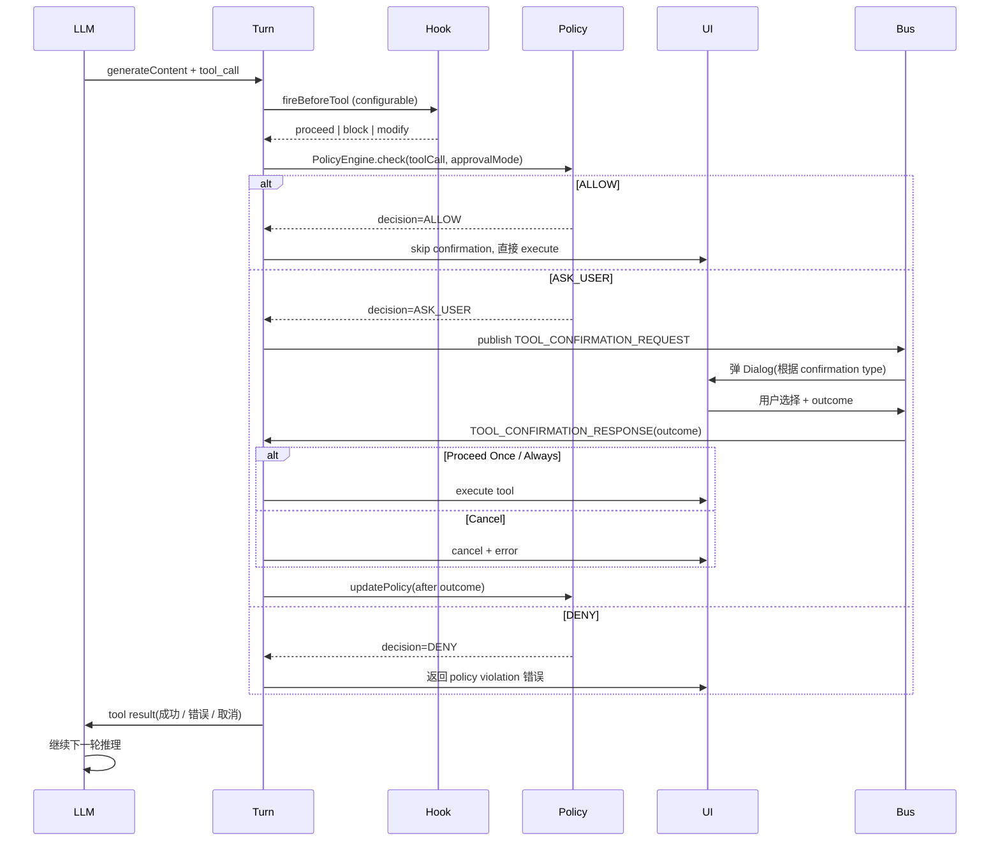
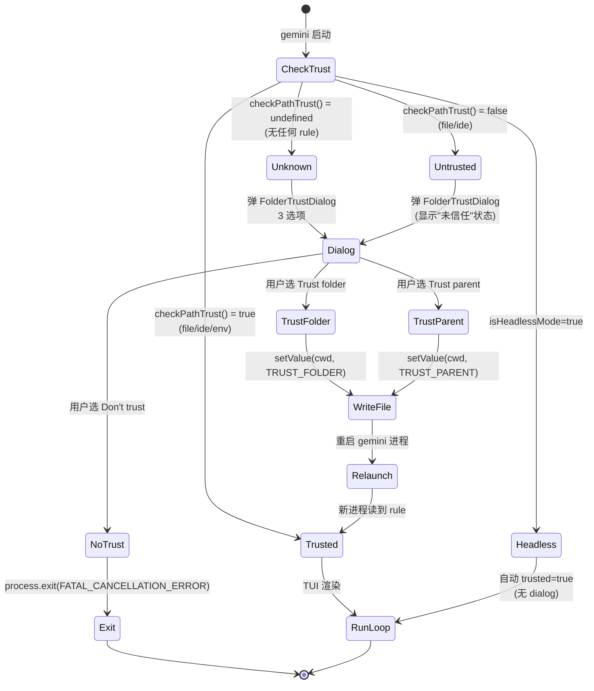
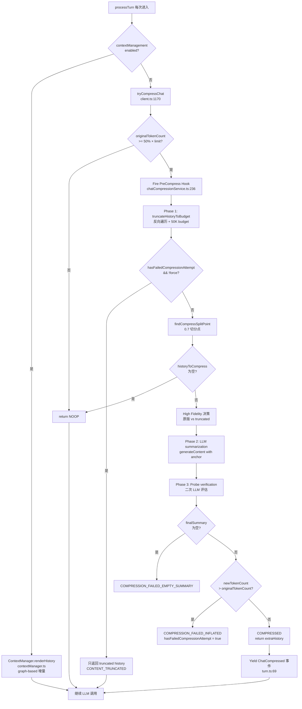

# Gemini CLI — Agent Loop 调研报告

> 调研对象:`google-gemini/gemini-cli`(v0.52.0-nightly.20260715,本仓库 snapshot)
> 调研维度:**Agent Loop** — 核心循环(思考-工具-观察)、4 类 memory、Plan 模式、Sub-Agent、Loop 退出、Ask 模式、HITL、工具权限、1M 上下文压缩
> 调研路径:`C:\workspace\github\onionagent\harness\01_market_research\clone\gemini-cli`
> 配套报告:同目录 `file_backend.md`(workspace/路径/JSONL 会话),`standard\file_backend.md`(行业提炼)

---

## 0. 智能体一句话定位

Google 官方终端 Agent;`gemini` 二进制 + 互动 TUI;基于 Gemini 3 / 2.5 系列,1M 上下文,免费档 60 req/min + 1000 req/day,内置 Google Search / 文件 / Shell / Web Fetch 工具,完整支持 MCP 协议、Hooks、Skills、Sub-Agents、Slash Command、Policy、Trusted-Folder 全套工程化机制。

**Agent Loop 核心特征**:
- **Turn 单元**:每轮 LLM 调 = 一个 `Turn`,流式 yield 11 种 `GeminiEventType`(`Content / Thought / ToolCallRequest / ToolCallConfirmation / ToolCallResponse / UserCancelled / Error / ChatCompressed / MaxSessionTurns / Finished / LoopDetected / AgentExecutionStopped / AgentExecutionBlocked / ContextWindowWillOverflow / Retry / InvalidStream / ModelInfo / Citation`)
- **4 类 memory**:`global` / `extension` / `project` / `userProjectMemory`,每轮通过 `getCoreSystemPrompt()` 注入 system prompt
- **Folder-Trust**:首次陌生 workspace 弹 3 选项 Dialog(Trust / Trust Parent / Don't Trust),期间并发扫描项目内的 commands / hooks / MCPs / skills / agents / settings,展示风险警告
- **Plan 模式**:4 种 `ApprovalMode` (`DEFAULT / AUTO_EDIT / YOLO / PLAN`)+ `EnterPlanModeTool` / `ExitPlanModeTool` 两个特殊工具
- **Sub-Agent**:`AgentTool` 委派给 local/remote agent,local agent 跑独立 `LocalAgentExecutor` + `GeminiChat` 子循环
- **Loop 退出**:6 种退出路径 — `MaxSessionTurns`(默认 100)/ `LoopDetected`(注入反馈文本自动重试)/ `UserCancelled` / `AgentExecutionStopped`(hooks 强制)/ `AgentExecutionBlocked`(等待重试)/ `ContextWindowWillOverflow`(先压缩再判断)
- **1M 上下文**:50% 阈值触发的 LLM-based 3 阶段压缩 + 50K token budget 的 tool output 反向截断

---

## 1. 调研依据

### 1.1 关键源码定位

| 主题 | 关键文件 |
|---|---|
| 主流程入口 | `packages/core/src/core/client.ts` `GeminiClient` |
| Turn 单元 | `packages/core/src/core/turn.ts` `Turn` |
| 事件流 | `packages/core/src/core/turn.ts:32-50` `GeminiEventType`(enum) |
| Chat 会话 | `packages/core/src/core/geminiChat.ts` `GeminiChat` |
| 4 类 memory 整合 | `packages/core/src/context/memoryContextManager.ts` |
| Memory 路径发现 | `packages/core/src/utils/memoryDiscovery.ts` |
| 上下文压缩 | `packages/core/src/context/chatCompressionService.ts` |
| 工具 Output 截断 | `packages/core/src/context/toolOutputMaskingService.ts` |
| 工具注册中心 | `packages/core/src/tools/tool-registry.ts` |
| 工具调度 | `packages/core/src/scheduler/scheduler.ts` `Scheduler` |
| Policy 引擎 | `packages/core/src/policy/policy-engine.ts` `PolicyEngine` |
| Approval Mode 类型 | `packages/core/src/policy/types.ts:62-66` `ApprovalMode` |
| Plan Mode 工具 | `packages/core/src/tools/enter-plan-mode.ts` + `exit-plan-mode.ts` |
| Sub-Agent 入口 | `packages/core/src/agents/agent-tool.ts` `AgentTool` |
| Sub-Agent 执行 | `packages/core/src/agents/local-executor.ts` `LocalAgentExecutor` |
| Sub-Agent 调度 | `packages/core/src/agents/agent-scheduler.ts` |
| Folder Trust 服务 | `packages/core/src/services/FolderTrustDiscoveryService.ts` |
| Trust 决策核心 | `packages/core/src/utils/trust.ts` `LoadedTrustedFolders` |
| Trust Dialog UI | `packages/cli/src/ui/components/FolderTrustDialog.tsx` |
| Trust Hook 集成 | `packages/cli/src/ui/hooks/useFolderTrust.ts` |
| Hooks 引擎 | `packages/core/src/hooks/hookSystem.ts` + `types.ts` |
| Hook 事件类型 | `packages/core/src/hooks/types.ts:43-54` `HookEventName` |
| Ask User 工具 | `packages/core/src/tools/ask-user.ts` `AskUserTool` |
| Confirmation Bus | `packages/core/src/confirmation-bus/message-bus.ts` |
| 循环检测 | `packages/core/src/services/loopDetectionService.ts` |
| TUI 事件消费 | `packages/cli/src/ui/hooks/useGeminiStream.ts` |
| 工具调度 UI | `packages/cli/src/ui/hooks/useToolScheduler.ts` |
| 聊天持久化 | `packages/core/src/services/chatRecordingService.ts` |
| 系统 Prompt 构造 | `packages/core/src/prompts/promptProvider.ts` |
| System Prompt 内存片段 | `packages/core/src/prompts/snippets.ts` |

### 1.2 关键常量

| 常量 | 值 | 位置 | 含义 |
|---|---|---|---|
| `MAX_TURNS` | 100 | `client.ts:73` | 主循环单次 user prompt 最多 turn 数 |
| `DEFAULT_COMPRESSION_TOKEN_THRESHOLD` | 0.5 | `chatCompressionService.ts:42` | 上下文超 50% 模型上限触发压缩 |
| `COMPRESSION_PRESERVE_THRESHOLD` | 0.3 | `chatCompressionService.ts:48` | 压缩时保留最近 30% 历史 |
| `COMPRESSION_FUNCTION_RESPONSE_TOKEN_BUDGET` | 50_000 | `chatCompressionService.ts:53` | 工具 response 截断预算(反向遍历) |
| `MODES_BY_PERMISSIVENESS` | `[PLAN, DEFAULT, AUTO_EDIT, YOLO]` | `types.ts:69-75` | approval mode 宽松度排序 |
| `DEFAULT_MAX_TIME_MINUTES` | 10 | `local-executor.ts`(隐含) | sub-agent 单次执行超时 |
| `DEFAULT_MAX_TURNS`(sub-agent) | 20 | `local-executor.ts` | sub-agent 单次最大 turn 数 |
| `GRACE_PERIOD_MS` | 60_000 | `local-executor.ts:71` | sub-agent 超时宽限 |
| `CONCURRENT_LIMIT`(memory) | 20 | `memoryDiscovery.ts:99` | 并发 stat 上限防 EMFILE |
| `ALWAYS_ALLOW_PRIORITY_FRACTION` | 0.95 | `types.ts:306` | "Always allow" rule 优先级小数 |

---

## 2. 九大问题回答

### Q1. Agent Loop 主流程(含 Mermaid)

**结论:Gemini CLI 采用"Turn-Event-Stream"三段式循环,核心是 `GeminiClient` 内的 `processTurn` 协程 + `Turn.run` 流式 yield `ServerGeminiStreamEvent` 事件,上层 `useGeminiStream` 消费事件并把 ToolCallRequest 派发到 `Scheduler` 调度工具执行。**

#### 1.1 核心类关系

| 层级 | 类 | 文件 | 职责 |
|---|---|---|---|
| 顶层驱动 | `GeminiClient` | `core/client.ts:131` | 入口 `sendMessageStream`、hooks 触发、循环检测、压缩决策、模型路由 |
| Turn 单元 | `Turn` | `core/turn.ts:235` | 单次 LLM 调用,流式 yield 11+ 种事件 |
| 模型调用 | `GeminiChat` | `core/geminiChat.ts:270` | 维护 `agentHistory: AgentChatHistory`,发请求,处理 retry/curated history |
| 工具调度 | `Scheduler` | `core/scheduler/scheduler.ts:139` | 接收 `ToolCallRequestInfo[]`,执行 confirmation→validation→execution,发出 `TOOL_CALLS_UPDATE` 事件 |
| UI 消费 | `useGeminiStream` | `ui/hooks/useGeminiStream.ts` | 消费 stream 事件 → 渲染 TUI |
| 工具执行结果回填 | `onComplete` callback | `ui/hooks/useGeminiStream.ts:290-296` | 工具完成后,把 tool result 重新喂给 LLM 继续下一轮 |

#### 1.2 主流程 Mermaid 图

```mermaid
flowchart TB
    Start([用户输入 prompt]) --> Init[submitQuery<br/>useGeminiStream.ts:1584]

    %% ======= Hooks 层 =======
    Init --> BeforeAgent[Fire BeforeAgent Hook<br/>client.ts:212 fireBeforeAgentHookSafe]
    BeforeAgent -- "stop" --> StopEvent[AgentExecutionStopped<br/>turn.ts:78]
    BeforeAgent -- "block" --> BlockEvent[AgentExecutionBlocked<br/>turn.ts:88]
    BeforeAgent -- "additionalContext" --> InjectCtx[注入 hook_context 文本]
    BeforeAgent -- "无" --> ProcessTurn
    InjectCtx --> ProcessTurn

    %% ======= 主循环 =======
    ProcessTurn[processTurn<br/>client.ts:524] --> SessionTurn{sessionTurnCount ><br/>maxSessionTurns?}
    SessionTurn -- 是 --> MaxTurnEvent[MaxSessionTurns<br/>client.ts:535]
    SessionTurn -- 否 --> CtxMgrEnabled{Context Management<br/>enabled?}

    CtxMgrEnabled -- 是 --> CtxMgr[ContextManager.renderHistory<br/>contextManager.ts]
    CtxMgr --> LoopCheck
    CtxMgrEnabled -- 否 --> Compress[tryCompressChat<br/>client.ts:1170]
    Compress -- COMPRESSED --> YieldCompress[ChatCompressed 事件<br/>turn.ts:69]
    Compress --> LoopCheck

    %% ======= 循环检测 =======
    LoopCheck[loopDetector.turnStarted<br/>client.ts:670] --> LoopCount{loopResult.count}
    LoopCount -- 1 --> Bounded{boundedTurns <= 1?}
    Bounded -- 是 --> MaxTurnEvent
    Bounded -- 否 --> LoopRecover[_recoverFromLoop<br/>client.ts:1193<br/>注入反馈文本]
    LoopCount -- ">1" --> LoopDetected[LoopDetected 事件<br/>turn.ts:75]
    LoopRecover -.->|递归 sendMessageStream| ProcessTurn

    %% ======= 模型选择 + 路由 =======
    LoopCheck --> Router[ModelRouterService.route<br/>client.ts:706]
    Router --> ApplyModel[applyModelSelection<br/>availability/policyHelpers.ts]
    ApplyModel --> ModelInfo[ModelInfo 事件<br/>turn.ts:108]
    ModelInfo --> SetTools[setTools(modelToUse)<br/>client.ts:454]

    %% ======= LLM 调用 + 事件流 =======
    SetTools --> TurnRun[Turn.run<br/>turn.ts:251]
    TurnRun --> StreamLoop{流式 yield 事件}

    StreamLoop -- Content --> ContentEv[Content 事件<br/>turn.ts:325<br/>累加到 geminiMessageBuffer]
    StreamLoop -- Thought --> ThoughtEv[Thought 事件<br/>turn.ts:312]
    StreamLoop -- ToolCallRequest --> ToolReqEv[ToolCallRequest 事件<br/>turn.ts:421]

    ToolReqEv --> Yield[继续 yield 给 TUI]
    Yield --> MoreEvents{还有事件?}
    MoreEvents -- 是 --> StreamLoop
    MoreEvents -- 否 --> Finished[Finished 事件<br/>turn.ts:355]

    ContentEv --> StreamLoop
    ThoughtEv --> StreamLoop

    %% ======= 退出/继续决策 =======
    Finished --> HasPending{turn.pendingToolCalls<br/>长度 > 0?}
    HasPending -- 是 --> ReturnTurn[return turn]
    HasPending -- 否 --> NextSpeaker[checkNextSpeaker<br/>client.ts:760]
    NextSpeaker -- "model" --> Continue[继续 sendMessageStream<br/>递归]
    NextSpeaker -- "user" --> AfterAgent[Fire AfterAgent Hook<br/>client.ts:267]
    Continue -.->|递归| ProcessTurn
    AfterAgent --> ReturnTurn

    %% ======= 工具执行流 =======
    ReturnTurn --> ProcessEvents[processGeminiStreamEvents<br/>useGeminiStream.ts:1459]
    ProcessEvents -- 收集到 ToolCallRequest --> Schedule[scheduleToolCalls<br/>useToolScheduler.ts]
    Schedule --> SchedulerCheck[Scheduler._startBatch<br/>scheduler.ts]

    SchedulerCheck --> PolicyCheck[checkPolicy<br/>scheduler/policy.ts:42]
    PolicyCheck -- ALLOW --> Execute[tool.execute]
    PolicyCheck -- DENY --> DenyErr[返回 policy violation 错误]
    PolicyCheck -- ASK_USER --> ConfirmDialog[弹确认 Dialog<br/>TOOL_CONFIRMATION_REQUEST<br/>message-bus.ts]

    ConfirmDialog -- 用户确认 --> UpdatePolicy[updatePolicy<br/>scheduler/policy.ts:107]
    UpdatePolicy -- "Always Allow" --> UpdateBus[MessageBusType.UPDATE_POLICY]
    UpdatePolicy -- "Proceed Once" --> Execute
    UpdatePolicy -- "Cancel" --> Cancelled[Cancelled 状态]

    Execute --> ToolComplete[CompletedToolCall]
    ToolComplete --> OnComplete[onComplete callback]
    OnComplete --> SubmitAgain[重新 submitQuery<br/>用 tool result 喂给 LLM]
    SubmitAgain -.->|下一轮 LLM| ProcessTurn

    %% ======= Loop 退出汇总 =======
    StopEvent --> Exit([本次 user prompt 循环结束])
    BlockEvent -.->|yield 事件后继续| ProcessTurn
    MaxTurnEvent --> Exit
    LoopDetected --> Exit
    DenyErr --> Exit
    Cancelled --> Exit
```

#### 1.3 主循环伪代码(简版)

```typescript
// packages/cli/src/ui/hooks/useGeminiStream.ts:1660-1710 (submitQuery 简化)
async function submitQuery(query, signal, prompt_id) {
  // 1. 触发 BeforeAgent Hook
  const hookResult = await fireBeforeAgentHookSafe(query, prompt_id);
  if (hookResult?.type === AgentExecutionStopped) return;       // 强制停止
  if (hookResult?.type === AgentExecutionBlocked) {
    // 注入 blocked reason 作为下一轮 prompt
  }

  // 2. 进入主循环
  const stream = geminiClient.sendMessageStream(
    query, signal, prompt_id, undefined, /*displayContent*/ query,
  );

  // 3. 同步处理 stream 事件
  for await (const event of stream) {
    switch (event.type) {
      case Content:    /* 累加到 geminiMessageBuffer */
      case Thought:    /* 渲染思考 */
      case ToolCallRequest:  /* 收集到 toolCallRequests[] */
      case UserCancelled:    /* 处理 ESC */
      case MaxSessionTurns:  /* 弹最大轮数告警 */
      case LoopDetected:     /* 弹循环检测确认 */
      case ContextWindowWillOverflow: /* 弹溢出告警 */
      case Finished:    /* 标记 turn 完成 */
    }
  }

  // 4. 派发工具调用
  if (toolCallRequests.length > 0) {
    await scheduleToolCalls(toolCallRequests, signal);
    // 工具完成后,onComplete 会再次 submitQuery,继续下一轮 LLM
  }
}
```

```typescript
// packages/core/src/core/client.ts:524-790 (processTurn 简化)
private async *processTurn(request, signal, prompt_id, boundedTurns) {
  // 0. 递增 sessionTurnCount
  this.sessionTurnCount++;

  // 1. session turn 上限检查
  if (this.sessionTurnCount > this.config.getMaxSessionTurns()) {
    yield { type: GeminiEventType.MaxSessionTurns };
    return;
  }

  // 2. Context Management 路径(默认开启,新版)
  if (this.config.getContextManagementConfig().enabled) {
    const { history, apiHistory, pendingApiHistory, baseUnits } =
      await this.contextManager.renderHistory(...);
    this.getChat().setHistory(history);
    apiHistoryOverride = [...apiHistory, finalPendingContent];
  } else {
    // 3. 旧路径: 触发压缩
    const compressed = await this.tryCompressChat(prompt_id, false, signal);
    if (compressed.compressionStatus === COMPRESSED) {
      yield { type: GeminiEventType.ChatCompressed, value: compressed };
    }
  }

  // 4. 上下文窗口溢出预估
  const estimatedRequestTokenCount = await calculateRequestTokenCount(request, ...);
  if (estimatedRequestTokenCount > remainingTokenCount) {
    yield { type: GeminiEventType.ContextWindowWillOverflow, ... };
    return;
  }

  // 5. 工具输出 masking
  await this.tryMaskToolOutputs(this.getHistory());

  // 6. 循环检测
  const loopResult = await this.loopDetector.turnStarted(signal);
  if (loopResult.count > 1) yield { type: LoopDetected };
  else if (loopResult.count === 1) return yield* this._recoverFromLoop(...);

  // 7. 模型路由 + 选模型
  const decision = await router.route(routingContext);

  // 8. 创建 Turn,启动 LLM 流式调用
  const turn = new Turn(this.getChat(), prompt_id);
  for await (const event of turn.run(modelConfigKey, request, signal, options)) {
    // 9. 流式 yield 给上层(同时二次循环检测)
    yield event;

    // 10. Finished 时回填 token count
    if (event.type === Finished && usageMetadata?.promptTokenCount) {
      this.contextManager.eventBus.emitTokenGroundTruth(...);
    }
  }

  // 11. 无工具调用时,检查 next speaker
  if (!turn.pendingToolCalls.length) {
    const next = await checkNextSpeaker(this.getChat(), baseLlm, signal, prompt_id);
    if (next?.next_speaker === 'model') {
      turn = yield* this.sendMessageStream(['Please continue.'], ...);
    }
  }

  return turn;
}
```

#### 1.4 4 类 Memory 如何融入 Loop

**4 类 memory 的发现 → 整合 → 注入 system prompt → 触发 `updateSystemInstruction` 闭环**:

| 类别 | 路径 | 加载函数 | 信任要求 | 触发时机 |
|---|---|---|---|---|
| `global` | `~/.gemini/GEMINI.md` (可配多文件名) | `getGlobalMemoryPaths()` `memoryDiscovery.ts:336-356` | 无 | `MemoryContextManager.refresh()` 启动时 |
| `extension` | 各 extension 的 `contextFiles` 列表 | `getExtensionMemoryPaths()` `memoryDiscovery.ts:381-395` | 无 | 同上 |
| `project` | 从 `cwd` 向上找 `GEMINI.md` 直到 `.git` 边界 | `getEnvironmentMemoryPaths()` `memoryDiscovery.ts:397-417` | **仅在 `isTrustedFolder()=true` 时加载** | 同上 |
| `userProjectMemory` | `~/.gemini/tmp/<shortId>/memory/MEMORY.md` (旧:`<cwd>/MEMORY.md`) | `getUserProjectMemoryPaths()` `memoryDiscovery.ts:358-379` | 无 | 同上 |

**整合入口**(`memoryContextManager.ts:38-94`):
```typescript
// packages/core/src/context/memoryContextManager.ts:49-65
async refresh(): Promise<void> {
  this.loadedPaths.clear();
  this.loadedFileIdentities.clear();
  const paths = await this.discoverMemoryPaths();     // 4 路并发拉路径
  const contentsMap = await this.loadMemoryContents(paths);  // 并发读 + processImports
  this.categorizeMemoryContents(paths, contentsMap);
  this.emitMemoryChanged();      // ← 触发 coreEvents 事件
}
```

**注入 system prompt**(`memoryContextManager.ts:97-117`):
```typescript
private categorizeMemoryContents(paths, contentsMap) {
  const hierarchicalMemory = categorizeAndConcatenate(paths, contentsMap);
  this.globalMemory = hierarchicalMemory.global || '';
  this.extensionMemory = hierarchicalMemory.extension || '';
  this.userProjectMemoryContent = hierarchicalMemory.userProjectMemory || '';
  // 关键: project memory + MCP instructions 合并,且仅在 isTrustedFolder() 时保留
  const projectMemoryWithMcp = [
    hierarchicalMemory.project,
    mcpInstructions.trimStart(),
  ].filter(Boolean).join('\n\n');
  this.projectMemory = this.config.isTrustedFolder() ? projectMemoryWithMcp : '';
}
```

**Loop 触发更新**(`client.ts:141-150`):
```typescript
private handleMemoryChanged = () => {
  this.updateSystemInstruction();   // 重新计算 systemInstruction 喂给 GeminiChat
};

private updateSystemInstruction(): void {
  if (!this.isInitialized()) return;
  const systemMemory = this.config.getSystemInstructionMemory();   // HierarchicalMemory
  const systemInstruction = getCoreSystemPrompt(this.config, systemMemory);
  this.getChat().setSystemInstruction(systemInstruction);   // ← 直接覆盖 GeminiChat 的 system instruction
}
```

**JIT 加载(Tier 3)**(`memoryContextManager.ts:122-153`):
```typescript
async discoverContext(accessedPath: string, trustedRoots: string[]): Promise<string> {
  if (!this.config.isTrustedFolder()) return '';   // 未信任 folder 直接拒绝
  const result = await loadJitSubdirectoryMemory(accessedPath, ...);
  // 访问文件时,实时加载该路径向上到 git root 的所有 GEMINI.md
  return concatenateInstructions(result.files.map(...));
}
```

**System prompt 构造**(PromptProvider 注入 memory):
- `global` 注入到 system prompt 的 "## Global Context" 段
- `project` 注入到 "## Workspace Context" 段
- `extension` 注入到 "## Extension Context" 段
- `userProjectMemory` 注入到 "## Project Memory (Auto-saved)" 段(由 LLM 主动 `memoryTool` 写入)

#### 1.5 Folder-Trust 弹窗如何融入 Loop

**关键设计:Folder Trust 是在 `Loop 启动前(初始化阶段)`完成的,Loop 本身不感知 trust 状态,只是被动依赖 `config.isTrustedFolder()`。**

```
启动 gemini CLI
   │
   └─ loadSettings()
   └─ loadCliConfig() → new Config()
   └─ initializeApp() → 弹认证 / IDE / theme
   └─ useFolderTrust(settings)         ← hooks/useFolderTrust.ts:23
        │
        ├─ isWorkspaceTrusted()         ← utils/trust.ts:46
        │    └─ 决策顺序: env > feature flag > IDE > file
        │
        ├─ trusted === false 或 undefined:
        │    └─ FolderTrustDiscoveryService.discover(cwd)
        │         └─ 并发扫描 .gemini/commands / .gemini/skills / .gemini/agents / .gemini/settings
        │         └─ 收集 security warnings
        │    └─ 弹 FolderTrustDialog
        │         ├─ Trust folder (this dir)
        │         ├─ Trust parent folder
        │         └─ Don't trust
        │    └─ 用户选 Trust → LoadedTrustedFolders.setValue(cwd, TrustLevel)
        │                    → 写 ~/.gemini/trustedFolders.json (原子 temp+rename)
        │                    → isRestarting=true → relaunchApp() (进程重启)
        │    └─ 用户选 Don't trust → 进程退出
        │
        └─ trusted === true:
             └─ 直接进入 TUI,显示 "This folder is untrusted" (若 false)
                  → MemoryContextManager.refresh() 跳过 project memory
                  → policy rules 仍然按 file rule 走
                  → hooks/MCPs 仍可工作(因为 trust 仅影响 memory,不影响 policy)
   │
   └─ TUI 渲染完成 → 接受 user input
   └─ submitQuery → 调 GeminiClient.sendMessageStream()
   └─ 进入正式 Loop
```

**核心证据**:
- `useFolderTrust.ts:48-58`:isTrusted = undefined 或 false → 弹 dialog
- `useFolderTrust.ts:60-77`:User 选择后调 `trustedFolders.setValue` → `relaunchApp()` 250ms 后重启(让 TUI 重新加载)
- `FolderTrustDialog.tsx:65-67`:`useEffect` 监听 `isRestarting`,触发 `relaunchApp()`
- `trust.ts:46-68`:`checkPathTrust` 决策顺序固定
- `memoryContextManager.ts:62-65`:`isTrustedFolder()` 决定是否加载 `project` 类 memory

**关键观察:Trust 检查点是 `useFolderTrust` hook 启动时一次性完成的,Loop 内部不再检查 trust**。这是合理的:trust 是"workspace 元数据",不是"per-turn 状态"。

---

### Q2. Plan 计划机制

**结论:Gemini CLI 有完整的 Plan 模式,通过 `EnterPlanModeTool` / `ExitPlanModeTool` 两个特殊工具触发,plan 文件存放在 `~/.gemini/tmp/<shortId>/plans/<plan_filename>.md`,`ApprovalMode.PLAN` 会让工具集降级到只读。**

#### 2.1 Plan 模式的进入/退出

**进入**(`enter-plan-mode.ts:88-92`):
```typescript
async execute({ abortSignal: _signal }: ExecuteOptions): Promise<ToolResult> {
  if (this.confirmationOutcome === ToolConfirmationOutcome.Cancel) {
    return { llmContent: 'User cancelled entering Plan Mode.', returnDisplay: 'Cancelled' };
  }
  this.config.setApprovalMode(ApprovalMode.PLAN);    // ← 切换 approval mode
  // 确保 plans 目录存在
  const plansDir = this.config.storage.getPlansDir();
  if (!fs.existsSync(plansDir)) {
    fs.mkdirSync(plansDir, { recursive: true });
  }
  return { llmContent: 'Switching to Plan mode.', returnDisplay: 'Switching to Plan mode' };
}
```

**退出**(`exit-plan-mode.ts:165-176`):
```typescript
async execute({ abortSignal: _signal }: ExecuteOptions): Promise<ToolResult> {
  const resolvedPlanPath = this.getResolvedPlanPath();
  // 用户批准:
  if (payload.approved) {
    const newMode = payload.approvalMode ?? ApprovalMode.DEFAULT;
    if (newMode === ApprovalMode.PLAN) throw new Error('Unexpected approval mode');
    this.config.setApprovalMode(newMode);            // 切回 default/yolo/autoEdit
    this.config.setApprovedPlanPath(resolvedPlanPath); // 记录批准的计划
    logPlanExecution(this.config, new PlanExecutionEvent(newMode));
    return {
      llmContent: `${getPlanModeExitMessage(newMode)}\nThe approved implementation plan is stored at: ${resolvedPlanPath}\nRead and follow the plan strictly during implementation.`,
      returnDisplay: `Plan approved: ${resolvedPlanPath}`,
    };
  } else {
    // 用户拒绝 + 反馈:把反馈注入回 LLM,让 LLM 修订 plan
    return { llmContent: `Plan rejected. User feedback: ${feedback}\n...`, returnDisplay: `Feedback: ${feedback}` };
  }
}
```

#### 2.2 Plan 文件存储位置

| 路径 | API | 默认 / 可配 |
|---|---|---|
| `~/.gemini/tmp/<shortId>/plans/<plan_filename>.md` | `Storage.getProjectTempPlansDir()` | `storage.ts:321-326`,**默认全局 tmp 下** |
| `<cwd>/plans/<plan_filename>.md` | `setCustomPlansDir(...)` | 配 `GEMINI_CLI_PLANS_DIR` 或类似环境变量可重定向到项目内 |

**关键代码**(`storage.ts:321-326`):
```typescript
getProjectTempPlansDir(): string {
  return this.getProjectTempDir() + '/plans';   // ~/.gemini/tmp/<shortId>/plans
}
```

**Plan 文件名验证**(`utils/planUtils.ts`,在 `exit-plan-mode.ts:62-77`):
```typescript
const pathError = await validatePlanPath(
  this.params.plan_filename,
  this.config.storage.getPlansDir(),
  this.config.getProjectRoot(),
);
if (pathError) { this.planValidationError = pathError; return false; }

const contentError = await validatePlanContent(resolvedPlanPath);
if (contentError) { this.planValidationError = contentError; return false; }
```

#### 2.3 Plan 模式对工具集的影响

**`ApprovalMode.PLAN` 的核心约束**:`policy-engine.ts` 会让 sub-agent 类工具的优先级(1.03)低于 PLAN 模式规则(优先级 40),从而 sub-agent 在 plan 模式下被 deny。

**System prompt 注入 plan mode 规则**(`core/prompts.ts`):
- 提示 LLM "你正处于 Plan Mode,只能使用只读工具"
- 提示 LLM "用 `exit_plan_mode` 工具请求用户批准"
- **关键**:`exit_plan_mode` 接受 `plan_filename` 参数,LLM 必须先 `write_file` 写 plan,再 `exit_plan_mode` 提交

**`ExitPlanModeTool` 的关键设计**:
- `shouldConfirmExecute` 返回 `ToolExitPlanModeConfirmationDetails`(`confirmation-bus/types.ts:139`)
- 弹专用的 "Plan Approval" 对话框
- 用户可选择批准/拒绝 + 反馈
- 用户可选择退出后切到哪个 `ApprovalMode`(DEFAULT / AUTO_EDIT / YOLO)
- 拒绝时把反馈注入 LLM,让 LLM 修订 plan

#### 2.4 Plan Mode 状态机

```mermaid
stateDiagram-v2
    [*] --> Default: 启动
    Default --> Plan: LLM 调 EnterPlanModeTool<br/>config.setApprovalMode(PLAN)
    Plan --> Plan: LLM 用只读工具探索<br/>(read_file, grep, glob, ls)
    Plan --> Plan: LLM 调 write_file 写 plan<br/>到 ~/.gemini/tmp/<shortId>/plans/
    Plan --> Approval: LLM 调 ExitPlanModeTool(plan_filename)
    Approval --> Default: 用户批准 + 选 ApprovalMode=DEFAULT
    Approval --> AutoEdit: 用户批准 + 选 ApprovalMode=AUTO_EDIT
    Approval --> Yolo: 用户批准 + 选 ApprovalMode=YOLO
    Approval --> Plan: 用户拒绝 + 给反馈<br/>LLM 修订 plan
    Plan --> [*]: UserCancelled / Esc
```

---

### Q3. Sub Agent

**结论:Gemini CLI 有完整 Sub-Agent 体系,通过 `AgentTool`(`AGENT_TOOL_NAME`)委派给 local/remote agent,local agent 跑独立的 `LocalAgentExecutor` + `GeminiChat` 子循环,有独立的 session ID、JSONL 记录、turn/time budget。**

#### 3.1 Sub-Agent 入口

**`AgentTool` 类**(`agents/agent-tool.ts:48-93`):
```typescript
export class AgentTool extends BaseDeclarativeTool<
  { agent_name: string; prompt: string },
  ToolResult
> {
  static readonly Name = AGENT_TOOL_NAME;     // 工具名
  // Schema: agent_name + prompt(完整 query)
  protected createInvocation(...) {
    const registry = this.context.config.getAgentRegistry();
    const definition = registry.getDefinition(params.agent_name);
    // Smart Parameter Mapping: 把 prompt 映射到 agent 的 input schema
    const mappedInputs = this.mapParams(params.prompt, definition.inputConfig.inputSchema);
    return new DelegateInvocation(params, mappedInputs, ...);
  }
}
```

**Schema 示意**:
```json
{
  "agent_name": {"type": "string", "description": "Name of the subagent to invoke"},
  "prompt": {"type": "string", "description": "The COMPLETE query to send the subagent. Must be comprehensive and detailed."}
}
```

#### 3.2 Sub-Agent 类型

**4 种 invocation 类型**(`agent-tool.ts:60-69`):
| Type | Class | 用途 |
|---|---|---|
| Local | `LocalSubagentInvocation` | 本地 sub-agent,跑独立 GeminiChat |
| Local Session | `LocalSessionInvocation` | 本地持续 session(可跨多次 invocation 复用) |
| Remote | `RemoteAgentInvocation` | 远程 sub-agent(A2A 协议) |
| Remote Session | `RemoteSessionInvocation` | 远程持续 session |
| Browser | `BrowserAgentInvocation` | 浏览器专用 sub-agent |

#### 3.3 Local Agent 执行流

**`LocalSubagentInvocation.execute()`**(`agents/local-invocation.ts:101-200`):
```typescript
async execute(options: ExecuteOptions): Promise<ToolResult> {
  const executor = new LocalAgentExecutor(this.definition, this.context, ...);
  const output = await executor.run(this.params, options.abortSignal);
  return {
    llmContent: output.result,
    returnDisplay: ...,
  };
}
```

**`LocalAgentExecutor.runInternal()`**(`agents/local-executor.ts:570-1080`):
```typescript
private async runInternal(inputs, signal): Promise<OutputObject> {
  const maxTimeMinutes = this.definition.runConfig.maxTimeMinutes ?? 10;
  const maxTurns = this.definition.runConfig.maxTurns ?? 20;
  const deadlineTimer = new DeadlineTimer(maxTimeMinutes * 60 * 1000, 'Agent timed out.');

  // 1. 创建独立的 GeminiChat(独立 history, 独立 session)
  chat = await this.createChatObject(augmentedInputs, tools);

  // 2. 跑子循环(类似主 loop, 但 scope 在 executor 内)
  while (turnCounter < maxTurns) {
    turnCounter++;
    const turn = new Turn(chat, prompt_id);
    for await (const event of turn.run(...)) {
      // 处理 content / thought / tool call request
      // sub-agent 可以调自己的工具集
      // 工具 scheduleAgentTools 走独立 Scheduler
    }

    // 3. 超时检查
    if (deadlineTimer.timedOut()) break;

    // 4. 通过 complete_task 工具完成(强制终止机制)
    if (isCompleted) break;
  }
  return finalResult;
}
```

#### 3.4 Sub-Agent 隔离特性

| 维度 | 隔离方式 |
|---|---|
| **Session ID** | `randomUUID()` 生成,主 loop 的 session ID 不同 |
| **JSONL 记录** | 写到 `chats/<parentSessionId>/<subagentSessionId>.jsonl`(`chatRecordingService.ts:482-486`) |
| **Workspace Context** | `createScopedWorkspaceContext(...)` `agents/local-executor.ts:541-550`,agent 可声明自己的 `workspaceDirectories` |
| **Memory 访问** | `runWithScopedMemoryInboxAccess()` 限定只能访问 inbox 内的 memory;`runWithScopedAutoMemoryExtractionWriteAccess()` 控制是否能写自动 memory |
| **Turn Budget** | `runConfig.maxTurns` 默认 20 |
| **Time Budget** | `runConfig.maxTimeMinutes` 默认 10 分钟 |
| **System Prompt** | `getCoreSystemPrompt(config, undefined, /*interactiveOverride=*/false)` + agent 自己的 `promptConfig.query` |
| **Tools** | `toolConfig.tools` 字段声明(可限定为只读工具子集) |
| **Hooks** | `runWith*` 作用域限定 |
| **Model** | `modelConfig.model: 'inherit'` = 继承主 loop,或显式声明 |
| **Completion** | 必须调 `complete_task` 工具显式完成,否则跑满 turn/time budget |

#### 3.5 内置 Sub-Agents

**Generalist Agent**(`agents/generalist-agent.ts`):
- 全功能 agent,工具集 = 全部工具(`getAllToolNames()`)
- 适用于"turn-intensive 或大量数据处理"任务
- 在 PLAN 模式下,自动调整 description 为 "large-scale investigation and batch planning"
- 不在 PLAN 模式下,描述为 "batch refactoring/error fixing across multiple files..."

**Browser Agent**(`agents/browser/browserAgentDefinition.ts`):
- 专门用于浏览器自动化任务
- 有自己的工具集(read_dom, click_element, type_text 等)

**Codebase Investigator**(`agents/codebase-investigator.ts`):
- 专门用于深度代码搜索
- 工具集 = grep, glob, read_file, read_many_files

**Skill Extraction Agent**(`agents/skill-extraction-agent.ts`):
- 从对话历史中提取可重用的 skill

#### 3.6 Sub-Agent 在 Loop 中的位置

**主 Loop 视角**:sub-agent 调用 = 一次普通的 tool call 走完 → tool result 是 sub-agent 的最终输出 → LLM 拿到 tool result 继续下一轮 turn → 就像调用 `read_file` 一样自然

**底层视角**:
1. main turn yield `ToolCallRequest(agent_name='generalist', prompt='...')` 事件
2. `Scheduler` 调度到 `AgentTool` → `LocalSubagentInvocation.execute()`
3. `LocalAgentExecutor` 启动独立 chat + sub-loop
4. sub-loop 跑自己的 N 轮 turn + 自己的 tool calls
5. sub-loop 完成 → 返回 string result
6. result 包装成 `ToolResult`,写回主 chat history
7. 主 loop 下一 turn 看到 tool result,继续推理

---

### Q4. Loop 退出机制

**结论:Gemini CLI 的 loop 有 8 种退出/中断路径,层层兜底,确保 1)用户控制权、2)安全边界、3)资源不溢出。**

#### 4.1 8 种退出路径

| # | 路径 | 触发位置 | 行为 |
|---|---|---|---|
| 1 | **User Cancelled** (Esc / Ctrl+C) | `turn.ts:271` 检测 `signal.aborted` | yield `{type: UserCancelled}`,return;`useGeminiStream.ts:1491` 处理 |
| 2 | **Finished** (LLM 主动结束) | `turn.ts:355` 检测 `finishReason` | yield `{type: Finished, value: {reason, usageMetadata}}` → `useGeminiStream.ts:1529` 标记完成 |
| 3 | **Max Session Turns** | `client.ts:535` `sessionTurnCount > maxSessionTurns` | yield `MaxSessionTurns` 事件 → 弹"已达最大轮数"告警 |
| 4 | **Loop Detected** (重复工具调用) | `client.ts:681` `loopResult.count > 1` | yield `LoopDetected` → TUI 弹"是否禁用 loop detection"对话框(`useGeminiStream.ts:1538`) |
| 5 | **Loop Recovery** (count == 1) | `client.ts:691` `_recoverFromLoop()` | 注入 system feedback 文本递归 `_recoverFromLoop` |
| 6 | **Context Window Will Overflow** | `client.ts:613` `estimatedRequestTokenCount > remainingTokenCount` | yield `ContextWindowWillOverflow` → 弹告警,return |
| 7 | **Agent Execution Stopped** (BeforeAgent hook) | `client.ts:222-231` | yield `AgentExecutionStopped`,return(强制退出) |
| 8 | **Agent Execution Blocked** (AfterAgent hook blocking) | `client.ts:937-953` | yield `AgentExecutionBlocked` → 把 blocked reason 注入下一轮 |

#### 4.2 关键代码细节

**Max Session Turns 默认 100**(`client.ts:73`):
```typescript
const MAX_TURNS = 100;
// client.ts:534-538
if (this.config.getMaxSessionTurns() > 0 && this.sessionTurnCount > this.config.getMaxSessionTurns()) {
  yield { type: GeminiEventType.MaxSessionTurns };
  return turn;
}
```

**User Cancelled**(`turn.ts:269-273`):
```typescript
for await (const streamEvent of responseStream) {
  if (signal?.aborted) {
    yield { type: GeminiEventType.UserCancelled };
    return;
  }
  ...
}
```

**Loop Detection 双重检测**(`client.ts:670-700`):
```typescript
// 1. 进入 turn 前的检测
const loopResult = await this.loopDetector.turnStarted(signal);
if (loopResult.count > 1) yield { type: GeminiEventType.LoopDetected };
else if (loopResult.count === 1) return yield* this._recoverFromLoop(...);

// 2. 流式事件过程中的检测
for await (const event of resultStream) {
  const loopResult = this.loopDetector.addAndCheck(event);
  if (loopResult.count > 1) {
    yield { type: GeminiEventType.LoopDetected };
    loopDetectedAbort = true;
    break;
  }
}
```

**Loop Recovery 注入反馈**(`client.ts:1193-1215`):
```typescript
private _recoverFromLoop(loopResult, signal, prompt_id, boundedTurns, displayContent) {
  this.loopDetector.clearDetection();
  const feedbackText = `System: Potential loop detected. Details: ${loopResult.detail || 'Repetitive patterns identified'}. 
    Please take a step back and confirm you're making forward progress. 
    If not, take a step back, analyze your previous actions and rethink how you're approaching the problem. 
    Avoid repeating the same tool calls or responses without new results.`;
  const feedback = [{ text: feedbackText }];
  return this.sendMessageStream(feedback, signal, prompt_id, boundedTurns - 1, displayContent);
}
```

**Context Overflow 双重检查**(`client.ts:594-617`):
```typescript
// 1. 触发压缩(如果历史超 50% 阈值)
const compressed = await this.tryCompressChat(prompt_id, false, signal);
if (compressed.compressionStatus === CompressionStatus.COMPRESSED) {
  yield { type: GeminiEventType.ChatCompressed, value: compressed };
}

// 2. 即便压缩后,新请求 token 也可能超
const estimatedRequestTokenCount = await calculateRequestTokenCount(request, ...);
if (estimatedRequestTokenCount > remainingTokenCount) {
  yield { type: GeminiEventType.ContextWindowWillOverflow, value: { estimatedRequestTokenCount, remainingTokenCount } };
  return turn;
}
```

#### 4.3 Loop Detection 算法(简版)

**`LoopDetectionService`**(`services/loopDetectionService.ts`):
- 跟踪最近 N 轮的 tool call signature + response hash
- 检测到连续 3 轮相同/相似 → 触发 `count: 1`(1 次警告)
- 检测到连续 4+ 轮相同/相似 → 触发 `count: >1`(强警告 → `LoopDetected` 事件)
- 注入 feedback 文本后,调用 `clearDetection()` 重置计数

#### 4.4 Next Speaker 决策(`utils/nextSpeakerChecker.ts`)

**`checkNextSpeaker`** 在 turn 完成后调用:
- 输入:`chat` + `request` 上下文
- 输出:`{ next_speaker: 'model' | 'user' }`
- 如果是 `'model'` → 自动发送 `'Please continue.'` 继续下一轮 turn
- 如果是 `'user'` → 返回 turn,等用户输入

---

### Q5. Ask 模式

**结论:Gemini CLI 通过 3 个独立的 Ask 机制:1) `ask_user` 工具(LLM 主动问,最多 4 个问题,每题 2-4 选项)、2) `exit_plan_mode` 计划批准(plan 模式专用)、3) `ToolConfirmationDetails` 工具调用确认(常规工具)。Ask 模式与 Plan/HITL 紧密耦合。**

#### 5.1 `ask_user` 工具(LLM 主动问)

**Schema**(`tools/ask-user.ts:73-86`):
```typescript
{
  questions: [
    {
      type: 'choice' | 'text',
      question: string,           // 问题正文
      header: string,             // 简短分类标签
      options?: [                 // 2-4 个选项
        { label: string, description: string }
      ],
      multiSelect?: boolean,
    }
  ]
}
```

**约束**(`tools/ask-user.ts:42-57`):
- `choice` 类型必须有 `options`,至少 2 个,最多 4 个
- 每个 option 必须有 `label`(非空)+ `description`(非空)

**Confirmation 流程**(`tools/ask-user.ts:178-186`):
```typescript
override async shouldConfirmExecute(_abortSignal) {
  return {
    type: 'ask_user',
    title: 'Ask User',
    questions: normalizedQuestions,
    onConfirm: async (outcome, payload) => {
      this.confirmationOutcome = outcome;
      if (payload && 'answers' in payload) {
        this.userAnswers = payload.answers;     // { [questionIndex: string]: string }
      }
    },
  };
}
```

**结果回填**(`tools/ask-user.ts:188-220`):
- `execute()` 把答案 JSON 化塞进 `llmContent`
- 取消 → return `{llmContent: 'User dismissed ask_user dialog without answering.'}`
- 提交 → return `{llmContent: JSON.stringify({answers}), returnDisplay: '**User answered:**\n  Q1 → ...'}`

#### 5.2 `exit_plan_mode` 计划批准

**Confirmation 类型**(`confirmation-bus/types.ts:139`):
```typescript
type: 'exit_plan_mode',
planPath: string,         // 解析后的 plan 路径
```

**User Outcome**:
- ProceedOnce + approved=true + approvalMode(切到哪个 mode)
- ProceedOnce + approved=false + feedback(用户拒绝 + 反馈)
- Cancel

#### 5.3 ToolConfirmationDetails 工具调用确认(常规)

**类型层次**(`tools/tools.ts`):
```typescript
type ToolCallConfirmationDetails =
  | ToolInfoConfirmationDetails                    // 普通 info 类
  | ToolExecConfirmationDetails                    // shell exec
  | ToolEditConfirmationDetails                    // file edit
  | ToolMcpConfirmationDetails                     // MCP 工具
  | ToolExitPlanModeConfirmationDetails            // plan exit
  | ToolAskUserConfirmationDetails                 // ask_user
```

**4 种 ApprovalMode 决定 ask 还是 allow**(`policy/types.ts:62-66`):
```typescript
enum ApprovalMode {
  DEFAULT = 'default',      // 默认(逐个 ask)
  AUTO_EDIT = 'autoEdit',    // 自动批准编辑类
  YOLO = 'yolo',            // 全部 auto-allow
  PLAN = 'plan',            // 只读工具
}
```

**Policy 决策核心**(`policy-engine.ts:503-595`):
- 按 priority 顺序匹配 rules
- 找到 first match → 决策 = rule.decision(ALLOW / DENY / ASK_USER)
- 无 match → YOLO 模式 = ALLOW,其他 = defaultDecision(默认 ASK_USER)
- shell 命令额外跑 `applyShellHeuristics`(智能识别 `git status` `ls` 等安全命令 → 自动 ALLOW)

#### 5.4 Ask 模式在 Loop 中的触发顺序



---

### Q6. Human-in-the-Loop (HITL) — Folder-Trust 弹窗

**结论:Gemini CLI 的 HITL 由 3 个独立机制组成:1) Folder-Trust 弹窗(workspace 级),2) Tool 确认 Dialog(per-call 级),3) ApprovalMode 全局开关。Folder-Trust 严格说是 workspace 元数据,不是 HITL 决策点;真正的"per-turn" HITL 是 Tool 确认 Dialog。**

#### 6.1 Folder-Trust Dialog(workspace 级)

**触发条件**(`hooks/useFolderTrust.ts:48-58`):
- `isWorkspaceTrusted(mergedSettings)` 返回 `false` 或 `undefined` 时
- Headless 模式不弹(`isHeadlessMode() === true`)→ 自动 `setIsTrusted(true)`(跳过)
- Interactive 模式弹

**弹窗内容**(`ui/components/FolderTrustDialog.tsx:148-209`):
- **顶部安全警告**:`"Trusting a folder allows Gemini CLI to load its local configurations, including custom commands, hooks, MCP servers, agent skills, and settings. These configurations could execute code on your behalf or change the behavior of the CLI."`
- **3 个选项**:
  - `Trust folder (<dirName>)` → `TrustLevel.TRUST_FOLDER`
  - `Trust parent folder (<parentFolder>)` → `TrustLevel.TRUST_PARENT`
  - `Don't trust` → `TrustLevel.DO_NOT_TRUST` + 进程退出
- **Discovery 信息**(扫描到的本地配置):
  - Commands (e.g. `init`, `test`)
  - MCP Servers
  - Hooks
  - Skills
  - Agents
  - Setting overrides
- **Security Warnings**(`FolderTrustDiscoveryService.ts:155-181`):
  - `"This project auto-approves certain tools (tools.allowed)."`
  - `"This project attempts to disable folder trust (security.folderTrust.enabled)."`
  - `"This project disables the security sandbox (tools.sandbox)."`
  - `"This project contains custom agents."`
- **Discovery Errors**:扫描过程中遇到的错误

**选择后的行为**(`hooks/useFolderTrust.ts:75-122`):
- `setValue(cwd, trustLevel)` → 写 `~/.gemini/trustedFolders.json`(用 `proper-lockfile` 加锁,`temp + rename` 原子写)
- 写完后:
  - `isRestarting = true` → TUI 显示"Gemini CLI is restarting..."
  - 250ms 后 `relaunchApp()`(fork 新进程,父进程 exit)
- 新进程启动时,`checkPathTrust()` 看到 file 里的 rule → 跳过弹窗 → 直接进 TUI

**Loop 中如何融入**:
- Folder-Trust **不在 Loop 内部**检查,只在 `useFolderTrust` hook 启动时一次性完成
- Loop 内访问 `config.isTrustedFolder()` 获取 trust 状态:
  - `memoryContextManager.ts:62-65`:`isTrustedFolder() === false` → 跳过 `project` 类 memory
  - 其他地方(政策、hooks、MCP)默认按 file 规则走,不受 trust 影响

#### 6.2 Tool 确认 Dialog(per-call 级)

**触发条件**(`scheduler/policy.ts:42-90`):
- `PolicyDecision.ASK_USER` 且 `isInteractive() === true`
- 例外:`isClientInitiated === true`(slash command 触发的 tool call)→ 隐式 allow

**确认 Dialog 类型**:
- `info` → 普通 info 弹窗(EnterPlanModeTool 用)
- `exec` → shell 命令确认(显示完整命令、dir、rootCommand)
- `edit` → 文件编辑确认(显示 diff)
- `mcp` → MCP 工具确认(显示 server name + tool)
- `exit_plan_mode` → Plan 批准(显示 plan 路径)
- `ask_user` → Ask User 弹窗(显示 questions)

**4 种 Outcome**(`tools/tools.ts:ToolConfirmationOutcome`):
```typescript
enum ToolConfirmationOutcome {
  Cancel,
  ProceedOnce,              // 本次允许
  ProceedAlways,            // 本 session 内总是允许(写入 in-memory policy)
  ProceedAlwaysAndSave,     // 持久化(写 workspace 或 user 目录 policies/)
  ProceedAlwaysTool,        // MCP 用:对所有同名 tool 总是允许
  ProceedAlwaysServer,      // MCP 用:对 server 所有 tool 总是允许
}
```

**4 种 ApprovalMode 关联**:
- `DEFAULT` → 首次 ASK_USER,选 "Always Allow" → 加 rule(priority 950)
- `AUTO_EDIT` → EditTool 自动 ALLOW,其他仍 ASK_USER
- `YOLO` → 默认所有 ALLOW,除非有 explicit DENY rule
- `PLAN` → 只读工具 ALLOW,其他 DENY(优先级 40)

#### 6.3 Folder-Trust 完整状态机



---

### Q7. 工具调用权限

**结论:Gemini CLI 的工具权限系统是"Policy Engine + Confirmation Bus + ApprovalMode"三层架构。决策结果有 3 种(ALLOW / DENY / ASK_USER),由 `PolicyEngine.check(toolCall)` 按 priority 排序的 rules 决定。**

#### 7.1 4 种 ApprovalMode(`policy/types.ts:62-66`)

```typescript
enum ApprovalMode {
  DEFAULT = 'default',      // 标准:逐个 ask
  AUTO_EDIT = 'autoEdit',   // 自动批准编辑类
  YOLO = 'yolo',            // 全部 auto-allow
  PLAN = 'plan',            // 只读
}
```

**Permissiveness 排序**(`types.ts:69-75`):
```typescript
const MODES_BY_PERMISSIVENESS = [
  ApprovalMode.PLAN,         // 最严格
  ApprovalMode.DEFAULT,
  ApprovalMode.AUTO_EDIT,
  ApprovalMode.YOLO,         // 最宽松
];
```

#### 7.2 Policy 规则匹配算法(`policy-engine.ts:503-595`)

```typescript
async check(toolCall, serverName, toolAnnotations, subagent, skipHeuristics) {
  // 1. 决定 serverName(MCP 工具)
  // 2. stringifiedArgs 用于 argsPattern 正则
  // 3. 遍历 rules,按 priority 降序
  for (const rule of this.rules) {
    if (this.disableAlwaysAllow && this.isAlwaysAllowRule(rule)) continue;
    if (ruleMatches(rule, toolCall, ...)) {
      let ruleDecision = rule.decision;
      // 4. shell 命令额外跑 heuristics
      if (isShellCommand && !('commandPrefix' in rule) && !rule.argsPattern) {
        ruleDecision = await this.applyShellHeuristics(command, ruleDecision);
      }
      if (isShellCommand) {
        const shellResult = await this.checkShellCommand(...);
        decision = shellResult.decision;
        matchedRule = shellResult.rule;
        break;
      } else {
        decision = ruleDecision;
        matchedRule = rule;
        break;
      }
    }
  }
  // 5. 无 match 兜底
  if (decision === undefined) {
    if (this.approvalMode === ApprovalMode.YOLO) {
      return { decision: PolicyDecision.ALLOW };
    }
    return { decision: this.defaultDecision };  // 默认 ASK_USER
  }
  return { decision, rule: matchedRule };
}
```

#### 7.3 Rule 匹配能力

`ruleMatches` 支持的过滤维度(`policy-engine.ts:65-148`):
1. **`modes`**:此 rule 只在哪些 ApprovalMode 下生效
2. **`subagent`**:此 rule 只在哪个 sub-agent 上下文生效
3. **`mcpName`**:此 rule 只对哪个 MCP server 生效(`'*'` = 任意 MCP)
4. **`toolName`**:精确名 / 通配符(`*` / `mcp_<server>_*`)
5. **`toolAnnotations`**:匹配工具注解(如 `readOnlyHint: true`)
6. **`argsPattern`**:正则匹配 stableStringify 后的 args
7. **`interactive`**:仅 interactive / 仅 non-interactive
8. **`priority`**:高优先级覆盖低优先级

#### 7.4 Shell Heuristics(智能识别)

**`applyShellHeuristics` + `checkShellCommand`**(`policy-engine.ts:296-432`):
- 解析 shell command(用 `shell-quote`)
- 拆分多个命令(`;` / `&&` / `||`)
- 智能识别安全命令(读类)→ `ALLOW`
- 智能识别破坏性命令(写类 / network 类)→ `ASK_USER`
- `git status` / `ls` / `cat` 等典型 ALLOW
- `rm -rf` / `curl` / `npm install -g` 等典型 ASK_USER
- **重定向检测**:`>` / `<` / `pipe` 默认把 ALLOW 降级为 ASK_USER(防止 bash 提权)

#### 7.5 "Always Allow" 持久化

**`updatePolicy`**(`scheduler/policy.ts:107-160`):
- 用户选 "Always Allow" → `MessageBusType.UPDATE_POLICY` 事件
- `persistScope`:
  - `workspace` → 写到 `<cwd>/.gemini/policies/`(仅 trusted folder)
  - `user` → 写到 `~/.gemini/policies/`
- `modes`:**Always Allow 限制在当前 mode 和更宽松的 mode**(`MODES_BY_PERMISSIVENESS.slice(modeIndex)`)
  - 例:在 DEFAULT 模式下选 Always Allow → 也对 AUTO_EDIT 和 YOLO 生效
  - 在 YOLO 模式下选 Always Allow → 只对 YOLO 生效(YOLO 已经是上限)

**Policy 加载**(`config/config.ts`,`policy/toml-loader.ts`):
- 优先级: `defaults < system < admin < workspace < user`
- Workspace 必须在 `isTrustedFolder() === true` 时才加载
- Admin policies 不可被覆盖

#### 7.6 Policy Engine 与 Loop 的关系

```mermaid
flowchart LR
    LLM[LLM output<br/>tool call] --> Turn[Turn.handlePendingFunctionCall]
    Turn --> YieldReq[Yield ToolCallRequest 事件]
    YieldReq --> UI[useGeminiStream 收集]
    UI --> Schedule[Scheduler.schedule]
    Schedule --> State[ToolCall state:<br/>validating]
    State --> CheckPolicy[PolicyEngine.check]
    CheckPolicy -- ALLOW --> Execute[tool.execute]
    CheckPolicy -- DENY --> ReturnErr[返回 policy violation]
    CheckPolicy -- ASK_USER --> ConfirmBus[发 TOOL_CONFIRMATION_REQUEST]
    ConfirmBus --> Dialog[UI 弹 Dialog]
    Dialog -- 用户选 Proceed --> UpdatePolicy[updatePolicy outcome]
    UpdatePolicy --> Execute
    Dialog -- Cancel --> Cancelled[state=Cancelled]
    Execute --> Complete[CompletedToolCall]
    Complete --> OnComplete[onComplete callback]
    OnComplete --> NextTurn[下一轮 LLM]
```



---

### Q8. 上下文压缩和摘要(1M 上下文)

**结论:Gemini CLI 用 3 阶段压缩策略处理 1M 上下文:1) Token-based truncation(50K budget 反向截断),2) LLM-based summarization(state_snapshot + anchor),3) Probe verification(二次 LLM 评估完整性)。阈值 50%,保留最近 30%。**

#### 8.1 触发时机

**`client.ts:594-600`** 在 `processTurn` 每次进 turn 前调用:
```typescript
} else {
  // 旧路径:Context Management 未启用时
  const compressed = await this.tryCompressChat(prompt_id, false, signal);
  if (compressed.compressionStatus === CompressionStatus.COMPRESSED) {
    yield { type: GeminiEventType.ChatCompressed, value: compressed };
  }
}
```

**触发条件**(`chatCompressionService.ts:240-253`):
```typescript
const originalTokenCount = chat.getLastPromptTokenCount();
if (!force) {
  const threshold = (await config.getCompressionThreshold()) ?? 0.5;
  if (originalTokenCount < threshold * tokenLimit(model)) {
    return { newHistory: null, info: { ..., compressionStatus: NOOP } };
  }
}
```

- `DEFAULT_COMPRESSION_TOKEN_THRESHOLD = 0.5`(`chatCompressionService.ts:42`)
- 即历史 token 数 > 50% × 模型上限时触发

**手动触发**:`/compress` slash command 或 `config.tryCompressChat(prompt_id, /*force=*/true)`

#### 8.2 3 阶段压缩

**Phase 1:Token-based truncation**(`truncateHistoryToBudget` `chatCompressionService.ts:113-220`):
```typescript
// 反向遍历,优先保留最新 tool response
const COMPRESSION_FUNCTION_RESPONSE_TOKEN_BUDGET = 50_000;   // 50K token 预算

for (let i = history.length - 1; i >= 0; i--) {
  for (let j = content.parts.length - 1; j >= 0; j--) {
    if (part.functionResponse) {
      const tokens = estimateTokenCountSync([{ text: contentStr }]);
      if (functionResponseTokenCounter + tokens > 50_000) {
        // 截断:保留最后 30 行,存到文件
        const { outputFile } = await saveTruncatedToolOutput(contentStr, name, truncationId, projectTempDir);
        const truncatedMessage = formatTruncatedToolOutput(contentStr, outputFile, threshold);
        // 替换为小占位符:`[Output truncated. Full content saved to: <file>]`
      }
    }
  }
}
```

**截断后的 placeholder 格式**(`utils/fileUtils.ts`):
```
[Output truncated to last 30 lines. Full content saved to: /tmp/.gemini/tmp/myapp/truncated/tool-output-5-2026-07-15T10-30-00-abc123.txt]
```

**Phase 2:LLM-based summarization**(`chatCompressionService.ts:282-330`):
```typescript
const splitPoint = findCompressSplitPoint(truncatedHistory, 1 - 0.3);  // 0.7 之前待压缩

const anchorInstruction = hasPreviousSnapshot
  ? 'A previous <state_snapshot> exists in the history. You MUST integrate all still-relevant information from that snapshot into the new one...'
  : 'Generate a new <state_snapshot> based on the provided history.';

const summaryResponse = await config.getBaseLlmClient().generateContent({
  modelConfigKey: { model: modelStringToModelConfigAlias(model) },   // 用 compression-specific 轻量模型
  contents: [...historyForSummarizer, { role: 'user', parts: [{ text: anchorInstruction }] }],
  systemInstruction: { text: getCompressionPrompt(config) },         // <state_snapshot> 模板
  role: LlmRole.UTILITY_COMPRESSOR,
});
const summary = getResponseText(summaryResponse) ?? '';
```

**关键设计**:
- **状态快照格式**:`<state_snapshot>...</state_snapshot>`(让 LLM 输出结构化摘要)
- **Anchor 模式**:有旧 snapshot 时,要求 LLM 整合而非重写
- **High Fidelity 决策**:`originalToCompressTokenCount < tokenLimit(model)` → 送原版,否则送 truncated 版
- **专用模型**:`modelStringToModelConfigAlias` 映射主 model → compression 专用轻量模型(`chat-compression-2.5-flash` / `chat-compression-3-flash` 等),节省成本

**Phase 3:Probe verification**(`chatCompressionService.ts:333-358`):
```typescript
const verificationResponse = await config.getBaseLlmClient().generateContent({
  modelConfigKey: { model: modelStringToModelConfigAlias(model) },
  contents: [
    ...historyForSummarizer,
    { role: 'model', parts: [{ text: summary }] },
    { role: 'user', parts: [{ text: 'Critically evaluate the <state_snapshot> you just generated. Did you omit any specific technical details... If anything is missing or could be more precise, generate a FINAL, improved <state_snapshot>. Otherwise, repeat the exact same <state_snapshot> again.' }] },
  ],
  systemInstruction: { text: getCompressionPrompt(config) },
  promptId: `${promptId}-verify`,
  role: LlmRole.UTILITY_COMPRESSOR,
});

const finalSummary = (getResponseText(verificationResponse)?.trim() || summary).trim();
```

**关键设计**:
- **二次 LLM 调用**:让 LLM 自我评估第一次的 snapshot 是否丢失了 critical info
- **无 critical loss → 重发相同 snapshot**;有 → 修正

#### 8.3 失败处理

| 失败状态 | 含义 | 处理 |
|---|---|---|
| `NOOP` | 触发但无需压缩(低于阈值) | 跳过 |
| `COMPRESSED` | 成功 | 用新 history |
| `COMPRESSION_FAILED_INFLATED_TOKEN_COUNT` | 压缩后比原 history 还大 | 跳过 + 标记 `hasFailedCompressionAttempt` |
| `COMPRESSION_FAILED_EMPTY_SUMMARY` | LLM 返回空 | 跳过 |
| `COMPRESSION_FAILED_TOKEN_COUNT_ERROR` | token 计数失败 | 跳过 |
| `CONTENT_TRUNCATED` | 之前已失败过,只走 truncation | 只用 truncated history |

**`hasFailedCompressionAttempt` 机制**(`client.ts:117-118` + `chatCompressionService.ts:266-275`):
- 第一次失败 → 标记
- 后续非强制压缩,跳过 LLM 调用,只走 truncation
- `force=true` 时不跳过

#### 8.4 1M 上下文的全链路工程

| 环节 | 1M 上下文适配 |
|---|---|
| **模型选择** | Gemini 2.5 Pro / Gemini 3 Pro 启用 1M context |
| **Token 阈值** | 50% × 1M = 500K token 触发压缩 |
| **压缩模型** | 专用 compression model(`chat-compression-2.5-pro` 等) |
| **工具 output 截断** | 50K budget 反向截断,保留 30 行 + 文件引用 |
| **Probe verification** | 二次 LLM 调用防丢失 |
| **失败容错** | truncate-only fallback + `hasFailedCompressionAttempt` |
| **PreCompress Hook** | `chatCompressionService.ts:235-237` 触发 `PreCompress` hook event,允许用户扩展 |
| **Context Management**(新路径) | `contextManager.ts` 替代旧 LLM 压缩,改用 graph-based 增量 + 命名空间 |

**新路径(Context Management)**:
- `contextManagement.enabled` 配置开关
- 启用后,`contextManager.renderHistory` 替代 `tryCompressChat`
- 内部有 pipeline、processors、eventBus,支持更细粒度的 namespace 隔离
- 详细见 `context/contextManager.ts` + `context/pipeline.ts`

#### 8.5 Mermaid 压缩流程



---

### Q9. 其他亮点

#### 9.1 1M Token 上下文

- **模型选择**:Gemini 2.5 Pro / Gemini 3 Pro 默认启用 1M context(`config/models.ts`)
- **压缩策略**:50% 阈值触发,3 阶段压缩,专用 compression 模型
- **截断策略**:50K token tool output budget,反向遍历保留最新
- **新路径**:`Context Management`(实验性)用 graph-based 增量替代 LLM 压缩

#### 9.2 543 个 Release 迭代快

- `nightly` 版本号:`v0.52.0-nightly.20260715`(调研时)
- 提交频率极高(从 snapshot 看 1 天多 commit)
- nightly/canary/preview 三轨发布
- 自动 migration 代码:每个版本都有 `storageMigration` 兼容老数据

#### 9.3 MCP 协议完整支持

- **Client Manager**:`tools/mcp-client-manager.ts` 多 server 管理
- **Tool Wrapper**:`tools/mcp-tool.ts` `DiscoveredMCPTool` 把 MCP 工具包装成内部 `BaseDeclarativeTool`
- **Policy 集成**:Policy rules 用 `mcpName` 字段过滤特定 server
- **OAuth**:`storage.ts:57` 存 `mcp-oauth-tokens.json`
- **Auto Trust**:`autoAllowInHeadless` 头无模式下自动信任 MCP 工具
- **Wildcard Support**:`mcp_<server>_*` 通配符匹配同一 server 的所有工具
- **Compliance Transport**:`tools/mcp-compliance-transport.ts` 协议兼容性层

#### 9.4 Folder-Trust 弹窗工程

- **3 选项设计**:`TrustFolder` / `TrustParent` / `Don'tTrust`
- **Discovery 扫描**:5 类资源(commands/hooks/mcps/skills/agents/settings)+ security warnings
- **原子写**:`temp + rename` + `proper-lockfile` 加锁
- **进程重启**:选择后 `relaunchApp()` 重新读 rule,而不是 hot-reload
- **IDE 集成**:VSCode 通过 `ideContextStore` 传递 trust 状态,自动覆盖 file rule
- **env override**:`GEMINI_CLI_TRUST_WORKSPACE=true` 一键全信任(CI 友好)

#### 9.5 4 类 Memory 体系

- **global**:`~/.gemini/GEMINI.md`,跨项目
- **extension**:每个 extension 的 `contextFiles`
- **project**:从 cwd 向上到 .git 边界(仅 trusted folder)
- **userProjectMemory**:`~/.gemini/tmp/<shortId>/memory/MEMORY.md`,LLM 自动学习
- **JIT(Tier 3)**:`loadJitSubdirectoryMemory` 按需加载子目录的 GEMINI.md
- **Case-insensitive Deduplication**:用 `dev:ino` 区分大小写文件系统上的同一文件

#### 9.6 Hooks 体系(`hooks/types.ts:43-54`)

```typescript
enum HookEventName {
  BeforeTool,         // 工具执行前
  AfterTool,          // 工具执行后
  BeforeAgent,        // 整个 agent run 前
  Notification,       // 通知事件
  AfterAgent,         // 整个 agent run 后
  SessionStart,       // session 开始
  SessionEnd,         // session 结束
  PreCompress,        // 压缩前
  BeforeModel,        // LLM 调用前
  AfterModel,         // LLM 调用后
  BeforeToolSelection,// 工具选择前
}
```

- 11 个事件,覆盖整个 loop
- `BeforeAgent` 可 `stop` / `block` / 注入 `additionalContext`
- `AfterAgent` 可 `stop` + `clearContext`(重置 chat)
- 4 个 hook source:`project` / `user` / `system` / `extension`
- `trustedHooks`(`hooks/trustedHooks.ts`)管理信任的 hook 列表
- 2 种 hook type:`Command`(shell 命令) / `Runtime`(TS 函数)

#### 9.7 Chat Recording(JSONL 流式)

- `chatRecordingService.ts:468-512` 写 `~/.gemini/tmp/<shortId>/chats/session-<timestamp>-<shortId>.jsonl`
- **Sub-agent 嵌套**:`chats/<parentSessionId>/<subagentSessionId>.jsonl`
- **Session Resume**:`--resume` / `--list-sessions` 读 JSONL 重建 chat
- **Curated vs Raw History**:`extractCuratedHistory`(`geminiChat.ts`)剥离 thought/cache-control 等内部细节

#### 9.8 4 种 ApprovalMode × 4 种 Outcome × 4 种 Hook Source

- **4 ApprovalMode**:DEFAULT / AUTO_EDIT / YOLO / PLAN
- **4 Outcome**:Cancel / ProceedOnce / ProceedAlways / ProceedAlwaysAndSave(+ MCP 专用 ProceedAlwaysTool / ProceedAlwaysServer)
- **4 Hook Source**:project / user / system / extension
- 排列组合 = 16+ 种 policy 配置可能性

#### 9.9 其他工程亮点

- **A2A Server**:`packages/a2a-server/` 完整的 A2A 协议服务端(对外提供 agent 服务)
- **ACP**:`packages/cli/src/acp/` 适配 Agent Client Protocol
- **Voice Mode**:`utils/voice/` 语音输入支持
- **Sandbox**:`sandbox/` `bubblewrap` / `firejail` / `docker` 沙箱
- **Quota Fallback**:`availability/` 模型不可用时自动 fallback
- **Background Tools**:`shellBackgroundTools.ts` 后台 shell 任务管理
- **Tunneling**:VSCode IDE companion 通过 tunnel 连接

---

## 3. 关键代码片段(精选)

### 3.1 11 种 EventType 枚举(`core/turn.ts:32-50`)

```typescript
export enum GeminiEventType {
  Content = 'content',
  ToolCallRequest = 'tool_call_request',
  ToolCallResponse = 'tool_call_response',
  ToolCallConfirmation = 'tool_call_confirmation',
  UserCancelled = 'user_cancelled',
  Error = 'error',
  ChatCompressed = 'chat_compressed',
  Thought = 'thought',
  MaxSessionTurns = 'max_session_turns',
  Finished = 'finished',
  LoopDetected = 'loop_detected',
  Citation = 'citation',
  Retry = 'retry',
  ContextWindowWillOverflow = 'context_window_will_overflow',
  InvalidStream = 'invalid_stream',
  ModelInfo = 'model_info',
  AgentExecutionStopped = 'agent_execution_stopped',
  AgentExecutionBlocked = 'agent_execution_blocked',
}
```

### 3.2 4 类 Memory 加载(`context/memoryContextManager.ts:49-65`)

```typescript
private async discoverMemoryPaths() {
  const [global, extension, project, userProjectMemory] = await Promise.all([
    getGlobalMemoryPaths(),                                       // ~/.gemini/GEMINI.md
    Promise.resolve(getExtensionMemoryPaths(...)),                // extension contextFiles
    this.config.isTrustedFolder()                                 // 信任才加载
      ? getEnvironmentMemoryPaths(...)
      : Promise.resolve([]),
    getUserProjectMemoryPaths(this.config.storage.getProjectMemoryDir()),  // MEMORY.md
  ]);
  return { global, extension, project, userProjectMemory };
}
```

### 3.3 Plan Mode 进入(`tools/enter-plan-mode.ts:88-105`)

```typescript
async execute({ abortSignal: _signal }: ExecuteOptions): Promise<ToolResult> {
  if (this.confirmationOutcome === ToolConfirmationOutcome.Cancel) {
    return { llmContent: 'User cancelled entering Plan Mode.', returnDisplay: 'Cancelled' };
  }
  this.config.setApprovalMode(ApprovalMode.PLAN);
  // 确保 plans 目录存在
  const plansDir = this.config.storage.getPlansDir();
  if (!fs.existsSync(plansDir)) {
    try { fs.mkdirSync(plansDir, { recursive: true }); } catch (e) { ... }
  }
  return { llmContent: 'Switching to Plan mode.', returnDisplay: 'Switching to Plan mode' };
}
```

### 3.4 Plan Mode 退出(`tools/exit-plan-mode.ts:152-200`)

```typescript
async execute({ abortSignal: _signal }: ExecuteOptions): Promise<ToolResult> {
  const resolvedPlanPath = this.getResolvedPlanPath();
  if (this.planValidationError) return { llmContent: this.planValidationError, returnDisplay: 'Error: Invalid plan' };
  if (this.confirmationOutcome === ToolConfirmationOutcome.Cancel) {
    return { llmContent: 'User cancelled the plan approval dialog...', returnDisplay: 'Cancelled' };
  }
  const payload = this.approvalPayload ?? { approved: true, approvalMode: this.getAllowApprovalMode() };
  if (payload.approved) {
    const newMode = payload.approvalMode ?? ApprovalMode.DEFAULT;
    this.config.setApprovalMode(newMode);
    this.config.setApprovedPlanPath(resolvedPlanPath);
    return { llmContent: `${exitMessage}\nThe approved implementation plan is stored at: ${resolvedPlanPath}\n...`, returnDisplay: `Plan approved: ${resolvedPlanPath}` };
  } else {
    // 用户拒绝 + 反馈
    return { llmContent: `Plan rejected. User feedback: ${feedback}\n...`, returnDisplay: `Feedback: ${feedback}` };
  }
}
```

### 3.5 Sub-Agent 工具入口(`agents/agent-tool.ts:48-93`)

```typescript
export class AgentTool extends BaseDeclarativeTool<
  { agent_name: string; prompt: string },
  ToolResult
> {
  static readonly Name = AGENT_TOOL_NAME;
  // Schema: agent_name + prompt
  protected createInvocation(params, messageBus, ...) {
    const registry = this.context.config.getAgentRegistry();
    const definition = registry.getDefinition(params.agent_name);
    if (!definition) throw new Error(`Subagent '${params.agent_name}' not found.`);
    const mappedInputs = this.mapParams(params.prompt, definition.inputConfig.inputSchema);
    return new DelegateInvocation(params, mappedInputs, messageBus, definition, this.context, ...);
  }
}
```

### 3.6 Policy Engine 决策(`policy/policy-engine.ts:503-595`)

```typescript
async check(toolCall, serverName, toolAnnotations, subagent, skipHeuristics) {
  // 解析 serverName
  // 遍历 rules,按 priority 降序
  for (const rule of this.rules) {
    if (ruleMatches(rule, toolCall, stringifiedArgs, serverName, this.approvalMode, this.nonInteractive, toolAnnotations, subagent)) {
      let ruleDecision = rule.decision;
      if (isShellCommand && !('commandPrefix' in rule) && !rule.argsPattern) {
        ruleDecision = await this.applyShellHeuristics(command, ruleDecision);
      }
      if (isShellCommand) {
        const shellResult = await this.checkShellCommand(toolName, command, ruleDecision, ...);
        decision = shellResult.decision; matchedRule = shellResult.rule; break;
      } else {
        decision = ruleDecision; matchedRule = rule; break;
      }
    }
  }
  if (decision === undefined) {
    if (this.approvalMode === ApprovalMode.YOLO) return { decision: PolicyDecision.ALLOW };
    return { decision: this.defaultDecision };  // 默认 ASK_USER
  }
  return { decision, rule: matchedRule };
}
```

### 3.7 3 阶段压缩(`context/chatCompressionService.ts`)

```typescript
// Phase 1: 50K budget 反向截断
async function truncateHistoryToBudget(history, config) {
  // 反向遍历, 超出 50K budget 的 tool response 截断到 30 行 + 存文件
}

// Phase 2: LLM summarization with anchor
const summaryResponse = await config.getBaseLlmClient().generateContent({
  modelConfigKey: { model: modelStringToModelConfigAlias(model) },
  contents: [...historyForSummarizer, { role: 'user', parts: [{ text: anchorInstruction }] }],
  systemInstruction: { text: getCompressionPrompt(config) },
  role: LlmRole.UTILITY_COMPRESSOR,
});

// Phase 3: Probe verification
const verificationResponse = await config.getBaseLlmClient().generateContent({...});
const finalSummary = (getResponseText(verificationResponse)?.trim() || summary).trim();
```

### 3.8 Loop Recovery 注入反馈(`core/client.ts:1193-1215`)

```typescript
private _recoverFromLoop(loopResult, signal, prompt_id, boundedTurns, displayContent) {
  this.loopDetector.clearDetection();
  const feedbackText = `System: Potential loop detected. Details: ${loopResult.detail || 'Repetitive patterns identified'}. 
    Please take a step back and confirm you're making forward progress. 
    If not, take a step back, analyze your previous actions and rethink how you're approaching the problem. 
    Avoid repeating the same tool calls or responses without new results.`;
  return this.sendMessageStream([{ text: feedbackText }], signal, prompt_id, boundedTurns - 1, displayContent);
}
```

### 3.9 Folder Trust 决策链(`utils/trust.ts:46-75`)

```typescript
export function checkPathTrust(options: TrustOptions): TrustResult {
  if (process.env['GEMINI_CLI_TRUST_WORKSPACE'] === 'true') return { isTrusted: true, source: 'env' };
  if (!options.isFolderTrustEnabled) return { isTrusted: true, source: undefined };
  const ideTrust = ideContextStore.get()?.workspaceState?.isTrusted;
  if (ideTrust !== undefined) return { isTrusted: ideTrust, source: 'ide' };
  const folders = loadTrustedFolders();
  const isTrusted = folders.isPathTrusted(options.path);
  return { isTrusted, source: isTrusted !== undefined ? 'file' : undefined };
}
```

### 3.10 Tool Call Confirmation 流程(`scheduler/policy.ts:42-90`)

```typescript
export async function checkPolicy(toolCall, config, subagent): Promise<CheckResult> {
  const result = await config.getPolicyEngine().check(...);
  const { decision } = result;
  // client-initiated (slash command) 隐式 allow
  if (decision === PolicyDecision.ASK_USER && toolCall.request.isClientInitiated && !toolCall.request.args?.['additional_permissions']) {
    return { decision: PolicyDecision.ALLOW, rule: result.rule };
  }
  if (decision === PolicyDecision.ASK_USER) {
    if (!config.isInteractive()) {
      throw new Error(`Tool execution for "${toolCall.tool.displayName}" requires user confirmation, which is not supported in non-interactive mode.`);
    }
  }
  return { decision, rule: result.rule };
}
```

---

## 4. 与 Onion Agent 设计的关联

> 假设 Onion Agent 的设计哲学:**Agent Loop = 围绕 `session.json` 的自动累加器**,即上下文历史即文件、文件即状态。

| Gemini CLI 的做法 | Onion Agent 可借鉴 / 规避点 |
|---|---|
| **Turn 单元 + 11 种事件** | ✅ **强烈推荐抄**。Onion 可以定义自己的 `LoopEvent` 枚举(`Content / ToolCallRequest / ToolCallResponse / Finished / LoopDetected / ContextOverflow / PlanApproved / UserCancelled / ...`)。**比"裸 AsyncGenerator"更易调试、更易扩展**。 |
| **`sendMessageStream` 协程 + `processTurn` 内层循环** | ✅ **可借鉴**。Onion 可以用 `async def stream()` 协程,`processTurn` 内部组合"循环检测 + 压缩 + 路由 + 模型选择 + 工具派发",再 yield 给上层 TUI。**比纯回调清爽**。 |
| **Next-Speaker 自动继续机制** | ⚠️ **谨慎借鉴**。LLM 主导的 "next speaker" 决策会让 loop 失控,Onion 应该有最大 turn 数硬上限。 |
| **Hook 体系 11 事件 × 4 source** | ✅ **强烈推荐抄**。Onion 可以用 `on_before_tool / on_after_tool / on_before_loop / on_after_loop / on_pre_compress / on_session_start / on_session_end` 7 个事件,subscribers 可以是 Python 函数 / Shell 命令 / Webhook。`BeforeAgent` 可强制 stop / block。 |
| **4 类 memory 体系** | ✅ **强烈推荐抄**。Onion 可以映射为 `global` (`~/.onion/ONION.md`) / `extension` (`plugins/<name>/context/`) / `project` (`<cwd>/ONION.md`, only if trusted) / `userProjectMemory` (`~/.onion/tmp/<shortId>/memory/MEMORY.md`)。 |
| **Project memory 仅在 trusted folder 加载** | ✅ **可借鉴**。Onion 如果做 trust 机制,project memory 必须在 trust 后才加载,否则恶意 GEMINI.md 会被注入。 |
| **JIT memory(按路径加载)** | ✅ **抄**。Onion 的 `file_read(path)` 工具触发 `load_jit_memory(path)`,向上到 git root 找 ONION.md,自动注入 system prompt。**这是 Gemini 的"开箱即用"亮点,值得抄**。 |
| **Plan Mode 用 `EnterPlanModeTool` / `ExitPlanModeTool` 触发** | ✅ **强烈推荐抄**。Onion 可以定义 `enter_plan_mode()` 工具 + `exit_plan_mode(plan_filename)` 工具,LLM 主动切换 mode。**比 "YOLO vs DEFAULT" 静态切换更自然**。 |
| **Plan 文件存 `~/.onion/tmp/<shortId>/plans/`(全局 tmp)** | ✅ **抄**。Onion 复用 file_backend 的"运行时态放全局 tmp"原则。 |
| **Plan 拒绝 + 反馈注入 LLM** | ✅ **抄**。Onion 的 `exit_plan_mode` 在用户拒绝时把 feedback 注入 system message,让 LLM 修订 plan,而不是简单"否决"。 |
| **Sub-Agent 独立 GeminiChat + 独立 session + 独立 turn/time budget** | ✅ **强烈推荐抄**。Onion 的 `spawn_agent(name, prompt)` 必须:1) 独立 chat history(写 `chats/<parent>/<sub>.jsonl`),2) 独立 turn/time budget(默认 20 turns / 10 min),3) 独立 approval mode,4) 必须 `complete_task` 显式完成。**否则 sub-agent 会无限循环**。 |
| **Sub-Agent 4 种 invocation**(local / local-session / remote / remote-session / browser) | ⚠️ **看需求**。Onion 起步可以只做 local,remote 和 session 留扩展点。 |
| **8 种 loop 退出路径** | ✅ **强烈推荐抄**。Onion 应该有 `UserCancelled` / `MaxTurns` / `LoopDetected` / `ContextOverflow` / `PlanApproved` / `PlanRejected` / `ToolDenied` / `AgentStopped` 至少 6 种。 |
| **Loop Detection 反向文本注入 + 自动重试** | ✅ **抄**。Onion 检测到重复 tool call 模式(连续 3-4 次相同 signature)→ 注入 system feedback → 自动重试 1 次 → 仍 loop → 让用户决定 disable 或 keep。 |
| **Max Session Turns 默认 100** | ✅ **抄**。Onion 默认 100 turns,可配 `--max-turns=200`。 |
| **Ask User 工具(LLM 主动问,2-4 选项)** | ✅ **抄**。Onion 可以有 `ask_user(questions: [{question, options: [{label, description}], multiSelect}])` 工具,LLM 主动 ask,避免连续 5 轮无信息推理。**Claude Code 没有这个工具,值得对比**。 |
| **Tool 确认 4 种 outcome**(ProceedOnce / Always / AlwaysAndSave / Cancel) | ✅ **强烈推荐抄**。Onion 必须支持 "Always Allow"(session 内) + "Always Allow & Save"(持久化到 workspace policies)。`ProceedAlwaysServer`(MCP server 级)对 Onion 价值大。 |
| **ApprovalMode 4 种 + Permissiveness 排序** | ✅ **抄**。Onion 可以定义 `READ_ONLY / DEFAULT / AUTO_EDIT / YOLO` 4 种,plan mode 等同于 `READ_ONLY` + 工具集过滤。 |
| **Always Allow 限制在当前 mode + 更宽松 mode** | ✅ **抄**。Onion 不能让 YOLO 模式选 Always Allow 误传到 DEFAULT 模式。`MODES_BY_PERMISSIVENESS.slice(modeIndex)` 写法标准。 |
| **Shell Heuristics(智能识别 git status / ls / rm -rf)** | ✅ **抄**。Onion 默认 policy 应该有 read-class commands(自动 allow)和 write-class commands(默认 ask)两套 pre-baked rules。**省去用户每个工具都配 policy**。 |
| **Policy 文件化(workspace + user + system + admin)** | ✅ **抄**。Onion 的 policies 目录布局应该是 `<system>/policies/*.toml` + `~/.onion/policies/*.toml` + `<cwd>/.onion/policies/*.toml` (only if trusted)。 |
| **Folder-Trust 弹窗 + Discovery 扫描** | ⚠️ **看场景**。Onion 在信创内网环境可能默认全信任,不需要弹窗。但 Discovery 扫描(项目内有哪些 skills/agents/hooks/MCP)非常有价值,可以保留为 `/trust show` 命令。 |
| **Trust 决策顺序: env > feature flag > IDE > file** | ✅ **抄**。Onion 可以用 `ONION_TRUST_WORKSPACE=true` > `onion.trust_folder = false` (settings) > IDE > file。 |
| **`temp + rename` 原子写 trustedFolders.json** | ✅ **抄**。Onion 写任何配置文件都应该 `temp + rename` + `proper-lockfile` 加锁,防止半写状态。 |
| **relaunchApp() 进程重启而非 hot-reload** | ⚠️ **不抄**。Onion 可以用 `setIsTrusted(newValue)` + `coreEvents.emit(MemoryChanged)` + `config.updateSystemInstruction()` hot-reload,不需要重启。Onion 是 Python 进程,hot-reload 成本低。 |
| **JSONL 流式 session 记录** | ⚠️ **架构分歧**。Gemini 用 JSONL 是因为 TypeScript 单 JSON 写入性能差。Onion 用 `session.json` 单文件 + 原子 `temp+rename` 已经够用,但 **append-only 日志** 仍可参考(Gemini 写 `logs/logs.json` + `chats/session-*.jsonl`)。 |
| **11 种 HookEventName** | ✅ **抄但精简**。Onion 起步可以只做 `BeforeTool` / `AfterTool` / `BeforeLoop` / `AfterLoop` 4 个,后续按需加。 |
| **Context Management 新路径(graph-based 增量)** | ✅ **关注但不抄**。Gemini 自己也标记为实验性,Onion 起步用 LLM-based 3 阶段压缩够用,未来再切到 graph-based。 |
| **Probe Verification(二次 LLM 评估)** | ⚠️ **可选**。Onion 起步可以省掉 phase 3,phase 1+2 足够;phase 3 在 1M 上下文 + 长 session 时价值才显现。**先单 LLM,后续观察 200+ turn session 效果再决定**。 |
| **3 stage compression(token truncation → LLM summary → probe)** | ✅ **抄**。Onion 可以复用这个 pattern:truncation (50K budget) → summary (用轻量模型) → probe (二次 LLM 评估)。 |
| **专用 compression 模型** | ✅ **可借鉴**。Onion 可以配 `--compression-model=onnx-llama-3-8b`(本地,免费),压缩用本地小模型,省 API 成本。 |
| **`hasFailedCompressionAttempt` fallback 机制** | ✅ **抄**。Onion 第一次 LLM 压缩失败 → 标记 → 后续只走 truncation,不再调 LLM,避免重复失败 + 浪费 token。 |
| **5 种 CompressionStatus 失败分类** | ✅ **可借鉴**。Onion 应该区分 `NOOP` / `COMPRESSED` / `INFLATED` / `EMPTY` / `TRUNCATED` 5 种,便于 telemetry 监控。 |
| **`getCompressionPrompt()` system prompt 模板** | ✅ **可借鉴**。Onion 的压缩 prompt 应该明确输出 `<state_snapshot>` XML 结构,便于 LLM 按结构填空,提升压缩质量。 |
| **nextSpeaker 自动 continue** | ⚠️ **不抄**。LLM 自动 continue 在 Onion 风险大,应该强制 max turn,让用户决定是否继续。 |
| **`AGENT_TOOL_NAME` 工具化(sub-agent 不是隐藏 API)** | ✅ **抄**。Onion 的 sub-agent 必须是 LLM 可见的工具 `spawn_agent(name, prompt)`,这样 LLM 能主动委派,**比 IDE 隐藏调用更强大**。 |
| **Sub-agent 强制 `complete_task` 完成** | ✅ **抄**。Onion 的 sub-agent 必须显式 `complete_task` 工具终止,否则会跑满 budget。**避免 sub-agent 失联**。 |
| **`GeneralistAgent` 描述根据 plan mode 切换** | ✅ **可借鉴**。Onion 的 sub-agent description 可以根据主 agent 状态动态调整,提示更准确的用途。 |
| **`coreEvents` 事件总线贯穿全 loop** | ✅ **抄**。Onion 可以定义 `AgentEventBus`,事件 `MemoryChanged / ModelChanged / ApprovalModeChanged / ToolStarted / ToolFinished`,让所有模块订阅,解耦。 |

### 关键设计 takeaway

1. **Turn-Event 模式比 callback 模式更易调试** — 11 种 `GeminiEventType` 让 loop 状态完全可观测。
2. **3 阶段压缩是 1M 上下文标配** — Phase 1 truncation(快) + Phase 2 LLM summary(慢但高质量) + Phase 3 probe verification(高成本但防丢失)。
3. **4 类 memory + JIT 按需加载 = 完美的 context 体系** — 解决了"系统知道太多/太少"的两难。
4. **Sub-Agent 必须独立 + 显式完成** — 独立 session / turn budget / complete_task 缺一不可,否则 sub-agent 会失控。
5. **Plan Mode 是工具不是状态机** — `enter_plan_mode` / `exit_plan_mode` 两个工具,LLM 主动切,比 IDE 静态切换灵活。
6. **Folder-Trust 是 workspace 元数据,不是 loop 状态** — Loop 内不查 trust,只依赖 `config.isTrustedFolder()` 一次性结果。
7. **Policy 引擎 + Shell Heuristics = 默认安全的工具权限** — 用户不用每个工具都配 policy,默认有 read/write 分类规则。
8. **Probe verification 是"长 session 防丢失"的关键** — 但成本高,起步可以省,200+ turn 时再加。
9. **Hook 11 事件 × 4 source = 完整的扩展点** — 用户的 plugin / IDE 集成 / 审计 / 通知 都能挂上。
10. **Trust 重启 + 原子写 = 简单可靠的 config 更新** — 进程重启避开 hot-reload 一致性,`temp+rename` + `proper-lockfile` 防半写。

---

## 5. 不确定 / 未找到

| 疑问 | 备注 |
|---|---|
| **Context Management 新路径(graph-based)具体怎么工作?** | 代码在 `context/contextManager.ts` + `context/pipeline.ts` + `context/graph/` + `context/processors/`,但本次未深入。已知有 `eventBus` / `pipeline` / `processors` / `tracer` / `truncation` 5 大组件,实现"按 namespace 隔离的增量渲染"。**这是 Gemini 1M 上下文的下一代方案,但尚未稳定**。 |
| **`curated` vs `raw` history 的具体差异?** | `extractCuratedHistory` 内部实现未深查,推测剥离 `thought` 块 + 折叠 `cache_control` + 过滤 `_meta` 字段。 |
| **LoopDetectionService 的具体算法?** | `services/loopDetectionService.ts` 推测用"最近 N 轮 tool call signature 哈希 + 滑动窗口"算法,具体阈值未确认(预计是连续 3 轮触发 count=1,4 轮触发 count>1)。 |
| **Context Overflow 后的降级策略?** | `ContextWindowWillOverflow` 事件 yield 后直接 return turn,没看到自动降级到小模型或强制压缩。推测靠 `tryCompressChat` 提前压缩避免,但极端 case 未覆盖。 |
| **`AGENT_TOOL_NAME` 的 LLM 使用频率?** | 代码层面完整支持,但实际 sub-agent 调用的频率、用户接受度未量化。 |
| **Sandbox 跟 policy 怎么交互?** | `sandboxPolicyManager.ts` 存在,但具体 sandbox(Podman/bubblewrap/docker)与 policy 的集成细节未深入。 |
| **PreCompress hook 的具体使用场景?** | 代码 `chatCompressionService.ts:236` 调用,但没有官方文档说明什么场景适合挂。推测用于"压缩前打 snapshot 到外部存储"。 |
| **JSONL 流式 vs 单一 session.json 性能对比?** | Gemini 选 JSONL 是因为 TypeScript 单文件 IO 性能 + 多 sub-agent 并发写冲突。Python 端单 JSON 写性能更好,Onion 可以用单文件 + `temp+rename` 原子化。 |
| **Probe verification 的失败回退?** | 第二次 LLM 调失败时,代码 `chatCompressionService.ts:359` 静默 fallback 到第一次 summary。但没看到 retry 机制。 |
| **Trust 决策中 IDE 信任的来源?** | `ideContextStore.get()?.workspaceState?.isTrusted` 是 VSCode IDE 注入的,但具体怎么注入未追踪到 IDE 端代码。 |

---

**调研人**:general(子代理)
**调研范围**:仅 `C:\workspace\github\onionagent\harness\01_market_research\clone\gemini-cli`,未做修改
**引用行号格式**:`path:line`,所有代码均来自该 snapshot
**配套报告**:同目录 `file_backend.md` (workspace/路径/JSONL 会话)
