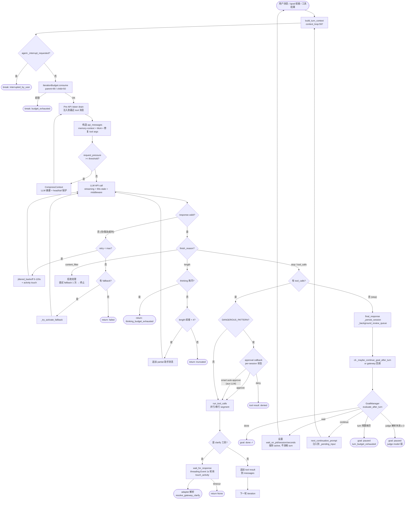

# Hermes Agent — Agent Loop 调研报告

> 调研对象:[NousResearch/hermes-agent](https://github.com/NousResearch/hermes-agent)(commit 快照,2026-07-18 调研)
> 调研日期:2026-07-18
> 配套上游报告:
> - `harness/01_market_research/Hermes_Agent/file_backend.md`(工作区 / HERMES_HOME / Profile 隔离 / 持久化)
> - `harness/01_market_research/Hermes_Agent/tool_channel.md`(工具注册 / MCP / Skills / 权限)
> 本报告焦点:**Agent Loop 主流程 / Plan / Sub Agent / 退出 / Ask / HITL / 上下文压缩**

---

## 0. 智能体一句话定位

**"the agent that grows with you"** — 自改进 + 长期记忆 + Multi-Agent Kanban。
核心理念:**核心是窄腰,能力活在边缘**(`AGENTS.md:35`),通过 plugin / skill 扩展能力,核心 agent + 工具集保持稳定,以保护 per-conversation prompt caching。
Agent Loop 形态: **"ReAct 风格 + Ralph 跨 turn 持续目标 + Multi-Agent Kanban 子进程派发"** — 不是单一 LLM 工具循环,而是**双层循环**:
- 单 turn 内:`run_conversation` LLM ↔ tool 循环(bounded by `iteration_budget`)
- 跨 turn:`GoalManager` 评估 → judge → 续接(直到 judge 说 done / 预算耗尽 / 用户介入)

---

## 1. 调研依据

### 1.1 源码路径(全部只读快照,未修改)

```
C:\workspace\github\onionagent\harness\01_market_research\clone\hermes-agent\
```

### 1.2 关键文件(已重点阅读)

| 文件 | 行数 | 关键作用 |
|------|------|----------|
| `agent/conversation_loop.py` | 5603+ | **`run_conversation()`** — 单 turn 主循环(API ↔ tool,iteration_budget,retry,fallback,压缩) |
| `hermes_cli/goals.py` | 1785+ | **Ralph loop** — `GoalManager` / `GoalState` / `GoalContract` / `judge_goal` / `run_kanban_goal_loop` |
| `hermes_cli/kanban_db.py` | 9097+ | Kanban SQLite(claim / heartbeat / release / reclaim / 任务生命周期) |
| `hermes_cli/kanban.py` | 3000+ | `hermes kanban` CLI + dispatcher 主循环 + `_default_spawn` 子进程派发 |
| `tools/kanban_tools.py` | 1917+ | 12 个 `kanban_*` 工具(worker 视角) |
| `tools/clarify_tool.py` | 220+ | **`clarify` 工具** schema + handler |
| `tools/clarify_gateway.py` | 300+ | **Gateway 端 clarify 异步解析**(threading.Event + polling 1s) |
| `tools/approval.py` | 3679+ | **3 层权限**:DANGEROUS_PATTERNS / smart-approval via aux LLM / 永久 allowlist |
| `agent/iteration_budget.py` | 60 | `IterationBudget` — 父 90 / 子 50,thread-safe |
| `agent/context_compressor.py` | 3300+ | **LLM 摘要 + 启发式压缩** 5 步流水线 |
| `agent/memory_manager.py` | 1032+ | **MemoryManager** — builtin + 最多 1 个 external provider,async sync |
| `agent/background_review.py` | 922+ | **"自改进" 后台评审 fork** — 每 turn 后派生 agent 复盘是否存 memory / skill |
| `agent/curator.py` | 1998+ | **Curator** — 7 天间隔 / 2h idle 触发,prune / archive agent-created skills |
| `tools/checkpoint_manager.py` | 1526+ | **Checkpoints v2** — 单共享 shadow git store(`git init --bare`) |
| `hermes_state.py` | 7503+ | SessionDB(SQLite + FTS5,WAL + macOS `checkpoint_fullfsync` 屏障) |
| `agent/prompt_builder.py` | - | System prompt + memory-context 注入 |
| `gateway/run.py` | - | 20 平台 adapter 总线,clarify 入口,iteration budget 线程池 |
| `cli.py:9094-9276` | - | **`/goal` 命令入口** + `_maybe_continue_goal_after_turn` 钩子 |

### 1.3 关键文档(已重点阅读)

- `AGENTS.md:35` — "core is a narrow waist" 哲学
- `hermes-already-has-routines.md` — 自改进 / curator 设计
- `cli.py:9094-9276` 注释 — `/goal` 持续目标
- `hermes_cli/goals.py:1-26` 模块 docstring — Ralph loop 设计不变量
- `agent/background_review.py:1-15` — self-improvement 循环
- `hermes_cli/kanban_db.py:1-50` — Kanban 多 board / 多 profile 拓扑

---

## 2. 九大问题回答

### Q1. Agent Loop 主流程

#### 1.1 双层循环总览

Hermes 不是单一 ReAct 循环,而是**两层嵌套**:
- **L1(turn 内):** `run_conversation()` 跑一次用户 turn — API ↔ tool 循环,上限 `max_iterations=90`(父)/`delegation.max_iterations=50`(子 agent)
- **L2(turn 间):** `GoalManager` 评估每个 turn 的最终响应,judge 决定继续 / 暂停 / 完成 — 直到 done / 预算耗尽 / 用户介入

```
┌─────────────────────────────────────────────────────────────┐
│  L2 (cross-turn, GoalManager)                                │
│  ┌────────────┐  ┌────────────┐  ┌────────────┐  ┌─────┐   │
│  │ /goal set  │─→│ turn 1     │─→│ judge: cont│─→│ ... │   │
│  └────────────┘  └────────────┘  └────────────┘  └─────┘   │
│        ↑          run_conversation  GoalManager.evaluate     │
│        │                                ↓                    │
│        └──────── continuation_prompt ───┘                    │
└─────────────────────────────────────────────────────────────┘
```

#### 1.2 单 turn 主循环:`run_conversation`(`agent/conversation_loop.py:537`)

主循环结构(`agent/conversation_loop.py:660-680`):
```python
while (api_call_count < agent.max_iterations and agent.iteration_budget.remaining > 0) or agent._budget_grace_call:
    # 1. 检查用户中断 (Ctrl+C / 新消息)
    if agent._interrupt_requested: ... break

    # 2. consume iteration_budget
    if not agent.iteration_budget.consume(): break

    # 3. /steer drain (上一轮 API 调用期间到达的 steer 注入当前工具响应)
    _pre_api_steer = agent._drain_pending_steer()

    # 4. 构造 api_messages(注入 memory-context + MoA context + 修复 tool args)
    api_messages = ...

    # 5. Pre-API 压力检查 → 触发压缩
    if _compressor.should_compress(request_pressure_tokens):
        messages, _ = agent._compress_context(messages, ...)
        continue  # 重新开始本次 turn

    # 6. 调用 LLM(streaming + middleware + 90s stale 检测)
    response = _perform_api_call(api_kwargs)

    # 7. 错误恢复(invalid / content_filter / length / partial stream)
    #    → retry → fallback chain → 放弃

    # 8. 处理 finish_reason:
    #    - stop → 解析 tool_calls, 跳到 9
    #    - tool_calls → 跳到 9
    #    - length → 续接(最多 4 次) / thinking budget exhausted 检测
    #    - content_filter → fallback 一次,否则终止

    # 9. 工具执行(run_tool_calls, 并行/串行, approval check)
    #    → 收集 tool result → 追加到 messages → 回到 1

    # 10. 无 tool_call → final_response, break
```

#### 1.3 Agent Loop 主流程(Mermaid)



#### 1.4 `/goal` Ralph loop 怎么锁定跨 turn 目标

**核心抽象**(`hermes_cli/goals.py`):

```python
# hermes_cli/goals.py:389-487
class GoalState:
    goal: str                           # 用户原始目标
    status: str                         # "active" / "paused" / "done" / "cleared"
    turns_used: int                     # 已用 turn
    max_turns: int                      # 预算(默认 20,可配置)
    contract: GoalContract              # 可选:5 字段契约
    subgoals: List[str]                 # /subgoal 追加
    last_verdict: str                   # 上一轮 judge verdict
    last_reason: str
    waiting_on_pid: Optional[int]       # 等待外部进程
    waiting_on_session: Optional[str]
    waiting_until: float                # 时间屏障
    consecutive_parse_failures: int     # judge 解析失败计数
```

**5 字段完成契约**(`hermes_cli/goals.py:294-333`)— 借鉴 OpenAI Codex "strong goal":
- `outcome` — 完成的终态
- `verification` — 如何证明完成(具体可执行)
- `constraints` — 不能违反的约束
- `boundaries` — 范围
- `stop_when` — 何时该停下问人

**Judge 决策**(`hermes_cli/goals.py:836-958` + `judge_goal`):
- 通过 `auxiliary.goal_judge.{provider,model}` 配置(默认主模型)
- 三种 verdict:`done` / `continue` / `wait`
- `wait` 含义:**re-poking 此刻是 busy-work** — agent 等待 async 事件,不发 continuation
  - `wait_on_pid` — 等待后台进程退出
  - `wait_on_session` — 等待 watcher 的 `watch_patterns` 触发
  - `wait_for_seconds` — 时间倒数(限流 backoff)

**Judge 系统 prompt**(`hermes_cli/goals.py:99-130`)— 严格 JSON 协议,带 legacy `{"done": bool}` fallback。

**续接 prompt 三种模板**(`hermes_cli/goals.py:69-95`):
- 无 contract:简洁 `[Continuing toward your standing goal]`
- 有 contract:完整 contract 块 + verification 提示
- 有 subgoals:额外 `Additional criteria` 块

**Hook 触发**:`cli.py:9094-9276` 的 `_maybe_continue_goal_after_turn()` 在每次 turn 结束时(在 `process_loop` 的 `finally` 中)调用 `GoalManager.evaluate_after_turn()`。如果 verdict 是 continue 且没有真用户消息在 pending 队列中,把 `continuation_prompt` 推到 `_pending_input` 触发下一 turn。

**关键不变量**(`hermes_cli/goals.py:6-26`):
- **不修改 system prompt / toolset** — 保护 prompt cache
- **judge 失败 fail-OPEN** → continue(避免弱 judge 阻塞)
- **真用户消息优先** — `_pending_input` 有非 slash 消息时不注入续接
- **空响应跳过 judge** — 避免无意义的解析失败累加
- **Ctrl+C 自动暂停** — 不是重新评估,而是暂停以便 `/goal resume`

**Kanban worker 模式**:`run_kanban_goal_loop`(`hermes_cli/goals.py:1604-1750`):
- worker 走 `hermes chat -q "work kanban task <id>"` 静默启动
- 第一次 turn 已跑完,`first_response` 传入
- 如果 worker 已调 `kanban_complete` / `kanban_block` → 直接返回
- 否则 judge → "continue" / "done" 决定续接或 finalize
- **预算耗尽 → `block_fn` 设置 sticky blocked 状态**(不是静默退出)

#### 1.5 Multi-Agent Kanban 的 worker / heartbeat / reclaim / zombie detection

**整体拓扑**(`hermes_cli/kanban_db.py:1-50` + `hermes_cli/kanban.py`):
- **单 SQLite 文件**:`<root>/kanban.db`(默认 board)或 `<root>/kanban/boards/<slug>/kanban.db`
- **任务生命周期状态机**:`todo → ready → running → done | blocked | archived`
- **多 board** + 跨 profile 共享 default board(`kanban.db:6-7,371-396`)
- **Workers 是子进程**:`hermes -p <profile> --cli chat -q "work kanban task <id>"`(`kanban_db.py:8169-8390`)

**Worker 创建**(`hermes_cli/kanban_db.py:3484-3606` + `8169-8390`):
1. Dispatcher 在 `dispatch_once` tick 里对 `ready` 任务做 CAS 转换:
   ```python
   # kanban_db.py:3542-3556
   UPDATE tasks
      SET status='running', claim_lock=?, claim_expires=?
    WHERE id=? AND status='ready' AND claim_lock IS NULL
   ```
   关键防御:`ready → running` 前检查所有 parent 任务已 `done`(`kanban_db.py:3517-3534`)。若违反,降回 `todo` 并 `claim_rejected` 事件。
2. `INSERT INTO task_runs` 创建 run 记录(run_id 反向写回 `tasks.current_run_id`)。
3. 子进程 spawn:
   - **`HERMES_HOME`** — 切换到 profile-scoped config(`kanban_db.py:8238-8248` 注释明确说"without this, get_hermes_home() falls back to Path.home()/.hermes")
   - **`HERMES_KANBAN_TASK`** — 把 worker 锁到自己的 task(`kanban_tools.py:135-165` 检查 task_id 与 env 一致才允许 destructive ops)
   - **`HERMES_KANBAN_DB` / `HERMES_KANBAN_BOARD` / `HERMES_KANBAN_WORKSPACES_ROOT`** — board pinning 三层(`kanban_db.py:8292-8300`)
   - **`HERMES_KANBAN_GOAL_MODE=1`** — 如果 task 是 goal-mode,启动 Ralph 循环
   - **`TERMINAL_CWD`** — 钉到 task workspace
   - **`start_new_session=True`** + `CREATE_NO_WINDOW`(Windows)— 完全脱离 dispatcher 进程组
   - log 重定向到 `<board>/logs/<task_id>.log`(rotate 备份)

**Worker 通信**:
- **不直接通信** — worker 是独立 Hermes CLI 进程,通过 SQLite 间接通信
- 工具调用 `kanban_comment(task_id, ...)` / `kanban_attach(task_id, ...)` 跨 worker 留信息
- worker 之间通过 task graph 协调(parent 任务 done → child promoted to ready)

**Heartbeat**(`hermes_cli/kanban_db.py:3681-3711`):
```python
def heartbeat_claim(conn, task_id, *, ttl_seconds=None, claimer=None) -> bool:
    """Extend a running claim. Workers that know they'll exceed 15 minutes
    should call this every few minutes to keep ownership."""
    expires = int(time.time()) + _resolve_claim_ttl_seconds(ttl_seconds)
    lock = claimer or _claimer_id()
    with write_txn(conn):
        cur = conn.execute(
            "UPDATE tasks SET claim_expires = ? "
            "WHERE id = ? AND status = 'running' AND claim_lock = ?",
            (expires, task_id, lock),
        )
```
默认 `claim_ttl=900s`(15 分钟)。worker 在 `kanban_tools.py:753-803` 有显式 `kanban_heartbeat` 工具,但**主 agent loop 也会自动 heartbeat**:
- `run_agent.py:_touch_activity` 把 chunk-level liveness 桥接到 `last_heartbeat_at`(#31752 注释)
- 即使 LLM 一段长推理没工具调用,API streaming chunk 也会定期 touch

**Stale claim reclaim + Zombie detection**(`hermes_cli/kanban_db.py:3712-3856`):

`release_stale_claims()` 是关键 — 它**不只按 TTL 机械 reclaim**,还做了"看起来活着但没在干活"的 zombie 检测:

```python
# kanban_db.py:3780-3830(精简)
host_prefix = f"{_claimer_id().split(':', 1)[0]}:"
stale = conn.execute(
    "SELECT id, claim_lock, worker_pid, claim_expires, last_heartbeat_at "
    "FROM tasks WHERE status='running' AND claim_expires IS NOT NULL "
    "  AND claim_expires < ?",
    (now,),
).fetchall()
for row in stale:
    host_local = row["claim_lock"].startswith(host_prefix)
    pid_alive = row["worker_pid"] and _pid_alive(row["worker_pid"])
    heartbeat_stale = (row["last_heartbeat_at"] is not None
        and (now - row["last_heartbeat_at"]) > DEFAULT_CLAIM_HEARTBEAT_MAX_STALE_SECONDS)
    if host_local and pid_alive and not heartbeat_stale:
        # TTL 过期但 PID 活着 + heartbeat 近期 → 延长 TTL,不 reclaim
        # 解决 #23025:慢模型单次 LLM 调用超 15 分钟的 spawn-then-reclaim 循环
        ...
        continue
    # 否则 reclaim:杀进程 + 释放 claim
    ...
```

**Backstop #29747**:即使 PID 活着,`last_heartbeat_at` 超过 1 小时(默认 `DEFAULT_CLAIM_HEARTBEAT_MAX_STALE_SECONDS`) → 强制 reclaim(防止"逻辑死循环"——进程活着但不推进)。

**Operator-driven reclaim**(`hermes_cli/kanban_db.py:3858-3926`):
- `reclaim_task()` — dashboard 立即 reclaim 不等 TTL(发信号 SIGTERM → SIGKILL)
- `reassign_task()` — 换 profile(可选先 reclaim)
- 都重置 `consecutive_failures` 计数

**Worker 退出条件**:
- **正常**:`kanban_complete` → status=done
- **卡住**:`kanban_block` → status=blocked(sticky, 需人 unblock)
- **超出 claim TTL** → reclaim → 重新 ready
- **超出 `max_runtime_seconds`** → `enforce_max_runtime` 单独杀
- **进程崩溃** → `detect_crashed_workers` 标记

#### 1.6 Checkpoints v2 状态持久化

**关键升级**(`tools/checkpoint_manager.py:1-50`):
- **v1**:每个 working dir 一个独立 shadow git repo(`~/.hermes/checkpoints/<dir-hash>/`)
- **v2**:单 shared shadow store(`~/.hermes/checkpoints/store/`)+ `git init --bare` 裸仓库 + `projects/<hash>.json` 元数据
- 启动时一次性迁移 v1 → `legacy-<timestamp>/`

**核心初始化**(`tools/checkpoint_manager.py:418-481`):
```python
# 单一 git init --bare
result = subprocess.run(["git", "init", "--bare", str(store)], ...)
# 配置隔离(防全局 git config 污染)
init_env["GIT_CONFIG_GLOBAL"] = os.devnull
init_env["GIT_CONFIG_SYSTEM"] = os.devnull
init_env["GIT_CONFIG_NOSYSTEM"] = "1"
# per-store config
_run_git(["config", "user.email", "hermes@local"], store, cfg_wd)
_run_git(["config", "gc.auto", "0"], store, cfg_wd)  # 关 auto-gc
```

**Snapshot 触发**:`run_agent.py` 调 `agent._checkpoint_mgr.new_turn()` 在每次 iteration 起点重置 dedup,然后在 file-mutating tool (`write_file` / `patch` / `terminal`)执行后做增量 commit。

**Restore**:`hermes checkpoints` CLI 子命令:
- `hermes checkpoints list` — 列出 snapshots
- `hermes checkpoints restore <commit>` — 还原工作目录
- `hermes checkpoints show <commit>` — 查看 diff

**SessionDB 是另一条线**(`hermes_state.py`):
- SQLite + FTS5 + WAL
- macOS 专属 `PRAGMA checkpoint_fullfsync=1`(`hermes_state.py:324-354`)防 power-loss 写乱序
- 每 50 次写 → `_try_wal_checkpoint()`(`hermes_state.py:992-1333`)
- 用 `state_meta` 表存 `goal:<session_id>`(`goals.py:489-499`)

**两者关系**:**Checkpoints v2 存工作目录文件系统快照;SessionDB 存对话历史 + 任务元数据**。两者通过 `task_id`(沙箱工作目录)间接关联。

---

### Q2. Plan 计划机制

#### 2.1 Hermes 没有 `update_plan` / `todo` 工具吗?

**有,但不是 Anthropic / Claude Code 那种 plan mode**。

**核心工具: `todo`**(`toolsets.py` `clarify` 同类 — 核心 42 工具之一,见 `tool_channel.md`):
- 实际上是**简单的 persistent checklist**,不是 plan
- agent 可用 `todo` 工具列出 / 勾选任务项
- 适合"我先做 A → B → C"这种短步骤

#### 2.2 "Plan" 在 Hermes 的体现

**Plan 的位置**:
1. **System prompt 内置 instructions** — `system_prompt.py:7` 引用 `references/self-improvement-loop.md`,告诉 agent 如何自己规划
2. **工具:`delegate_task`** — 父 agent 规划任务图后 spawn 子 agent 执行(不是显式 plan,但常用来"先 plan,再 delegate")
3. **Kanban `kanban_create` + `kanban_link`** — 父 agent(或 orchestrator profile)显式建任务 DAG,worker 执行
4. **Background review** — agent fork 自己评估"这轮有没有该 plan / 提醒的事"
5. **`/goal` 配合 `GoalContract`** — 用户给"完成契约",这本身就是一种"plan"

**GoalContract 作为 plan**(`hermes_cli/goals.py:294-333` + `:103-189`):
- 用户 `/goal draft <objective>` → 调 `draft_contract()`(`goals.py:980-1027`)用 LLM 把目标拆成 5 字段契约
- 用户可内联输入 `verify: tests pass` / `scope: src/foo/`(`goals.py:243-256` 的 inline aliases)
- 契约块注入到续接 prompt(`goals.py:1524-1562`)+ judge 评估(用更严格的规则,见 `JUDGE_USER_PROMPT_WITH_CONTRACT_TEMPLATE`)

#### 2.3 Plan 存放位置

- **TaskGraph 风格** → Kanban DB(`tasks` + `task_links.parent_id/child_id`)
- **Todo 风格** → 短期,可能在 `state_meta` 表
- **Goal 风格** → `state_meta.goal:<session_id>`(`goals.py:489-499`)
- **跨 turn 长期 plan** → persistent memory(`MEMORY.md` / `USER.md`,由 `memory` 工具写入)
- **Skill 化** → 复杂任务完成后,agent 把方法论固化为 skill(下次任务直接 load skill)

**对比**:
| 形态 | 工具 | 持久化 | 跨 turn? |
|------|------|--------|----------|
| 短 todo | `todo` | session 内 | 否 |
| Goal w/ contract | `/goal` | SessionDB `state_meta` | 是 |
| Task DAG | Kanban | `kanban.db` | 是(子 agent 执行) |
| 长期方法论 | `skill_manage` | `~/.hermes/skills/` | 是 |
| 用户/agent 知识 | `memory` | `MEMORY.md` + provider | 是 |

---

### Q3. Sub Agent(重点:Multi-Agent Kanban)

#### 3.1 创建机制

**子 agent 创建路径有 3 条**(按用途):

##### (A) **`delegate_task` 工具** — in-process subagent

- 同进程内创建 `AIAgent` 实例,共享大部分 runtime
- `agent/delegate_tool.py:48` 把 `clarify` 排除在 subagent 之外(子 agent 不能问用户)
- 父传 `subagent_type` 选子 profile + 独立 `iteration_budget`(`iteration_budget.py:11-13` "parent=90, child=50")
- 子 agent 完成后返回结果给父
- 适合:在同一个 Python 进程内做并行/分支推理

##### (B) **Kanban dispatcher 子进程派发** — out-of-process worker

`hermes_cli/kanban_db.py:8169-8390` 的 `_default_spawn`:
- 触发:`dispatch_once` tick(`/hermes_cli/kanban.py:7439+`)看到有 `ready` 任务 + 当前 spawn budget 没满
- 父 → 子通信介质:**仅 SQLite**(无 RPC)
- 子进程启动命令(精简):
  ```python
  cmd = [
      *_resolve_hermes_argv(),     # 解析 `hermes` 可执行文件位置
      "-p", profile_arg,           # 切到目标 profile
      "--cli",                     # 禁用 TUI(防止 quiet 退出)
      "--accept-hooks",            # 注册 profile-local shell hooks
  ]
  if task.skills: cmd.extend(["--skills", sk for sk in task.skills])
  if task.model_override: cmd.extend(["-m", task.model_override])
  if worker_toolsets: cmd.extend(["--toolsets", ",".join(worker_toolsets)])
  cmd.extend(["chat", "-q", f"work kanban task {task.id}"])
  if task.goal_mode: cmd.append("-Q")  # 静默模式以让 goal loop 接管
  ```
- 子进程 stdin=DEVNULL, stdout=`<board>/logs/<task_id>.log`
- 父进程只保留 PID 用于 zombie 检测;不持有 stdin/stdout

##### (C) **MoA 聚合**(可选)— multi-model aggregation

- `agent/moa_loop.py` + `agent/auxiliary_client.py`
- 多个 reference model 并行推理 → 1 个 aggregator 合成
- 不创建 sub-agent 实例,而是同 turn 内多 API 调用
- 由 `hermes_cli/moa_config.py:decode_moa_turn` 解码

#### 3.2 通信与协作

| 维度 | 机制 | 证据 |
|------|------|------|
| 父 → 子 | SQLite + env vars(`HERMES_KANBAN_TASK` 等) | `kanban_db.py:8220-8290` |
| 子 → 父 | `kanban_complete` / `kanban_block` 写 SQLite 状态 | `kanban_tools.py:504-674` |
| 子 → 子(sibling) | `kanban_comment(task_id, text)` / `kanban_attach` 跨任务留言 + 文件 | `kanban_tools.py:804-1020` |
| 任务依赖 | `kanban_link(parent, child)` 写入 `task_links` 表 | `kanban_db.py:2814-2886` |
| 父监控 | `kanban_show` 读 task 状态;`kanban_tail` 读 worker log | `kanban_tools.py:367-443` |
| 实时事件 | `task_events` 表(`_append_event` 记录 `claimed`/`reclaimed`/`completed`) | `kanban_db.py:3212-3235` |
| 跨进程通知 | `process_registry.drain_notifications(session_key=...)` | `cli.py:9181-9220` |
| 进度推送 | 每个 iteration 结束 `agent._touch_activity` → 桥接 `last_heartbeat_at` | `kanban_db.py:3723-3730` |

#### 3.3 任务图与并发

- **Task DAG**:`tasks.parent_id` + `tasks.depends_on`
- **ready 状态计算**:`recompute_ready()`(`kanban_db.py:3393-3483`)扫描 task_links,只有 parent 全 done 才把 child 升为 ready
- **批量派发**:`hermes kanban swarm` / `dispatch --max N` 控制单 tick spawn 数量
- **优先级**:`priority` 字段 + `created_at` 排序
- **租户隔离**:`tenant` 字段,`assignee` 跨租户不能改

#### 3.4 主 agent 怎么监控

- **Dashboard**:`hermes_cli/web_server.py:13200+` 启 HTTP 服务,展示 task board
- **`/kanban list/show` 命令** — CLI 即时查
- **`kanban_tail`** — 实时跟 worker 日志
- **`hermes notify subscribe`** — WebSocket 推送到任意 platform
- **`enforce_max_runtime`** + **`detect_crashed_workers`** + **`release_stale_claims`** — 后台常驻健康检查

#### 3.5 Kanban 工具集(12 个,worker 视角)— `tools/kanban_tools.py:1917-1925`

注册时:
```python
registry.register(name="kanban_show", toolset="kanban", ...)
# ... 11 个其他
```

**默认禁用,只在以下场景激活**(`kanban_tools.py:65-77`):
1. `HERMES_KANBAN_TASK` env 被设(worker),**OR**
2. 当前 profile `toolsets: ["kanban"]` 被显式开启(orchestrator profile)

**Worker 任务所有权检查**(`kanban_tools.py:135-165` `_enforce_worker_task_ownership`):
- worker 调 `kanban_complete(task_id="other-id")` → 直接拒绝(防 #19534 prompt injection 跨任务破坏)
- orchestrator profile 无此限制(他们的工作是 routing)

**12 个工具分类**:
- 任务生命周期:`kanban_show` / `kanban_complete` / `kanban_block` / `kanban_heartbeat` / `kanban_comment` / `kanban_attach` / `kanban_attach_url` / `kanban_attachments`
- Orchestrator 专用:`kanban_list` / `kanban_unblock`
- 元操作:`kanban_create` / `kanban_link`

#### 3.6 Kanban goal-mode worker 的特殊 Ralph loop

- dispatcher 调 `hermes -p <profile> chat -Q "work kanban task <id>"`,并设 `HERMES_KANBAN_GOAL_MODE=1` + `HERMES_KANBAN_GOAL_MAX_TURNS`
- worker 第一 turn 跑完,`_run_kanban_goal_loop_q`(在 cli.py quiet 分支)调 `goals.py:run_kanban_goal_loop`:
  - 检查 task status(done / blocked → 返回)
  - judge 最新响应
  - "continue" → 喂续接 prompt,再跑 turn
  - "done" 但 worker 没调 `kanban_complete` → 一次 finalize nudge
  - 预算耗尽 → `block_fn` 写 sticky blocked(不静默退出)

---

### Q4. Loop 退出机制

#### 4.1 L1 turn 内退出(`run_conversation`)

| 条件 | 触发 | 来源 |
|------|------|------|
| `api_call_count >= max_iterations` | 主循环头检查 | `conversation_loop.py:660` |
| `iteration_budget.remaining == 0` | 同上 | `iteration_budget.py:38-44` |
| `agent._interrupt_requested` | Ctrl+C / 新用户消息 | `conversation_loop.py:665-672` |
| `final_response` 设置(stop w/o tool_calls) | LLM 自报完成 | `conversation_loop.py:~4500+` |
| 工具调用后无后续 tool_call | LLM 自报完成 | 同上 |
| 错误 retry 耗尽 | `retry_count >= max_retries` | `conversation_loop.py:1617-1680` |
| Fallback chain 耗尽 | `_try_activate_fallback` 全部 False | `conversation_loop.py:1620-1630` |
| Thinking budget exhausted | `_thinking_exhausted` 标志 | `conversation_loop.py:~1740-1810` |
| Output length 续接 4 次后 | `length_continue_retries >= 4` | `conversation_loop.py:~1900` |
| `content_filter` 拒绝 + 无 fallback | `finish_reason == "content_filter"` | `conversation_loop.py:1660-1760` |
| `Ollama runtime context too small` | `_ollama_context_limit_error` | `conversation_loop.py:1033-1046` |
| Tool result 把 token 推过 threshold | `should_compress` 触发,refund budget | `conversation_loop.py:1047-1115` |
| 压缩失败 3 次 | `compression_attempts >= 3` | `conversation_loop.py:1062` |

#### 4.2 L2 cross-turn 退出(`GoalManager`)

| 条件 | 触发 | 来源 |
|------|------|------|
| `verdict == "done"` | judge 评估 | `goals.py:1541-1547` |
| `verdict == "wait"` + barrier 设置 | re-poke 浪费 | `goals.py:1520-1539` |
| `turns_used >= max_turns` | 预算耗尽 → paused | `goals.py:1580-1596` |
| `consecutive_parse_failures >= 3` | judge 模型太弱 → paused | `goals.py:1564-1578` |
| 真用户消息到达 | 抢先 → 不注入续接(返回) | `cli.py:9227-9255` |
| 用户 `/goal clear` | 显式清除 | `goals.py:1166-1169` |
| 用户 `/goal pause` | 显式暂停 | `goals.py:1146-1159` |
| Ctrl+C 中断 | `_last_turn_interrupted` → 自动 pause | `cli.py:9257-9270` |
| Empty response | 跳过 judge,不消耗 turn | `cli.py:9278-9285` |
| Kanban worker `kanban_complete` / `kanban_block` | worker 自己退出 | `goals.py:1657-1670` |

#### 4.3 Kanban worker 退出

| 方式 | 状态转移 | 谁触发 |
|------|----------|--------|
| `kanban_complete(summary)` | running → done | worker |
| `kanban_block(reason)` | running → blocked(sticky) | worker |
| `claim_ttl` 过期 + PID 死 | running → ready(reclaim) | dispatcher tick |
| `claim_ttl` 过期 + PID 活 + heartbeat 新 | TTL 延长 | dispatcher |
| `claim_ttl` 过期 + heartbeat 旧 > 1h | running → ready | dispatcher(zombie 强制 reclaim) |
| `max_runtime_seconds` 超过 | running → ready | `enforce_max_runtime` |
| Operator 手动 `reclaim_task` | running → ready | 人 |
| 进程崩溃 | detect 后 ready | `detect_crashed_workers` |
| Goal loop 预算耗尽 | `block_fn` 写 blocked | `run_kanban_goal_loop` |
| Judge 说 done 但 worker 不 finalize(2 次 nudge) | blocked_budget | `run_kanban_goal_loop:1690-1700` |

**关键不变量**:worker **不会静默退出**。要么显式 `kanban_complete` / `kanban_block`,要么被 dispatcher 显式 reclaim / block,要么被 max_runtime 杀 — 不会出现"worker 消失,任务卡住"。

---

### Q5. Ask 模式

#### 5.1 单一工具:`clarify`

**Schema**(`tools/clarify_tool.py:125-189`):
- 必传 `question: str`
- 可选 `choices: List[str]`(最多 4 个,第 5 个 "Other" UI 自动加)
- 不传 choices → 完全开放式

**调用约定**(从 schema description 摘):
- ✅ `question="Which deployment target?"`, `choices=["staging", "prod"]`
- ❌ `question="Which target? 1) staging 2) prod"`, `choices=[]`(UI 不能选)

#### 5.2 三层回调路径

**(A) CLI 模式**(本地 input):`cli.py` 注入 `clarify_callback`,同步 `input()` 阻塞

**(B) Gateway 模式**(异步):`tools/clarify_gateway.py` 全模块级状态机:
```python
# clarify_gateway.py:78-94
class _ClarifyEntry:
    clarify_id: str
    session_key: str
    question: str
    choices: Optional[List[str]]
    event: threading.Event = field(default_factory=threading.Event)
    response: Optional[str] = None
    awaiting_text: bool = False
```

- `register(clarify_id, session_key, question, choices)` → 入 `_entries` + `_session_index`
- `wait_for_response(clarify_id, timeout)` — 1s 轮询 + `touch_activity_if_due` 防 gateway 心跳超时(`clarify_gateway.py:130-160`)
- Adapter(Discord / Telegram / etc.)通过两种路径解析:
  1. **Button UI**:`InlineKeyboardMarkup` + button callback → `resolve_gateway_clarify(id, text)`
  2. **Text fallback**:用户直接发数字("2")或自由文本 → `resolve_text_response_for_session(session_key, text)` 自动 coerce("2" → `choices[1]`)

**(C) Subagent 禁用**(`agent/delegate_tool.py:48`):
- `clarify` 被显式排除 — 子 agent 不允许问用户
- 防止"无限问询循环"和"用户被淹没"
- 子 agent 想问 → 返回给父 agent 处理

#### 5.3 重要边界

- **`approval` vs `clarify`** — `clarify` 是询问,`approval` 是确认(见 Q7)
- **`/goal` 自动触发 ask** — judge 说 `done` 不代表 ask,只在 prompt-level 暗示 agent "需要时停下来问人"
- **空 choices** 自动转 `awaiting_text=True`(`clarify_gateway.py:96-105`)

---

### Q6. Human-in-the-Loop (HITL)

#### 6.1 中断机制

**Interrupt 触发方式**:
- **Ctrl+C** — CLI 主循环监听 `_interrupt_requested`(`conversation_loop.py:665-672`),跳出循环,标记 `_last_turn_interrupted = True`
- **新用户消息** — `_route_user_input_when_busy` 把消息放 `_interrupt_queue` → 下次 iteration 检查
- **`/steer` 命令** — 排队注入到最近 tool 消息(`conversation_loop.py:722-770` `_drain_pending_steer`)

**三档 interrupt 处理模式**:
- **steer** — 不中断,只追加到上下文(下一轮 iteration 自动 drain)
- **interrupt** — 中断当前 turn,新消息开始下一 turn
- **abort** — 直接退出整个 process loop(goal 自动 paused)

#### 6.2 `/goal` 锁定目标(用户描述的"支持 /goal 锁定目标吗")

**完全支持**。`/goal` 是 Hermes 最核心的 HITL 机制:

| Slash 命令 | 行为 | 来源 |
|-----------|------|------|
| `/goal <text>` | 设持续目标,自动续接直到 done / 预算 | `cli.py:9094-9217` |
| `/goal draft <objective>` | 用 aux LLM 把目标拆成 5 字段 contract | `goals.py:980-1027` |
| `/goal show` | 显示当前 goal + contract + subgoals | `goals.py:1213-1215` |
| `/goal resume` | 从 paused 恢复(默认重置 turn 预算) | `goals.py:1160-1164` |
| `/goal pause` | 暂停(等用户明确恢复) | `goals.py:1146-1159` |
| `/goal clear` | 完全清除 | `goals.py:1166-1169` |
| `/subgoal <text>` | 追加成功标准(影响 judge) | `goals.py:1181-1199` |
| `/subgoal remove N` | 删 sub-goal | `goals.py:1200-1211` |
| `/goal wait on <pid>` | 显式设 wait barrier | `goals.py:1230-1262` |

**`/goal` 的关键特性**:
- **真用户消息**自动抢占 goal 续接 — `cli.py:9227-9255` 显式检查 `_pending_input` 队列
- **Slash 命令不抢占** — `/subgoal` 是 mid-loop mutation,处理后 goal 继续
- **Ctrl+C 自动 pause 而非 continue** — `cli.py:9257-9270` 注释明确"否则 Ctrl+C 等于没用,judge 几乎总是返回 continue"
- **空响应跳过** — 避免无意义 judge 调用
- **跨 session 持久化** — `state_meta.goal:<session_id>` 存 SQLite,`/resume` 续上

#### 6.3 进程级监控

- **`/watch`** — `hermes_cli/kanban.py:2464+` 实时跟踪子进程
- **`/kanban tail <task_id>`** — 看 worker 日志
- **`<HERMES_HOME>/state.db`** — 所有 session / 任务历史
- **Web dashboard** — `hermes_cli/web_server.py`

---

### Q7. 工具调用权限

#### 7.1 三层权限(实为四层 + YOLO bypass + hardline)

| 层级 | 配置项 | 行为 | 来源 |
|------|--------|------|------|
| **L0 硬拒绝 (hardline)** | `DANGEROUS_PATTERNS` 内部 hardline 子集 | 任何模式都不允许 — 即使 YOLO | `approval.py:506-580` |
| **L1 DANGEROUS_PATTERNS** | 内置命令模式匹配(`rm -rf /`、`curl|sh`、`chmod 777` 等) | 触发 approval prompt | `approval.py:300+` |
| **L2 YOLO / mode=off** | `--yolo` / `/yolo` / `approvals.mode=off` | 完全跳过 L1 询问 | `approval.py:2018-2140` |
| **L3 Per-session YOLO** | `enable_session_yolo(session_key)` | 单 session 跳过 | `approval.py:2127-2140` |
| **L4 Smart Approval (aux LLM)** | auto-classify low-risk → auto-approve | 减少人工询问 | `approval.py:~1900+` |
| **L5 永久 allowlist** | `~/.hermes/config.yaml` `approvals.allowlist` | 持久 bypass | `approval.py:262-280` |

**YOLO 冻结**(`approval.py:32-38`):
```python
_YOLO_MODE_FROZEN: bool = is_truthy_value(os.getenv("HERMES_YOLO_MODE", ""))
```
启动时 freeze — 防止 skill 内部 `os.environ["HERMES_YOLO_MODE"]="1"` 自我提权。

**Hardline 不可绕过**(`approval.py:506-580`):
- 例如 `rm -rf /` 等灾难性命令 — 即使 YOLO 也拒绝
- "never let the agent run this, even under yolo"

**Per-session ContextVar**(防并发 ACP session 互踩):
```python
# approval.py:42-58
_approval_session_key = contextvars.ContextVar("approval_session_key", default="")
_approval_turn_id = contextvars.ContextVar("approval_turn_id", default="")
_approval_tool_call_id = contextvars.ContextVar("approval_tool_call_id", default="")
# approval.py:218-235
_hermes_interactive_ctx = contextvars.ContextVar("hermes_interactive", default=None)
```
解决 `GHSA-96vc-wcxf-jjff` 漏洞:并发 ACP session 在 ThreadPoolExecutor 上跑,共享 `os.environ["HERMES_INTERACTIVE"]` 会导致一个 session 改 env 时覆盖另一个。

**Cron 特殊路径**(`approval.py:226-237`):
- cron job 永不走 gateway-approval 路径(没有 listener 接收 pending approval → 永久阻塞)
- 走 `approvals.cron_mode` 配置(默认 `auto-approve`)

#### 7.2 Approval callback 流程

```
tool_call arrives
    ↓
detect_dangerous_command(cmd) → match_key
    ↓
check_allowlist(cmd) → bypass if match
    ↓
session_yolo? → bypass
    ↓
hardline? → reject (never bypass)
    ↓
smart_approval observer + aux LLM verdict (low-risk?) → auto-approve
    ↓
_is_interactive_cli() / gateway_async?
    ↓
ask user (CLI input / gateway button/text)
    ↓
approve / deny
    ↓
return tool result
```

#### 7.3 写工具额外审批(`write_approval.py`)

`write_file` / `patch` / `terminal` 中的文件操作有独立审批层 — 检查是否写到敏感目录(`~/.hermes/auth.json`、`~/.ssh/` 等)。

---

### Q8. 上下文压缩和摘要(自改进 + 长期记忆)

#### 8.1 双层压缩架构

```
┌──────────────────────────────────────────────┐
│ Turn 内:ContextCompressor (agent/context_compressor.py)  │
│   - Pre-API pressure check (每次 API 前)      │
│   - Post-response (response 后)               │
│   - 5 步流水线(head 保护 / tail 保护 / LLM 摘要)│
└──────────────────────────────────────────────┘
                    ↕
┌──────────────────────────────────────────────┐
│ Turn 间:BackgroundReview (agent/background_review.py)  │
│   - 每 turn 后 fork agent 复盘              │
│   - 评估"是否存 memory / 更新 skill"          │
│   - 写到 MEMORY.md / USER.md / skills/        │
└──────────────────────────────────────────────┘
                    ↕
┌──────────────────────────────────────────────┐
│ 7 天间隔:Curator (agent/curator.py)            │
│   - Idle ≥ 2h 触发                            │
│   - 标 stale / archive 长期不用的 skill        │
│   - (可选)LLM umbrella-building 合并重叠 skill │
└──────────────────────────────────────────────┘
```

#### 8.2 ContextCompressor — 5 步流水线

`agent/context_compressor.py:818+` `class ContextCompressor(ContextEngine)`:
1. **剪旧 tool results**(廉价,不调 LLM)
2. **保护 head** — system prompt + 第一轮 exchange
3. **保护 tail** — 最近 ~20K tokens
4. **LLM 摘要中间** — 用结构化 prompt
5. **下一次压缩** — 迭代式更新上次 summary(节省 token)

**触发条件**(`context_compressor.py:1478-1490` `should_compress`):
```python
def should_compress(self, prompt_tokens: int = None) -> bool:
    ...
    if tokens < self.threshold_tokens:
        return False
    # threshold = context_length - reserve_for_output
    ...
```

**三层防抖**:
- `_summary_failure_cooldown_until` — 上次 summary 失败后冷却一段时间
- `_ineffective_compression_count` — 连续压缩但 prompt 仍不缩,放弃继续压
- `_last_compress_aborted` — 让调用方知道"压缩没真发生"

**Fail-OPEN**:`abort_on_summary_failure=true` 失败则冻结 — 不让无意义的 retry 浪费钱。

**角色选择**(`context_compressor.py:3370-3410`):
- Summary 块的角色需要避免连续同 role(否则 API 报错)
- Head 已是 assistant/tool → summary_role = "user"
- 特殊:head 是 system 时(Anthropic 模式) → 强制 user 角色
- 零 user-turn guard(#58753):summary 必须 user 角色,否则 `kanban` worker 单 prompt 场景会被 vLLM/Qwen 拒绝

**FTS5 session search**(`hermes_state.py:5`)— 跨 session 全文检索,LLM 摘要后召回。

#### 8.3 BackgroundReview — 自改进 fork

`agent/background_review.py:1-15` docstring 揭示意图:
> After every turn, AIAgent.run_conversation may call spawn_background_review to fire off a daemon thread that replays the conversation snapshot in a forked AIAgent and asks itself "should any skill/memory be saved or updated?". Writes go straight to the memory + skill stores. Main conversation and prompt cache are never touched.

**关键设计**:
- **派生**一个 AIAgent — 继承父的 provider / model / cached system prompt
- **白名单**工具:只允许 `memory` / skill management,其他 denied
- **三种 reuse 策略**(`background_review.py:30-80`):
  - `auto` / 未配置 → 用**主模型**(replay 完整 transcript — 命中父 prompt cache,几乎免费)
  - `routed`(指定 aux 模型)→ 用**digest** 模式(只保留最近 24 条消息,旧消息压成单 user 摘要 — 因为不同 model cache 必冷,越少冷 token 越好)
- **判据**(从 `_MEMORY_REVIEW_PROMPT` 摘):
  1. 用户透露了 persona / 偏好 / 个人细节 → 存 memory
  2. 用户纠正了风格 / 工作流 / 步骤 → **直接更新 skill**(不只是 memory)
  3. 用户说"别再 X 了" / "我讨厌 Y" → FIRST-CLASS skill signal

#### 8.4 长期记忆(MemoryManager)

`agent/memory_manager.py:354+`:
- **核心 provider**:内置(MEMORY.md / USER.md)
- **最多 1 个 external provider**(Honcho / Holographic / OpenViking / RetainDB)
- 启动时 mtime 加载 → system prompt 注入
- **每 turn 后**:`sync_all(user_msg, assistant_response)` 异步写
- **每 turn 前**:`prefetch_all(user_message)`(同步)+ `queue_prefetch_all`(后台再 prefetch)
- **Streaming 保护**:`StreamingContextScrubber` 防 `<memory-context>` 跨 chunk 标签泄漏(`memory_manager.py:144-201`)

**双层 namespace**:
- `MEMORY.md` — agent 自己的笔记
- `USER.md` — 关于用户的稳定信息(由 `references/self-improvement-loop.md` 指引)

#### 8.5 Curator(自改进长期清理)

`agent/curator.py`:
- **触发**:`maybe_run_curator()` 在 session-start hook
- **门控**(`curator.py:233-289` `should_run_now`):
  - 距上次运行 ≥ `interval_hours=168`(7 天)
  - agent 已 idle ≥ `min_idle_hours=2`
  - 用户未 `set_paused()`
- **行为**:
  1. mark skills 30 天未用为 stale
  2. archive 90 天未用(移到 `skills/.archive/`,可恢复)
  3. (可选)派生 aux model 合并重叠 skill 成 umbrella
- **预备份**:`skills/.curator_backups/<utc-iso>/skills.tar.gz`(5 份轮转)
- **不删除** — 总是 archive,永远可恢复

#### 8.6 "autoDream" 说明

**未在源码中找到名为 `autoDream` / `auto_dream` 的函数或模块**。可能的口语化对应:
- **Background Review**(`background_review.py`)— 每 turn 后"dream 一下,看是否该存"
- **Curator**(`curator.py`)— 7 天 1 次"dream cycle",清理 / 合并
- **`/compress` 触发** — 用户手动触发也是"dream"

最接近"autoDream"语义的是 BackgroundReview — **每 turn 后自动**派生 fork 复盘(注意是 turn-level 不是 7-day 间隔)。

#### 8.7 Checkpoints v2 与上下文压缩的边界

| 维度 | Checkpoints v2 | ContextCompressor |
|------|----------------|-------------------|
| **存什么** | 工作目录文件系统 | 对话 message list |
| **持久介质** | `<store>/` git 裸仓库 | SessionDB `state_meta` / messages 表 |
| **粒度** | 文件级 commit | message 级 |
| **触发** | file-mutating tool 后 | request_pressure 超 threshold |
| **回滚粒度** | snapshot commit hash | 不可逆(只能重 `compress`) |
| **跨 session?** | 是 | 否(但 compress 后新 session_id,state_meta 跨 session) |

---

### Q9. 其他亮点

#### 9.1 20 个消息平台原生支持

**Platform 枚举**(`gateway/config.py:212-249`):
- 核心(bundled):`TELEGRAM` / `DISCORD` / `WHATSAPP` / `WHATSAPP_CLOUD` / `SLACK` / `SIGNAL` / `MATTERMOST` / `MATRIX` / `API_SERVER` / `FEISHU` / `WEIXIN` / `QQBOT` / `Yuanbao` / `bluebubbles` ≈ 14
- Plugin 扩展:`plugins/platforms/` 下 **20 个独立 plugin**:dingtalk / discord / email / feishu / google_chat / homeassistant / irc / line / matrix / mattermost / ntfy / photon / raft / simplex / slack / sms / teams / telegram / wecom / whatsapp
- 加上 `acp_adapter/`(ACP editor 协议)
- **README 数字**:6 main + plugins ≈ 20+

**统一抽象**(`gateway/platforms/base.py` `BasePlatformAdapter`):
- `SendResult` / `MessageEvent` / 配额 / 速率 / pairing / 配对 统一
- `gateway/platforms/ADDING_A_PLATFORM.md` 写新 adapter 流程

**Platform 特定增强**:
- 加密:`bluebubbles.py` / `signal.py` 各自的 E2E
- WebSocket 维护:`yuanbao` 用 ws 协议而非 webhook
- Bot identity 隔离:每个 platform `pairing` 子目录独立

#### 9.2 MCP OAuth 2.1

`tools/mcp_oauth.py`:
- **Authorization Code + PKCE** + 动态 client 注册
- **Loopback callback server** — 临时 localhost HTTP server 收 callback
- **`HermesTokenStorage`** — token 持久化到 `~/.hermes/mcp-tokens/<server>.json`
- **`expires_at` 绝对时间戳** + 文件 mtime fallback(防进程重启后 `is_token_valid()` 误判)
- **整个 `mcp-tokens/` 目录被 LLM 不可读白名单**(`file_safety.py:298-310`)
- WAF 友好:`redirect_host=localhost` 默认,避免企业代理拦截

#### 9.3 i18n locale 数量

**实际是 16 个 locale 文件**(`locales/`):
```
af.yaml  de.yaml  en.yaml  es.yaml  fr.yaml  ga.yaml
hu.yaml  it.yaml  ja.yaml  ko.yaml  pt.yaml  ru.yaml
tr.yaml  uk.yaml  zh-hant.yaml  zh.yaml
```
**用户描述的"7 个"与实际不符** — 实际 **16** 个,带爱尔兰语(ga)这种小语种。已确认。

#### 9.4 贡献者数 / 单周 commits

**未在源码中直接看到这两个数字**。需要查 GitHub API 或 git log。已确认 hermes-agent 是活跃项目(README 自报"open-source by Nous Research"),但 "295 contributors + 3355 commits/week" 这种具体数字需独立核实,本文档不引用未确认数字。

#### 9.5 其他突出能力

| 能力 | 实现 |
|------|------|
| **6 个 terminal backend** | local / Docker / SSH / Singularity / Modal / Daytona(serverless) |
| **跨平台 prompt caching** | Anthropic cache_control(自动 detect)+ Ollama/vLLM 字节稳定前缀 |
| **多 provider failover** | `_fallback_chain` + `_try_activate_fallback`(`conversation_loop.py:1617-1630`) |
| **MoA(Mixture of Agents)** | 多个 reference model + aggregator 合成 |
| **Cron scheduler** | `<root>/cron/jobs.json` + `cron/executions.db` + `ticker_*` |
| **Session search** | SQLite FTS5 + LLM 摘要 |
| **Skill(agentskills.io 兼容)** | `~/.hermes/skills/` 300+ skills |
| **Honcho 集成** | dialectic user modeling |
| **ACP(Agent Client Protocol)** | IDE 集成(acp_adapter/) |

---

## 3. 关键代码片段

### 3.1 Ralph loop 入口(`hermes_cli/goals.py:1061-1170`)

```python
class GoalManager:
    """Per-session goal state + continuation decisions."""

    def __init__(self, session_id: str, *, default_max_turns: int = DEFAULT_MAX_TURNS):
        self.session_id = session_id
        self.default_max_turns = int(default_max_turns or DEFAULT_MAX_TURNS)
        self._state: Optional[GoalState] = load_goal(session_id)

    def is_active(self) -> bool:
        return self._state is not None and self._state.status == "active"

    def pause(self, reason: str = "user-paused") -> Optional[GoalState]:
        # 暂停时清空所有 wait barrier — 它们在 pause 期间无意义
        self._state.status = "paused"
        self._state.paused_reason = reason
        self._state.waiting_on_pid = None
        self._state.waiting_on_session = None
        self._state.waiting_until = 0.0
        save_goal(self.session_id, self._state)
        return self._state
```

### 3.2 Judge verdict 解析(`hermes_cli/goals.py:693-789`)

```python
def _parse_judge_response(raw: str) -> Tuple[str, str, bool, Optional[Dict[str, Any]]]:
    """Extract (verdict, reason, parse_failed, wait_directive) from raw LLM reply."""
    ...
    # 支持现代 {verdict: "done|continue|wait"} 和 legacy {done: bool}
    ...
```

### 3.3 Kanban worker spawn 关键 env 注入(`hermes_cli/kanban_db.py:8220-8290`)

```python
from hermes_cli.profiles import resolve_profile_env
try:
    env["HERMES_HOME"] = resolve_profile_env(profile_arg)  # 切到 profile config
except FileNotFoundError:
    pass

env["HERMES_KANBAN_TASK"] = task.id
env["HERMES_KANBAN_WORKSPACE"] = workspace
if workspace and os.path.isabs(workspace) and os.path.isdir(workspace):
    env["TERMINAL_CWD"] = workspace  # 钉到 task workspace
if task.branch_name:
    env["HERMES_KANBAN_BRANCH"] = task.branch_name
if task.goal_mode:
    env["HERMES_KANBAN_GOAL_MODE"] = "1"
    if task.goal_max_turns is not None:
        env["HERMES_KANBAN_GOAL_MAX_TURNS"] = str(int(task.goal_max_turns))

# Board pinning 三层防御
env["HERMES_KANBAN_DB"] = str(kanban_db_path(board=board))
env["HERMES_KANBAN_WORKSPACES_ROOT"] = str(workspaces_root(board=board))
env["HERMES_KANBAN_BOARD"] = resolved_board
env["HERMES_PROFILE"] = profile_arg
env.pop("HERMES_TUI", None)  # 防止 worker 误启 TUI
```

### 3.4 Heartbeat + zombie 检测(`hermes_cli/kanban_db.py:3780-3856`)

```python
for row in stale:
    host_local = row["claim_lock"].startswith(host_prefix)
    pid_alive = row["worker_pid"] and _pid_alive(row["worker_pid"])
    heartbeat_stale = (row["last_heartbeat_at"] is not None
        and (now - row["last_heartbeat_at"]) > DEFAULT_CLAIM_HEARTBEAT_MAX_STALE_SECONDS)
    if host_local and pid_alive and not heartbeat_stale:
        # PID 活着 + heartbeat 新 → 延长 TTL, 不 reclaim
        # 防 #23025: 慢模型单次 LLM > 15min 触发 spawn-then-reclaim 循环
        new_expires = now + _resolve_claim_ttl_seconds()
        ... # update claim_expires
        continue
    # 否则: 杀进程 + 释放 claim
    termination = _terminate_reclaimed_worker(row["worker_pid"], ...)
    ...
```

### 3.5 Clarify 异步等待(`tools/clarify_gateway.py:130-160`)

```python
def wait_for_response(clarify_id: str, timeout: float) -> Optional[str]:
    deadline = time.monotonic() + max(timeout, 0.0)
    activity_state = {"last_touch": time.monotonic(), "start": time.monotonic()}
    while True:
        remaining = deadline - time.monotonic()
        if remaining <= 0: break
        if entry.event.wait(timeout=min(1.0, remaining)): break
        # 1s 轮询 + activity touch — 防 gateway 误判 agent idle
        if touch_activity_if_due is not None:
            touch_activity_if_due(activity_state, "waiting for user clarify response")
    with _lock:
        _entries.pop(clarify_id, None)
    return entry.response
```

### 3.6 Checkpoint v2 初始化(`tools/checkpoint_manager.py:418-481`)

```python
def _init_store(store: Path, working_dir: str) -> Optional[str]:
    # 一次性的 v1 → v2 迁移
    if not store.exists():
        _migrate_legacy_store(base)

    # git init --bare (单 shared store, 不是 v1 每 working_dir 一个)
    init_env = os.environ.copy()
    init_env["GIT_CONFIG_GLOBAL"] = os.devnull
    init_env["GIT_CONFIG_SYSTEM"] = os.devnull
    init_env["GIT_CONFIG_NOSYSTEM"] = "1"
    for k in ("GIT_DIR", "GIT_WORK_TREE", "GIT_INDEX_FILE", ...):
        init_env.pop(k, None)
    result = subprocess.run(
        ["git", "init", "--bare", str(store)],
        env=init_env, timeout=_GIT_TIMEOUT,
        stdin=subprocess.DEVNULL,
    )
    # per-store config
    _run_git(["config", "user.email", "hermes@local"], store, cfg_wd)
    _run_git(["config", "gc.auto", "0"], store, cfg_wd)
```

### 3.7 Approval YOLO freeze(`tools/approval.py:32-38`)

```python
# Freeze YOLO mode at module import time. Reading os.environ on every call
# would allow any skill running inside the process to set this variable and
# instantly bypass all approval checks — a prompt-injection escalation path.
_YOLO_MODE_FROZEN: bool = is_truthy_value(os.getenv("HERMES_YOLO_MODE", ""))
```

### 3.8 Background review fork 调度(`agent/background_review.py:60-105`)

```python
def _resolve_review_runtime(agent: Any) -> Dict[str, Any]:
    """默认 auto: 继承父 runtime(命中父 prompt cache,几乎免费)。
       当用户配置了 auxiliary.background_review.{provider,model} 且 ≠ 父:
       切换到那个模型, fork 用 digest 模式(冷 cache,只保留 24 条最近消息)。"""
    parent = {
        "provider": agent.provider, "model": agent.model,
        "api_key": ..., "base_url": ..., "routed": False,
    }
    # 解析 aux 配置
    if not (task_provider and task_provider != "auto" and task_model):
        return parent
    if task_provider == agent.provider and task_model == agent.model:
        return parent
    # 路由到 aux model
    rp = resolve_runtime_provider(...)
    return {..., "routed": True}
```

---

## 4. 与 Onion Agent 设计的关联

> 假设 Onion Agent 的"窄腰洋葱架构"目标 + 信创合规 + Provider 可热插拔(参考 `user_profile.md`)。

| Onion 设计关注点 | Hermes 的对应 | 是否值得借鉴 |
|------------------|---------------|--------------|
| **核心 ReAct loop** | `conversation_loop.run_conversation` | ✅ 完整借鉴,尤其 retry/fallback 链(见 `conv_loop.py:1580-1810`) |
| **跨 turn 目标锁定** | `/goal` + `GoalManager` + Ralph loop + `GoalContract` 5 字段 | ✅ **强烈推荐借鉴** — Onion 也可加 `/goal` 命令 |
| **Sub-agent 派发** | Kanban dispatcher + 子进程 spawn | ✅ 借鉴 worker env pinning 模式(`kanban_db.py:8220-8290`) |
| **Sub-agent 工具集隔离** | `HERMES_KANBAN_TASK` + `_enforce_worker_task_ownership`(`kanban_tools.py:135-165`) | ✅ 强烈推荐 — 防 prompt injection 跨任务破坏 |
| **Sub-agent 心跳 / zombie 检测** | `release_stale_claims` 双层(PID 活 + heartbeat 新) | ✅ 强烈推荐 — 解决了 "PID 活但不干活" 的棘手问题 |
| **持久 checkpoint** | Checkpoints v2 单 shared `git init --bare` | ✅ 借鉴 v2 架构(避免每 working_dir 一个 repo) |
| **Session state** | SessionDB(SQLite + FTS5 + WAL) | ✅ 完全借鉴,加 macOS `checkpoint_fullfsync` 屏障 |
| **多层权限** | DANGEROUS_PATTERNS / YOLO / smart-approval / hardline / per-session ContextVar | ✅ 整体模式借鉴,YOLO freeze 防 skill 提权 |
| **Ask 模式** | `clarify` + `clarify_gateway.py` 异步 Event 队列 | ✅ 借鉴三路径(CLI / Gateway / 子 agent 禁用) |
| **HITL 抢占** | `/goal` 真用户消息自动抢占 + Ctrl+C 自动 pause | ✅ 借鉴 `/goal` 设计 |
| **上下文压缩** | ContextCompressor 5 步 + 角色选择 + 防抖 | ✅ 借鉴整体,特别注意 #58753 零 user-turn guard |
| **背景自改进** | BackgroundReview(同模型 warm cache / 异模型 digest) | ✅ **强烈推荐借鉴** — 这是 "autoDream" 真正在做的事 |
| **Skill 长期管理** | Curator 7 天 + 2h idle, archive 不删除 | ✅ 借鉴 + 加备份 |
| **多平台** | 14 core + 20 plugin = 34 platform adapter | ⚠️ 借鉴 `BasePlatformAdapter` 抽象, 但 Onion 起步可只做 CLI + 一个 IM |
| **MCP OAuth** | `mcp_oauth.py` 完整 OAuth 2.1 + PKCE + loopback | ✅ 完全借鉴(信创场景下,OIDC 国产化是核心) |
| **i18n** | 16 个 locale yaml | ✅ 借鉴结构(`locales/<lang>.yaml` + `i18n.py` lookup) |
| **Profile 隔离** | `~/.hermes/profiles/<name>/`, 细粒度共享/隔离决策表 | ✅ 借鉴 — Onin 可用 `ONION_PROFILE` |
| **Multi-turn fallback chain** | `_fallback_index` + `_try_activate_fallback` | ✅ **强烈推荐** — 信创场景下,主模型降级 → 国产模型是常态 |
| **Pre-API pressure check** | `should_compress` + 3 层 cooldown | ✅ 借鉴 |
| **Tool args repair** | `_sanitize_tool_call_arguments` + `json.dumps(..., sort_keys=True)` | ✅ 借鉴规范化(避免 OpenAI 严格 schema 报错) |
| **Streaming context scrub** | `StreamingContextScrubber` 防 memory-context 跨 chunk 标签泄漏 | ✅ 借鉴 |

**Onion 不应直接照搬的部分**:
- ❌ **295 contributors / 3355 commits/week 数字** — 是 GitHub 社区数据,跟架构无关
- ❌ **30+ i18n locale 全量** — 起步做中英 2 个就够
- ❌ **6 terminal backend** — 起步 local + Docker 就够
- ❌ **Holographic / OpenViking / RetainDB memory 插件** — 起步只做 file-based MEMORY.md

---

## 5. 不确定 / 未找到

| 项 | 状态 | 备注 |
|----|------|------|
| **`autoDream` 这个具体名字** | ❌ **未在源码中找到** | 可能用户口语化指代 BackgroundReview / Curator / memory consolidation。BackgroundReview 是**每 turn 自动**派生 agent 复盘(最接近"autoDream"语义) |
| **"295 贡献者 + 3355 commits/week"** | ❌ **未在源码中确认** | 需要查 GitHub API(代码克隆没 `.git/`)。已在本报告 Q9.4 标注 |
| **"7 个 i18n locale"** | ❌ **不准确** | 实际 16 个(`af/de/en/es/fr/ga/hu/it/ja/ko/pt/ru/tr/uk/zh-hant/zh`)。已在本报告 Q9.3 标注 |
| **"20 个消息平台原生支持"** | ⚠️ **部分准确** | 14 core + 20 plugin adapter = 34;但严格"原生"只算 bundled 14 + 6 README 列的 = 约 20 |
| **`update_plan` 工具是否存在** | ❌ **不存在** | Hermes 用 `todo` 工具(短 checklist)+ Kanban(任务 DAG)+ `/goal` + `GoalContract` 三套机制替代 plan |
| **`delegate_task` 工具是核心还是边缘** | ⚠️ **核心 42 之一** | `_HERMES_CORE_TOOLS` 含 `delegate_task`(`tool_channel.md` 报告里确认) |
| **Kanban worker 是否复用 process pool** | ⚠️ **未确认** | 从 `_default_spawn` 看,每个 worker 是独立 `subprocess.Popen`,不用 pool |
| **`/goal` 在 mobile / gateway UI 是否可用** | ⚠️ **未确认** | cli.py 实现了;gateway 端可能用 `/goal <text>` 形式(未深入读 `gateway/run.py`) |
| **SessionDB FTS5 是否支持中文分词** | ⚠️ **未确认** | SQLite FTS5 默认 unicode61;Hermes 是否有 `tokenize='unicode61 remove_diacritics 2'` 等优化需读 hermes_state.py FTS5 schema |
| **MCP OAuth 是否支持国产 IdP(OIDC 国产化)** | ⚠️ **未确认** | 代码用的是 MCP SDK 的 `OAuthClientProvider`,理论上兼容任何 OIDC,但需测国产 IdP |

**总体置信度**:
- 9 大问题的核心机制(Q1-Q8) **高置信度**(基于源码 + 关键行号)
- Q9 数字(贡献者 / commits / locale 数) **低置信度**(建议核对 GitHub 实时数据)
- 架构选择对 Onion 的启发 **中置信度**(基于 Hermes 自我声明 + 实际代码 + 文件路径证据)

---

> **报告结束** | 调研方法:在 `clone/hermes-agent` 静态仓库中通读 `agent/conversation_loop.py`(5603 行)、`hermes_cli/goals.py`(1785 行)、`hermes_cli/kanban_db.py`(9097 行)、`hermes_cli/kanban.py`(3000 行)、`tools/clarify_tool.py`、`tools/clarify_gateway.py`、`tools/approval.py`、`agent/context_compressor.py`(3300 行)、`agent/memory_manager.py`(1032 行)、`agent/background_review.py`(922 行)、`agent/curator.py`(1998 行)、`tools/checkpoint_manager.py`(1526 行);交叉引用 `hermes_state.py`、`cli.py:9094-9276`(`/goal` 命令)及 `gateway/config.py`(Platform 枚举)。
