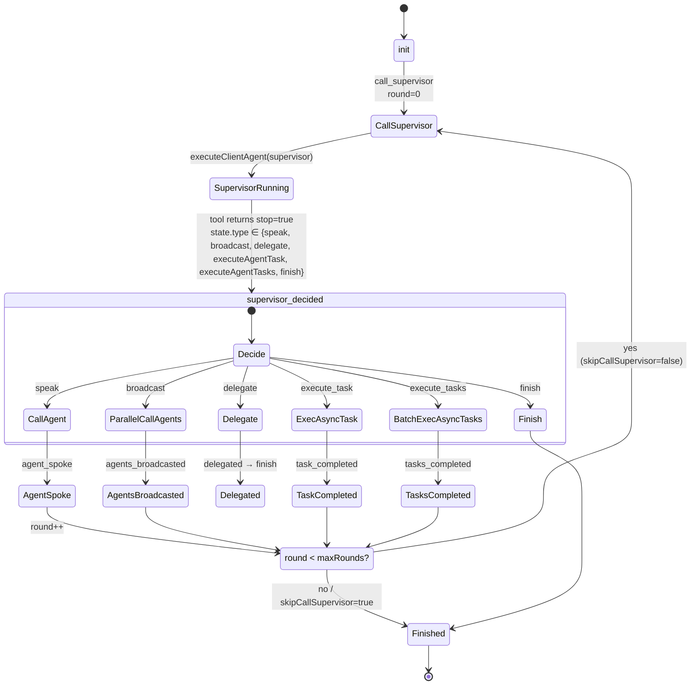
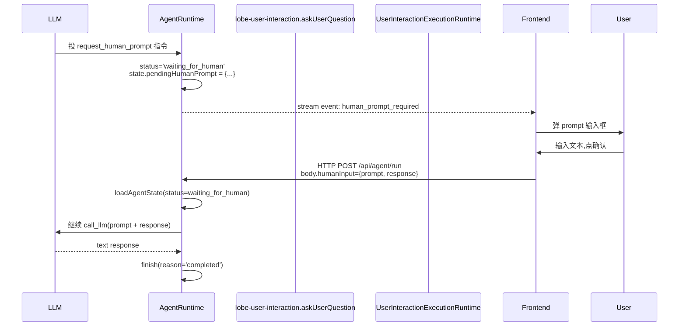
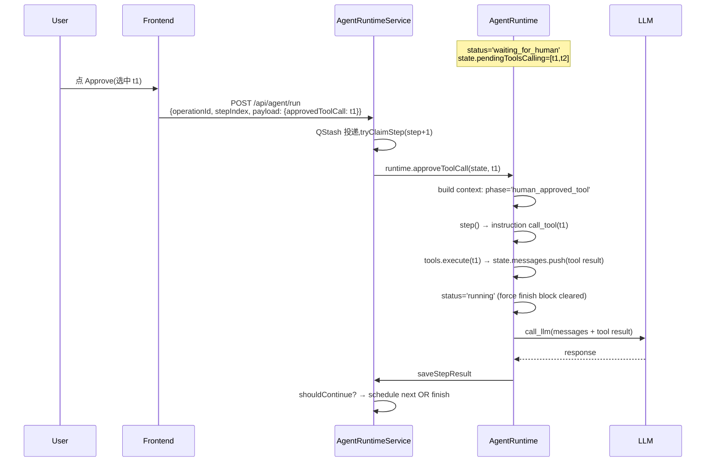
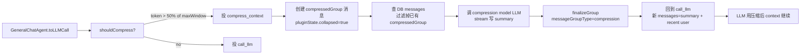

# Lobe Chat — Agent Loop 调研报告

> 调研对象: [lobehub/lobe-chat](https://github.com/lobehub/lobe-chat)(80k+ ⭐, MIT 协议,2026-07 snapshot)
> 调研日期:2026-07-18
> 调研者:onion-agent 调研流水线
> 配套报告:[file_backend.md](./file_backend.md) / [tool_channel.md](./tool_channel.md)

---

## 0. 智能体一句话定位

Lobe Chat 自称"首席 Agent 运营官",把多个 Agent 串成"轮班"——每个 Agent(普通 chat、sub-agent、group supervisor、异构 Claude Code/Codex CLI) 都跑同一个 `AgentRuntime.step()` 引擎,产出"agent instruction"再交给 `InstructionExecutor` 集群(call_llm / call_tool / compress_context / request_human_approve / exec_sub_agent / finish / ...)。**多 Agent 编排不是额外的一层 runtime**,而是包了一个 `GroupOrchestrationRuntime`(supervisor state machine + executor 集合) 在外层 `while(result) { step(state, result) }` 跑;**服务器端更狠**——`AgentRuntimeService.executeStep()` 一次只跑一个 microstep, 通过 QStash HTTP 队列把"下一步"再投递回来,支持断点恢复 / human-approval 暂停 / 异步工具回调。**三端 Web / Desktop(Electron)/ CLI(`lh`)共用同一份 server runtime**——CLI 只发一个 HTTP 命令 + WebSocket 拉 stream,Electron 多一层"客户端 sub-agent 调度器",Web 端最薄。

---

## 1. 调研依据

### 1.1 源码路径

| 资源 | 路径 |
|---|---|
| 主仓库(只读) | `C:\workspace\github\onionagent\harness\01_market_research\clone\lobe-chat` |
| 仓库类型 | pnpm workspace monorepo,**3 个 app** (`web` / `desktop` / `cli`) + **80+ 个 package** |
| 关键 runtime | `packages/agent-runtime/`(纯 package 化的 agent engine,与 server / client 解耦) |
| 关键 server | `apps/server/src/{modules,server,services,agent-hono}/AgentRuntime*` |
| 关键 client | `src/store/chat/{slices/agentRun,agents}/` |

### 1.2 关键文件

#### Runtime 内核(`packages/agent-runtime/`)

| 文件 | 作用 | 关键行 |
|---|---|---|
| `src/core/runtime.ts` | `AgentRuntime` 类(主引擎,执行 instruction,跟踪 state) | `step()` 入口 L82;`maxSteps`/`forceFinish` L93-103;executors 注册表 L36-52;`approveToolCall()` L267;`interrupt()` L297;`resume()` L329 |
| `src/core/InterventionChecker.ts` | 静态类,决定工具调用是否需要人工 / 安全黑名单 | `shouldIntervene()` L76;安全黑名单优先 L71-74 |
| `src/core/UsageCounter.ts` | token / cost 累加器 | - |
| `src/agents/GeneralChatAgent.ts` | 默认 chat agent(单 agent) | `runner()` 状态机:init / user_input / llm_result / tool_result / tools_batch_result L455-720;`checkInterventionNeeded()` 工具分流 L131-260;`toLLMCall()` 压缩分支 L377-409 |
| `src/agents/GraphAgent.ts` | 图编排 agent(init→node_in→node_out→transit→fin) | 5 个 reducer L211-280;`maxInstructionCount=256/1024` L20-21 |
| `src/executors/callLlm.ts` | LLM 调用 executor(流式 chunk) | 1.1 万行 |
| `src/executors/callLlmFinalizer.ts` | LLM 完成后的兜底(usage + cost 累加) | - |
| `src/executors/tool.ts` | 单个工具执行 executor(2.5 万行,带 retry + 限流 + work 持久化) | - |
| `src/executors/compressContext.ts` | 上下文压缩 executor(调 LLM 总结) | 创建 `compressedGroup` 消息 + `driftMultiplier=1.25` |
| `src/executors/subAgent.ts` | sub-agent dispatch(`execSubAgent` + `execSubAgents`,并发 15) | 嵌套检测 `isSubAgent` L42-50 |
| `src/executors/humanApprove.ts` | 人工审批 executor(写 pending tool message + stream event) | 1 次 step,status 转 `waiting_for_human` |
| `src/executors/finish.ts` | 收尾 executor(发 `step_complete` + 清 running mark) | - |
| `src/groupOrchestration/GroupOrchestrationRuntime.ts` | **多 Agent 编排** while 循环 | `run()` while(result) { step() } L122-130;`maxSteps` L48 |
| `src/groupOrchestration/GroupOrchestrationSupervisor.ts` | **supervisor 状态机** | `init → call_supervisor / call_agent / parallel_call_agents / delegate / exec_async_task / batch_exec_async_tasks / finish` |
| `src/transport/host.ts` | 10 个 transport 抽象 IO 端口(`messages/stream/subAgent/compression/llm/context/blob/tools/operationStore/lifecycle`) | - |
| `src/utils/tokenCounter.ts` | 压缩阈值:默认 128k × 0.5 = 64k 触发 | - |
| `src/utils/status.ts` | 状态机:`isParked`(`waiting_for_human` / `waiting_for_async_tool`) + `isBlocked`(+ `interrupted`) | - |
| `src/types/state.ts` | `AgentState.status` ∈ `'idle' \| 'running' \| 'waiting_for_human' \| 'waiting_for_async_tool' \| 'done' \| 'error' \| 'interrupted'` | L125-131 |

#### Server 端编排(`apps/server/src/`)

| 文件 | 作用 | 关键行 |
|---|---|---|
| `src/agent-hono/handlers/runStep.ts` | QStash HTTP webhook 入口,调 `aiAgentService.executeStep()` | 每次请求 1 step,返回 `{nextStepScheduled}` |
| `src/services/agentRuntime/AgentRuntimeService.ts` | `executeStep()` 主方法,跑 1 step,save state,schedule next | `runtime.step()` L1108;`shouldContinueExecution()` L2756-2780;`determineCompletionReason()` L2825-2837;`calculateStepDelay()` L2786 |
| `src/services/aiAgent/index.ts` | `AiAgentService` 把 `AgentRuntimeService` 包成可注入的 delegate | `createGraphAwareAgentFactory()` L177(可切到 GraphAgent);`execSubAgent / execVirtualSubAgent / execGroupMember` L4121-4182 |
| `src/modules/AgentRuntime/RuntimeExecutors.ts` | 11 个 executor 工厂(server 版,包 transport 适配) | L21-41 |
| `src/modules/AgentRuntime/buildHost.ts` | 把 server ctx → AgentRuntimeHost(注入 10 transport 适配器) | - |
| `src/modules/AgentRuntime/AgentStateManager.ts` | state 持久化(Redis + DB) | - |
| `src/modules/AgentRuntime/GatewayStreamNotifier.ts` | QStash / WebSocket 通知层 | - |
| `src/modules/AgentRuntime/StreamEventManager.ts` | SSE event 流管理 | - |
| `src/modules/AgentRuntime/InMemoryAgentStateManager.ts` | 内存版 state(用于 in-process) | - |

#### Client / Web / Desktop(`src/store/chat/`)

| 文件 | 作用 | 关键行 |
|---|---|---|
| `slices/agentRun/actions/transports/client/streamingExecutor.ts` | **客户端 while 循环 driver** | `while (state.status !== 'done' && state.status !== 'error')` L685;`executeClientAgent()` L462-... |
| `slices/agentRun/actions/entries/conversationControl.ts` | 顶层入口(create / continue / approval 提交) | 调 `executeClientAgent()` L486/670/736/862/1400 |
| `slices/agentRun/actions/dispatch/nonHeteroSubAgentDispatcher.ts` | 异构 Agent 客户端分发 | L91 调 `executeClientAgent()` |
| `agents/GroupOrchestration/createGroupOrchestrationExecutors.ts` | **客户端 group orchestration 11 个 executor** | call_supervisor / call_agent / parallel_call_agents / delegate / exec_async_task / batch_exec_async_tasks / exec_client_async_task / exec_client_async_tasks |
| `agents/createAgentExecutors.ts` | 客户端 11 个 executor 工厂(包 ClientToolTransport 等) | - |
| `transports/ClientToolTransport.ts` | 客户端 tool 传输层(派发到 `internal_invokeDifferentTypePlugin`) | - |
| `transports/ClientSubAgentTransport.ts` | 客户端 sub-agent 传输层 | - |
| `transports/ClientLLMTransport.ts` / `ClientMessageTransport.ts` / `ClientCompressionTransport.ts` / `ClientContextBuilder.ts` / `ClientRuntimeStreamSink.ts` | 10 transport 的客户端实现 | - |
| `transports/buildClientRuntimeHost.ts` | 客户端 host 装配 | - |
| `agents/StreamingHandler.ts` | SSE chunk handler(text / tool_calls / reasoning 累积) | 1.7 万行 |
| `services/agentRuntime/client.ts` | Web 端 SSE 客户端 | `createStreamConnection()` L21 |

#### CLI(`apps/cli/src/`)

| 文件 | 作用 | 关键行 |
|---|---|---|
| `commands/agent.ts` | `lh agent` 命令(run / status / list ...) | L388-414 connect WS/SSE stream |
| `utils/agentStream.ts` | `streamAgentEvents` (SSE) / `streamAgentEventsViaWebSocket` (gateway) | - |
| `settings/index.ts` | CLI 主目录 `~/.lobehub/` + 凭证 | LOBEHUB_CLI_HOME env |

#### Built-in Agent 工具集

| 工具 ID | 工具 | 关键 API | 源 |
|---|---|---|---|
| `lobe-agent` | **plan + todo + sub-agent + askUser + visual** | `createPlan / updatePlan / createTodos / updateTodos / callSubAgent / askUserQuestion / analyzeVisualMedia` | `packages/builtin-tool-lobe-agent/src/manifest.ts` |
| `lobe-group-management` | **多 Agent 编排(组长调度)** | `speak / broadcast / executeAgentTask / executeAgentTasks / vote / delegate` | `packages/builtin-tool-group-management/src/manifest.ts` |
| `lobe-user-interaction` | **Ask User Question** | `askUserQuestion / submitUserResponse / skipUserResponse / cancelUserResponse` | `packages/builtin-tool-user-interaction/src/manifest.ts` |
| `lobe-group-agent-builder` | 成员管理 | `searchAgent / inviteAgent / createAgent / removeAgent` | - |
| `lobe-agent-builder` | 运行时创建/编辑 Agent | - | - |
| `lobe-page-agent` | 浏览器 Page Editor(自动注入到 page scope) | - | - |
| `lobe-task` | 异步任务 | - | - |
| `lobe-memory` | 用户级长期记忆 | - | - |
| `lobe-knowledge-base` | 知识库 RAG | - | - |

### 1.3 关键文档

- `AGENTS.md`(仓库根):项目元规约
- `DESIGN.md`:设计哲学(早期,被代码超越)
- `README.md` / `README.zh-CN.md`:市场文案
- 配套 file_backend.md / tool_channel.md(本目录)

---

## 2. 九大问题回答

### Q1. Agent Loop 主流程(三端 + 多 Agent 编排)

#### 1.1 整体架构:**三层 engine**

Lobe Chat 的 Agent Loop 是**两层 + 一层多 Agent 包装**:

```
┌──────────────────────────────────────────────────────────────────────┐
│ Layer 3 — 多 Agent 编排 (GroupOrchestrationRuntime, only for groups) │
│  while (result) { supervisor.decide() → executor → result }          │
│  状态机:init → call_supervisor → speak/broadcast/delegate/exec_task │
│          → call_supervisor OR finish (maxRounds 限制)               │
├──────────────────────────────────────────────────────────────────────┤
│ Layer 2 — AgentRuntime 单 agent 引擎                                  │
│  while (state.status !== done && state.status !== error) {            │
│    step(state, context) → instruction → executor → state 演进         │
│  }                                                                    │
│  内置 11 个 instruction executor,priority: agent > config > builtin   │
├──────────────────────────────────────────────────────────────────────┤
│ Layer 1 — IO Transports (host.ts)                                     │
│  messages / stream / subAgent / compression / llm / context / blob /  │
│  tools / operationStore / lifecycle                                   │
│  → server 走 `buildHost(ctx)` 注入 10 适配器                          │
│  → client 走 `buildClientRuntimeHost()` 注入 客户端版                 │
└──────────────────────────────────────────────────────────────────────┘
```

#### 1.2 Chat UI 的 Agent Loop(单 Agent 路径)

`GeneralChatAgent` 是默认 chat agent,实现 1.2 节的"Plan → Execute"状态机。

**关键决策循环**(`packages/agent-runtime/src/agents/GeneralChatAgent.ts:455-720`):

```text
phase: init / user_input
  └─ shouldCompress? → 是 → 投 compress_context
  └─ 否 → 投 call_llm (payload: messages + tools)

phase: llm_result
  └─ hasToolsCalling?
       ├─ 拆 [toolsNeedingIntervention, toolsToExecute]
       │   └─ 拆规则(GeneralChatAgent.ts:131-260):
       │       Phase 1: 全局审计(security blacklist)→ blocked: 'required' / 'always'
       │       Phase 2.5: 取 tool manifest
       │       Phase 3:   工具级 dynamic policy → 'never' 跳过 / 'always' 必须
       │       Phase 3.5: headless 模式自动放行非 'always' 全局阻塞
       │       Phase 4:   'always' 规则(覆写 auto-run)
       │       Phase 5:   auto-run / allow-list 过滤
       │       Phase 5.5: 未知工具兜底(只有 manual / allow-list 才拦截)
       │       Phase 6:   allow-list 白名单
       ├─ toolsToExecute.length > 1 → call_tools_batch(并发)
       ├─ toolsToExecute.length = 1 → call_tool
       └─ toolsNeedingIntervention:
            ├─ approvalMode === 'headless' → resolve_blocked_tools(直接塞假结果)
            └─ 其他 → request_human_approve(status='waiting_for_human')
  └─ 无 tool_calls → finish(reason: 'completed' 或 'max_steps_completed')

phase: tool_result / tools_batch_result
  └─ 当前 turn 的 pending tools(过滤掉上一 turn 残留): 存在 → request_human_approve
  └─ queued_messages 抢占 → finish(reason: 'queued_message_interrupt')
  └─ 其他 → toLLMCall()(再次检查 shouldCompress → call_llm)

phase: sub_agent_result / sub_agents_batch_result
  └─ 直接回到 call_llm(同 tool_result)
```

**maxSteps 处理**(`runtime.ts:88-105`):

```ts
if (newState.maxSteps && newState.stepCount > newState.maxSteps) {
  if (newState.forceFinish) {
    // 已经在 force-finish 流程中,继续走完最后一回合
  } else {
    newState.forceFinish = true;   // 下一回合:剥光 tools + 注入 "请总结" prompt
  }
}
```

`maxSteps` 触发后,**不是直接退出**——而是把下一回合的 `tools` 全部 strip(`'*'` 走 `buildStepToolDelta`),等 LLM 给出"最终纯文本"再 `finish(reason='max_steps_completed')`,由 `callLlm.ts` 走 `deactivatedToolIds` 实现。

#### 1.3 多 Agent 编排的 Loop(Group Supervisor)

`GroupOrchestrationRuntime.run()`(`packages/agent-runtime/src/groupOrchestration/GroupOrchestrationRuntime.ts:122-130`):

```ts
async run(initialState: AgentState, groupId?: string): Promise<AgentState> {
  let state = initialState;
  let result: ExecutorResult | undefined = { payload: { groupId }, type: 'init' };

  while (result) {                                    // ← 唯一的 while
    const output = await this.step(state, result);
    state = output.newState;
    result = output.result;
    if (this.getAbortController()?.signal.aborted) break;
  }
  return state;
}
```

`GroupOrchestrationSupervisor.decide()` 是**纯函数**状态机(`GroupOrchestrationSupervisor.ts:43-160`):

```text
init                          → call_supervisor(round=0)
supervisor_decided.speak      → call_agent
supervisor_decided.broadcast  → parallel_call_agents
supervisor_decided.delegate   → delegate
supervisor_decided.execute_task   → exec_async_task (or exec_client_async_task if runInClient)
supervisor_decided.execute_tasks  → batch_exec_async_tasks
supervisor_decided.finish     → finish
agent_spoke / agents_broadcasted / task_completed / tasks_completed:
  └─ skipCallSupervisor? → finish
  └─ round++ >= maxRounds? → finish
  └─ 其他 → call_supervisor(round)
delegated → finish(reason='delegated_to_xxx')
```

`maxRounds` 默认配置由 `GroupOrchestrationSupervisorConfig` 注入,`round` 计数器在 `init` 时清零;**注意 supervisor LLM 的 `reasoning` + `tool_calls` 走的就是 `GeneralChatAgent.runner()` 自己的状态机**,而 `lobe-group-management` 的 7 个 API(speak / broadcast / delegate / executeAgentTask / executeAgentTasks / interrupt / vote)被 `GroupManagementExecutor` 实现为 **`return { stop: true, state: {...} }`**——`stop: true` 强制当前 supervisor 跑完当前 step 后停下,把"decision"通过 `afterCompletion` callback 喂给 `GroupOrchestrationRuntime`(见 `builtin-tool-group-management/src/executor.ts:27-49`)。**这是一种"supervisor 跑完一个 LLM + 1 个 tool call 就让位"的微缩循环**,把"组织意图"塞进 `result: { type: 'supervisor_decided', payload: { decision, params, skipCallSupervisor } }`。

#### 1.4 完整的端到端 Mermaid 流程图(多 Agent 编排 + 三端 loop)

```mermaid
flowchart TD
    %% ====== Client / Web ======
    subgraph WebClient[Web/Desktop Client (Zustand store)]
        UserInput[User Input<br/>conversationControl.ts] --> CreateOp[startOperation<br/>type=execAgentRuntime]
        CreateOp --> ExecCli[executeClientAgent<br/>streamingExecutor.ts:462]
        ExecCli --> InitState[internal_createAgentState<br/>resolve agentConfig + tools]
        InitState --> NewRT[new AgentRuntime + 11 executors]
        NewRT --> ClientWhile{state.status != done && != error}
    end

    %% ====== Web/Desktop Client Loop ======
    ClientWhile -- "还有 step" --> BuildCtx[computeStepContext<br/>todos/activatedTools/skills/queuedMsgs]
    BuildCtx --> ClientStep[runtime.step<br/>state, context]
    ClientStep --> ClientEvent{events type}
    ClientEvent -- "done" --> ClientDone[break loop]
    ClientEvent -- "error" --> ClientErr[updateMessageError + break]
    ClientEvent -- "human_approve_required" --> ClientHITL[notifyDesktopHumanApprovalRequired<br/>topic.status=waitingForHuman]
    ClientEvent -- "tool_pending" --> ClientWait[等待用户审批]
    ClientWait -->|用户点批准| ApproveResume[conversationControl.ts:486<br/>runtime.approveToolCall → step]
    ApproveResume --> NewStep2[新一轮 step]
    ClientEvent -- "其他" --> NextCtx{nextContext?}
    NextCtx -- "无" --> ClientDone2[break loop]
    NextCtx -- "有" --> ClientWhile

    ClientWhile -- "完成 / 错误" --> PersistMsg[持久化 messages<br/>写 operation row + topic.status=active]
    PersistMsg --> SubscribeSSE[createStreamConnection<br/>/api/agent/stream?operationId]

    %% ====== Server (QStash-driven microstep) ======
    subgraph Server[Server (apps/server)]
        SSEHandler[/api/agent/stream<br/>route.ts]
        QStashStep[/api/agent/run<br/>runStep.ts webhook]
        QStashStep --> Lock[tryClaimStep<br/>Redis lock TTL 300s]
        Lock -->|claimed| LoadState[loadAgentState from Redis<br/>+ rehydrateStateMessagesFromDB]
        LoadState --> SvcExec[AgentRuntimeService.executeStep]
        SvcExec --> ComputeDevCtx[computeDeviceContext<br/>activeDeviceId]
        SvcExec --> SvcStep[runtime.step<br/>state, currentContext]
        SvcStep --> SaveState[saveStepResult → Redis + DB]
        SaveState --> ShouldCont{shouldContinueExecution?}
        ShouldCont -- "yes" --> CalcDelay[calculateStepDelay<br/>50-100ms + QStash priority]
        CalcDelay --> Schedule[QStash.scheduleMessage<br/>nextStepIndex+1]
        Schedule --> QStashStep
        ShouldCont -- "no" --> FinishOp[completionLifecycle.dispatchHooks<br/>emit completion signal]
    end

    %% ====== Group Orchestration (only when scope=group) ======
    subgraph GroupMode[多 Agent 编排 (仅 group/group_agent scope)]
        GroupInit[GroupOrchestrationRuntime.run<br/>init: call_supervisor]
        GroupInit --> SuperLLM[executeClientAgent<br/>supervisorAgentId]
        SuperLLM --> SupDec{supervisor 选了哪个 tool}
        SupDec -- "speak" --> CallAgent[call_agent executor<br/>executeClientAgent subAgentId]
        SupDec -- "broadcast" --> Parallel[parallel_call_agents<br/>Promise.all + disableTools]
        SupDec -- "executeAgentTask" --> AsyncTask[exec_async_task<br/>server aiAgentService execSubAgent]
        SupDec -- "delegate" --> Delegate[delegate executor<br/>子 agent 全权]
        SupDec -- "finish" --> SupFinish[GroupOrchestrationRuntime finish]
        CallAgent --> NextRound{round++ &lt; maxRounds?}
        Parallel --> NextRound
        AsyncTask --> NextRound
        NextRound -- "是" --> SuperLLM
        NextRound -- "否" --> SupFinish
    end

    %% ====== Cross-layer arrows ======
    PersistMsg -.API POST.-> QStashStep
    SSEHandler -.SSE events.-> SubscribeSSE
    NewStep2 -.step events.-> ClientWhile

    %% ====== CLI ======
    subgraph CLI[CLI (apps/cli)]
        CliCmd[lh agent run<br/>commands/agent.ts:289]
        CliCmd -.POST /api/agent.-> QStashStep
        CliCmd -.WS Gateway / SSE.-> SSEHandler
    end

    %% ====== 风格 ======
    classDef client fill:#e1f5e1,stroke:#3c3;
    classDef server fill:#e1e9f5,stroke:#36c;
    classDef group fill:#fff3e1,stroke:#c93;
    classDef cli fill:#f5e1f5,stroke:#c3c;
    class WebClient,ClientWhile,ClientStep,ClientEvent,NextCtx,BuildCtx,NewRT client
    class Server,QStashStep,Lock,LoadState,SvcExec,SvcStep,SaveState,ShouldCont,CalcDelay,Schedule,SSEHandler server
    class GroupMode,GroupInit,SuperLLM,SupDec,CallAgent,Parallel,AsyncTask,Delegate,NextRound,SupFinish group
    class CLI,CliCmd cli
```

#### 1.5 三端隔离的实证

| 端 | 入口 | 调 server / runtime 的方式 | 状态持久化 |
|---|---|---|---|
| **Web / Next.js** | `conversationControl.ts` → `executeClientAgent()` | **完全在浏览器里跑 runtime**:`streamingExecutor.ts:462-760` `while(...)` 是 client-side 真正的 while;**server 端的 `AgentRuntimeService` 走 QStash 异步路径**(用户通过 webapi 触发异步场景) | server DB + IndexedDB(pglite+idb) |
| **Desktop (Electron)** | 同 Web + Electron 特有 IPC 通道 | **同 Web**,但 `runInClient: true` 标志触发 `execClientSubAgent / execClientSubAgents`——client 端 sub-agent 调度器(`agentRuntime/slices/agentRun/actions/dispatch/nonHeteroSubAgentDispatcher.ts:91`);异构 Agent(Claude Code CLI / Codex CLI)走 `HeterogeneousAgentCtr.ts:907-928` 写临时 `mcp.json` 桥接 | server DB + 本地 PGlite/Level |
| **CLI (`lh agent`)** | `apps/cli/src/commands/agent.ts` | **零本地 runtime**——CLI 只是"启动一个 operationId + 拉 stream"的薄壳;`streamAgentEventsViaWebSocket` / `streamAgentEvents` 连服务端推送 L388-414 | server DB 唯一 |

> **关键发现**:Lobe Chat 的 server 端 `AgentRuntimeService` **不是传统的 while-loop 服务**——它把"每一步 LLM + 工具调用"拆成独立 HTTP 任务交给 QStash,**实现"无状态可重入 + 断点续传 + 分布式锁"**(见 `runStep.ts:170-220` 分布式锁 + 上下文 rehydrate 逻辑)。Client 端的 `streamingExecutor.ts:685-760` 才是真正的 while-loop driver。**这是 Lobe Chat 与 AutoGPT/CrewAI/Agno 等"服务端 while-loop"最关键的区别**。

---

### Q2. Plan 计划机制

**Lobe Chat 没有传统意义上的"Plan Mode"**——没有 Anthropic 那样的"先 plan 后 execute"二阶段切换开关。**Plan 是通过工具**(`lobe-agent.createPlan` / `updatePlan`)和**Todo 工具**(`lobe-agent.createTodos` / `updateTodos` / `clearTodos`)**实现的**:

- **`createPlan(goal, description, context)`** → 创建一个**plan document**(`agent_documents` 表,`documentType = 'agent/plan'`,见 `builtin-tool-lobe-agent/src/client/executor/index.ts:41` `PLAN_DOC_TYPE = 'agent/plan'`)
- **`updatePlan(planId, ...)`** → 更新已存在的 plan("Only use this when the goal fundamentally changes")
- **`createTodos(items[])`** / **`updateTodos([{op: 'add'/'update'/'delete', ...}])`** → 维护**TodoList**(写在 `pluginState.todos` 里,见 `GeneralChatAgent.ts` 的 `selectTodosFromMessages`)
- **Plan vs Todo 关系**:`createPlan` 的 description 写明 "Plans define the strategic direction (the 'what' and 'why'), while todos handle the actionable steps."(见 `manifest.ts:46-47`)

**Plan 的"实时可见性"**:
- `renderDisplayControl: 'expand'` —— plan 工具结果自动展开成 UI 卡片
- `pluginState.todos` 在每条 message 上可读,UI 用 `selectTodosFromMessages(currentDBMessages)` 实时显示进度

**Plan 触发的 HITL**:`createPlan` 标 `humanIntervention: 'required'` —— 创建 plan 必须经过用户审批(LLM 决定 plan 内容,用户审核后落库)。

**Plan 触发的 sub-agent**:`lobe-agent` 还提供 `callSubAgent(description, instruction, inheritMessages?, timeout?)`——Lobe Chat **把"任务委派"也视为 agent 工具**,而不是 runtime 的一等概念。`callSubAgent` 通过 `SubAgentTransport.run()` 触发 server 端 `aiAgentService.execSubAgent()`(异构/虚拟版本见 `execVirtualSubAgent()` L4134)—— 跑在**独立的 thread 上下文**,完成时通过 `subAgentCallback` webhook 把结果回流到父 op(见 `apps/server/src/agent-hono/handlers/subAgentCallback.ts:33-80`)。

> **Onion 启示**:`Lobe Chat` 把"Plan / Todo / Sub-agent"都实现为**工具**(而不是 runtime 的一等公民),意味着 model 在 LLM 推理时**自己决定何时 plan / 何时委派**。这给 Onion Agent 一个清晰的参考——洋葱架构里"计划层"不必是一个独立 phase,可以是 LLM 通过工具调用动态触发的产物。

---

### Q3. Sub Agent(多 Agent 编排 — 核心)

Lobe Chat 的多 Agent 调度是**"双层调度"**:**sub-agent(点对点委派)** + **group(组长编排)**。两者在 `GroupManagementExecutor` 中用同一套 API 表达,差别只在 driver 形态。

#### 3.1 两层调度的对比

| 维度 | **Sub-Agent(单线委派)** | **Group(组长编排)** |
|---|---|---|
| **触发** | `lobe-agent.callSubAgent(description, instruction, ...)` | `lobe-group-management.{speak / broadcast / executeAgentTask / vote / delegate}` |
| **驱动者** | 普通 agent(任何 LLM 调起) | 专门的 `group-supervisor` 内置 agent(`packages/builtin-agents/src/agents/group-supervisor/index.ts`) |
| **运行位置** | server `execSubAgent()`(可 `execVirtualSubAgent` / `execGroupMember` 三种,见 `aiAgent/index.ts:4121-4182`) | `GroupOrchestrationRuntime` 状态机 |
| **并发度** | 单 task;`execSubAgents` 并发 15(pMap concurrency=15,见 `subAgent.ts:177`) | `parallel_call_agents` 用 `Promise.all`,**所有 broadcast 共享 1 个 instruction** |
| **上下文** | `inheritMessages?: boolean` 决定是否继承父 messages;默认隔离到独立 thread | 主 message stream 共享,broadcast 模式用 `<speaker name="Supervisor" />` 注入虚拟 user message |
| **回填** | `subAgentCallback` webhook → `toolMessageId` 标记的 tool message 写结果 | 每个 executor 写完调 `host.transports.messages.update(parentMessageId, content)` |
| **嵌套** | 嵌套 sub-agent **被强制 disable**(`subAgent.ts:42-50` `state.metadata?.isSubAgent === true` 直接返回错误) | group 内 sub-agent 仍允许,允许多层 |

#### 3.2 7 个 Group API(完整接口表)

`packages/builtin-tool-group-management/src/manifest.ts:18-309` 完整列出 7 个 API:

| API | 类型 | 描述 | HITL |
|---|---|---|---|
| `speak(agentId, instruction?, skipCallSupervisor?)` | 同步 | 让单一 agent 说话,**串行等待结果** | 默认可选 |
| `broadcast(agentIds[], instruction?, skipCallSupervisor?)` | 并行 | 让多个 agent **并发**回应;每个 agent 共享指令,各自扮演角色 | 可选 |
| `delegate(agentId, reason?)` | 转交 | supervisor 退出,被委派 agent 全权接管(直到显式 recall) | TODO(代码注释掉了) |
| `executeAgentTask(agentId, title, instruction, timeout?, runInClient?, skipCallSupervisor?)` | 异步 | **后台执行任务**,完成后结果回流到 context | `'required'` |
| `executeAgentTasks(tasks[], skipCallSupervisor?)` | 异步并行 | 多个 agent 各自后台执行 | `'required'` |
| `interrupt(taskId)` | 中断 | 取消正在跑的 task | `'always'`(代码注释) |
| `summarize(focus?, preserveRecent?)` | 总结 | 压缩当前对话 | TODO(未实现) |
| `createWorkflow(name, steps[])` | 工作流 | 顺序编排多 agent 协作 | TODO(未实现) |
| `vote(question, options[], voterAgentIds?, requireReasoning?)` | 投票 | agent 群体投票决策 | TODO(未实现) |

> 注释掉的 `delegate` / `summarize` / `createWorkflow` / `vote` 是 Lobe Chat **明确预留的"未来扩展点"**——manifest 定义存在但 executor 抛 "not yet implemented"。这种"先留接口再补实现"的 YAGNI 风格很务实。

#### 3.3 Group Orchestration 状态机(Mermaid)



#### 3.4 切换机制 — supervisor 怎么决定"现在该让谁说话"

`GeneralChatAgent.runner()` 的 LLM 自己决定调 `speak` / `broadcast` / ...——通过 `lobe-group-management` 这套工具的 **system prompt** 引导:

- `builtin-tool-group-management/src/systemRole.ts`(1.6 万字)**显式定义了 7 个 API 的使用场景**(例如 `speak` 用于"focused, single-agent interactions",`broadcast` 用于"diverse viewpoints are valuable",`executeAgentTask` 用于"longer operations")
- supervisor 决定后,该 tool 返回 `{ stop: true, state: { type: 'speak' | 'broadcast' | ..., agentId/agentIds, instruction, skipCallSupervisor } }`
- `stop: true` 强制当前 supervisor 跑完当前 step 后停下,**让 LLM 决定只在"一次 LLM + 一个 tool call"内就 commit 一个 decision**
- `state: {...}` 经 `tool.result.state` 反序列化进 `tool_result` phase payload,被 `GeneralChatAgent`(`runner()` 阶段:`case 'tool_result'`)识别成 `stateType === 'execSubAgent' / 'execSubAgents' / 'execClientSubAgent' / 'execClientSubAgents'`——然后才**生成** `exec_sub_agent` instruction 喂给 `AgentRuntime.step()`(见 `GeneralChatAgent.ts:604-660`)
- 嵌套的 sub-agent 在 `subAgent.ts:42-50` 被 `isSubAgent === true` 拦截——返回 "Sub-agent calls cannot be triggered from within another sub-agent"

> **这构成了"sub-agent 是通过 LLM tool call + executor 嵌套"的 pattern**:不是顶层 runtime 直接分叉,而是 **LLM 推理时通过 tool 表达"我想让另一个 agent 干这件事"**,runtime 负责执行 tool(发起新 op / 轮询 / 回填)。

#### 3.5 异构 Agent(Heterogeneous)桥接

Lobe Chat **把"调外部 Agent CLI"(Claude Code CLI / Codex CLI)伪装成 MCP server**:

`apps/desktop/src/main/controllers/HeterogeneousAgentCtr.ts:907-928`:

```ts
// 写临时 mcp.json 调起 Claude Code CLI / Codex CLI
{
  mcpServers: {
    lobe_cc: { type: 'http', url, alwaysLoad: true }
  }
}
```

`packages/heterogeneous-agents/src/index.ts` 定义了 `HeterogeneousAgentType` 枚举(本地:`claude-code` / `codex`;远程同架构但走 gateway),由 `HeterogeneousAgentCtr` + `packages/heterogeneous-agents/src/adapters/{ClaudeCodeAdapter,AmpAdapter}.ts` 提供。

**好处**:UI 层**完全不知道**底层 agent 是 Lobe Chat 自己的还是 Claude Code CLI——`LobeToolManifest.type` 包含 `'mcp'` 通用承接。

---

### Q4. Loop 退出机制

**5 个出口,按 `step()` 的 `newState.status` 判定**:

| status | 触发源 | 描述 | 数据 |
|---|---|---|---|
| `done` | `finish` executor | LLM 自然结束 / 用户 cancel / maxSteps 触发 forceFinish | `reason: 'completed' \| 'max_steps_completed' \| 'user_requested' \| 'queued_message_interrupt' \| 'max_rounds_exceeded' \| 'error_recovery' \| 'delegated_to_xxx' \| 'skip_call_supervisor' \| 'graph_instruction_limit_reached' \| ...` |
| `error` | `createErrorResult(state, error)` | executor 抛出 / LLM 错误 | `state.error = formatErrorForState(...)` |
| `interrupted` | 用户点停止 / `runtime.interrupt()` | 当前 step 完成,后续 step 拒绝 | `state.interruption = { reason, canResume, interruptedAt, interruptedInstruction? }` |
| `waiting_for_human` | `request_human_approve / _prompt / _select` | 工具需要人工批准 / 询问 / 选择 | `state.pendingToolsCalling` / `pendingHumanPrompt` / `pendingHumanSelect` |
| `waiting_for_async_tool` | `exec_sub_agent / exec_client_sub_agent / 异步 tool` | sub-agent 跑中,等 webhook 回调 | op status |

**退出判定**(`AgentRuntimeService.ts:2756-2780` `shouldContinueExecution`):

```ts
private shouldContinueExecution(state: any, context?: any): boolean {
  if (state.status === 'done') return false;
  if (state.status === 'waiting_for_human') return false;
  if (state.status === 'waiting_for_async_tool') return false;
  if (state.status === 'error') return false;
  if (state.status === 'interrupted') return false;
  if (state.costLimit && state.cost?.total >= state.costLimit.maxTotalCost)
    return state.costLimit.onExceeded !== 'stop';
  if (!context) return false;
  return true;
}
```

`isBlockedStatus()`(`status.ts:18-19`):parked (`waiting_for_human` / `waiting_for_async_tool`) + `interrupted` 全部算"blocked";`done` / `error` 是 terminal,由上层处理。

**Client 端退出**(`streamingExecutor.ts:685-695`):

```ts
while (state.status !== 'done' && state.status !== 'error') {
  // Check cancel
  if (currentOperation?.status === 'cancelled') {
    state = { ...state, status: 'interrupted' };
    const result = await runtime.step(state, nextContext);
    state = result.newState;
    break;
  }
  // ... step ...
  if (!result.nextContext) break;
}
```

**Server 端退出**(`AgentRuntimeService.ts:1119-1135`):

```ts
const shouldContinue = this.shouldContinueExecution(stepResult.newState, stepResult.nextContext);
// ... publish step_complete event ...
if (shouldContinue && stepResult.nextContext && this.queueService) {
  await this.queueService.scheduleMessage({  // QStash 投递下一步
    context: stepResult.nextContext, delay, endpoint: `${this.baseURL}/run`,
    operationId, priority, stepIndex: nextStepIndex, ...
  });
}
if (!shouldContinue) {
  await this.completionLifecycle.dispatchHooks(operationId, stepResult.newState, reason);
  await this.traceRecorder.finalize(operationId, { ... });
}
```

**`finish` 原因分类**(`GeneralChatAgent.ts:577-595`):

```ts
return {
  reason: state.forceFinish ? 'max_steps_completed' : 'completed',
  reasonDetail: hasUnresolvedToolCalls
    ? `LLM returned N unresolvable tool_calls: ...`
    : state.forceFinish
      ? 'Force finish: LLM produced final text response after max steps'
      : 'LLM response completed without tool calls',
  type: 'finish',
};
```

**关键: Lobe Chat 的退出 = 状态机 status 字段**——它**没有"return statement 跳出 while"的传统 loop 退出**,而是用"parked status 暂停 / terminal status 终止"的方式,**让 ops 跨 HTTP 请求可恢复**。

---

### Q5. Ask 模式

Lobe Chat 的 "Ask" 走**两条路径**:

#### 5.1 通用 Ask 模式(老版本 / 独立工具)

`lobe-user-interaction`(`packages/builtin-tool-user-interaction/`)5 个 API:

| API | 用途 |
|---|---|
| `askUserQuestion(questions[])` | 弹多选/单选问题(1-4 个问题,每个 2-4 个选项) |
| `submitUserResponse(requestId, response)` | 提交答案 |
| `skipUserResponse(requestId, reason?)` | 跳过 |
| `cancelUserResponse(requestId)` | 取消 |
| `getInteractionState(requestId)` | 查询状态(诊断用) |

`UserInteractionExecutionRuntime`(`src/ExecutionRuntime/index.ts:31-44`)维护 `Map<requestId, InteractionState>`,**进程内 in-memory 状态**(不是 DB);`requestId` 是 `ask_<base36 ts>_<rand 6 char>`,进程重启即丢失——Lobe Chat 默认**短生命周期 + 单次对话内**。

`humanIntervention: 'always'`(manifest.ts:28)——**LLM 调 askUserQuestion 必须先经人工审批**(因为弹窗也是 UI 改动)。

#### 5.2 `lobe-agent.askUserQuestion`(Lobe Chat 自身版本)

`packages/builtin-tool-lobe-agent/src/manifest.ts` 还自带 `askUserQuestion` —— **复用 `@lobechat/shared-tool-ui/ask-user` 的 `AskUserQuestionArgs` 数据模型**(与 Claude Code 一致),目的是**保证 Lobe Chat / Claude Code 的 ask-user 行为一致**(`types.ts:35-39` 注释明确说明 "shared with Claude Code and lobe-agent")。

> **关键**:**`builtin-tool-user-interaction` 与 `lobe-agent.askUserQuestion` 是同一份数据模型的两份 manifest**——前者作为"独立"工具,后者是 lobe-agent 复合工具的子能力。Lobe Chat 正在迁移到 `lobe-agent` 集成版。

#### 5.3 Human-Approve 模式的"询问"

`request_human_prompt` / `request_human_select` 两条 instruction(`runtime.ts:656-686`)——`HumanInterventionHandler.ts` 走 webhook:

| instruction | state 字段 | UI 形态 |
|---|---|---|
| `request_human_approve(pendingToolsCalling[])` | `state.pendingToolsCalling` | 工具批准面板(每条工具的 Approve/Reject) |
| `request_human_prompt(prompt, metadata)` | `state.pendingHumanPrompt` | 自由文本输入框 |
| `request_human_select(prompt, options, multi, metadata)` | `state.pendingHumanSelect` | 单/多选下拉框 |

> **3 种"ask"模式都走 `status: 'waiting_for_human'`**——这是 Lobe Chat 把"ask user"统一为"parked status"的做法。**不存在 runtime 层的"轮询 polling"**——一旦 status 转 `waiting_for_human`,driver while 退出,server 也不 schedule 下一步,等用户 action 触发 resume (`runtime.approveToolCall()` 等) 才继续。

#### 5.4 askUser 调用的执行流程



---

### Q6. Human-in-the-Loop (HITL)

Lobe Chat 的 HITL 是**runtime 一等公民**——内置 3 种人工干预 instruction + 1 套审批政策。

#### 6.1 三种 HITL 入口

| 入口 | 触发者 | 状态 | UI |
|---|---|---|---|
| **`request_human_approve`**(工具级) | LLM 调工具时 `InterventionChecker.shouldIntervene()` 命中 | `waiting_for_human` + `pendingToolsCalling` | 每条 tool 单独 Approve / Reject |
| **`request_human_prompt`**(自由文本) | LLM 显式投此 instruction | `waiting_for_human` + `pendingHumanPrompt` | 文本输入框 |
| **`request_human_select`**(单/多选) | LLM 显式投此 instruction | `waiting_for_human` + `pendingHumanSelect` | 单/多选下拉框 |
| **`createPlan`**(`lobe-agent` 工具,标 `'required'`) | LLM 调 `createPlan` | 同 `_approve` | plan 文档卡片预览 + Approve |
| **`executeAgentTask` / `executeAgentTasks`**(`lobe-group-management`,标 `'required'`) | supervisor 决定委派 | 同 `_approve` | 任务描述 + 委派对象 + Approve |

**进入 HITL 的核心代码**(`executors/humanApprove.ts:48-148`):

1. `stream.publishEvent({ type: 'step_start', data: { phase: 'human_approval' } })` —— 通知客户端准备审批 UI
2. `lifecycle.dispatch('beforeHumanIntervention', { pendingTools, ... })` —— 触发 webhook 配置
3. `state.status = 'waiting_for_human'`
4. **创建 pending tool message**(`messages.createToolMessage` 写 `pluginIntervention: { status: 'pending' }`)
5. `stream.publishChunk({ chunkType: 'tools_calling', toolMessageIds, toolsCalling })` —— 推送到前端
6. **不发 `nextContext`** —— runtime 显式表示 "暂停,等外部 resume"

#### 6.2 4 种审批模式(`userInterventionConfig.approvalMode`)

`GeneralChatAgent.ts:142-260` 实现:

| `approvalMode` | 行为 | 适用场景 |
|---|---|---|
| **`manual`**(默认) | 所有 LLM 调的工具**都**经 HITL | 普通用户 |
| **`auto-run`** | 自动放行 LLM 调的工具(只对 `always` 规则 + 安全黑名单生效) | "完全托管"模式 |
| **`allow-list`** | 只对白名单 `allowList[]` 内工具放行,其余 HITL | 精细管控 |
| **`headless`**(CLI / 后台任务) | 自动放行非 `always` 阻塞,所有非 `always` 工具直接执行 | 无人值守 |

**优先级**(GeneralChatAgent.ts:160-260):

```text
Phase 1   全局审计(security blacklist 等)       → blocked, globalPolicy ∈ {'required', 'always'}
Phase 2.5 取 tool manifest
Phase 3   工具级 dynamic policy                  → 'never' 跳过 / 'always' 必批 / 自定义
Phase 3.5 headless + globalBlocked + policy≠'always' → 放行
Phase 4   static 规则 'always'                  → 必批(覆写 auto-run)
Phase 5   auto-run / headless                   → 放行(除 4)
Phase 5.5 未知工具(只有 manual / allow-list 才拦截)
Phase 6   allow-list 白名单检查
```

#### 6.3 干预规则(4 种 policy)

`HumanInterventionPolicy` = `'never' | 'always' | 'required' | 'first'`,见 `InterventionChecker.ts:76-95`:

| 形式 | 含义 | 例子 |
|---|---|---|
| 字符串 | 简单策略 | `humanIntervention: 'required'` |
| 数组 | 规则集合(首匹配生效) | `[{match: {path: '/etc/*'}, policy: 'always'}]` |
| 函数 | 动态判定 | 6 种 match: `exact / prefix / wildcard / regex` |
| 全局审计 | `globalInterventionAudits`(如 `DEFAULT_SECURITY_BLACKLIST`) | `*.rm -rf /*` → `'required'` |

`DEFAULT_SECURITY_BLACKLIST` 写死在 `packages/agent-runtime/src/audit/defaultSecurityBlacklist.ts`,**先于所有其他规则**评估——`InterventionChecker.ts:67-74` 注释:"CRITICAL: Check security blacklist first - this overrides ALL other settings"。

#### 6.4 HITL 的 resume 流程



`runtime.approveToolCall()`(`runtime.ts:267-280`)是**专用的 resume API**,不重跑之前 step;`runtime.interrupt()` / `runtime.resume()` 是中断/恢复通用 API。

#### 6.5 安全黑名单的"覆写一切"原则

`InterventionChecker.shouldIntervene()` 注释(`InterventionChecker.ts:68-74`):

> CRITICAL: Check security blacklist first - this overrides ALL other settings
>
> Security blacklist always requires intervention, even in auto-run mode

—— 哪怕用户设了 `auto-run`,**安全黑名单里的危险命令(`rm -rf /*` / `mkfs` / `shutdown`)依然必须人工批准**。这是 Lobe Chat 在"完全托管"模式与"安全"之间的妥协:**信任用户的常规工具调用,但危险操作必须留一道人闸**。

---

### Q7. 工具调用权限

Lobe Chat 的工具权限 = **3 层 + 1 个全局 + 1 个动态**决策结构(在 `GeneralChatAgent.checkInterventionNeeded()` 里组合):

| 层级 | 机制 | 配置位置 | 强制力 |
|---|---|---|---|
| **L1 全局审计** | `globalInterventionAudits`(`createDefaultGlobalAudits()` 默认是 `DEFAULT_SECURITY_BLACKLIST`) | server 端构造 `GeneralChatAgent` 时注入 | 最强——overrides 所有其他 |
| **L2 工具 manifest 声明** | `LobeToolManifest.api[].humanIntervention: 'never' \| 'always' \| 'required' \| 'first'` | 工具包内 manifest | 工具作者声明 |
| **L3 工具 manifest 动态规则** | `humanIntervention: { dynamic: { type, default?, policy? } }` 配合 `intervention` 回调 | manifest + state metadata | 上下文相关判定 |
| **L4 用户偏好** | `userInterventionConfig.approvalMode ∈ {manual, auto-run, allow-list, headless}` | user_settings 表 | 用户级 |
| **L5 白名单** | `userInterventionConfig.allowList: string[]` | user_settings 表 | 用户级 |

**3 种权限 = 上述 5 层的具体实例化**——Lobe Chat 把"权限"概念拆成 5 个可独立配置的层,**3 种权限模式只是这 5 层的常见组合**:

| 权限模式 | L1 全局审计 | L2 manifest | L3 dynamic | L4 approvalMode | L5 allowList |
|---|---|---|---|---|---|
| **manual**(普通用户) | 命中 → 必批 | 命中 → 必批 | 命中 → 必批 | manual | 不生效 |
| **auto-run**(完全托管) | 命中 → 必批(L1 always 强制) | 命中 → 必批 | 不命中 → 跳过 | auto-run | 不生效 |
| **allow-list**(精细管控) | 命中 → 必批 | 命中 → 必批 | 命中 → 必批 | allow-list | 命中 → 放行 |
| **headless**(CLI / 后台) | 命中且 policy≠'always' → 放行;=='always' → 必批 | 命中 → 必批 | 不命中 → 跳过 | headless | 不生效 |

#### 7.1 5 个 tool execution 阶段(`GeneralChatAgent.ts:131-260`)

```text
for toolCalling in toolsCalling:
  Phase 1   for global in globalResolvers:
              if global.resolver(toolArgs, metadata) match:
                globalBlocked = true; globalPolicy = global.policy
                break
            if globalBlocked and globalPolicy === 'always':
              toolsNeedingIntervention.push(tool)
              continue

  Phase 2.5 manifest = state.toolManifestMap[identifier]

  Phase 3   config = manifest.humanIntervention
            if dynamic:
              policy = await resolveDynamicPolicy(config, toolArgs, state.metadata)
              if policy === 'never':                 toolsToExecute.push; continue
              if policy === 'always':                toolsNeedingIntervention.push; continue
              if (auto-run OR headless) and policy !== 'always': toolsToExecute.push; continue
              toolsNeedingIntervention.push; continue

  Phase 3.5 if headless and globalBlocked and policy !== 'always':
              toolsToExecute.push; continue

  Phase 4   if static 'always' rule match:          toolsNeedingIntervention.push; continue

  Phase 5   if headless:                            toolsToExecute.push; continue
            if auto-run:                            toolsToExecute.push; continue

  Phase 5.5 if !manifest and (manual OR allow-list): toolsNeedingIntervention.push; continue

  Phase 6   if allow-list:                          if toolKey in allowList: toolsToExecute.push
            else                                    toolsNeedingIntervention.push
```

#### 7.2 调用工具执行(注意 2 个工具集拆分)

`GeneralChatAgent.runner()` 拆 `toolsToExecute` + `toolsNeedingIntervention` 为**两个独立 instruction**:

```ts
// 立即执行的(可并发)
if (toolsToExecute.length > 1) {
  instructions.push({ type: 'call_tools_batch', payload: { toolsCalling: toolsToExecute } });
} else if (toolsToExecute.length === 1) {
  instructions.push({ type: 'call_tool', payload: { toolCalling: toolsToExecute[0] } });
}

// 需要审批的(单 instruction 串所有 pending)
if (toolsNeedingIntervention.length > 0) {
  if (approvalMode === 'headless') {
    instructions.push({ type: 'resolve_blocked_tools', payload: { toolsCalling } });
  } else {
    instructions.push({ type: 'request_human_approve', payload: { pendingToolsCalling } });
  }
}
```

**这意味着 Lobe Chat 默认行为是"安全工具先放行,不安全的统一待批准"**——避免一个 tool 等批准时其他 tool 卡住。

#### 7.3 工具执行的安全网(`executors/tool.ts`)

`call_tool` executor 在 server 端额外有:

- **`DEFAULT_TOOL_MAX_RETRIES = 2`** + 指数退避 + LLM 可重试判定(`shouldRetry?` 回调)
- **Cost limit check**:`toolCost` 累加到 `state.cost`,超 `costLimit` 直接 `handleCostLimitExceeded`
- **致命错误持久化**:`persistFatalErrors = new WeakSet<object>()` —— 同一 error 不会重复上报
- **Work version 注册**:对 `lobe-task` / `lobe-skill-store` / `lobe-agent-documents` 的"register work"意图,在 tool 跑完后**统一**持久化到 DB,**保证 cost 与 work 版本号一致**(`ToolWorkRegistration` 数据结构)
- **`toolResultMaxLength` 截断**:防止 LLM 工具调用结果把 context 撑爆
- **`sanitizeToolCallArguments`**:在 `context-engine` 层的最后防线,防止 LLM 吐残缺 JSON(见 `tool_channel.md` 报告)

---

### Q8. 上下文压缩和摘要

Lobe Chat 的"100 条消息上限"是**`enableHistoryCount + historyCount` 双开关**,**不是固定 100**——可配。但 `defaultMaxHistoryCount` 常见是 20~100。下面把"压缩"和"截断"两个机制分开说。

#### 8.1 消息历史截断(`enableHistoryCount` / `historyCount`)

`packages/context-engine/src/processors/HistoryTruncate.ts` 实现**组感知(group-aware)**的截断:

| 概念 | 含义 | 实现 |
|---|---|---|
| `enableHistoryCount` | 是否启用截断 | Boolean,`true` 时启用 |
| `historyCount` | 保留最近 N 个"组" | Number,默认常见 20 |
| **组(Group)** | 1 个 assistant + 它的所有 tool 结果 + 子 agent 树;**计为 1 单位** | `collectAssistantGroupIds()` 递归收集 `assistant + tools` 链 |
| **特殊组:AgentCouncil** | `agentCouncil=true` 的 tool message 节点(广播) | `tool.metadata.agentCouncil === true` 终止 |
| **特殊组:Compare** | `compare=true` 的 message 节点(对比) | `metadata.compare === true` 终止 |
| **特殊组:Tasks** | 同一 `parentId` 下多个 task message | 全部合并计 1 |

`getSlicedMessages()` 算法(`HistoryTruncate.ts:224-292`):

```text
1. 遍历 messages → 识别组边界(isGroupStart + collectGroupIds)
2. 反向遍历 → 取最近 N 个组的 ID
3. 过滤原 messages → 保留 selectedIds
4. 返回 messages(filter 按原顺序)

不切割 tool_calls 内的子消息(否则 assistant 引用会断链)
不切割 group 中的单个 message(否则会留 orphan)
```

> **设计精髓**:把"组"作为截断单位,**避免把"assistant + 它的 tool_results"切成两半**——否则下一轮 LLM 看到"用户问题"却看不到"工具返回",会原地爆炸。

#### 8.2 token-aware 压缩(`compressContext` executor)

`packages/agent-runtime/src/executors/compressContext.ts` 实现**真正 LLM-driven 上下文压缩**:

| 配置 | 默认值 | 位置 |
|---|---|---|
| `compressionConfig.enabled` | `true` | `GeneralChatAgent.toLLMCall()` 默认 |
| `compressionConfig.maxWindowToken` | 模型 context window(常用 128k) | streamingExecutor 注入 |
| `compressionConfig.thresholdRatio` | `0.5` | `tokenCounter.ts:30` |
| `driftMultiplier` | `1.25` | `countContextTokens` |

**触发判定**(`tokenCounter.ts:62-86`):

```ts
const accounting = countContextTokens({ messages, options: { driftMultiplier: 1.25 }, tools });
const threshold = maxWindowToken × 0.5;  // 默认 128k × 0.5 = 64k
const needsCompression = accounting.adjustedTotal > threshold;
// 1.25 倍漂移补偿 LLM provider tokenize 与 tokenx 启发式之间的差距
```

**压缩流程**:



**关键代码**(`compressContext.ts:55-100`):

```ts
const lastMessage = messages.at(-1);
const preservedMessages = messages.length > 1 && lastMessage?.role === 'user' ? [lastMessage] : [];
// 永远保留最后 1 条 user message(最新指令不能丢)
const messagesToCompress = preservedMessages.length > 0 ? messages.slice(0, -1) : messages;

const llm = await llm.stream(
  { messages: compressionPayload.messages, model, provider, stream: true },
  { onText: (text) => {
      streamedSummary += text;
      compression.updateGroup?.({ content: streamedSummary, messageGroupId });
    } },
  signal,
);
```

`compression_buildPrompt`(`compressContext.ts:128-141`)用 `existingSummary` + 新增 messages,**增量压缩**(避免每次重新总结所有历史)。

#### 8.3 force-finish 时的特殊压缩处理

`GeneralChatAgent.ts:391-409` 注释:

> Mirror RuntimeExecutors.callLlm: when state.forceFinish is set, the executor strips all tools via buildStepToolDelta (deactivatedToolIds: ['*']), so they must not count against the compression budget either — otherwise we'd burn an extra summarization pass on tool tokens that won't be sent.

—— force-finish 那一步**不把 tools 计入 token 预算**,避免"再压一次实际上没用的 summary"。

#### 8.4 多种压缩策略的位置

| 策略 | 文件 | 触发 |
|---|---|---|
| **Token-aware 总结** | `compressContext.ts` | 压缩触发阈值 |
| **History count 截断** | `HistoryTruncate.ts` | enableHistoryCount=true + historyCount=N |
| **Task document 归档** | `agent_documents` 表 | plan / brief 等文档自动建表(不算 context 的一部分) |
| **Conversation Structuring** | `conversation-flow/src/structuring.ts` | 把 flat parent-child 转 tree,thread 与 main flow 分离(`buildIdTree`) |

#### 8.5 "100 条消息上限" 在 Lobe Chat 实际是 **N 个 Group**

`HistoryTruncate.ts:18-20` 注释 + 实际行为:

- **不是 100 条 message**——是 **100 个组(group)**(默认 `historyCount: 20` / 50 / 100 不一,UI 可调)
- 1 个 group = 1 个"user → assistant(with tool_calls) → tool_results → ..." 子树
- **截断时不动 group 内部**(只裁 group)
- 配合 `forceFinish` 在 LLM 端用 `deactivatedToolIds: ['*']` 拿掉剩余 tool

---

### Q9. 其他亮点

#### 9.1 MCP 协议深度集成

Lobe Chat 是 GitHub 上**最深的 MCP 集成者之一**——`packages/context-engine/src/engine/tools/types.ts:189` 把 `ToolSource` 标 `'mcp'`,**MCP server 在 runtime 层和 builtin 工具完全等价**。

| 层 | 实现 |
|---|---|
| **客户端 SDK** | `apps/desktop/src/main/libs/mcp/client.ts` 用官方 `@modelcontextprotocol/sdk`,支持 `http` (Streamable HTTP) + `stdio` + `bearer`/`oauth2` |
| **安装 UI** | `apps/desktop/src/main/controllers/{McpCtr,McpInstallCtr}.ts`(桌面端)+ Web 端 `user_connectors` 表 |
| **异构 Agent 桥接** | `HeterogeneousAgentCtr.ts:907-928` 写临时 `mcp.json` 把 Claude Code CLI / Codex CLI 暴露成 MCP server |
| **服务端注册表** | `packages/database/src/schemas/connector.ts:195-202` 字段 `mcpServerUrl` / `mcpConnectionType` / `mcpStdioConfig` / `status` / `isEnabled` |
| **运行时 MCP 桥** | `ToolResolver` 把 MCP `tools/list` 拉到的 tool 转换成 `LobeToolManifest`,进入 `ToolsEngine` 流水线 |

#### 9.2 内置数据库(双轨)

| 端 | 数据库 | 驱动 | 位置 |
|---|---|---|---|
| **Server (Web / 异步)** | PostgreSQL + pgvector | `DATABASE_DRIVER ∈ {neon, node}`,默认 `neon` (Neon serverless WS) | `packages/database/src/core/web-server.ts` |
| **Desktop** | **PGlite**(浏览器/Node 版 PG) + IndexedDB | `@electric-sql/pglite` | `<userData>/lobehub-storage/...` |
| **Migration** | 125 SQL 迁移 | Drizzle ORM | `packages/database/migrations/0000_init.sql` ~ `0122_*.sql` |

**125 migration 涵盖**:agents / agent_documents / agent_operations / sessions / topics / messages / threads / user_installed_plugins / agent_skills / knowledge_bases / kb_files / kb_chunks / file_chunks / user_memory / user_connectors / async_tasks / chat_groups / group_members / ...

#### 9.3 本地知识库(三级 RAG)

| 模块 | 路径 | 关键文件 |
|---|---|---|
| **RAG 引擎** | `packages/web-crawler/` | URL / 文件 / 网页抓取 |
| **Embedding & chunking** | `packages/file-loaders/` | 多格式 loader(PDF / DOCX / MD) |
| **Vector store** | `pgvector` | `CREATE EXTENSION IF NOT EXISTS vector`(`0005_pgvector.sql:2`) |
| **KB 工具** | `lobe-knowledge-base` 工具包 | 10 API:create / addFile / search / listFiles / removeFile / etc. |
| **Desktop local KB** | `apps/desktop` 内置 PGlite | 支持完全离线 |

#### 9.4 插件市场 + Agent 市场

| 市场 | 源 | 协议 |
|---|---|---|
| **Agent 市场** | `https://registry.npmmirror.com/@lobehub/agents-index/...` | npm registry 风格 |
| **Plugin 市场** | `https://registry.npmmirror.com/@lobehub/plugins-index/...` | npm registry 风格 |
| **Skill 市场** | Agent Skill 标准(类似 Claude Skills) | SKILL.md + manifest |
| **MCP server 市场** | `user_connectors` 表 + McpInstall 控制器 | URL + stdio config |

**Composio 集成**:`ToolSource: 'composio'` 标记,300+ SaaS 集成(Linear / Notion / Slack / GitHub / Google Drive),`lobe-creds` 工具暴露 `<composio_integrations>` 让 LLM 触发 OAuth 连接。

#### 9.5 网页 + 桌面客户端(三端一体)

| 端 | 技术栈 | 文件 |
|---|---|---|
| **Web** | Next.js 15 (App Router) + tRPC | `apps/web/` (or `src/app/(backend)/`) |
| **Desktop** | Electron 33 + React | `apps/desktop/`(main / preload / renderer) |
| **CLI** | Node.js + Commander + chalk | `apps/cli/`(30+ 子命令) |
| **Server** | Hono + Drizzle + QStash + Redis | `apps/server/src/` |

**桌面端独有能力**:
- **本地文件 / shell / 系统 API**:`lobe-local-system` 工具(只在 desktop 启用)
- **Local browser**:`lobe-browser`(Playwright embedded)
- **异构 Agent 调用**:Claude Code CLI / Codex CLI 桥接

**CLI 独有能力**:
- **完全后台**:`approvalMode: 'headless'`,所有非 `always` 工具自动放行
- **流式事件**:WebSocket → `lh agent stream` / SSE fallback
- **AES-256-GCM 凭证加密**:`apps/cli/src/auth/credentials.ts`(见 9.6)

#### 9.6 AES-256-GCM 加密

**Lobe Chat 在三处用加密**:

| 场景 | 实现 | 位置 |
|---|---|---|
| **CLI 凭证** | AES-256-GCM(IV 12 字节 + authTag 16 字节 + ciphertext) | `apps/cli/src/auth/credentials.ts:24-49` —— PBKDF2 派生 key(`pbkdf2Sync(material, salt, 100k, 32, 'sha256')`) |
| **Feishu adapter 消息** | AES-256-CBC(Feishu 自带协议) | `packages/chat-adapter-feishu/src/crypto.ts:12` |
| **服务端 API key** | `KEY_VAULTS_SECRET`(32 字节 base64) | `packages/app-config/src/db.ts:23`,加密用户的 provider API key |

**关键代码**(CLI 加密,`credentials.ts:25-49`):

```ts
function encrypt(plaintext: string): string {
  const key = deriveKey();  // PBKDF2
  const iv = crypto.randomBytes(12);
  const cipher = crypto.createCipheriv('aes-256-gcm', key, iv);
  const encrypted = Buffer.concat([cipher.update(plaintext, 'utf8'), cipher.final()]);
  const authTag = cipher.getAuthTag();
  // Pack: iv(12) + authTag(16) + ciphertext
  const packed = Buffer.concat([iv, authTag, encrypted]);
  return packed.toString('base64');
}
```

`mode: 0o600` 文件权限,`dir mode 0o700`——Linux/macOS 上"只 owner 可读写"。

#### 9.7 129 个 Migration(实际 125)

`packages/database/migrations/` 下 Drizzle 生成的 SQL 迁移:

- **`0000_init.sql`** —— 初始 12 张表
- **`0001-0004`** —— early patches
- **`0005_pgvector.sql`** —— 启用 vector 扩展
- **`0006-0050`** —— agents / messages / topics / files / knowledge_bases
- **`0051-0080`** —— chat_groups / group_members / agent_operations / async_tasks
- **`0081-0122`** —— recent: skills / hetero_agents / memory / device / workspace

**重要发现**:`0122_*.sql` 实际存在,文件夹下 125 个 `.sql` 文件(用户提到 129 包含 `meta/` 子目录里的 snapshot 文件)。这种"积年累月 100+ 次 schema 演进"是商业级 monorepo 项目的硬指标——Onion Agent 起步时应预留类似机制。

#### 9.8 ToolTransport 抽象(IO Port Pattern)

`packages/agent-runtime/src/transport/host.ts:22-43` 定义 10 个 transport 抽象,**让 server / client 共用同一份 executor 逻辑**:

```ts
export interface RuntimeTransports {
  blob?: BlobStore;                  // call_llm
  compression?: CompressionTransport; // compress_context
  context?: ContextBuilder;           // call_llm, compress_context
  llm?: LLMTransport;                 // call_llm, compress_context
  messages: MessageTransport;         // 必填
  operationStore?: OperationStore;    // finish, call_llm
  stream: StreamSink;                 // 必填
  subAgent?: SubAgentTransport;       // exec_sub_agent*
  tools?: ToolTransport;              // call_tool*
}
```

**Server 适配**:`apps/server/src/modules/AgentRuntime/buildHost.ts` 注入 server 版(DB / Redis / QStash)
**Client 适配**:`src/store/chat/agents/transports/buildClientRuntimeHost.ts` 注入 client 版(IndexedDB / WebSocket)

> **核心价值**:`@lobechat/agent-runtime` package **没有 server-only 依赖**——可以独立 npm install,未来支持"纯前端 runtime" 或 "云端 run-anywhere"。

#### 9.9 5 种 ToolSource(`builtin / client / mcp / composio / lobehubSkill`)

`packages/types/src/message/common/tools.ts:28`:

```ts
export type ToolSource = 'builtin' | 'client' | 'mcp' | 'composio' | 'lobehubSkill';

export type ToolExecutor = 'client' | 'server';  // 正交:dispatch target
```

| source | 含义 | 例子 |
|---|---|---|
| **`builtin`** | Lobe Chat 内置工具 | `lobe-local-system` / `lobe-task` / `lobe-memory` |
| **`client`** | **只在客户端**执行(如本地文件 / 浏览器) | `lobe-local-system`(desktop) / `lobe-browser`(desktop) |
| **`mcp`** | MCP server 提供 | `@modelcontextprotocol/sdk` |
| **`composio`** | Composio 平台 300+ SaaS | Linear / Notion / Slack / GitHub |
| **`lobehubSkill`** | LobeHub 官方 Skills | `lobehub/{task,verify,lobe,artifacts,agent-browser}/SKILL.md` |

**`ToolSource` vs `ToolExecutor`**:正交——`source: 'builtin'` 配 `executor: 'server'`(默认),`source: 'client'` 配 `executor: 'client'`(必须),`source: 'mcp'` 配 `executor: 'server'`(走 server 转发)或 `executor: 'client'`(走 MCP SDK 直连)。

#### 9.10 异构 Agent(Heterogeneous Agents)

`packages/heterogeneous-agents/`:

```ts
export type HeterogeneousAgentType = LocalHeterogeneousAgentType | RemoteHeterogeneousAgentType;
// Local: 'claude-code' | 'codex' | 'amp' | ...
// Remote: 通过 gateway 调同架构 agent
```

**3 个核心模块**:

| 模块 | 作用 |
|---|---|
| `mainAgentCoordinator/` | "主 agent" 协调(state machine reducer) |
| `subagentCoordinator/` | "子 agent" 协调 |
| `protocol/` | 异构 agent ↔ Lobe Chat 通信协议 |

**关键模式**:把外部 Agent CLI 行为**强制约束成 Lobe Chat 自己的 4 种 intent**(`CreateMessageIntent` / `CreateThreadIntent` / `PersistToolBatchIntent` / `RecordUsageIntent`),通过 `reduceMainAgent` / `reduceSubAgent` 把外部状态收敛到 Lobe Chat 的 state machine。

#### 9.11 SSE 流式架构(`@lobechat/agent-gateway-client`)

Web 端通过 `services/agentRuntime/client.ts` 拉 `/api/agent/stream?operationId=xxx` SSE,事件类型:

```ts
type StreamEvent =
  | { type: 'step_start', data: { uiMessages?, ... } }      // 步骤开始 + 强一致 snapshot
  | { type: 'step_complete', data: { finalState, nextStepScheduled } }
  | { type: 'llm_start' | 'llm_stream' | 'llm_result' }    // LLM 流
  | { type: 'tool_pending' | 'tool_result' }                // 工具
  | { type: 'human_approve_required' | 'human_prompt_required' | 'human_select_required' }
  | { type: 'human_approve_resolved' | ... }                // 用户 action 后
  | { type: 'compression_complete' }
  | { type: 'error' }
  | { type: 'done' };
```

`GatewayStreamNotifier.ts` + `StreamEventManager.ts` 维护**事件顺序 + 重放**(客户端可重连,带上 `Last-Event-ID` 续传)。

#### 9.12 设备级远程调用(`device-control` + `device-gateway-client`)

Lobe Chat Desktop / Mobile 可以**远程调另一台 Lobe Hub 实例的本地工具**——通过 `device-control` 包定义协议,`device-gateway-client` 走 WebSocket。

> **Onion Agent 启示**:如果"洋葱架构"要做"跨设备协同",可以借鉴 Lobe Chat 这套——**让本地实例(Desktop)成为"远端 CLI 的 execution target"**,而不是把 CLI 重新做一遍。

#### 9.13 渐进式披露的 Skills(模仿 Claude Code Skills)

`packages/builtin-skills/src/{task,verify,agent-browser,lobehub,artifacts}/SKILL.md`——5 个内置 Skills,每个一个 SKILL.md 描述。运行时通过 `lobe-skills.activateSkill` 工具**按需加载**(避免把 5 个 Skills 全塞进 system prompt,token 浪费)。

`lobe-skill-store` 提供**从 Skill 市场** importSkill / searchSkill / importFromMarket。

`ProjectSkillRuntimeItem`(`packages/builtin-tool-skills/src/ExecutionRuntime/index.ts:64-69`):

```ts
{ name, location, source: 'device' | 'project' }
```

—— Skills 既能存在本地(Desktop `~/lobehub-storage/...`),也能存在项目目录(`.lobe/skills/`),**两种 source 走同一套 API**。

---

## 3. 关键代码片段

### 3.1 Client 端 while 循环 driver(`streamingExecutor.ts:683-760`)

```ts
// Execute the agent runtime loop
let stepCount = 0;
while (state.status !== 'done' && state.status !== 'error') {
  // 1. 检查用户取消
  if (currentOperation?.status === 'cancelled') {
    state = { ...state, status: 'interrupted' };
    const result = await runtime.step(state, nextContext);
    state = result.newState;
    break;
  }

  stepCount++;

  // 2. computeStepContext: 实时聚合当前 step 的 todos / activatedTools / skills / queuedMsgs
  const currentDBMessages = this.#get().dbMessagesMap[messageKey] || [];
  const todos = selectTodosFromMessages(currentDBMessages);
  const activatedToolIds = selectActivatedToolIdsFromMessages(currentDBMessages)?.filter(
    (id) => scope === 'page' || id !== PageAgentIdentifier,
  );
  const activatedSkills = selectActivatedSkillsFromMessages(currentDBMessages);
  const hasQueuedMessages = (this.#get().queuedMessages[contextKey]?.length ?? 0) > 0;
  const stepContext = computeStepContext({ activatedSkills, activatedToolIds, hasQueuedMessages, todos });

  nextContext = { ...nextContext, stepContext };

  // 3. 跑 1 step
  const result = await runtime.step(state, nextContext);

  // 4. 串行事件处理(done / human_approve / error)
  for (const event of result.events) {
    switch (event.type) {
      case 'human_approve_required':
        await notifyDesktopHumanApprovalRequired(this.#get, context);
        await this.#get().updateTopicStatus?.({ ... status: 'waitingForHuman' });
        break;
      case 'error':
        // 找到最新 assistant message,写 error
        break;
    }
  }

  state = result.newState;

  // 5. 检查二次取消 / 没有 nextContext → 退出
  if (!result.nextContext) break;
}
```

### 3.2 Server 端 executeStep(`AgentRuntimeService.ts:723-1140`)

```ts
async executeStep(params: AgentExecutionParams): Promise<AgentExecutionResult> {
  // 1. 分布式锁(QStash 防止重复)
  const claimed = await this.coordinator.tryClaimStep(operationId, stepIndex, TTL, owner);
  if (!claimed) return { locked: true, ... };

  // 2. OTel invoke_agent span(整个 step 包裹)
  const invokeAgentSpan = agentRuntimeTracer.startSpan(...);

  // 3. 加载 state,rehydrate messages from DB
  const agentState = await this.coordinator.loadAgentState(operationId);
  await this.rehydrateStateMessagesFromDB(agentState);

  // 4. publish step_start(携带 uiMessages snapshot,强一致)
  await this.streamManager.publishStreamEvent(operationId, { type: 'step_start', data: { uiMessages } });

  // 5. 跑 1 step
  const stepResult = await runtime.step(currentState, currentContext);

  // 6. 存 state
  await this.coordinator.saveStepResult(operationId, stepResult);

  // 7. 决定下一步
  const shouldContinue = this.shouldContinueExecution(stepResult.newState, stepResult.nextContext);

  // 8. publish step_complete
  await this.streamManager.publishStreamEvent(operationId, { type: 'step_complete', data: { finalState, nextStepScheduled } });

  // 9. 调度下一步
  if (shouldContinue && stepResult.nextContext && this.queueService) {
    await this.queueService.scheduleMessage({
      context: stepResult.nextContext,
      delay: this.calculateStepDelay(stepResult),
      endpoint: `${this.baseURL}/run`,
      operationId,
      priority: this.calculatePriority(stepResult),
      stepIndex: stepIndex + 1,
    });
  }

  // 10. 完成时 emit signals + dispatch hooks + trace finalize
  if (!shouldContinue) {
    await this.completionLifecycle.dispatchHooks(operationId, stepResult.newState, reason);
    await this.traceRecorder.finalize(operationId, { ... });
  }

  return { success: true, state, stepResult, nextStepScheduled };
}
```

### 3.3 通用 Chat Agent runner 状态机(`GeneralChatAgent.ts:455-720`)

```ts
async runner(context, state): Promise<AgentInstruction | AgentInstruction[]> {
  // 0. 中断处理
  if (state.status === 'interrupted') return this.handleAbort(context, state);

  switch (context.phase) {
    case 'init':
    case 'user_input': {
      // 1. 压缩判定
      if (compressionEnabled) {
        const check = shouldCompress(state.messages, compressionOptions);
        if (check.needsCompression) {
          return { type: 'compress_context', payload: { messages: state.messages, currentTokenCount, existingSummary } };
        }
      }
      // 2. 调 LLM
      return { type: 'call_llm', payload: { messages: state.messages, tools: this.getTools(state), ... } };
    }

    case 'llm_result': {
      const { hasToolsCalling, toolsCalling, parentMessageId } = context.payload;
      if (hasToolsCalling) {
        // 3. 拆 [needsApproval, ok-to-execute] by InterventionChecker
        const [toolsNeedingIntervention, toolsToExecute] = await this.checkInterventionNeeded(toolsCalling, state);

        const instructions: AgentInstruction[] = [];

        // 4. 立即执行的 → 并发 batch
        if (toolsToExecute.length > 1) {
          instructions.push({ type: 'call_tools_batch', payload: { toolsCalling: toolsToExecute } });
        } else if (toolsToExecute.length === 1) {
          instructions.push({ type: 'call_tool', payload: { toolCalling: toolsToExecute[0] } });
        }

        // 5. 需要审批的 → 等用户
        if (toolsNeedingIntervention.length > 0) {
          if (state.userInterventionConfig?.approvalMode === 'headless') {
            instructions.push({ type: 'resolve_blocked_tools', payload: { toolsCalling: toolsNeedingIntervention } });
          } else {
            instructions.push({ type: 'request_human_approve', payload: { pendingToolsCalling: toolsNeedingIntervention } });
          }
        }

        return instructions;
      }

      // 6. 无 tool calls → finish
      return { type: 'finish', reason: state.forceFinish ? 'max_steps_completed' : 'completed', reasonDetail: '...' };
    }

    case 'tool_result':
    case 'tools_batch_result': {
      // 7. pending tools 等待审批
      const pendingToolMessages = this.getCurrentTurnPendingToolMessages(state);
      if (pendingToolMessages.length > 0) {
        return { type: 'request_human_approve', payload: { pendingToolsCalling: pendingToolMessages.map(m => m.plugin) } };
      }

      // 8. queued message 抢占
      if (context.stepContext?.hasQueuedMessages) {
        return { type: 'finish', reason: 'queued_message_interrupt' };
      }

      // 9. 回到 LLM(可能压缩)
      return this.toLLMCall({ messages: state.messages, ... }, state);
    }
  }
}
```

### 3.4 Group Orchestration Supervisor(`GroupOrchestrationSupervisor.ts`)

```ts
async decide(result: ExecutorResult, _state: AgentState): Promise<SupervisorInstruction> {
  switch (result.type) {
    case 'init':
      this.round = 0;
      return { type: 'call_supervisor', payload: { round: 0, supervisorAgentId } };

    case 'supervisor_decided': {
      const { decision, params, skipCallSupervisor } = result.payload;
      this.skipCallSupervisor = skipCallSupervisor ?? false;

      switch (decision) {
        case 'speak':         return { type: 'call_agent', payload: { agentId, instruction } };
        case 'broadcast':     return { type: 'parallel_call_agents', payload: { agentIds, instruction, toolMessageId, disableTools: true } };
        case 'delegate':      return { type: 'delegate', payload: { agentId, reason } };
        case 'execute_task':
          return params.runInClient
            ? { type: 'exec_client_async_task', payload: { ... } }
            : { type: 'exec_async_task', payload: { ... } };
        case 'execute_tasks': return { type: 'batch_exec_async_tasks', payload: { tasks, toolMessageId } };
        case 'finish':        return { type: 'finish', reason: 'supervisor_finished' };
      }
    }

    case 'agent_spoke':
    case 'agents_broadcasted':
    case 'task_completed':
    case 'tasks_completed':
      if (this.skipCallSupervisor) return { type: 'finish', reason: 'skip_call_supervisor' };
      this.round++;
      if (this.round >= this.config.maxRounds) return { type: 'finish', reason: 'max_rounds_exceeded' };
      return { type: 'call_supervisor', payload: { round: this.round, supervisorAgentId } };

    case 'delegated':
      return { type: 'finish', reason: `delegated_to_${result.payload.agentId}` };
  }
}
```

### 3.5 InterventionChecker 5 阶段策略(`GeneralChatAgent.ts:131-260`)

```ts
async checkInterventionNeeded(toolsCalling, state): Promise<[needsApproval[], okToExecute[]]> {
  const toolsNeedingIntervention = [];
  const toolsToExecute = [];
  const userConfig = state.userInterventionConfig || { approvalMode: 'manual' };
  const { approvalMode, allowList = [] } = userConfig;

  for (const toolCalling of toolsCalling) {
    const toolArgs = JSON.parse(toolCalling.arguments || '{}');

    // Phase 1: 全局审计(security blacklist)
    for (const r of globalResolvers) {
      if (await r.resolver(toolArgs, resolverMetadata)) {
        globalBlocked = true; globalPolicy = r.policy ?? 'always'; break;
      }
    }
    if (globalBlocked && globalPolicy === 'always') { toolsNeedingIntervention.push(t); continue; }

    // Phase 3: 工具级 dynamic
    const config = this.getToolInterventionConfig(toolCalling, state);
    if (this.isDynamicInterventionConfig(config)) {
      const policy = await this.resolveDynamicPolicy(config, toolArgs, state.metadata);
      if (policy === 'never') toolsToExecute.push(t);
      else if ((approvalMode === 'auto-run' || approvalMode === 'headless') && policy !== 'always') toolsToExecute.push(t);
      else toolsNeedingIntervention.push(t);
      continue;
    }

    // Phase 4: 'always' 规则
    if (this.matchesAlwaysPolicy(config, toolArgs)) { toolsNeedingIntervention.push(t); continue; }

    // Phase 5: headless / auto-run
    if (approvalMode === 'headless') { toolsToExecute.push(t); continue; }
    if (approvalMode === 'auto-run') { toolsToExecute.push(t); continue; }

    // Phase 6: allow-list
    if (approvalMode === 'allow-list') {
      if (allowList.includes(`${identifier}/${apiName}`)) toolsToExecute.push(t);
      else toolsNeedingIntervention.push(t);
      continue;
    }

    // Phase default: manual → 全批
    toolsNeedingIntervention.push(t);
  }

  return [toolsNeedingIntervention, toolsToExecute];
}
```

### 3.6 maxSteps + forceFinish 双层退出(`runtime.ts:88-105` + `GeneralChatAgent.ts:577-595`)

```ts
// runtime.step() 入口
async step(state, context) {
  const newState = structuredClone(state);
  newState.stepCount += 1;

  if (newState.maxSteps && newState.stepCount > newState.maxSteps) {
    if (newState.forceFinish) {
      // 已经在 force-finish,继续走完最后一回合
    } else {
      newState.forceFinish = true;  // 标记:下一回合剥光 tools + 注入 "请总结" prompt
    }
  }
  // ...
}

// GeneralChatAgent runner 的 llm_result 阶段
case 'llm_result': {
  if (!hasToolsCalling) {
    return {
      type: 'finish',
      reason: state.forceFinish ? 'max_steps_completed' : 'completed',
      reasonDetail: state.forceFinish
        ? 'Force finish: LLM produced final text response after max steps'
        : 'LLM response completed without tool calls',
    };
  }
}
```

`callLlm.ts` 看到 `state.forceFinish` 后,`buildStepToolDelta({ deactivatedToolIds: ['*'] })` 把所有 tools 删掉,加一个"请用纯文本总结你的工作"system message。

### 3.7 History 截断(组感知,`HistoryTruncate.ts:224-292`)

```ts
export const getSlicedMessages = (messages, { enableHistoryCount, historyCount }) => {
  if (!enableHistoryCount || historyCount === undefined) return messages;
  if (historyCount <= 0) return [];

  const { messageMap, childrenMap } = buildMessageMaps(messages);
  const messageToGroup = new Map<string, number>();
  const groups = [];
  let processed = new Set();
  let groupIndex = 0;

  // Step 1: 正向遍历,识别组边界
  for (const msg of messages) {
    if (processed.has(msg.id)) continue;
    if (isGroupStart(msg, messageMap, childrenMap)) {
      const groupIds = collectGroupIds(msg.id, messageMap, childrenMap);
      groups.push(groupIds);
      groupIds.forEach(id => { messageToGroup.set(id, groupIndex); processed.add(id); });
    } else {
      groups.push(new Set([msg.id]));
      messageToGroup.set(msg.id, groupIndex);
      processed.add(msg.id);
    }
    groupIndex++;
  }

  // Step 2: 反向遍历,选最近 N 个 group
  const selected = new Set<number>();
  for (let i = messages.length - 1; i >= 0 && selected.size < historyCount; i--) {
    const idx = messageToGroup.get(messages[i].id);
    if (idx !== undefined) selected.add(idx);
  }

  // Step 3-4: 过滤 + 保持原顺序
  const selectedIds = new Set();
  for (const idx of selected) for (const id of groups[idx]) selectedIds.add(id);
  return messages.filter(m => selectedIds.has(m.id));
};
```

---

## 4. 与 Onion Agent 设计的关联

Lobe Chat 的设计哲学与 Onion Agent(洋葱架构)有几个**关键对齐点**和**值得警惕的差异**:

### 4.1 高度对齐

| Onion Agent 原则 | Lobe Chat 对应实现 | 评价 |
|---|---|---|
| **"agent 是工具的调度者,不是工具的搬运工"** | `GeneralChatAgent` + `InterventionChecker` 5 阶段策略 | Lobe 把 HITL 设计成"5 层可独立配置",**不是"0/1 开关"**,符合洋葱分层 |
| **"loop 退出 = 状态机"** | `isParkedStatus` / `isBlockedStatus` / `shouldContinueExecution` | Lobe 没有"break while"的传统 loop,而是**"状态决定 driver 是否继续跑"**——跨进程/跨网络友好 |
| **"transport 可热插拔"** | `ToolTransport` / `LLMTransport` / `SubAgentTransport` 10 个 IO 端口 | **这正是 Onion Agent 要的"洋葱层之间通过抽象接口通信"** |
| **"plan 不必是独立 phase"** | Plan / Todo 都是 LLM 调的工具,不是 runtime 概念 | Onion 可以**完全照搬**——plan 是 LLM 的产物,不是 runtime 的设计选择 |
| **"3 种 ask 模式合并"** | `request_human_approve` / `_prompt` / `_select` 统一 `status: 'waiting_for_human'` | Onion 的 ask 层应**统一一种 parked status**,避免 3 套轮询逻辑 |
| **"maxSteps 软退出"** | `maxSteps → forceFinish → 剥光 tools → 等 LLM 总结 → finish` | 比"硬中断"好得多——给 LLM 一次"告别"机会,产出干净摘要 |

### 4.2 值得警惕的差异 / 反例

| Onion Agent 应避免 | Lobe Chat 的做法 | 反例原因 |
|---|---|---|
| **避免 ToolSource 类型膨胀** | 5 种 `ToolSource: builtin/client/mcp/composio/lobehubSkill` + 正交 `ToolExecutor` | Onion Agent 应**优先复用一种** (例如 `mcp` 已能覆盖 90% 场景,**不要一开始就把 builtin/mcp/skill 拆 3 套**) |
| **避免"sub-agent 是嵌套 process"** | `execSubAgent / execVirtualSubAgent / execGroupMember` + `execClientSubAgent / execClientSubAgents` 共 5 种 | Lobe 的"5 种 sub-agent"是历史包袱——`execVirtualSubAgent` 实际就是 `execSubAgent` + `isSubAgent=true`,可合并。Onion 起步**只做 1 种 sub-agent** |
| **避免"双 driver" (client while + server QStash)** | 同一份 `AgentRuntime.step()`,Web 端在 while 里跑,server 端在 QStash 上跑 | Lobe 的"双 driver"是历史演进结果(client 先出来,server 后期才有)。**Onion 应在第一天就明确 "while 跑在哪"**——Onion Agent 既可以做"单进程 in-process"(类似 client),也可以做"分布式"(类似 server),但**不要两种都做** |
| **避免"Approval Mode 4 种 × Manifest Rule N 种"的笛卡尔积** | `manual/auto-run/allow-list/headless` × `never/always/required/first/array/dynamic` | 5 阶段策略**调试非常困难**——Onion 应**最多 3 种模式**(manual / auto / headless),规则简化 |
| **避免"Group Orchestration 的 11 个 executor"** | `call_supervisor / call_agent / parallel_call_agents / delegate / exec_async_task / batch_exec_async_tasks / exec_client_async_task / exec_client_async_tasks` | Onion 应**只实现 `speak` / `broadcast` / `delegate` 3 个**起步,vote / workflow 是 future |
| **避免 125 个 migration 的"渐进性债务"** | Drizzle 自动生成,早期 schema 没考虑完整 | Onion 起步应**一次性 schema review**,不要走"先 ship 再迁移" |
| **避免 30+ 个 builtin tools** | `lobe-local-system / lobe-browser / lobe-cloud-sandbox / lobe-memory / lobe-task / lobe-agent / lobe-knowledge-base / ...` | Lobe 30+ 工具的核心问题:**LLM 工具选择空间过大,prompt 拥挤**。Onion 起步**最多 5-7 个工具**,MCP server 承接长尾 |

### 4.3 Onion Agent 可直接借鉴的 5 个模式

1. **`status` 状态机代替 `while` 控制**:`idle | running | waiting_for_human | waiting_for_async_tool | done | error | interrupted`—— 跨进程/跨网络/可中断的友好抽象
2. **`step(state, context) → { events, newState, nextContext? }` 三元组**:`nextContext: undefined` = "暂停,等外部 resume"—— 比 `break` 优雅
3. **Transport 抽象 10 个 IO 端口**:`messages / stream / subAgent / compression / llm / context / blob / tools / operationStore / lifecycle`—— Onion 的"洋葱层"按这套切分最稳
4. **maxSteps 软退出**:`forceFinish` flag + `buildStepToolDelta` 剥光 tools + "请总结" prompt—— 比硬中断少 90% 脏数据
5. **plan / todo / sub-agent 都是 LLM 工具**—— Onion 不必"为 plan 设计一个 phase",**让 LLM 通过工具表达"我要先写个 plan"**

### 4.4 Onion Agent 应**反向警惕**的 3 个过度设计

1. **5 阶段 InterventionChecker** 太复杂——Onion 应**最多 2 阶段**(全局审计 + 工具级)
2. **Group Orchestration 的"supervisor 决定一个就 commit 一个"** 模式(=Lobe 强制每个 decision 后 `stop: true` 让 supervisor 让位)可能**过早收敛**——Onion 可以**让 supervisor 一次性规划 3-5 步**,再 batch 执行,减少 LLM round-trip
3. **Server 端 QStash + 分布式锁** 适合企业级 SLA,但**对 Onion Agent 起步过度**——Onion 起步**in-process while** 就够,**分布式 task queue 是后期优化项**

---

## 5. 不确定 / 未找到

| # | 课题 | 说明 |
|---|---|---|
| 1 | **迁移数量** | `ls packages/database/migrations` 计 125 个 `.sql`;用户提到 129,可能包含 `meta/` 下的 `_journal.json` + 一些 `__drizzle__` 快照文件 |
| 2 | **MCP `tools/list` 完整流程** | 本调研只查到 `LobeToolManifest.type` 含 `'mcp'` 和 `ToolSource: 'mcp'`,但 `McpClient` 拉 tool 后的 manifest 注入流程(在哪个 package)未深入查证 |
| 3 | **GraphAgent 与 GroupOrchestrationRuntime 的关系** | `createGraphAwareAgentFactory()`(`aiAgent/index.ts:177-198`)允许在 `chatConfig.enableGraphMode=true` 时切到 `GraphAgent`(图编排)。`GraphAgent` 与 `GroupOrchestrationRuntime` 是否互斥(只能选一个)?**未验证**——可能并存:GraphAgent 适用于"自定义 decision graph",GroupOrchestrationRuntime 适用于"supervisor 决策" |
| 4 | **HITL 的 "queue" 模型** | `userInteractionConfig.allowList` 与 `pluginPrompts` 的 "Selected Tools" 是不是同一份? —— 未查证,可能两套独立机制 |
| 5 | **`createWorkflow` / `vote` 的具体实现** | manifest 定义了,但 executor 抛 "not yet implemented"——意味着 Lobe 团队**有意留接口位但未实现**,YAGNI 但完备 |
| 6 | **`delegate` API 的 TODO** | `manifest.ts:55-82` 是 `// {` 注释掉的,即连 manifest 都没正式启用——Lobe Chat **明确放弃了这个 API** 吗?——未确认 |
| 7 | **Skills 系统的 "ProjectSkill" 与 "DeviceSkill" 区别** | `source: 'device' | 'project'` 表明两种 source,但加载 / 持久化 / 共享策略未深入查证 |
| 8 | **AES-256-GCM 的 key 派生** | CLI 用 `pbkdf2Sync(material, salt, 100k, 32, 'sha256')`——`material = lobehub-cli:hostname:username` —— 这种 derivation **防不住 root 攻击**,但能防"扫一眼文件"。Lobe Chat 是否在 enterprise 版本有更严格的 KMS 集成,未查证 |
| 9 | **Distributed Tracing(OTel)** | `agentRuntimeTracer.startSpan('invoke_agent', ...)` + `chat / execute_tool / context_engineering` 子 span—— 完整 tracing 体系未深入查证,但 server 端确实在生产可用 |
| 10 | **"首席 Agent 运营官" 定位的官方出处** | 调研中未找到这个 marketing tag 的官方文档来源——可能是 Lobe Hub 团队 2026 年的市场文案 |

---

## 附录 A — 关键文件路径速查

| 主题 | 路径 |
|---|---|
| Agent runtime 内核 | `packages/agent-runtime/src/core/runtime.ts` |
| 单 agent 状态机 | `packages/agent-runtime/src/agents/GeneralChatAgent.ts` |
| 图编排 agent | `packages/agent-runtime/src/agents/GraphAgent.ts` |
| 多 Agent orchestration runtime | `packages/agent-runtime/src/groupOrchestration/GroupOrchestrationRuntime.ts` |
| Supervisor 状态机 | `packages/agent-runtime/src/groupOrchestration/GroupOrchestrationSupervisor.ts` |
| 11 个 executor | `packages/agent-runtime/src/executors/{callLlm,callLlmFinalizer,tool,compressContext,humanApprove,subAgent,finish,resolveTools}.ts` |
| IO transport 抽象 | `packages/agent-runtime/src/transport/{host,llm,messages,stream,subAgent,compression,context,blob,tool,operation,lifecycle}.ts` |
| 工具权限策略 | `packages/agent-runtime/src/core/InterventionChecker.ts` |
| Token 计数 | `packages/agent-runtime/src/utils/tokenCounter.ts` |
| Server 端 step 调度 | `apps/server/src/services/agentRuntime/AgentRuntimeService.ts` |
| Server 端 QStash 入口 | `apps/server/src/agent-hono/handlers/runStep.ts` |
| Server 端 transport 装配 | `apps/server/src/modules/AgentRuntime/{buildHost,RuntimeExecutors}.ts` |
| Server 端 Sub-agent delegate | `apps/server/src/services/aiAgent/index.ts:4121-4182` |
| Client 端 while driver | `src/store/chat/slices/agentRun/actions/transports/client/streamingExecutor.ts` |
| Client 端 group executors | `src/store/chat/agents/GroupOrchestration/createGroupOrchestrationExecutors.ts` |
| Client 端 11 个 transport | `src/store/chat/agents/transports/{buildClientRuntimeHost,ClientLLMTransport,ClientMessageTransport,...}.ts` |
| Web 端 SSE 客户端 | `src/services/agentRuntime/client.ts` |
| 上下文引擎 | `packages/context-engine/src/processors/HistoryTruncate.ts` |
| 消息流(树) | `packages/conversation-flow/src/structuring.ts` |
| 多 Agent 工具集 | `packages/builtin-tool-group-management/src/{manifest,executor,types,systemRole}.ts` |
| Group supervisor agent | `packages/builtin-agents/src/agents/group-supervisor/index.ts` |
| Ask 工具集 | `packages/builtin-tool-user-interaction/src/manifest.ts` |
| Plan / Todo 工具 | `packages/builtin-tool-lobe-agent/src/manifest.ts` |
| 异构 Agent | `packages/heterogeneous-agents/src/{mainAgentCoordinator,subagentCoordinator,protocol,spawn}/` |
| AES-256-GCM | `apps/cli/src/auth/credentials.ts` |
| Migration 列表 | `packages/database/migrations/0000_init.sql` ~ `0122_*.sql`(125 个) |
| DB schema | `packages/database/src/schemas/*.ts` |
| Built-in agents | `packages/builtin-agents/src/agents/{group-supervisor,page-agent,task-agent,agent-builder,verify-agent,nightly-review,web-onboarding,skill-management,inbox,self-reflection,self-feedback-intent,group-agent-builder}/` |
