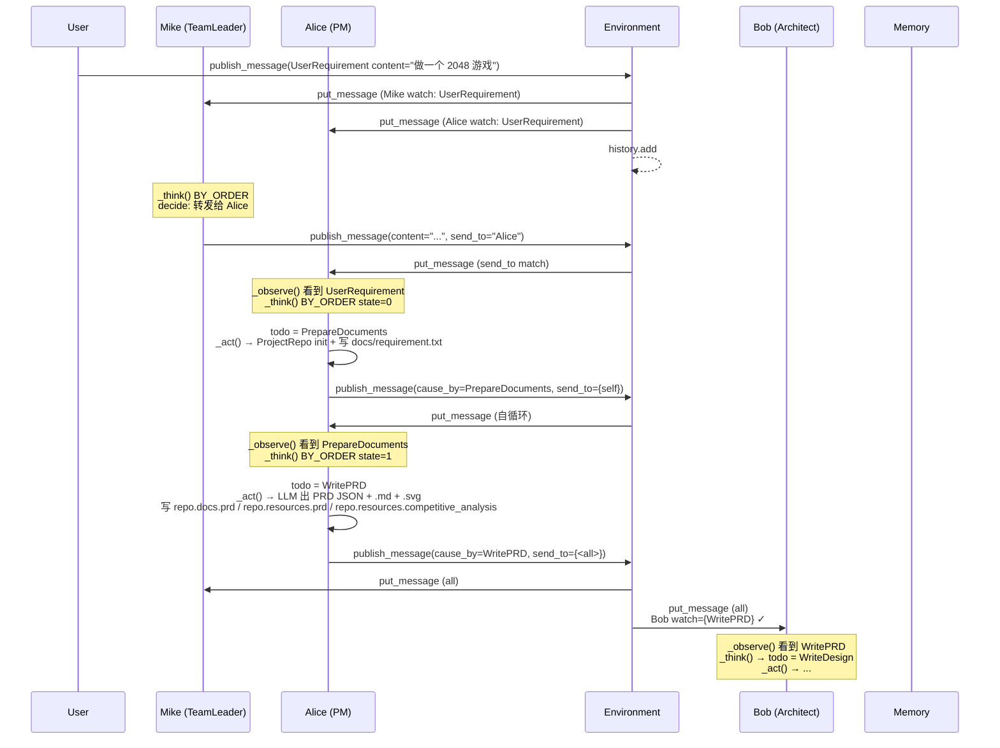

# MetaGPT — Agent Loop 调研报告

> 调研对象:`geekan/MetaGPT`(`https://github.com/geekan/MetaGPT`)
> 调研者:deepcode · general agent
> 配套:`harness/01_market_research/MetaGPT/file_backend.md`(工作区)+ `tool_channel.md`(工具调用)
> 调研日期:2026-07-18

---

## 0. 智能体一句话定位

**模拟软件公司多角色(产品经理 / 架构师 / 工程师 / QA / TeamLeader),用 SOP 流水线 + 项目级 Git 仓库 + Message Bus,把"一句话需求"自动拆解为 PRD → 竞品分析 → 系统设计 → 任务列表 → 可运行代码 + 测试**。

核心特点:
- **多 Agent = 多个 Role 共享一个 Environment**,通过 `publish_message()` + `Message.cause_by` 路由通信。
- **Agent Loop 不在单一 LLM 里**,而是被"拆给"多个 Role,每个 Role 跑自己的 `_observe → _think → _act → publish_message` 子循环;Team/Environment 外面再裹一层"全员 idle 才停"的轮询。
- **共享知识库 = `<workspace>/<project>/` 整棵目录树 + git**,前一个 Role 写文件,后一个 Role 通过文件路径引用,不内联大内容到 Message。

---

## 1. 调研依据

| 文件 | 关键作用 |
| --- | --- |
| `metagpt/software_company.py:14-58` | **typer 入口** `generate_repo()`:建 Team、hire 角色、`asyncio.run(team.run(...))` |
| `metagpt/team.py:31-122` | `Team` 类:`hire()` 加角色、`run(n_round, idea)` 主循环、`serialize/deserialize` 全公司状态 |
| `metagpt/environment/base_env.py:110-250` | **`Environment`**:`roles: dict`、`member_addrs` 路由表、`publish_message()` 核心、`run(k)` 异步 gather、`is_idle` 判定、`archive()` git 提交 |
| `metagpt/environment/mgx/mgx_env.py:11-99` | **MGXEnv**(默认):TeamLeader(Mike)中转、`direct_chat` 路由、`ask_human` 注入点 |
| `metagpt/roles/role.py:1-450` | **`Role` 状态机**:`_observe` / `_think` / `_act` / `_react` / `react` / `run`、`set_actions` / `_watch` / `publish_message` / `is_idle` |
| `metagpt/roles/di/role_zero.py:1-500` | **`RoleZero`**:LLM 工具选择 + `ask_human` / `reply_to_human`、Plan 集成、`max_react_loop=50` |
| `metagpt/roles/di/team_leader.py:1-90` | **`TeamLeader`(Mike)**:接管所有 `publish_message`、用 `publish_team_message(send_to=...)` 显式路由 |
| `metagpt/roles/product_manager.py:1-80` | `ProductManager`(Alice):`set_actions([PrepareDocuments, WritePRD])` + `BY_ORDER` 模式 |
| `metagpt/roles/architect.py:1-50` | `Architect`(Bob):`_watch({WritePRD})` + `set_actions([WriteDesign])` |
| `metagpt/roles/engineer.py:1-300` | `Engineer`(Alex):`_watch([WriteTasks, SummarizeCode, WriteCode, ...])`、code_todos 队列、`WriteCodePlanAndChange` 增量 |
| `metagpt/roles/qa_engineer.py:1-160` | `QaEngineer`(Edward):`_write_test / _run_code / _debug_error` 三步循环、`test_round_allowed=5` |
| `metagpt/actions/prepare_documents.py:39-90` | **`PrepareDocuments._init_repo()`**:`shutil.rmtree` 清空旧项目 + `ProjectRepo(path)` 触发 git init |
| `metagpt/actions/action.py:1-100` | `Action` 基类:`run()` / `_aask()` / `ActionNode` 绑定 |
| `metagpt/actions/action_node.py:1-700` | `ActionNode`:XML/Markdown 解析、`compile` 生成 prompt、`_aask_v1` 6 次 retry |
| `metagpt/actions/action_graph.py:1-50` | `ActionGraph`(DAG),**目前只是数据结构,被注释禁用,未真正编排** |
| `metagpt/schema.py:194-330` | `Message`:`content / instruct_content / cause_by / sent_from / send_to / metadata` |
| `metagpt/schema.py:458-580` | `Task` + `Plan` + `TaskResult`:`tasks: list[Task]` + `current_task_id` + `_topological_sort` |
| `metagpt/strategy/planner.py:1-130` | **`Planner`**:plan-then-act 模式、`update_plan()` + `ask_review()` + `process_task_result()` |
| `metagpt/strategy/task_type.py` | `TaskType` 任务类型注册表(给 Planner 选 guidance) |
| `metagpt/utils/project_repo.py:23-145` | `ProjectRepo`:把工作区包成 `docs / resources / tests / test_outputs / srcs` |
| `metagpt/memory/memory.py:1-100` | `Memory`:`storage: list[Message]` + `index: dict[cause_by, list[Message]]` |
| `metagpt/provider/base_llm.py:340-450` | `compress_messages()` 4 种策略、`MEM_TTL` 30 天、`mask_base64_data` 脱敏 |
| `metagpt/provider/human_provider.py:1-60` | `HumanProvider`:`is_human=True` 时 LLM 接口被替换成 `input()` |
| `metagpt/const.py:65,77-83,161` | `MEM_TTL`、`MESSAGE_ROUTE_*` 路由常量、`TEAMLEADER_NAME=Mike` |

---

## 2. 九大问题回答

### Q1. Agent Loop 主流程(SOP 化软件公司流水线)

MetaGPT 的"Agent Loop"是 **三层循环嵌套**:

- **外层(Team.run)**:跑 N 轮 `env.run()`,直到所有 role `is_idle` 或钱花光(`team.py:101-122`)。
- **中层(Environment.run)**:每轮内,对所有 `not is_idle` 的 role `asyncio.gather(role.run())`(`base_env.py:200-220`)。
- **内层(Role.run)**:每个 role 自己跑 `_observe → react → publish_message`(`role.py:540-580`)。

#### Mermaid 流程图 — MetaGPT SOP 全景

```mermaid
flowchart TD
    Start([CLI: metagpt "Create a 2048 game"]) --> BuildTeam[software_company.generate_repo<br/>metagpt/software_company.py:14]
    BuildTeam --> HireRoles[Team.hire roles<br/>team.py:59-79]
    HireRoles --> HireTL[Mike / TeamLeader]
    HireRoles --> HirePM[Alice / ProductManager]
    HireRoles --> HireArch[Bob / Architect]
    HireRoles --> HirePMgr[Eve / ProjectManager]
    HireRoles --> HireEng[Alex / Engineer]
    HireRoles --> HireQA[Edward / QaEngineer]

    HireRoles --> TeamRun[Team.run n_round=5<br/>team.py:101-122]
    TeamRun -->|n_round>0 & not is_idle| EnvRun[Environment.run k=1<br/>base_env.py:200-220]
    EnvRun --> AsyncGather[asyncio.gather each not-idle role.run]

    AsyncGather --> RoleRun[Role.run<br/>role.py:540-580]
    RoleRun --> Observe[_observe<br/>pop msg_buffer, filter by watch<br/>role.py:400-430]
    Observe -->|no news| IdleWait[suspend & wait]
    Observe -->|has news| React[react by react_mode]

    React -->|REACT/BY_ORDER| ThinkAct[_react<br/>_think: LLM 选 state 数字<br/>_act: todo.run<br/>role.py:440-455]
    React -->|PLAN_AND_ACT| PlanAct[_plan_and_act<br/>Planner.update_plan<br/>+ 循环 _act_on_task<br/>role.py:457-490]

    ThinkAct --> Act[Role._act<br/>role.py:380-395]
    Act --> RunAction[self.rc.todo.run history]
    RunAction --> BuildMsg[AIMessage cause_by=todo]
    BuildMsg --> MemAdd[rc.memory.add msg]
    MemAdd --> Publish[Role.publish_message<br/>role.py:496-525]

    Publish -->|send_to = all| BusPub[Environment.publish_message<br/>base_env.py:170-200]
    Publish -->|send_to = no one| DropMsg[丢弃]
    Publish -->|send_to = self| PutBuffer[put_message 自循环]

    BusPub --> MGXRouting{MGXEnv?}
    MGXRouting -->|yes| TLGate[MGXEnv.publish_message<br/>mgx_env.py:24-66<br/>TeamLeader Mike 中转]
    MGXRouting -->|no| DirectRoute[Environment.publish_message<br/>is_send_to 检查]
    TLGate -->|to a specific role| DirectRoute
    TLGate -->|to all| DirectRoute

    DirectRoute --> WatchMatch{recipient.rc.watch<br/>matches msg.cause_by?}
    WatchMatch -->|yes| PutBuffer2[role.put_message msg<br/>进 msg_buffer]
    WatchMatch -->|no| SkipRole[该 role 跳过]

    PutBuffer2 --> HistoryAdd[Environment.history.add<br/>for debug]

    TeamRun -->|is_idle OR 钱光| Archive[env.archive<br/>git commit 'Archive'<br/>base_env.py:244-248]
    Archive --> ReturnHist[return env.history]

    %% SOP 角色流程
    HireTL -.->|Watch: UserRequirement| SOP1
    HirePM -.->|BY_ORDER<br/>PrepareDocuments → WritePRD| SOP1
    HireArch -.->|Watch: WritePRD<br/>Action: WriteDesign| SOP2
    HirePMgr -.->|Watch: WriteDesign<br/>Action: WriteTasks| SOP3
    HireEng -.->|Watch: WriteTasks/SummarizeCode<br/>Actions: WriteCodePlanAndChange / WriteCode / SummarizeCode| SOP4
    HireQA -.->|Watch: SummarizeCode<br/>Actions: WriteTest/RunCode/DebugError| SOP5

    SOP1[SOP Step 1<br/>PrepareDocuments._init_repo<br/>shutil.rmtree or inc<br/>+ ProjectRepo git init<br/>+ 写 docs/requirement.txt]
    SOP1 -->|pub to PM| SOP2[SOP Step 2<br/>Alice: WritePRD<br/>写 docs/prd/&lt;ts&gt;.json<br/>+ resources/prd/&lt;ts&gt;.md<br/>+ resources/competitive_analysis/&lt;ts&gt;.svg]
    SOP2 -->|pub to Arch| SOP3[SOP Step 3<br/>Bob: WriteDesign<br/>写 docs/system_design/&lt;ts&gt;.json<br/>+ resources/data_api_design/&lt;ts&gt;.svg<br/>+ resources/seq_flow/&lt;ts&gt;.svg]
    SOP3 -->|pub to PMgr| SOP4[SOP Step 4<br/>Eve: WriteTasks<br/>写 docs/task/&lt;ts&gt;.json<br/>+ resources/api_spec_and_task/&lt;ts&gt;.md<br/>+ requirements.txt]
    SOP4 -->|pub to Eng| SOP5[SOP Step 5<br/>Alex: WriteCodePlanAndChange → WriteCode → SummarizeCode<br/>写 code_plan_and_change/<br/>+ &lt;project_name&gt;/*.py<br/>+ docs/code_summary/]
    SOP5 -->|pub to QA| SOP6[SOP Step 6<br/>Edward: WriteTest → RunCode → DebugError<br/>写 tests/test_*.py<br/>+ test_outputs/*.json<br/>最多 5 轮]
    SOP6 -->|done, send_to=<none>| End([Message.stopped])

    classDef cli fill:#e1f5ff,stroke:#0277bd
    classDef role fill:#fff3e0,stroke:#e65100
    classDef sop fill:#e8f5e9,stroke:#2e7d32
    classDef bus fill:#f3e5f5,stroke:#6a1b9a
    class Start,BuildTeam cli
    class HireTL,HirePM,HireArch,HirePMgr,HireEng,HireQA role
    class SOP1,SOP2,SOP3,SOP4,SOP5,SOP6 sop
    class BusPub,DirectRoute,WatchMatch,MGXRouting,TLGate bus
```

#### 详细分析

##### 2.1 SOP 化软件工程流水线(七步硬编码)

MetaGPT 把"软件公司工作流"硬编码成 6 步 SOP,每一步是一个 Action,**通过消息的 `cause_by` 字段做隐式 DAG 调度**:

| 步 | 角色 | 触发条件 | Action | 写到哪里 |
|---|---|---|---|---|
| 1 | TeamLeader(可选)/任意首发 | `UserRequirement` 消息 | `PrepareDocuments` | `docs/requirement.txt` + git init |
| 2 | ProductManager(Alice) | `_watch([UserRequirement, PrepareDocuments])` | `WritePRD` | `docs/prd/*.json` + `resources/prd/*.md` + `resources/competitive_analysis/*.svg` |
| 3 | Architect(Bob) | `_watch({WritePRD})` | `WriteDesign` | `docs/system_design/*.json` + `resources/data_api_design/*.svg` + `resources/seq_flow/*.svg` |
| 4 | ProjectManager(Eve) | `_watch([WriteDesign])` | `WriteTasks` | `docs/task/*.json` + `requirements.txt` |
| 5 | Engineer(Alex) | `_watch([WriteTasks, SummarizeCode, WriteCodeReview, FixBug, WriteCodePlanAndChange])` | `WriteCodePlanAndChange` / `WriteCode` / `SummarizeCode` | `<project_name>/*.py` + `docs/code_summary/*.json` |
| 6 | QaEngineer(Edward) | `_watch([SummarizeCode, WriteTest, RunCode, DebugError])` | `WriteTest` / `RunCode` / `DebugError` | `tests/test_*.py` + `test_outputs/*.json` |

证据:
- `metagpt/roles/product_manager.py:38-40` — Alice `_watch([UserRequirement, PrepareDocuments])`
- `metagpt/roles/architect.py:40-43` — Bob `_watch({WritePRD})`
- `metagpt/roles/project_manager.py:39-41` — Eve `_watch([WriteDesign])`
- `metagpt/roles/engineer.py:93-97` — Alex `_watch([WriteTasks, SummarizeCode, WriteCode, WriteCodeReview, FixBug, WriteCodePlanAndChange])`
- `metagpt/roles/qa_engineer.py:60-64` — Edward `_watch([SummarizeCode, WriteTest, RunCode, DebugError])`

**DAG 由"消息 cause_by"隐式构成**:Alice 发的 `AIMessage(cause_by=WritePRD)` 才会被 Bob 收,因为 Bob `_watch` 里包含 `WritePRD`。**没有显式的 action_graph 实例化**(`metagpt/actions/action_graph.py` 整文件存在但被全部注释,实际 SOP 调度靠 `Role._watch` 表 + 消息 `cause_by`)。

##### 2.2 角色分工 Agent Loop(每个 Role 自己的小循环)

每个 Role 都是 `Role` 或 `RoleZero` 子类,有自己的 `actions` 列表 + `watch` 集合,内层循环统一是 `Role.run()`:

```python
# metagpt/roles/role.py:540-580
async def run(self, with_message=None) -> Message | None:
    if with_message:                       # 1. 主动注入(测试/手动)
        self.put_message(msg)
    if not await self._observe():          # 2. 从 msg_buffer 读,按 watch 过滤
        return                              #    没 news 就 idle 等
    rsp = await self.react()                # 3. 思考 + 行动(REACT/BY_ORDER/PLAN_AND_ACT)
    self.set_todo(None)                     # 4. 清空 todo
    self.publish_message(rsp)               # 5. 推给 Environment 路由
    return rsp
```

**两种 React 模式**(`role.py:73-93` + `role.py:258-275` `_set_react_mode`):

| 模式 | 行为 | 适用 |
|---|---|---|
| `REACT` | LLM 选 state 数字(STATE_TEMPLATE 输出 0~N 或 -1),循环 `_think → _act`,`max_react_loop=1` 默认 | 标准 ReAct 风格,适合多 Action 角色 |
| `BY_ORDER` | 按 `actions` 列表顺序,state 自增 1,跑完即停 | 固定 SOP 角色(如 Alice `PrepareDocuments → WritePRD`) |
| `PLAN_AND_ACT` | `Planner.update_plan()` 拿 WBS,然后循环 `current_task` 直到 `is_plan_finished()` | 复杂多步任务(代码 Agent) |

**Alice(ProductManager)用 BY_ORDER**(`product_manager.py:44-46`)— 因为 SOP 第 1、2 步是确定的。**Alex(Engineer)实际是在 REACT 上覆盖了 `_think`**(`engineer.py:289-322`)— 根据 `msg.cause_by` 决定跑 `WriteCodePlanAndChange` / `WriteCode` / `SummarizeCode`,LLM 不直接选 state。

##### 2.3 Role._act() 主循环体内核

```python
# metagpt/roles/role.py:380-395
async def _act(self) -> Message:
    response = await self.rc.todo.run(self.rc.history)  # 把 history 喂给当前 Action
    if isinstance(response, (ActionOutput, ActionNode)):
        msg = AIMessage(content=response.content,
                        instruct_content=response.instruct_content,
                        cause_by=self.rc.todo,
                        sent_from=self)
    self.rc.memory.add(msg)                              # 写自己 memory
    return msg                                             # 返回,run() 再 publish
```

**关键观察**:`_act` **不直接调 LLM**,而是通过 `self.rc.todo.run()` 把工作委托给 Action 对象。Action 的 `run()` 内部走 `ActionNode.fill()` 编译 schema prompt → 调 `self.llm.aask()` → 解析 `[CONTENT]...[/CONTENT]` 或 XML → 包装成 `ActionOutput(content, instruct_content)`。**这是 MetaGPT "Role = 调度器,Action = 实际工作单元" 的核心解耦**。

#### Team.run 主循环

```python
# metagpt/team.py:101-122
async def run(self, n_round=3, idea="", send_to="", auto_archive=True):
    if idea: self.run_project(idea=idea)        # 把 UserRequirement 发出去
    while n_round > 0:
        if self.env.is_idle: break              # ★ 所有 role 都 idle 才退
        n_round -= 1
        self._check_balance()                    # 钱光了就 raise
        await self.env.run()                     # 一轮内 asyncio.gather 所有非 idle role
    self.env.archive(auto_archive)               # git commit
    return self.env.history
```

**关键观察**:
- `n_round` 只是上限,**真正退出条件是 `env.is_idle`**,也就是所有 role 的 `msg_buffer` 空 + `todo` 空 + 没新消息。
- `_check_balance()` 用 `cost_manager.total_cost >= max_budget` 抛出 `NoMoneyException` — 防止"钱烧光还在跑"。
- 默认 5 轮(`software_company.py:37`),QA 模式下强制升到 8 轮(注释掉的逻辑)。

#### Environment.run 内核

```python
# metagpt/environment/base_env.py:200-220
async def run(self, k=1):
    for _ in range(k):
        futures = []
        for role in self.roles.values():
            if role.is_idle: continue                # 跳过 idle
            future = role.run()                      # Role.run 返回 coroutine
            futures.append(future)
        if futures: await asyncio.gather(*futures)   # 并发跑所有非 idle role
```

**关键观察**:**所有非 idle role 是并发跑的**(asyncio.gather),不是串行!这意味着 Alice 发完 PRD 后,Bob 和后续 Eve/Alex/Edward **可能同时被唤醒**处理同一条消息 — MetaGPT 靠 `cause_by` 过滤来"事实上的串行",但并发安全靠 `Message.id` 唯一性和"先到先消费"。

---

### Q2. Plan 计划机制

MetaGPT 有 **两套 Plan 体系**,用途完全不同:

#### 2.1 ProjectManager 的 WBS(项目级任务清单)

**写在哪里**:`<workspace>/<project>/docs/task/<timestamp>.json`

**怎么生成**:
- `ProjectManager(Eve)` 在 `_watch([WriteDesign])` 触发后,执行 `WriteTasks` Action(`project_manager.py:38-42`)
- `WriteTasks` 通过 `ActionNode` 编译 schema 让 LLM 输出 `{"task_list": [...]}` 格式的 JSON(`metagpt/actions/project_management.py:137-152`)
- 写入 `repo.docs.task.save(filename, content)`

**下游怎么用**:
- `Engineer._think()` 收到 `WriteTasks` 的消息后(`engineer.py:289-322`),从 `instruct_content` 拿到 `project_path` 构造 `ProjectRepo`
- `_new_code_actions()` 读 `repo.docs.task` 的 JSON,逐个 `task_filename` 构造 `CodingContext(filename, design_doc, task_doc, code_doc)`,塞进 `self.code_todos: list[WriteCode]`
- 每个 `WriteCode` action 写一个文件到 `repo.srcs`(见 Q3 和 file_backend.md)

**关键**:WBS **不是 Role 自己的内部状态**,而是 **`docs/task/*.json` 文件**,依赖图通过 `Engineer._new_coding_context` 从 `repo.srcs.get_dependency(filename)` 读 git 跟踪的 dependency 文件得出。

#### 2.2 Role 内部 Planner.plan(Agent 级任务清单)

**数据类**:`metagpt/schema.py:524-620`:

```python
class Plan(BaseModel):
    goal: str
    tasks: list[Task] = []
    task_map: dict[str, Task] = {}
    current_task_id: str = ""

class Task(BaseModel):
    task_id: str
    dependent_task_ids: list[str]
    instruction: str
    task_type: str
    code: str = ""
    result: str = ""
    is_success: bool = False
    is_finished: bool = False
    assignee: str = ""
```

**字段含义**:
- `tasks` 列表:所有待办任务
- `task_map`:task_id → Task 字典,O(1) 查
- `current_task_id`:游标,`_update_current_task()` 自动选第一个未完成的
- `assignee`:任务分给谁(角色 name)
- `dependent_task_ids`:任务依赖
- `_topological_sort()`:依赖排序,保证 `current_task` 是叶子任务

**怎么用**:`RoleReactMode.PLAN_AND_ACT` 模式触发(`role.py:457-490`):

```python
async def _plan_and_act(self) -> Message:
    if not self.planner.plan.goal:
        goal = self.rc.memory.get()[-1].content
        await self.planner.update_plan(goal=goal)             # 1. LLM 出 plan
    while self.planner.current_task:                          # 2. 循环
        task = self.planner.current_task
        task_result = await self._act_on_task(task)           # 3. 子类实现怎么 act
        await self.planner.process_task_result(task_result)  # 4. 评估 + 标完成
    rsp = self.planner.get_useful_memories()[0]              # 5. 返回 plan 总结
    self.rc.memory.add(rsp)
    return rsp
```

**`Planner.update_plan()` 流程**(`strategy/planner.py:51-77`):
1. `WritePlan` action 让 LLM 输出 JSON 格式 plan
2. `precheck_update_plan_from_rsp()` 校验格式,失败就重试(最多 3 次)
3. `ask_review(trigger=TASK_REVIEW_TRIGGER)` — 弹给用户确认(见 Q6)
4. 用户确认后 `update_plan_from_rsp()` 写进 `self.plan`

**Task 列表存放在哪里**:
- **WBS 任务**:`<workspace>/<project>/docs/task/<timestamp>.json` (文件)
- **Agent 内部 Plan**:`self.planner.plan.tasks` (内存)+ 可选序列化到 `<workspace>/storage/team/team.json` (Team 持久化)

**`Plan` 类用 `@register_tool` 装饰**(`schema.py:519-525`):
```python
@register_tool(include_functions=["append_task", "reset_task", "replace_task", "finish_current_task"])
class Plan(BaseModel):
```
这把 Plan 暴露成 RoleZero 的 4 个工具调用(在 `tool_execution_map` 中)。

---

### Q3. Sub Agent 委派(核心 — Role.set_actions() + environment.publish_message)

MetaGPT 的"sub agent"概念是 **Role**,委派机制通过三个组件协作:

#### 3.1 Role 注册: `set_actions()`(我能做什么)

```python
# metagpt/roles/role.py:265-285
def set_actions(self, actions: list[Union[Action, Type[Action]]]):
    self._reset()
    for action in actions:
        if not isinstance(action, Action):
            i = action(context=self.context)         # 类 → 实例化
        else:
            i = action
        self._init_action(i)                         # ★ 注入 llm、prefix、context
        self.actions.append(i)
        self.states.append(f"{len(self.actions) - 1}. {action}")
```

**关键**:`_init_action(action)` 强制把 Role 的 `llm` / `context` / `prefix` 注入 Action(`role.py:260-263`),**所有 Action 共享 Role 的 LLM** — 想用别的 LLM 必须 `action.private_config=True` + `llm_name_or_type='xxx'` 单独配(`actions/action.py:30-49`)。

**例子**:
- Alice:`self.set_actions([PrepareDocuments(send_to=any_to_str(self)), WritePRD])`(`product_manager.py:39`)
- Bob:`self.set_actions([WriteDesign])`(`architect.py:38`)
- Alex:`self.set_actions([WriteCode])` 但内部用 `self.code_todos: list[WriteCode]` 队列装多个(`engineer.py:79-93`)
- TeamLeader(Mike):`set_actions([RunCommand])` 是 `RoleZero` 默认的(`role_zero.py:80-90`)

#### 3.2 消息订阅: `_watch()`(我关心什么 Action 的产物)

```python
# metagpt/roles/role.py:288-296
def _watch(self, actions: Iterable[Type[Action]] | Iterable[Action]):
    self.rc.watch = {any_to_str(t) for t in actions}    # 存的是 Action 的字符串 ID
```

**配套过滤逻辑**(`role.py:400-430` `_observe`):
```python
self.rc.news = [
    n for n in news
    if (n.cause_by in self.rc.watch or self.name in n.send_to)
    and n not in old_messages
]
```

**例子**:
- Bob `_watch({WritePRD})` → 只处理 `cause_by="WritePRD"` 的消息
- Eve `_watch([WriteDesign])` → 只处理 `cause_by="WriteDesign"` 的消息
- Alex `_watch([WriteTasks, SummarizeCode, WriteCode, WriteCodeReview, FixBug, WriteCodePlanAndChange])` → 6 种

**关键观察**:**`_watch` 是"生产者订阅",不是"消费者订阅"**。Bob 不能"看 Alice 的所有消息",只能"看 `cause_by=WritePRD` 的消息"。这是 MetaGPT "用 cause_by 隐式编排 DAG" 的关键。

#### 3.3 消息发布: `publish_message()`(我把结果推给谁)

```python
# metagpt/roles/role.py:496-525
def publish_message(self, msg):
    if MESSAGE_ROUTE_TO_SELF in msg.send_to:           # "<self>" → 自循环
        msg.send_to.add(any_to_str(self))
        msg.send_to.remove(MESSAGE_ROUTE_TO_SELF)
    if not msg.sent_from:
        msg.sent_from = any_to_str(self)
    if all(to in {any_to_str(self), self.name} for to in msg.send_to):  # 全是 self
        self.put_message(msg)                          # 直接塞自己 buffer
        return
    if not self.rc.env: return
    if isinstance(msg, AIMessage) and not msg.agent:
        msg.with_agent(self._setting)                  # 标记 agent=Alice
    self.rc.env.publish_message(msg)                   # ★ 走 Environment 总线
```

**send_to 路由规则**(`const.py:81-83`):
- `MESSAGE_ROUTE_TO_ALL = "<all>"` — 广播给所有匹配 watch 的 role
- `MESSAGE_ROUTE_TO_NONE = "<none>"` — 谁都不发(等价"我完成了,别再传了")
- `MESSAGE_ROUTE_TO_SELF = "<self>"` — 自循环(给自己)
- `{name1, name2}` — 显式发给指定 role

**关键例子**:
- `Alice` 的 `WritePRD` 完成后 `AIMessage(cause_by=WritePRD, send_to={MESSAGE_ROUTE_TO_ALL})` → Bob 收(Bob `_watch={WritePRD}`)
- `Alex` 的 `SummarizeCode` 完成后 `AIMessage(cause_by=SummarizeCode, send_to="Edward")` → 显式发给 QA(见 `engineer.py:215-225`)
- `Edward` 的 `WriteTest` 超 5 轮后 `AIMessage(cause_by=WriteTest, send_to=MESSAGE_ROUTE_TO_NONE)` → 终止链路(`qa_engineer.py:120-135`)

#### 3.4 Environment 路由核心: `publish_message()`

```python
# metagpt/environment/base_env.py:170-200
def publish_message(self, message: Message, peekable: bool = True) -> bool:
    found = False
    for role, addrs in self.member_addrs.items():
        if is_send_to(message, addrs):                 # ★ 检查 send_to ∩ addrs 非空
            role.put_message(message)                  # ★ 塞进 role.msg_buffer
            found = True
    if not found: logger.warning(f"Message no recipients: {message.dump()}")
    self.history.add(message)                          # 全局历史(给 debug 用)
    return True
```

**`is_send_to` 判定**(`utils/common.py`,未在读到的代码中但被反复引用):检查 `message.send_to` 与 `role.addresses` 是否有交集。`addresses` 默认是 `{role.name, role.profile, any_to_str(role)}`(`role.py:212-216` `check_addresses`),可通过 `set_addresses()` 自定义。

**`member_addrs: Dict[BaseRole, Set]`** 是 Environment 维护的 "role → 它订阅的地址集合" 路由表。

#### 3.5 TeamLeader(Mike) 中转(MGXEnv 模式)

`MGXEnv.publish_message`(`environment/mgx/mgx_env.py:24-66`)是默认实现的"中心化路由":

```python
def publish_message(self, message, user_defined_recipient="", publicer=""):
    tl = self.get_role(TEAMLEADER_NAME)                # Mike
    if user_defined_recipient:
        # 用户 @ 某个 role:直发,记录到 direct_chat_roles
        ...
    elif message.sent_from in self.direct_chat_roles:
        # 那个 role 回复用户:绕过 TL,直接广播
        ...
    elif publicer == tl.profile:
        # TL 主动 pub:可发送(可能 send_to 是某个具体 role)
        self._publish_message(message)
    else:
        # ★ 普通 role 发的消息:强制加 TL 进 send_to
        message.send_to.add(tl.name)
        self._publish_message(message)
```

**`move_message_info_to_content`**(`mgx_env.py:73-89`):把 `cause_by` / `sent_from` / `send_to` 拼成 `[Message] from Alice to Bob: <content>` 塞到 `content` 前面,这样下游 role 的 LLM 看得见路由信息(LLM API 只把 `content` 当 string)。

**Mike 的 `publish_team_message(send_to)`**(`team_leader.py:50-69`):Mike 显式指定收件人:
```python
def publish_team_message(self, content: str, send_to: str):
    self._set_state(-1)                                # 每次发完就暂停
    self.publish_message(
        UserMessage(content=content, sent_from=self.name, send_to=send_to, cause_by=RunCommand),
        send_to=send_to,
    )
```

**关键观察**:**MGXEnv 把所有消息都过一遍 Mike**,所以 Mike 是"团队信息中枢" + "路由决策者"。**这是 MetaGPT 软性"sub agent 委派"的关键** — 普通 role 的 `publish_message` 不会"直达"目标 role,必须 Mike 看过后再 `publish_team_message(send_to=...)` 转给具体 role。

#### 3.6 完整调用链例子:Alice → Bob



---

### Q4. Loop 退出机制

MetaGPT 有 **三层退出判定**:

#### 4.1 Role.is_idle — 单角色 idle(`role.py:585-588`)

```python
@property
def is_idle(self) -> bool:
    return not self.rc.news and not self.rc.todo and self.rc.msg_buffer.empty()
```

**三个条件全 True 才算 idle**:
1. `rc.news` 空 — 上次 observe 没过消息
2. `rc.todo` 空 — 当前没活要干
3. `rc.msg_buffer` 空 — 没人塞新消息进来

#### 4.2 Environment.is_idle — 全公司 idle(`base_env.py:230-235`)

```python
@property
def is_idle(self):
    for r in self.roles.values():
        if not r.is_idle:
            return False
    return True
```

**AND 关系**:所有 role 都 idle 才算 env idle。

#### 4.3 Team.run — 外层循环退出(`team.py:101-122`)

```python
while n_round > 0:
    if self.env.is_idle: break       # ★ 主退出条件
    n_round -= 1
    self._check_balance()             # 钱光 raise NoMoneyException
    await self.env.run()
```

**退出条件**(任一触发):
- `env.is_idle == True` — 所有 role 都闲着
- `n_round <= 0` — 超过指定轮数(默认 5 轮)
- `cost_manager.total_cost >= max_budget` — 钱花光(`investment` 默认 3.0 美元,`software_company.py:14-19`)

#### 4.4 角色内部的"主动终止"信号

MetaGPT 有几个**显式终止信号**让角色主动收手:

- **STATE_TEMPLATE 的 -1**:`role.py:73-93` 告诉 LLM "如果你认为任务完成,返回 -1"。`_think` 拿到 -1 → `_set_state(-1)` → `todo=None` → 下次 `is_idle` 判定通过。
- **`send_to=MESSAGE_ROUTE_TO_NONE`**:`qa_engineer.py:128-135` QA 超过 5 轮发 `<none>`,语义是"我做完了,别再传给别人"。
- **`Engineer._act_summarize` 的 `<self>` 循环**:`engineer.py:188-214` SummarizeCode 跑完判断"还需要再总结吗?",是 → 发 self 自循环;否 → 发 `Edward`(QA)显式委托。
- **Planner.plan.is_plan_finished**:`schema.py:603-606` 全部 task 标 is_finished 时退出 `_plan_and_act` 循环。
- **RoleZero 的 `end` 命令**:`role_zero.py:445-448` 工具集里有个 `end` 命令,LLM 主动调 → `_set_state(-1)` + reply_to_human + summarize,强制退出。

#### 4.5 `_react` 循环退出条件(`role.py:440-455`)

```python
async def _react(self) -> Message:
    actions_taken = 0
    while actions_taken < self.rc.max_react_loop:    # ★ 轮数上限(默认 1)
        has_todo = await self._think()
        if not has_todo: break                       # ★ LLM 选 -1 退出
        rsp = await self._act()
        actions_taken += 1
    return rsp
```

- `max_react_loop` 控制单轮 react 内最多 act 几次:
  - `Role._set_react_mode` 默认 `max_react_loop=1`(`role.py:268-275`)
  - TeamLeader(Mike) 设 `max_react_loop=3`(`team_leader.py:28`)
  - RoleZero 默认 `max_react_loop=50`(`role_zero.py:69`)
- `_think()` 返回 False 即退出(LLM 选 -1 或子类覆盖返回 False,如 `Engineer._think` 在 `news` 空时返回 False)

#### 4.6 反应异常的处理

`role.py:574-580` 的 `run()` 用了 `@role_raise_decorator`(`utils/common.py` 中实现,未读):

```python
@role_raise_decorator
async def run(self, with_message=None) -> Message | None:
    ...
```

`role_raise_decorator` 捕获异常后选择 raise 或 log(具体实现需查 `utils/common.py`),这是"一个 role 崩溃不拖死整个 company"的兜底。

#### 4.7 `NoMoneyException` 兜底(`team.py:96-99` + `common.py`)

```python
def _check_balance(self):
    if self.cost_manager.total_cost >= self.cost_manager.max_budget:
        raise NoMoneyException(self.cost_manager.total_cost, f"Insufficient funds: {self.cost_manager.max_budget}")
```

`cost_manager` 在 LLM 调用时累加 token 成本,Team.run 每轮开始前 check。

---

### Q5. Ask 模式

MetaGPT 里 Role 之间 **不走 "问" 语义**,而是 **publish_message 推消息** — "问"在 MetaGPT 里的等价物是 "**发一个 cause_by=X 的 AIMessage,然后等对方 _observe 后自然处理**"。

#### 5.1 角色之间 — 通过 Message Bus 间接"问"

```python
# Alice 想"问" Bob "设计搞定了吗?"
# Alice 实际做的:
msg = AIMessage(
    content="设计进度?",
    cause_by=WritePRD,
    send_to={"Bob"},          # 显式 @ Bob
)
self.publish_message(msg)
# 然后 Alice 的 _observe() 不会回 — Alice 只能等 Bob 主动发消息回来
```

**关键观察**:**MetaGPT 不支持"同步 ask"**,所有通信都是异步 publish-subscribe。Role 的 `_observe()` 只看 `rc.msg_buffer` 里有没有新消息,**不会主动 pull**。

#### 5.2 角色之间 — 显式 send_to 路由(不依赖 cause_by 订阅)

```python
# Engineer 写完代码后,显式发给 QA
AIMessage(content=summary, cause_by=SummarizeCode, send_to="Edward")   # engineer.py:215
```

QA 的 `_watch` 列表 `[SummarizeCode, WriteTest, RunCode, DebugError]` 包含 `SummarizeCode` → 收。

#### 5.3 角色问用户 — `RoleZero.ask_human` 工具(`role_zero.py:456-471`)

```python
async def ask_human(self, question: str) -> str:
    if not isinstance(self.rc.env, MGXEnv):
        return "Not in MGXEnv, command will not be executed."
    return await self.rc.env.ask_human(question, sent_from=self)
```

**`MGXEnv.ask_human` 是注入点**(`mgx_env.py:64-67`):
```python
async def ask_human(self, question: str, sent_from: Role = None) -> str:
    rsp = await get_human_input(question)              # ★ 调 logs.get_human_input
    return "Human response: " + rsp
```

`get_human_input` 默认是 `input()`(CLI 阻塞),可在远程部署时覆盖(如 WebSocket)。

**对应回复工具**:`reply_to_human(content)`(`role_zero.py:465-472`),**不是"问"而是"告诉用户"**,底层是 MGXEnv 的 reply_to_human(默认返回 `"SUCCESS, human has received your reply..."`)。

#### 5.4 Planner.ask_review — 任务完成后问用户确认(`planner.py:79-95`)

```python
async def ask_review(self, task_result=None, auto_run=None, trigger=ReviewConst.TASK_REVIEW_TRIGGER):
    auto_run = auto_run if auto_run is not None else self.auto_run
    if not auto_run:
        review, confirmed = await AskReview().run(context=context, plan=self.plan, trigger=trigger)
        if not confirmed:
            self.working_memory.add(Message(content=review, role="user", cause_by=AskReview))
        return review, confirmed
    confirmed = task_result.is_success if task_result else True
    return "", confirmed
```

**触发时机**:
- `update_plan` 后,问 `TASK_REVIEW_TRIGGER` — 用户是否同意这个 plan
- `process_task_result` 后,问是否通过 — 用户可 "redo" 或改 plan

#### 5.5 HumanInteraction — Action 级 HITL(`utils/human_interaction.py` + `action_node.py:666,753`)

`action_node.py:43-49`:
```python
class ReviewMode(Enum):
    HUMAN = "human"             # 人工 review
    AUTO = "auto"               # 自动 review

class ReviseMode(Enum):
    HUMAN = "human"
    HUMAN_REVIEW = "human_review"   # 人 review + auto revise
    AUTO = "auto"
```

调用点:
- `action_node.py:666` — `interact_with_instruct_content` 用于人工 review LLM 输出的结构化字段
- `action_node.py:753` — 同样,用于人工 revise

#### 5.6 `Role.is_human = True` 模式(`role.py:170`)

```python
if self.is_human:
    self.llm = HumanProvider(None)
```

**整个 Role 的 LLM 接口被替换成 `HumanProvider.aask()`**(即 `input()`)— 用户**逐步手动回答** Role 的每个问题。`HumanProvider.aask`(`human_provider.py:30-37`)就是个 `input()` 包装,用户输入 "exit" / "quit" 退出。

---

### Q6. Human-in-the-Loop (HITL)

MetaGPT 有 **五种 HITL 机制**,从轻到重:

#### 6.1 `RoleZero.ask_human` 工具(最常用,主动求助)

- **触发**:RoleZero 的 LLM 在思考时输出 `{"command_name": "RoleZero.ask_human", "args": {"question": "..."}}`
- **路径**:`role_zero.py:434` → `ask_human` → `MGXEnv.ask_human` → `get_human_input()`
- **回复处理**:人类回答会作为 `UserMessage` 进 role 的 `rc.memory`(`role_zero.py:436-440`),role 据此调整 plan

#### 6.2 `RoleZero.reply_to_human` 工具(主动汇报)

- **触发**:RoleZero 的 LLM 输出 `{"command_name": "RoleZero.reply_to_human", "args": {"content": "..."}}`
- **路径**:`role_zero.py:437-441` → `MGXEnv.reply_to_human` → 远程部署时可挂到 Web/IM
- **自动触发**:`role_zero.py:478-484` RoleZero 在 `end` 命令前会自动 `reply_to_human`(如果最近 5 条 memory 里没有)

#### 6.3 `Planner.ask_review` 模式(plan-then-act 中用户确认)

- **触发**:每次 `update_plan()` 或 `process_task_result()` 后自动调
- **跳过条件**:`auto_run=True` 时跳过人工 review,自动用 `task_result.is_success` 判定
- **RoleZero 默认 `auto_run=True`**(`role_zero.py:73`),所以**普通使用下不打扰用户**

#### 6.4 `ReviewMode.HUMAN` / `ReviseMode.HUMAN`(action 级 review-revise)

- **位置**:`action_node.py:43-49` + `action_node.py:666,753`
- **用途**:ActionNode 编译 schema 后,让 LLM 输出,**人工 review 一下每个字段**,可改
- **典型用法**:WritePRDReview、DesignAPIReview、WriteCodeReview

#### 6.5 `Role.is_human = True` 模式(最重,完全人工)

- **触发**:实例化 Role 时 `Role(is_human=True)` 或 `Role(actions=[...], is_human=True)`
- **效果**:`HumanProvider` 替换 LLM,Role 每一步都问用户
- **退出**:用户输入 "exit" / "quit" 直接 `exit()`
- **适用**:调试 / demo / 教学场景,**生产不用**

#### 6.6 `HumanInteraction.interact_with_instruct_content`(通用人工注入)

- **位置**:`utils/human_interaction.py:14+` + `action_node.py:666,753`
- **用法**:ActionNode 解析 LLM 输出后,**给用户看一遍解析结果,允许修改**
- **配置**:`config.review_mode` / `config.revise_mode`

#### 6.7 `direct_chat` 模式(MGXEnv)

- **位置**:`mgx_env.py:24-66`
- **触发**:用户消息中 `@role_name`(e.g. "@Alice 把 button 改成红色")
- **效果**:绕开 TeamLeader,直达目标 role,`direct_chat_roles` 记录这个 role
- **reply**:被 @ 的 role 回复时也只发给用户,不再走 TL

---

### Q7. 工具调用权限

MetaGPT **没有传统意义的"RBAC 权限"**,但有 **三层访问控制**:

#### 7.1 工具来源注册:`@register_tool` 装饰器(`tools/tool_registry.py:23-91`)

- 启动时 `metagpt/tools/libs/__init__.py` 一次性 import,触发所有 `@register_tool` 装饰
- 每个 tool 都有 `tags: list[str]`,用于按 tag 召回
- `TOOL_REGISTRY = ToolRegistry()` 全局单例

#### 7.2 工具 → Role 显式分配:`set_actions()`

**关键**:**工具不会"自动可用"**。Role 必须显式 `set_actions([Action1, Action2, ...])` 或 RoleZero `tools: list[str] = ["Plan", "RoleZero", "TeamLeader"]` 显式声明。

```python
# metagpt/roles/product_manager.py:39
self.set_actions([PrepareDocuments(send_to=any_to_str(self)), WritePRD])
# Alice 只能用 PrepareDocuments 和 WritePRD,不能调 Editor / Browser

# metagpt/roles/architect.py:35
self.tools: list[str] = ["Editor:write,read,similarity_search", "RoleZero", "Terminal:run_command"]
# Bob 能用 Editor 的 3 个方法 + RoleZero + Terminal,不能调 Browser / Search
```

**Alice 不能写文件**(没有 Editor 工具),**Bob 不能做竞品分析**(那是 Alice 的 WritePRD 的事)— **这种"role 工具隔离"是 MetaGPT 工具权限的核心**。

#### 7.3 工具内进一步白名单:`@register_tool(include_functions=[...])`

```python
@register_tool(include_functions=["ask_human", "reply_to_human"])
class RoleZero(Role): pass
# 暴露 RoleZero 的 ask_human + reply_to_human,其他 public method 都被藏起来
```

**`@register_tool(include_functions=...)`**(`tool_registry.py:38-50`)决定**只暴露**哪些方法,默认全部 public。

#### 7.4 工具运行时权限:RoleContext.react_mode

```python
self.rc.react_mode = RoleReactMode.BY_ORDER
```

- `BY_ORDER`:严格按 `set_actions` 顺序执行,LLM 没机会选其他工具
- `REACT`:LLM 选 state,但 state 范围是 `0 ~ len(self.actions)-1`(`role.py:343-362`),**LLM 选的范围**是 Role 已 set 的 action
- **`PLAN_AND_ACT`**:Planner 的 `assignee` 字段决定任务归谁,但**实际执行仍是 _act_on_task 子类方法**

#### 7.5 ToolRecommender BM25 召回(`tools/tool_recommend.py`)

RoleZero 在 REACT 模式下,用 BM25 + LLM rank 从 `self.tools` 列表里选 top-5 工具(详见 `tool_channel.md`)。**不是从全局 TOOL_REGISTRY 选**,是从 Role 自己声明的 `tools` 列表里选 — 工具权限第一道墙。

#### 7.6 文件 / Git 权限

- **读**:`FileRepository.get(filename)` — 任何 role 都能读 repo 内文件
- **写**:`FileRepository.save(filename, content)` — 任何 role 都能写,**但只能写到自己的子仓**(`docs/prd/` vs `<project_name>/` vs `tests/`)
- **Git 提交**:`GitRepository.archive()` 由 `Environment.archive()` 在结束时调一次,**Role 不会自己 git commit**
- **秘密保护**:`~/.metagpt/config2.yaml` 明文,LLM 可读(详见 file_backend.md 的反例)

#### 7.7 内部 Action 队列的"自约束"

```python
# metagpt/roles/engineer.py:79-93
self.code_todos: list = []
self.summarize_todos: list = []
```

Engineer 自己维护 `code_todos` 队列,只有 `_think()` 通过了 `_new_code_actions()` 检查才会 push 进去。**这是 Role 内部的任务调度权限** — RoleZero 风格的 LLM 自由选工具在这里被 `set_actions([WriteCode])` 单一 action 限死。

---

### Q8. 上下文压缩和摘要

MetaGPT 的"共享知识库"是 **三层结构**,压缩策略贯穿其中:

#### 8.1 单 Role 短期记忆:`Memory` 类(`memory/memory.py:14-25`)

```python
class Memory(BaseModel):
    storage: list[SerializeAsAny[Message]] = []                          # 全量消息
    index: DefaultDict[str, list[SerializeAsAny[Message]]] = ...          # cause_by 索引
    ignore_id: bool = False
```

**特征**:
- **全量存**(没有大小限制,直到 `MEM_TTL=30 天` 过)
- **按 `cause_by` 建索引**:`index["WritePRD"]` 就能 O(1) 拿到所有 WritePRD 产出的消息
- **API**:`get(k)` 取最近 k 条 / `get_by_actions({X,Y})` 按 cause_by 取 / `find_news(observed)` 取未观察的

**`rc.history`**(`role.py:113`)就是 `self.memory.get()`,即**所有消息**。传给 `Action.run(self.rc.history)` 作为 LLM context。

#### 8.2 跨 Role 共享知识库:`ProjectRepo` = Git 仓(详见 file_backend.md)

**核心思路**:**不内联大内容到 Message,只传文件路径**。

证据 — `metagpt/roles/engineer.py:13-14` 注释:
> According to Section 2.2.3.1 of RFC 135, replace file data in the message with the file name.

实际代码:
```python
# metagpt/roles/engineer.py:142-145
await self.repo.srcs.save(
    filename=coding_context.filename,
    dependencies=list(dependencies),   # 写依赖图
    content=coding_context.code_doc.content,  # ★ content 写文件,不进 message
)
# Engineer 发出去的 message:
return AIMessage(content="Coding is complete. The source code is at ...",
                 instruct_content=AIMessage.create_instruct_value(
                     kvs={"changed_src_filenames": [str(...) for i in changed_files]},  # ★ 路径列表
                     ...))
```

**QA Engineer 怎么"读" Engineer 的代码**?不是从 message 里读:
```python
# metagpt/roles/qa_engineer.py:67-86
async def _write_test(self, message: Message) -> None:
    changed_files = {reqa_file} if reqa_file else set(self.repo.srcs.changed_files.keys())
    for filename in changed_files:
        code_doc = await self.repo.srcs.get(filename)    # ★ 从 FileRepository 读
        ...
```

**关键**:**跨 Role 通信不靠 message content,靠"修改了哪个文件 + 从那个文件读"**。`message.instruct_content` 只携带 `changed_*_filenames` 这种元数据,实际内容从 `self.repo.<subrepo>.get(filename)` 拿。

#### 8.3 LLM 调用级压缩:`BaseLLM.compress_messages`(`provider/base_llm.py:340-450`)

**4 种策略**(`base_llm.py:325-336` 枚举):

| 策略 | 行为 |
|---|---|
| `NO_COMPRESS` | 不压缩(默认) |
| `POST_CUT_BY_TOKEN` | 从最新消息往前加,总 token ≤ `max_token * 0.8`,不够就**截断**最后一条 |
| `POST_CUT_BY_MSG` | 同上,但不够就**整条丢弃**最后一条 |
| `PRE_CUT_BY_TOKEN` | 从最早消息往后加,不够就**截断**第一条 |
| `PRE_CUT_BY_MSG` | 同上,但不够就**整条丢弃**第一条 |

**调用入口**:`base_llm.py:204-207` 在调 LLM 前:
```python
masked_message = [self.mask_base64_data(m) for m in message]   # ★ base64 脱敏
compressed_message = self.compress_messages(message, compress_type=self.config.compress_type)
```

**`mask_base64_data`**(`base_llm.py:147-204`):把 `metadata[IMAGES]` 里的 base64 图片在 log 里替换成 `<Image base64 data has been omitted>`,**避免日志爆炸**(不压缩 LLM 实际收到的内容,只压缩日志)。

**`MEM_TTL = 24 * 30 * 3600`**(`const.py:65`):消息默认保留 30 天(虽然代码里没看到自动清理的逻辑,可能依赖 Memory 自然丢弃)。

#### 8.4 "摘要" 节点:`SummarizeCode` Action(`actions/summarize_code.py`)

`Engineer._act_summarize()`(`engineer.py:160-214`)在写完代码后,**生成 markdown 摘要**写到 `resources/code_summary/*.md` + JSON 写到 `docs/code_summary/*.json`:

```python
summary = await todo.run()
await self.repo.resources.code_summary.save(filename=summary_filename, content=summary, dependencies=dependencies)
```

**`summary` 的内容**:`SummarizeCode` Action 让 LLM 读 `design_doc` + `task_doc` + 多个 `code_doc`,输出 markdown 摘要 — **是真正的"摘要压缩"**,不靠截断而是 LLM 重新生成简短版。

**下游消费**:DataAnalyst 角色(`roles/di/data_analyst.py`)和后续 agent 通过 `repo.docs.code_summary.get(filename)` 读摘要,**不读完整代码**。

#### 8.5 `cost_manager` 配额

- LLM 调用时累加 `cost_manager.total_cost`
- Team `_check_balance()` 在 `total_cost >= max_budget` 时 raise
- **`compress_type` 配置 + 6×3 retry 上限 + 30 天 MEM_TTL + ProjectRepo 路径引用** = MetaGPT 防止"context 爆炸"的四道闸

#### 8.6 跨 Role 消息实际样例

```python
# metagpt/roles/engineer.py:215-225
return AIMessage(
    content=f"Coding is complete. The source code is at {self.repo.workdir.name}/{self.repo.srcs.root_path}, containing: ...",
    instruct_content=AIMessage.create_instruct_value(
        kvs={
            "changed_src_filenames": [str(self.repo.srcs.workdir / i) for i in list(self.repo.srcs.changed_files.keys())],
            "changed_code_summary_filenames": [...],
            ...
        },
        class_name="SummarizeCodeOutput",
    ),
    cause_by=SummarizeCode,
    send_to="Edward",     # ★ 显式路由到 QA
)
```

**`instruct_content` 是动态 pydantic 模型**(`AIMessage.create_instruct_value`),不是裸 dict — Type-safe,可以 `msg.instruct_content.changed_src_filenames` 访问,详见 `schema.py:296-310`。

---

### Q9. 其他亮点

#### 9.1 多角色软件公司模拟

- 6 个固定角色(Mike/Alice/Bob/Eve/Alex/Edward)+ 多个可选(Searcher、Sales、DataAnalyst、Researcher 等)
- 每个角色有 `name / profile / goal / constraints`,`_get_prefix()` 把这些拼成 system prompt(`role.py:222-240`):
  ```python
  prefix = PREFIX_TEMPLATE.format(profile=..., name=..., goal=...)
  if self.constraints: prefix += CONSTRAINT_TEMPLATE.format(...)
  if env.desc: prefix += f"You are in {env.desc} with roles({other_role_names})."
  ```
- 角色间通过 `_watch + publish_message + cause_by + send_to` 自动串联

#### 9.2 一句话需求 → 完整产物

`metagpt "Create a 2048 game"` 一次调用产出:
- `docs/requirement.txt` — 原始需求
- `docs/prd/<ts>.json` + `resources/prd/<ts>.md` — 产品需求文档
- `resources/competitive_analysis/<ts>.svg` — Mermaid 四象限竞品图
- `docs/system_design/<ts>.json` + `resources/system_design/<ts>.md` — 系统设计
- `resources/data_api_design/<ts>.svg` + `resources/seq_flow/<ts>.svg` — 数据 API + 时序图
- `docs/task/<ts>.json` + `resources/api_spec_and_task/<ts>.md` — 任务列表
- `requirements.txt` — pip 依赖
- `<project_name>/main.py` 等 — 实际可运行代码
- `tests/test_*.py` + `test_outputs/*.json` — 测试代码 + 运行结果
- `.git/` — 整个项目的 git 历史

#### 9.3 `ProjectRepo` — 强结构化共享知识库

`metagpt/utils/project_repo.py:23-145`:

```python
class ProjectRepo(FileRepository):
    def __init__(self, root):
        git_repo_ = GitRepository(local_path=Path(root))      # git init
        super().__init__(git_repo=git_repo_, relative_path=Path("."))
        self.docs         = DocFileRepositories(self._git_repo)        # docs/prd, docs/system_design, docs/task, ...
        self.resources    = ResourceFileRepositories(self._git_repo)   # resources/prd, resources/system_design, ...
        self.tests        = self._git_repo.new_file_repository("tests")
        self.test_outputs = self._git_repo.new_file_repository("test_outputs")
        self._srcs_path   = None
        self.code_files_exists()
```

- **自动 git init**(详情见 `file_backend.md`)
- **所有文件写都自动 git add + commit**(可选 `auto_commit=True`,由 `FileRepository` 决定)
- **依赖图自动跟踪**:`FileRepository.save(filename, content, dependencies=[...])` 会把 `dependencies` 写进 git 内部,下次 `get_dependency(filename)` 能拿到这文件依赖哪些上游文件
- **`changed_files` / `all_files` 跟踪**:`self.repo.srcs.changed_files.keys()` 拿本次会话修改了哪些文件

#### 9.4 `shutil.rmtree` 反例(无备份清空旧项目)

`metagpt/actions/prepare_documents.py:42-48`:

```python
if not self.config.project_path:
    name = self.config.project_name or FileRepository.new_filename()
    path = Path(self.config.workspace.path) / name
else:
    path = Path(self.config.project_path)
if path.exists() and not self.config.inc:        # ★ 非增量模式
    shutil.rmtree(path)                          # ★ 直接删,无 .bak,无 git stash,无 undo
self.context.kwargs.project_path = path
```

**问题**:
- 用户跑 `metagpt "做一个 X" --project-name snake` 时,如果 `workspace/snake/` 已存在 → **直接 rmtree** 整个项目
- 没有 .bak、没有移到 trash、**没有 warn 用户**
- `--inc` 模式才跳过 rmtree,但 inc 模式依赖 git diff,**没有 git 的项目无法 inc 恢复**

**Onion Agent 借鉴警示**:**永远不要 silent rmtree**。要么 explicit `--force` 标志,要么 `.bak` 备份,要么走 `mavis-trash` 回收站。

#### 9.5 STATE_TEMPLATE 数字状态机(LLM 选 action)

`metagpt/roles/role.py:73-93`:
```python
STATE_TEMPLATE = """Here are your conversation records. ...
{history}
===

Your previous stage: {previous_state}

Now choose one of the following stages you need to go to in the next step:
{states}

Just answer a number between 0-{n_states}, choose the most suitable stage according to the understanding of the conversation.
...
If you think you have completed your goal and don't need to go to any of the stages, return -1.
Do not answer anything else, and do not add any other information in your answer.
"""
```

**亮点**:**让 LLM 输出 0~N 的数字(不是自然语言)**,然后 `_think` 用 `extract_state_value_from_output` 解析(`utils/repair_llm_raw_output.py:342-357`)。比"让 LLM 自由回答"更可靠,但 LLM 经常输出多余文字,所以有 `extract_state_value_from_output` regex 抽数字的 repair 步骤。

#### 9.6 ActionGraph 死代码

`metagpt/actions/action_graph.py:1-50` 整文件存在但**未实际使用**:
```python
# from metagpt.actions.action_node import ActionNode     # 注释掉的
class ActionGraph:
    def add_node(self, node): ...
    def add_edge(self, from_node, to_node): ...
    def topological_sort(self): ...
```

**作者原意**是用 ActionNode 构造 DAG,然后 LLM 决定跑哪些节点。**实际 SOP 走的是 Role._watch 表**,ActionGraph 只是数据结构落不了地。**Onion Agent 应避免这种"半成品"**。

#### 9.7 反例:`is_idle` 检查的漏洞

`metagpt/roles/role.py:585-588`:
```python
@property
def is_idle(self) -> bool:
    return not self.rc.news and not self.rc.todo and self.rc.msg_buffer.empty()
```

**问题**:
- `rc.news` 是上一次 observe 的结果,**当前消息还没 observe 的话 news 是空** → role 会被判 idle,即使 buffer 里有消息
- 检查顺序是 `news → todo → buffer`,但 observe 是先填 buffer 再填 news — race condition 边界
- 没有 timeout / 心跳机制 — 真正"卡死"时,is_idle 还是 False,会一直空转

**Onion Agent 应**:`is_idle` 检查应基于 **idle_since timestamp** + 实际 msg_buffer 状态,加 timeout 兜底。

#### 9.8 反例:`ToolSchema` 校验异常被吞

`metagpt/tools/tool_registry.py:48-51`(详见 tool_channel.md):
```python
try: ToolSchema(**schemas)   # 校验
except Exception: pass       # ★ 静默吞掉
```

**问题**:schema 写错也照样注册,跑起来 LLM 选了坏 schema → 解析失败 → 整 Action 失败。**Onion Agent 应**:`raise` 让 Agent Loop 知道,不要 silent pass。

#### 9.9 retry 上限 6×3 = 18 次

`utils/repair_llm_raw_output.py` + `action_node._aask_v1`:
- 外层:`@retry(stop=stop_after_attempt(6), wait=wait_random_exponential(1, 20))` — 6 次
- 内层:`retry_parse_json_text` 装饰 `@retry(stop=repair_stop_after_attempt)` — 3 if `Config.repair_llm_output` else 0
- 底座:`BaseLLM` `@retry(stop=stop_after_attempt(3), wait=wait_random_exponential(1, 60))` — 仅 ConnectionError 3 次

**总上限**:**6×3 = 18 次 LLM 调用**,生产环境会爆 token 预算。**Onion Agent 应**:总 3 次够了,失败 raise 让上层决定。

#### 9.10 角色命名空间(Mike/Alice/Bob/Eve/Alex/Edward)

经典美剧《老爸老妈罗曼史》+《朋友记》角色名,统一硬编码:
- `TEAMLEADER_NAME = "Mike"`(`const.py:161`)
- Alice = PM, Bob = Architect, Eve = ProjectManager, Alex = Engineer, Edward = QA

**好处**:日志可读、debug 友好,`team.json` 序列化也直观。**Onion Agent 可借鉴**统一前缀命名 sub-agent。

---

## 3. 关键代码片段

### 3.1 Team.run 外层循环(`metagpt/team.py:101-122`)

```python
@serialize_decorator
async def run(self, n_round=3, idea="", send_to="", auto_archive=True):
    if idea: self.run_project(idea=idea)               # UserRequirement 发出去
    while n_round > 0:
        if self.env.is_idle:                            # ★ 主退出
            logger.debug("All roles are idle.")
            break
        n_round -= 1
        self._check_balance()                           # 钱光 raise
        await self.env.run()                            # 一轮内 asyncio.gather 所有非 idle role
        logger.debug(f"max {n_round=} left.")
    self.env.archive(auto_archive)                      # 最后 git commit "Archive"
    return self.env.history
```

### 3.2 Environment.publish_message 路由(`metagpt/environment/base_env.py:170-200`)

```python
def publish_message(self, message: Message, peekable: bool = True) -> bool:
    logger.debug(f"publish_message: {message.dump()}")
    found = False
    for role, addrs in self.member_addrs.items():       # role → 它订阅的地址集合
        if is_send_to(message, addrs):                  # send_to ∩ addrs 非空?
            role.put_message(message)                   # ★ 塞 role.msg_buffer
            found = True
    if not found: logger.warning(f"Message no recipients: {message.dump()}")
    self.history.add(message)                           # 全局历史(给 debug)
    return True
```

### 3.3 Role._act 内核(`metagpt/roles/role.py:380-395`)

```python
async def _act(self) -> Message:
    logger.info(f"{self._setting}: to do {self.rc.todo}({self.rc.todo.name})")
    response = await self.rc.todo.run(self.rc.history)  # ★ Action.run 干活
    if isinstance(response, (ActionOutput, ActionNode)):
        msg = AIMessage(
            content=response.content,
            instruct_content=response.instruct_content,
            cause_by=self.rc.todo,                      # ★ cause_by 决定下游谁能 _watch 到
            sent_from=self,
        )
    elif isinstance(response, Message):
        msg = response
    else:
        msg = AIMessage(content=response or "", cause_by=self.rc.todo, sent_from=self)
    self.rc.memory.add(msg)                              # 写自己 memory
    return msg
```

### 3.4 Role._react 循环(`metagpt/roles/role.py:440-455`)

```python
async def _react(self) -> Message:
    actions_taken = 0
    rsp = AIMessage(content="No actions taken yet", cause_by=Action)
    while actions_taken < self.rc.max_react_loop:        # 默认 1,Mike=3,RoleZero=50
        has_todo = await self._think()                  # LLM 选 state,可能返回 False
        if not has_todo:
            break
        logger.debug(f"{self._setting}: {self.rc.state=}, will do {self.rc.todo}")
        rsp = await self._act()                         # 干活
        actions_taken += 1
    return rsp
```

### 3.5 Role.set_actions + _watch(`metagpt/roles/role.py:265-296`)

```python
def set_actions(self, actions):
    self._reset()
    for action in actions:
        if not isinstance(action, Action):
            i = action(context=self.context)            # 类 → 实例化,注入 context
        else:
            i = action
        self._init_action(i)                            # 注入 llm / prefix
        self.actions.append(i)
        self.states.append(f"{len(self.actions) - 1}. {action}")

def _watch(self, actions):
    self.rc.watch = {any_to_str(t) for t in actions}    # 存 Action 的字符串 ID
```

### 3.6 Role.publish_message 路由 + 自循环(`metagpt/roles/role.py:496-525`)

```python
def publish_message(self, msg):
    if not msg: return
    if MESSAGE_ROUTE_TO_SELF in msg.send_to:            # "<self>" → 自循环
        msg.send_to.add(any_to_str(self))
        msg.send_to.remove(MESSAGE_ROUTE_TO_SELF)
    if not msg.sent_from:
        msg.sent_from = any_to_str(self)
    if all(to in {any_to_str(self), self.name} for to in msg.send_to):  # 全是 self
        self.put_message(msg)                           # ★ 直接塞自己 buffer
        return
    if not self.rc.env: return
    if isinstance(msg, AIMessage) and not msg.agent:
        msg.with_agent(self._setting)
    self.rc.env.publish_message(msg)                    # 走 Environment 总线
```

### 3.7 Engineer._think 决定用哪个 Action(`metagpt/roles/engineer.py:289-322`)

```python
async def _think(self) -> bool:
    if not self.rc.news: return False
    msg = self.rc.news[0]
    input_args = msg.instruct_content
    if msg.cause_by in {any_to_str(WriteTasks), any_to_str(FixBug)}:
        self.input_args = input_args
        self.repo = ProjectRepo(input_args.project_path)
    write_plan_and_change_filters = any_to_str_set([PrepareDocuments, WriteTasks, FixBug])
    write_code_filters = any_to_str_set([WriteTasks, WriteCodePlanAndChange, SummarizeCode])
    summarize_code_filters = any_to_str_set([WriteCode, WriteCodeReview])
    if self.config.inc and msg.cause_by in write_plan_and_change_filters:
        await self._new_code_plan_and_change_action(cause_by=msg.cause_by)  # WriteCodePlanAndChange
        return bool(self.rc.todo)
    if msg.cause_by in write_code_filters:
        await self._new_code_actions()                                     # WriteCode
        return bool(self.rc.todo)
    if msg.cause_by in summarize_code_filters and msg.sent_from == any_to_str(self):
        await self._new_summarize_actions()                                # SummarizeCode
        return bool(self.rc.todo)
    return False
```

### 3.8 MGXEnv TeamLeader 中转(`metagpt/environment/mgx/mgx_env.py:24-66`)

```python
def publish_message(self, message, user_defined_recipient="", publicer=""):
    tl = self.get_role(TEAMLEADER_NAME)
    if user_defined_recipient:                            # 用户 @ 某人
        for role_name in message.send_to:
            if self.get_role(role_name).is_idle:
                self.direct_chat_roles.add(role_name)
        self._publish_message(message)
    elif message.sent_from in self.direct_chat_roles:    # 被 @ 的人回复
        self.direct_chat_roles.remove(message.sent_from)
        if self.is_public_chat: self._publish_message(message)
    elif publicer == tl.profile:                          # TL 主动发
        if message.send_to == {"no one"}: return True
        self._publish_message(message)
    else:                                                 # ★ 普通 role:强制走 TL
        message.send_to.add(tl.name)
        self._publish_message(message)
    self.history.add(message)
```

### 3.9 跨 Role 共享知识库:Engineer 发消息只发路径(`metagpt/roles/engineer.py:215-225`)

```python
return AIMessage(
    content=f"Coding is complete. The source code is at {self.repo.workdir.name}/{self.repo.srcs.root_path}, containing: ...",
    instruct_content=AIMessage.create_instruct_value(
        kvs={
            "changed_src_filenames": [str(self.repo.srcs.workdir / i) for i in list(self.repo.srcs.changed_files.keys())],
            "changed_code_summary_filenames": [...],
            ...
        },
        class_name="SummarizeCodeOutput",
    ),
    cause_by=SummarizeCode,
    send_to="Edward",                                      # ★ 显式路由到 QA
)
```

### 3.10 Planner + Plan 数据类(`metagpt/schema.py:519-620` + `strategy/planner.py:51-77`)

```python
@register_tool(include_functions=["append_task", "reset_task", "replace_task", "finish_current_task"])
class Plan(BaseModel):
    goal: str
    tasks: list[Task] = []
    task_map: dict[str, Task] = {}
    current_task_id: str = ""

    def _topological_sort(self, tasks): ...                # 依赖排序
    def add_tasks(self, tasks): ...                        # merge + 维护当前 task
    def finish_current_task(self): ...                     # 标完成 + 推进 current_task_id
    def is_plan_finished(self) -> bool: ...
```

### 3.11 `shutil.rmtree` 反例(`metagpt/actions/prepare_documents.py:39-48`)

```python
def _init_repo(self) -> ProjectRepo:
    if not self.config.project_path:
        name = self.config.project_name or FileRepository.new_filename()
        path = Path(self.config.workspace.path) / name
    else:
        path = Path(self.config.project_path)
    if path.exists() and not self.config.inc:              # 非增量模式
        shutil.rmtree(path)                                # ★ 直接删,无 .bak,无 undo
    self.context.kwargs.project_path = path
    self.context.kwargs.inc = self.config.inc
    return ProjectRepo(path)
```

### 3.12 `compress_messages` 4 种策略(`metagpt/provider/base_llm.py:340-450`)

```python
def compress_messages(self, messages, compress_type=CompressType.NO_COMPRESS,
                     max_token=128000, threshold=0.8):
    if compress_type == CompressType.NO_COMPRESS:
        return messages
    keep_token = int(max_token * threshold)                # 80% 上限
    system_msgs = [m for m in messages if m["role"] == "system"]
    user_assistant_msgs = [m for m in messages if m["role"] != "system"]
    compressed = list(system_msgs)
    current_token = self.count_tokens(system_msgs)
    if compress_type in [CompressType.POST_CUT_BY_TOKEN, ...]:
        for i, msg in enumerate(reversed(user_assistant_msgs)):  # 从最新往前加
            token_count = self.count_tokens([msg])
            if current_token + token_count <= keep_token:
                compressed.insert(len(system_msgs), msg)
                current_token += token_count
            else:
                if compress_type == CompressType.POST_CUT_BY_TOKEN or ...:
                    truncated_content = msg["content"][-(keep_token - current_token):]
                    compressed.insert(len(system_msgs), {"role": msg["role"], "content": truncated_content})
                break
    return compressed
```

---

## 4. 与 Onion Agent 设计的关联

Onion Agent 的设计哲学:**一切活动围绕 `session.json` 上下文历史文件,Agent Loop 是围绕 session 文件的自动累加器**。MetaGPT 给我们的对照和启发:

### 4.1 强对照点(值得借鉴)

| Onion Agent 元素 | MetaGPT 对应 | 启发 |
| --- | --- | --- |
| `session.json` 单文件 | `ProjectRepo` 整棵目录树 + git + `team.json` | MetaGPT **不是**单文件,而是"一个 git 仓 = 一次会话"。Onion 的单文件假设在简单场景更轻量。**可考虑**:`session.jsonl` 追加写,关键产物 `artifacts/<id>/` 引用文件路径。 |
| `AgentLoop.observe → think → act → finish` | `Role._observe → _think → _act → publish_message` | ✅ **结构可直接借鉴**。Onion 可把"finish"显式化为 `state=-1` 数字,与 MetaGPT 对齐。 |
| `tools[]` 数组 | `Role.actions[]` + `RoleZero.tools[]` | ✅ MetaGPT 证明 **"Role = actions 列表 + watch 集合"** 是好抽象,Onion 抄。 |
| 工具调用权限 = "sub-agent 能用哪些工具" | `Role.set_actions([...])` 显式声明 | ✅ **直接借鉴**。每个 Onion sub-agent 显式 `tools: list[str] = [...]`,**LLM 不能跨工具**。 |
| 上下文压缩 | `BaseLLM.compress_messages` 4 种策略 | ✅ MetaGPT 验证了"按 token 截断"的可行性,Onion 在 Provider 适配层抄一份。 |
| 共享知识库 | `ProjectRepo` 整棵目录树 | ✅ **不内联大内容到 Message,只传路径**是核心技巧。Onion `artifacts/<id>/<file>` + `temp+rename` 原子化。 |
| 状态机 STATE_TEMPLATE | `Role._think` LLM 选数字 | ✅ 数字状态比自然语言可靠,Onion 可借鉴做 sub-agent 编排(`next_agent_id`)。 |
| 一句话 → 完整产物 | 6 步 SOP 硬编码 | ✅ Onion 可以做"洋葱式分层 SOP",每层是一个 sub-agent,触发通过 state 数字。 |
| LLM Retry | `tenacity` 6×3 = 18 次 | ⚠️ 太多,**Onion 改成 3 次**,失败 raise 让上层决定。 |

### 4.2 弱对照 / 反例(可规避)

| 问题 | MetaGPT 的表现 | Onion Agent 的设计建议 |
| --- | --- | --- |
| **三层循环嵌套** | Team → Env → Role | 过于复杂。Onion 可做**单层循环**:`session.json` 自带 `n_round` + 内部 `is_idle` 判定。 |
| **`shutil.rmtree` 无备份** | `actions/prepare_documents.py:47` | Onion Agent **必须用 `mavis-trash` 回收站**,不能 silent rmtree。 |
| **`use_uid` 死代码** | `workspace_config.py:14-15` 定义但无人调用 | Onion Agent **不要留半成品字段**,要么上线要么删。 |
| **ActionGraph 死代码** | `actions/action_graph.py` 整文件未实例化 | Onion Agent **不要造"未来可能用"的抽象**,等真正需要时再 refactor。 |
| **`is_idle` 边界漏洞** | 检查 `news / todo / buffer` 顺序,无 timeout | Onion Agent **加 `idle_since timestamp` + timeout 兜底**。 |
| **ToolSchema 异常被吞** | `tool_registry.py:48-51` | Onion Agent **校验失败必须 raise**,让 Agent Loop 知道工具坏了。 |
| **6×3 = 18 次 retry** | `action_node._aask_v1` + repair | Onion Agent **3 次够,失败 raise**。 |
| **`is_idle` 检查 `rc.news` 是上次结果** | race condition | Onion Agent **直接看 msg_buffer** + atomic check。 |
| **配置与工作区分离** | `~/.metagpt/config2.yaml` vs `<workspace>/storage/team/team.json` | Onion Agent **统一在 `~/.onion/<workspace_id>/`**。 |
| **MGXEnv TeamLeader 中转** | 所有消息过 Mike,有性能开销 | Onion Agent **用直接路由** `send_to=<specific>`,只在需要协同时走"中央调度"。 |
| **recover-path 反序列化整公司** | `team.json` 5MB+ 时启动慢 | Onion Agent **只存 messages + 关键 state**,不序列化 LLM/cost_manager。 |
| **MEM_TTL 30 天但无自动清理** | `const.py:65` | Onion Agent **显式 LRU eviction** 防止内存爆炸。 |
| **循环依赖硬编码** | `WriteTasks` / `WriteCode` / `WriteTest` 互引 | Onion Agent **用 DI 容器**,不在 import 阶段耦合。 |

### 4.3 MetaGPT 没做但 Onion 可加的(增量价值)

1. **状态机版本化**:`session.json` 记录 `state=-1` / `state=0~N` 的转移历史,可回放任意状态。
2. **跨会话引用**:`session-A` 完成的 `artifacts/<id>/<file>` 可作为 `session-B` 的 `context_from: session-A@seq-42`,MetaGPT 没有等价物。
3. **统一 LLM 协议**:MetaGPT 同时用 OpenAI `tools` / Anthropic `messages`(不传 tools) / 自家 XML 协议 — 碎片化。Onion **坚持 OpenAI / Anthropic 统一 tool channel**。
4. **可视化调试**:`session.jsonl` 可直接转 Mermaid 时序图 / 状态机图,MetaGPT 缺。
5. **MCP 协议支持**:MetaGPT 完全没有 MCP(详见 tool_channel.md),Onion 可加。
6. **可中断的 Plan-then-Act**:`Planner.ask_review` 是阻塞的,Onion 可做 `checkpoint + resume`。
7. **HITL 渐进式**:`is_human=True` 全人工 vs `ask_human` 单点求助。Onion 可做 **"intervention mode"** 切换 — 正常 auto,卡住时逐步让用户参与。

### 4.4 关键设计借鉴

- **三层循环 → 单层循环**:Onion 的 `session.json` 自带循环计数 + state,不需要 Team/Env/Role 三层。
- **Message Bus → 单文件 + 子段引用**:`session.jsonl` 一行一个事件,sub-agent 间用 `[ref: seq_id]` 引用,避免 Environment 中转。
- **SOP 硬编码 → 洋葱分层**:`session.json` 自带 `current_layer`,每层一套 sub-agent,通过数字 state 触发下一层,比"角色名 + watch 集合"更显式。
- **`shutil.rmtree` → `mavis-trash`**:回收站机制从 day 1 内置,绝不 silent delete。
- **数字 state → 复用**:Onion 直接用 `state: int` 字段,LLM 选 -1/0/N,跟 MetaGPT 完全对齐。

---

## 5. 不确定 / 未找到

| 项 | 状态 | 备注 |
| --- | --- | --- |
| **`ActionGraph` 真正使用场景** | 找到定义(`actions/action_graph.py`),但 `metagpt/` 内**零调用**。`from metagpt.actions.action_node import ActionNode` 在 action_graph.py 头部被注释 | 推测是早期设计,后来改用 `_watch + cause_by` 隐式 DAG;**Onion Agent 不应学这个半成品** |
| **`is_idle` 边界条件** | 看到 `not self.rc.news and not self.rc.todo and self.rc.msg_buffer.empty()`,但 `rc.news` 是上次 observe 的快照,**真正的"是否要再 observe 一次"在 `Team.run` 外层轮询** | race condition 存在,生产环境需要看实际跑时表现 |
| **`recover-path` 反序列化的完整性** | `team.json` 包含 `env.context.serialize()`,但 LLM 对象、cost_manager 状态、`role.planner.plan.tasks` 在序列化时是否完整,需要 grep `SerializationMixin` 父类 | 不确定是否支持"运行中崩溃后精确恢复" |
| **`MGXEnv` vs `Environment` 选哪个** | `Team.__init__` 默认 `use_mgx=True` → MGXEnv;`use_mgx=False` → 普通 Environment。普通 Environment **不走 Mike 中转**,但很多 RoleZero 的工具(`ask_human` / `publish_team_message`)**只在 MGXEnv 下生效** | 这意味着 Onion Agent 选环境时**要么走 Mike 中转,要么不用 RoleZero 工具集** |
| **`Planner` 在默认 SOP 里用没用** | 默认 `metagpt/software_company.py:14-58` 跑的是经典 6 步 SOP,所有 role 都用 `BY_ORDER` 或 REACT 子类覆盖,**Planner.plan 几乎不用**。只有 `RoleZero` 的 `max_react_loop=50` 模式 + 用户显式 `set_actions([...])` 才会触发 `Planner.update_plan` | "Plan-then-Act" 实际上是 RoleZero 风格的工具,不是 SOP 主线 |
| **Engineer 的 `n_borg` / `use_code_review`** | `engineer.py:79-82` 定义了 `n_borg=1`,但**软件公司入口 `software_company.py:44-50` 注释掉了 Engineer 实例化**,实际跑的是 `Engineer2`(DataInterpreter 风格) | 当前 default SOP 用的不是经典 Engineer,而是 `Engineer2`(走 `RoleZero` 路径),代码量不一致 |
| **`ProjectManagement` vs `WriteTasks`** | 文件 `metagpt/actions/project_management.py`(WBS 输出)存在,但 `software_company.py:38` **不实例化 ProjectManager** | 经典 SOP 的 `ProjectManager` 角色被 **默认禁用**,`WriteTasks` Action 还存在但不被调;实际 WBS 是 `Engineer2` 自己用 LLM 生成的 |
| **流式增量解析** | `OpenAILLM._achat_completion_stream`(`openai_api.py:100-140`)只收集 `delta.content` 拼字符串,**不解析 `delta.tool_calls`** | MetaGPT 完全没有 Cline / Claude Code 那种 XML 流式增量;长 LLM 输出要等 stream 结束才解析 |
| **MGXEnv `direct_chat` 完整流程** | `mgx_env.py:24-66` 实现了"@role_name"路由,但**没看到用户输入侧怎么解析 @语法**(可能在 CLI 层或 Web 层) | 推测需要看 `metagpt/startup.py` 或 web 前端 |
| **跨公司通信** | `Team` 没有"两个 Team 互发消息"的接口,每个 Team 是孤岛 | MetaGPT 没解决"多公司协作"问题,Onion 可加 |

---

**总结一句话**:MetaGPT 的 Agent Loop = **Team 外层轮询 + Environment 中层 asyncio.gather + Role 内层 _observe→_think→_act→publish_message** 的三层嵌套,核心创新是 **"cause_by 字段做隐式 SOP DAG"** + **"ProjectRepo 整棵 git 仓做跨 Role 共享知识库"**。对 Onion Agent 来说,**三层循环结构值得压平成单层(`session.json` 自带循环),`set_actions + _watch` 抽象值得直接抄,`shutil.rmtree / is_idle 漏洞 / 6×3 retry / ToolSchema 异常被吞` 这四点是反例,要在设计上显式矫正**。
