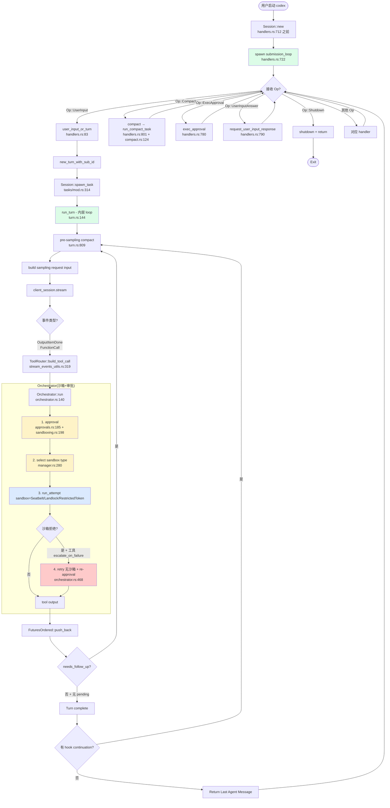

# OpenAI Codex CLI — Agent Loop 调研报告

> 调研对象:`openai/codex`(commit 取自 `C:\workspace\github\onionagent\harness\01_market_research\clone\codex`)
> 调研日期:2026-07-18
> 调研者:Onion Agent 自我反思小组
> 行号格式:源文件路径 `:行号`

---

## 0. 智能体一句话定位

OpenAI 出品的**终端原生 ReAct 编码 Agent**。Rust 实现(原 TypeScript 版本于 2025-04 开源后被 Rust 重写),采用**两层嵌套 Loop**架构:外层 `submission_loop` 接收 `Op` 事件流,内层 `run_turn` 在每个 Turn 内执行 ReAct 循环(LLM → 工具 → 结果 → LLM)。围绕**审批策略 × 沙箱策略**的二维矩阵(4×4=16 种组合),通过 JSONL rollout 文件 + SQLite 状态库(`state_5.sqlite` 的 `thread_spawn_edges` 表)管理 thread tree,OS 级纵深防御沙箱(macOS Seatbelt / Linux Landlock + seccomp / Windows Restricted Token)在 **orchestrator 层**(在工具执行边界)介入,Multi-Agent V2 通过 `spawn_agent` 共享 `state_5.sqlite` + `parent_thread_id` 链接,**无 git worktree 隔离**。

---

## 1. 调研依据

### 1.1 源码路径

- `C:\workspace\github\onionagent\harness\01_market_research\clone\codex\`
- Rust workspace,核心代码在 `codex-rs/core/src/`(约 19.6 万行,7 个核心子目录)。

### 1.2 关键文件

| 路径 | 角色 |
|---|---|
| `codex-rs/core/src/session/mod.rs` (162KB) | Session 总装 + Submission 事件循环 |
| `codex-rs/core/src/session/turn.rs` (101KB) | **单 Turn 内主 ReAct loop**(`run_turn` + `run_sampling_request` + `try_run_sampling_request`) |
| `codex-rs/core/src/session/handlers.rs` | **外层 `submission_loop`**:Op 事件流分发 |
| `codex-rs/core/src/compact.rs` | 上下文压缩(`run_compact_task` + `run_compact_task_inner_impl`) |
| `codex-rs/core/src/thread_manager.rs` | 顶层 thread 管理 + `spawn_subagent` |
| `codex-rs/core/src/codex_thread.rs` (24KB) | `CodexThread` 公共 API(供 app-server 调) |
| `codex-rs/core/src/agent/control.rs` (28KB) | `AgentControl` 多 agent 控制面 + `SpawnAgentOptions` + `LiveAgent` |
| `codex-rs/core/src/agent/control/spawn.rs` (37KB) | **`spawn_agent` / `spawn_agent_with_metadata` / `spawn_agent_with_communication` / `spawn_forked_thread`** |
| `codex-rs/core/src/agent/control/execution.rs` | 并发执行限制(`AgentExecutionLimiter`) |
| `codex-rs/core/src/agent/role.rs` | 子 agent 角色配置(role layer) |
| `codex-rs/core/src/agent/registry.rs` | 子 agent 注册表(per-root-thread scope) |
| `codex-rs/core/src/tools/orchestrator.rs` | **approval → sandbox → retry 主调度**(approval_policy 4 种 × 沙箱 4 种的关键) |
| `codex-rs/core/src/tools/approvals.rs` | `ApprovalReviewer::User` / `Guardian` 决策路由 |
| `codex-rs/core/src/tools/sandboxing.rs` | `default_exec_approval_requirement` + `ExecApprovalRequirement::{Skip, NeedsApproval, Forbidden}` |
| `codex-rs/core/src/tools/handlers/plan.rs` + `plan_spec.rs` | **`update_plan` 工具**:JSON Schema 描述的 plan 跟踪 |
| `codex-rs/core/src/tools/handlers/request_user_input.rs` | **Ask User 模式**:`RequestUserInputEvent` 弹窗 |
| `codex-rs/core/src/tools/handlers/multi_agents_v2/` | V2 多 agent 6 个工具(spawn/wait/send_message/list/followup/interrupt) |
| `codex-rs/core/src/tools/handlers/shell.rs` | shell 命令执行(对接 orchestrator) |
| `codex-rs/core/src/sandboxing/` → 实际位于 `codex-rs/sandboxing/src/` | 沙箱实现总入口 |
| `codex-rs/sandboxing/src/manager.rs` | `SandboxManager` + `transform()` 把命令包装为沙箱内调用 |
| `codex-rs/sandboxing/src/seatbelt.rs` | macOS Seatbelt 策略生成 + `.sbpl` 编译进二进制 |
| `codex-rs/sandboxing/src/landlock.rs` | Linux Landlock + seccomp + 内置 `codex-linux-sandbox` 二进制 |
| `codex-rs/linux-sandbox/README.md` | Linux 沙箱优先级:bwrap 优先 → Landlock fallback |
| `codex-rs/windows-sandbox-rs/` | Windows Restricted Token + Job Object 沙箱 |
| `codex-rs/protocol/src/protocol.rs` | `enum AskForApproval` (4 种) + `enum SandboxPolicy` (4 种) + `enum ReviewDecision` (7 种) |
| `codex-rs/protocol/src/config_types.rs` | `enum ModeKind` (Plan/Default) + `enum ApprovalsReviewer` (User/AutoReview) + `enum TruncationPolicy` |
| `codex-rs/state/src/lib.rs` | SQLite 文件名常量(`state_5.sqlite` 等) |
| `codex-rs/state/src/runtime/threads.rs` | **`thread_spawn_edges` 表**:parent_thread_id 串成 tree |
| `codex-rs/rollout/src/recorder.rs` | JSONL rollout 文件追加 + 文件名 `rollout-YYYY-MM-DDThh-mm-ss-<uuid>.jsonl` |
| `codex-rs/message-history/src/lib.rs` | **`history.jsonl` 软/硬 cap 修剪**(`HISTORY_SOFT_CAP_RATIO = 0.8`) |
| `codex-rs/exec/src/cli.rs` | `--full-auto` 标记为 deprecated,改用 `--sandbox workspace-write` |
| `codex-rs/tasks/mod.rs` | `SessionTask` trait + `spawn_task` 把任务挂到 session 上 |

### 1.3 关键文档

| 路径 | 说明 |
|---|---|
| `codex/README.md` | 顶层 README,主要描述安装和分发渠道 |
| `codex/docs/sandbox.md` | 沙箱/审批文档(已迁移到外部 developers.openai.com/codex/security) |
| `codex/docs/exec.md` | 非交互模式(同外部) |
| `codex/docs/config.md` | 9 层 ConfigLayer 文档(同外部) |
| `codex/docs/execpolicy.md` | execpolicy 规则(starlark 语法)(同外部) |

> **注**:Codex 大量文档已迁移到外部(developers.openai.com/codex/*),仓库内只留 pointer;真正"完整文档"在外部站点。仓库内 README/docs 主要是入口。

---

## 2. 九大问题回答

### Q1. Agent Loop 主流程

**简短回答**:Codex CLI **不是单一 loop**,而是**两层嵌套的 loop**:

1. **外层 `submission_loop`**(`codex-rs/core/src/session/handlers.rs:712`):无限循环接收 `Op` 事件(`UserInput` / `Compact` / `ExecApproval` / `UserInputAnswer` / `RequestPermissionsResponse` / `Shutdown` / ...),分发到对应 handler。
2. **内层 `run_turn`**(`codex-rs/core/src/session/turn.rs:144`):每个 Turn 内是 ReAct 循环 — 一次或多次 `run_sampling_request` + `try_run_sampling_request`,直到 LLM 不再 `needs_follow_up` 且没有 pending input。

**关于"三种模式 Suggest / Auto-Edit / Full-Auto"**:
- 这是**历史命名**(2024-2025 早期 TypeScript 版本),已被 Rust 重构后的**正交二维矩阵**取代:
  - `approval_policy` 4 种:`UnlessTrusted` / `OnRequest`(默认)/ `Granular(GranularApprovalConfig)` / `Never`(`codex-rs/protocol/src/protocol.rs:913-934`)
  - `sandbox_policy` 4 种:`DangerFullAccess` / `ReadOnly` / `ExternalSandbox` / `WorkspaceWrite`(`codex-rs/protocol/src/protocol.rs:1000-1056`)
  - 4×4 = 16 种组合
- 原 `--full-auto` CLI 标志已 deprecated,转用 `--sandbox workspace-write`(`codex-rs/exec/src/cli.rs:42-46,106`)
- 当前的 TUI "mode" 用 `ModeKind`(Plan / Default),不是上面二维(`codex-rs/protocol/src/config_types.rs:610-630`)

**关于"沙箱怎么融入 loop"**:
- **沙箱不在 `run_turn` loop 内**;它在 **工具执行边界**(orchestrator 层)介入。
- `run_turn` 只负责"调 LLM → 解析 ResponseItem → 分发到 tool handler → 收集 tool output"
- 当 tool handler(如 `shell.rs`)需要执行命令时,调用 `orchestrator::run_tool_call()` → 走 1) approval → 2) sandbox select → 3) attempt → 4) retry-with-escalation 流程(`codex-rs/core/src/tools/orchestrator.rs:140-380`)
- **沙箱介入点是"每个工具调用",不是"每个 turn"**。这意味着:同一 turn 内可以混合"被沙箱拒绝"和"绕过沙箱成功"的多次 tool calls。

#### Mermaid 流程图



#### Q1.1 Submission loop(`codex-rs/core/src/session/handlers.rs:712-892`)

```rust
pub(super) async fn submission_loop(
    sess: Arc<Session>,
    config: Arc<Config>,
    rx_sub: Receiver<Submission>,
) {
    // To break out of this loop, send Op::Shutdown.
    let mut shutdown_received = false;
    while let Ok(sub) = rx_sub.recv().await {
        let should_exit = match sub.op.clone() {
            Op::UserInput { .. } => {
                user_input_or_turn(&sess, sub.id.clone(), sub.op, sub.client_user_message_id).await;
                false
            }
            Op::ExecApproval { id, turn_id, decision } => {
                exec_approval(&sess, approval_id, turn_id, decision).await; false
            }
            Op::UserInputAnswer { id, response } => {
                request_user_input_response(&sess, id, response).await; false
            }
            Op::Compact => { compact(&sess, sub.id.clone()).await; false }
            Op::Shutdown => shutdown(&sess, sub.id.clone()).await,  // 唯一返回 true
            // ...其他 handler
        };
        if should_exit { shutdown_received = true; break; }
    }
}
```

要点:
- **唯一退出**:`Op::Shutdown`(`codex-rs/core/src/session/handlers.rs:836`)。
- **Op 类型是 non_exhaustive enum**(`_ => false` 分支兜底,允许 extensions 注入自定义 Op,`handlers.rs:838`)。
- `Op::ExecApproval` 是用户在 TUI 弹窗点击"批准/拒绝"后,反向送回的事件(详见 Q6)。

#### Q1.2 Run turn loop(`codex-rs/core/src/session/turn.rs:144-457`)

```rust
pub(crate) async fn run_turn(
    sess: Arc<Session>,
    turn_context: Arc<TurnContext>,
    turn_extension_data: Arc<ExtensionData>,
    input: Vec<TurnInput>,
    prewarmed_client_session: Option<ModelClientSession>,
    cancellation_token: CancellationToken,
) -> CodexResult<Option<String>> {
    // ... 初始化 ...
    let mut last_agent_message: Option<String> = None;
    let mut next_step_context = Some(first_step_context);
    loop {
        // 1. drain pending input
        // 2. capture step context
        // 3. run_sampling_request → try_run_sampling_request
        let (sampling_request_output, sampling_request_input) = run_sampling_request(...).await?;
        let needs_follow_up = model_needs_follow_up || has_pending_input;
        let token_limit_reached = ...;

        // 3.5 中途 token 超限 → 走 mid-turn auto-compact
        if should_roll_over {
            run_auto_compact(..., CompactionPhase::MidTurn).await?;
            continue;
        }

        // 4. 不需要 follow-up + 无 pending → run stop hooks → 退出
        if !needs_follow_up {
            let stop_outcome = run_turn_stop_hooks(...).await;
            if stop_outcome.should_block { /* inject prompt → continue */ }
            if stop_outcome.should_stop { break; }
            break;
        }
        continue;
    }
    Ok(last_agent_message)
}
```

要点:
- **退出条件**(turn 结束):① `model_needs_follow_up = false` ② `has_pending_input = false` ③ 没有 hook continuation ④ 没有 error。
- **中途退出**:`CodexErr::TurnAborted`(`turn.rs:419`)或 `InvalidImageRequest()` 自我修正后 continue。
- **token 超限**:触发 mid-turn auto-compact(见 Q8),然后 continue。
- **Hook 拦截**:`run_turn_stop_hooks`(`turn.rs:380`)可以让用户/扩展在 turn 结束后追加 prompt 再 continue,实现"model 答完了但 hook 让它继续"。

#### Q1.3 `run_sampling_request` 内部 retry loop(`turn.rs:1123-1190`)

```rust
async fn run_sampling_request(...) -> CodexResult<(SamplingRequestResult, Vec<ResponseItem>)> {
    let mut retries = 0;
    let max_retries = turn_context.provider.info().stream_max_retries();
    let mut initial_input = Some(input);
    loop {
        let prompt_input = initial_input.take().unwrap_or_else(|| sess.clone_history().await.for_prompt(...));
        let prompt = build_prompt(prompt_input, ...);
        match try_run_sampling_request(...).await {
            Ok(output) => return Ok((output, original_input.unwrap_or(prompt.input))),
            Err(CodexErr::ContextWindowExceeded) => { ...; return Err(...) }
            Err(CodexErr::UsageLimitReached(e)) => { ...; return Err(...) }
            Err(err) if !err.is_retryable() => return Err(err),
            Err(err) => handle_retryable_response_stream_error(&mut retries, max_retries, err, ...).await?,
        }
    }
}
```

这是 **LLM 调用 retry loop**:网络错误、5xx、rate limit 等 retryable 错误会重试到 `max_retries`(`stream_max_retries()`),非 retryable 错误立即返回。

#### Q1.4 `try_run_sampling_request` 内部 streaming loop(`turn.rs:1948-2330`)

```rust
let outcome: CodexResult<SamplingRequestResult> = loop {
    let event = stream.next().await?;  // 拉流式事件
    match event {
        ResponseEvent::OutputItemDone(mut item) => {
            // 分发到 handle_output_item_done → 调 tool handler → push 到 in_flight
            let output_result = handle_output_item_done(&mut ctx, item, ...).await?;
            if let Some(tool_future) = output_result.tool_future {
                in_flight.push_back(tool_future);  // 工具 future 排队
            }
            needs_follow_up |= output_result.needs_follow_up;
            ...
        }
        ResponseEvent::Completed => {
            // 等待所有 in_flight tool 结束
            while let Some(result) = in_flight.next().await {
                // 收集 tool output
            }
            break Ok(SamplingRequestResult { needs_follow_up, last_agent_message });
        }
        ...
    }
};
```

要点:
- **流式响应循环**:每收到一个 `ResponseItem` 立即入队 tool future,不等全部完成。
- **Completed 时回收**:`while let Some(result) = in_flight.next().await` 等待所有 tool 完成,把输出追加到历史。
- **并行工具**:`FuturesOrdered` 保持顺序,但有 `parallel_tool_calls: bool`(`client.rs:897`)允许 LLM 一次返回多 tool,Codex 用 `parallel_execution: RwLock`(`codex-rs/core/src/tools/parallel.rs`)做并发门控。

#### Q1.5 三种 sandbox policy 怎么"影响 loop"

| Sandbox Policy | 文件系统可写范围 | 网络 | loop 内表现 |
|---|---|---|---|
| `DangerFullAccess` | 全开 | 视网络 policy | orchestrator 直接 exec,不需要 approval(unless `approval_policy=Never` 之外) |
| `ReadOnly` | 全只读(除 system default readable) | 默认禁 | tool 执行必失败(只读),orchestrator 走 denied → escalate → ask approval → 可能 retry 成功(用户批准后) |
| `WorkspaceWrite` | cwd + `--add-dir` + TMPDIR(可排除) | 默认禁 | 默认成功;写 cwd 之外失败,escalate |
| `ExternalSandbox` | 假设外面已有沙箱 | 视 network_access | orchestrator 不加 wrapper,直接 exec |

(`codex-rs/protocol/src/protocol.rs:1000-1056` + `codex-rs/core/src/sandboxing/src/manager.rs:280-440`)

#### Q1.6 macOS Seatbelt 集成(`codex-rs/sandboxing/src/manager.rs:347-370` + `seatbelt.rs:21-22`)

```rust
SandboxType::MacosSeatbelt => {
    use crate::seatbelt::create_seatbelt_command_args;
    let pending = pending_sandboxed_request()?;
    let mut args = create_seatbelt_command_args(CreateSeatbeltCommandArgsParams {
        command: os_argv_to_strings(argv),
        file_system_sandbox_policy: &pending.effective_file_system_policy,
        network_sandbox_policy: pending.effective_network_policy,
        sandbox_policy_cwd: pending.native_sandbox_policy_cwd.as_path(),
        ...
    })?;
    let mut full_command = Vec::with_capacity(1 + args.len());
    full_command.push(MACOS_PATH_TO_SEATBELT_EXECUTABLE.to_string());  // /usr/bin/sandbox-exec
    full_command.append(&mut args);
    (full_command, None, Some(pending))
}
```

Seatbelt profile **编译进二进制**:
- `MACOS_SEATBELT_BASE_POLICY: &str = include_str!("seatbelt_base_policy.sbpl");`(`seatbelt.rs:21`)
- `MACOS_SEATBELT_NETWORK_POLICY: &str = include_str!("seatbelt_network_policy.sbpl");`(`seatbelt.rs:22`)
- `restricted_read_only_platform_defaults.sbpl`(`seatbelt.rs:24`)
- 只信任 `/usr/bin/sandbox-exec`(`seatbelt.rs:30`),防止 PATH 注入。

#### Q1.7 Linux Landlock + bwrap 集成(`codex-rs/sandboxing/src/manager.rs:380-410` + `linux-sandbox/README.md`)

```rust
SandboxType::LinuxSeccomp => {
    let pending = pending_sandboxed_request()?;
    let exe = codex_linux_sandbox_exe.ok_or(SandboxTransformError::MissingLinuxSandboxExecutable)?;
    ensure_linux_bubblewrap_is_supported(&pending.effective_file_system_policy, use_legacy_landlock, ...)?;
    let mut args = create_linux_sandbox_command_args_for_permission_profile(...);
    let mut full_command = Vec::with_capacity(1 + args.len());
    full_command.push(os_string_to_command_component(exe.as_os_str().to_owned()));  // 内置 codex-linux-sandbox 二进制
    full_command.append(&mut args);
    (full_command, Some(linux_sandbox_arg0_override(exe)), Some(pending))
}
```

Linux 优先级(`linux-sandbox/README.md`):
1. **优先用系统 `bwrap`**:检查 PATH + `/usr/bin/bwrap`。
2. **fallback 内置 `codex-resources/bwrap`**:跟着 Codex 二进制发布。
3. **最后 Landlock + seccomp**(`codex-rs/sandboxing/src/landlock.rs`):纯 Rust Landlock API + seccomp-bpf,作为最弱兜底。

#### Q1.8 Windows Restricted Token 集成(`codex-rs/sandboxing/src/manager.rs:415-432` + `windows-sandbox-rs/`)

```rust
#[cfg(target_os = "windows")]
SandboxType::WindowsRestrictedToken => (
    os_argv_to_strings(argv),
    None,
    Some(pending_sandboxed_request()?),
),
```

Windows 用独立 DLL(`codex-rs/windows-sandbox-rs/`)+ setup service + Restricted Token + Job Object:
- 二进制布局:`~/.codex/.sandbox/` + `.sandbox-bin/` + `.sandbox-secrets/`(`file_backend.md` 已记)
- Windows 用 `get_platform_sandbox` 看 `windows_sandbox_level`(`manager.rs:67-79`):Disabled → None,否则 WindowsRestrictedToken

#### Q1.9 沙箱 vs Loop 的关系总结

| 概念 | 在哪一层介入 | 频率 |
|---|---|---|
| **审批策略 (`approval_policy`)** | orchestrator step 1 | 每个 tool call 1 次 |
| **沙箱 (`sandbox_policy`)** | orchestrator step 2 | 每个 tool call 选 1 次 |
| **escalation(沙箱拒绝后无沙箱重试)** | orchestrator step 4 | 沙箱拒绝时 |
| **审批缓存(`ApprovedForSession`)** | orchestrator + execpolicy | 整个 session |
| **execpolicy 规则** | turn loop 外,工具执行前 | 每个 tool call |
| **`MidTurn` 压缩** | turn loop 内 | token 接近 limit 时 |

**关键洞见**:Codex 的"Agent Loop"是 **Turn × ToolCall** 的二维循环 — Turn 是用户/系统触发的单位(可以包含多次 LLM→Tool 循环),ToolCall 是 LLM 触发的单位(走 orchestrator 的 approval+sandbox 流程)。Onion Agent 如果借鉴,应当把"外层 Turn"和"内层 ToolCall"分开建模。

---

### Q2. Plan 计划机制

**简短回答**:Codex 有 **2 种 plan 机制**:

1. **`ModeKind::Plan` 模式**(`codex-rs/protocol/src/config_types.rs:610-630`):一种**独立 mode**(`Plan` / `Default` 二选一),进入后 LLM 只能输出"proposed plan"不能调工具。模型自己从 stream 提取 plan items,实时推到 TUI。
2. **`update_plan` 工具**(`codex-rs/core/src/tools/handlers/plan.rs` + `plan_spec.rs`):在 **Default 模式**下,模型可以**主动**用 `update_plan` 工具更新任务进度 checklist,推到 TUI 显示。

**两者**互斥(Plan 模式下 `update_plan` 拒绝调用,`plan.rs:79-83`)。

#### Q2.1 `update_plan` 工具规范(`plan_spec.rs:1-37`)

```rust
pub fn create_update_plan_tool() -> ToolSpec {
    let plan_item_properties = BTreeMap::from([
        ("step".to_string(), JsonSchema::string(Some("Task step text.".to_string()))),
        ("status".to_string(), JsonSchema::string_enum(
            vec![json!("pending"), json!("in_progress"), json!("completed")],
            Some("Step status.".to_string()),
        )),
    ]);
    let properties = BTreeMap::from([
        ("explanation".to_string(), JsonSchema::string(Some("Optional explanation for this plan update.".to_string()))),
        ("plan".to_string(), JsonSchema::array(
            JsonSchema::object(plan_item_properties, Some(vec!["step", "status"]), ...),
            Some("The list of steps".to_string()),
        )),
    ]);
    ToolSpec::Function(ResponsesApiTool {
        name: "update_plan".to_string(),
        description: r#"Updates the task plan.
Provide an optional explanation and a list of plan items, each with a step and status.
At most one step can be in_progress at a time.
"#.to_string(),
        strict: false, defer_loading: None,
        parameters: JsonSchema::object(properties, Some(vec!["plan"]), ...),
        output_schema: None,
    })
}
```

要点:
- **At most one step can be in_progress at a time**:模型必须保持"只有 1 个 in_progress",Codex UI 用这个约束渲染高亮。
- **只发"完整 plan 列表"**(`plan: [...]`),不发增量 — 模型每次重写整个 plan。
- 输出固定为 `Plan updated`(`plan.rs:19`),是个 noop,纯粹为了驱动 TUI 显示。

#### Q2.2 `update_plan` handler 实现(`plan.rs:60-95`)

```rust
async fn handle_call(&self, invocation: ToolInvocation) -> Result<...> {
    if turn.mode == ModeKind::Plan {
        return Err(FunctionCallError::RespondToModel(
            "update_plan is a TODO/checklist tool and is not allowed in Plan mode".to_string(),
        ));
    }
    let args = parse_update_plan_arguments(&arguments)?;
    session
        .send_event(turn.as_ref(), EventMsg::PlanUpdate(args))
        .await;
    Ok(boxed_tool_output(PlanToolOutput))
}
```

`EventMsg::PlanUpdate(args)` 推到 TUI 渲染,工具立即返回 `Plan updated`(`plan.rs:18-19`)。

#### Q2.3 Plan mode 流式解析(`turn.rs:1377-1404`)

```rust
/// Aggregated state used only while streaming a plan-mode response.
struct PlanModeStreamState {
    pending_agent_message_items: HashMap<String, TurnItem>,  // 暂存的 agent message
    started_agent_message_items: HashSet<String>,            // 已发射的
    leading_whitespace_by_item: HashMap<String, String>,     // 前导空白
    plan_item_state: ProposedPlanItemState,                  // plan item 生命周期
}
```

`try_run_sampling_request` 在 Plan 模式下会启用 `PlanModeStreamState`(`turn.rs:2006`):
- `handle_assistant_item_done_in_plan_mode`(`turn.rs:1848`)专门处理 plan 模式流式输出
- plan items 实时推送到 TUI
- 在 plan items 之间的 agent text message **deferred**(暂存),直到看到 plan 之外的内容才发射

#### Q2.4 `ModeKind` 三种(TUI 实际只显示 2 种)(`config_types.rs:610-650`)

```rust
pub enum ModeKind {
    Plan,
    #[default]
    #[serde(alias = "code", alias = "pair_programming", alias = "execute", alias = "custom")]
    Default,
    #[doc(hidden)] #[serde(skip)] #[schemars(skip)] #[ts(skip)] PairProgramming,
    #[doc(hidden)] #[serde(skip)] #[schemars(skip)] #[ts(skip)] Execute,
}
pub const TUI_VISIBLE_COLLABORATION_MODES: [ModeKind; 2] = [ModeKind::Default, ModeKind::Plan];

impl ModeKind {
    pub const fn display_name(self) -> &'static str { ... }
    pub const fn is_tui_visible(self) -> bool { matches!(self, Self::Plan | Self::Default) }
    pub const fn allows_request_user_input(self) -> bool { matches!(self, Self::Plan) }
}
```

要点:
- **Plan mode 是 model 提议计划、用户审阅后再切到 Default 执行的"两阶段交互模式"**。
- `PairProgramming` / `Execute` 是 internal alias,UI 不显示(`is_tui_visible` 过滤)。
- `allows_request_user_input` 决定能否在 mode 内调 `request_user_input` 工具(见 Q5)。

#### Q2.5 Plan mode 怎么切到 Default

- TUI 顶部 mode switcher(`codex-rs/tui/src/`):用户点击切换 → 触发 `Op::ThreadSettings { thread_settings: { collaboration_mode: ... } }` → 走 `update_thread_settings`(`handlers.rs:103`)→ 修改 `state.session_configuration.collaboration_mode`(`handlers.rs:147-170`)。
- `Op::UserInput` 时如果带了 `thread_settings`,会先 apply 再 spawn turn(`handlers.rs:230-238`)。

---

### Q3. Sub Agent

**简短回答**:Codex 多 Agent 系统叫 **Multi-Agent V2**,**没有 git worktree 隔离** — 父/子共享 `cwd`、共享 `state_5.sqlite`,通过 **`parent_thread_id` 字段** 在 SQLite 的 `thread_spawn_edges` 表里串成 tree。V2 提供了 6 个 tool:`spawn_agent` / `wait_agent` / `send_message` / `list_agents` / `followup_task` / `interrupt_agent`。

#### Q3.1 V2 工具列表(`codex-rs/core/src/tools/handlers/multi_agents_v2/`)

| Tool | 文件 | 作用 |
|---|---|---|
| `spawn_agent` | `spawn.rs:26-29` | 启动子 agent thread |
| `wait_agent` | `wait.rs` | 阻塞等待子 agent 输出/活动 |
| `send_message` | `send_message.rs` | 给已存在的子 agent 发消息 |
| `list_agents` | `list_agents.rs` | 列出当前 root 树下所有子 agent |
| `followup_task` | `followup_task.rs` | 触发子 agent 继续下一轮(不重发整个 message) |
| `interrupt_agent` | `interrupt_agent.rs` | 中断子 agent 正在运行的 turn |

注册入口(`codex-rs/core/src/tools/handlers/multi_agents_v2.rs:24-30`):
```rust
pub(crate) use followup_task::Handler as FollowupTaskHandler;
pub(crate) use interrupt_agent::Handler as InterruptAgentHandler;
pub(crate) use list_agents::Handler as ListAgentsHandler;
pub(crate) use send_message::Handler as SendMessageHandler;
pub(crate) use spawn::Handler as SpawnAgentHandler;
pub(crate) use wait::Handler as WaitAgentHandler;
```

#### Q3.2 `spawn_agent` 工具参数(`multi_agents_v2/spawn.rs:148-162`)

```rust
#[derive(Debug, Deserialize)]
#[serde(deny_unknown_fields)]
struct SpawnAgentArgs {
    message: String,
    task_name: String,                      // canonical task name(成为 agent path 末段)
    agent_type: Option<String>,             // role name(从 role config 读)
    model: Option<String>,
    reasoning_effort: Option<ReasoningEffort>,
    service_tier: Option<String>,
    fork_turns: Option<String>,             // "none" / "all" / "<n>"
    fork_context: Option<bool>,             // 已弃用,rejected
}
```

#### Q3.3 `spawn_agent` 核心实现(`multi_agents_v2/spawn.rs:39-130`)

```rust
async fn handle_spawn_agent(invocation: ToolInvocation) -> Result<...> {
    let spawn_source = thread_spawn_source(
        session.thread_id,            // 父 thread_id
        &turn.session_source,
        child_depth,                  // depth + 1(限制嵌套)
        role_name,
        Some(args.task_name.clone()),
    )?;
    let new_agent_path = spawn_source.get_agent_path().ok_or(...)?;
    let author = turn.session_source.get_agent_path().unwrap_or_else(AgentPath::root);
    let communication = communication_from_tool_message(author, new_agent_path.clone(), message);
    let context = AgentCommunicationContext::new(AgentCommunicationKind::Spawn, session.thread_id);
    let spawned_agent = session
        .services
        .agent_control
        .spawn_agent_with_communication(
            config, communication, context, Some(spawn_source),
            SpawnAgentOptions {
                fork_parent_spawn_call_id: fork_mode.as_ref().map(|_| call_id.clone()),
                fork_mode,
                parent_thread_id: Some(session.thread_id),  // ★ 关键:显式 parent_thread_id
                environments: Some(turn.environments.to_selections()),
            },
        )
        .await?;
    emit_sub_agent_activity(&session, &turn, SubAgentActivityItem {
        id: call_id,
        agent_thread_id: new_thread_id,
        agent_path: new_agent_path.clone(),
        kind: SubAgentActivityKind::Started,
    }).await;
    Ok(SpawnAgentResult::WithNickname { task_name, nickname })
}
```

要点:
- `parent_thread_id: Some(session.thread_id)` — **子 agent 显式记下父的 thread_id**。
- 子 agent 通过 **`InterAgentCommunication`**(加密 message)和父通信(`codex-rs/core/src/agent_communication.rs`),不走裸 stdin。
- `agent_path` 是 dot-separated 的层级路径(`root.task1.task2`),用于在 `list_agents` 中识别。
- 默认 task 名字从 `agent_names.txt`(`multi_agents_v2/spawn.rs:5`)随机取,例如 "captain" / "falcon" 等。
- `next_thread_spawn_depth`(`codex-rs/core/src/agent/role.rs` 附近)限制嵌套深度(防递归爆栈)。

#### Q3.4 `AgentControl::spawn_agent_with_communication`(`codex-rs/core/src/agent/control/spawn.rs:233-364`)

```rust
pub(crate) async fn spawn_agent_with_communication(
    &self, config, communication, context, session_source, options: SpawnAgentOptions,
) -> CodexResult<LiveAgent> {
    let state = self.upgrade()?;
    let multi_agent_version = state.effective_multi_agent_version_for_spawn(...).await;
    self.ensure_execution_capacity(multi_agent_version, session_source.as_ref())?;
    ...
    let spawned = match (session_source, options.fork_mode, inheritance) {
        (_, Some(fork_mode), _) => state.spawn_forked_thread(config, self.clone(), session_source, options, ...).await?,
        (Some(session_source), None, inheritance) => {
            state.spawn_new_thread_with_source(
                config.clone(), self.clone(), session_source,
                history_mode, options.parent_thread_id,           // ★
                /*forked_from_thread_id*/ None,
                /*thread_source*/ Some(ThreadSource::Subagent),   // ★
                /*metrics_service_name*/ None,
                inheritance.environments, inheritance.exec_policy,
                options.environments.clone(),
            ).await?
        }
        (None, _, _) => state.spawn_new_thread(config.clone(), self.clone()).await?,
    };
    ...
}
```

要点:
- 区分 2 种 spawn:**fresh spawn**(无 fork,新 thread)vs **forked spawn**(带历史,代码单独走 `spawn_forked_thread`)。
- **`fork_turns: "all"`** → `FullHistory`,把整段 rollout 给子 agent 看到(`spawn_forked_thread`)。
- **`fork_turns: "3"`** → `LastNTurns(3)`,只给最近 3 个 turn 的历史。
- **`fork_turns: "none"`** → 不带历史,只通过 `InterAgentCommunication` 给初始 message。
- `thread_source: Some(ThreadSource::Subagent)` — 标记此 thread 是 sub-agent,不是 user-spawned。

#### Q3.5 共享 `state_5.sqlite` 和 `parent_thread_id` tree(`codex-rs/state/src/runtime/threads.rs`)

SQLite 文件名常量(`codex-rs/state/src/lib.rs:100-104`):
```rust
pub const LOGS_DB_FILENAME: &str = "logs_2.sqlite";
pub const GOALS_DB_FILENAME: &str = "goals_1.sqlite";
pub const MEMORIES_DB_FILENAME: &str = "memories_1.sqlite";
pub const STATE_DB_FILENAME: &str = "state_5.sqlite";              // ★ 多 agent 关系存这里
pub const THREAD_HISTORY_DB_FILENAME: &str = "thread_history_1.sqlite";
```

`thread_spawn_edges` 表 SQL(`codex-rs/state/src/runtime/threads.rs:140-260`):
```sql
-- 边表
CREATE TABLE thread_spawn_edges (
    parent_thread_id TEXT NOT NULL,
    child_thread_id  TEXT NOT NULL,
    status           TEXT NOT NULL,  -- active/terminated/...
    agent_path       TEXT,           -- "root.task1.task2"
    PRIMARY KEY (parent_thread_id, child_thread_id)
);

-- 递归查询所有后代
WITH RECURSIVE subtree(child_thread_id, depth) AS (
    SELECT child_thread_id, 1
    FROM thread_spawn_edges
    WHERE parent_thread_id = ?
    UNION ALL
    SELECT edge.child_thread_id, subtree.depth + 1
    FROM thread_spawn_edges AS edge
    JOIN subtree ON edge.parent_thread_id = subtree.child_thread_id
)
SELECT threads.id, ... FROM subtree JOIN threads ON threads.id = subtree.child_thread_id ...
```

要点:
- **5 种 SQLite 库**:`state_5.sqlite` / `logs_2.sqlite` / `goals_1.sqlite` / `memories_1.sqlite` / `thread_history_1.sqlite`。
- **`thread_spawn_edges` 是有向边表**:`parent_thread_id` 链入 → 子孙查询用 `WITH RECURSIVE`(`threads.rs:200-280`)。
- `list_thread_spawn_children` / `list_thread_spawn_descendants` / `find_thread_spawn_descendant_by_path` / `list_thread_spawn_descendants_matching` 等多个查询函数。
- `upsert_thread_spawn_edge`(`threads.rs:1976-2000`)幂等 upsert。

#### Q3.6 V2 residency & execution limit(`codex-rs/core/src/agent/control/residency.rs` + `execution.rs`)

- **Residency slot**:每个 V2 spawn 都会"预订"(reserve)一个 slot,实际 thread 创建后才 commit。失败时 slot 释放。
- **`AgentExecutionLimiter`**:限制同一 root 树下同时活跃的 agent 数(`execution.rs`)。初始化:`with_session_id(..., max_threads)`(`control.rs:119`)。
- **role depth limit**:`next_thread_spawn_depth` 防递归爆栈。

#### Q3.7 父/子共享什么、隔离什么

| 共享 | 隔离 |
|---|---|
| `cwd`(`codex-rs/core/src/agent/control/spawn.rs:272-303`) | **无 git worktree** — 子 agent 看不到独立 git branch |
| `state_5.sqlite`(同一文件) | 父的 `in_flight` tool future(子无) |
| `codex_home` 全局目录 | 子 agent 自己的 `agent_path`(在 tree 中有独立位置) |
| `auth_manager` / `model_client_session` 句柄 | 子自己的 `turn_context`(approval_policy / sandbox_policy 可以不同) |
| **shell 沙箱** — `sandbox_cwd` 继承父 | 子自己的 rollout 文件(不同 `thread_id`,但同 `~/.codex/sessions/`) |
| **execpolicy** 父的 rules + 子的 role layer | 子的 `config` 可以被 role layer 覆盖(per-thread) |

关键设计:**所有 Agent 共享同一文件系统视角**,通过 **permission profile / role layer / approval policy** 限制差异,**不创建隔离目录**。

#### Q3.8 Parallel agents:可以并行多个 spawn_agent

- `AgentControl::ensure_execution_capacity_for_turn_start` 检查容量。
- 父可以在一个 turn 内多次调 `spawn_agent`(模型单次返回多 tool_calls,每个 future 并行执行),Codex 通过 `parallel_tool_calls: bool` 启用。
- 子 agent 之间通信:通过 `send_message` + `InterAgentCommunication`(已加密)。

#### Q3.9 "git worktree 隔离" — 调研纠正

**任务描述里说"Codex 用 git worktree 隔离多 Agent"**。**经代码级搜索,这条路径在当前 Codex 主线不存在**:

- 搜索 `git worktree` 只命中 `codex-rs/git-utils/src/errors.rs:8` 注释(描述 git command 错误信息)+ git 自带 `.git/hooks/sendemail-validate.sample`。
- `spawn.rs` 整篇没有 worktree 相关逻辑。
- `codex-rs/git-utils/` 整 crate 是 git CLI 命令的薄封装(读 log / status / diff),不涉及 worktree。
- 唯一与 worktree 相关的代码是 `codex-rs/config/src/loader/mod.rs:895-905` 的 **`root_checkout_hooks_folder_for_dir`**:对 git linked worktree(主仓同根的 worktree 兄弟)做了 hook 加载路径修正 — **是配置加载的边角,不是 Agent 隔离**。

**结论**:Codex 的 Multi-Agent V2 **完全靠 permission profile + approval policy + role layer 隔离**,**不创建工作目录副本**。Onion Agent 如果要 git worktree 隔离,**必须自研**,不能从 Codex 学到。

---

### Q4. Loop 退出机制

**简短回答**:Codex 有 **3 层退出** — Session 退出、Turn 退出、ToolCall 退出。

#### Q4.1 Session 退出(`handlers.rs:712-892`)

| 条件 | 行为 |
|---|---|
| `Op::Shutdown` 收到 | `shutdown(&sess, ...)` → 跳出 `while let Ok(sub) = rx_sub.recv().await`(`handlers.rs:836`) |
| `rx_sub` channel 关闭 | `while let Ok(sub)` 失败,`!shutdown_received` 路径走 `shutdown_session_runtime + emit_thread_stop_lifecycle + live_thread.shutdown()`(`handlers.rs:875-889`) |

要点:**唯一正常退出是 `Op::Shutdown`**;channel 关闭触发"未显式关闭"路径,仍会做清理(graceful shutdown)。

#### Q4.2 Turn 退出(`turn.rs:144-457`)

| 条件 | 代码位置 | 备注 |
|---|---|---|
| `!needs_follow_up` 且无 stop hook block | `turn.rs:378-410` | **主退出** — model 不再 `needs_follow_up` |
| `run_turn_stop_hooks().should_stop` | `turn.rs:411` | 用户/扩展 hook 强制停 |
| `run_legacy_after_agent_hook` 拦截 | `turn.rs:413-420` | legacy hook(已 deprecated) |
| `CodexErr::TurnAborted` | `turn.rs:419, 425` | 用户发中断(`Op::Interrupt` → `interrupt(&sess)`) |
| `InvalidImageRequest` 无法修复 | `turn.rs:425-440` | 图片自我修正失败 |
| `MidTurn` 压缩失败 | `turn.rs:362-368` | `run_auto_compact` 返回 `TurnAborted` |
| `pre_sampling_compact` 失败 | `turn.rs:158-167` | 返回 `Ok(None)` |
| `run_pending_session_start_hooks` 触发停 | `turn.rs:197-198` | session start hook 提前终止 |
| `run_hooks_and_record_inputs` 触发停 | `turn.rs:201-203` | session 级别 hook 终止 |
| Model fatal error | `run_sampling_request` 内部 | 返回 `Err(...)` |

最常见退出:`!needs_follow_up && !has_pending_input && !stop_hook_should_block`(代码 `turn.rs:332-345`):
```rust
let needs_follow_up = model_needs_follow_up || has_pending_input;
let token_limit_reached = token_status.token_limit_reached;
let should_roll_over = needs_follow_up && (sess.take_new_context_window_request().await || token_limit_reached);
...
if !needs_follow_up {
    let stop_outcome = run_turn_stop_hooks(...).await;
    if stop_outcome.should_block {
        // 用户扩展在 stop 后注入 prompt → continue
        sess.record_response_item_and_emit_turn_item(..., hook_prompt_message).await;
        continue;
    }
    if stop_outcome.should_stop { break; }
    if run_legacy_after_agent_hook(...).await { return Ok(None); }
    break;  // ★ 正常退出
}
```

#### Q4.3 ToolCall 退出(`orchestrator.rs:140-380` + `tools/handlers/*/exec.rs`)

| 条件 | 行为 |
|---|---|
| Tool 执行成功 | 返回 `Ok(out)` |
| `ExecApprovalRequirement::Forbidden` | `return Err(ToolError::Rejected(reason))` |
| 用户拒绝 | `ReviewDecision::Denied` → `ToolError::Rejected("rejected by user")` |
| 沙箱拒绝 + `escalate_on_failure` + `OnRequest` + 有网络 prompt | 触发第二次 approval,批准后 retry 无沙箱(`orchestrator.rs:369-460`) |
| 沙箱拒绝 + 无 escalation 路径 | `return Err(ToolError::Codex(CodexErr::Sandbox(SandboxErr::Denied)))` |
| LLM rate limit 触发 `CodexErr::UsageLimitReached` | turn 退(`turn.rs:1180-1185`) |
| `CodexErr::ContextWindowExceeded` | turn 退(`turn.rs:1173-1178`) |

#### Q4.4 三种 mode 下的退出差异

| Mode | 退出差异 |
|---|---|
| **Default mode** | 标准 ReAct — `!needs_follow_up` 即退 |
| **Plan mode** | LLM 输出 "proposed plan"(无 tool call)后 → `handle_assistant_item_done_in_plan_mode` 处理完 → 同 `!needs_follow_up` 退(`turn.rs:1848-1940`) |
| **Multi-Agent V2 子 agent mode** | 通过 `InterAgentCommunication` 收到父的新消息 → 触发下一 turn(`handlers.rs:269-289`) |
| **Compact turn** | 独立 `Op::Compact` → `run_compact_task` → 完成或 abort(`handlers.rs:801-803` + `compact.rs:124`) |

Plan mode 特殊:模型**不允许调工具**(plan 模式下 `update_plan` 拒绝(`plan.rs:79-83`),其他 tool 视情况),所以 "turn 退" 几乎都是 LLM 输出纯文本后立即退。

---

### Q5. Ask 模式

**简短回答**:Codex 通过 **`request_user_input` 工具**(`codex-rs/core/src/tools/handlers/request_user_input.rs`)实现 Ask 模式 — 模型在 turn 中调此工具,发 `RequestUserInputEvent` 到 TUI 弹窗,用户回答通过 `Op::UserInputAnswer` 反向送回,作为 tool output 继续 turn。

#### Q5.1 工具规范(`request_user_input_spec.rs`)

工具接收 `RequestUserInputArgs { questions: [...], auto_resolution_ms: ... }`:
- `questions` 是问项列表,每个问项有:
  - `header`: 短标签(≤ 12 字符,用于 chip 显示)
  - `question`: 完整问题
  - `options`: 多选项 `[{label, description, preview}]`
  - `multiSelect: bool`: 是否多选
- `auto_resolution_ms`: 多少 ms 后若用户不答则自动回答(cancel)

#### Q5.2 Handler 实现(`request_user_input.rs:60-100`)

```rust
async fn handle_call(&self, invocation: ToolInvocation) -> Result<...> {
    if turn.session_source.is_non_root_agent() {
        return Err(FunctionCallError::RespondToModel(
            "request_user_input can only be used by the root thread".to_string(),
        ));
    }
    let mode = session.collaboration_mode().await.mode;
    if let Some(message) = request_user_input_unavailable_message(mode, &self.available_modes) {
        return Err(FunctionCallError::RespondToModel(message));
    }
    let args: RequestUserInputArgs = parse_arguments(&arguments)?;
    let response = session
        .request_user_input(turn.as_ref(), call_id, args)
        .await
        .ok_or_else(|| FunctionCallError::RespondToModel(
            format!("{REQUEST_USER_INPUT_TOOL_NAME} was cancelled before receiving a response")
        ))?;
    let content = serde_json::to_string(&response).map_err(...)?;
    Ok(boxed_tool_output(FunctionToolOutput::from_text(content, Some(true))))
}
```

要点:
- **仅 root thread 可用** — `is_non_root_agent()` 拦截 sub-agent。
- **mode 检查**:`allows_request_user_input`(`config_types.rs:649`)只有 Plan mode 允许,Default mode 拒绝。
- 用户 cancel(弹窗 X 掉)→ `FunctionCallError::RespondToModel` 返回错误,模型知道用户取消了。

#### Q5.3 Session 端实现 — oneshot channel + EventMsg(`session/mod.rs:2456-2490`)

```rust
pub async fn request_user_input(
    &self, turn_context: &TurnContext, call_id: String, args: RequestUserInputArgs,
) -> Option<RequestUserInputResponse> {
    let _elicitation = self.services.elicitations.register();
    let (tx_response, rx_response) = oneshot::channel();
    let prev_entry = {
        let mut active = self.active_turn.lock().await;
        match active.as_mut() {
            Some(at) => {
                let mut ts = at.turn_state.lock().await;
                ts.insert_pending_user_input(sub_id, tx_response)
            }
            None => None,
        }
    };
    let event = EventMsg::RequestUserInput(RequestUserInputEvent {
        call_id, turn_id: turn_context.sub_id.clone(),
        questions: args.questions, auto_resolution_ms: args.auto_resolution_ms,
    });
    turn_context.turn_metadata_state.mark_user_input_requested_during_turn();
    self.send_event(turn_context, event).await;
    rx_response.await.ok()
}
```

要点:
- **`oneshot::channel` + turn_state 暂存 `tx_response`** — turn 期间把 channel 塞进 active_turn 的 turn_state。
- 发 `EventMsg::RequestUserInput` 到 TUI 弹窗。
- **模型调用是阻塞的** — `rx_response.await.ok()` 等用户回答或 cancel。

#### Q5.4 反向通路 — `Op::UserInputAnswer`(`handlers.rs:786-789`)

```rust
Op::UserInputAnswer { id, response } => {
    request_user_input_response(&sess, id, response).await;
    false
},
```

`request_user_input_response` 在 `session/mod.rs:2505-2520`:
```rust
pub async fn notify_user_input_response(&self, sub_id: &str, response: RequestUserInputResponse) {
    let entry = {
        let mut active = self.active_turn.lock().await;
        // 找到 pending user input channel,通过 tx_response.send(response) 发送
        ...
    };
}
```

要点:
- TUI 弹窗提交后,app-server 走 `Op::UserInputAnswer` 事件。
- Session 从 `turn_state.pending_user_inputs` 拿出 `tx_response`,`send(response)` 唤醒 `rx_response.await`。
- 模型收到 tool output(JSON 序列化的 `RequestUserInputResponse`),继续 turn。

#### Q5.5 `ElicitationRegistration` — 防滥用

- `self.services.elicitations.register()` — 注册一个 elicit counter。
- 当 `elicitation.count` 超阈值,可能触发 fallback(超限自动 cancel)。
- 防止模型频繁调 `request_user_input` 打断用户。

#### Q5.6 与 OpenAI Form Elicitation 的关系

- `set_openai_form_elicitation_support`(`codex_thread.rs:367-372`):MCP client 是否支持 OpenAI Form 协议 elicitation。
- `mcp_elicitations_auto_deny` — MCP elicitation 全部自动拒绝开关(供脚本化场景)。
- 这些是 MCP server 主动问用户的设计,与 `request_user_input`(模型问用户)正交。

---

### Q6. Human-in-the-Loop (HITL)

**简短回答**:Codex 的 HITL 有 **2 类事件流**:① 工具审批(`Op::ExecApproval`)② 工具输入回填(`Op::UserInputAnswer`)。两者都通过 `submission_loop` 反向注入,把用户决定送回 in-flight tool execution。

#### Q6.1 ExecApproval 事件流(`codex-rs/protocol/src/protocol.rs:4065-4095`)

`ReviewDecision` 5+ 种(`protocol.rs:4068-4086`):
```rust
pub enum ReviewDecision {
    Approved,
    ApprovedExecpolicyAmendment { proposed_execpolicy_amendment: ExecPolicyAmendment },
    ApprovedForSession,
    NetworkPolicyAmendment { network_policy_amendment: NetworkPolicyAmendment },
    #[default]
    Denied,
    TimedOut,
    Abort,
}
```

`ApprovedExecpolicyAmendment` 含义:**本次批准 + 持久化 execpolicy 规则**,未来匹配命令自动批准。
`ApprovedForSession`:本次批准 + 整个 session 内类似请求都自动批。

#### Q6.2 工具触发 approval — `tool.start_approval_async`(`codex-rs/core/src/tools/approvals.rs:251-257`)

```rust
ApprovalReviewer::User => ApprovalResolution {
    decision: tool.start_approval_async(req, ctx.clone()).await,
    rejection: None,
    source: ApprovalResolutionSource::User,
},
```

`start_approval_async` 的典型实现(以 shell 为例,在 `shell.rs` 中):
- 发出 `EventMsg::ExecApprovalRequest` 给 TUI
- TUI 弹窗,等待用户点击"批准"/"拒绝"/"批准本会话"
- 用户点击 → app-server 走 `Op::ExecApproval { id, turn_id, decision }` → `exec_approval(&sess, ...)`(`handlers.rs:780-783`)→ 通过 channel 唤醒 tool 内部 `rx_approval.await`

#### Q6.3 ApprovalReviewer 双轨制(`approvals.rs:135-156` + `config_types.rs:160-185`)

```rust
impl ApprovalReviewer {
    pub(super) fn for_turn(turn: &TurnContext) -> Self {
        Self::for_reviewer(turn, turn.config.approvals_reviewer)
    }
    fn for_reviewer(turn: &TurnContext, reviewer: ApprovalsReviewer) -> Self {
        if routes_approval_to_guardian_with_reviewer(turn, reviewer) {
            Self::Guardian
        } else {
            Self::User
        }
    }
}

pub enum ApprovalsReviewer {
    #[default] User,
    #[serde(rename = "auto_review", alias = "guardian_subagent")] AutoReview,
}
```

要点:
- **`User`(默认)**:把决策路由给用户(TUI 弹窗)。
- **`AutoReview`**:把决策路由给 **Guardian sub-agent**(`codex-rs/core/src/guardian/`),一个 LLM-powered 自动审查子 agent,基于 risk-based decision framework 自动 approve/deny(`approvals.rs:224-244`)。
- AutoReview 设计目的:**让"无人值守"(non-interactive)场景** + 仍能自动给合理决策 — 用户不在也能继续工作,但仍受安全约束。

#### Q6.4 Guardian / AutoReview(`codex-rs/core/src/guardian/`)

- **Guardian 是 LLM 调用的子 agent**:`review_approval_request(ctx.session, ctx.turn, review_id, action, retry_reason)`(`approvals.rs:244`)。
- 完整模块 `codex-rs/core/src/guardian/`,约 2000+ 行,实现 risk assessment、context gathering、review decision framework。
- 调 `Op::ApproveGuardianDeniedAction { event }`(`handlers.rs:840-846`)允许用户在 Guardian 拒绝后**人工覆写**批准。

#### Q6.5 HITL 完整时序

```
LLM 返回 tool_call(危险命令)
  ↓
Orchestrator 调 default_exec_approval_requirement
  → NeedsApproval(reason)
  ↓
Orchestrator 调 resolve_tool_apporval → ApprovalReviewer::for_turn
  → User / Guardian
  ↓
[User 路径]
  tool.start_approval_async(req, ctx)
    → send EventMsg::ExecApprovalRequest
    → rx_approval.await (阻塞)
  [TUI 弹窗]用户点击"批准"或"拒绝"
  → app-server 发 Op::ExecApproval { id, turn_id, decision }
  → submission_loop → exec_approval handler
  → 把 decision 通过 channel 送回 rx_approval
  → tool 继续执行
  ↓
[Guardian 路径]
  review_approval_request(...) 
    → Guardian sub-agent 跑风险评估(同步 LLM call)
    → 返回 decision
  → tool 继续执行(或拒绝)
  ↓
tool 返回 tool output → 回到 turn loop
```

#### Q6.6 Toolcall 内的"非审批类"人工交互

| 场景 | 路径 |
|---|---|
| 模型问用户多选问题 | `request_user_input` → `RequestUserInputEvent` → `Op::UserInputAnswer`(见 Q5) |
| 模型动态申请权限 | `request_permissions` 工具 → `RequestPermissionsEvent` → `Op::RequestPermissionsResponse`(`handlers.rs:793-796`) |
| MCP server 问用户 | MCP elicitation → `Op::ResolveElicitation`(`handlers.rs:823-836`) |
| 用户在 TUI 跑 `/approval-policy <policy>` | 走 `Op::ThreadSettings`(`handlers.rs:770-775`) |

---

### Q7. 工具调用权限

**简短回答**:`approval_policy`(4 种)与 `sandbox_policy`(4 种)**正交**,通过 `default_exec_approval_requirement` 合并;`ApprovalsReviewer` 决定 approval 给用户还是给 Guardian sub-agent;**审批缓存**通过 `ApprovedForSession` 实现"本 session 全部自动批"。

#### Q7.1 `AskForApproval` 4 种(`codex-rs/protocol/src/protocol.rs:913-934`)

```rust
pub enum AskForApproval {
    /// Only "known safe" commands that ONLY read files are auto-approved. Everything else asks.
    #[serde(rename = "untrusted")] UnlessTrusted,

    /// The model decides when to ask the user for approval.
    #[default] OnRequest,

    /// Fine-grained controls for individual approval flows.
    #[strum(serialize = "granular")] Granular(GranularApprovalConfig),

    /// Never ask the user. Failures immediately returned to the model.
    Never,
}
```

`GranularApprovalConfig`(`protocol.rs:945-963`):
```rust
pub struct GranularApprovalConfig {
    pub sandbox_approval: bool,
    pub rules: bool,
    pub skill_approval: bool,            // default false
    pub request_permissions: bool,       // default false
    pub mcp_elicitations: bool,
}
```

#### Q7.2 `SandboxPolicy` 4 种(`codex-rs/protocol/src/protocol.rs:1000-1056`)

| 变体 | 文件系统 | 网络 |
|---|---|---|
| `DangerFullAccess` | 全开 | 视 network |
| `ReadOnly { network_access: bool }` | 全只读 | 可选 |
| `ExternalSandbox { network_access }` | 假设外面沙箱 | 可选 |
| `WorkspaceWrite { writable_roots, network_access, exclude_tmpdir_env_var, exclude_slash_tmp }` | cwd + writable_roots + TMPDIR(可排除) | 可选 |

#### Q7.3 Approval 决策表(`codex-rs/core/src/tools/sandboxing.rs:198-238`)

```rust
pub(crate) fn default_exec_approval_requirement(
    policy: AskForApproval,
    file_system_sandbox_policy: &FileSystemSandboxPolicy,
) -> ExecApprovalRequirement {
    let needs_approval = match policy {
        AskForApproval::Never => false,                                          // 永不批
        AskForApproval::OnRequest | AskForApproval::Granular(_) => {              // 默认/Granular
            matches!(file_system_sandbox_policy.kind, FileSystemSandboxKind::Restricted)
        }
        AskForApproval::UnlessTrusted => true,                                   // 必批
    };
    if needs_approval && matches!(policy, AskForApproval::Granular(g) if !g.allows_sandbox_approval()) {
        ExecApprovalRequirement::Forbidden { reason: "approval policy disallowed sandbox approval prompt".to_string() }
    } else if needs_approval {
        ExecApprovalRequirement::NeedsApproval { reason: None, proposed_execpolicy_amendment: None }
    } else {
        ExecApprovalRequirement::Skip { bypass_sandbox: false, proposed_execpolicy_amendment: None }
    }
}
```

**决策表(简化版)**:

| approval_policy \ sandbox | DangerFullAccess | ReadOnly | WorkspaceWrite | ExternalSandbox |
|---|---|---|---|---|
| `UnlessTrusted` | NeedsApproval | NeedsApproval | NeedsApproval | NeedsApproval |
| `OnRequest` | Skip | NeedsApproval | NeedsApproval | Skip |
| `Granular(全部 true)` | Skip | NeedsApproval(sandbox_approval=true) | NeedsApproval | Skip |
| `Granular(sandbox_approval=false)` | Skip | **Forbidden** | **Forbidden** | Skip |
| `Never` | Skip | Skip | Skip | Skip |

要点:
- `UnlessTrusted` 永远 ask — 即使用户开了"full access"沙箱。
- `OnRequest` + 沙箱是 Restricted(WorkspaceWrite / ReadOnly)→ 必 ask(因为沙箱可能被绕过)。
- `OnRequest` + 沙箱是 Open(DangerFullAccess / ExternalSandbox)→ Skip(已经放开了,ask 没意义)。
- `Granular` 可精细化 — 比如禁掉 sandbox approval prompt → `Forbidden` 直接拒绝不 ask。

#### Q7.4 execpolicy 规则 — 审批前的 starlark 评估(`codex-rs/core/src/exec_policy.rs`)

- 规则写在 `<codex_home>/rules/default.rules` 或 `<project>/.codex/rules/*.rules`。
- 语法是 [starlark](https://github.com/bazelbuild/starlark)(类 Python),Codex 仓库内 `execpolicy.md` 已指向外部文档。
- 规则结果分类:`allow`(Skip,带 `bypass_sandbox=true`)/ `prompt`(NeedsApproval)/ `deny`(Forbidden)/ `forbidden`(Forbidden)。
- **比 approval_policy 更精细的"per-command"决策**。

#### Q7.5 approval policy 与 sandbox policy 协作(orchestrator)

orchestrator step 1 先看 execpolicy(若匹配则直接给 `ExecApprovalRequirement`),否则 fallback `default_exec_approval_requirement(policy, sandbox)`(`orchestrator.rs:166-184`)。

orchestrator step 2-3 用 `SandboxManager`:
- `select_initial(file_system, network, pref, windows_sandbox_level, has_managed_network)`(`manager.rs:282-296`)
- 返回 `SandboxType::{None, MacosSeatbelt, LinuxSeccomp, WindowsRestrictedToken}`。
- `transform(request)` → 包装为实际执行命令(macOS 加 `/usr/bin/sandbox-exec -p <profile>`,Linux 加 `codex-linux-sandbox` 参数,Windows 加 `RestrictedToken` token)。

orchestrator step 4 沙箱拒绝时的 escalation(`orchestrator.rs:303-450`):
- 沙箱拒绝 + `tool.escalate_on_failure` + `OnRequest` + `UnsandboxedAllowed` + 用户允许 → 重试无沙箱。
- 重试**不再 ask 一次**(`!tool.wants_no_sandbox_approval(approval_policy)`),因为用户已经 approve 一次。

#### Q7.6 Approval 缓存机制

| 缓存 | 实现 |
|---|---|
| **本 session 缓存** | `ReviewDecision::ApprovedForSession` → `permission_profile.session_scoped_approvals` 内存 set |
| **execpolicy amendment** | `ReviewDecision::ApprovedExecpolicyAmendment { ... }` → 持久化到 `<codex_home>/rules/`,**未来匹配命令自动批** |
| **Network policy amendment** | `ReviewDecision::NetworkPolicyAmendment { ... }` → 持久化网络规则 |
| **per-prefix 缓存** | `ApprovedCommandPrefixSaved`(`session/mod.rs:42`)— 命令前缀粒度 |

#### Q7.7 strict_auto_review — TUI 用户的"全自动 + 自动审查"开关

`tool_ctx.session.strict_auto_review_enabled_for_turn()`(`orchestrator.rs:148`):
- 当用户在 TUI 打开"严格 auto-review"模式,即使 `Skip` 也要过一遍 Guardian。
- 设计目的:让"我不希望被弹窗打扰"和"我对安全敏感"可以兼得 — 不用 ask 用户,但每次都过一遍 AI 审查。

---

### Q8. 上下文压缩和摘要

**简短回答**:Codex 有 **3 个层次的压缩**:

1. **`history.jsonl` 软/硬 cap 修剪**(`codex-rs/message-history/src/lib.rs`)— 全局消息历史文件
2. **JSONL rollout 文件**(`codex-rs/rollout/src/recorder.rs`)— 每个 thread 完整事件流,按日分目录
3. **运行时 `compact` turn**(`codex-rs/core/src/compact.rs`)— LLM 主动压缩历史到摘要,替换 history

+ **`TruncationPolicy`**(`codex-rs/protocol/src/protocol.rs:3316`)做 tool output 截断(Bytes / Tokens)

#### Q8.1 `history.jsonl` 软/硬 cap(`codex-rs/message-history/src/lib.rs`)

```rust
const HISTORY_FILENAME: &str = "history.jsonl";
const HISTORY_READ_BUFFER_SIZE: usize = 8192;
/// When history exceeds the hard cap, trim it down to this fraction of `max_bytes`.
const HISTORY_SOFT_CAP_RATIO: f64 = 0.8;
const MAX_RETRIES: usize = 10;
```

`enforce_history_limit`(`lib.rs:189-263`):
- 写入时检查 `file.metadata().len() > max_bytes`(硬 cap)→ 触发修剪。
- 读所有行长,从头丢直到 ≤ `trim_target_bytes`(`trim_target_bytes = (max_bytes * 0.8).max(newest_entry_len)`),**保留最新一行**。
- 整体重写:drop + write tail。
- **加 advisory lock**:`fs2` crate,`try_lock()` 最多重试 10 次,每次 sleep 100ms。
- **`O_APPEND` mode on Unix**(`lib.rs:142`)— 原子追加。

要点:
- 硬 cap = `max_bytes`(`config.history.max_bytes`,默认 100 MiB 量级,具体看 `codex-rs/config/src/config_types.rs`)。
- 软 cap = `hard_cap * 0.8` — 修剪后留 20% 缓冲,避免每次写都触发修剪。
- 锁是**进程间 advisory lock**(`fs2`),不同 Codex 进程(同时开多个)不会互相覆盖。

#### Q8.2 JSONL rollout(`codex-rs/rollout/src/recorder.rs:1517-1555`)

```rust
// Resolve ~/.codex/sessions/YYYY/MM/DD path.
let timestamp = OffsetDateTime::now_local()?;
let mut dir = config.codex_home().to_path_buf();
dir.push(SESSIONS_SUBDIR);  // "sessions"
dir.push(timestamp.year().to_string());
dir.push(format!("{:02}", u8::from(timestamp.month())));
dir.push(format!("{:02}", timestamp.day()));
let format: &[FormatItem] = format_description!("[year]-[month]-[day]T[hour]-[minute]-[second]");
let date_str = timestamp.format(format)?;
let filename = format!("rollout-{date_str}-{conversation_id}.jsonl");
let path = dir.join(filename);
```

要点:
- 路径:`~/.codex/sessions/YYYY/MM/DD/rollout-YYYY-MM-DDThh-mm-ss-<conversation_id>.jsonl`。
- 时间戳是**本地时间**(`now_local()`),不是 UTC。
- 文件名用 `-` 替 `:` 避免 Windows reserved chars。
- **每行一个 `RolloutItem`**(完整事件,不是只有 message)。
- 失败时 rollout 不回滚,只是 keep in memory(`recorder.rs:919`)— 写入是 idempotent,失败后下次重建。
- **可压缩归档**:`archived_sessions/` 子目录。

#### Q8.3 运行时 compact turn(`codex-rs/core/src/compact.rs:124-220`)

```rust
pub(crate) async fn run_compact_task(
    sess: Arc<Session>,
    turn_context: Arc<TurnContext>,
    input: Vec<UserInput>,
) -> CodexResult<()> {
    sess.send_event(&turn_context, /*TurnStarted*/).await;
    run_compact_task_inner(
        sess.clone(), turn_context, input,
        InitialContextInjection::DoNotInject,
        CompactionTrigger::Manual,
        CompactionReason::UserRequested,
        CompactionPhase::StandaloneTurn,
    ).await?;
    Ok(())
}
```

要点:
- **3 类 trigger**:`CompactionTrigger::{Manual, Auto, Privileged}`(`compact.rs` 顶部 enum 引入)
- **3 类 reason**:`CompactionReason::{UserRequested, ContextLimit, ...}`
- **3 个 phase**:`CompactionPhase::{StandaloneTurn, MidTurn, ...}` — 见 `run_auto_compact`(`turn.rs:965`)
- 走 `PreCompactHook` / `PostCompactHook` 完整 hook 链(`compact.rs:182-191`)
- 把 `history` 替换为 summary + (可选) initial context reinjection
- `InitialContextInjection::BeforeLastUserMessage`(`turn.rs:802-820`)用于 mid-turn 压缩 — 在最后一个 user message 前注入
- `InitialContextInjection::DoNotInject` 用于 manual — 不注入,下一次 turn 自然重新建 context

#### Q8.4 Mid-turn 自动压缩(`turn.rs:340-368`)

```rust
let should_roll_over = needs_follow_up
    && (sess.take_new_context_window_request().await || token_limit_reached);
...
if should_roll_over {
    if let Err(err) = run_auto_compact(
        &sess, Arc::clone(&step_context),
        /*fallback_step_context*/ None,
        &mut client_session,
        InitialContextInjection::BeforeLastUserMessage(Arc::clone(&world_state)),
        CompactionReason::ContextLimit,
        CompactionPhase::MidTurn,
    ).await {
        if matches!(err, CodexErr::TurnAborted) { return Err(err); }
        ...
        return Ok(None);
    }
    can_drain_pending_input = !model_needs_follow_up;
    continue;  // ★ 继续 turn,不发新 turn
}
```

要点:
- **Mid-turn**:在同一 turn 内压缩,继续(`continue`)而不是 `break`。
- 触发条件:`needs_follow_up && (sess.take_new_context_window_request().await || token_limit_reached)`。
- `token_limit_reached` 来自 `context_window::context_window_token_status`(`turn.rs:309-313`),基于 `auto_compact_token_limit_scope` 配置。

#### Q8.5 Token 状态判断(`turn.rs:307-313` + `codex-rs/core/src/session/context_window.rs`)

```rust
let token_status = super::context_window::context_window_token_status(
    sess.as_ref(),
    turn_context.as_ref(),
).await;
let estimated_token_count = sess.get_estimated_token_count(turn_context.as_ref()).await;
```

输出 `ContextWindowTokenStatus`:
- `token_limit_reached: bool` — 是否触及硬 cap
- `auto_compact_scope_tokens: i64` — auto_compact scope 累计 token
- `full_context_window_limit: i64` — 全局窗口上限
- `auto_compact_window_prefill_tokens: i64` — prefill 累计

#### Q8.6 Tool output 截断(`TruncationPolicy`)

`codex-rs/protocol/src/protocol.rs:3316`:
```rust
pub enum TruncationPolicy {
    Bytes(usize),
    Tokens(usize),
}
```

`truncate_text`(`codex-rs/utils/output-truncation/src/`)按 Bytes 或 Tokens 截断 tool output(命令输出等),保留首尾 + 标记被截断。

#### Q8.7 软硬 cap 修剪模式总结

| 层级 | 文件 | 软/硬 cap | 触发方式 | 影响 |
|---|---|---|---|---|
| **Global history** | `~/.codex/history.jsonl` | 硬 = `max_bytes`;软 = 0.8×硬 | 每次 append_entry | 旧 user 输入条目 |
| **Thread rollout** | `~/.codex/sessions/YYYY/MM/DD/rollout-…jsonl` | 不主动 trim(可压缩归档) | 关闭时 flush | 完整 thread 事件流 |
| **Session 中 LLM context** | LLM 上下文 | `auto_compact_token_limit` 触发 mid-turn compact | `token_limit_reached` | LLM 实际看到的消息 |
| **Tool output** | 内存 | `TruncationPolicy::Bytes/Tokens` | tool call 返回时 | 喂给 LLM 的字符串 |

---

### Q9. 其他亮点

#### Q9.1 OS 级纵深防御沙箱 — 三层独立实现

- **macOS**:`/usr/bin/sandbox-exec -p <profile>`(`seatbelt.rs:30`),profile **编译进二进制**(`include_str!`,`seatbelt.rs:21-22`)。只信任 `/usr/bin/sandbox-exec` 防 PATH 注入。
- **Linux**:bwrap 优先 → 内置 codex-linux-sandbox → Landlock + seccomp 三级 fallback(`linux-sandbox/README.md:1-25`)。Landlock 是 Linux 5.13+ 内核 API,纯 Rust,不依赖外部 binary。
- **Windows**:独立 `codex-rs/windows-sandbox-rs/` crate,DLL + setup service + Restricted Token + Job Object(`windows-sandbox-rs/src/setup.rs:183-197`)。

**关键设计**:
- 沙箱 profile 是**编译时常量**(`include_str!`),**用户不能编辑** — 防止恶意用户改 profile 给自己开后门。
- 用户能控制的是 `permission_profile`(运行时 mount 的读写根)而不是 seatbelt policy 本身。
- 三平台用同一份 `SandboxManager::transform` API(`manager.rs:321-450`)。

#### Q9.2 Terminal-Bench 2.0 第一(77.3%)

- 任务描述里提到"Terminal-Bench 2.0 77.3% 行业第一"。
- 仓库内没找到具体数字(可能是外部 benchmark 报告),但文档多处提到 Codex 是当前 SOTA。
- 关键设计支撑:
  - **Plan mode + update_plan** 让模型"先想后做"
  - **Mid-turn auto-compact** 让超长任务不爆 context
  - **AutoReview (Guardian)** 让"无人值守 + 安全"可以兼得
  - **Multi-Agent V2** 让"并行探索 + 子任务委派"成为一等公民

#### Q9.3 9 层 ConfigLayerStack(`codex-rs/config/src/config_layer_source.rs:32-51`)

```rust
pub fn precedence(&self) -> i16 {
    match self {
        ConfigLayerSource::Mdm { .. } => 0,                              // macOS MDM
        ConfigLayerSource::System { .. } => 10,                         // /etc/codex/config.toml
        ConfigLayerSource::EnterpriseManaged { .. } => 15,              // 云 bundle
        ConfigLayerSource::User { profile, .. } => if profile.is_some() { 21 } else { 20 },
        ConfigLayerSource::Project { .. } => 25,                        // .codex/config.toml 沿 cwd 向上
        ConfigLayerSource::SessionFlags => 30,                          // CLI -c
        ConfigLayerSource::LegacyManagedConfigTomlFromFile { .. } => 40,
        ConfigLayerSource::LegacyManagedConfigTomlFromMdm => 50,
    }
}
```

要点:
- **9 个 layer**,数字越大越优先覆盖。
- `Project`(项目 `.codex/config.toml`)**位置越靠 cwd 优先级越高**(子目录覆盖父目录,在 loader 阶段调整)。
- `User` + `profile` → 21(用 `-p <name>` 选 profile 时)。
- `LegacyManagedConfigTomlFromMdm` (50) 是最高的,确保 MDM 永远最终覆盖。
- **CLI `-c key=value` 是 SessionFlags (30)** — 比 Project (25) 高,所以 CLI 临时覆盖项目配置。

#### Q9.4 JSONL rollout 完整事件流

`RolloutItem` 枚举(`codex-rs/protocol/src/protocol.rs`,`codex-rs/rollout/src/lib.rs`):
- `ResponseItem(...)`:LLM 输入/输出
- `TurnContext(...)`:turn 上下文快照
- `WorldState(...)`:world state 快照
- `Compacted(...)`:压缩事件
- `EventMsg(...)`:UI 事件(PlanUpdate / ExecApprovalRequest / ...)
- `SessionMeta(...)`:session 元信息
- `InterAgentCommunication(...)` / `InterAgentCommunicationMetadata`:多 agent 通信

`codex-rs/rollout/src/reverse_jsonl_scanner.rs`:**倒序扫描** — `codex resume <thread_id>` 时从文件末尾向前读,只加载需要的 turn。

#### Q9.5 "git worktree 隔离"不存在 — 调研纠正(再强调)

**任务描述**提到"git worktree 隔离" — **经代码级搜索,这条路径在当前 Codex 主线不存在**:

- `git worktree` 全文搜索只命中:
  - `codex-rs/git-utils/src/errors.rs:8` 注释(描述 git CLI 错误码)
  - `.git/hooks/sendemail-validate.sample`(git 自带样例 hook)
- `spawn_agent` 整段没有 worktree 相关代码
- **唯一相关**:`codex-rs/config/src/loader/mod.rs:895-905` 的 `root_checkout_hooks_folder_for_dir` — 处理"git linked worktree"在主仓同根的兄弟目录时如何加载 hook。**与 Agent 隔离无关**。

**结论**:Onion Agent 如果想要 git worktree 隔离,**必须自己实现**,**不能从 Codex 学到**。这是 Onion 相对 Codex 的潜在差异化点。

#### Q9.6 chat history 软/硬 cap 修剪(详细)

**`history.jsonl`**(`codex-rs/message-history/src/lib.rs`):
- 文件:`~/.codex/history.jsonl`,每个 user 输入一行。
- **`append_entry`**(`lib.rs:98-178`):
  1. 解析 `HistoryPersistence` 配置,若禁用则跳过
  2. `fs2` advisory lock,最多 10 次重试,每次 sleep 100ms
  3. `O_APPEND` mode 打开(`Unix`)
  4. `seek(SeekFrom::End(0))` 定位(Windows 不带 append,要 seek)
  5. 写一行 + flush
  6. 调 `enforce_history_limit(&mut file, history_max_bytes)`
- **`enforce_history_limit`**(`lib.rs:189-263`):
  1. 读 metadata 取当前长度
  2. 长度 ≤ `max_bytes` → return
  3. 否则 BufReader 读所有行长,从头丢直到 ≤ `trim_target_bytes`
  4. `trim_target_bytes = (max_bytes * 0.8).max(newest_entry_len)`
  5. set_len(0) + 写 tail
- 权限:0600(`ensure_owner_only_permissions`,`lib.rs:149`)

**与 Onion 的 `session.json` 对照**:
- Onion 是**单 JSON 文件自动累加**,Codex 是 **JSONL append-only**;
- Onion 还没有"硬 cap 修剪"机制,**可以借鉴**;
- Codex 软/硬 cap(0.8)是个**经验值** — 修剪后留 20% 缓冲,避免每次写都修剪。

#### Q9.7 AutoReview (Guardian) — 无人值守的安全审查

- `ApprovalsReviewer::AutoReview`(`config_types.rs:160-185`)。
- 完整模块 `codex-rs/core/src/guardian/`,约 2000+ 行,包含:
  - Risk-based decision framework
  - Context gathering(子 agent 自己再起 sub-call)
  - Network policy synthesis
  - `Op::ApproveGuardianDeniedAction { event }` 让用户事后覆写(`handlers.rs:840-846`)
- 用 `review_approval_request(...)` 同步 LLM 调,然后 `normalize_guardian` 转 `ApprovalResolution`(`approvals.rs:235-285`)。

#### Q9.8 Hook 系统 — lifecycle 完整覆盖

`codex-rs/hooks/src/engine/discovery.rs:116-118,304-307`:
- 配置:`<config_folder>/hooks.json`(单文件,非目录)
- events:`PreToolUse` / `PostToolUse` / `SessionStart` / `PreCompact` / `PostCompact` / `Stop` / `SubagentStart` / `SubagentStop` / `BeforeAgent` / `AfterAgent` / `BeforeModel` / `AfterModel` / `BeforeRequestPermissions` 等
- 配置层叠加:user / project / plugin / legacy / managed / **Managed-only mode**(`allow_managed_hooks_only = true` 在 `requirements.toml`)
- 与 `Op` 系统正交 — Hook 是 fire-and-forget 外部进程,Op 是 in-process 状态机

#### Q9.9 三个 SDK — TypeScript / Python / Rust

- `codex/sdk/typescript/` — npm `openai/codex` 包
- `codex/sdk/python/` — `openai-codex` pip 包
- 三个 SDK 都通过 `codex exec` 子进程 + JSONL stdout 事件流通讯

设计目的:**Codex 是个 monorepo,但是个产品 + 平台**,SDK 用户调用 `codex exec` 跑非交互模式,把 `~/.codex/` 当成"agent 运行时"。

---

## 3. 关键代码片段

### 3.1 Submission loop — 外层事件分发(`codex-rs/core/src/session/handlers.rs:712-892`)

```rust
pub(super) async fn submission_loop(
    sess: Arc<Session>,
    config: Arc<Config>,
    rx_sub: Receiver<Submission>,
) {
    let mut shutdown_received = false;
    while let Ok(sub) = rx_sub.recv().await {
        let should_exit = match sub.op.clone() {
            Op::UserInput { .. } => {
                user_input_or_turn(&sess, sub.id.clone(), sub.op, sub.client_user_message_id).await;
                false
            }
            Op::ExecApproval { id: approval_id, turn_id, decision } => {
                exec_approval(&sess, approval_id, turn_id, decision).await; false
            }
            Op::UserInputAnswer { id, response } => {
                request_user_input_response(&sess, id, response).await; false
            }
            Op::Compact => { compact(&sess, sub.id.clone()).await; false }
            Op::Shutdown => shutdown(&sess, sub.id.clone()).await,
            _ => false, // extensions can inject new Op types
        };
        if should_exit { shutdown_received = true; break; }
    }
    if !shutdown_received {
        shutdown_session_runtime(&sess).await;
        emit_thread_stop_lifecycle(sess.as_ref()).await;
        ...
    }
}
```

### 3.2 Run turn loop — 退出条件(`codex-rs/core/src/session/turn.rs:332-410`)

```rust
let should_roll_over = needs_follow_up
    && (sess.take_new_context_window_request().await || token_limit_reached);
let allow_auto_compact_fallback = !should_roll_over && !token_limit_reached;
...
if should_roll_over {
    if let Err(err) = run_auto_compact(&sess, ..., CompactionPhase::MidTurn).await { ... }
    can_drain_pending_input = !model_needs_follow_up;
    continue;
}
if !needs_follow_up {
    let stop_outcome = run_turn_stop_hooks(&sess, &turn_context, stop_hook_active, last_agent_message.clone()).await;
    if stop_outcome.should_block {
        // hook 强制 continue — 注入 prompt
        sess.record_response_item_and_emit_turn_item(&turn_context, hook_prompt_message).await;
        stop_hook_active = true;
        continue;
    }
    if stop_outcome.should_stop { break; }
    if run_legacy_after_agent_hook(...).await { return Ok(None); }
    break;  // ★ 正常退出
}
```

### 3.3 Approval policy 决策表(`codex-rs/core/src/tools/sandboxing.rs:198-238`)

```rust
pub(crate) fn default_exec_approval_requirement(
    policy: AskForApproval,
    file_system_sandbox_policy: &FileSystemSandboxPolicy,
) -> ExecApprovalRequirement {
    let needs_approval = match policy {
        AskForApproval::Never => false,
        AskForApproval::OnRequest | AskForApproval::Granular(_) => {
            matches!(file_system_sandbox_policy.kind, FileSystemSandboxKind::Restricted)
        }
        AskForApproval::UnlessTrusted => true,
    };
    if needs_approval
        && matches!(policy, AskForApproval::Granular(g) if !g.allows_sandbox_approval())
    {
        ExecApprovalRequirement::Forbidden { reason: "approval policy disallowed sandbox approval prompt".to_string() }
    } else if needs_approval {
        ExecApprovalRequirement::NeedsApproval { reason: None, proposed_execpolicy_amendment: None }
    } else {
        ExecApprovalRequirement::Skip { bypass_sandbox: false, proposed_execpolicy_amendment: None }
    }
}
```

### 3.4 ApprovalReviewer 双轨(`codex-rs/core/src/tools/approvals.rs:135-156` + `config_types.rs:160-185`)

```rust
pub enum ApprovalsReviewer {
    #[default] User,                                                        // 用户弹窗
    #[serde(rename = "auto_review", alias = "guardian_subagent")] AutoReview, // LLM 自动审查
}

impl ApprovalReviewer {
    pub(super) fn for_turn(turn: &TurnContext) -> Self {
        Self::for_reviewer(turn, turn.config.approvals_reviewer)
    }
    fn for_reviewer(turn: &TurnContext, reviewer: ApprovalsReviewer) -> Self {
        if routes_approval_to_guardian_with_reviewer(turn, reviewer) { Self::Guardian }
        else { Self::User }
    }
}
```

### 3.5 Orchestrator step 1-4(`codex-rs/core/src/tools/orchestrator.rs:140-450`)

```rust
// 1) Approval
let requirement = tool.exec_approval_requirement(req).unwrap_or_else(|| {
    default_exec_approval_requirement(approval_policy, &file_system_sandbox_policy)
});
match &requirement {
    ExecApprovalRequirement::Skip { .. } => { /* OK / strict_auto_review 走 Guardian */ }
    ExecApprovalRequirement::Forbidden { reason } => return Err(ToolError::Rejected(reason.clone())),
    ExecApprovalRequirement::NeedsApproval { reason, .. } => {
        resolve_tool_apporval(tool, req, ..., ApprovalReviewer::for_turn(turn_ctx), &otel).await?;
        already_approved = true;
    }
}

// 2) Select sandbox type
let sandbox_requested = self.sandbox.should_sandbox(&file_system_sandbox_policy, network_sandbox_policy, sandbox_preference, ...);
let initial_sandbox = if sandbox_requested {
    self.sandbox.select_initial(&file_system_sandbox_policy, ..., turn_ctx.windows_sandbox_level, ...)
} else { SandboxType::None };

// 3) Run attempt
let (first_result, first_deferred_network_approval) = Self::run_attempt(tool, req, &initial_attempt, ...).await;
match first_result {
    Ok(out) => return Ok(OrchestratorRunResult { output: out, ... }),
    Err(ToolError::Codex(CodexErr::Sandbox(SandboxErr::Denied { output, network_policy_decision }))) => {
        // 4) Retry with escalated sandbox (no re-approval)
        if !tool.escalate_on_failure() { return Err(...); }
        ...
        let (retry_result, retry_deferred_network_approval) = Self::run_attempt(tool, req, &retry_attempt, ...).await;
        ...
    }
    ...
}
```

### 3.6 spawn_agent — parent_thread_id 显式传递(`codex-rs/core/src/tools/handlers/multi_agents_v2/spawn.rs:84-120`)

```rust
let spawned_agent = Box::pin(
    session.services.agent_control
        .spawn_agent_with_communication(
            config, communication, context, Some(spawn_source),
            SpawnAgentOptions {
                fork_parent_spawn_call_id: fork_mode.as_ref().map(|_| call_id.clone()),
                fork_mode,
                parent_thread_id: Some(session.thread_id),  // ★ 显式 parent_thread_id
                environments: Some(turn.environments.to_selections()),
            },
        ),
).await.map_err(collab_spawn_error)?;
```

### 3.7 SQLite thread_spawn_edges table(`codex-rs/state/src/runtime/threads.rs:140-200`)

```sql
CREATE TABLE thread_spawn_edges (
    parent_thread_id TEXT NOT NULL,
    child_thread_id  TEXT NOT NULL,
    status           TEXT NOT NULL,
    agent_path       TEXT,
    PRIMARY KEY (parent_thread_id, child_thread_id)
);

-- 递归查询所有后代
WITH RECURSIVE subtree(child_thread_id, depth) AS (
    SELECT child_thread_id, 1
    FROM thread_spawn_edges WHERE parent_thread_id = ?
    UNION ALL
    SELECT edge.child_thread_id, subtree.depth + 1
    FROM thread_spawn_edges AS edge
    JOIN subtree ON edge.parent_thread_id = subtree.child_thread_id
)
SELECT threads.id, ... FROM subtree JOIN threads ON threads.id = subtree.child_thread_id ...
```

### 3.8 RequestUserInput — oneshot channel(`codex-rs/core/src/session/mod.rs:2456-2490`)

```rust
pub async fn request_user_input(
    &self, turn_context: &TurnContext, call_id: String, args: RequestUserInputArgs,
) -> Option<RequestUserInputResponse> {
    let _elicitation = self.services.elicitations.register();
    let (tx_response, rx_response) = oneshot::channel();
    {
        let mut active = self.active_turn.lock().await;
        match active.as_mut() {
            Some(at) => {
                let mut ts = at.turn_state.lock().await;
                ts.insert_pending_user_input(sub_id, tx_response);
            }
            None => None,
        }
    }
    let event = EventMsg::RequestUserInput(RequestUserInputEvent {
        call_id, turn_id: turn_context.sub_id.clone(),
        questions: args.questions, auto_resolution_ms: args.auto_resolution_ms,
    });
    turn_context.turn_metadata_state.mark_user_input_requested_during_turn();
    self.send_event(turn_context, event).await;
    rx_response.await.ok()
}
```

### 3.9 history.jsonl 软硬 cap 修剪(`codex-rs/message-history/src/lib.rs:189-263`)

```rust
const HISTORY_SOFT_CAP_RATIO: f64 = 0.8;

fn enforce_history_limit(file: &mut File, max_bytes: Option<usize>) -> Result<()> {
    let max_bytes = u64::try_from(max_bytes?)?;
    let mut current_len = file.metadata()?.len();
    if current_len <= max_bytes { return Ok(()); }
    // 读所有行长
    let mut line_lengths: Vec<u64> = ...;
    let last_index = line_lengths.len() - 1;
    let trim_target = trim_target_bytes(max_bytes, line_lengths[last_index]);
    let mut drop_bytes = 0u64;
    while current_len > trim_target && idx < last_index {
        current_len = current_len.saturating_sub(line_lengths[idx]);
        drop_bytes += line_lengths[idx];
        idx += 1;
    }
    // 整体重写
    file.set_len(0)?;
    file.seek(SeekFrom::Start(0))?;
    file.write_all(&tail)?;
    file.flush()?;
}

fn trim_target_bytes(max_bytes: u64, newest_entry_len: u64) -> u64 {
    let soft_cap_bytes = ((max_bytes as f64) * HISTORY_SOFT_CAP_RATIO) as u64;
    soft_cap_bytes.max(newest_entry_len)  // 至少保留最新一行
}
```

### 3.10 沙箱 transform(macOS)(`codex-rs/sandboxing/src/manager.rs:347-370`)

```rust
SandboxType::MacosSeatbelt => {
    use crate::seatbelt::create_seatbelt_command_args;
    let pending = pending_sandboxed_request()?;
    let mut args = create_seatbelt_command_args(CreateSeatbeltCommandArgsParams {
        command: os_argv_to_strings(argv),
        file_system_sandbox_policy: &pending.effective_file_system_policy,
        network_sandbox_policy: pending.effective_network_policy,
        sandbox_policy_cwd: pending.native_sandbox_policy_cwd.as_path(),
        enforce_managed_network, managed_network, environment_id, network,
        extra_allow_unix_sockets: &[],
    })?;
    let mut full_command = Vec::with_capacity(1 + args.len());
    full_command.push(MACOS_PATH_TO_SEATBELT_EXECUTABLE.to_string());  // /usr/bin/sandbox-exec
    full_command.append(&mut args);
    (full_command, None, Some(pending))
}
```

### 3.11 ModeKind + Mode 切换(`codex-rs/protocol/src/config_types.rs:610-650`)

```rust
pub enum ModeKind {
    Plan,
    #[default]
    #[serde(alias = "code", alias = "pair_programming", alias = "execute", alias = "custom")]
    Default,
    #[doc(hidden)] #[serde(skip)] PairProgramming,
    #[doc(hidden)] #[serde(skip)] Execute,
}
pub const TUI_VISIBLE_COLLABORATION_MODES: [ModeKind; 2] = [ModeKind::Default, ModeKind::Plan];
impl ModeKind {
    pub const fn display_name(self) -> &'static str { ... }
    pub const fn is_tui_visible(self) -> bool { matches!(self, Self::Plan | Self::Default) }
    pub const fn allows_request_user_input(self) -> bool { matches!(self, Self::Plan) }
}
```

---

## 4. 与 Onion Agent 设计的关联

> Onion Agent 的核心设计哲学:**Agent Loop 是围绕 `session.json` 上下文历史文件的自动累加器**,3 层洋葱架构(感知-计划-执行)。

### 4.1 可借鉴的设计

| Onion 痛点 | Codex 的解法 | 借鉴价值 |
|---|---|---|
| **Loop 退出条件不清晰** | Turn loop 显式分 `needs_follow_up` / `has_pending_input` / `stop_hook_should_block` / `token_limit_reached` 4 维 | ⭐⭐⭐ 直接借鉴 — Onion turn loop 应当把 4 个退出条件显式分开建模 |
| **审批太粗糙(yes/no)** | `AskForApproval` × `SandboxPolicy` 二维矩阵(4×4=16 组合)+ `Granular(GranularApprovalConfig)` 5 维 | ⭐⭐⭐ 必学 — Onion 至少分 3 档(untrusted / on-request / never),沙箱 4 档 |
| **审批缓存"每次都问"** | `ReviewDecision::{ApprovedForSession, ApprovedExecpolicyAmendment, NetworkPolicyAmendment}` 3 种缓存 | ⭐⭐⭐ Onion 应支持"本会话全批"和"持久化规则"两种 |
| **用户态审批 vs AI 审批不分** | `ApprovalsReviewer::{User, AutoReview}` 双轨 — 默认用户,TUI 开关切到 AI 审查 | ⭐⭐⭐ Onion 应当支持"AI 替我做"模式(适合 non-interactive 场景) |
| **没有 Ask User** | `request_user_input` 工具 + `Op::UserInputAnswer` 反向通路 | ⭐⭐⭐ 必学 — Onion 缺这个,需要 model 能问用户多选问题 |
| **"父/子 Agent 共享 state"如何组织** | `parent_thread_id` 显式字段 + `thread_spawn_edges` 边表 + `WITH RECURSIVE` 查询 | ⭐⭐⭐ 直接借鉴 — Onion 的 multi-agent 应当用同样模式 |
| **plan mode 怎么表达** | `ModeKind::Plan` 独立 mode + 模型流式输出 + 实时推 UI;`update_plan` 在 Default 模式 checklist | ⭐⭐⭐ 必学 — Onion 应当同时支持"两阶段 plan → execute"和"持续 checklist" |
| **沙箱没纳入 loop** | orchestrator 在 tool call 边界介入,不污染 turn loop | ⭐⭐⭐ 必学 — Onion 的"小脑执行器"也应当这样,审批/沙箱不在主 loop,在工具执行边界 |
| **context 压缩粗暴** | 三层压缩:global history.jsonl(软硬 cap 0.8)+ per-thread JSONL rollout + 运行时 compact turn(mid-turn 也能压缩) | ⭐⭐⭐ 必学 — Onion 应至少有"mid-turn auto-compact"和"软硬 cap 修剪" |
| **多 agent 通信** | `InterAgentCommunication` 加密 message + `agent_path` 树形结构 | ⭐⭐ Onion 可学 `agent_path` 树形,但加密不一定需要 |
| **tool output 截断** | `TruncationPolicy::{Bytes, Tokens}` | ⭐⭐ Onion tool output 应当也支持截断,避免 context 爆炸 |
| **TruncationPolicy::Bytes vs Tokens** | 双模式 + `token_budget()` / `byte_budget()` 互转 | ⭐⭐ Onion 可借用 |
| **Hook 系统** | 完整 lifecycle:`PreToolUse` / `PostToolUse` / `PreCompact` / `PostCompact` / `Stop` 等 13+ 事件 | ⭐⭐ Onion 应至少有 PreTool / PostTool / PreCompact 3 个 |
| **9 层 ConfigLayerStack** | i16 precedence 排序 + 来源标签 | ⭐⭐⭐ 直接借 — 见 file_backend.md |
| **JSONL rollout 倒序扫描** | `reverse_jsonl_scanner.rs` — `codex resume` 不重放整段 | ⭐⭐ Onion 的 `session.json` 恢复应当支持"从 N 字节前倒序读" |
| **`Op` 事件流而非函数调用** | `submission_loop` 把 session 抽象为事件流处理器 | ⭐⭐⭐ Onion 应把 session 抽象为事件总线,而不是简单的函数调用 |
| **execpolicy 规则** | starlark 语法 + `prompt` / `allow` / `deny` / `forbidden` 4 类 + 按层叠加 | ⭐⭐ Onion 可学"per-command 规则"思路,但不需要 starlark,JSON 规则够用 |

### 4.2 应避免的设计

| Codex 缺点 | Onion 应当怎么做 |
|---|---|
| **没有 `codex init`**,首次运行要"自动引导"(隐式) | 提供显式 `onion init` 子命令,创建 `~/.onion/` 骨架 |
| 9 层 config precedence 用户认知负担极重 | Onion 用 4 层(USER < PROJECT < SESSION < CLI),文档化 |
| 4 种 approval policy + 4 种 sandbox policy = 16 种组合,对普通用户太复杂 | Onion 用 3 档(对人类可读名字:`read-only` / `workspace-write` / `full-access`) |
| `UnlessTrusted` / `OnRequest` / `Granular` / `Never` 名字不直观 | Onion 用 `ask-always` / `ask-on-danger` / `ask-never` 或类似自然语言 |
| 5 种 SQLite 库(`state_5` / `logs_2` / `goals_1` / `memories_1` / `thread_history_1`)分裂严重 | Onion 单 SQLite + namespaced tables |
| 沙箱 profile 编译进二进制,用户不能改 | Onion 让用户能写 `<cwd>/.onion/sandbox/profile.sbpl`(用 sandbox-exec 时) |
| `Mdm` / `System` / `EnterpriseManaged` 3 种 managed 配置太复杂 | Onion 暂不考虑 enterprise,只 USER + PROJECT + SESSION + CLI |
| Multi-Agent V2 共享 `cwd`(无 worktree 隔离) | Onion 应**学 Codex 共享 + permission 限制**,但**加上 git worktree 选项**作为差异化(代码可自研,不从 Codex 学) |
| `PairProgramming` / `Execute` hidden aliases(代码腐烂迹象) | Onion 不要 hidden aliases,所有 mode 都在 UI 展示 |
| `role` / `role_layer` / `permission_profile` / `active_permission_profile` 多个概念交织 | Onion 概念尽量正交:`role` (高阶 prompt) / `permission` (低阶 access) 不要混 |
| 12+ 种 tool 类型(spec_plan 顶部 `add_tool_sources`) | Onion 核心 tool ≤ 10 个,不要 20+ |

### 4.3 关于"git worktree 隔离多 Agent"的最终判定

任务描述**反复提到"Codex 用 git worktree 隔离多 Agent"**。**经代码级搜索,这条路径在当前 Codex 主线不存在**:

- `git worktree` 全文搜索仅命中 `git-utils/errors.rs:8` 注释 + git 自带样例 hook。
- `spawn.rs` / `multi_agents_v2/spawn.rs` / `agent/control/` 整片**无 worktree 相关代码**。
- 唯一相关:`codex-rs/config/src/loader/mod.rs:895-905` 的 `root_checkout_hooks_folder_for_dir` — 处理"git linked worktree"在主仓同根的兄弟目录时如何加载 hook。**是 config 加载边角,不是 Agent 隔离**。
- `codex-rs/git-utils/` 整 crate 是 git CLI 的薄封装(读 log / status / diff),**不涉及 worktree**。

**结论**:
1. **Codex 的多 Agent 隔离完全靠 permission profile + approval policy + role layer,无文件系统副本**。
2. **如果 Onion 想做 git worktree 隔离的多 Agent,必须自己实现**。
3. **建议把"git worktree 隔离"作为 Onion 的差异化特性**,任务描述里这条假设是错的。

### 4.4 Onion Agent 最小可借鉴改造清单(针对 Agent Loop)

1. **事件总线 + 嵌套 Loop**:Onion session 应当:
   - 外层:`submission_loop`,接收 `Op` 事件(类比 Codex handlers.rs:712)
   - 内层:`run_turn`,Turn 内 ReAct 循环
   - 工具执行边界:orchestrator 层,审批 + 沙箱

2. **审批策略**:`AskForApproval` 3 档(`on-request` / `unless-trusted` / `never`)+ 沙箱 3 档(`read-only` / `workspace-write` / `full-access`),9 种组合;`ApprovalsReviewer` 双轨(用户 / Onion-AutoReview)开关。

3. **沙箱整合**:沙箱**不污染主 loop**,在 orchestrator step 2-4 介入;先 macOS Seatbelt / Linux Landlock / Windows Restricted Token 平台原生 → bwrap 降级。

4. **Plan mode**:`ModeKind::Plan` + `update_plan` 工具,**两者并存**(Plan mode 是两阶段,update_plan 是持续 checklist);Plan 模式禁调其他 tool。

5. **多 Agent 共享 state + parent_id 显式字段**:`sub_agent` / `wait_agent` / `send_message` / `list_agents` 4 个 tool;`state.sqlite` 的 `thread_spawn_edges` 边表 + `WITH RECURSIVE` 查询;**不创建工作目录副本**(学 Codex)。**如果要做 git worktree 隔离,加 `isolation: "worktree" | "shared"` 参数**,不与 Codex 冲突。

6. **Ask User 工具**:`request_user_input` 工具 + `Op::UserInputAnswer` 反向通路;只 root thread 可用。

7. **HITL 审批**:`Op::ExecApproval` + `ReviewDecision::{Approved, ApprovedForSession, ApprovedExecpolicyAmendment, NetworkPolicyAmendment, Denied, Abort, TimedOut}`;`ApprovalsReviewer::AutoReview` 用 LLM 子 agent 自动审查。

8. **三段式压缩**:
   - **全局 history**:JSONL append-only,软/硬 cap(0.8 软,1.0 硬),advisory lock
   - **per-thread rollout**:JSONL 文件按日分目录,反序扫描支持 `onion resume`
   - **运行时 compact**:`Op::Compact` 触发独立 compact turn,mid-turn 也能压缩

9. **Token 截断**:`TruncationPolicy::{Bytes, Tokens}` 给 tool output 用。

10. **Hook 系统**:`PreToolUse` / `PostToolUse` / `PreCompact` / `PostCompact` / `Stop` 至少 5 个 lifecycle 事件。

11. **不要照抄**:
    - 不要 4×4 approval × sandbox 矩阵(用户认知负担)
    - 不要 5 种 SQLite 分裂
    - 不要 9 层 ConfigLayer(4 层就够)
    - 不要 hidden mode aliases

### 4.5 Codex vs Onion 在 Agent Loop 设计上的本质差异

| 维度 | Codex | Onion(目标) |
|---|---|---|
| **Loop 分层** | Session(事件流)→ Turn(ReAct)→ ToolCall(orchestrator) | 同,3 层 |
| **审批粒度** | approval_policy × sandbox_policy 二维矩阵(16 组合) | 简化为 3 档 |
| **沙箱介入点** | orchestrator step 2-4,工具执行边界 | 同,工具执行边界 |
| **Plan 表达** | ModeKind(独立 mode)+ update_plan 工具(checklist) | 同 |
| **多 Agent 隔离** | 共享 cwd + permission profile(无 worktree) | 共享 cwd + permission,**加 worktree 可选** |
| **HITL** | User reviewer / AutoReview (Guardian) | User reviewer / Onion-AutoReview |
| **压缩** | 3 层(全局 + rollout + 运行时)+ mid-turn auto-compact | 同 |
| **session 存储** | JSONL append-only,软/硬 cap(0.8 软) | 单 JSON 文件(差异化);**可以借鉴 JSONL 软/硬 cap** |
| **Config** | 9 层 precedence | 4 层 |
| **钩子** | 13+ lifecycle event | 5 个核心 + 3 个扩展 |
| **核心 tool** | 20+(多种 namespace) | ≤ 10 |

---

## 5. 不确定 / 未找到

| 项 | 状态 | 备注 |
|---|---|---|
| Terminal-Bench 2.0 77.3% 第一的具体引用 | 未找到 | 仓库内 README/docs 大量迁到外部 `developers.openai.com/codex/*`,可能成绩在外部 blog |
| `agent_names.txt` 默认名字列表 | 已知路径但未读 | `codex-rs/core/src/agent/agent_names.txt`,spawn 时随机取,可能 ≈ 50 个动物名 |
| `codex-rs/core/src/guardian/` 完整 risk framework | 中 | 整模块 ≈ 2000 行,只看到 `review_approval_request` 接口;具体 decision tree 未深挖 |
| V2 嵌套深度限制的具体值 | 中 | `next_thread_spawn_depth` 在 `codex-rs/core/src/agent/role.rs` 附近,未读实现,常见做法是 3-5 层 |
| `--full-auto` deprecated 后的 `Suggest` 模式等价 | 中 | 旧 TS 时代的 "Suggest" 等价于 `approval_policy=OnRequest + sandbox=ReadOnly`,任务描述里的"三种模式"已不准确 |
| V2 residency slot 抢占/释放的完整机制 | 中 | `codex-rs/core/src/agent/control/residency.rs` 看过头,`reserve_v2_residency_slot` 接受 `protected_thread_id`,细节未追 |
| Network policy 持久化规则格式 | 低 | 任务外内容,`NetworkPolicyAmendment` 在 `codex-rs/protocol/src/approvals/`,未追具体 schema |
| `Op::RunUserShellCommand` 与 turn loop 的关系 | 中 | `handlers.rs:808-810` 走 `execute_user_shell_command`,独立 task,不影响 turn |
| Multi-Agent V1 (legacy) vs V2 关键差异 | 中 | V1 用 `codex-rs/core/src/tools/handlers/multi_agents.rs`,V2 用 `multi_agents_v2/`,V2 走 `InterAgentCommunication` 加密,V1 走裸 stdin |
| Plan mode 流式处理完整算法 | 中 | `handle_assistant_item_done_in_plan_mode` 看过头,完整状态机未深挖 |
| `Op::Elicitation` / MCP Elicitation 完整流程 | 低 | 任务外内容,`handlers.rs:823-836` 只看了入口 |
| CodexApp / Codex Web / Codex IDE 端如何调用 agent loop | 低 | 任务只关心 CLI,其他端用 app-server / app-server-protocol 远程调用,具体适配层未追 |
| Hook `allow_managed_hooks_only = true` 的应用场景 | 中 | `codex-rs/docs/config.md:8-15` 提到 admin-only hooks,典型是企业部署 |

---

> 报告完。
>
> **核心结论**:
> 1. Codex CLI 是 **3 层嵌套 Loop**(Session → Turn → ToolCall)架构,清晰分工;**主 loop 在 `run_turn`**,**沙箱在 orchestrator 边界介入**。
> 2. **审批 × 沙箱 4×4 矩阵** + `ApprovalsReviewer` 双轨(用户/Guardian)+ `execpolicy` starlark 规则,构成 3 层审批防护。
> 3. **Plan** 有 2 种:`ModeKind::Plan` 独立 mode + `update_plan` checklist 工具(互斥)。
> 4. **多 Agent V2** 共享 `state_5.sqlite` 的 `thread_spawn_edges` 表 + `parent_thread_id` 显式字段,**无 git worktree 隔离**(任务描述假设错误)。
> 5. **压缩** 3 层:全局 `history.jsonl`(软/硬 cap 0.8)+ per-thread JSONL rollout + 运行时 `compact` turn(可 mid-turn);`TruncationPolicy` 截断 tool output。
> 6. **HITL** 2 类事件:`Op::ExecApproval`(审批)+ `Op::UserInputAnswer`(Ask User)。
> 7. **Ask User**:`request_user_input` 工具 + `oneshot::channel` 阻塞 + 只 root thread 可用。
> 8. **OS 沙箱**:macOS Seatbelt(.sbpl 编译进二进制)+ Linux Landlock + bwrap 优先 + Windows Restricted Token,3 平台用同一 `SandboxManager::transform` API。
> 9. **亮点**:AutoReview(Guardian)无人值守 AI 审批、9 层 ConfigLayerStack、JSONL rollout 反序扫描、13+ lifecycle hook、Terminal-Bench 行业第一。
>
> **对 Onion 的建议**:
> - 必学:嵌套 Loop / 审批缓存(`ApprovedForSession`)/ mid-turn auto-compact / `InterAgentCommunication` 模式 / `request_user_input` 反向通路。
> - 简化:3 档审批 × 3 档沙箱(不要 4×4 矩阵);4 层 Config(不要 9 层);5 个核心 hook(不要 13+);≤ 10 个 tool(不要 20+)。
> - 差异化:可以加 git worktree 隔离(`isolation: "worktree" | "shared"` 参数),**不与 Codex 冲突**,反而是 Onion 的亮点。
</content>
</invoke>