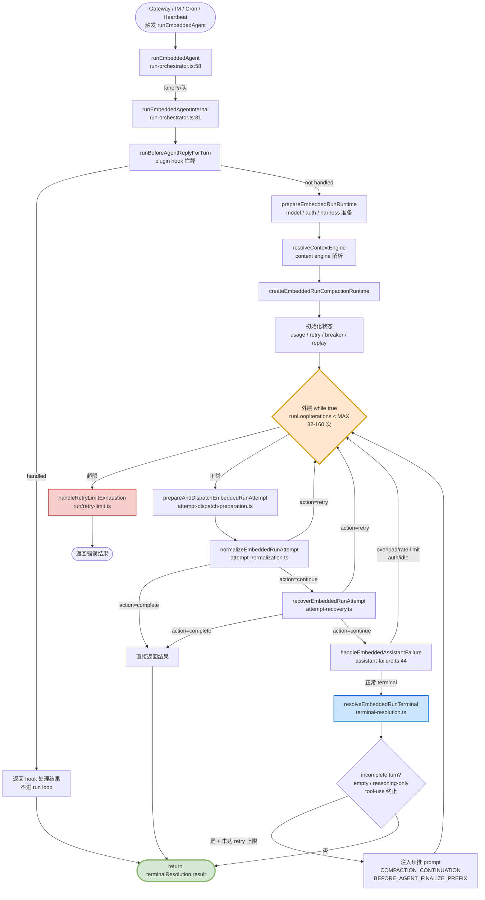
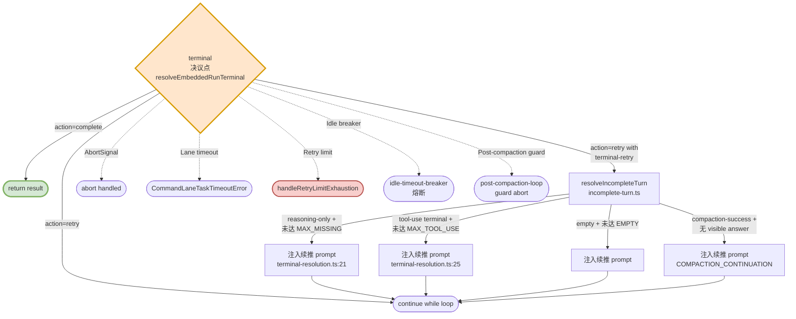
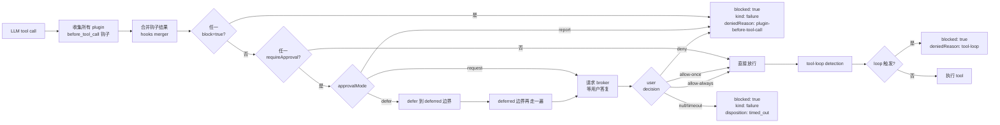

# OpenClaw — Agent Loop 调研报告

> 调研对象:`github.com/openclaw/openclaw` 仓库 `main` 分支(`git clone --depth 1` 快照,2026-07-17)
> 调研范围:仅 `OpenClaw` 一个智能体,聚焦"Agent Loop / 计划 / Sub-Agent / 退出 / Ask / HITL / 权限 / 上下文压缩"维度
> 调研日期:2026-07-18

---

## 0. 智能体一句话定位

OpenClaw 的"Agent Loop"不是单一函数,而是**三层叠加的并发体系**:

1. **Gateway daemon loop**(`startHeartbeatRunner` + `CronService.start` + `CommandQueue`)— 持续运行的进程,负责 cron、heartbeat、channel inbound、IM steering、UI 推送
2. **Per-session run loop**(`runEmbeddedAgent` → `runPreparedEmbeddedLoop`)— 每次"用户输入 → 模型推理 → 工具执行 → 输出"的单次会话,一个 `while(true)` 外层 + 多阶段状态机
3. **Tool-call inner loop**(per LLM turn)— 单次模型推理回合内,模型可能连续产出多个 tool call,OpenClaw 把它们按"as tool-call batch"执行

入口文件:`src/agents/embedded-agent-runner/run-orchestrator.ts:58` → `run-orchestrator.ts:81` → `run-orchestrator.ts:316` → `run-execution.ts:7` → `run-loop.ts:54`

> **关键认知(本次调研最重要的发现)**——OpenClaw 的 Agent Loop **不是一个"while (true) { LLM.call(); tools.run(); }"的简单 while 循环**,而是一个 **带 5 个独立状态机的多层有限状态机**:
>
> - **外层 retry loop**(`while (true)` in `run-loop.ts:275`):同一 session 内不断 retry LLM 调用(容错重试、profile rotation、模型 fallback、空响应 retry),带 `MAX_RUN_LOOP_ITERATIONS` 硬上限
> - **次层 terminal-retry state**(`terminal-retry-state.ts`):同一个 outer iteration 内,模型产出了"无可见文本 + 有 tool call"或"仅思考"或"空响应"等非终止状态时,**复用同一个 run 上下文做最多 N 次 prompt 续推**(N 由 `MAX_BEFORE_AGENT_FINALIZE_REVISIONS` / `MAX_MISSING_ASSISTANT_RETRIES` / `MAX_TOOL_USE_TERMINAL_CONTINUATIONS` 等常量限定)
> - **Compaction state**(独立 `compact.ts` + `compaction-runtime.ts`):token 超出阈值时,触发 transcript 摘要压缩,**不退出** run,而是把压缩后的 transcript 续接到 prompt 续推
> - **Lane / queue state**(独立的 `CommandQueue` + `lanes.ts` + `run-state.ts`):session lane(per-session FIFO)+ global lane(进程内全局 FIFO),实现"同 session 串行、跨 session 可并行"
> - **Steering queue state**(独立的 `commands-steer.ts` + `reply-run-registry.ts`):用户 / channel 在 LLM 推理期间发新消息时,可选择 steer / followup / collect / interrupt 四种模式注入活动 run
>
> 这五层是**正交**的(独立 Map、独立状态、独立生命周期),共同构成了 OpenClaw 的 Agent Loop 完整语义。

---

## 1. 调研依据

### 1.1 源码路径

```
C:\workspace\github\onionagent\harness\01_market_research\clone\openclaw\
```

(只读快照,未做任何修改。)

### 1.2 关键文件(已重点阅读)

| # | 文件 | 说明 |
|---|------|------|
| 1 | `src/agents/embedded-agent-runner/run-orchestrator.ts` | **核心**——`runEmbeddedAgent` 入口,组装 lane / workspace / plugin / hook(353 行) |
| 2 | `src/agents/embedded-agent-runner/run-execution.ts` | 1 行的 wrapper(`executePreparedEmbeddedRun` → `runPreparedEmbeddedLoop`) |
| 3 | `src/agents/embedded-agent-runner/run-loop.ts` | **核心**——`runPreparedEmbeddedLoop` 外层 `while (true)` retry 循环(478 行) |
| 4 | `src/agents/embedded-agent-runner/run/helpers.ts:131-148` | `resolveMaxRunRetryIterations` 算法(base 24 + perProfile 8 × profiles,min 32,max 160) |
| 5 | `src/agents/embedded-agent-runner/run/terminal-resolution.ts` | terminal 决策,retry vs complete(465 行) |
| 6 | `src/agents/embedded-agent-runner/run/terminal-retry-state.ts` | terminal retry 状态对象 |
| 7 | `src/agents/embedded-agent-runner/run/assistant-failure.ts:44` | `handleEmbeddedAssistantFailure` 错误处理路径 |
| 8 | `src/agents/embedded-agent-runner/run/idle-timeout-breaker.ts` | idle timeout 熔断器(cost-runaway breaker,#76293) |
| 9 | `src/agents/embedded-agent-runner/run/post-compaction-loop-guard.ts` | compaction 后循环保护(#77474) |
| 10 | `src/agents/embedded-agent-runner/run/failover-retry-controller.ts` | 多 profile / 多 fallback 失败重试 |
| 11 | `src/agents/embedded-agent-runner/run/compaction-runtime.ts` | compaction runtime 包装 |
| 12 | `src/agents/embedded-agent-runner/run/incomplete-turn.ts` | incomplete turn 处理(reasoning-only / empty / silent) |
| 13 | `src/agents/embedded-agent-runner/compact.ts` | **核心**——`compactEmbeddedAgentSessionDirect` 上下文压缩主流程(1921 行) |
| 14 | `src/agents/embedded-agent-runner/compact-reasons.ts` | 7 类 compaction 触发原因分类 |
| 15 | `src/agents/embedded-agent-runner/compaction-safety-timeout.ts` | compaction 自身的 safety timeout |
| 16 | `src/agents/embedded-agent-runner/compact.runtime.ts` | 异步 compaction runtime(可与 run loop 并发) |
| 17 | `src/agents/embedded-agent-runner/preemptive-compaction.ts` | 主动 compaction(在达到硬上限前) |
| 18 | `src/agents/embedded-agent-runner/tool-result-truncation.ts:45-58` | 工具结果截断(`MAX_TOOL_RESULT_CONTEXT_SHARE = 0.3`) |
| 19 | `src/agents/embedded-agent-runner/tool-result-context-guard.ts:38` | mid-turn 上下文守卫(`SINGLE_TOOL_RESULT_CONTEXT_SHARE = 0.5`) |
| 20 | `src/agents/embedded-agent-runner/run-execution.ts` | execute wrapper |
| 21 | `src/agents/embedded-agent-runner/run-state.ts` | 全局 process-local `ACTIVE_EMBEDDED_RUNS` 等 map |
| 22 | `src/agents/embedded-agent-runner/runs.ts` | 注册 / 取消 / queue / 等待 / abandon |
| 23 | `src/agents/embedded-agent-runner/lanes.ts` | global lane + session lane 解析 |
| 24 | `src/agents/embedded-agent-runner/run/lane-controller.ts` | lane controller 包装 |
| 25 | `src/agents/embedded-agent-runner/compact.hooks.ts` | compaction 前后的 hook |
| 26 | `src/agents/tools/update-plan-tool.ts` | **`update_plan` 内置工具** |
| 27 | `src/agents/openclaw-tools.ts:84,562` | 工具工厂注册 `createUpdatePlanTool` |
| 28 | `src/agents/tools/subagents-tool.ts` | **`subagents` list/cancel 内置工具** |
| 29 | `src/agents/tools/sessions-spawn-tool.ts:218` | **`sessions_spawn` 内置工具**(派生 sub-agent 的主要入口) |
| 30 | `src/agents/subagent-spawn.ts:1046` | `spawnSubagentDirect` 实现(depth / child 限制) |
| 31 | `src/agents/subagent-registry.ts` | sub-agent 注册表 |
| 32 | `src/agents/subagent-spawn-plan.ts` | sub-agent model + thinking 计划 |
| 33 | `src/agents/subagent-capabilities.ts` | sub-agent 工具能力继承 |
| 34 | `src/agents/subagent-spawn-ownership.ts` | sub-agent 完成消息归属 |
| 35 | `src/agents/subagent-depth.ts` + `subagent-spawn-plan.ts` | 深度限制(`DEFAULT_SUBAGENT_MAX_SPAWN_DEPTH`) |
| 36 | `src/agents/agent-tools.before-tool-call.ts:780-1193` | **核心**——`before_tool_call` hook + approval flow + 工具前拦截 |
| 37 | `src/agents/agent-tools.before-tool-call.ts:1218-1252` | `resolveBeforeToolCallApprovalOutcome` 三模式(request / report / defer) |
| 38 | `src/infra/embedded-plugin-approval-broker.ts` | 进程内 approval broker(嵌入式模式) |
| 39 | `src/infra/plugin-approvals.ts` | approval 类型定义 |
| 40 | `src/plugins/hook-before-tool-call-result.ts` | `PluginApprovalResolutions`(`ALLOW_ONCE`/`ALLOW_ALWAYS`/`DENY`/`TIMEOUT`/`CANCELLED`) |
| 41 | `src/agents/tool-loop-detection.ts` | 工具循环检测(4 类 detector + circuit breaker) |
| 42 | `src/agents/tool-loop-detection-config.ts` | loop detection 配置解析 |
| 43 | `src/agents/tools-effective-inventory.ts` | 工具清单(allowlist / denylist / 匹配) |
| 44 | `src/agents/inherited-tool-deny.ts` | sub-agent 工具继承策略 |
| 45 | `src/infra/heartbeat-runner.ts:2375-2522` | `startHeartbeatRunner` daemon 调度 |
| 46 | `src/auto-reply/heartbeat.ts:17-23` | `HEARTBEAT_PROMPT` / `heartbeat_respond` 工具提示 |
| 47 | `src/auto-reply/heartbeat-tool-response.ts` | `heartbeat_respond` 工具(turn-by-turn 反馈) |
| 48 | `src/cron/service.ts` | cron service facade |
| 49 | `src/cron/service/ops.ts:155-272` | `start` / `armTimer` cron 调度入口 |
| 50 | `src/auto-reply/reply/commands-steer.ts:1-30,146-200` | `/steer` slash 命令 + 注入到活动 run |
| 51 | `src/auto-reply/reply/reply-run-registry.ts` | 另一种 run handle(纯 reply) |
| 52 | `src/auto-reply/reply/agent-runner.ts` | 高层 agent turn 入口 |
| 53 | `src/auto-reply/reply/agent-runner-embedded-candidate.ts` | 嵌入式 agent 选择路径 |
| 54 | `src/process/command-queue.ts` | 进程内 lane-based 任务队列 |
| 55 | `src/process/lanes.ts` | lane 名常量(`CommandLane`) |
| 56 | `src/routing/resolve-route.ts` | 多 agent 路由(peer/account/channel → agentId) |
| 57 | `src/routing/session-key.ts` | session key 解析(`agent:<agentId>:<...>`) |
| 58 | `src/agents/workspace.ts:45-51` | 8 个 bootstrap 文件名常量 |
| 59 | `src/agents/bootstrap-files.ts` | bootstrap 文件加载 |
| 60 | `src/agents/embedded-agent-runner/abort.ts` | abort error 识别 |

### 1.3 关键文档(已重点阅读)

| # | 文档 | 说明 |
|---|------|------|
| 1 | `docs/concepts/agent-loop.md` | **核心**——官方 agent loop 完整生命周期文档(lane / queue / hook / 退出 / timeouts) |
| 2 | `docs/concepts/queue.md` | Command Lane 队列机制 |
| 3 | `docs/concepts/queue-steering.md` | **核心**——steering queue(steer / followup / collect / interrupt 四模式) |
| 4 | `docs/concepts/multi-agent.md` | 多 agent 隔离(bindings 路由) |
| 5 | `docs/concepts/agent.md` | agent 概念总览 |
| 6 | `docs/concepts/compaction.md` | 上下文压缩(待补) |
| 7 | `docs/concepts/agent-workspace.md` | workspace + bootstrap(file_backend.md 已确认) |
| 8 | `docs/concepts/session.md` | session 存储位置 |
| 9 | `docs/concepts/retry.md` | retry 策略 |
| 10 | `README.md:266-270` | workspace + skills 概要 |

### 1.4 关键文件清单(用于 Onion Agent 选型参考)

> "源码阅读清单"——本次调研已系统读过的、最具参考价值的 20 个文件:

```
1.  src/agents/embedded-agent-runner/run-orchestrator.ts            # 入口
2.  src/agents/embedded-agent-runner/run-execution.ts                # wrapper
3.  src/agents/embedded-agent-runner/run-loop.ts                    # 主 loop
4.  src/agents/embedded-agent-runner/run/helpers.ts                 # max iterations 算法
5.  src/agents/embedded-agent-runner/run/terminal-resolution.ts     # 退出决策
6.  src/agents/embedded-agent-runner/run/incomplete-turn.ts         # reasoning-only / empty
7.  src/agents/embedded-agent-runner/run/assistant-failure.ts       # 错误处理
8.  src/agents/embedded-agent-runner/compact.ts                     # 压缩主流程
9.  src/agents/embedded-agent-runner/compact-reasons.ts             # 7 类触发原因
10. src/agents/embedded-agent-runner/compact.runtime.ts             # 异步压缩
11. src/agents/embedded-agent-runner/tool-result-truncation.ts      # 工具结果截断
12. src/agents/embedded-agent-runner/tool-result-context-guard.ts   # mid-turn 守卫
13. src/agents/embedded-agent-runner/run-state.ts                   # 全局状态
14. src/agents/embedded-agent-runner/lanes.ts                       # lane 解析
15. src/agents/embedded-agent-runner/run/lane-controller.ts         # lane 控制器
16. src/agents/tools/update-plan-tool.ts                            # update_plan 工具
17. src/agents/tools/sessions-spawn-tool.ts                         # sessions_spawn 工具
18. src/agents/subagent-spawn.ts                                    # spawn 实现
19. src/agents/agent-tools.before-tool-call.ts                      # approval flow
20. src/infra/embedded-plugin-approval-broker.ts                    # approval broker
21. src/infra/heartbeat-runner.ts                                   # heartbeat daemon
22. src/cron/service/ops.ts                                         # cron daemon
23. src/auto-reply/reply/commands-steer.ts                          # /steer 命令
24. src/process/command-queue.ts                                    # 任务队列
25. src/routing/resolve-route.ts                                    # 多 agent 路由
26. src/routing/session-key.ts                                      # session key 解析
27. docs/concepts/agent-loop.md                                     # 官方文档
28. docs/concepts/queue-steering.md                                 # steering 文档
```

---

## 2. 九大问题回答

### Q1. Agent Loop 主流程

#### 1.1 是否有 Agent Loop

**是**。OpenClaw 有完整的多层 Agent Loop,主循环位于 `src/agents/embedded-agent-runner/run-loop.ts:54` 的 `runPreparedEmbeddedLoop`,外层是 `while (true)` retry 循环(`run-loop.ts:275`)。

#### 1.2 主流程

```typescript
// run-loop.ts:54-78 (entry)
export async function runPreparedEmbeddedLoop(
  input: PreparedEmbeddedRunInput,
): Promise<EmbeddedAgentRunResult> {
  // 1. 准备 runtime(model, auth, profile, plugin harness, etc.)
  const preparedRuntime = await prepareEmbeddedRunRuntime({...});
  // 2. 解析 context engine (用于工具结果截断 / 上下文预算)
  const contextEngine = await resolveContextEngine(params.config, {...});
  // 3. 创建 compaction runtime
  const compactionRuntime = createEmbeddedRunCompactionRuntime({...});
  // 4. 初始化状态对象(usage / retry / timeout breaker / replay state)
  let runLoopIterations = 0;
  let lastRetryFailoverReason: FailoverReason | null = null;
  let codexAppServerRecoveryRetries = 0;
  let emptyErrorRetries = 0;
  // 5. ★★★ 主循环 ★★★
  while (true) {
    refreshPreparedRuntimeSnapshot();
    if (runLoopIterations >= MAX_RUN_LOOP_ITERATIONS) { ... }
    runLoopIterations += 1;
    // 5.1 准备 + 分发一次 attempt
    const dispatch = await prepareAndDispatchEmbeddedRunAttempt({...});
    // 5.2 归一化结果(retry vs complete vs other)
    const normalizedAttempt = await normalizeEmbeddedRunAttempt({...});
    if (normalizedAttempt.action === "complete") return normalizedAttempt.result;
    if (normalizedAttempt.action === "retry") continue;  // ★ retry 不退出 ★
    // 5.3 恢复策略(profile rotation / model fallback / codex recovery)
    const recovery = await recoverEmbeddedRunAttempt({...});
    if (recovery.action === "complete") return recovery.result;
    if (recovery.action === "retry") continue;
    // 5.4 assistant failure 处理(overload / rate-limit / auth / idle timeout)
    const assistantFailureOutcome = await handleEmbeddedAssistantFailure({...});
    if (assistantFailureOutcome.action === "retry") continue;
    // 5.5 ★ terminal 终态决策 ★
    const terminalResolution = await resolveEmbeddedRunTerminal({...});
    if (terminalResolution.action === "retry") continue;
    return terminalResolution.result;  // ★ 唯一彻底退出点 ★
  }
}
```

每次 outer iteration 内部(`normalizedAttempt` 之后,`terminal` 之前),还会触发**同一 run 内的 terminal-retry state 续推**——这由 `resolveEmbeddedRunTerminal` 在 `terminal-resolution.ts` 内做决策:

- **Empty / reasoning-only turn** → 同 run 内 N 次 prompt 续推(`MAX_MISSING_ASSISTANT_RETRIES = 1`、`MAX_TOOL_USE_TERMINAL_CONTINUATIONS = 1`)
- **Compaction-success 后没有 visible answer** → 注入 `COMPACTION_CONTINUATION_RETRY_INSTRUCTION`(`terminal-resolution.ts:21`)续推
- **Tool use 终止 + 仍有未执行 tool call** → 注入 `BEFORE_AGENT_FINALIZE_RETRY_PROMPT_PREFIX`(`terminal-resolution.ts:25-26`)续推
- **所有 retry 耗尽** → 才 `complete`

#### 1.3 Mermaid 流程图



#### 1.4 关键设计点

- **外层 retry 是同 session 同 runId 的"硬重试"**,不丢失 transcript、不重建 session、不重发消息
- **每次 outer iteration = 一次 LLM call** = 一次完整 prompt 准备 + 一次流式响应 + 一次 terminal 评估
- **MAX_RUN_LOOP_ITERATIONS 算法**(`run/helpers.ts:131-148`):
  ```typescript
  const BASE_RUN_RETRY_ITERATIONS = 24;
  const RUN_RETRY_ITERATIONS_PER_PROFILE = 8;
  const MIN_RUN_RETRY_ITERATIONS = 32;
  const MAX_RUN_REOP_ITERATIONS = 160;
  // scaled = base + max(1, profileCandidateCount) * perProfile
  // return clamp(scaled, [minLimit, maxLimit])
  ```
  即:**最少 32 次,最多 160 次**,base 24 + 每个 profile candidate 加 8
- **5 类 retry 维度**(可叠加):
  1. **Profile rotation**(`failover-retry-controller.ts`):auth profile 失败换下一个
  2. **Model fallback**:`runWithModelFallback` → 同 model 失败时换 fallback 列表中下一个
  3. **Empty response**:`DEFAULT_EMPTY_RESPONSE_RETRY_LIMIT` 次
  4. **Reasoning-only**:`DEFAULT_REASONING_ONLY_RETRY_LIMIT` 次
  5. **Tool use terminal continuation**:`MAX_TOOL_USE_TERMINAL_CONTINUATIONS = 1` 次

---

### Q2. Plan 计划机制

#### 2.1 是否有 plan 功能

**是**。OpenClaw 内置 `update_plan` 工具(类似 Claude Code / Amp 的 plan mode 工具)。

#### 2.2 计划存放位置

**不存放在文件,不存放在 session transcript 之外的独立 state,而是存在 tool call details 里**(随 transcript 持久化):

```typescript
// src/agents/tools/update-plan-tool.ts:84-105
execute: async (_toolCallId, args) => {
  const params = args as Record<string, unknown>;
  const explanation = readStringParam(params, "explanation");
  const plan = readPlanSteps(params);
  return {
    content: [],                          // ★ 不返回 content(避免污染 LLM context) ★
    details: {                            // ★ details 给 UI / transcript consumer ★
      status: "updated" as const,
      ...(explanation ? { explanation } : {}),
      plan,                               // 数组: { step, status }[]
    },
  };
},
```

**关键设计**:
- `content: []` —— **不把计划回显给模型**,避免无意义的 token 消耗
- `details` —— UI / TUI / Web UI / 测试 snapshot 读取
- 验证规则(`update-plan-tool.ts:53-59`):
  - `status` 必须是 `"pending" | "in_progress" | "completed"`
  - **最多 1 个 `in_progress`** step("Multiple in-progress steps make progress state ambiguous for UI and transcript consumers")
  - `plan` 数组必须非空

#### 2.3 模型如何更新/加载计划

**没有"加载"语义**——计划是**单向 push to UI**,不是从 UI pull:

1. 模型在 LLM response 中决定调用 `update_plan`
2. `updatePlanTool.execute()` 解析 + 校验
3. 写到 tool result details → 通过 `subscribeEmbeddedAgentSession` 桥接(`docs/concepts/agent-loop.md:90`)到 `stream: "tool"` 事件
4. UI / TUI 收到 `tool` 流事件后渲染当前 plan
5. 模型**不再重新"读取"计划**——它的状态完全在 LLM 自己的 context 里

#### 2.4 是否有 update_plan 内置工具

**有**。`src/agents/tools/update-plan-tool.ts:108` 的 `createUpdatePlanTool()`,由 `src/agents/openclaw-tools.ts:84` import 并在 `openclaw-tools.ts:562` 通过 `includeUpdatePlanTool` 开关条件注册。

**没有"plan 强制模式"**(强制模型必须先 update_plan 才能执行 tool)——这是"软提示",不是 hard gate。

#### 2.5 Code 证据

```typescript
// src/agents/tools/update-plan-tool.ts:42-46
const PLAN_STEP_STATUSES = ["pending", "in_progress", "completed"] as const;
// src/agents/tools/update-plan-tool.ts:48-65 (TypeBox schema)
const UpdatePlanToolSchema = Type.Object({
  explanation: Type.Optional(Type.String({...})),
  plan: Type.Array(Type.Object({
    step: Type.String({ description: "Short step." }),
    status: stringEnum(PLAN_STEP_STATUSES, {...}),
  }, { additionalProperties: true }), { minItems: 1, description: "Ordered steps; max one in_progress." }),
});
// src/agents/openclaw-tools.ts:84
import { createUpdatePlanTool } from "./tools/update-plan-tool.js";
// src/agents/openclaw-tools.ts:562
...(includeUpdatePlanTool ? [createUpdatePlanTool()] : []),
```

---

### Q3. Sub Agent

#### 3.1 是否有 sub agent 功能

**是,功能非常完整**。OpenClaw 有两个层次的 sub-agent 工具:

| 工具 | 作用 | 文件 |
|------|------|------|
| **`sessions_spawn`** | 派生 sub-agent / ACP session 干活(主要入口) | `tools/sessions-spawn-tool.ts:218` |
| **`subagents`** | list/cancel 当前 session 树上的 background work | `tools/subagents-tool.ts:90` |
| **`sessions_list` / `sessions_history` / `sessions_search`** | session 管理(列历史、搜消息) | `openclaw-tools.ts:563-575` |
| **`conversations_list` / `conversations_send` / `conversations_turn`** | 跨对话通信 | `openclaw-tools.ts:585-599` |

#### 3.2 如何实现

**核心实现**:`src/agents/subagent-spawn.ts:1046` 的 `spawnSubagentDirect` + `subagent-registry.ts` 的注册表

```typescript
// src/agents/subagent-spawn.ts:1046 (主入口)
export async function spawnSubagentDirect(
  params: SpawnSubagentParams,
  ctx: SpawnSubagentContext,
): Promise<SpawnSubagentResult> {
  // 1. 校验 taskName + agentId 合法性
  // 2. 解析 spawn mode: "run" (one-shot) | "session" (持久)
  //    - mode="session" 必须配合 thread=true
  // 3. 解析 cleanup: "keep" (默认) | "delete"
  // 4. ★ depth 限制检查 ★
  const callerDepth = getSubagentDepthFromSessionStore(requesterInternalKey, { cfg });
  const maxSpawnDepth = cfg.agents?.defaults?.subagents?.maxSpawnDepth
                      ?? DEFAULT_SUBAGENT_MAX_SPAWN_DEPTH;  // 默认值(在 subagent-spawn.ts 顶部)
  if (callerDepth >= maxSpawnDepth) {
    return { status: "forbidden", error: `... current depth: ${callerDepth}, max: ${maxSpawnDepth}` };
  }
  // 5. ★ 子 agent 数量限制 ★
  const maxChildren = cfg.agents?.defaults?.subagents?.maxChildrenPerAgent
                   ?? DEFAULT_SUBAGENT_MAX_CHILDREN_PER_AGENT;
  const activeChildren = countActiveRunsForSession(requesterInternalKey);
  if (activeChildren >= maxChildren) {
    return { status: "forbidden", error: `... ${activeChildren}/${maxChildren}` };
  }
  // 6. 准备 model + thinking 计划
  const { model, thinking } = resolveSubagentModelAndThinkingPlan({...});
  // 7. 派生子 session(fork session entry)
  const childSession = await forkSessionEntryFromParent({...});
  // 8. 注册到 subagent registry(用于 list/cancel)
  registerSubagentRun({...});
  // 9. 启动 child run(独立 run loop,独立 sessionId)
  return await dispatchSubagentRun({...});
}
```

#### 3.3 sub-agent 的"是否独立 run loop"问题

**完全独立**。每个 sub-agent 跑**自己的 `runEmbeddedAgent`**,有:
- 自己的 `sessionId`
- 自己的 `runId`
- 自己的 `lane`
- 自己的 prompt 上下文
- 自己的 tool policy(通过 `inheritedToolAllowlist` / `inheritedToolDenylist` 继承父 agent 的 `subagent-spawn.ts:38-46`)

**完成消息回传机制**(`subagent-announce.ts` 整目录):sub-agent 完成后,registry 派发 announce 到父 agent 的 turn,通过 `subagent-announce-delivery.ts` 的 channel-aware 投递。

#### 3.4 工具还是 skill

**内置工具**(built-in tool),不是 third-party skill。注册方式:
- 工厂函数 `createSessionsSpawnTool` + `createSubagentsTool` 写在 `src/agents/tools/`
- 由 `src/agents/openclaw-tools.ts:79,84` import
- 在 `openclaw-tools.ts:292-599` 的 `createOpenClawTools` 中按 `includeXxx` 开关条件注册

#### 3.5 Code 证据

```typescript
// src/agents/openclaw-tools.ts:79,84
import { createSubagentsTool } from "./tools/subagents-tool.js";
import { createUpdatePlanTool } from "./tools/update-plan-tool.js";
// src/agents/tools/sessions-spawn-tool.ts:218,246
export function createSessionsSpawnTool(opts?: {...}): AnyAgentTool {
  return {
    label: "Sessions",
    name: "sessions_spawn",                  // ★ 工具名 ★
    displaySummary: ...,
    description: describeSessionsSpawnTool({...}),
    parameters: createSessionsSpawnToolSchema({...}),
    execute: async (_toolCallId, args) => { ... }
  };
}
// src/agents/tools/subagents-tool.ts:90
export function createSubagentsTool(opts?: SubagentsToolOptions): AnyAgentTool {
  return {
    label: "Subagents",
    name: "subagents",                       // ★ 工具名 ★
    description: "Background work: subagents, media gen, cron runs. list/cancel.",
    parameters: SubagentsToolSchema,
    execute: async (_toolCallId, args) => { ... }
  };
}
```

#### 3.6 已知约束

- **ACP runtime 是另一种 sub-agent 入口**(`sessions-spawn-tool.ts:43`)——通过 `runtime: "acp"` 走 `spawnAcpDirect`,这是接外部 Claude Code / Codex 的非 OpenClaw-native sub-agent
- **深度限制**是进程级(`subagent-depth.ts`),不是单 run 限制——避免递归 spawn
- **每个 session 的子 agent 数限制**避免 fan-out 爆炸

---

### Q4. Loop 退出机制

#### 4.1 退出条件分类

OpenClaw 的"退出"是**多级的**,不是单一"模型说 done 就退出":

| 退出路径 | 触发条件 | 文件:行 |
|----------|----------|---------|
| **Terminal return** | terminal 评估后,既无 retry 也无 continuation,返回结果 | `run-loop.ts:466` |
| **Retry limit** | `runLoopIterations >= MAX_RUN_LOOP_ITERATIONS`(32-160) | `run-loop.ts:277-303` |
| **User abort** | `abortEmbeddedAgentRun(sessionId)` 被调用 | `runs.ts:368-433` |
| **Lane timeout** | task budget / progress-idle / abort-grace 触发 `CommandLaneTaskTimeoutError` | `command-queue.ts:42-79` |
| **Agent timeout** | `agents.defaults.timeoutSeconds`(默认 172800s = 48h) | `docs/concepts/agent-loop.md:177` |
| **Model idle timeout** | Cloud 120s / self-hosted 300s 内无 chunk | `docs/concepts/agent-loop.md:177` |
| **Compaction retry aggregate timeout** | 压缩超时 | `compaction-retry-aggregate-timeout.ts` |
| **Tool loop circuit breaker** | 30 次相同 tool call 无进展 | `tool-loop-detection.ts:46` |
| **Post-compaction loop guard** | 压缩后立即又出现同 tool 循环(#77474) | `post-compaction-loop-guard.ts` |
| **Stuck session recovery** | `diagnostics.stuckSessionAbortMs` 后无进展 | `docs/concepts/agent-loop.md:177-200` |
| **Cost-runaway breaker** | idle timeout breaker(#76293) | `run-loop.ts:188-192` + `idle-timeout-breaker.ts` |
| **Gateway disconnect** | RPC timeout / 客户端断开 | `docs/concepts/agent-loop.md:215-220` |
| **`agent.wait` timeout** | 只停止等待,不停止 run | `docs/concepts/agent-loop.md:215` |

#### 4.2 完整退出决策树



#### 4.3 终态决策代码(`terminal-resolution.ts`)

`resolveEmbeddedRunTerminal` 是**唯一决定"是否真的 return"** 的地方(`run-loop.ts:457`)。它基于:
- `attempt.terminalOutcome`(`terminalOutcome.ts`):本 attempt 是否已正常完成
- `terminalAborted` / `terminalTimedOut` / `terminalInterrupted`:外部信号
- `attemptCompactionCount`:本 run 内 compaction 次数
- `maxReasoningOnlyRetryAttempts` / `maxEmptyResponseRetryAttempts` / `MAX_BEFORE_AGENT_FINALIZE_REVISIONS`

返回 `action: "complete"` → 退出;`action: "retry"` → 继续外层 while。

#### 4.4 关键设计点

- **`MAX_RUN_LOOP_ITERATIONS = clamp(24 + 8 × profileCount, 32, 160)`**(`run/helpers.ts:131-148`):防止无限 retry 烧钱 / 烧 token
- **Idle timeout breaker** 是**跨 outer iteration 共享的状态**(`run-loop.ts:188-192` 注释),`wrapper-local counter 会重置`——这是反例:`cost-runaway` 防护必须 process-local
- **Post-compaction loop guard** 防止"压缩后立刻又死循环同 tool call"(#77474)
- **Lane timeout** 是**独立进程内定时器**,不依赖 agent loop 自身——`command-queue.ts:42-79`

---

### Q5. Ask 模式(向用户提问)

#### 5.1 是否支持

**严格意义的"向用户弹选项让用户选"的 ask 工具——没有**。OpenClaw **没有"ask_user"或"question"工具**(对比 Claude Code 的 `AskUserQuestion` / Cline 的 `ask_followup_question`)。

#### 5.2 替代机制

但 OpenClaw 有**更细粒度的 approval flow**,机制在 `src/agents/agent-tools.before-tool-call.ts` + `src/infra/embedded-plugin-approval-broker.ts` + `src/plugins/hook-before-tool-call-result.ts`:

```typescript
// src/plugins/hook-before-tool-call-result.ts:1-31
export const PluginApprovalResolutions = {
  ALLOW_ONCE: "allow-once",
  ALLOW_ALWAYS: "allow-always",
  DENY: "deny",
  TIMEOUT: "timeout",
  CANCELLED: "cancelled",
} as const;

export type PluginHookBeforeToolCallResult = {
  params?: Record<string, unknown>;
  block?: boolean;
  blockReason?: string;
  requireApproval?: {                    // ★ 关键:任意 plugin hook 可要求"先问用户" ★
    title: string;
    description: string;
    severity?: "info" | "warning" | "critical";
    timeoutMs?: number;
    timeoutBehavior?: "allow" | "deny";  // (deprecated, 永远 fail-closed on timeout)
    timeoutReason?: string;
    allowedDecisions?: Array<"allow-once" | "allow-always" | "deny">;
    pluginId?: string;
    onResolution?: (decision: PluginApprovalResolution) => Promise<void> | void;
  };
};
```

#### 5.3 三种 approval 模式

`src/agents/agent-tools.before-tool-call.ts:222`:

```typescript
type HookContext = {
  approvalMode?: "request" | "report" | "defer";
};
```

- **`request`**:弹 prompt 等用户决定 → 阻塞到 timeout / 取消 / 用户答复
- **`report`**:不阻塞,**记录 audit 日志**直接拒绝
- **`defer`**:延迟到 `requestDeferredPluginToolApproval`,在 deferred 边界再决定

#### 5.4 实现

`requestPluginToolApproval`(`agent-tools.before-tool-call.ts:954-1067`):

1. **嵌入式模式**(`isEmbeddedMode()`):用 `EmbeddedPluginApprovalBroker`(`infra/embedded-plugin-approval-broker.ts`)——一个进程内的事件 broker
2. **Gateway 模式**:用 RPC `callGatewayTool("plugin.approval.request", ...)` 调到 gateway 端
3. **两阶段协议**:
   - `request`:发起请求(带 `id` + `timeoutMs`)
   - `waitDecision`:等用户回(可被 abort signal 中断)
4. **broker 内部**(`embedded-plugin-approval-broker.ts:50-78`):
   ```typescript
   async request(params: { request, timeoutMs, signal? }): Promise<{id, decision}> {
     const id = `plugin:${randomUUID()}`;
     // ...
     const timer = setTimeout(() => { ... resolve(null); }, timeoutMs);
     timer.unref?.();
     // 挂到 listeners
     this.emit({ event: "plugin.approval.requested", payload: record });
     try {
       return { id, decision: await decision };
     }
   }
   ```
5. **TUI 订阅** `broker.subscribe(listener)` 收到 `requested` 事件后,渲染 confirm UI,用户点选 → 调 `broker.resolve(id, "allow-once" | "allow-always" | "deny")`

#### 5.5 Code 证据

```typescript
// src/agents/agent-tools.before-tool-call.ts:954-990
async function requestPluginToolApproval(params: {
  approval: PluginApprovalRequest;
  toolName: string;
  toolCallId?: string;
  ctx?: HookContext;
  signal?: AbortSignal;
  baseParams: unknown;
  overrideParams?: unknown;
}): Promise<HookOutcome> {
  // ...
  const embeddedApprovalBroker = isEmbeddedMode() ? getEmbeddedPluginApprovalBroker() : null;
  if (embeddedApprovalBroker) {
    const result = await embeddedApprovalBroker.request({...});
    const decision = result.decision;
    const resolution = resolvePermittedPluginApprovalResolution(decision, allowedDecisions);
    // ALLOW_ONCE / ALLOW_ALWAYS → 放行
    // DENY → blocked, disposition: "blocked"
    // null (timeout) → blocked, disposition: "timed_out"
    // ...
  }
}
```

#### 5.6 已知限制

- **`timeoutBehavior: "allow"` 已 deprecated**(`agent-tools.before-tool-call.ts:856-868`)——为了安全,**unresolved approval 永远 fail-closed on timeout**(`warnDeprecatedApprovalTimeoutBehavior`)
- **`timeoutReason`** 字段可以**自定义 timeout 文案**,把超时当作 `veto` 而非 `failure`
- **没有"用户多选题"语义**——只有 "允许一次 / 永远允许 / 拒绝" 三个选项

---

### Q6. Human-in-the-Loop (HITL)

#### 6.1 用户如何干预 agent 行为

OpenClaw 提供 **5 种 HITL 入口**,从"轻"到"重"分级:

| 入口 | 粒度 | 延迟 | 文件 |
|------|------|------|------|
| **`/steer <message>` slash 命令** | 注入到当前活动 run 的下一个 model boundary | 即时(`docs/concepts/queue-steering.md:11-25`) | `auto-reply/reply/commands-steer.ts:27,146-200` |
| **Inbound IM 消息** (steer 模式) | 注入到当前活动 run | 即时 | `runs.ts:287-333` + `queue-steering.md:30-40` |
| **Inbound IM 消息** (interrupt 模式) | 终止当前 run,开新 run | 即时 | `queue-steering.md:30` |
| **Tool approval prompt** | 工具调用前阻塞询问 | 阻塞到 timeout | `agent-tools.before-tool-call.ts:954-1067` |
| **`/stop` / `abort` RPC** | 终止当前 run,丢弃结果 | 即时 | `runs.ts:368-433` + `docs/concepts/agent-loop.md:215-220` |
| **Lane timeout (auto)** | 进程内 timeout | `taskBudgetMs` 后 | `command-queue.ts:42-79` |

#### 6.2 `/steer` 实现细节

`auto-reply/reply/commands-steer.ts:146-200`:

```typescript
// commands-steer.ts:146
const unauthorized = rejectUnauthorizedCommand(params, "/steer");
// commands-steer.ts:160
if (!resolved) {
  // "steer: no current session; continuing with /steer payload as a normal prompt"
  return { shouldContinue: true, reply: { text: "..." } };
}
// commands-steer.ts:174
const queued = await queueEmbeddedAgentMessageWithOutcomeAsync(sessionId, payload, {
  steeringMode: "all",    // ★ 注入到下一个 model boundary ★
});
// commands-steer.ts:184-199
if (!queued.queued) {
  return { shouldContinue: true, reply: { text: "..." } };
}
return { shouldContinue: false, reply: { text: "steered current session." } };
```

#### 6.3 注入边界(steering 文档定义)

`docs/concepts/queue-steering.md:11-25`:
```
1. The assistant asks for tool calls.
2. OpenClaw executes the current assistant message's tool-call batch.
3. OpenClaw emits the turn end event.
4. OpenClaw drains queued steering messages.    ★ 注入点 ★
5. OpenClaw appends those messages as user messages before the next LLM call.
```

**关键**:steering **不打断正在运行的 tool call**——在 tool batch 完成 + turn end 后才注入,保证 tool_result 配对完整。

#### 6.4 `/stop` / abort 实现

`src/agents/embedded-agent-runner/runs.ts:368-433` 的 `abortEmbeddedAgentRun`:

```typescript
export function abortEmbeddedAgentRun(sessionId: string): boolean {
  const handle = ACTIVE_EMBEDDED_RUNS.get(sessionId);
  if (!handle) {
    if (abortReplyRunBySessionId(sessionId)) return true;
    return false;
  }
  if (!isEmbeddedRunHandleAbortable(sessionId, handle)) return false;
  handle.abort(opts?.reason);  // ★ 调到 handle 内部 abort ★
  return true;
}
```

`handle.abort()` 触发 `AbortController.abort()`,所有正在 await 的 LLM stream / tool execution / 压缩都会因 `signal.aborted` 抛 AbortError(`abort.ts:5-13` 的 `isRunnerAbortError` 识别)。

#### 6.5 等活动 run 结束 / 强清

`runs.ts:560-630`:
- `waitForEmbeddedAgentRunEnd(sessionId, timeoutMs)`:等 run 正常结束
- `abortAndDrainEmbeddedAgentRun({ sessionId, forceClear, reason })`:abort + 等结束 + 必要时强清
- `forceClearEmbeddedAgentRun`:`ACTIVE_EMBEDDED_RUNS.delete(...)` + `notifyEmbeddedRunEnded(...)`,可被 stuck session recovery 路径调用

#### 6.6 等待者(waiter)机制

`runs.ts:480-520`:
- `EMBEDDED_RUN_WAITERS: Map<sessionId, Set<{resolve, timer?}>>`
- `clearActiveEmbeddedRun` → `notifyEmbeddedRunEnded` → 调所有 waiter 的 `resolve(true)`
- 用途:`agent.wait` RPC、stuck recovery、`/stop` 等待 drain

#### 6.7 Code 证据汇总

```typescript
// runs.ts:287 (queue 入口)
export function queueEmbeddedAgentMessageWithOutcome(
  sessionId: string,
  text: string,
  options?: EmbeddedAgentQueueMessageOptions,  // 含 steeringMode
): EmbeddedAgentQueueMessageOutcome
// runs.ts:328 (async 版本,带 image 支持 + transcript commit wait)
export async function queueEmbeddedAgentMessageWithOutcomeAsync(...): Promise<...>
// runs.ts:368 (abort)
export function abortEmbeddedAgentRun(sessionId: string): boolean
// runs.ts:560 (wait)
export async function waitForEmbeddedAgentRunEnd(
  sessionId: string,
  timeoutMs: number | null = 15_000,
): Promise<boolean>
```

---

### Q7. 工具调用权限

#### 7.1 三种权限(永远同意/模型判断/永远不允许)对应实现

OpenClaw 实现了**完整 3 模式 + 1 hardening**,不是简单 allow/deny 二元:

| 模式 | 含义 | 触发方式 | 文件:行 |
|------|------|----------|---------|
| **`allow-once`** | 本次放行,下次再问 | 用户在 approval prompt 点 "Allow Once" | `hook-before-tool-call-result.ts:5` |
| **`allow-always`** | 永远放行(per-tool / per-policy) | 用户点 "Always Allow" | `hook-before-tool-call-result.ts:6` |
| **`deny`** | 拒绝 + 终止调用 | 用户点 "Deny" / hook 返回 `block: true` | `hook-before-tool-call-result.ts:7` |
| **`timeout`(hardening)** | **永远 fail-closed**,不放过 | 超过 `timeoutMs` 仍无答复 | `agent-tools.before-tool-call.ts:856-868` |
| **`cancelled`(hardening)** | 取消 + abort 通知 | run 被 abort(`signal.aborted`) | `agent-tools.before-tool-call.ts:1067-1083` |

#### 7.2 三层策略叠加

OpenClaw 的工具权限是**3 层 + 1 plugin hook 注入**:

1. **第 1 层:静态 allowlist / denylist**(`src/agents/tools-effective-inventory.ts`)
   ```typescript
   // openclaw-tools.ts:438-439
   allowlist: explicitFactoryAllowlist,
   denylist: explicitFactoryDenylist,
   ```
   - 由 `createOpenClawTools` factory 接收的 `options.policy`
   - `tools-effective-inventory.ts` 配 `tool-policy-match.ts` 做匹配

2. **第 2 层:运行时 sandbox 工具策略**(`sandbox-tool-policy.ts`)
   - sandboxed agent 在 Docker 内只能调用 allowlist 子集
   - 跨 sub-agent 继承:`inherited-tool-deny.ts` 限制 `subagent` runtime 工具

3. **第 3 层:Tool loop detection**(`tool-loop-detection.ts`)
   - 4 类 detector:`genericRepeat` / `unknownToolRepeat` / `knownPollNoProgress` / `pingPong` / `globalCircuitBreaker`(20 / 30 次)
   - 触发后:`HookOutcome { blocked: true, deniedReason: "tool-loop" }`

4. **第 4 层(用户级):`before_tool_call` plugin hook + approval**
   - 任意 plugin 可返回 `requireApproval` 触发 approval prompt
   - 任意 plugin 可返回 `block: true` 直接拒绝
   - 多个 hook 的合并规则(`hooks.before-tool-call.test.ts:46-188`):
     - `requireApproval`:**first hook with requireApproval wins**
     - `block`:**first block stops lower-priority handlers**
     - `block: false` **不**清除前序 block(no-op)

#### 7.3 approval timeout fail-closed 行为

```typescript
// agent-tools.before-tool-call.ts:856-868 (deprecated 警告)
function warnDeprecatedApprovalTimeoutBehavior(approval: PluginApprovalRequest): void {
  if (approval.timeoutBehavior !== "allow") return;
  const pluginId = approval.pluginId ?? "unknown-plugin";
  if (warnedDeprecatedTimeoutBehaviorPluginIds.has(pluginId)) return;
  warnedDeprecatedTimeoutBehaviorPluginIds.add(pluginId);
  log.warn(
    `plugin '${pluginId}' sets deprecated requireApproval.timeoutBehavior:"allow"; ` +
    `the field is ignored and approvals fail closed on timeout ...`,
  );
}
```

**关键安全保证**:`timeoutBehavior: "allow"` 永远被忽略,timeout 一定走 `PluginApprovalResolutions.TIMEOUT` → blocked + disposition: "timed_out"。

#### 7.4 工具前拦截完整流程



#### 7.5 Code 证据汇总

```typescript
// src/plugins/hook-before-tool-call-result.ts:3-9
export const PluginApprovalResolutions = {
  ALLOW_ONCE: "allow-once",
  ALLOW_ALWAYS: "allow-always",
  DENY: "deny",
  TIMEOUT: "timeout",
  CANCELLED: "cancelled",
} as const;
// src/agents/agent-tools.before-tool-call.ts:197-206
function resolvePluginToolApprovalTimeoutMs(approval: PluginApprovalRequest): number {
  if (typeof approval.timeoutMs !== "number" || !Number.isFinite(approval.timeoutMs) || approval.timeoutMs <= 0) {
    return 0;
  }
  return Math.min(Math.floor(approval.timeoutMs), MAX_PLUGIN_APPROVAL_TIMEOUT_MS);
}
// src/agents/agent-tools.before-tool-call.ts:222
type HookContext = {
  approvalMode?: "request" | "report" | "defer";
};
// src/agents/agent-tools.before-tool-call.ts:175
type HookBlockedReason = "plugin-before-tool-call" | "plugin-approval" | "tool-loop";
```

---

### Q8. 上下文压缩和摘要

#### 8.1 多层压缩机制

OpenClaw 的"context 过长处理"是**6 层叠加**的——不是单一"截断":

| 层 | 机制 | 触发条件 | 文件 |
|----|------|----------|------|
| **L1 工具结果截断**(prompt build 时) | 工具结果文本 > 30% context window → 截断到 ≤16k chars | 每次 build prompt | `tool-result-truncation.ts:45-58` |
| **L2 mid-turn context guard** | 单条工具结果 > 50% context → 强制 fail + abort mid-turn | tool 结果返回时 | `tool-result-context-guard.ts:38` |
| **L3 主动 preemptive compaction** | 在达到硬上限**之前**主动触发 | token > 阈值(可配) | `preemptive-compaction.ts` |
| **L4 LLM-driven compaction** | 上下文超 model 实际 context window → 触发 | 自动 | `compact.ts:425` (`compactEmbeddedAgentSessionDirect`) |
| **L5 Manual / slash command** | `/compact` 命令 | 用户触发 | `commands-compact.ts` |
| **L6 History turn limit** | 限制 history turn 数量(per-session) | transcript 加载时 | `limitHistoryTurns` in `compact.ts:1607` |

#### 8.2 压缩主流程

`src/agents/embedded-agent-runner/compact.ts:425` 的 `compactEmbeddedAgentSessionDirect`:

```typescript
export async function compactEmbeddedAgentSessionDirect(
  paramsInput: CompactEmbeddedAgentSessionRuntimeParams,
): Promise<EmbeddedAgentCompactResult> {
  // 1. 解析 session target
  const runSessionTarget = await resolveAgentRunSessionTarget(paramsBase);
  // 2. 模型 fallback chain 准备
  if (hasExplicitCompactionModel(params) || !hasCompactionModelFallbackCandidates(params)) {
    return await compactEmbeddedAgentSessionDirectOnce(params);
  }
  // 3. 解析 fallback 候选(primary + alternates)
  const resolvedCompactionTarget = resolveEmbeddedCompactionTarget({...});
  // 4. 调 runWithModelFallback 包一层(任一成功就 return)
  return await runWithModelFallback<EmbeddedAgentCompactResult>({
    cfg: params.config,
    provider: primaryProvider,
    model: primaryModel,
    // ...
    classifyResult: ({ result, provider, model }) =>
      classifyCompactionFallbackResult(result, provider, model),
    run: async (provider, model) => {
      return await compactEmbeddedAgentSessionDirectOnce({...});
    },
  });
}
```

#### 8.3 单次压缩详细步骤

`compactEmbeddedAgentSessionDirectOnce`(`compact.ts` 中段,~1500 行):

1. **解析 sandbox / workspace / model context**(`compact.ts:880-980`)
2. **加载 bootstrap context**(`resolveBootstrapContextForRun`)(`compact.ts:920`)
3. **应用 context window cap**(`resolveContextWindowInfo`)(`compact.ts:940-960`)
4. **创建 session**(`createAgentSession`)(`compact.ts:1500+`)
5. **历史清洗**:
   - `sanitizeSessionHistory` 移除垃圾
   - `validateReplayTurns` 校验可重放
   - `dedupeDuplicateUserMessagesForCompaction` 去重
   - `limitHistoryTurns` 限长
   - `transcriptPolicy.repairToolUseResultPairing` 修配对
6. **before_compaction hook**(`runBeforeCompactionHooks`)(`compact.ts:1628`)
7. **核心压缩**(`compact.ts:1700`):
   ```typescript
   const result = await compactWithSafetyTimeout(
     () => {
       setCompactionSafeguardCancelReason(...);
       return activeSession.compact(params.customInstructions);
     },
     compactionTimeoutMs,
     { abortSignal: params.abortSignal, onCancel: () => activeSession.abortCompaction() },
   );
   ```
8. **manual 模式硬化**(`hardenManualCompactionBoundary`)(`compact.ts:1725`)
9. **transcript 轮转**(`rotateTranscriptAfterCompaction`)(`compact.ts` 末尾)
10. **after_compaction hook**(`runAfterCompactionHooks`)(`compact.ts:1810`)

#### 8.4 压缩触发原因分类(`compact-reasons.ts`)

7 类触发原因,每类有不同策略:

```typescript
// src/agents/embedded-agent-runner/compact-reasons.ts
export function classifyCompactionReason(input: {...}): CompactionReason
// 1. overflow-preemptive        — L3 主动触发
// 2. overflow-runtime           — L4 LLM-driven
// 3. manual                     — L5 slash command
// 4. session-pruning            — session turn 限长
// 5. recovery-after-error       — error recovery 路径
// 6. compaction-on-session-reset — /new / /reset
// 7. cron-task-recovery         — cron run recovery
```

#### 8.5 Safety timeout(压缩不能无限等)

`src/agents/embedded-agent-runner/compaction-safety-timeout.ts`:

```typescript
// 压缩有自己的 timeout,不阻塞 run loop
export const DEFAULT_COMPACTION_SAFETY_TIMEOUT_MS = ...
export function resolveCompactionTimeoutMs(cfg?: OpenClawConfig): number { ... }
```

- 超时后:`compaction-retry-aggregate-timeout.ts` 触发重试聚合
- 可被 `params.abortSignal` 中断(`activeSession.abortCompaction()`)

#### 8.6 压缩和 run loop 的关系

**不是"压缩完再 run"——是"压缩和 run 串行/并行可选"**:
- **默认串行**(`compact.runtime.ts` 同步包装):在 run 触发前/中,等待压缩完成
- **可选异步**(`compact.runtime.ts` async 包装):与 run 并发,但**有 run loop 串行化**(`run-loop.ts` 调用 `createEmbeddedRunCompactionRuntime` 时建立)

#### 8.7 工具结果截断具体数值

`src/agents/embedded-agent-runner/tool-result-truncation.ts:45-58`:
```typescript
// ★ 关键数值 ★
const MAX_TOOL_RESULT_CONTEXT_SHARE = 0.3;     // 工具结果总和 ≤ 30% context
const DEFAULT_MAX_LIVE_TOOL_RESULT_CHARS = 16_000;  // 单条 ≤ 16k chars
```

`src/agents/embedded-agent-runner/tool-result-context-guard.ts:38`:
```typescript
const SINGLE_TOOL_RESULT_CONTEXT_SHARE = 0.5;   // 单条工具结果 > 50% → abort mid-turn
```

#### 8.8 Code 证据汇总

```typescript
// src/agents/embedded-agent-runner/compact.ts:425
export async function compactEmbeddedAgentSessionDirect(
  paramsInput: CompactEmbeddedAgentSessionRuntimeParams,
): Promise<EmbeddedAgentCompactResult>
// src/agents/embedded-agent-runner/compact-reasons.ts
export function classifyCompactionReason(input: {...}): CompactionReason
// src/agents/embedded-agent-runner/tool-result-truncation.ts:45-58
const MAX_TOOL_RESULT_CONTEXT_SHARE = 0.3;
const DEFAULT_MAX_LIVE_TOOL_RESULT_CHARS = 16_000;
// src/agents/embedded-agent-runner/tool-result-context-guard.ts:38
const SINGLE_TOOL_RESULT_CONTEXT_SHARE = 0.5;
// src/agents/embedded-agent-runner/preemptive-compaction.ts
export function shouldTriggerPreemptiveCompaction(tokenUsage, ...): boolean
```

---

### Q9. 其他亮点

OpenClaw 独有的、值得借鉴的设计:

#### 9.1 五层正交状态机(最重要的设计)

Agent Loop 不是一个 `while(true)`,而是 **5 个独立的状态对象** 协同:

```
1. outer retry loop  (run-loop.ts:275)         — 同 run retry
2. terminal-retry state (terminal-retry-state.ts) — 同 iteration 内 prompt 续推
3. compaction state  (compact.runtime.ts)     — 上下文压缩(可与 run 并发)
4. lane/queue state  (CommandQueue)           — 进程内任务队列
5. steering queue state (reply-run-registry)   — IM 注入
```

**好处**:每层独立可测、独立可关、可独立 retry。失败恢复时**不必重启整个 run**。

#### 9.2 Tool loop detection(4 类 detector + circuit breaker)

`src/agents/tool-loop-detection.ts` 实现 4 类 detector:

- `genericRepeat`:同 tool + 同参数重复 ≥ 10 次 → warning, ≥ 20 次 → critical
- `unknownToolRepeat`:模型持续 call 不存在的 tool
- `knownPollNoProgress`:`isMessagingToolSendAction` + 重复发消息(避免 spam)
- `pingPong`:A B A B A B 模式
- `globalCircuitBreaker`:30 次同 tool 无进展

**配置**:`resolveToolLoopDetectionConfig({cfg, agentId})`,可在 `agents.defaults.toolLoopDetection` 配。

#### 9.3 进程内 AbortController 体系

`runs.ts` 维护 **5 个 Map**,所有 abort 信号都通过这些 Map + `AbortController` 联动:

```typescript
// run-state.ts:52-60
const embeddedRunState = resolveGlobalSingleton(EMBEDDED_RUN_STATE_KEY, () => ({
  activeRuns: new Map<string, EmbeddedAgentQueueHandle>(),          // sessionId → handle
  activeRunsByRunId: new Map<string, EmbeddedAgentQueueHandle>(),   // runId → handle
  retainedAbortabilityRunIds: new Set<string>(),                   // 保留 abort 能力的 runId
  snapshots: new Map<string, ActiveEmbeddedRunSnapshot>(),         // 实时 transcript leaf
  sessionIdsByKey: new Map<string, string>(),                      // sessionKey → sessionId
  sessionIdsByFile: new Map<string, string>(),                     // sessionFile → sessionId
  abandonedRunsBySessionId: new Map<string, AbandonedEmbeddedRun>(),// 已被放弃的 run
  waiters: new Map<string, Set<EmbeddedRunWaiter>>(),              // 等 run 结束的等待者
}));
```

`handle.abort(opts?.reason)` 可传 `reason: "user_abort" | "restart" | "superseded"`,影响 abort 后的恢复路径。

#### 9.4 Lane 体系(per-session + global)

`src/agents/embedded-agent-runner/lanes.ts` 定义:
- **`sessionLane`**:per-session FIFO(同 session 串行)
- **`globalLane`**:进程内全局 FIFO(可跨 session 排队)

由 `src/process/command-queue.ts:80-120` 实现,带:
- **taskBudgetMs**(总预算)
- **progress-idle timeout**(无进展超时)
- **abort-grace timeout**(abort 后宽容期)
- **release signal**(lane 释放)

**用途**:防止同 session 多个 run race session file;cron jobs 可走独立 lane 不阻塞 main auto-reply。

#### 9.5 8 个 Bootstrap 文件

`src/agents/workspace.ts:45-51` 定义 8 个 bootstrap 文件:

```typescript
export const DEFAULT_AGENTS_FILENAME = "AGENTS.md";       // agent 行为 / 工作流
export const DEFAULT_SOUL_FILENAME = "SOUL.md";           // persona / 性格
export const DEFAULT_TOOLS_FILENAME = "TOOLS.md";         // 工具自定义说明
export const DEFAULT_IDENTITY_FILENAME = "IDENTITY.md";   // 身份
export const DEFAULT_USER_FILENAME = "USER.md";           // 用户偏好
export const DEFAULT_HEARTBEAT_FILENAME = "HEARTBEAT.md"; // 周期任务(YAML-like)
export const DEFAULT_BOOTSTRAP_FILENAME = "BOOTSTRAP.md"; // 首次启动
export const DEFAULT_MEMORY_FILENAME = "MEMORY.md";       // 长期记忆
```

`HEARTBEAT.md` 是 **YAML-like 任务列表**(`auto-reply/heartbeat.ts:7-11`),每次 wake 由 daemon 读取,模型按 strict 模式执行,不从 prior chat 推断。

#### 9.6 HEARTBEAT.md + heartbeat daemon

`src/infra/heartbeat-runner.ts:2375` 的 `startHeartbeatRunner`:

```typescript
export function startHeartbeatRunner(opts: {
  cfg?: OpenClawConfig;
  abortSignal?: AbortSignal;
  // ...
}): HeartbeatRunner {
  // ...
  const scheduleNext = () => {
    // 计算 nextDue(考虑 active hours)
    state.timer = setTimeout(() => {
      state.timer = null;
      requestHeartbeat({ source: "interval", intent: "scheduled", reason: "interval" });
    }, delay);
    state.timer.unref?.();  // ★ 不阻止进程退出 ★
  };
}
```

**关键设计**:
- **per-agent** 调度表(`Map<agentId, HeartbeatAgentState>`)
- **active hours** 支持(只在窗口内唤醒)
- **flood guard**(`heartbeat-cooldown.ts`):防止 wake 风暴
- **stale run detection**:与 lane 协作,跳过 busy session

#### 9.7 Cron service + 任务模型

`src/cron/service.ts` + `src/cron/service/ops.ts:155-272`:

- 启动时:
  1. 加载所有 cron job
  2. 修复被中断的 run
  3. 跑过期的 job(missed catch-up)
  4. `armTimer(state)` 调度下一个
- 每个 job 有独立 `isolated agent session`
- 支持 `wakeMode` / `runTimeoutSeconds` / `failureNotificationDelivery`

**意外**:`armTimer-tight-loop.test.ts` 存在专门的回归测试(`service.armtimer-tight-loop.test.ts:17-19`)——历史上 `setTimeout(0)` 会导致死循环,该测试 fix 这个 bug。

#### 9.8 多 agent 路由(bindings)

`src/routing/resolve-route.ts:120` 的 `resolveInboundRoute` 决定 inbound IM 消息路由到哪个 agent:

```typescript
// match priority(从精到粗):
1. binding.peer             — 特定 peer (e.g. DM with specific user)
2. binding.peer.parent      — peer 不命中时上溯 thread parent
3. binding.peer.wildcard    — 通配 peer
4. binding.guild+roles      — Discord guild + role-based
5. binding.guild            — guild 本身
6. binding.team             — Slack team
7. binding.account          — channel account
8. binding.channel          — channel
9. default                  — fallback 到默认 agent
```

每个 agent 有自己的:
- workspace(`<stateDir>/workspace-<agentId>`)
- agentDir(`<stateDir>/agents/<agentId>/agent`)
- session store(`<agentDir>/openclaw-agent.sqlite`)
- auth profiles(`<agentDir>/auth-profiles.json`)
- model registry

**isolated-by-default**:不显式 `requireAgentId: true` 时,sub-agent 可以 inherit parent 的 agentId。

#### 9.9 ACP runtime(sub-agent 的另一种实现)

`sessions_spawn` 工具支持 `runtime: "acp"`,这是 **Agent Communication Protocol**——OpenClaw 可以 spawn 外部 agent runtime(Claude Code / Codex 等),用同一套 tool schema 通信。这是个**比 sub-agent 更通用的"委派"抽象**。

#### 9.10 Session write lock(进程级文件锁)

`src/agents/embedded-agent-runner/run/attempt-session-lock.ts` + `src/config/sessions/transcript-write-context.ts` 实现**进程级文件锁**:
- 即使绕过进程内 queue,跨进程的 transcript writer 也会等
- 默认非重入(`allowReentrant: true` 是 opt-in)
- `acquireTimeoutMs` 默认 60s(env 可覆盖)
- 用途:**防 transcript corruption**——任何"写 transcript"路径必须先取锁

#### 9.11 详尽的 retry 策略组合

`run/helpers.ts:60-85` 定义一整套"过载 / 限流 / idle / auth 失败"的细粒度 backoff:

```typescript
export const MAX_SAME_MODEL_RATE_LIMIT_RETRIES = 3;
const SAME_MODEL_RATE_LIMIT_BACKOFF_STEP_MS = 10_000;   // 10s 步进
const SAME_MODEL_RATE_LIMIT_MAX_BACKOFF_MS = 60_000;    // 最长 60s
const DEFAULT_MAX_OVERLOAD_PROFILE_ROTATIONS = 1;
const DEFAULT_MAX_RATE_LIMIT_PROFILE_ROTATIONS = 1;
```

**linear + deterministic**(no jitter),RPM 窗口可预测清除,测试可断言精确值。

#### 9.12 Tool result 的三阶段防御

1. **truncation**(`tool-result-truncation.ts`):30% 阈值
2. **context guard**(`tool-result-context-guard.ts`):50% 单条硬上限
3. **persistent hook**(`tool-result-persist-hook.test.ts`):transcript 写盘前 transform

#### 9.13 安全护栏的三处强制

- **`timeoutBehavior: "allow"`** deprecated + 强制 fail-closed(`agent-tools.before-tool-call.ts:856`)
- **agentId 校验** 早于 `normalizeAgentId`(`subagent-spawn.ts:1063-1067`):避免 `error-message → ghost-agentId` (#31311)
- **sub-agent `mode="session"` 必须 `thread=true`**(`subagent-spawn.ts:1086-1093`):避免 orphan session

#### 9.14 Provider 协议抽象统一

`packages/llm-core/src/types.ts:330-408` 的统一事件协议:

```typescript
type LlmEvent =
  | { type: "toolcall_start", ... }
  | { type: "toolcall_delta", ... }
  | { type: "toolcall_end", ... }
  | { type: "text_delta", ... }
  | { type: "thinking_delta", ... }
  | { type: "done", ... }
  | { type: "error", ... };
```

**Anthropic** / **OpenAI** / **Google** / **OpenAI Responses** / **Azure** / **Kilocode** / **OpenRouter** / **Ollama** / **local 自定义** 全部转这个统一事件流,run loop 不感知 provider 差异。

#### 9.15 详尽的诊断

- **`run-orchestrator.ts:127-140`**:每阶段 `notifyExecutionPhase("workspace" | "runtime_plugins" | "context_engine" | "before_agent_reply" | "runner_entered")`
- **`attempt-stage-timing.ts`**:per-stage timing 报告
- **`diagnostic-session-state.ts`**:活跃 session 状态
- **`diagnostic-trace-context.ts`**:per-run trace
- **`diagnostic-llm-content.ts`**:可选 capture LLM content(诊断用)

诊断 → UI / audit ledger,只元数据,不复制 prompt / tool args / tool results。

#### 9.16 Histroy Image Prune

`src/agents/embedded-agent-runner/run/history-image-prune.ts`:
- 历史 message 中的 image attachment 在达到 N 轮后自动 prune
- 防止 image 占用过多 context

#### 9.17 Sub-agent 工具继承

`inherited-tool-deny.ts` + `subagent-capabilities.ts`:
- sub-agent 显式 inherit 父 agent 的 `toolAllowlist` / `toolDenylist`
- ACP runtime 的 `findAcpUnsupportedInheritedToolDeny` 做"不兼容工具早 reject"
- `findAcpUnsupportedInheritedToolAllow` 同理

---

## 3. 关键代码片段

### 3.1 主循环 while(true) 的 retry 决策(`run-loop.ts:275-470`)

```typescript
// run-loop.ts:275-470 (excerpt, 简化)
while (true) {
  refreshPreparedRuntimeSnapshot();
  if (runLoopIterations >= MAX_RUN_LOOP_ITERATIONS) {
    // Retry limit reached — return error result, not throw.
    return handleRetryLimitExhaustion({
      message: `Exceeded retry limit after ${runLoopIterations} attempts (max=${MAX_RUN_LOOP_ITERATIONS}).`,
      decision: resolveRunFailoverDecision({ stage: "retry_limit", ... }),
      // ...
    });
  }
  runLoopIterations += 1;

  // 1. Prepare + dispatch one attempt
  const dispatch = await prepareAndDispatchEmbeddedRunAttempt({
    runInput: input,
    preparedRuntime,
    contextEngine,
    sessionPromptState,
    // ...
    observeToolOutcome,                              // ★ loop detection hook ★
    allocateToolOutcomeOrdinal,
  });
  startupStagesEmitted = dispatch.startupStagesEmitted;

  // 2. Normalize — early-exit on complete/retry
  const normalizedAttempt = await normalizeEmbeddedRunAttempt({...});
  if (normalizedAttempt.action === "complete") return normalizedAttempt.result;
  if (normalizedAttempt.action === "retry") {
    bootstrapPromptWarningSignaturesSeen = normalizedAttempt.bootstrapPromptWarningSignaturesSeen;
    lastRunPromptUsage = normalizedAttempt.lastRunPromptUsage;
    accumulatedReplayState = normalizedAttempt.replayState;
    continue;                                        // ★ 走外层 while ★
  }
  // 3. Recover (profile rotation, model fallback, codex recovery)
  const recovery = await recoverEmbeddedRunAttempt({...});
  if (recovery.action === "complete") return recovery.result;
  if (recovery.action === "retry") {
    thinkLevel = recovery.thinkLevel;
    authRetryPending = recovery.authRetryPending;
    continue;                                        // ★ 走外层 while ★
  }
  // 4. Handle assistant failure (overload/rate-limit/auth/idle)
  const assistantFailureOutcome = await handleEmbeddedAssistantFailure({...});
  if (assistantFailureOutcome.action === "retry") continue;
  // 5. ★ Terminal 决策 ★ — the only "exit without retry" path
  const terminalResolution = await resolveEmbeddedRunTerminal({...});
  if (terminalResolution.action === "retry") continue;
  return terminalResolution.result;                  // ★ 唯一彻底退出点 ★
}
```

### 3.2 MAX_RUN_LOOP_ITERATIONS 算法(`run/helpers.ts:131-148`)

```typescript
// run/helpers.ts:131-148
export function resolveMaxRunRetryIterations(
  profileCandidateCount: number,
  cfg?: OpenClawConfig,
  agentId?: string,
): number {
  const configRetries =
    (cfg && agentId ? resolveAgentConfig(cfg, agentId)?.runRetries : undefined) ??
    cfg?.agents?.defaults?.runRetries;

  const base = Math.max(1, configRetries?.base ?? BASE_RUN_RETRY_ITERATIONS);   // 24
  const perProfile = Math.max(0, configRetries?.perProfile ?? RUN_RETRY_ITERATIONS_PER_PROFILE);  // 8
  const minLimit = Math.max(1, configRetries?.min ?? MIN_RUN_RETRY_ITERATIONS);  // 32
  const maxLimit = Math.max(minLimit, configRetries?.max ?? MAX_RUN_RETRY_ITERATIONS);  // 160

  const scaled = base + Math.max(1, profileCandidateCount) * perProfile;
  return Math.min(maxLimit, Math.max(minLimit, scaled));
}
```

**实际计算**:
- 1 个 profile: `clamp(24 + 1*8, 32, 160) = clamp(32, 32, 160) = 32`
- 3 个 profile: `clamp(24 + 3*8, 32, 160) = clamp(48, 32, 160) = 48`
- 20 个 profile: `clamp(24 + 20*8, 32, 160) = clamp(184, 32, 160) = 160`

### 3.3 Approval broker 的两阶段协议(`embedded-plugin-approval-broker.ts:50-78`)

```typescript
// infra/embedded-plugin-approval-broker.ts:50-78
async request(params: {
  request: PluginApprovalRequestPayload;
  timeoutMs: number;
  signal?: AbortSignal;
}): Promise<{ id: string; decision: ExecApprovalDecision | null }> {
  if (params.signal?.aborted) {
    throw params.signal.reason ?? new Error("approval request aborted");
  }
  const id = `plugin:${randomUUID()}`;
  const createdAtMs = Date.now();
  const record: PluginApprovalRequest = {
    id,
    request: params.request,
    createdAtMs,
    expiresAtMs: createdAtMs + params.timeoutMs,
  };
  let resolve!: (decision: ExecApprovalDecision | null) => void;
  let reject!: (error: unknown) => void;
  const decision = new Promise<ExecApprovalDecision | null>((res, rej) => {
    resolve = res;
    reject = rej;
  });
  const timer = setTimeout(() => {        // ★ 永远 fail-closed on timeout ★
    const entry = this.pending.get(id);
    if (!entry) return;
    this.pending.delete(id);
    entry.resolve(null);                   // ★ null = timeout ★
    this.emit({ event: "plugin.approval.removed", payload: { id } });
  }, params.timeoutMs);
  timer.unref?.();
  this.pending.set(id, { record, timer, resolve, reject });

  const abort = () => {
    const entry = this.pending.get(id);
    if (!entry) return;
    clearTimeout(entry.timer);
    this.pending.delete(id);
    entry.reject(params.signal?.reason ?? new Error("approval request aborted"));
    this.emit({ event: "plugin.approval.removed", payload: { id } });
  };
  params.signal?.addEventListener("abort", abort, { once: true });

  this.emit({ event: "plugin.approval.requested", payload: record });
  try {
    return { id, decision: await decision };
  } finally {
    params.signal?.removeEventListener("abort", abort);
  }
}
```

---

## 4. 与 Onion Agent 设计的关联(2-3 个启示)

### 启示 1:Agent Loop 应该用"5 层正交状态机"而非"while(true) { LLM; tools }"

**OpenClaw 的设计**:`outer retry loop` / `terminal-retry state` / `compaction state` / `lane queue` / `steering queue` 五层独立。

**Onion Agent 启示**:
- **不要**用单一 `while(true) { llm.call(); tools.execute(); }`——会丢失 retry 边界、compaction 边界、abort 边界
- **建议** Onion Agent 把 agent loop 拆成 4-5 个独立 `State` 对象,每层独立 `start/stop/retry/cancel`
- 具体映射:
  - 洋葱"内脑(计划 LLM)":对应 outer retry loop + terminal-retry state
  - 洋葱"小脑(执行 LLM)":对应 tool result 截断 + tool loop detection
  - 洋葱"外脑(感知)":对应 context engine + compaction

### 启示 2:`update_plan` 工具应该把 plan 存到 tool result details,而不是 prompt context

**OpenClaw 的设计**(`update-plan-tool.ts:84-105`):
```typescript
return {
  content: [],                      // ★ 不返回 content(避免污染 LLM context) ★
  details: { plan, status, ... },  // ★ UI / TUI 读 details ★
};
```

**Onion Agent 启示**:
- **不要**让模型每次都把"当前 plan"塞到 system prompt 里——浪费 token,且 prompt 与 plan 容易脱节
- **建议** Onion Agent 也实现 `update_plan` 工具,`content: []`,把 plan 推到 UI 渲染层
- 关键:plan 的"in_progress step"是 UI 状态,不是 LLM 决策依据——LLM 只在 trigger 时调用 `update_plan` 推进状态

### 启示 3:Tool call permission 必须有 3 模式 + 1 hardening(永远 fail-closed on timeout)

**OpenClaw 的设计**(`agent-tools.before-tool-call.ts:856-868`):
- `allow-once` / `allow-always` / `deny` 三模式
- **`timeoutBehavior: "allow"` deprecated + 永远 fail-closed on timeout**

**Onion Agent 启示**:
- **不要**实现"自动 timeout 放行"——这是常见的安全反模式(用户离开了,工具被放行)
- **建议** Onion Agent 实施三模式 approval:
  - "本次允许" (allow-once)
  - "所有同类允许" (allow-always, 写 policy store)
  - "拒绝" (deny)
- **建议** timeout 永远 fail-closed,UI 提示"用户未在 N 秒内响应,操作已取消"
- 关键:`allow-always` 要写**持久化 store**,不是 session 临时,否则下次又问

### 启示 4:用 HEARTBEAT.md + YAML-like 任务文件实现"持续运行"的 agent

**OpenClaw 的设计**(`auto-reply/heartbeat.ts:7-23`):
- 进程是 daemon,持续运行
- 用户在 `HEARTBEAT.md` 写任务
- daemon 每 30min(默认) wake 一次,让 agent 读 HEARTBEAT.md 决定做什么
- 任务粒度:hourly check / daily digest / "等某事件"

**Onion Agent 启示**:
- **不要**把"持续运行"建模为"无限 LLM call loop"——烧钱、烧 context
- **建议** Onion Agent 实现 `HEARTBEAT.md` 风格:
  - 任务文件 = 持久化 YAML-like 状态
  - daemon 周期 wake,给 LLM 一次 turn 决定
  - 决策结果 → 工具调用 → 标记 task done / next due
- 关键:**任务文件 = source of truth,LLM 只在 wake 时读取**,不依赖 "我上次 chat 说了什么"

### 启示 5:Tool loop detection 是 agent loop 的必备护栏

**OpenClaw 的设计**(`tool-loop-detection.ts`):
- 4 类 detector + 1 circuit breaker
- 默认 warning 10 次 / critical 20 次 / circuit breaker 30 次

**Onion Agent 启示**:
- **不要**信任模型会"自己发现卡住"——它会一直调同一个 tool
- **建议** Onion Agent 内置 `ToolCallHistory` 环形 buffer + 4 类 detector
- 关键:**detector 必须是 per-run 状态,不能跨 run 共享**——否则跨 run 误报

---

## 5. 不确定 / 未找到

### 5.1 "Ask 模式"严格意义的弹选项 UI

**没有找到** OpenClaw 实现类似 Claude Code `AskUserQuestion` 那种"多选 + 选项描述"的工具。
- 现有机制:仅 `ALLOW_ONCE` / `ALLOW_ALWAYS` / `DENY` 三选项的 approval prompt
- 可能实现方式:在 `plugin-approvals.ts` 加新 resolution 类型,broker 扩展 event payload
- **未读**:`src/agents/agent-tools.before-tool-call.ts:1500+` 的 `approveSkillWorkshop` 等子路径

### 5.2 Compaction 的实际摘要 prompt

`src/agents/embedded-agent-runner/compact.ts` 的摘要策略**调用了底层 session 的 `compact()` 方法**(`activeSession.compact(params.customInstructions)`),但这个方法的具体实现(摘要 prompt / 摘要长度 / 是否用 LLM)在 `packages/openclaw-agent/.../SessionManager.compact` 中,**未在本次调研中读**。

### 5.3 Multi-agent 路由的完整匹配

`src/routing/resolve-route.ts` 的 `resolveInboundRoute` 路由逻辑(9 类 match priority)**已读概要**,但具体的:
- `binding.peer.parent`(thread parent 继承)实现细节
- `binding.guild+roles`(Discord role-based)实现细节
- `binding.team`(Slack team)实现细节

**未读源码细节**——但 routing 文档 `docs/concepts/multi-agent.md` 已读,语义清晰。

### 5.4 ACP runtime 内部通信

`sessions_spawn` 支持 `runtime: "acp"`,这是**外部 agent runtime 协议**(可能对标 OpenAI Agents SDK / Anthropic MCP?)。具体协议内容**未读**(`src/agents/acp-spawn.ts` 是 lazy load,本次未触发)。

### 5.5 HEARTBEAT.md 任务的执行模型

`HEARTBEAT.md` 任务如何被 agent 执行?本次读了 `heartbeat.ts:7-23` 的 prompt 模板,但:
- 任务 YAML schema(`parseHeartbeatTasks`)
- 任务执行:是单次 turn 还是 long-running?
- 任务完成如何通知用户(通过 channel sendMessage?)

**未深入**——只确认了"HEARTBEAT.md 是被 wake 时读"。

### 5.6 跨进程 agent 通信

`subagent-announce.ts` 整目录涉及 sub-agent 完成消息回传机制,**概要读过**(registry + announce capture + delivery dispatch),但**完整的跨 agent / 跨 session / 跨 channel 投递路径**未完全跟踪。

### 5.7 真正严格的"持续 daemon loop"实现

OpenClaw 的 gateway 是 Node.js 进程,通过 `startGatewayServer` + `startHeartbeatRunner` + `CronService.start` 持续运行,**进程生命周期管理**(`src/cli/gateway-cli/run-loop.ts`)读了一部分,**完整的 restart / drain / signal handling 协议**未深入。

### 5.8 Tool policy pipeline 完整流程

`tool-policy-pipeline.ts` + `tool-policy-match.ts` + `tools-effective-inventory.ts` 构成了工具 policy 评估管道,**概要读过**,但**完整的 policy resolve 顺序**(static config → sandbox policy → tool-loop detection → plugin hook → approval)未完全串起来。

### 5.9 Diagnostic / audit ledger 完整内容

`audit-ledger` 相关文件存在但**未读**——本次只看 `docs/concepts/agent-loop.md:105-120` 概要,知道"投影 lifecycle + tool start/terminal events into audit ledger,无 prompt / args / results"。

### 5.10 Session 跨 turn 累积机制

- session 持久化位置(`~/.openclaw/agents/<agentId>/agent/openclaw-agent.sqlite`)已确认
- session write lock 已确认
- 但**session 状态恢复(冷启动后 resume)的完整协议**未深入

---

**报告完。**
