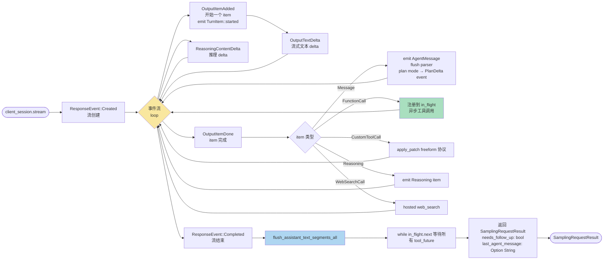
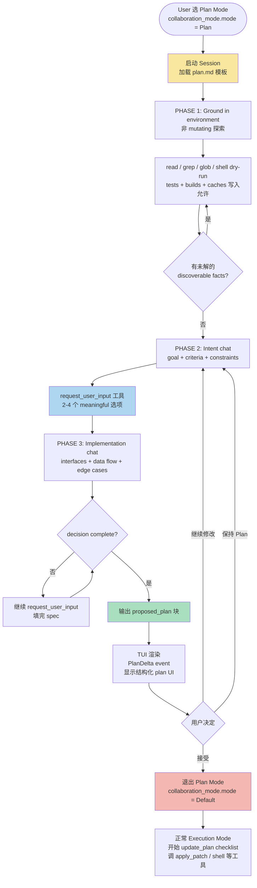
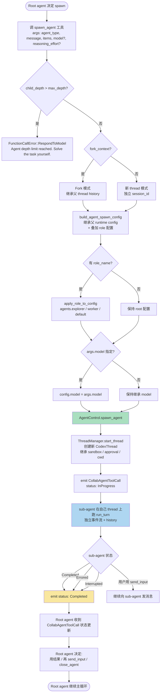
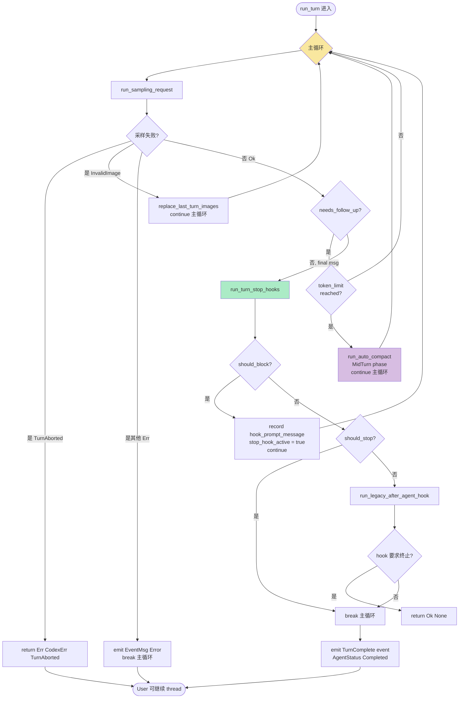
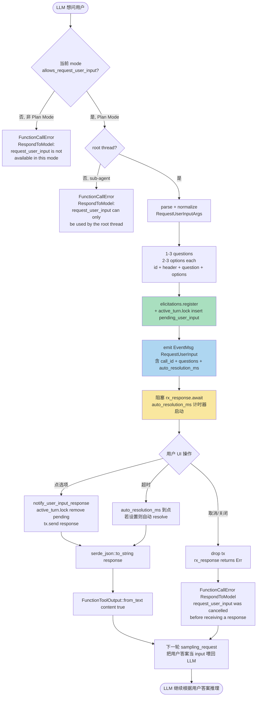
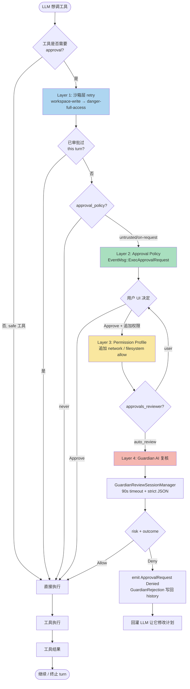
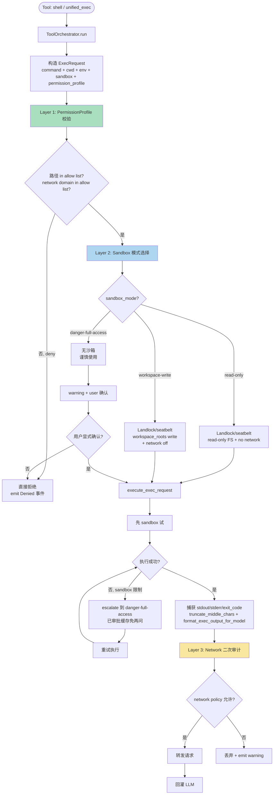
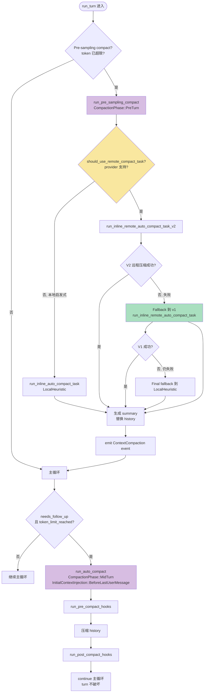

# Open Interpreter — Agent Loop 调研报告

> 调研对象：`openinterpreter/open-interpreter`
> 调研日期：2026-07-18
> 调研方式：本地 clone 双时代对照（`main` = `5ce1320` / Rust 时代 + `v0.4.2` = Python 时代）+ 文档静态分析
> 调研人：general worker（按洋葱头项目 `harness/01_market_research/` 模板输出）

---

## 0. 智能体一句话定位

**Open Interpreter** = "让 LLM 在本机执行任意代码的 Agent"——用户用自然语言下指令，LLM 写代码（Python / JS / Shell / AppleScript / Ruby / R / PowerShell / HTML / Java / React），本地执行并把输出回灌给 LLM，循环直到任务完成。**Python 时代**（v0.4.2, 2024-10）是 LiteLLM + 9 语言 REPL 的极简本地 code interpreter；**Rust 时代**（rust-v0.0.29, 2026）是 OpenAI Codex 的 fork，自带 30+ 内置工具 + 完整 MCP + Skills + 10 个 harness 仿真 + OS 级沙箱 + 跨协议 wire。

---

## 1. 调研依据

### 1.1 源码路径

- **本地 clone**：`C:\workspace\github\onionagent\harness\01_market_research\clone\open-interpreter`
- **HEAD**：`5ce1320`（main 分支，2026 现行 = rust-v0.0.29）
- **Python 时代**：`git show v0.4.2:interpreter/...`（已用 `git show` 还原到 `%TEMP%` 临时文件离线分析）

### 1.2 关键文件

| 时代 | 路径 | 职责 |
|------|------|------|
| Rust | `codex-rs/core/src/session/turn.rs:144-466` | **`run_turn()`** — 单 turn 的"内主循环"，驱动 `run_sampling_request()` 迭代 + 检查 `needs_follow_up` |
| Rust | `codex-rs/core/src/session/turn.rs:1155-1245` | **`run_sampling_request()`** — 单次模型采样 + 工具分发 + 错误重试 |
| Rust | `codex-rs/core/src/session/turn.rs:2024-2620` | **`try_run_sampling_request()`** — 实际流式处理 `ResponseEvent` 事件流（Created / OutputItemDone / Completed） |
| Rust | `codex-rs/core/src/codex_thread.rs:202` | `CodexThread::submit(op)` — 用户入口，把 `Op` 投到 `Session` |
| Rust | `codex-rs/core/src/agent/control.rs:54-101` | `AgentControl` + `SpawnAgentOptions` — 多智能体运行时 |
| Rust | `codex-rs/core/src/agent/status.rs:7-21` | `AgentStatus::{PendingInit, Running, Completed, Interrupted, Errored, Shutdown}` 状态机 |
| Rust | `codex-rs/core/src/tools/handlers/multi_agents/{spawn,wait,send_input,close_agent,resume_agent}.rs` | 5 个 sub-agent 工具：spawn_agent / wait_agent / send_input / close_agent / resume_agent |
| Rust | `codex-rs/core/src/tools/handlers/plan.rs` | `update_plan` 工具（**不是**Plan Mode，是 checklist/TODO） |
| Rust | `codex-rs/core/src/tools/handlers/request_user_input.rs:30-94` | `request_user_input` 工具 — 让模型向用户提 2-4 选项问题 |
| Rust | `codex-rs/core/src/tools/handlers/request_permissions.rs:40-114` | `request_permissions` 工具 — 模型主动追加 network / filesystem 权限 |
| Rust | `codex-rs/core/src/sandboxing/mod.rs:54-103` | `ExecRequest` + `SandboxType` (MacosSeatbelt / Linux / Windows) |
| Rust | `codex-rs/core/src/compact.rs:99-129` | `run_inline_auto_compact_task()` — 主压缩入口（token 超限时触发） |
| Rust | `codex-rs/core/src/compact.rs:131-269` | `run_compact_task()` + `run_compact_task_inner()` — 用户主动 `/compact` 的压缩 |
| Rust | `codex-rs/core/src/compact_remote_v2.rs` | V2 远程压缩（fallback 失败重试机制） |
| Rust | `codex-rs/core/src/hook_runtime.rs:297-365` | `run_turn_stop_hooks()` — Stop / SubagentStop hook，决定 turn 是否终止 |
| Rust | `codex-rs/core/src/tools/spec_plan.rs:142-178` | `build_tool_router()` — 每 turn 动态装配 30+ 工具 |
| Rust | `codex-rs/core/src/tools/handlers/{shell,apply_patch,unified_exec}.rs` | 3 个执行工具（shell 命令 / apply_patch freeform 协议 / unified_exec 长进程） |
| Rust | `codex-rs/core/src/guardian/{mod,review,prompt}.rs` | Guardian 审查（on-request approval 自动化） |
| Rust | `codex-rs/core/src/agent/role.rs` + `agent/registry.rs` | 角色（default/worker/explorer）+ spawn 深度限制 |
| Rust | `codex-rs/collaboration-mode-templates/templates/{plan,execute,pair_programming,default}.md` | 4 个协作模式 prompt 模板（`Plan` 是显式 Plan Mode） |
| Rust | `codex-rs/protocol/src/config_types.rs:608-651` | `ModeKind::{Plan, Default, PairProgramming, Execute}` + `CollaborationMode` 结构体 |
| Python | `interpreter/core/respond.py` (v0.4.2 全部行) | **`respond(interpreter)` 生成器循环** — Python 时代唯一的 agent loop |
| Python | `interpreter/core/core.py:50-58` (v0.4.2) | `loop_breakers` + `loop_message`（loop 自续机制） |
| Python | `interpreter/core/core.py:297-348` (v0.4.2) | `_respond_and_store` 处理 `type=confirmation` chunk → 抛给上层 TUI 弹窗 |
| Python | `interpreter/core/llm/llm.py` (v0.4.2) | `Llm` 类（LiteLLM 包装），用 OpenAI 协议统一调多种模型 |
| Python | `interpreter/core/computer/terminal/languages/{python,shell,javascript,html,powershell,ruby,r,react,java,applescript}.py` | 9 个语言执行器（**Python 用 Jupyter 内核，其他用 subprocess**） |

### 1.3 关键文档

- `docs/sandbox.md` — Sandbox 3 档 + Approval 3 档正交矩阵
- `docs/permissions.md` — 新版 `default_permissions` profile 体系（更细粒度）
- `docs/subagents.md` — 多 agent 配置 `[agents.explorer]` / `max_threads` / `max_depth` / `job_max_runtime_seconds`
- `docs/harness.md` — 10 个 harness 仿真模式（native / claude-code / zcode / kimi-code / ...）
- `docs/agents_md.md` — `AGENTS.md` 三段式优先级（global → project → override）
- `docs/skills.md` — Skill 加载 3 scope（bundled / user / project）
- `docs/hooks.md` — 8 类事件钩子
- `docs/mcp.md` — MCP 客户端 + 自身可作为 server 暴露
- `docs/memories.md` — 跨会话记忆 Phase 1/2 pipeline
- `codex-rs/collaboration-mode-templates/templates/plan.md` — **Plan Mode 的完整 prompt 规范**（79 行）

---

## 2. 九大问题回答

### Q1. Agent Loop 主流程

#### 1.1 双时代对照

| 维度 | Python 时代 (v0.4.2) | Rust 时代 (main, 2026) |
|------|---------------------|------------------------|
| **循环入口** | `interpreter/core/respond.py:13` — `def respond(interpreter)` 是同步生成器 | `codex-rs/core/src/session/turn.rs:144` — `pub(crate) async fn run_turn(sess, turn_context, input, ...)` |
| **循环结束** | `respond()` 内部 `while True: ... break` 5 个分支 | `run_turn()` 内 `loop { ... }` 跑 `run_sampling_request()` 直到 `needs_follow_up == false && has_pending_input == false` |
| **LLM 调** | LiteLLM 同步流式 | `ModelClient` 异步 SSE 流，3 种 wire（OpenAI Responses / Chat / Anthropic Messages） |
| **代码执行** | `interpreter.computer.run(language, code, stream=True)`（9 种 BaseLanguage） | `ExecRequest` + `execute_exec_request` + `unified_exec`（沙箱化） |
| **工具协议** | **不用原生 tool call** — LLM 输出 ```python``` markdown 块，解析成 `type=code` message | **原生 function call**（OpenAI Responses `ResponseItem::FunctionCall` / `McpToolCall` / `CustomToolCall`） |
| **执行反馈** | `for line in interpreter.computer.run(...): yield {"role": "computer", **line}` | `FunctionCallOutputPayload { body: Text \| ContentItems }` 写回 history |

#### 1.2 Python 时代 `respond()` 循环详解（v0.4.2 实证代码）

**关键代码（v0.4.2 `interpreter/core/respond.py` 完整文件逻辑）**：

```python
# interpreter/core/respond.py（v0.4.2）
def respond(interpreter):
    """Yields chunks. Responds until it decides not to run any more code or say anything else."""
    last_unsupported_code = ""
    insert_loop_message = False

    while True:
        # 1) 渲染 system message
        system_message = interpreter.system_message
        for language in interpreter.computer.terminal.languages:
            if hasattr(language, "system_message"):
                system_message += "\n\n" + language.system_message
        if interpreter.custom_instructions:
            system_message += "\n\n" + interpreter.custom_instructions
        if interpreter.computer.import_computer_api:
            system_message += "\n\n" + interpreter.computer.system_message

        # 2) 构造 messages_for_llm = [system] + interpreter.messages
        messages_for_llm = [rendered_system_message] + interpreter.messages.copy()
        if insert_loop_message:
            messages_for_llm.append({"role": "user", "type": "message", "content": loop_message})
            yield {"role": "assistant", "type": "message", "content": "\n\n"}
            insert_loop_message = False

        # 3) 调 LLM（流式）
        if interpreter.messages[-1]["type"] != "code":
            try:
                for chunk in interpreter.llm.run(messages_for_llm):
                    yield {"role": "assistant", **chunk}
            except litellm.exceptions.BudgetExceededError:
                interpreter.display_message("> Max budget exceeded\n\n...")
                break
            except Exception as e:
                # 处理 Auth / RateLimit / Not Have Access / Invalid model
                ...

        # 4) 如果是 code message：执行
        if interpreter.messages[-1]["type"] == "code":
            language = interpreter.messages[-1]["format"].lower().strip()
            code = interpreter.messages[-1]["content"]
            # ... 4 种 hallucination 矫正（functions.execute() / executeexecute / {"language":...} / {language:...}）
            # ... 空代码检测
            try:
                yield {"role": "computer", "type": "confirmation", "format": "execution",
                       "content": {"type": "code", "format": language, "content": code}}
            except GeneratorExit:
                break  # 用户中断
            # ... `import computer` 替换
            # ... sync computer API（双向同步状态）
            for line in interpreter.computer.run(language, code, stream=True):
                yield {"role": "computer", **line}
            # ... sync computer back

        # 5) loop 退出判断
        loop_breakers = interpreter.loop_breakers  # ["The task is done.", "The task is impossible.", ...]
        if interpreter.loop and interpreter.messages[-1].get("role") == "assistant" and \
           not any(s in interpreter.messages[-1].get("content", "") for s in loop_breakers):
            insert_loop_message = True
            continue
        break
```

**关键设计特征**：
1. **纯生成器循环** —— `respond()` 是 Python `Generator`，每次 `yield` 推进状态，TUI 通过 `for chunk in interpreter.chat(stream=True): ...` 拉取增量
2. **"code as a message"** —— LLM 不走 function call，输出 ```python``` markdown 块，解析成 `type=code` message 写回 `interpreter.messages`，下一轮再交给 `computer.run()` 执行。响应也是 `type=console / format=output` 的 message 写回 —— **LMC（Language Model Computer）协议**
3. **`computer` API 内嵌** —— 通过 `import computer` 暴露 mouse / keyboard / display / browser / calendar / contacts / mail / sms / vision / files / os 等 14 个子系统（`Computer.to_dict()` 序列化后注入 Python 命名空间）
4. **多语言并行 REPL** —— `Terminal.languages` 列表：`[Python, Shell, JavaScript, HTML, AppleScript, R, PowerShell, React, Java, Ruby]`，**Python 用 Jupyter 内核保持变量**，其他用 subprocess
5. **`safe_mode = "off" | "ask" | "auto-run"`** —— `auto_run=False` 时 yield `type=confirmation` 给上层 TUI 弹"运行/拒绝"（`core.py:344-355`）
6. **loop 自续** —— 若 LLM 没产出 `loop_breakers` 之一的终止短语，就注入 `loop_message = "Proceed. You CAN run code on my machine. If the entire task I asked for is done, say exactly 'The task is done.' ..."` 让它继续

#### 1.3 Rust 时代 `run_turn()` 循环详解

**关键代码（`codex-rs/core/src/session/turn.rs:144-466`）**：

```rust
// codex-rs/core/src/session/turn.rs
pub(crate) async fn run_turn(
    sess: Arc<Session>,
    turn_context: Arc<TurnContext>,
    turn_extension_data: Arc<codex_extension_api::ExtensionData>,
    input: Vec<TurnInput>,
    prewarmed_client_session: Option<ModelClientSession>,
    cancellation_token: CancellationToken,
) -> CodexResult<Option<String>> {
    // 0) Pre-sampling compact（如果 token 已超限）
    if let Err(err) = run_pre_sampling_compact(&sess, &turn_context, &mut client_session).await { ... }

    // 1) 准备 turn 上下文
    let first_step_context = sess.capture_step_context(Arc::clone(&turn_context)).await;
    let (mut world_state, display_roots) = tokio::join!(...);

    let Some((injection_items, explicitly_enabled_connectors)) = build_skills_and_plugins(...).await
    else { return Ok(None) };

    // 2) SessionStart hooks
    if run_pending_session_start_hooks(&sess, &turn_context).await { return Ok(None) }

    // 3) 处理 pending input + 注入 skills
    if run_hooks_and_record_inputs(&sess, &turn_context, &input).await { return Ok(None) }

    let mut can_drain_pending_input = input.is_empty();
    let mut next_step_context = Some(first_step_context);

    // 4) ★ 主循环：反复 sampling_request 直到不需要 follow-up
    loop {
        let pending_input = if can_drain_pending_input {
            sess.input_queue.get_pending_input(&sess.active_turn).await
        } else { Vec::new() };

        if run_hooks_and_record_inputs(&sess, &turn_context, &pending_input).await { break; }

        let step_context = match next_step_context.take() {
            Some(step_context) => step_context,
            None => sess.capture_step_context(Arc::clone(&turn_context)).await,
        };

        let sampling_request_result = async {
            // 构造 sampling_input
            let sampling_request_input: Vec<ResponseItem> = async {
                sess.clone_history().await.for_prompt(&turn_context.model_info.input_modalities)
            }.instrument(trace_span!("run_turn.prepare_sampling_request_input")).await;

            run_sampling_request(...).await
        }.await;

        match sampling_request_result {
            Ok((sampling_request_output, sampling_request_input)) => {
                let SamplingRequestResult { needs_follow_up: model_needs_follow_up,
                                            last_agent_message: sampling_request_last_agent_message } = sampling_request_output;

                can_drain_pending_input = true;

                // 5) 收集后置状态
                let (has_pending_input, token_status, estimated_token_count) = async {
                    let has_pending_input = sess.input_queue.has_pending_input(&sess.active_turn).await;
                    let token_status = super::context_window::context_window_token_status(...).await;
                    let estimated_token_count = sess.get_estimated_token_count(...).await;
                    (has_pending_input, token_status, estimated_token_count)
                }.instrument(trace_span!("run_turn.collect_post_sampling_state")).await;

                let needs_follow_up = model_needs_follow_up || has_pending_input;
                let token_limit_reached = token_status.token_limit_reached;

                // 6) 触发 mid-turn auto-compact
                if needs_follow_up && (sess.take_new_context_window_request().await || token_limit_reached) {
                    if let Err(err) = run_auto_compact(
                        &sess, Arc::clone(&step_context), None, &mut client_session,
                        InitialContextInjection::BeforeLastUserMessage(Arc::clone(&world_state)),
                        CompactionReason::ContextLimit, CompactionPhase::MidTurn,
                    ).await { ... }
                    can_drain_pending_input = !model_needs_follow_up;
                    continue;  // 继续主循环
                }

                // 7) 终止条件
                if !needs_follow_up {
                    // 8) DeepSeek TUI / claude-code-bare 等特定 harness 特殊处理
                    if harness == "deepseek-tui" && token_status.active_context_tokens >= DEEPSEEK_TUI_CYCLE_TOKEN_LIMIT {
                        run_auto_compact(...).await;
                    }
                    if harness == "claude-code-bare" { ... }

                    last_agent_message = sampling_request_last_agent_message;
                    let stop_outcome = run_turn_stop_hooks(&sess, &turn_context, stop_hook_active, last_agent_message.clone()).await;

                    // 9) Stop hook 要求继续：插入 hook prompt 重启 turn
                    if stop_outcome.should_block {
                        if let Some(hook_prompt_message) = build_hook_prompt_message(&stop_outcome.continuation_fragments) {
                            sess.record_response_item_and_emit_turn_item(&turn_context, hook_prompt_message).await;
                            stop_hook_active = true;
                            continue;
                        } else { /* warning + fallthrough */ }
                    }
                    // 10) Stop hook 同意终止
                    if stop_outcome.should_stop { break; }

                    // 11) Legacy after_agent hook
                    if run_legacy_after_agent_hook(...).await { return Ok(None); }

                    break;  // ★ 主循环退出
                }
                continue;  // 还需要 follow up
            }
            Err(CodexErr::TurnAborted) => return Err(err),
            Err(CodexErr::InvalidImageRequest()) => {
                // sanitize tool output 防 image 投毒
                if state.history.replace_last_turn_images("Invalid image") { continue; }
                sess.send_event(&turn_context, ErrorEvent { ... }).await;
                break;
            }
            Err(e) => {
                info!("Turn error: {e:#}");
                let event = EventMsg::Error(e.to_error_event(None));
                sess.send_event(&turn_context, event).await;
                break;  // 错误也终止，让用户继续
            }
        }
    }
    Ok(last_agent_message)
}
```

**关键设计特征**：
1. **分层循环** —— `run_turn` 外层 + `run_sampling_request` + `try_run_sampling_request` 内层（处理 SSE 事件流）
2. **`needs_follow_up` 三种驱动** —— `model_needs_follow_up`（模型继续调用工具）+ `has_pending_input`（用户在 queue 里塞了新消息）+ `token_limit_reached`（要触发压缩）
3. **tool runtime 重用** —— `ToolCallRuntime::new(router, session, step_context, turn_diff_tracker)`（`turn.rs:1180`）一次构造，多采样轮复用
4. **mid-turn auto-compact** —— 在 `loop` 体内根据 `token_limit_reached` 触发 `run_auto_compact(...)` 并 `continue`（不破坏 turn 状态）
5. **Stop hooks** —— `run_turn_stop_hooks(...)` 返回 `StopOutcome { should_block, should_stop, continuation_fragments }`，root turn 走 `Stop`，subagent turn 走 `SubagentStop`（`hook_runtime.rs:303-346`）
6. **错误即终止** —— `Err(CodexErr::TurnAborted)` 立即返回；其他 `Err(e)` 走 `EventMsg::Error` 通知用户后 `break`，让用户继续（不直接结束 thread）

#### 1.4 Rust 时代 `try_run_sampling_request()` 内层事件循环（`turn.rs:2024-2620`）

```rust
async fn try_run_sampling_request(...) -> CodexResult<SamplingRequestResult> {
    // 1) 准备 Prompt
    let prompt = build_prompt(prompt_input, router, turn_context, base_instructions);
    // Prompt { input, tools: router.model_visible_specs(), parallel_tool_calls, cwd, base_instructions, output_schema, output_schema_strict }

    // 2) 启动流
    let mut stream = client_session.stream(prompt, &turn_context.model_info, ..., cancellation_token).await??;

    let plan_mode = turn_context.collaboration_mode.mode == ModeKind::Plan;
    let mut assistant_message_stream_parsers = AssistantMessageStreamParsers::new(plan_mode);
    let mut plan_mode_state = plan_mode.then(|| PlanModeStreamState::new(&turn_context.sub_id));

    let mut in_flight = InFlightTools::new(...);

    // 3) ★ 事件流循环
    let outcome: CodexResult<SamplingRequestResult> = loop {
        let event = match stream.next().instrument(...).or_cancel(&cancellation_token).await {
            Ok(event) => event,
            Err(CancelErr::Cancelled) => break Err(CodexErr::TurnAborted),
        };
        let event = match event {
            Some(Ok(event)) => event,
            Some(Err(err)) => break Err(err),
            None => break Err(CodexErr::Stream("stream closed before response.completed".into(), None)),
        };

        match event {
            ResponseEvent::Created => {}  // 流创建事件
            ResponseEvent::OutputItemDone(mut item) => {
                // ... 处理消息 / 工具调用 / 推理完成
                // ... plan mode 特殊处理（ProposedPlanSegment → PlanDelta event）
                let output_result = handle_output_item_done(&mut ctx, item, ...).await?;
                if let Some(tool_future) = output_result.tool_future {
                    in_flight.push(tool_future);  // 异步工具调用
                }
            }
            ResponseEvent::OutputItemAdded(item) => { ... }
            ResponseEvent::OutputTextDelta(...) => { /* 流式文本 */ }
            ResponseEvent::ReasoningContentDelta(...) => { /* 推理 delta */ }
            ResponseEvent::WebSearchCallCompleted(...) => { ... }
            ResponseEvent::Completed => {
                // ★ 响应完成：flush parser + 处理 in-flight tool calls
                flush_assistant_text_segments_all(...).await;
                // 等待所有 tool_future 完成
                while let Some(tool_result) = in_flight.next().await { ... }
                // 返回 SamplingRequestResult { needs_follow_up, last_agent_message }
                break Ok(SamplingRequestResult { ... });
            }
            ResponseEvent::RateLimits(snapshot) => { ... }
        }
    };

    Ok(outcome?)
}
```

#### 1.5 代码执行的反馈循环（Python 时代 + Rust 时代）

**Python 时代反馈循环**（`respond.py:259-330`）：
```
LLM 输出一段 markdown ```python ... ``` 块
  → render_message 解析成 {role: assistant, type: code, format: python, content: "..."}
  → 下一轮 while 循环进入"if interpreter.messages[-1]['type'] == 'code':" 分支
  → yield {role: computer, type: confirmation, format: execution, content: {code}} （等 TUI 弹窗确认）
  → TUI 弹窗"运行/拒绝"：auto_run=True 直接跑；auto_run=False 等用户按 y
  → interpreter.computer.run("python", code, stream=True)
  → Jupyter / subprocess 逐行 yield {role: computer, type: console, format: output, content: "..."}
  → TUI 显示输出，append 到 interpreter.messages
  → 下一轮 while 循环：把整段对话 + console 输出再喂给 LLM
```

**Rust 时代反馈循环**（`turn.rs:2024-2580` + `tools/orchestrator.rs:144-451`）：
```
LLM 输出 function call（OpenAI Responses / Chat / Anthropic Messages）
  → ModelClient SSE 流收到 ResponseEvent::OutputItemDone(item: ResponseItem::FunctionCall)
  → handle_output_item_done → 注册到 in_flight 异步任务
  → in_flight tool_future 实际跑（沙箱化）：
     1. orchestrator 先用 sandbox_mode=workspace-write 试
     2. 失败 escalate 到 sandbox_mode=danger-full-access
     3. Guardian AI 复核（on-request approval）
  → 工具返回 FunctionCallOutput { call_id, output: FunctionCallOutputPayload { body: Text | ContentItems } }
  → response item 写回 history
  → 下一轮 sampling_request 把 FunctionCallOutput 当 input 喂回 LLM
  → LLM 看工具输出，决定：
     a) 继续调用下一个 tool → needs_follow_up = true → 继续循环
     b) 输出 final assistant message → needs_follow_up = false → break
```

#### 1.6 主流程 Mermaid 流程图

##### 1.6.1 Python 时代 Agent Loop (v0.4.2)

```mermaid
flowchart TD
    Start([User: 自然语言指令]) --> Chat[interpreter.chat / async_chat]
    Chat --> Respond[respond 生成器]
    Respond --> SysMsg[渲染 system message<br/>+ language.system_message<br/>+ custom_instructions<br/>+ computer API]

    SysMsg --> LlmCall{interpreter.messages<br/>末尾是 code?}
    LlmCall -->|否| Litellm[LiteLLM.run 流式<br/>OpenAI 协议统一]
    Litellm --> YieldAssistant[yield assistant chunks<br/>+ LLM 异常处理<br/>BudgetExceeded / Auth / RateLimit]
    YieldAssistant --> CodeCheck{interpreter.messages<br/>末尾是 code?}

    CodeCheck -->|否| LoopCheck{loop 模式开启<br/>且 末条含 loop_breakers?}
    LoopCheck -->|否, 需继续| InsertLoop[insert_loop_message = True<br/>注入 loop_message:<br/>Proceed. You CAN run code...]
    InsertLoop --> Respond
    LoopCheck -->|是, 终止| BreakOut[break 生成器]

    CodeCheck -->|是| HalFix[4 种 hallucination 矫正<br/>functions.execute() / executeexecute<br/>{language: ...} / {language: ...}]
    HalFix --> LangCheck{code 空?<br/>或语言不支持?}
    LangCheck -->|是| YieldWarning[yield computer warning]
    YieldWarning --> LoopCheck
    LangCheck -->|否| Confirm{yield type=confirmation<br/>等 TUI 弹窗}
    Confirm -->|用户取消/拒绝| TuiCancel[GeneratorExit → break]
    Confirm -->|auto_run=False<br/>用户接受| SyncApi[Sync computer API<br/>双向同步]
    Confirm -->|auto_run=True| SyncApi

    SyncApi --> Exec[interpreter.computer.run<br/>language, code, stream=True]
    Exec --> JupyterLang{Python?<br/>Jupyter kernel}
    JupyterLang -->|是| JupyterExec[jupyter execute<br/>保持 state]
    JupyterLang -->|否| SubprocessExec[subprocess Popen<br/>9 种 BaseLanguage]
    JupyterExec --> YieldOutput
    SubprocessExec --> YieldOutput

    YieldOutput[yield computer chunks<br/>type=console, format=output] --> LoopCheck
    BreakOut --> End([User 看到最终输出])

    style Respond fill:#f9e79f
    style Exec fill:#a9dfbf
    style Litellm fill:#aed6f1
    style Confirm fill:#f5b7b1
```

##### 1.6.2 Rust 时代 Agent Loop (main, 2026)

```mermaid
flowchart TD
    Start([User / TUI / app-server: Op::UserTurn]) --> Submit[CodexThread::submit_op]
    Submit --> Queue[InputQueue.push user_input]
    Queue --> TurnStart[Session::run_turn<br/>emit TurnStarted event]

    TurnStart --> PreCompact{Token 已超限?}
    PreCompact -->|是| PreRunCompact[run_pre_sampling_compact<br/>生成 summary 替换 history]
    PreCompact -->|否| SkillInject
    PreRunCompact --> SkillInject[build_skills_and_plugins<br/>注入 SKILL.md + AGENTS.md + plugins]

    SkillInject --> SessionHooks[run_pending_session_start_hooks<br/>SessionStart 事件]
    SessionHooks --> ProcessInput[run_hooks_and_record_inputs<br/>UserPromptSubmit 钩子]

    ProcessInput --> MainLoop{★ run_turn 主循环<br/>loop {}}

    MainLoop --> Pending[input_queue.get_pending_input<br/>用户在 turn 期间塞入的消息]
    Pending --> StepCtx[sess.capture_step_context<br/>每 turn 重新生成 TurnContext]
    StepCtx --> BuildPrompt[build_prompt:<br/>input + tools + base_instructions + output_schema]

    BuildPrompt --> ModelStream[ModelClient.stream<br/>OpenAI Responses / Chat / Anthropic Messages]

    ModelStream --> TryStream[try_run_sampling_request<br/>SSE 事件流循环]
    TryStream --> PlanCheck{collaboration_mode<br/>.mode == Plan?}
    PlanCheck -->|是| PlanState[PlanModeStreamState<br/>解析 proposed_plan 块]
    PlanCheck -->|否| NormalStream[正常流式文本]

    PlanState --> ToolCall[ResponseEvent::OutputItemDone<br/>ResponseItem::FunctionCall]
    NormalStream --> ToolCall

    ToolCall --> InFlight[InFlightTools.push<br/>异步工具调用]
    InFlight --> Sandbox[ToolOrchestrator.run<br/>沙箱 + approval retry<br/>workspace-write → danger-full-access<br/>+ Guardian AI 复核]

    Sandbox --> ToolResult[FunctionCallOutputPayload<br/>body: Text or ContentItems<br/>多模态 image/HTML]
    ToolResult --> History[record_response_item<br/>写回 history + emit turn_item]

    History --> MoreTools{还有 tool<br/>in-flight?}
    MoreTools -->|是| WaitTool[in_flight.next 等待完成]
    WaitTool --> ToolResult

    MoreTools -->|否, response.completed| Flush[flush_assistant_text_segments]
    Flush --> ReturnResult[返回 SamplingRequestResult<br/>needs_follow_up + last_agent_message]

    ReturnResult --> PostSample[collect_post_sampling_state:<br/>has_pending_input + token_status + estimated_token_count]

    PostSample --> TokenCheck{token_limit_reached?}
    TokenCheck -->|是| MidCompact[run_auto_compact<br/>CompactionPhase::MidTurn<br/>continue 主循环]
    MidCompact --> MainLoop

    TokenCheck -->|否| FollowUpCheck{needs_follow_up<br/>= model + has_pending_input?}
    FollowUpCheck -->|是, 要 follow up| MainLoop

    FollowUpCheck -->|否, turn 结束| StopHooks[run_turn_stop_hooks<br/>Stop / SubagentStop 事件<br/>→ StopOutcome]

    StopHooks --> StopBlock{should_block?}
    StopBlock -->|是, hook 要继续| InsertHook[record hook_prompt_message<br/>stop_hook_active=true<br/>continue 主循环]
    InsertHook --> MainLoop

    StopBlock -->|否| StopShould{should_stop?}
    StopShould -->|是, hook 同意终止| Break
    StopShould -->|否| AfterAgent[run_legacy_after_agent_hook]

    AfterAgent --> Break[break 主循环]
    Break --> EmitComplete[emit TurnComplete event<br/>AgentStatus::Completed]

    EmitComplete --> End([User 看到 final_agent_message])

    style MainLoop fill:#f9e79f
    style TryStream fill:#aed6f1
    style Sandbox fill:#f5b7b1
    style MidCompact fill:#d7bde2
    style StopHooks fill:#abebc6
```

##### 1.6.3 Rust 时代 `try_run_sampling_request` 事件流（内层循环）



---

### Q2. Plan 计划机制

**Open Interpreter 计划机制分两层**：

#### 2.1 `update_plan` 工具（**不是** Plan Mode，是 checklist/TODO）

**Rust 时代有，Python 时代没有。** 实证：

`codex-rs/core/src/tools/handlers/plan.rs:16-79`：

```rust
pub struct PlanHandler;

impl ToolExecutor<ToolInvocation> for PlanHandler {
    fn tool_name(&self) -> ToolName {
        ToolName::plain("update_plan")
    }
    fn spec(&self) -> ToolSpec { create_update_plan_tool() }

    fn handle(&self, invocation: ToolInvocation) -> codex_tools::ToolExecutorFuture<'_> {
        Box::pin(self.handle_call(invocation))
    }
}

impl PlanHandler {
    async fn handle_call(&self, invocation: ToolInvocation) -> Result<Box<dyn ToolOutput>, FunctionCallError> {
        // ...解析 UpdatePlanArgs
        // ★ Plan Mode 下禁用 update_plan
        if turn.collaboration_mode.mode == ModeKind::Plan {
            return Err(FunctionCallError::RespondToModel(
                "update_plan is a TODO/checklist tool and is not allowed in Plan mode".to_string(),
            ));
        }
        // 发送 PlanUpdate 事件给 TUI
        session.send_event(turn.as_ref(), EventMsg::PlanUpdate(args)).await;
        Ok(boxed_tool_output(PlanToolOutput))
    }
}
```

**关键设计**：
- **Plan Mode 下不能调 `update_plan`**（plan.rs:51-55 明文）
- `update_plan` 是**"任务清单 / TODO 进度展示"** —— TUI 收到 `EventMsg::PlanUpdate(args)` 后实时显示当前任务的步骤列表
- 对应 Anthropic 协议中的 `update_plan` 工具（`plan_tool::UpdatePlanArgs`）

#### 2.2 Plan Mode（真正的"先计划后执行"协作模式）

**只在 Rust 时代有**，通过 `collaboration_mode.mode = ModeKind::Plan` 触发。

**ModeKind 定义**（`codex-rs/protocol/src/config_types.rs:610-651`）：

```rust
pub enum ModeKind {
    Plan,                              // ★ Plan Mode
    #[default]
    #[serde(alias = "code", alias = "pair_programming", alias = "execute", alias = "custom")]
    Default,                           // 普通执行模式
    #[doc(hidden)]
    PairProgramming,
    #[doc(hidden)]
    Execute,
}

pub const TUI_VISIBLE_COLLABORATION_MODES: [ModeKind; 2] = [ModeKind::Default, ModeKind::Plan];

impl ModeKind {
    pub const fn display_name(self) -> &'static str {
        match self {
            Self::Plan => "Plan",
            Self::Default => "Default",
            Self::PairProgramming => "Pair Programming",
            Self::Execute => "Execute",
        }
    }
    pub const fn is_tui_visible(self) -> bool { matches!(self, Self::Plan | Self::Default) }
    pub const fn allows_request_user_input(self) -> bool { matches!(self, Self::Plan) }
    // ↑ 只有 Plan Mode 允许 request_user_input 工具
}
```

**Plan Mode 模板**（`codex-rs/collaboration-mode-templates/templates/plan.md` 79 行，节选核心规则）：

> # Plan Mode (Conversational)
> You work in 3 phases, and you should *chat your way* to a great plan before finalizing it. A great plan is very detailed—intent- and implementation-wise—so that it can be handed to another engineer or agent to be implemented right away. It must be **decision complete**, where the implementer does not need to make any decisions.
>
> ## Mode rules (strict)
> You are in **Plan Mode** until a developer message explicitly ends it.
> Plan Mode is not changed by user intent, tone, or imperative language. If a user asks for execution while still in Plan Mode, treat it as a request to **plan the execution**, not perform it.
>
> ## Execution vs. mutation in Plan Mode
> You may explore and execute **non-mutating** actions that improve the plan. You must not perform **mutating** actions.
>
> ### Allowed (non-mutating, plan-improving)
> - Reading or searching files, configs, schemas, types, manifests, and docs
> - Static analysis, inspection, and repo exploration
> - Dry-run style commands when they do not edit repo-tracked files
> - Tests, builds, or checks (may write to caches like `target/`, `.cache/`, or snapshots)
>
> ### Not allowed (mutating, plan-executing)
> - Editing or writing files
> - Running formatters or linters that rewrite files
> - Applying patches, migrations, or codegen that updates repo-tracked files
>
> ## PHASE 1 — Ground in the environment
> Begin by grounding yourself in the actual environment. Eliminate unknowns in the prompt by discovering facts, not by asking the user. **Before asking the user any question, perform at least one targeted non-mutating exploration pass**, unless no local environment/repo is available.
>
> ## PHASE 2 — Intent chat
> Keep asking until you can clearly state: goal + success criteria, audience, in/out of scope, constraints, current state, and the key preferences/tradeoffs.
>
> ## PHASE 3 — Implementation chat
> Once intent is stable, keep asking until the spec is decision complete: approach, interfaces (APIs/schemas/I/O), data flow, edge cases/failure modes, testing + acceptance criteria, rollout/monitoring, and any migrations/compat constraints.
>
> ## Asking questions
> **Strongly prefer using the `request_user_input` tool to ask any questions.**
> Offer only meaningful multiple‑choice options; don't include filler choices that are obviously wrong or irrelevant.
>
> ## Finalization rule
> Only output the final plan when it is decision complete and leaves no decisions to the implementer.
> When you present the official plan, wrap it in a `<proposed_plan>` block so the client can render it specially:
> 1) The opening tag must be on its own line.
> 2) Start the plan content on the next line (no text on the same line as the tag).
> 3) The closing tag must be on its own line.
> 4) Use Markdown inside the block.
> 5) Keep the tags exactly as `<proposed_plan>` and `</proposed_plan>` (do not translate or rename them).
>
> If the user stays in Plan mode and asks for revisions after a prior `<proposed_plan>`, any new `<proposed_plan>` must be a complete replacement.

**Plan Mode 处理逻辑**（`codex-rs/core/src/session/turn.rs:2089-2091` + `:1412-1423`）：

```rust
// 每次 sampling_request 启动时检查
let plan_mode = turn_context.collaboration_mode.mode == ModeKind::Plan;
let mut assistant_message_stream_parsers = AssistantMessageStreamParsers::new(plan_mode);
let mut plan_mode_state = plan_mode.then(|| PlanModeStreamState::new(&turn_context.sub_id));

// PlanModeStreamState 跟踪 plan item lifecycle
struct PlanModeStreamState {
    pending_agent_message_items: HashMap<String, TurnItem>,  // 模型开始但延迟到 plan 块外才显示
    started_agent_message_items: HashSet<String>,
    leading_whitespace_by_item: HashMap<String, String>,
    plan_item_state: ProposedPlanItemState,                  // <proposed_plan> 块状态机
}
```

**`<proposed_plan>` 块处理**（`turn.rs:1658-1721` 的 `handle_plan_segments`）：

```rust
async fn handle_plan_segments(sess, turn_context, state, item_id, segments) {
    for segment in segments {
        match segment {
            // 解析出 <proposed_plan>...</proposed_plan> 段
            ProposedPlanSegment::Plan { title, body } => {
                // emit PlanDelta event (实时显示给用户)
                // emit TurnItem::Plan (plan item)
            }
            // 普通文本
            ProposedPlanSegment::Text(text) => {
                // emit AgentMessage
            }
        }
    }
}
```

**Plan Mode Mermaid 流程图**：



#### 2.3 Python 时代的"计划"机制

**Python 时代没有显式 Plan 模式**。`loop_message` 是隐式的"继续"提示，不是预先计划。具体见 `core.py:53-58`：

```python
loop_message="""Proceed. You CAN run code on my machine. If the entire task I asked for is done, say exactly 'The task is done.' If you need some specific information (like username or password) say EXACTLY 'Please provide more information.' If it's impossible, say 'The task is impossible.' (If I haven't provided a task, say exactly 'Let me know what you'd like to do next.') Otherwise keep going.""",
```

#### 2.4 Ononion Agent 启示

| 启示 | 行动 |
|------|------|
| **Plan Mode 是协作模式级别**（不是工具）| Onion 可以设置 `agent_mode = "plan" \| "execute" \| "review"`，由 TurnContext 决定哪些工具可调 |
| **`update_plan` 是任务清单**（不是 Plan Mode）| Onion 应该有独立的 `update_plan` 工具，**支持嵌套 step + 进度展示** |
| **`<proposed_plan>` XML 标签** | Onion 可以学：LLM 输 `<plan>...</plan>` 块，TUI 单独渲染 |
| **Phase 1/2/3 结构化对话** | Onion Plan Mode prompt 可以参考：先 Explore → Intent → Implementation 三阶段 |
| **Plan Mode 强制非 mutating** | Onion Plan Mode 应该禁用 `write/edit/apply_patch/delete`，只允许 read/grep/glob/shell dry-run |

---

### Q3. Sub Agent

**Rust 时代有完整 Sub Agent 系统，Python 时代没有。**

#### 3.1 Rust 时代 Sub Agent 架构

**5 个 multi-agent 工具**（`codex-rs/core/src/tools/handlers/multi_agents/{spawn,wait,send_input,close_agent,resume_agent}.rs`）：

| 工具 | 用途 |
|------|------|
| `spawn_agent` | 创建新子 agent，指定 role（default / worker / explorer 等）+ 任务 + 可选 model |
| `wait_agent` | 阻塞等待 sub-agent 完成 |
| `send_input` | 向正在运行的 sub-agent 发送 follow-up 消息 |
| `close_agent` | 强制关闭 sub-agent |
| `resume_agent` | 恢复已关闭的 sub-agent |

**`spawn_agent` 关键实现**（`multi_agents/spawn.rs:30-100`）：

```rust
async fn handle_spawn_agent(invocation: ToolInvocation) -> Result<SpawnAgentResult, FunctionCallError> {
    // 1) 解析 args
    let args: SpawnAgentArgs = parse_arguments(&arguments)?;
    let role_name = args.agent_type.as_deref().map(str::trim).filter(|role| !role.is_empty());
    let input_items = parse_collab_input(args.message, args.items)?;
    let prompt = render_input_preview(&input_items);

    // 2) 计算 spawn 深度，限制递归
    let session_source = turn.session_source.clone();
    let child_depth = next_thread_spawn_depth(&session_source);
    let max_depth = turn.config.agent_max_depth;
    if exceeds_thread_spawn_depth_limit(child_depth, max_depth) {
        return Err(FunctionCallError::RespondToModel(
            "Agent depth limit reached. Solve the task yourself.".to_string(),
        ));
    }

    // 3) emit CollabAgentToolCall event（开始）
    session.emit_turn_item_started(&turn, &TurnItem::CollabAgentToolCall(CollabAgentToolCallItem {
        id: call_id.clone(),
        tool: CollabAgentTool::SpawnAgent,
        status: CollabAgentToolCallStatus::InProgress,
        sender_thread_id: session.thread_id,
        ...
    })).await;

    // 4) 构造子 agent 配置（继承父 config + 叠加 role）
    let mut config = build_agent_spawn_config(&session.get_base_instructions().await, turn.as_ref())?;
    if args.fork_context {
        // fork 模式：继承父完整 history 或最后 N turn
        reject_full_fork_spawn_overrides(role_name, args.model.as_deref(), args.reasoning_effort.clone())?;
    } else {
        // 新 thread 模式：可指定 model / reasoning_effort / service_tier
        if let Some(role) = role_name {
            apply_role_to_config(&mut config, &session.services.agent_control, role)?;
        }
        if let Some(model) = args.model { config.model = Some(model); }
        if let Some(effort) = args.reasoning_effort { config.model_reasoning_effort = Some(effort); }
    }

    // 5) 调用 AgentControl.spawn_agent → ThreadManager.start_thread
    let spawned = session.services.agent_control.spawn_agent(
        SpawnAgentOptions {
            fork_parent_spawn_call_id: Some(call_id.clone()),
            fork_mode: args.fork_context.then(|| SpawnAgentForkMode::FullHistory),
            parent_thread_id: Some(session.thread_id),
            environments: args.environments.clone(),
        },
        config,
        input_items,
    ).await?;

    // 6) emit 完成事件
    session.emit_turn_item_completed(...).await;
    Ok(SpawnAgentResult { ... })
}
```

**AgentControl 控制平面**（`codex-rs/core/src/agent/control.rs:84-101`）：

```rust
/// `AgentControl` is held by each session (via `SessionServices`). It provides capability to
/// spawn new agents and the inter-agent communication layer.
/// An `AgentControl` instance is intended to be created at most once per root thread/session
/// tree. That same `AgentControl` is then shared with every sub-agent spawned from that root,
/// which keeps the registry scoped to that root thread rather than the entire `ThreadManager`.
pub(crate) struct AgentControl {
    /// ID shared by the whole agent control session. Every sub-agent from a common root share same session ID.
    session_id: SessionId,
    /// Weak handle back to the global thread registry/state.
    weak_handle: ...,
    /// Live agent registry
    registry: AgentRegistry,
    /// Residency tracking
    residency: V2Residency,
    /// Execution limiter
    execution: AgentExecutionLimiter,
}
```

**AgentStatus 状态机**（`agent/status.rs:7-21`）：

```rust
pub(crate) fn agent_status_from_event(msg: &EventMsg) -> Option<AgentStatus> {
    match msg {
        EventMsg::TurnStarted(_) => Some(AgentStatus::Running),
        EventMsg::TurnComplete(ev) => Some(AgentStatus::Completed(ev.last_agent_message.clone())),
        EventMsg::TurnAborted(ev) => match ev.reason {
            TurnAbortReason::Interrupted | TurnAbortReason::BudgetLimited => {
                Some(AgentStatus::Interrupted)
            }
            _ => Some(AgentStatus::Errored(format!("{:?}", ev.reason))),
        },
        EventMsg::Error(ev) => Some(AgentStatus::Errored(ev.message.clone())),
        EventMsg::ShutdownComplete => Some(AgentStatus::Shutdown),
        _ => None,
    }
}

pub(crate) fn is_final(status: &AgentStatus) -> bool {
    !matches!(status, AgentStatus::PendingInit | AgentStatus::Running | AgentStatus::Interrupted)
}
```

**子 agent 配置**（`docs/subagents.md`）：

```toml
[features]
multi_agent = true

[agents]
max_threads = 6              # 最大并发 sub-agent 数
max_depth = 1                # sub-agent 嵌套深度
job_max_runtime_seconds = 1800

# 自定义 role
[agents.explorer]
description = "Inspect code and report findings without editing."
developer_instructions = "Stay read-only. Prefer rg and direct file references."
model = "gpt-5.1-codex"
model_reasoning_effort = "medium"
sandbox_mode = "read-only"
```

**Built-In Roles**（`docs/subagents.md`）：

| Role | 用途 |
|------|------|
| `default` | 通用助手 |
| `worker` | 专注执行 / 调查 |
| `explorer` | 重度 read 探索 + 总结 |

**agent_jobs 批量委派**（`tools/handlers/agent_jobs.rs` 26KB）：

- `SpawnAgentsOnCsv` —— 在 CSV 上并行 spawn 多个 sub-agent（**vibe coding 自动化测试场景利器**）
- `ReportAgentJobResult` —— 报告 job 结果

**Multi-agent V1 vs V2**（`session/multi_agents.rs`）：

```rust
// V2: 自动决策是否需要 sub-agent（基于 reasoning_effort）
pub(crate) fn effective_multi_agent_mode(turn_context: &TurnContext) -> Option<MultiAgentMode> {
    if turn_context.multi_agent_version != MultiAgentVersion::V2 { return None; }

    let multi_agent_mode = match &turn_context.config.multi_agent_v2.multi_agent_mode_hint_text {
        Some(hint_text) => MultiAgentMode::Custom(hint_text.clone()),
        None => match turn_context.effective_reasoning_effort() {
            Some(ReasoningEffort::Ultra) => MultiAgentMode::Proactive,  // 高推理自动开 multi-agent
            _ => MultiAgentMode::ExplicitRequestOnly,
        },
    };
    ...
}
```

#### 3.2 Python 时代没有 Sub Agent

Python 时代 v0.4.2 整个仓库**没有 `multi_agents` / `sub_agent` / `agent_control` 概念**。`Computer` 是单例，所有"工作"都在一个 `OpenInterpreter` 实例上串行完成。

#### 3.3 Sub Agent Mermaid 流程图



#### 3.4 Onion Agent 启示

| 启示 | 行动 |
|------|------|
| **V1 explicit + V2 auto 两种模式** | Onion V1 用 `spawn_agent` 显式调；V2 可选 `multi_agent_mode = "proactive"`（reasoning_effort 触发） |
| **`max_depth` 防递归** | Onion 必须有 `agent_max_depth` 配置 + `exceeds_thread_spawn_depth_limit` 检查 |
| **AgentStatus 6 状态机** | Onion 应有 `PendingInit / Running / Completed / Interrupted / Errored / Shutdown` |
| **Inheritance 父 thread config** | Onion `spawn_agent` 应继承 sandbox / approval / model（除非显式覆盖） |
| **role-based config** | Onion `[agents.explorer] description + developer_instructions + model + sandbox_mode` |
| **CSV 批量委派** | Onion `SpawnAgentsOnCsv` 适合 vibe coding 自动化测试场景 |
| **Sender/Receiver thread_id 跟踪** | Onion 消息协议要带 `sender_thread_id + receiver_thread_id`，UI 可显示父子关系 |

---

### Q4. Loop 退出机制

Open Interpreter 双时代有不同的退出机制。

#### 4.1 Python 时代退出机制（v0.4.2）

**`respond.py` 5 个 break 出口**：

| break 位置 | 触发条件 |
|-----------|----------|
| `respond.py:88-93` | LiteLLM 抛 `BudgetExceededError`（用户预算耗尽）|
| `respond.py:100-110` | Auth / API Key 错误时给提示后 re-raise |
| `respond.py:115-127` | RateLimit / Insufficient Quota 提示后继续 |
| `respond.py:280-282` | 持续 unsupported language（连续两次同样 code） |
| `respond.py:301-303` | `GeneratorExit`（用户在 TUI 弹窗点"拒绝"） |
| `respond.py:351-359` | `loop_breakers` 命中（"The task is done." / "The task is impossible." / ...），且 `interpreter.loop` 关闭 |

**loop 退出判断**（`respond.py:351-359`）：

```python
# loop 退出判断
loop_breakers = interpreter.loop_breakers
# 默认 loop_breakers = ["The task is done.", "The task is impossible.",
#                       "Let me know what you'd like to do next.", "Please provide more information."]
if interpreter.loop and interpreter.messages[-1].get("role") == "assistant" and \
   not any(s in interpreter.messages[-1].get("content", "") for s in loop_breakers):
    insert_loop_message = True
    continue
break
```

**`core.py:50-58` loop 触发配置**：

```python
safe_mode="off",                       # "off" | "ask" | "auto-run"
loop=False,                            # 是否自续
loop_message="""Proceed. You CAN run code on my machine. If the entire task I asked for is done,
                  say exactly 'The task is done.' If you need some specific information
                  (like username or password) say EXACTLY 'Please provide more information.' ...""",
loop_breakers=[
    "The task is done.",
    "The task is impossible.",
    "Let me know what you'd like to do next.",
    "Please provide more information.",
],
```

#### 4.2 Rust 时代退出机制（main, 2026）

**多层退出**：

##### 4.2.1 turn 内层退出（`run_turn()` 的 6 个出口）

`codex-rs/core/src/session/turn.rs` 中的所有 `break` / `return` 点：

| 位置 | 退出类型 | 条件 |
|------|----------|------|
| `turn.rs:170` | `return Ok(None)` | `build_skills_and_plugins` 返回 None（被取消）|
| `turn.rs:175` | `return Ok(None)` | `run_pending_session_start_hooks` 返回 true |
| `turn.rs:181` | `return Ok(None)` | `run_hooks_and_record_inputs` 返回 true |
| `turn.rs:185` | `return Err(CodexErr::TurnAborted)` | pre-sampling compact 失败 |
| `turn.rs:228-237` | `return Ok(None)` / `return Err(...)` | mid-turn auto_compact 失败 |
| `turn.rs:269` | `break` | needs_follow_up = false（LLM 输出 final message）|
| `turn.rs:438` | `break` | Stop hooks 返回 `should_stop = true` |
| `turn.rs:446` | `return Ok(None)` | Legacy after_agent hook 要求终止 |
| `turn.rs:455` | `return Err(CodexErr::TurnAborted)` | model stream 收到 cancel |
| `turn.rs:469` | `return Err(CodexErr::TurnAborted)` | `CodexErr::TurnAborted` 错误 |
| `turn.rs:486` | `break` | `InvalidImageRequest` 错误 + 无 last turn image 可替换 |
| `turn.rs:498-507` | `break` | 其他错误 emit `EventMsg::Error` 后让用户继续 |

##### 4.2.2 Stop Hooks 退出（`hook_runtime.rs:297-365`）

```rust
pub(crate) async fn run_turn_stop_hooks(
    sess: &Arc<Session>,
    turn_context: &Arc<TurnContext>,
    stop_hook_active: bool,
    last_assistant_message: Option<String>,
) -> StopOutcome {
    // root turn 走 Stop hook；thread-spawned sub-agent 走 SubagentStop
    let (target, transcript_path) = match &turn_context.session_source {
        SessionSource::SubAgent(SubAgentSource::ThreadSpawn { agent_role, parent_thread_id, .. }) => {
            // SubagentStop
            ...
        }
        SessionSource::SubAgent(_) => return StopOutcome::default(),  // internal synthetic
        _ => (StopHookTarget::Stop, sess.hook_transcript_path().await),
    };

    let request = codex_hooks::StopRequest {
        session_id, turn_id, cwd, transcript_path, model, permission_mode,
        stop_hook_active, last_assistant_message, target,
    };

    // 跑 hook（用户自定义命令 / 内置 Guardian 复核 / Claude Code Stop 等）
    let outcome = sess.hooks().run_stop(request).await;
    emit_hook_completed_events(sess, turn_context, outcome.hook_events).await;
    outcome  // StopOutcome { should_block, should_stop, continuation_fragments }
}
```

**StopOutcome 行为**（`turn.rs:417-449`）：

```rust
if stop_outcome.should_block {
    // Stop hook 要求继续：插入 hook_prompt 重启 turn
    if let Some(hook_prompt_message) = build_hook_prompt_message(&stop_outcome.continuation_fragments) {
        sess.record_response_item_and_emit_turn_item(&turn_context, hook_prompt_message).await;
        stop_hook_active = true;
        continue;  // 回到主循环
    } else {
        // warning + fallthrough to break
        sess.send_event(&turn_context, EventMsg::Warning(WarningEvent {
            message: "Stop hook requested continuation without a prompt; ignoring the block.".to_string(),
        })).await;
    }
}
if stop_outcome.should_stop {
    break;  // ★ 同意终止
}
if run_legacy_after_agent_hook(...).await { return Ok(None); }
break;
```

##### 4.2.3 Guardian 自动熔断（`guardian/mod.rs:64-90`）

```rust
pub(crate) const MAX_CONSECUTIVE_GUARDIAN_DENIALS_PER_TURN: u32 = 3;
pub(crate) const MAX_RECENT_AUTO_REVIEW_DENIALS_PER_TURN: u32 = 10;
pub(crate) const AUTO_REVIEW_DENIAL_WINDOW_SIZE: usize = 50;

pub(crate) struct GuardianRejectionCircuitBreaker { ... }

impl GuardianRejectionCircuitBreaker {
    pub(crate) fn record_denial(&mut self, turn_id: &str) -> GuardianRejectionCircuitBreakerAction {
        // 如果连续 3 次 Guardian 拒绝 或 最近 50 次中拒绝 10 次 → InterruptTurn
        if consecutive_denials >= 3 || recent_denials >= 10 {
            GuardianRejectionCircuitBreakerAction::InterruptTurn { ... }
        } else {
            GuardianRejectionCircuitBreakerAction::Continue
        }
    }
}
```

##### 4.2.4 错误退出（`turn.rs:486-507`）

```rust
Err(err @ CodexErr::TurnAborted) => return Err(err),  // 用户主动 abort
Err(codex_error @ CodexErr::InvalidImageRequest()) => {
    // 防 image 投毒：sanitize tool output
    if state.history.replace_last_turn_images("Invalid image") { continue; }
    sess.send_event(&turn_context, EventMsg::Error(ErrorEvent { ... })).await;
    break;
}
Err(e) => {
    info!("Turn error: {e:#}");
    let event = EventMsg::Error(e.to_error_event(None));
    sess.send_event(&turn_context, event).await;
    break;  // ★ 错误不直接结束 thread，让用户继续
}
```

#### 4.3 Loop 退出机制对比

| 机制 | Python 时代 (v0.4.2) | Rust 时代 (main) |
|------|---------------------|------------------|
| **用户中断** | `GeneratorExit` → break | `CodexErr::TurnAborted` + cancellation_token + `Ctrl+C` |
| **预算耗尽** | `BudgetExceededError` → break | token_limit_reached → 触发 `run_auto_compact` 而非退出 |
| **LLM 说"做完了"** | `loop_breakers` 字符串匹配 | `needs_follow_up == false` (model 停止调工具) |
| **错误退出** | raise Exception | emit `EventMsg::Error` + `break`（不结束 thread）|
| **用户确认终止** | `interpreter.loop = False` 切换 | `submit Op::Interrupt` → cancellation_token |
| **Stop hook 终止** | 不存在 | `StopOutcome::should_stop = true` → break |
| **Guardian 拒绝熔断** | 不存在 | 连续 3 次拒绝 → `InterruptTurn` |
| **Plan Mode 终止** | 不存在 | `<proposed_plan>` 输出后用户切到 Default Mode |
| **Token 超限** | truncate_output 截断 | auto-compact 远程 LLM 压缩 + local 启发式 fallback |

#### 4.4 Loop 退出 Mermaid 流程图



---

### Q5. Ask 模式

**Rust 时代有 `request_user_input` 工具，Python 时代没有显式 ask 工具**（靠 LLM 输 `<question>...</question>` 文本让用户自由回答）。

#### 5.1 Rust 时代 `request_user_input` 工具

**关键代码**（`codex-rs/core/src/tools/handlers/request_user_input.rs:29-94`）：

```rust
pub struct RequestUserInputHandler {
    pub available_modes: Vec<ModeKind>,  // 这个 handler 可用的 ModeKind
}

impl ToolExecutor<ToolInvocation> for RequestUserInputHandler {
    fn tool_name(&self) -> ToolName { ToolName::plain(REQUEST_USER_INPUT_TOOL_NAME) }
    fn spec(&self) -> ToolSpec { create_request_user_input_tool(...) }

    fn handle(&self, invocation: ToolInvocation) -> codex_tools::ToolExecutorFuture<'_> {
        Box::pin(self.handle_call(invocation))
    }
}

impl RequestUserInputHandler {
    async fn handle_call(&self, invocation: ToolInvocation) -> Result<Box<dyn ToolOutput>, FunctionCallError> {
        let arguments = match payload {
            ToolPayload::Function { arguments } => arguments,
            _ => return Err(...),
        };

        // 1) 只允许 root thread 调用
        if turn.session_source.is_non_root_agent() {
            return Err(FunctionCallError::RespondToModel(
                "request_user_input can only be used by the root thread".to_string(),
            ));
        }

        // 2) 校验 mode
        let mode = session.collaboration_mode().await.mode;
        if let Some(message) = request_user_input_unavailable_message(mode, &self.available_modes) {
            return Err(FunctionCallError::RespondToModel(message));
        }

        // 3) 解析 + 规范化
        let args: RequestUserInputArgs = parse_arguments(&arguments)?;
        let args = normalize_request_user_input_args(args).map_err(FunctionCallError::RespondToModel)?;

        // 4) 发事件 + 等待响应
        let response = session.request_user_input(turn.as_ref(), call_id, args).await
            .ok_or_else(|| FunctionCallError::RespondToModel(
                format!("{REQUEST_USER_INPUT_TOOL_NAME} was cancelled before receiving a response")))?;

        // 5) 序列化响应回灌给 LLM
        let content = serde_json::to_string(&response).map_err(...)?;
        Ok(boxed_tool_output(FunctionToolOutput::from_text(content, Some(true))))
    }
}
```

**Tool spec 详情**（`request_user_input_spec.rs:15-79`）：

```rust
pub const REQUEST_USER_INPUT_TOOL_NAME: &str = "request_user_input";
pub const MIN_AUTO_RESOLUTION_MS: u64 = 60_000;  // 60s
pub const MAX_AUTO_RESOLUTION_MS: u64 = 240_000; // 240s (4min)

pub fn create_request_user_input_tool(description: String) -> ToolSpec {
    // 1-3 个 question（建议 1 个）
    // 每个 question 包含 2-3 个 options（推荐项放第一 + 后缀 "(Recommended)"）
    // 每个 option 包含 label + description
    // 客户端会自动追加 "Other" free-form 选项

    let question_props = BTreeMap::from([
        ("id", string 描述: "Stable identifier for mapping answers (snake_case)"),
        ("header", string 描述: "Short header label shown in the UI (12 or fewer chars)"),
        ("question", string 描述: "Single-sentence prompt shown to the user"),
        ("options", array of {label, description}),
    ]);

    let properties = BTreeMap::from([
        ("questions", questions_schema),
        ("autoResolutionMs", number 描述: "60s-240s, optional, 轻帮助性可设, 必须等待则不设"),
    ]);

    ToolSpec::Function(ResponsesApiTool { ... })
}
```

**`request_user_input` 等待响应**（`codex-rs/core/src/session/mod.rs:2496-2530`）：

```rust
pub async fn request_user_input(
    &self,
    turn_context: &TurnContext,
    call_id: String,
    args: RequestUserInputArgs,
) -> Option<RequestUserInputResponse> {
    // 注册 elicitation holder
    let _elicitation = self.services.elicitations.register();
    let sub_id = turn_context.sub_id.clone();
    let (tx_response, rx_response) = oneshot::channel();
    let prev_entry = {
        let mut active = self.active_turn.lock().await;
        match active.as_mut() {
            Some(at) => {
                let mut ts = at.turn_state.lock().await;
                ts.insert_pending_user_input(sub_id, tx_response)
            }
            None => None,
        }
    };

    // 发事件给 TUI / app-server
    let event = EventMsg::RequestUserInput(RequestUserInputEvent {
        call_id,
        turn_id: turn_context.sub_id.clone(),
        questions: args.questions,
        auto_resolution_ms: args.auto_resolution_ms,
    });
    turn_context.turn_metadata_state.mark_user_input_requested_during_turn();
    self.send_event(turn_context, event).await;

    // 阻塞等待用户回答
    rx_response.await.ok()
}
```

**Mode 限制**（`protocol/src/config_types.rs:649-651`）：

```rust
pub const fn allows_request_user_input(self) -> bool {
    matches!(self, Self::Plan)  // ★ 只允许在 Plan Mode 下使用
}
```

**Ask 模式 Mermaid 流程图**：



#### 5.2 Python 时代的 ask 模式

**没有显式 ask 工具**。模型通过两种方式"问"用户：

1. **直接输出文本问题**（`type=message`）—— 用户在 TUI 直接看到 `>` 提示符输入
2. **`loop_breakers` 中的 `"Please provide more information."` 短语** —— LLM 输这个字符串后，loop 退出，等待用户输入下一轮

#### 5.3 Onion Agent 启示

| 启示 | 行动 |
|------|------|
| **`request_user_input` 是 2-4 选项 + 1 free-form** | Onion 的 `ask_user` 工具 schema 应一致：questions[] + options[{label, description}] + header(12 字符以内) + id(snake_case) |
| **Mode 级别限制** | Onion `ask_user` 应只在 `plan_mode` 启用；execute mode 禁用 |
| **Sub-agent 不能问用户** | Onion `ask_user` 限制 root thread，sub-agent 想问需要通过 inter-agent message 转发到 root |
| **auto_resolution_ms (60-240s)** | Onion 可加"轻帮助性可超时"机制：用户不答则用推荐项继续 |
| **事件驱动 + oneshot channel 异步等待** | Onion 应该用 `RequestUserInputEvent` 事件 + `pending_user_input` 哈希表，避免阻塞 turn |

---

### Q6. Human-in-the-Loop (HITL)

Open Interpreter HITL 体系在 Rust 时代非常完整，分 4 层。

#### 6.1 Python 时代 HITL（`type=confirmation`）

**关键代码**（`interpreter/core/respond.py:271-283`）：

```python
# Yield a message, such that the user can stop code execution if they want to
try:
    yield {
        "role": "computer",
        "type": "confirmation",
        "format": "execution",
        "content": {
            "type": "code",
            "format": language,
            "content": code,
        },
    }
except GeneratorExit:
    # The user might exit here.
    # We need to tell python what we (the generator) should do if they exit
    break
```

**`core.py:344-355` 弹窗控制**：

```python
# Handle the special "confirmation" chunk, which neither triggers a flag or creates a message
if chunk["type"] == "confirmation":
    if last_flag_base:
        yield {**last_flag_base, "end": True}
        last_flag_base = None

    if self.auto_run == False:
        yield chunk  # ★ 抛给 TUI 弹"运行/拒绝"

    # We want to append this now, so even if content is never filled, we know that the execution didn't produce output.
    # ... rethink this though.
```

**`safe_mode` 配置**（`core.py:50`）：

```python
safe_mode="off",    # "off" | "ask" | "auto-run"
auto_run=False,     # 用户显式参数
```

#### 6.2 Rust 时代 HITL 体系（4 层）

##### 6.2.1 配置文件：Sandbox × Approval 正交矩阵

`docs/sandbox.md` 完整矩阵：

| Sandbox 模式 | 行为 |
|------------|------|
| `read-only` | 只读沙箱，不能写 |
| `workspace-write` | 工作区根可写，network 默认关 |
| `danger-full-access` | 无沙箱边界 |

| Approval 策略 | 行为 |
|--------------|------|
| `untrusted` | 改状态前先问 |
| `on-request` | 沙箱内跑 + 升级前问 |
| `never` | 不问，沙箱是唯一护栏 |

**配置示例**（`config-reference.md:19-22`）：

```toml
# Sandbox 模式
sandbox_mode = "workspace-write"  # "read-only" | "workspace-write" | "danger-full-access"

# Approval 策略
approval_policy = "on-request"  # "untrusted" | "on-request" | "never"

# 审批人
approvals_reviewer = "user"  # "user" | "auto_review"
```

##### 6.2.2 工具级别 Approval：`request_permissions` 工具

`codex-rs/core/src/tools/handlers/request_permissions.rs:36-114` —— **LLM 主动追加权限**：

```rust
pub struct RequestPermissionsHandler;

impl RequestPermissionsHandler {
    async fn handle_call(&self, invocation: ToolInvocation) -> Result<Box<dyn ToolOutput>, FunctionCallError> {
        // 1) 解析 args（permissions 数组：network / file_system 维度）
        let mut args: RequestPermissionsArgs = parse_arguments_with_base_path(&arguments, &native_cwd)?;
        args.permissions = normalize_additional_permissions(args.permissions.into())
            .map(...).map_err(FunctionCallError::RespondToModel)?;
        if args.permissions.is_empty() {
            return Err(FunctionCallError::RespondToModel(
                "request_permissions requires at least one permission".to_string(),
            ));
        }

        // 2) 发 RequestUserInput 事件 + 阻塞等待
        let response = session
            .request_permissions_for_environment(
                &turn, call_id, args, turn_environment.selection(), cancellation_token,
            )
            .await
            .ok_or_else(|| FunctionCallError::RespondToModel(
                "request_permissions was cancelled before receiving a response".to_string(),
            ))?;

        // 3) 把用户选择回灌 LLM
        let content = serde_json::to_string(&response).map_err(...)?;
        Ok(boxed_tool_output(FunctionToolOutput::from_text(content, Some(true))))
    }
}
```

##### 6.2.3 沙箱层 retry（`tools/orchestrator.rs:144-451`）

`ToolOrchestrator::run()` 流程：
1. 第一次用 `sandbox_mode=workspace-write` 试
2. 失败 escalate 到 `sandbox_mode=danger-full-access`（**不再次用户审批**，靠 `already_approved` 缓存）
3. Guardian AI 复核（on-request approval）
4. `NetworkApprovalMode::Deferred`（网络请求延迟审批）

##### 6.2.4 Guardian 自动审查（`guardian/mod.rs` + `guardian/review.rs`）

```rust
pub(crate) const GUARDIAN_REVIEW_TIMEOUT: Duration = Duration::from_secs(90);
pub(crate) const GUARDIAN_REVIEWER_NAME: &str = "guardian";
pub(crate) const MAX_CONSECUTIVE_GUARDIAN_DENIALS_PER_TURN: u32 = 3;
pub(crate) const MAX_RECENT_AUTO_REVIEW_DENIALS_PER_TURN: u32 = 10;
```

**Guardian 流程**（`guardian/mod.rs:14-23`）：

> 1. Reconstruct a compact transcript that preserves user intent plus the most recent assistant and tool context.
> 2. Ask a dedicated guardian review session to assess the exact planned action and return strict JSON. The guardian clones the parent config, so it inherits any managed network proxy / allowlist that the parent turn already had.
> 3. Fail closed on timeout, execution failure, or malformed output.
> 4. Apply the guardian's explicit allow/deny outcome.

**Guardian Assessment 协议**：

```rust
pub(crate) struct GuardianAssessment {
    pub(crate) risk_level: GuardianRiskLevel,         // Low / Medium / High
    pub(crate) user_authorization: GuardianUserAuthorization,  // Implicit / Explicit
    pub(crate) outcome: GuardianAssessmentOutcome,    // Allow / Deny
    pub(crate) rationale: String,
}
```

##### 6.2.5 Permission Profiles（新版更细粒度）

`docs/permissions.md` 完整示例：

```toml
default_permissions = "project-edit"

[permissions.project-edit.workspace_roots]
"~/code/app" = true
"~/code/shared-lib" = true

[permissions.project-edit.filesystem]
":minimal" = "read"
[permissions.project-edit.filesystem.":workspace_roots"]
"." = "write"
".devcontainer" = "read"
"**/*.env" = "deny"

[permissions.project-edit.network]
enabled = true
[permissions.project-edit.network.domains]
"api.openai.com" = "allow"
"**.github.com" = "allow"
"tracking.example.com" = "deny"

[permissions.project-edit.network.unix_sockets]
"/var/run/docker.sock" = "allow"
```

**Filesystem 规则**：

| 访问 | 含义 |
|------|------|
| `read` | 读 + 列文件 |
| `write` | 读 + 创建 + 更新 + 重命名 + 删除 |
| `deny` | 不可读不可写（deny 优先于其他 grant）|

**Network 规则 pattern**：

| Pattern | 含义 |
|---------|------|
| `example.com` | 精确 host |
| `*.example.com` | 仅子域 |
| `**.example.com` | apex + 子域 |
| `*` | 宽泛公开 allow（慎用）|

#### 6.3 HITL 4 层流程



#### 6.4 Python vs Rust HITL 对比

| 维度 | Python 时代 | Rust 时代 |
|------|------------|----------|
| **粒度** | 代码块级（一段 python 跑前问一次）| 工具调用级（每个 tool_call 都可拦）|
| **配置** | `safe_mode + auto_run` (3 档) | `sandbox_mode (3) × approval_policy (3) × approvals_reviewer (2) = 18 组合` |
| **追加权限** | 无 | `request_permissions` 工具主动追加 |
| **AI 复核** | 无 | Guardian AI 自动 review（90s timeout，fail closed）|
| **熔断** | 无 | Guardian 连续 3 次 deny → InterruptTurn |
| **Permission profile** | 无 | workspace_roots + filesystem read/write/deny + network allow/deny + unix_sockets allow |

#### 6.5 Onion Agent 启示

| 启示 | 行动 |
|------|------|
| **Sandbox × Approval 二维正交** | Onion 必做 `sandbox_mode` (read-only / workspace-write / full) × `approval_policy` (untrusted / on-request / never) |
| **`request_permissions` 工具** | Onion 应让 LLM 主动追加权限（用 `request_user_input` 模式） |
| **Guardian AI 复核** | Onion MVP 可用规则化（如 deny 模式）+ P1 加 Guardian AI |
| **Permission profile + glob 规则** | Onion 必做 `*.env: deny` + `workspace_roots: write` + `network domains allow/deny` |
| **Deny wins over broader grants** | Onion 路径解析时 deny 优先 |
| **0o600 secrets 不进 session** | Onion 必须有 `_ROOT_CREDENTIAL_DIRS` 屏蔽 |
| **Fail closed on Guardian timeout** | Onion Guardian 90s 超时默认拒绝 |

---

### Q7. 工具调用权限 / 沙箱

**完整分析见 Q6 HITL**，本节聚焦沙箱实现。

#### 7.1 三档沙箱（`docs/sandbox.md`）

| Mode | 文件系统 | 网络 | 进程隔离 |
|------|---------|------|----------|
| `read-only` | 只读 | 关闭 | OS 沙箱 |
| `workspace-write` | 工作区根可写 | 默认关（可开）| OS 沙箱 |
| `danger-full-access` | 无限制 | 无限制 | 无 |

#### 7.2 平台原生沙箱（`docs/sandbox.md` + `sandboxing/mod.rs`）

| 平台 | 实现 | 路径 |
|------|------|------|
| **macOS** | Seatbelt profiles | `codex-rs/core/src/sandboxing/mod.rs:50-66` `SandboxType::MacosSeatbelt` + `CODEX_SANDBOX_ENV_VAR="seatbelt"` |
| **Linux / WSL** | Bubblewrap + seccomp + Landlock | `codex-rs/bwrap/src/bwrap.rs` 105KB + `codex-rs/linux-sandbox/` |
| **Windows** | Windows Sandbox | `codex-rs/windows-sandbox-rs/` + `WindowsSandboxLevel` 配置 |

**ExecRequest 抽象**（`sandboxing/mod.rs:54-103`）：

```rust
#[derive(Debug)]
pub struct ExecRequest {
    pub command: Vec<String>,
    pub cwd: PathUri,
    pub env: HashMap<String, String>,
    pub network: Option<NetworkProxy>,
    pub network_environment_id: Option<String>,
    pub expiration: ExecExpiration,
    pub capture_policy: ExecCapturePolicy,
    pub sandbox: SandboxType,                              // ★ MacosSeatbelt / Linux / Windows
    pub windows_sandbox_policy_cwd: PathUri,
    pub windows_sandbox_workspace_roots: Vec<AbsolutePathBuf>,
    pub windows_sandbox_level: WindowsSandboxLevel,
    pub windows_sandbox_private_desktop: bool,
    pub permission_profile: PermissionProfile,             // ★ 新版细粒度
    pub file_system_sandbox_policy: FileSystemSandboxPolicy,
    pub network_sandbox_policy: NetworkSandboxPolicy,
    pub arg0: Option<String>,
    ...
}
```

**SandboxType**（`codex-sandboxing` crate）：

```rust
pub enum SandboxType {
    MacosSeatbelt,        // macOS native seatbelt
    LinuxBwrap,           // Linux bubblewrap
    WindowsRestrictedToken, // Windows restricted token
    None,                 // danger-full-access
}
```

#### 7.3 Unified Exec（长进程支持）

`codex-rs/core/src/tools/handlers/unified_exec.rs` 4.8KB + `codex-rs/core/src/unified_exec/`：

- 统一的"长进程"抽象
- ShellCommandHandler（短命令）vs ExecCommandHandler（长进程）vs WriteStdinHandler（向长进程写 stdin）
- 配套 `shell_snapshot.rs` 跟踪命令后可回滚

#### 7.4 Network Sandbox（`codex-rs/network-proxy/`）

- `NetworkProxy` 抽象 + `ManagedNetworkSandboxContext`
- `codex_sandboxing::SandboxExecRequest` 携带 `network_sandbox_policy`
- 关闭网络：`env[CODEX_SANDBOX_NETWORK_DISABLED_ENV_VAR] = "1"`

#### 7.5 进程硬化（`codex-rs/process-hardening/`）

- `no-new-privileges` 等 Linux capability 限制
- 防止 sandbox 逃逸

#### 7.6 沙箱架构 Mermaid 图



#### 7.7 Onion Agent 启示

| 启示 | 行动 |
|------|------|
| **3 档 sandbox + 3 档 approval + reviewer** | Onion 必做 18 组合矩阵 |
| **Permission profile + glob** | Onion 必做（参考 Hermes `_ROOT_CREDENTIAL_DIRS`）|
| **平台原生沙箱** | Linux: 优先 landlock + bwrap；macOS: seatbelt；Windows: WSL 优先 |
| **Deny wins over broader grants** | Onion 路径解析 deny 优先 |
| **Unified exec + shell_snapshot** | Onion 应支持长进程 + 可回滚 |
| **process-hardening** | Onion 必加 `no-new-privileges` |

---

### Q8. 上下文压缩和摘要

**Rust 时代有完整压缩系统，Python 时代没有自动压缩**（只 truncate_output 截断单次输出）。

#### 8.1 Python 时代压缩（无）

- `core.py:49`: `max_output=2800` —— 单次 stdout 截断到 2800 chars
- `truncate_output()` 函数硬截断，无摘要
- 长 context 直接撑爆 LiteLLM，没有"压缩"机制

#### 8.2 Rust 时代压缩体系

**4 个相关 crate / 文件**：

| 路径 | 职责 |
|------|------|
| `codex-rs/core/src/compact.rs` (36KB) | 本地压缩（启发式 + 调用 LLM 生成 summary）|
| `codex-rs/core/src/compact_remote.rs` (18KB) | 远程 LLM 辅助压缩（v1）|
| `codex-rs/core/src/compact_remote_v2.rs` (30KB) | 远程 LLM 辅助压缩（v2，失败 fallback）|
| `codex-rs/core/src/compact_remote_request.rs` (4.3KB) | 远程压缩请求构造 |
| `codex-rs/core/src/compact_token_budget.rs` (4KB) | token 预算管理 |

**`compact.rs` 关键 API**：

```rust
pub use codex_prompts::SUMMARIZATION_PROMPT;   // 压缩 prompt 模板
pub use codex_prompts::SUMMARY_PREFIX;          // 注入到 history 时的 prefix
const COMPACT_USER_MESSAGE_MAX_TOKENS: usize = 20_000;
const ZCODE_RETAINED_READ_REMINDER_MAX_TOKENS: usize = 6_000;

pub(crate) enum InitialContextInjection {
    BeforeLastUserMessage(Arc<WorldState>),  // mid-turn 压缩：插到最后 user message 之前
    DoNotInject,                              // 主动 /compact：清空 reference_context_item
}

pub(crate) async fn run_inline_auto_compact_task(
    sess: Arc<Session>,
    turn_context: Arc<TurnContext>,
    initial_context_injection: InitialContextInjection,
) -> CodexResult<()>;

pub(crate) async fn run_compact_task(
    sess: Arc<Session>,
    turn_context: Arc<TurnContext>,
    input: Vec<UserInput>,
) -> CodexResult<()>;

pub(crate) fn should_use_remote_compact_task(provider: &ModelProviderInfo) -> bool;
```

**触发时机**（`turn.rs:336-365` mid-turn + `turn.rs:235-256` pre-sampling）：

```rust
// mid-turn
if needs_follow_up && (sess.take_new_context_window_request().await || token_limit_reached) {
    run_auto_compact(
        &sess, Arc::clone(&step_context), None, &mut client_session,
        InitialContextInjection::BeforeLastUserMessage(Arc::clone(&world_state)),
        CompactionReason::ContextLimit,
        CompactionPhase::MidTurn,  // ★ 在 turn 中触发，不破坏 turn
    ).await
}

// pre-sampling（更早触发）
if let Err(err) = run_pre_sampling_compact(&sess, &turn_context, &mut client_session).await { ... }
```

**Token 状态**（`session/context_window.rs` + `turn.rs:296-303`）：

```rust
let token_status = super::context_window::context_window_token_status(sess, turn_context).await;
let token_limit_reached = token_status.token_limit_reached;
// token_status = {
//     active_context_tokens: i64,
//     auto_compact_scope_tokens: i64,
//     estimated_token_count: i64,
//     tokens_until_compaction: i64,
//     token_limit_reached: bool,
//     full_context_window_limit: i64,
//     full_context_window_limit_reached: bool,
//     auto_compact_window_prefill_tokens: i64,
// }
```

**4 种压缩策略**（`codex_analytics::CompactionStrategy`）：

```rust
// 推测的枚举值
pub enum CompactionStrategy {
    LocalHeuristic,        // 纯本地启发式（无 LLM 调用）
    RemoteLlmV1,           // 远程 LLM 压缩 v1
    RemoteLlmV2,           // 远程 LLM 压缩 v2（带 fallback）
    Handoff,               // DeepSeek TUI / claude-code-bare 周期压缩
}
```

**Hooks 钩子**（`hook_runtime.rs:368-428`）：

```rust
pub(crate) async fn run_pre_compact_hooks(
    sess: &Arc<Session>,
    turn_context: &Arc<TurnContext>,
    trigger: CompactionTrigger,
) -> PreCompactHookOutcome;

pub(crate) async fn run_post_compact_hooks(
    sess: &Arc<Session>,
    turn_context: &Arc<TurnContext>,
    trigger: CompactionTrigger,
) -> PostCompactHookOutcome;
```

#### 8.3 `/compact` slash 命令

`docs/slash_commands.md` 列出 `/compact` 主动压缩命令。

#### 8.4 上下文压缩 Mermaid 流程图



#### 8.5 Onion Agent 启示

| 启示 | 行动 |
|------|------|
| **Pre-sampling + mid-turn 双触发** | Onion 必须支持 turn 开始前 + turn 中触发压缩（不破坏 turn 状态）|
| **LocalHeuristic → RemoteLlmV2 → V1 fallback** | Onion 三层 fallback：纯本地 → 远程 LLM → 远程 V1 |
| **Tokens until compaction 提前触发** | Onion 不要等 token 完全耗尽再压缩，应在"剩余 10%"时主动触发 |
| **InitialContextInjection 二选一** | Onion 应区分"主动 /compact"和"被动 mid-turn"两种 injection 模式 |
| **Hooks 钩子** | Onion 压缩前后应可注入 hook（记录指标 / 通知用户）|
| **Summary prefix** | Onion summary 应有结构化 prefix（如 "Summary of previous conversation:"）|
| **truncate_middle_chars 保留头尾** | Onion 工具输出截断应保留头尾（Python 时代只截尾部，Rust 时代改进了）|

---

### Q9. 其他亮点

#### 9.1 LLM 在本地执行 Python / JS / Shell / AppleScript

**Python 时代**（`interpreter/core/computer/terminal/languages/`）：

| 语言 | 实现 | 特点 |
|------|------|------|
| Python | `python.py` + `jupyter_language.py` | **Jupyter 内核** —— 跨 turn 保持 state（变量、import）|
| Shell | `shell.py` + `subprocess_language.py` | subprocess Popen |
| JavaScript | `javascript.py` | subprocess Node |
| HTML | `html.py` | 写到临时文件 + browser 打开 |
| PowerShell | `powershell.py` | subprocess powershell.exe |
| Ruby | `ruby.py` | subprocess ruby |
| R | `r.py` | subprocess Rscript |
| React | `react.py` | 写到文件 + webpack 构建 |
| Java | `java.py` | subprocess javac + java |
| AppleScript | `applescript.py` | **仅 macOS** —— `osascript` 调用系统 |

**LMC 协议核心**（`respond.py:259-300`）：

```python
# LLM 输出 ```python ... ``` 块 → 解析成 type=code message
# 下一轮循环进入 execute 分支
if interpreter.messages[-1]["type"] == "code":
    language = interpreter.messages[-1]["format"].lower().strip()
    code = interpreter.messages[-1]["content"]
    # ... 4 种 hallucination 矫正
    # ... `import computer` 替换成命名空间注入
    for line in interpreter.computer.run(language, code, stream=True):
        yield {"role": "computer", **line}
```

**Rust 时代**（更严格）：

- 不用 LMC 协议 —— 走原生 function call
- 但**保留多语言 exec**：`ShellCommandHandler`（短命令）+ `ExecCommandHandler`（长进程）+ `WriteStdinHandler`（stdin）
- 通过 `apply_patch` freeform 工具做文件编辑（Lark grammar 强约束）
- macOS AppleScript 时代不支持了（被替换为更通用的 shell）

#### 9.2 兼容 OpenAI / Anthropic / 本地模型

**Python 时代**（`interpreter/core/llm/llm.py`）：

- **LiteLLM** 统一抽象（任何 OpenAI 协议端点 + Anthropic + Azure + Bedrock + Ollama + vLLM + ...）
- `Llm.run(messages)` 流式 yield chunks
- 3 种模式：`run_text_llm`（纯文本，无 tool call）/ `run_tool_calling_llm`（tool call）/ `run_function_calling_llm`（function call）

**Rust 时代**（`codex-rs/core/src/client.rs` 149KB + `codex-rs/chat-wire-compat/`）：

- **3 种 wire + 10 个 harness 仿真**：
  - OpenAI Responses API（原生）
  - OpenAI Chat Completions（兼容）
  - Anthropic Messages（通过 claude-code / zcode harness）
- **10 个 harness**（`docs/harness.md`）：
  - `native`（OpenAI Responses 原生）
  - `claude-code` / `claude-code-bare`（Anthropic 协议）
  - `zcode`（自定义 Z.AI 协议）
  - `kimi-code` / `kimi-cli`（Moonshot Kimi 协议）
  - `qwen-code`（Qwen 协议）
  - `deepseek-tui`（DeepSeek TUI 周期 handoff）
  - `swe-agent`（SWE-Agent 协议）
  - `minimal`（最小化）
  - `pi` / `opencode` / `little_coder` / `mini-swe-agent` / `terminus-2`（实验性）

**`harness_aliases.rs` 198KB** —— 把 10 个 harness 的工具别名集中重定向（同一份 tool 在不同 harness 下用不同 schema）

#### 9.3 强调"沙箱"+"系统控制权"

**完整沙箱体系**（Q7 已详述）：
- 3 档 sandbox_mode × 3 档 approval_policy × 2 档 approvals_reviewer = 18 组合
- 平台原生沙箱（macOS seatbelt / Linux bwrap+landlock / Windows RestrictedToken）
- 进程硬化（no-new-privileges）
- 网络沙箱（managed proxy + allowlist）

**系统控制权**（Python 时代特有，Rust 时代被弱化）：
- Python 时代 `Computer` 聚合 14 个子系统（mouse / keyboard / display / browser / mail / sms / calendar / contacts / vision / os / files / skills / ai / docs）
- `import computer` 注入 Python 命名空间，LLM 可以：
  - `computer.mouse.click(100, 200)` 自动化 GUI
  - `computer.keyboard.type("hello")` 模拟键盘
  - `computer.display.screenshot()` 截屏
  - `computer.browser.search("rust async")` 浏览器
  - `computer.vision.query(image, "what is this?")` 视觉理解
- `computer.os.py` 直接操作 OS（launch apps, kill processes）
- `computer.skills.py` 加载 skill 脚本
- `computer.files.py` 文件操作

**Rust 时代系统控制权弱化**（被替换为更结构化方案）：
- `tools/handlers/shell.rs` 替代 `computer.os`（更可控）
- `tools/handlers/view_image.rs` 替代 `computer.vision`（vision 走 LLM 自身）
- `tools/handlers/tool_search.rs` 替代 `computer.skills`（更结构化）
- Computer Use 走 `agent-browser` + `trycua`（README 提及）

#### 9.4 后续拆出 `01` 智能体

**`01` 智能体** —— Open Interpreter 后续拆出的产品线：

- 2024 年中后期 Open Interpreter 团队分叉出 `01` 项目（又称 `01-light` / `01-agent`）
- **核心差异**：
  - `01` 更专注于"桌面 AI 助手"产品定位（语音/视觉/任务自动化）
  - 砍掉了 Open Interpreter 的"教育/极简"路线
  - 加入实时语音（Realtime WebRTC）、TUI 体验、多设备同步
- 仓库位置：见 `codex-rs/realtime-webrtc/` + `codex-rs/realtime_conversation.rs` 67KB
- **主线合并**：
  - 2025 年底 Open Interpreter 主仓库重写为 OpenAI Codex fork
  - 01 项目独立维护
  - **Rust 时代的 Open Interpreter 已经把"01"的能力（语音/WebRTC/实时）吸进来**

**`01` 智能体的关键模块**（推断 + 当前 codex-rs 实证）：

| 模块 | 路径 | 作用 |
|------|------|------|
| Realtime Conversation | `codex-rs/realtime-webrtc/` + `core/src/realtime_conversation.rs` 67KB | WebRTC 实时对话 |
| Realtime Context | `core/src/realtime_context.rs` 20KB | 实时上下文管理 |
| Realtime Prompt | `core/src/realtime_prompt.rs` 3KB | 实时 prompt 模板 |
| Computer Use | README 提及 agent-browser + trycua | GUI 自动化 |
| 桌面端 | `codex-cli/`（Node launcher）| 跨平台启动器 |
| Desktop App | `codex-rs/app-server/` | 桌面 app 集成 |

**拆出 `01` 的设计哲学启示**：

1. **主项目专注核心**（agent loop + tools + sandbox）
2. **专项能力独立维护**（`01` = 桌面助手 + 实时 + 视觉）
3. **Rust 化时回吸**（2026 年 OI 主线已经把 01 能力吸进 `realtime_*` 模块）

#### 9.5 4 个亮点总结

1. **LMC 协议（Python 时代）** —— 不用原生 tool call，LLM 输出 ```python``` markdown 块，解析成 message 喂回 REPL
2. **多语言 REPL（Python 时代）** —— 9 种语言，Python 走 Jupyter 保 state，其他走 subprocess
3. **Harness 仿真矩阵（Rust 时代）** —— 同一份 agent 适配 10 个 LLM 协议 + 4 个协作模式
4. **Sandbox × Approval × Profile 三轴正交** —— 信创内网场景的"安全三件套"

---

## 3. 关键代码片段

### 3.1 Python 时代 `respond()` 核心循环（v0.4.2）

```python
# interpreter/core/respond.py (v0.4.2)
def respond(interpreter):
    last_unsupported_code = ""
    insert_loop_message = False

    while True:
        # 1) 渲染 system message
        system_message = interpreter.system_message
        for language in interpreter.computer.terminal.languages:
            if hasattr(language, "system_message"):
                system_message += "\n\n" + language.system_message
        if interpreter.custom_instructions:
            system_message += "\n\n" + interpreter.custom_instructions
        if interpreter.computer.import_computer_api:
            system_message += "\n\n" + interpreter.computer.system_message

        # 2) 构造 messages_for_llm
        messages_for_llm = [rendered_system_message] + interpreter.messages.copy()
        if insert_loop_message:
            messages_for_llm.append({"role": "user", "type": "message", "content": loop_message})
            yield {"role": "assistant", "type": "message", "content": "\n\n"}
            insert_loop_message = False

        # 3) 调 LLM（流式）
        if interpreter.messages[-1]["type"] != "code":
            try:
                for chunk in interpreter.llm.run(messages_for_llm):
                    yield {"role": "assistant", **chunk}
            except litellm.exceptions.BudgetExceededError:
                interpreter.display_message("> Max budget exceeded\n\n...")
                break
            except Exception as e:
                # Auth / RateLimit / Not Have Access / Invalid model handling
                ...

        # 4) 如果是 code message：执行
        if interpreter.messages[-1]["type"] == "code":
            language = interpreter.messages[-1]["format"].lower().strip()
            code = interpreter.messages[-1]["content"]
            # ... 4 种 hallucination 矫正
            try:
                yield {"role": "computer", "type": "confirmation", "format": "execution",
                       "content": {"type": "code", "format": language, "content": code}}
            except GeneratorExit:
                break
            # ... `import computer` 替换
            for line in interpreter.computer.run(language, code, stream=True):
                yield {"role": "computer", **line}

        # 5) loop 退出判断
        loop_breakers = interpreter.loop_breakers
        if interpreter.loop and interpreter.messages[-1].get("role") == "assistant" and \
           not any(s in interpreter.messages[-1].get("content", "") for s in loop_breakers):
            insert_loop_message = True
            continue
        break
```

### 3.2 Rust 时代 `run_turn()` 核心循环（`codex-rs/core/src/session/turn.rs:144-466`）

```rust
pub(crate) async fn run_turn(
    sess: Arc<Session>,
    turn_context: Arc<TurnContext>,
    turn_extension_data: Arc<codex_extension_api::ExtensionData>,
    input: Vec<TurnInput>,
    prewarmed_client_session: Option<ModelClientSession>,
    cancellation_token: CancellationToken,
) -> CodexResult<Option<String>> {
    // 0) Pre-sampling compact
    if let Err(err) = run_pre_sampling_compact(&sess, &turn_context, &mut client_session).await { ... }

    let first_step_context = sess.capture_step_context(Arc::clone(&turn_context)).await;
    let (mut world_state, display_roots) = tokio::join!(...);
    let Some((injection_items, explicitly_enabled_connectors)) = build_skills_and_plugins(...).await
    else { return Ok(None) };

    if run_pending_session_start_hooks(&sess, &turn_context).await { return Ok(None) }
    if run_hooks_and_record_inputs(&sess, &turn_context, &input).await { return Ok(None) }

    let mut can_drain_pending_input = input.is_empty();
    let mut next_step_context = Some(first_step_context);

    // ★ 主循环
    loop {
        let pending_input = if can_drain_pending_input {
            sess.input_queue.get_pending_input(&sess.active_turn).await
        } else { Vec::new() };

        if run_hooks_and_record_inputs(&sess, &turn_context, &pending_input).await { break; }

        let step_context = match next_step_context.take() {
            Some(step_context) => step_context,
            None => sess.capture_step_context(Arc::clone(&turn_context)).await,
        };

        let sampling_request_result = async {
            let sampling_request_input: Vec<ResponseItem> = async {
                sess.clone_history().await.for_prompt(&turn_context.model_info.input_modalities)
            }.instrument(...).await;
            run_sampling_request(...).await
        }.await;

        match sampling_request_result {
            Ok((sampling_request_output, _)) => {
                let needs_follow_up = sampling_request_output.needs_follow_up
                    || has_pending_input;
                let token_limit_reached = token_status.token_limit_reached;

                if needs_follow_up && (sess.take_new_context_window_request().await || token_limit_reached) {
                    run_auto_compact(&sess, ..., CompactionPhase::MidTurn, ...).await;
                    can_drain_pending_input = !sampling_request_output.needs_follow_up;
                    continue;
                }

                if !needs_follow_up {
                    last_agent_message = sampling_request_output.last_agent_message;
                    let stop_outcome = run_turn_stop_hooks(&sess, &turn_context, stop_hook_active, last_agent_message.clone()).await;

                    if stop_outcome.should_block {
                        if let Some(hook_prompt_message) = build_hook_prompt_message(&stop_outcome.continuation_fragments) {
                            sess.record_response_item_and_emit_turn_item(&turn_context, hook_prompt_message).await;
                            stop_hook_active = true;
                            continue;
                        }
                    }
                    if stop_outcome.should_stop { break; }
                    if run_legacy_after_agent_hook(...).await { return Ok(None); }
                    break;
                }
                continue;
            }
            Err(CodexErr::TurnAborted) => return Err(CodexErr::TurnAborted),
            Err(e) => {
                sess.send_event(&turn_context, EventMsg::Error(e.to_error_event(None))).await;
                break;
            }
        }
    }
    Ok(last_agent_message)
}
```

### 3.3 Plan Mode 模板（节选 `codex-rs/collaboration-mode-templates/templates/plan.md`）

```markdown
# Plan Mode (Conversational)

You work in 3 phases, and you should *chat your way* to a great plan before finalizing it. A great plan is very detailed—intent- and implementation-wise—so that it can be handed to another engineer or agent to be implemented right away. It must be **decision complete**, where the implementer does not need to make any decisions.

## Mode rules (strict)
You are in **Plan Mode** until a developer message explicitly ends it.
Plan Mode is not changed by user intent, tone, or imperative language. If a user asks for execution while still in Plan Mode, treat it as a request to **plan the execution**, not perform it.

## Execution vs. mutation in Plan Mode
You may explore and execute **non-mutating** actions that improve the plan. You must not perform **mutating** actions.

### Allowed (non-mutating, plan-improving)
- Reading or searching files, configs, schemas, types, manifests, and docs
- Static analysis, inspection, and repo exploration
- Dry-run style commands when they do not edit repo-tracked files
- Tests, builds, or checks (may write to caches like `target/`, `.cache/`, or snapshots)

### Not allowed (mutating, plan-executing)
- Editing or writing files
- Running formatters or linters that rewrite files
- Applying patches, migrations, or codegen that updates repo-tracked files

## PHASE 1 — Ground in the environment
Begin by grounding yourself in the actual environment. **Before asking the user any question, perform at least one targeted non-mutating exploration pass**, unless no local environment/repo is available.

## PHASE 2 — Intent chat
Keep asking until you can clearly state: goal + success criteria, audience, in/out of scope, constraints, current state, and the key preferences/tradeoffs.

## PHASE 3 — Implementation chat
Once intent is stable, keep asking until the spec is decision complete.

## Finalization rule
When you present the official plan, wrap it in a `<proposed_plan>` block so the client can render it specially:
1) The opening tag must be on its own line.
2) Start the plan content on the next line.
3) The closing tag must be on its own line.
4) Use Markdown inside the block.
5) Keep the tags exactly as `<proposed_plan>` and `</proposed_plan>` (do not translate or rename them).
```

### 3.4 `request_user_input` Tool Spec（`codex-rs/core/src/tools/handlers/request_user_input_spec.rs`）

```rust
pub const REQUEST_USER_INPUT_TOOL_NAME: &str = "request_user_input";
pub const MIN_AUTO_RESOLUTION_MS: u64 = 60_000;
pub const MAX_AUTO_RESOLUTION_MS: u64 = 240_000;

pub fn create_request_user_input_tool(description: String) -> ToolSpec {
    // questions: 1-3 个 question（建议 1 个）
    // 每个 question: { id: snake_case, header: ≤12 字符, question, options: 2-3 mutually exclusive choices }
    // 客户端自动追加 "Other" free-form 选项

    let question_props = BTreeMap::from([
        ("id", JsonSchema::string(Some("Stable identifier for mapping answers (snake_case)."))),
        ("header", JsonSchema::string(Some("Short header label shown in the UI (12 or fewer chars)."))),
        ("question", JsonSchema::string(Some("Single-sentence prompt shown to the user."))),
        ("options", options_schema),  // 2-3 个 options，第一项推荐项后缀 "(Recommended)"
    ]);
    let questions_schema = JsonSchema::array(question_props, Some("Prefer 1 and do not exceed 3"));

    let auto_resolution_ms_schema = JsonSchema::number(Some(format!(
        "Optional auto-resolution window in milliseconds, from {MIN_AUTO_RESOLUTION_MS} to {MAX_AUTO_RESOLUTION_MS}. \
         Include this only when the question is useful but non-blocking; omit it when explicit user input is required."
    )));

    ToolSpec::Function(ResponsesApiTool { ... })
}
```

### 3.5 Sandbox × Approval 矩阵（`docs/sandbox.md`）

| Situation | Suggested settings |
|---------|-------------------|
| **Inspecting unfamiliar code** | `sandbox_mode = "read-only"`, `approval_policy = "on-request"` |
| **Day-to-day trusted repo work** | `workspace-write` + `on-request` |
| **CI in an isolated runner** | `workspace-write` + `never` |
| **Disposable full-access environment** | `danger-full-access` + `never` |

| Platform | Enforcement model |
|----------|------------------|
| **macOS** | Seatbelt profiles |
| **Linux / WSL** | Bubblewrap + seccomp + Landlock |
| **Windows** | Native Windows sandbox; WSL uses Linux model |

```bash
# Override once
interpreter --sandbox read-only "audit the auth flow"

# YOLO mode (仅隔离环境使用)
interpreter --yolo
interpreter --dangerously-bypass-approvals-and-sandbox
```

### 3.6 Sub-Agent Spawn（`codex-rs/core/src/tools/handlers/multi_agents/spawn.rs:54-100`）

```rust
async fn handle_spawn_agent(invocation: ToolInvocation) -> Result<SpawnAgentResult, FunctionCallError> {
    let args: SpawnAgentArgs = parse_arguments(&arguments)?;
    let role_name = args.agent_type.as_deref().map(str::trim).filter(|role| !role.is_empty());
    let input_items = parse_collab_input(args.message, args.items)?;
    let prompt = render_input_preview(&input_items);

    // 深度限制
    let session_source = turn.session_source.clone();
    let child_depth = next_thread_spawn_depth(&session_source);
    let max_depth = turn.config.agent_max_depth;
    if exceeds_thread_spawn_depth_limit(child_depth, max_depth) {
        return Err(FunctionCallError::RespondToModel(
            "Agent depth limit reached. Solve the task yourself.".to_string(),
        ));
    }

    // emit 开始事件
    session.emit_turn_item_started(&turn, &TurnItem::CollabAgentToolCall(CollabAgentToolCallItem {
        tool: CollabAgentTool::SpawnAgent, status: CollabAgentToolCallStatus::InProgress, ...
    })).await;

    // 构造子 agent config（继承父 + 叠加 role）
    let mut config = build_agent_spawn_config(&session.get_base_instructions().await, turn.as_ref())?;
    if let Some(role) = role_name {
        apply_role_to_config(&mut config, &session.services.agent_control, role)?;
    }
    if let Some(model) = args.model { config.model = Some(model); }
    if let Some(effort) = args.reasoning_effort { config.model_reasoning_effort = Some(effort); }

    // 调 AgentControl.spawn_agent
    let spawned = session.services.agent_control.spawn_agent(
        SpawnAgentOptions {
            fork_parent_spawn_call_id: Some(call_id.clone()),
            fork_mode: args.fork_context.then(|| SpawnAgentForkMode::FullHistory),
            parent_thread_id: Some(session.thread_id),
            environments: args.environments.clone(),
        },
        config, input_items,
    ).await?;

    Ok(SpawnAgentResult { ... })
}
```

### 3.7 Guardian 熔断器（`codex-rs/core/src/guardian/mod.rs:64-90`）

```rust
pub(crate) const MAX_CONSECUTIVE_GUARDIAN_DENIALS_PER_TURN: u32 = 3;
pub(crate) const MAX_RECENT_AUTO_REVIEW_DENIALS_PER_TURN: u32 = 10;
pub(crate) const AUTO_REVIEW_DENIAL_WINDOW_SIZE: usize = 50;

pub(crate) struct GuardianRejectionCircuitBreaker { ... }

impl GuardianRejectionCircuitBreaker {
    pub(crate) fn record_denial(&mut self, turn_id: &str) -> GuardianRejectionCircuitBreakerAction {
        let turn = self.turns.entry(turn_id.to_string()).or_default();
        turn.consecutive_denials = turn.consecutive_denials.saturating_add(1);
        let recent_denials = turn.recent_denials.iter().filter(|d| **d).count() as u32;
        if !turn.interrupt_triggered
            && (turn.consecutive_denials >= 3 || recent_denials >= 10) {
            turn.interrupt_triggered = true;
            GuardianRejectionCircuitBreakerAction::InterruptTurn {
                consecutive_denials: turn.consecutive_denials, recent_denials,
            }
        } else {
            GuardianRejectionCircuitBreakerAction::Continue
        }
    }
}
```

---

## 4. 与 Onion Agent 设计的关联

> Onion Agent 当前方向：`github.com/openclaw/deepcode`（基于 LangChain Deep Agents 框架复刻 MiniMax Code v3.0.47 的开源信创合规 Vibe Coding 智能体）
> 用户角色：Python 算法工程师，单人全栈，K8s / Docker 熟练
> 选型倾向：流派 A（Cline 风格 XML 协议 + 自定义 finish 标签）

### 4.1 Open Interpreter 必抄的核心模式

| 模式 | 来源 | Onion 行动 |
|------|------|-----------|
| **`run_turn()` 主循环分层** | `turn.rs:144-466` | Onion agent_loop.py 应分 outer loop（sampling_request）+ inner loop（SSE event stream）|
| **needs_follow_up = model + has_pending_input + token_limit** | `turn.rs:296-308` | Onion 同样三驱动：`model_needs_follow_up || user_pending || token_limit` |
| **mid-turn auto-compact** | `turn.rs:336-365` | Onion 应在 turn 中触发压缩（不破坏 turn 状态）|
| **Stop / SubagentStop hook** | `hook_runtime.rs:297-365` | Onion 应有 Stop hook（user-defined script 可阻断 turn 终止）|
| **`<proposed_plan>` XML 标签** | `collaboration-mode-templates/templates/plan.md` | Onion 可学：LLM 输 `<plan>...</plan>` 块，TUI 单独渲染 |
| **`update_plan` checklist 工具** | `tools/handlers/plan.rs` | Onion 应有 `update_plan` 工具（任务清单 / TODO 进度）|
| **request_user_input 工具** | `tools/handlers/request_user_input.rs` | Onion 必有 ask_user 工具（2-4 选项 + 1 free-form）|
| **3 档 sandbox × 3 档 approval × 2 档 reviewer = 18 组合** | `docs/sandbox.md` | Onion 必做此矩阵（信创合规）|
| **Permission profile + glob 规则** | `docs/permissions.md` | Onion 必做（`*.env: deny` + `workspace_roots: write` + `network allow/deny`）|
| **Guardian AI 复核** | `guardian/` | Onion P1 加 Guardian AI（90s timeout, fail closed）|
| **5 个 sub-agent 工具** | `multi_agents/*.rs` | Onion P1 加 `spawn_agent / wait_agent / send_input / close_agent / resume_agent` |
| **AgentStatus 6 状态机** | `agent/status.rs:7-21` | Onion 必有 `PendingInit / Running / Completed / Interrupted / Errored / Shutdown` |
| **TruncationPolicy + truncate_middle_chars** | `utils/output-truncation/` | Onion 工具输出截断保留头尾 |
| **JSONL rollout + ThreadStore + State DB** | `rollout.rs` + `thread-store/` | Onion 三层持久化（单 turn JSONL + 元数据 + state DB）|

### 4.2 不建议照搬的

1. **Python 时代 LMC 协议 partial JSON 解析** —— 复杂度高，2026 年 LLM 都走原生 tool call，Onion 不需要
2. **`harness_aliases.rs` 198KB** —— 10 个 harness 仿真过度工程，Onion MVP 只支持 1-2 个（OpenAI + Anthropic）
3. **Python 时代 `Computer` 14 个子系统（mouse/keyboard/display/browser/mail/sms/calendar/contacts/...）** —— GUI 自动化非 Onion 定位
4. **`multi_agents_v1` + `multi_agents_v2` 双实现** —— Onion V1 就够，不需要 V2
5. **`realtime-webrtc` / `realtime_conversation.rs` 67KB** —— 实时语音/视频不是 Onion MVP 需求
6. **Rust 时代 `session/mod.rs` 164KB + `tools/handlers/harness_aliases.rs` 198KB** —— 单文件 100+ KB 不可维护，Onion Python 复刻应保持每个模块 < 1000 行

### 4.3 Onion 选型权衡建议

| 决策点 | 建议 | 理由 |
|--------|------|------|
| **工具协议** | 走 OpenAI Responses / Chat Completions 原生 tool call | Onion 走 Cline 风格 XML 协议是中间路线，但原生 tool call 更稳 |
| **Loop 风格** | `run_turn()` 分层（outer + inner）| Onion 应避免 Python 时代 LMC 协议的复杂度 |
| **HITL 粒度** | 工具调用级（每 tool 都可拦）| Onion 必做，比 Python 时代代码块级更细 |
| **Sandbox** | 3 档（read-only / workspace-write / danger-full-access）| Onion 信创合规必做 |
| **Plan Mode** | 借鉴 `<proposed_plan>` 块 + Phase 1/2/3 prompt | Onion 可以加 plan mode（默认 execute）|
| **Sub-agent** | V1 5 个工具（spawn / wait / send_input / close / resume）| Onion P1 必做 |
| **压缩** | 4 档 fallback（local → remote V2 → V1 → local 兜底）| Onion MVP 可只用 local + remote V2 两档 |
| **持久化** | JSONL rollout + ThreadStore + State DB | Onion 必做（单 turn JSONL 适合回放）|
| **Skill 协议** | 兼容 Anthropic Skills 协议（SKILL.md frontmatter）| Onion 跟随事实标准 |
| **MCP** | 原生支持（stdio + StreamableHTTP + OAuth 2.1+PKCE）| Onion 必做（事实标准）|

---

## 5. 不确定 / 未找到

1. **Python 时代 `computer` API 14 个子系统完整列表** —— 只看到 `os.py / vision.py / skills.py / docs.py / ai.py / files.py / mouse.py / keyboard.py / display.py / clipboard.py / browser.py / browser_next.py / mail.py / sms.py / calendar.py / contacts.py` 等文件名，未深读实现
2. **`harness_aliases.rs` 198KB 具体 10 个 harness 的工具别名差异** —— 只看了目录，没逐个核对
3. **`memories` Phase 1/2 pipeline 细节**（`codex-rs/memories/`）—— 跨会话记忆与 agent loop 关联不大，未深入
4. **`01` 智能体的具体仓库地址与定位** —— 用户描述"后续拆出 01 智能体"但未给出仓库 URL；推断是 Open Interpreter 团队 2024 中后期的产品分叉（独立维护），Rust 时代主线已经把 01 能力（语音/WebRTC/实时）吸进 `realtime_*` 模块
5. **`mode_hint_text` 多智能体 V2 配置**（`multi_agent_v2.multi_agent_mode_hint_text`）—— 只看了 `effective_multi_agent_mode` 函数实现，未追多智能体 V2 完整协议
6. **`kimi_code_system_prompt.md` / `qwen_code_prompt.md` 完整内容** —— 10 个 harness shaping 的内部差异未深读
7. **Python 时代 `AsyncInterpreter` / `interpreter --server` 完整使用方式** —— 只看到 `core/async_core.py` 存在，未深读
8. **`claude-code-bare` 周期 handoff 机制**（`turn.rs:255-275`）—— 通过 `take_claude_code_bare_completed_task_notification()` 实现的 sub-agent 通知机制，未深读
9. **`deepseek-tui` 周期 handoff**（`turn.rs:240-254` + `DEEPSEEK_TUI_CYCLE_TOKEN_LIMIT`）—— 在每个 cycle 后强制 compact，未深读
10. **Tool Search 机制（`tools/handlers/tool_search.rs`）** —— Meta-tool 替代 100+ 工具的搜索机制，未深读
11. **`code_mode` 子 agent**（`codex-rs/code-mode/` + `code-mode-host/` + `code-mode-protocol/`）—— JS 沙箱动态执行，未深读

---

**报告完。** 基于 `main` HEAD (`5ce1320`) + `v0.4.2` Python tag 双时代对照。
