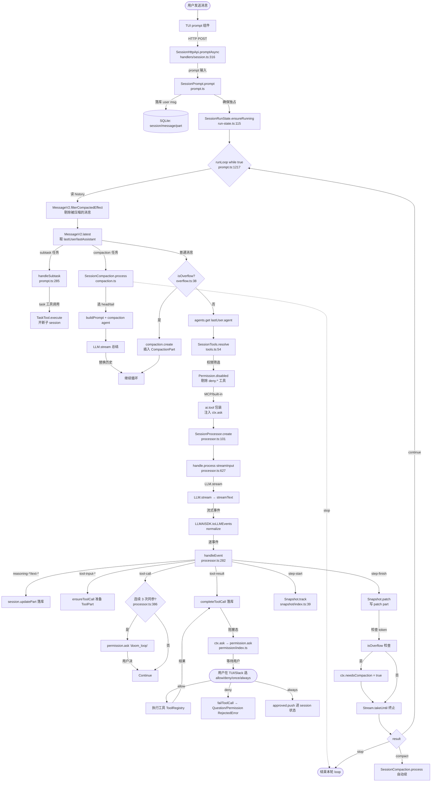
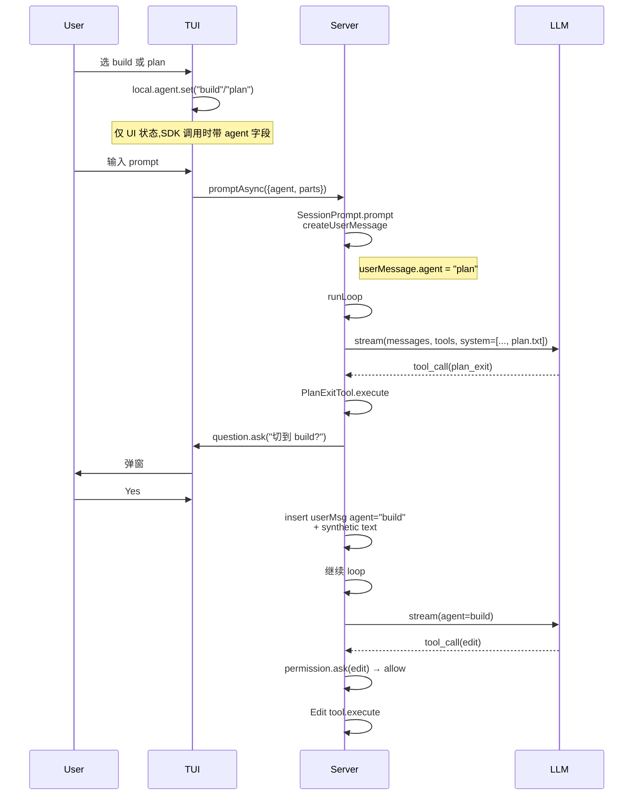

# opencode — Agent Loop 调研报告

> 调研对象:[sst/opencode](https://github.com/sst/opencode) (v1.18.3, 已迁移至 `anomalyco/opencode`)
> 调研日期:2026-07-18
> 源码路径:`C:\workspace\github\onionagent\harness\01_market_research\clone\opencode\`
> 报告路径:`C:\workspace\github\onionagent\harness\01_market_research\Opencode\agent_loop.md`
> 关联报告:`file_backend.md`(工作区/项目结构) · `tool_channel.md`(MCP 工具流)

---

## 0. 智能体一句话定位

**opencode 是一个用 TypeScript + Effect 框架写的、终端原生 TUI + Client/Server 双形态、100% 开源 + Provider 无关的 ReAct 编码 Agent**。它的 Agent Loop 是一段**单 step = 一次 LLM 调用的"事件流处理循环"**:每次 LLM stream 推下来一串 normalized 事件(reasoning / text / tool-input / tool-call / tool-result / step-start / step-finish),由 `SessionProcessor` 同步落库 + 写 snapshot + 触发权限 / 压缩决策,跑完一段返回 `"continue" | "stop" | "compact"` 三态结果;`SessionPrompt.runLoop` 是外层 `while (true)` 包装,基于"上一次 finish reason + 当前 lastUser"判断是否启动下一轮 step。Loop 中 plan / build 切换、sub-agent 委派、上下文压缩、人在环上审批全部通过**专门的 part / 工具调用 / 权限策略**实现,而非另起一条 loop。

---

## 1. 调研依据

### 1.1 源码路径

仓库结构 (`packages/` 是 monorepo 主体):

| 路径 | 作用 |
| --- | --- |
| `packages/opencode/` | **核心 server** — Agent、Session、Permission、Question、LSP、MCP、Tool 全部在这 |
| `packages/server/` | 独立可部署的 HTTP API(`httpapi` 路由) |
| `packages/tui/` | 终端前端,基于 Solid + `@opentui/core` |
| `packages/sdks/`, `packages/sdk/`, `packages/sdk-next/` | TS / Go / Python SDK |
| `packages/llm/` | 原生 LLM runtime(可绕过 Vercel AI SDK) |
| `packages/core/`, `packages/function/`, `packages/effect-drizzle-sqlite/` | 数据库 / Effect 工具链 / VCS |

### 1.2 关键文件(本报告引用)

| 主题 | 路径 | 核心角色 |
| --- | --- | --- |
| **Agent Loop 内核** | `packages/opencode/src/session/processor.ts` (627-680) | 单 step 事件循环 + snapshot + 压缩检测 + 重试封装 |
| **外层循环** | `packages/opencode/src/session/prompt.ts` (1081-1140) | `runLoop = while(true) { ... handle.process() }`,整 session 调度 |
| **LLM 流** | `packages/opencode/src/session/llm.ts` + `llm/ai-sdk.ts:121-244` | Vercel AI SDK `streamText` → normalized `LLMEvent` 流 |
| **Agent 定义** | `packages/opencode/src/agent/agent.ts:141-300` | `build` / `plan` / `general` / `explore` / `compaction` / `title` / `summary` |
| **Sub-agent 工具** | `packages/opencode/src/tool/task.ts:64-300` | `task` 工具(传 `subagent_type` 起子 session) |
| **工具解析** | `packages/opencode/src/session/tools.ts:54-` | 把 registry + MCP 工具包装为 AI SDK `tool()`,注入 `ctx.ask` |
| **Plan 切换** | `packages/opencode/src/tool/plan.ts` (`plan_exit`, 15-79) | plan 完成后弹"切到 build"问题 |
| **Plan 入口** | `packages/opencode/src/tool/plan-enter.txt` (description) | build agent 可调"建议切到 plan"的 prompt 描述 |
| **Ask 模式** | `packages/opencode/src/tool/question.ts` + `packages/opencode/src/question/index.ts:69-95` | 向用户提多选/多选,基于 `Deferred` 等待回复 |
| **权限** | `packages/opencode/src/permission/index.ts:28-30` (evaluate) | `evaluate(perm, pattern, ruleset)` 决定 `allow/deny/ask` |
| **压缩** | `packages/opencode/src/session/compaction.ts:188-420` + `overflow.ts:22-31` | `isOverflow` 触发 → 选 head/tail → 让 `compaction` agent 总结 |
| **快照** | `packages/opencode/src/snapshot/index.ts:39-43, 71` | git-based 文件快照,每 step 起始 `track()` 结束 `patch()` |
| **Session 互斥** | `packages/opencode/src/session/run-state.ts:52-100` | `Runner` 保证单 session 不会并发 |
| **LSP** | `packages/opencode/src/lsp/lsp.ts` + `tool/lsp.ts` | 内置多语言 LSP,工具 `lsp_*` 暴露 hover/symbol/... |
| **Server 入口** | `packages/opencode/src/server/routes/instance/httpapi/handlers/session.ts:272-340` | `promptAsync` / `loop` HTTP API 端点 |
| **TUI 切换** | `packages/tui/src/context/local.tsx:77-118` + `routes/session/index.tsx:325-333` | `local.agent.set("plan")` ↔ `local.agent.set("build")` |
| **重试** | `packages/opencode/src/session/retry.ts` | 指数退避 + 5xx/429 识别 + Go 套餐 upsell |
| **Plan system prompt** | `packages/opencode/src/session/prompt/plan.txt` | 强 READ-ONLY 约束 |
| **Explore system prompt** | `packages/opencode/src/agent/prompt/explore.txt` | 子 agent 提示词("搜索专员") |

### 1.3 关键文档

| 文档 | 路径 | 内容 |
| --- | --- | --- |
| 项目级 AGENTS.md | `clone/opencode/AGENTS.md` | 给 agent 看的工程规范(已确认) |
| 源码内 LLM agent 提示 | `packages/opencode/src/session/llm/AGENTS.md` | 描述 LLM 抽象层职责 |
| 上游 README | `clone/opencode/README.md` | 一句话介绍、键盘快捷键(待进一步确认 plan/build 快捷键细节) |

---

## 2. 九大问题回答

### Q1. Agent Loop 主流程

#### 1.1 整体架构(TUI / Server / LLM 三层)

**已确认。** opencode 是 **TUI / Server / SDK** 三种入口共享同一份 `opencode server` HTTP API。源码层面只有 **一份** Agent Loop 逻辑,封装在 `packages/opencode/src/server` 下的 Effect services 里;TUI 通过 `@opencode-ai/sdk` 调用 HTTP 端点。

调用链(已确认):

```
TUI 用户输入文本
  ↓ Solid 组件 local.tsx:320
sdk.client.session.promptAsync({ sessionID, agent, model, parts })
  ↓ HTTP POST /session/:id/prompt_async
packages/opencode/src/server/routes/instance/httpapi/handlers/session.ts:316
  SessionPrompt.prompt({...})    ← 落库 user message + 启动 loop
    ↓ Effect.forkIn(scope, startImmediately=true)
SessionPrompt.runLoop(sessionID)  ← prompt.ts:1217, while(true) 调度
    ↓ 每轮 step
processor.create({...})           ← processor.ts:101
processor.handle.process(streamInput)  ← processor.ts:627
    ↓ Effect.LLM.stream
LLM.stream(input)                 ← llm.ts:339-stream 顶层
    ↓ Vercel AI SDK
streamText({ tools, model, messages, ... })  ← llm.ts:308
    ↓ 流式事件
AI SDK fullStream → LLMAISDK.toLLMEvents()  ← llm/ai-sdk.ts:121
    ↓ normalized LLMEvent
processor.handleEvent(value)      ← processor.ts:282
    ↓ 触发
    ├─ session.updatePart(...) 落库
    ├─ tool.execute(...)       执行工具(tools.ts:78)
    └─ permission.ask(...)     人审批
```

#### 1.2 Agent Loop 主流程图(Mermaid)



#### 1.3 单 step(LLM 调用)与外层 while-loop 的关系

**已确认。** opencode 把"Agent Loop"拆成两层:

1. **内层单 step** = `SessionProcessor.process(streamInput)`(`processor.ts:627-680`)
   - 输入:已构造好的 system / messages / tools / model
   - 内部:跑 `LLM.stream` → `Stream.tap(handleEvent)` → `Stream.takeUntil(() => ctx.needsCompaction)` → `Stream.runDrain`
   - 返回:**三态字符串** `"compact" | "stop" | "continue"`(`processor.ts:30`)

2. **外层多 step** = `SessionPrompt.runLoop(sessionID)`(`prompt.ts:1081-1140`)
   - `while (true) { ... }` 循环,根据 `lastAssistant.finish` + `hasToolCalls` 决定下一轮
   - 退出条件(`prompt.ts:1111-1120`):
     - `lastAssistant.finish` 是 `"stop" | "length" | "content-filter" | "error"` **且** 没有未执行的 tool call → 退出
   - 进入下一轮条件:
     - 上一轮 `"continue"`(还有 tool 没跑完)
     - 上一轮 `"compact"` → 自动调 `compaction.create` 插入 CompactionPart → 继续
     - `lastAssistant.finish === "tool-calls"` → 继续(让 LLM 看 tool 结果再决定)

**关键设计点:** Loop 不是"LLM 返回 stop 就退出",而是"LLM 决定不再调用工具 **且** 没有遗留未执行 tool call"才退出;同时 `Permission.RejectedError` / `Question.RejectedError` 会让 `ctx.blocked = true` → 强制 `"stop"`(`processor.ts:197`)。

#### 1.4 build agent vs plan agent 的 loop 差异

**已确认。** 两者共用同一份 `SessionProcessor` 逻辑,**唯一区别在 Agent 定义**(`agent.ts:141-302`):

| 维度 | `build` (primary) | `plan` (primary) |
| --- | --- | --- |
| `description` | "default agent. Executes tools based on configured permissions." | "Plan mode. Disallows all edit tools." |
| `permission.question` | `"allow"` | `"allow"`(允许 `question` 工具提问) |
| `permission.plan_enter` | `"allow"`(可以调 `plan_enter` 切到 plan) | — |
| `permission.plan_exit` | — | `"allow"`(可调 `plan_exit` 切回 build) |
| `permission.task.general` | (默认) | `"deny"`(plan 阶段禁止启 sub-agent) |
| `permission.edit.*` | (默认) | `"deny"` + 允许 `.opencode/plans/*.md` 与 `~/.local/share/opencode/plans/*` |
| `mode` | `primary` | `primary` |

**loop 本身的差异**:
- build agent 调 `edit` / `write` / `apply_patch` → permission allow → 真正改文件
- plan agent 调 `edit` → permission deny → 抛 `PermissionV1.DeniedError` → processor.ts:197 `ctx.blocked = true` → loop 返回 `"stop"`
- plan agent 调 `plan_exit` → 弹出"Plan complete. Switch to build?" 的 Question → 用户答 Yes → 工具内部插入一条 `agent: "build"` 的 user message + synthetic text "The plan at X has been approved, you can now edit files. Execute the plan"(`plan.ts:46-72`)

#### 1.5 LSP 支持如何融入 loop

**已确认。** LSP 不在"主 loop"里,而是**作为 LLM 可调用的工具** + **编辑器辅助** 两路:

1. **作为工具**(用户显式调用):`packages/opencode/src/tool/lsp.ts` 暴露 14 个工具:
   - `lsp_hover`、`lsp_definition`、`lsp_references`、`lsp_implementation`、`lsp_document_symbol`、`lsp_workspace_symbol`、`lsp_prepare_call_hierarchy`、`lsp_incoming_calls`、`lsp_outgoing_calls`、`lsp_servers`、`lsp_diagnostics`
   - 这些都是普通 AI SDK `tool()`,LLM 在 loop 中可调

2. **作为编辑器**:`lsp/lsp.ts:128-181` `getClients(file)`:
   - 文件后缀匹配 `server.extensions`(例如 `.ts` → typescript-language-server、`.go` → gopls、`.py` → pyright/ty)
   - 通过 `lspspawn`(`lsp/launch.ts`)fork 进程,二进制下载到 `~/.cache/opencode/bin/`
   - `LSPClient.create()` 创建 LSP 客户端,缓存到 `state.clients` 复用
   - 调用时 `connection.sendRequest("textDocument/hover", ...)`

3. **集成到 Read 工具**:`prompt.ts:678-708`
   - 当 user message 带 `file://path?start=N&end=M` 链接时,先调 `lsp.documentSymbol(uri)` 找出符号范围,把 N 行起始对齐到最近的符号
   - 这让 "Read file:5-10 行" 在 LSP 可用时变成"读这个符号"

4. **与 snapshot 协同**:每 step 起始 `Snapshot.track()` 记录 git 哈希;LSP 诊断结果(`lsp_diagnostics` 工具)会被快照系统感知,出问题可 revert

#### 1.6 关键代码片段

`processor.ts:627-680`(`process` 函数核心):
```typescript
const process = Effect.fn("SessionProcessor.process")(function* (streamInput: LLM.StreamInput) {
  ctx.needsCompaction = false
  ctx.shouldBreak = (yield* config.get()).experimental?.continue_loop_on_deny !== true

  return yield* Effect.gen(function* () {
    yield* Effect.gen(function* () {
      ctx.currentText = undefined
      ctx.reasoningMap = {}
      yield* status.set(ctx.sessionID, { type: "busy" })
      const stream = llm.stream(streamInput)

      yield* stream.pipe(
        Stream.tap((event) => handleEvent(event)),    // 落库 + 权限 ask
        Stream.takeUntil(() => ctx.needsCompaction),  // 压缩触发立刻终止
        Stream.runDrain,
      )
    }).pipe(
      Effect.onInterrupt(() => Effect.gen(function* () {
        aborted = true
        if (!ctx.assistantMessage.error) {
          yield* halt(new DOMException("Aborted", "AbortError"))
        }
      })),
      Effect.retry(SessionRetry.policy({...})),     // 指数退避 + 5xx 重试
      Effect.catch(halt),                            // 错误转事件
      Effect.ensuring(cleanup()),                    // 落库未完成 part + 标 completed
    )

    if (ctx.needsCompaction) return "compact"
    if (ctx.blocked || ctx.assistantMessage.error) return "stop"
    return "continue"
  })
})
```

`prompt.ts:1081-1140`(`runLoop` 外层 while):
```typescript
const runLoop: (sessionID: SessionID) => Effect.Effect<SessionV1.WithParts> = Effect.fn("SessionPrompt.run")(
  function* (sessionID: SessionID) {
    const ctx = yield* InstanceState.context
    let structured: unknown
    let step = 0
    const session = yield* sessions.get(sessionID).pipe(Effect.orDie)

    while (true) {
      yield* status.set(sessionID, { type: "busy" })
      yield* Effect.logInfo("loop", { "session.id": sessionID, step })

      let msgs = yield* MessageV2.filterCompactedEffect(sessionID)...  // 剔除已压缩
      const { user: lastUser, assistant: lastAssistant, finished: lastFinished, tasks } = MessageV2.latest(msgs)
      ...
      if (
        lastAssistant?.finish && !["tool-calls"].includes(lastAssistant.finish) && !hasToolCalls && lastUser.id < lastAssistant.id
      ) break
      ...
    }
  },
)
```

---

### Q2. Plan 计划机制

#### 2.1 plan agent 是怎么实现的?

**已确认。** `plan` **不是** 另一个 loop,而是**同一个 `SessionProcessor` 配合一份 permission ruleset**(`agent.ts:156-180`):

```typescript
plan: {
  name: "plan",
  description: "Plan mode. Disallows all edit tools.",
  permission: Permission.merge(
    defaults,
    Permission.fromConfig({
      question: "allow",                                  // 可向用户提问
      plan_exit: "allow",                                 // 可调 plan_exit
      task: { general: "deny" },                          // 禁止起 sub-agent
      external_directory: {
        [path.join(Global.Path.data, "plans", "*")]: "allow",  // 允许写 plan 文件
      },
      edit: {
        "*": "deny",                                      // 全局禁 edit
        [path.join(".opencode", "plans", "*.md")]: "allow", // 但 plan 文件可写
        [path.relative(ctx.worktree, path.join(Global.Path.data, "plans", "*.md"))]: "allow",
      },
    }),
    user,
  ),
  mode: "primary",
  native: true,
},
```

**system prompt 注入**:`packages/opencode/src/session/prompt/plan.txt`(已读取,1.5KB):
```
<system-reminder>
# Plan Mode - System Reminder
CRITICAL: Plan mode ACTIVE - you are in READ-ONLY phase. STRICTLY FORBIDDEN:
ANY file edits, modifications, or system changes...
</system-reminder>
```

这个 prompt 会在每次 LLM 请求时随 system 消息一起发,告诉 LLM "你是只读的"。

#### 2.2 切换流程

**已确认。** 切换有**三种触发方式**:

| 触发 | 文件 | 行为 |
| --- | --- | --- |
| **TUI 用户按快捷键** (推测,需进一步确认具体键) | `packages/tui/src/context/local.tsx:107-117` | `local.agent.set("plan")` / `set("build")` |
| **build agent 主动建议** | `plan-enter.txt` 描述 + `plan.ts` 工具 | LLM 调 `plan_enter` 工具 → TUI 检测到 part.tool === "plan_enter" → `local.agent.set("plan")`(`routes/session/index.tsx:330-333`) |
| **plan agent 主动结束** | `plan.ts` 工具(PlanExitTool) | LLM 调 `plan_exit` 工具 → 弹"切到 build"Question → 工具内部插入 `agent: "build"` user message + 启动 loop → TUI `local.agent.set("build")`(`routes/session/index.tsx:325-329`) |

**完整切换时序图**:



#### 2.3 plan 内容存放在哪里?

**已确认。** plan 不是单独字段,而是 LLM 自己在 plan agent 模式下:
- 用 `write` 工具(因为 `.opencode/plans/*.md` 被 allow)写到 `<worktree>/.opencode/plans/<created-time>-<slug>.md`(git 项目)
- 或写到 `~/.local/share/opencode/plans/<created-time>-<slug>.md`(非 git 项目)

路径由 `Session.plan()` 函数计算(`session.ts:354-360`):
```typescript
export function plan(input: { slug: string; time: { created: number } }, instance: InstanceContext) {
  const base = instance.project.vcs
    ? path.join(instance.worktree, ".opencode", "plans")
    : path.join(Global.Path.data, "plans")
  return path.join(base, [input.time.created, input.slug].join("-") + ".md")
}
```

**对比 file_backend.md §2.1**:`<worktree>/.opencode/plans/` 是项目内路径(进 git),`~/.local/share/opencode/plans/` 是全局路径(不进 git)。

#### 2.4 plan_enter / plan_exit 工具在 system prompt 怎么描述

**plan_enter(给 build agent 看的)** — `plan-enter.txt`:
> Use this tool to suggest switching to plan agent when the user's request would benefit from planning before implementation.
> If they explicitly mention wanting to create a plan ALWAYS call this tool first.

**plan_exit(给 plan agent 看的)** — `plan-exit.txt`(已读,核心:在 plan 末尾调,触发切换)

---

### Q3. Sub Agent

**已确认。** opencode **有两种 sub-agent 形态**,共 2 个原生 subagent(`general` + `explore`):

#### 3.1 原生 subagent(`mode: "subagent"`)

定义在 `agent.ts:184-230`:

| Name | Description | 关键 Permission | 用途 |
| --- | --- | --- | --- |
| `general` | "General-purpose agent for researching complex questions and executing multi-step tasks. Use this agent to execute multiple units of work in parallel." | `todowrite: "deny"`(不让 sub-agent 再开 todo) | 通用委派,LLM 显式 `@general` 时调 |
| `explore` | "Fast agent specialized for exploring codebases..." | `*: "deny"` + `grep/glob/list/bash/webfetch/websearch/read: "allow"` | 只读探索,LLM 显式 `@explore` 时调(还可能由 plan agent 自动委派) |

**对比 build/plan**:这两者是 `mode: "subagent"`,**不会出现在 TUI 主切换列表**(`local.tsx:78` `agents().filter((agent) => agent.mode !== "subagent" && !agent.hidden)`)。

#### 3.2 Sub-agent 调度机制(task 工具)

**已确认。** `packages/opencode/src/tool/task.ts` 是 sub-agent 调度的核心:

**LLM 视角**:
```typescript
task(prompt="...", description="...", subagent_type="general" | "explore" | <custom>)
```

**实现细节**(`task.ts:64-300`):
1. **权限拦截**:`ctx.ask({ permission: "task", patterns: [params.subagent_type], always: ["*"] })`(`task.ts:119-125`)— 用户先批准"用这个 subagent"
2. **深度限制**:`cfg.subagent_depth ?? 1` — 默认 1 层(subagent 不能再生 subagent,需手动配置)
3. **派生权限**:`deriveSubagentSessionPermission()`(`subagent-permissions.ts:14-30`)继承父 session 的 deny 规则 + external_directory 规则
4. **创建子 session**:`sessions.create({ parentID: ctx.sessionID, ... })` — **新 session,parentID 指向当前**
5. **子 session 继续 disable 关键工具**:
   - `todowrite: "deny"`(除非 subagent 自己 allow)
   - `task: "deny"`(默认 subagent 不能再生 subagent)
   - `experimental.primary_tools.*: "deny"`(防 subagent 抢主 agent 工具)
6. **执行**:`ops.prompt({ sessionID: nextSession.id, agent: next.name, parts, model })` — **直接复用外层 `SessionPrompt.prompt`**,**跑完整 runLoop**
7. **结果回传**:`<task id="..." state="completed">...</task>` XML 格式渲染后作为 tool output 返回给主 session(`task.ts:44-55`)

#### 3.3 父子 session 关系

**已确认。** 通过 `parentID` 关联(`session.ts:create` 接受 `parentID`)。可调用 `Session.children(parentID)` 拉所有子 session;fork 则创建平行 session(`session.ts:fork`)。

**TUI 端**:`packages/tui/src/routes/session/dialog-subagent.tsx` 提供子 session 切换 UI。

#### 3.4 自定义 sub-agent

**已确认。** 用户可在 `<worktree>/.opencode/agents/<name>.md` 或 `~/.config/opencode/agents/<name>.md` 写 markdown + frontmatter 自定义 agent;`mode: "subagent"` 即可被 `@name` 引用;`task.ts:~121` 解析 `params.subagent_type`,传 `agents.get()` 查找。

#### 3.5 hidden primary agent(非 subagent 的内部 agent)

| Name | mode | 用途 |
| --- | --- | --- |
| `compaction` | primary, hidden | 上下文压缩专用(`agent.ts:241-256`),系统触发,UI 不可见 |
| `title` | primary, hidden | session 首轮对话后自动生成标题(`prompt.ts:191-243`),temperature 0.5 |
| `summary` | primary, hidden | session summary diff/统计(`prompt.ts` 通过 `summary.summarize` 调用) |

---

### Q4. Loop 退出机制

**已确认。** 退出由 **LLM 决策 + 系统约束** 共同决定,**用户可中断**。三层退出路径:

#### 4.1 内层单 step 退出(`processor.ts:627-680`)

| 退出原因 | 信号 | 返回值 | 触发位置 |
| --- | --- | --- | --- |
| 上下文超限 | `ctx.needsCompaction = true`(`processor.ts:481`) | `"compact"` | `Stream.takeUntil(() => ctx.needsCompaction)` |
| 用户拒绝权限/问题 | `ctx.blocked = true`(`processor.ts:197`) | `"stop"` | `failToolCall` 中检测 `PermissionV1.RejectedError` / `Question.RejectedError` |
| LLM 错误 | `ctx.assistantMessage.error` | `"stop"` | `halt()` (`processor.ts:605-625`) |
| 正常完成 | (无任何异常标记) | `"continue"` | (落到末尾 if 分支) |
| 用户主动 abort | AbortSignal 中断 | (uncaught) | `Effect.onInterrupt` → `halt(AbortError)` |

#### 4.2 外层 runLoop 退出(`prompt.ts:1111-1120`)

```typescript
if (
  lastAssistant?.finish &&
  !["tool-calls"].includes(lastAssistant.finish) &&
  !hasToolCalls &&
  lastUser.id < lastAssistant.id
) {
  ...
  yield* Effect.logInfo("exiting loop", { "session.id": sessionID })
  break  // 退出 while(true)
}
```

**LLM 决定的 finish reason**(`MessageV2` 解析自 AI SDK):
- `"stop"` — LLM 自己决定结束(无 tool call)
- `"length"` — 输出达到 `maxOutputTokens`
- `"content-filter"` — 被内容过滤器拦截(`prompt.ts:1306-1314` 转 error)
- `"error"` — LLM 报错
- `"tool-calls"` — LLM 调了工具,**不退出**,等工具结果回灌
- `"unknown"` — `prompt.ts:1301` 不当 "finished",继续

#### 4.3 用户主动中断

| 通道 | 路径 |
| --- | --- |
| TUI | `Escape` 键 → `state.cancel(sessionID)` → `run-state.ts:77-86` → runner.cancel → processor `AbortSignal` 触发 |
| HTTP API | `POST /session/:id/abort` → `SessionPrompt.cancel` → 同上 |
| `promptAsync` 收到新 prompt | `run-state.ts:88-95` `Runner` 检测并发 → 自动 fail 旧任务 |

#### 4.4 doom loop 检测(也属于一种被动退出)

**已确认。** `processor.ts:385-411`(实际 412 附近) 检测同一个 tool + 相同 input 连续触发 3 次(`DOOM_LOOP_THRESHOLD = 3`),**主动暂停**让用户决策:
```typescript
const recentParts = parts.slice(-DOOM_LOOP_THRESHOLD)
if (recentParts.length !== DOOM_LOOP_THRESHOLD ||
    !recentParts.every((part) => part.type === "tool" && part.tool === value.name && ...)) return
const agent = yield* agents.get(ctx.assistantMessage.agent)
yield* permission.ask({
  permission: "doom_loop",
  patterns: [value.name],
  ...
})
```

弹窗由 TUI/Slack 端处理 reply,**不会让 loop 结束**,而是把决策权交给用户。

---

### Q5. Ask 模式

**已确认。** opencode 把"问用户"分为**两种**机制,分别用于不同场景:

#### 5.1 工具级: `question` 工具(LLM 主动问)

**已确认。** `packages/opencode/src/tool/question.ts`:

```typescript
// LLM 视角的 schema
question({
  questions: [{
    question: "Which database to use?",
    header: "Database",        // 短标签,在 UI 里显示
    options: [
      { label: "PostgreSQL", description: "Relational, ACID" },
      { label: "SQLite", description: "Embedded, simple" },
    ],
  }, {
    question: "Migrate data?",
    header: "Migration",
    options: [
      { label: "Yes", description: "Run migration now" },
      { label: "No", description: "Skip migration" },
    ],
  }]
})
```

**底层实现** `question/index.ts:69-95`:
- 用 `Deferred<ReadonlyArray<Answer>, RejectedError>` 等待回复
- `events.publish(Event.Asked, info)` 通知前端
- 阻塞到 `svc.reply({ answers })` 或 `svc.reject(requestID)` 被调
- TUI 显示在 `routes/session/question.tsx`;HTTP API 在 `routes/instance/httpapi/handlers/question.ts`

**多选 vs 单选**:基于 `option.custom === false` 决定是 chip-select(单选)还是 input field(自定义输入),实际 schema:
```typescript
// from @opencode-ai/schema/question-v1
Option = Schema.Struct({
  label: Schema.String,
  description: Schema.String,
})
// questions[].options 是 options 数组
// users can pick multiple or none
```

#### 5.2 Plan agent 专属: `plan_exit` 工具(切换确认)

**已确认。** `plan.ts:PlanExitTool.execute`(`plan.ts:23-72`):
- plan 完成后 LLM 调 `plan_exit`
- 工具内部**不是直接切 build**,而是先弹 Question("切到 build?")
- 用户答 "No" → 抛 `Question.RejectedError` → 留在 plan
- 用户答 "Yes" → 插入 user message + synthetic text + 触发 loop 继续

#### 5.3 Read-only 提问

plan agent **只读**但能 `question`(`agent.ts:171` `question: "allow"`),所以 LLM 在 plan 阶段可以反复向用户确认 trade-off 而不会污染文件。

#### 5.4 异步事件机制

**已确认。** `Question` 和 `Permission` 都用**相同模式**:
1. 工具调用 → `Effect.fn("Question.ask")` 分配 `QuestionID.ascending()`
2. `state.pending.set(id, { info, deferred })` 存到 in-memory map
3. `events.publish(Event.Asked, info)` 发到 EventV2 总线
4. `Deferred.await(deferred)` 阻塞
5. TUI / Slack / HTTP 收到事件 → 弹窗 → 用户操作 → 调 `reply` / `reject`
6. `reply` 调 `Deferred.succeed(deferred, answers)` 解锁
7. `Effect.ensuring(Deferred.await, Effect.sync(() => pending.delete(id)))` 清理

**重要特点**:问题/权限 ask **完全异步**,可跨 TUI / Slack / Web UI 同时存在(opencode 启 server 后,IDE 插件也能 `prompt` 同样的 session)。

---

### Q6. Human-in-the-Loop (HITL)

**已确认。** HITL 在 opencode 里是**一等公民**,所有可逆操作都必须经过 `Permission.ask` 才能执行。

#### 6.1 触发场景

| 触发点 | 工具/行为 | 权限名 |
| --- | --- | --- |
| 写/编辑文件 | `edit` / `write` / `apply_patch` | `edit` |
| 读敏感文件(`.env`) | `read` | `read`(`*` allow,`*.env` ask) |
| 访问项目外目录 | `bash` / `read` / `edit` | `external_directory` |
| Doom loop | (auto-detect) | `doom_loop` |
| MCP 工具调用 | 任何 `mcp:*` | `mcp:<server>:<tool>` |
| 启动 subagent | `task` | `task` |
| 切到 plan | `plan_enter` | `plan_enter` |
| 切回 build | `plan_exit` | `plan_exit` |
| 重试 budget 耗尽 | (auto) | (retry 显示) |
| 问用户 | `question` 工具 | `question` |

#### 6.2 三种回复:`allow` / `deny` / `always` / `once`

**已确认。** `Permission.reply`(`permission/index.ts:101-150`)支持 4 种 reply:

| Reply | 行为 | 持久化? |
| --- | --- | --- |
| `"once"` | 当前请求 allow,不加到 approved 列表 | ❌ |
| `"always"` | 把 `request.always` 数组里所有 pattern 加到 `state.approved` | ✅ 进内存 |
| `"reject"` | 拒绝 + 自动 reject 同一 session 后续所有 pending request | ❌ |
| (隐式 reject) | 同 session 后续所有同权限 ask 自动 deny(`reply` 函数 for 循环) | ❌ |

**注意 `state.approved` 是内存级**,**不持久化到 SQLite**。重启 opencode 后,所有 `always` 失效(每次启动走默认 ruleset)。这与 Cline/Aider 的"持久化 allow list"不同。

#### 6.3 用户确认/拒绝/修正的 UI 路径

**TUI**: `routes/session/permission.tsx` 显示
- 权限名(例 "edit")
- pattern(例 "src/foo.ts")
- "Allow / Allow always / Reject" 三个按钮
- 还可输入"修正消息"(将被作为 `CorrectedError` 的 feedback 抛回 LLM,见下文)

**HTTP API**: `POST /permission/:id/reply` with `{ reply: "allow" | "once" | "always" | "reject", message?: string }`

**SDK**:
```typescript
await sdk.client.permission.reply({
  requestID: "...",
  reply: "once",
  message: "Use my fork at github.com/me/repo instead",  // ← 修正
})
```

#### 6.4 修正(corrected) vs 拒绝(rejected)

**已确认。** `permission/index.ts:124-135`:
```typescript
if (input.reply === "reject") {
  yield* Deferred.fail(
    existing.deferred,
    input.message
      ? new PermissionV1.CorrectedError({ feedback: input.message })
      : new PermissionV1.RejectedError(),
  )
  ...
}
```

| 错误类型 | processor.ts:197 行为 | LLM 看到什么 |
| --- | --- | --- |
| `RejectedError`(无 message) | `ctx.blocked = true` → loop `"stop"` | tool 报错 "Permission denied" |
| `CorrectedError`(有 message) | `ctx.blocked = false` → loop 继续 | tool 报错 + 用户反馈 message 进入 LLM 上下文 |

**这与 Cline 风格很不同**:Cline 的 reject 直接退出,opencode 的 reject 还能附带"建议"(实际是 `corrected`,但 reply 协议用 `"reject"` reply + message 字段触发)。

#### 6.5 权限评估算法

`permission/index.ts:28-30`:
```typescript
export function evaluate(permission: string, pattern: string, ...rulesets: PermissionV1.Ruleset[]): PermissionV1.Rule {
  return (
    rulesets.flat()
      .findLast((rule) => Wildcard.match(permission, rule.permission) && Wildcard.match(pattern, rule.pattern)) ?? {
      action: "ask", permission, pattern: "*",
    }
  )
}
```

- `findLast` — 最后一条匹配的 rule 生效(配置 override 机制)
- `Wildcard.match` — 支持 `*` 通配符(`util/wildcard.ts`)
- 默认 fallback `ask`(无规则时总是问)

**规则合并**(`agent.ts:102-105` 之外):`Permission.merge(defaults, ...override, user)` — flat concat,**不深合并**,后面的 rule 优先。

#### 6.6 全局 config vs Session 级 override

| 级别 | 位置 | 加载方式 |
| --- | --- | --- |
| 全局默认 | `Permission.fromConfig(defaults)` 写在 `agent.ts:103` | hardcoded in source |
| 用户 config | `~/.config/opencode/opencode.jsonc` 里的 `permission` 字段 | `Config.get()` 注入 |
| Agent 级 | `<worktree>/.opencode/agents/<name>.md` 的 `permission:` frontmatter | `Agent.Service` 加载时 merge |
| Session 级 | DB `session.permission` 字段 | `setPermission()` API 调用 |
| Run-time approved | `Permission.state.approved`(内存) | `reply` with `"always"` |

---

### Q7. 工具调用权限

**已确认。** opencode 的权限系统是**模式驱动 + 模式 fallback 到 `ask`**。三层防护:

#### 7.1 工具发现层(registry)

`packages/opencode/src/tool/registry.ts` + `tools.ts:78-90`:
```typescript
const tools: Record<string, AITool> = {}
for (const item of yield* registry.tools({ modelID, providerID, agent, permission: input.session.permission })) {
  const schema = ProviderTransform.schema(input.model, ToolJsonSchema.fromTool(item))
  tools[item.id] = tool({
    description: item.description,
    inputSchema: jsonSchema(schema),
    execute(args, options) { ... }
  })
}
```

- `registry.tools()` 返回**已根据 agent 权限和 session 权限筛选过的**工具集
- 工具的 `execute` 包了 `ctx.ask({ permission: tool.id, ... })`,**在执行时再次校验**
- 双重防护:即使工具进了 schema,执行前还会 ask

#### 7.2 三种权限(allow / deny / ask)

| 规则 | 含义 | 触发 |
| --- | --- | --- |
| `allow` | 静默执行,无 UI | 命中 `state.approved` 或 `agent.permission` allow |
| `deny` | 抛 `DeniedError`(`ctx.blocked = true` → loop stop) | `agent.permission` deny(plan agent 禁 edit) |
| `ask` | 弹窗等用户 | 任何不在 allow/deny 列表的 |

**ask 之后的回复**:见 Q6.2(once / always / reject / corrected)。

#### 7.3 通配符

`packages/opencode/src/util/wildcard.ts`:`*` 通配符匹配多段,`?` 单字符。
- `*.env` 匹配所有 `.env` 后缀
- `mcp:*` 匹配所有 MCP server
- `src/*` 匹配 `src/` 一层
- 复杂模式需用 `~` 或 `$HOME` 展开(`permission/index.ts:159-170` `expand()` 函数)

#### 7.4 config 文件结构

```jsonc
// ~/.config/opencode/opencode.jsonc
{
  "permission": {
    "edit": "allow",                 // 全局允许
    "bash": "ask",                   // 全局询问
    "webfetch": "deny",              // 全局禁止
    "read": {
      "*": "allow",
      "*.env": "ask",                // 但 .env 询问
      "~/.ssh/**": "deny",           // SSH 密钥禁止
    },
    "external_directory": {
      "~/.local/share/opencode/plans/*": "allow",
      "*": "ask",                    // 其他外部目录问
    },
    "task": {
      "explore": "allow",            // 允许启 explore subagent
      "general": "ask",              // 启 general subagent 询问
    }
  }
}
```

#### 7.5 工具可见性(`disabled` / `visibleTools`)

`permission/index.ts:172-191`:
- `disabled(tools, ruleset)` — 返回**完全被 `*: deny` 屏蔽**的工具集合,**不传给 LLM**
- `visibleTools(tools, ruleset)` — 过滤掉 disabled 工具
- 触发场景:plan agent 的 `edit: { "*": "deny" }` → `edit` / `write` / `apply_patch` 都从 LLM 工具列表中**物理移除**(LLM 根本看不到,不是"调了再 deny")

**对比 Cline/Aider**:Cline 的 plan mode 是"工具还在,但每次都 ask",opencode 的 plan mode 是"工具直接消失"。这种"硬隔离"是更安全的设计。

---

### Q8. 上下文压缩和摘要

**已确认。** opencode 有**两层**压缩机制:**轻量 prune**(老 tool output 截断) + **重量 compaction**(LLM 生成 summary)。

#### 8.1 触发条件(isOverflow)

`packages/opencode/src/session/overflow.ts:22-31`:
```typescript
export function isOverflow(input: { cfg, tokens, model, outputTokenMax? }) {
  if (input.cfg.compaction?.auto === false) return false
  if (input.model.limit.context === 0) return false
  const count = input.tokens.total || input.tokens.input + input.tokens.output + input.tokens.cache.read + input.tokens.cache.write
  return count >= usable(input)   // context - reserved buffer
}
```

`usable()`:
```typescript
const reserved = cfg.compaction?.reserved ?? Math.min(COMPACTION_BUFFER /* 20_000 */, maxOutputTokens)
return model.limit.input ? Math.max(0, model.limit.input - reserved) : Math.max(0, context - maxOutputTokens)
```

**默认策略**:
- 留 20K token 给响应 + 压缩本身
- LLM 单步 `tokens.total`(input + output + cache read + cache write)≥ `usable()` → 触发压缩

#### 8.2 触发时机

`processor.ts:402-411`(step-finish 时检查):
```typescript
if (!ctx.assistantMessage.summary && isOverflow({ cfg, tokens: usage.tokens, model: ctx.model })) {
  ctx.needsCompaction = true
}
```

`prompt.ts:1278-1284`(runLoop 中):
```typescript
if (lastFinished && lastFinished.summary !== true && (yield* compaction.isOverflow({ tokens: lastFinished.tokens, model }))) {
  yield* compaction.create({ sessionID, agent: lastUser.agent, model: lastUser.model, auto: true })
  continue   // 立即开始压缩
}
```

#### 8.3 压缩算法(`compaction.ts:188-240` `select`)

**目标**:从长 history 中选"head(将被压缩)" + "tail(保留原样)"。

```
budget = compaction.preserve_recent_tokens 
       ?? min(8000, max(2000, floor(usable * 0.25)))  // 默认 25% 给 tail

recent = turns(msgs).slice(-tail_turns ?? 2)  // 取最近 2 轮 user message

for each turn from newest to oldest:
  if total + size <= budget:
    total += size; keep = turn
  else:
    split turn at budget boundary
    break

return { head: msgs[0..keep.start], tail_start_id: keep.id }
```

- **turn**:从 user message 到下一个 user message 之间的所有 message
- **tail 保留**:最近 2 轮 user,每轮按 token budget 切割
- **head 压缩**:用 compaction agent(`agent.ts:241-256`)生成 summary

#### 8.4 压缩执行(`compaction.ts:233-298`)

```typescript
const agent = yield* agents.get("compaction")  // 专门 agent
const msgs = structuredClone(selected.head)
// 调 buildPrompt + LLM.stream 生成 summary
const result = yield* processor.process({
  user: userMessage, agent, sessionID, tools: {},
  system: [], messages: [...modelMessages, { role: "user", content: [{ type: "text", text: buildPrompt(...) }] }],
  model,
})

if (result === "continue" && input.auto) {
  // 自动注入 "Continue if you have next steps" user message
  // 或在 overflow 时注入解释 "attachments too large"
}
```

**compaction agent**(`agent.ts:241-256`):
- `mode: "primary"`, `hidden: true`
- `permission: { "*": "deny" }` — **完全无工具**,纯 LLM 总结
- `prompt: PROMPT_COMPACTION`(`prompt/compaction.txt`)— "you are an anchored context summarization assistant"

#### 8.5 持久化

`compactionPart` 插入到 user message 上:
```typescript
// compaction.ts:300-315
yield* session.updatePart({
  id: PartID.ascending(),
  messageID: msg.id,
  sessionID: input.sessionID,
  type: "compaction",
  auto: input.auto,
  overflow: input.overflow,
})
```

下次 loop 读 history 时(`prompt.ts:1224`):
```typescript
let msgs = yield* MessageV2.filterCompactedEffect(sessionID)  // 剔除 head 部分
```

`MessageV2.filterCompacted` 通过 `CompactionPart.tail_start_id` 切分 — 保留 tail_start_id 之后的所有 message + 把 head 替换为 CompactionPart。

#### 8.6 prune(轻量截断,辅助压缩)

`compaction.ts:191-228`:
- **触发**:`runLoop` 退出后(每轮都跑)或手动调
- **算法**:从新到旧扫描 tool output,累计 token 数,超过 `PRUNE_PROTECT = 40_000` 的部分把 `state.output` 清空
- **保护**:`PRUNE_PROTECTED_TOOLS = ["skill"]`(skill tool 输出永不截断)
- **最小收益**:`pruned > PRUNE_MINIMUM = 20_000`(节省至少 20K token 才真截断)
- **持久化**:在 `part.state.time.compacted` 打时间戳(下次 prune 跳过)

#### 8.7 多重压缩 / 锚点摘要

**已确认。** `compaction.ts:74-92` `completedCompactions` + `buildPrompt({ previousSummary, context })`:
- 多次压缩时,新 summary 会**接续上次 summary**(因为前次 head 部分仍以 CompactionPart 形式存)
- `previousSummary = prior.at(-1)?.summary` 注入到 prompt 让 compaction agent "继续" 而非"从零开始"
- 形成**金字塔形 history**:`[old_summary_1] + [head_2 → summary_2] + [head_3 → summary_3] + [tail]`

#### 8.8 用户手动触发

`POST /session/:id/summarize`:
```typescript
// handlers/session.ts:272-291
yield* compactSvc.create({ sessionID, agent, model, auto: ctx.payload.auto ?? false })
yield* promptSvc.loop({ sessionID })  // 手动启动 loop 跑压缩
```

`auto: false` → 压缩后**不自动续**(用户自己决定下一步)。

---

### Q9. 其他亮点

#### 9.1 100% 开源 + Provider 无关

- 仓库:Apache 2.0,无 enterprise 付费功能(已确认 `LICENSE` 文件)
- 所有原生 agent / tool / command 的 source prompt 和 description 都以 `.txt` / 内嵌 string 形式存在仓库内
- 任何模型可换:`provider/provider.ts` 抽象,`@opencode-ai/llm` 包支持 Anthropic / OpenAI / Google / Bedrock / Groq / OpenRouter / Copilot / GitLab Workflow / Ollama(部分)
- 配置:`~/.config/opencode/opencode.jsonc` 里 `provider.<id>` 字段即可加自定义 endpoint

#### 9.2 Vercel AI SDK 统一

- 核心是 `streamText` + `generateObject`(`ai` 包)
- `llm.ts:225-313` 把 AI SDK 的 `fullStream` 通过 `LLMAISDK.toLLMEvents()`(`llm/ai-sdk.ts:121-244`) 统一为内部 `LLMEvent` 类型:
  - `start` / `start-step` / `finish-step` / `finish`
  - `text-start` / `text-delta` / `text-end`
  - `reasoning-start` / `reasoning-delta` / `reasoning-end`
  - `tool-input-start` / `tool-input-delta` / `tool-input-end` / `tool-call` / `tool-result` / `tool-error`
  - `source` / `file` / `raw` / `error` / `abort`
- 上层 processor 永远只看 `LLMEvent`,不直接接触 AI SDK
- **`@opencode-ai/llm` 是"逃生口"**:flags.experimentalNativeLlm 开启后,`LLMNativeRuntime.stream()` 可绕过 AI SDK,直接用 Vercel AI Gateway 的 provider 抽象(`llm.ts:218-260`),逻辑路径会落到 `stream: native.stream`

#### 9.3 Client/Server 架构

- `opencode serve` / `opencode tui` 启动 HTTP server + TUI 共存
- `x-opencode-directory` header / `?location[directory]=` query 支持**多项目并发**(`server/src/location.ts:32-39`)
- Session 互斥:同一 session 只允许一个 runner 跑(`run-state.ts:118-137`);`Session.BusyError` 给新 prompt 返回
- SDK 多语言:`@opencode-ai/sdk`(TS)、`@opencode-ai/sdk-go`、`@opencode-ai/sdk-python`
- Slack / Web 入口:`packages/slack/` `packages/web/` 都基于同一 server

#### 9.4 LSP 内置

- 16+ 语言:`lsp/server.ts` 列出所有内置 LSP server
- 工具入口:`tool/lsp.ts` 暴露 hover / definition / references / symbol / call hierarchy / diagnostics
- 自动检测文件后缀启动 server,`lsp/lsp.ts:140-180` 缓存 client
- 与 Read 工具深度集成:`prompt.ts:678-708` 把行号偏移到 LSP symbol 边界
- 诊断:`lsp_diagnostics` 工具返回当前文件的所有 LSP 警告/错误

#### 9.5 Snapshot + Revert

- `Snapshot.track()` 用 git-based 哈希(全文件 hash,`snapshot/index.ts:39`)
- 每 step 起始 + step 结束记录 patch 列表
- 用户可在 TUI 任意时刻 `/revert` 回到任意 step
- 同时存 `patch.files` part(显示 diff 给用户)

#### 9.6 Plugin 机制(深度)

- `Plugin.Service` 提供 `experimental.*` 钩子(`processor.ts:282+` `prompt.ts:1341` 等)
- 钩子列表(已确认出现):
  - `experimental.chat.system.transform` — 改 system prompt
  - `experimental.chat.messages.transform` — 改 message 列表
  - `experimental.text.complete` — 改 text output
  - `experimental.session.compacting` — 改 compaction prompt
  - `tool.execute.before` / `tool.execute.after` — 工具前后
  - `command.execute.before` — 命令执行前
  - `chat.message` — user message 落库前
  - `shell.env` — shell 环境变量
- 插件用 TypeScript 写,自动 `npm install @opencode-ai/plugin` 注入(`config.ts:447-461`)

#### 9.7 异步 Background subagent(实验)

`flags.experimentalBackgroundSubagents`(`task.ts:73-78`)开启后,`task` 工具支持 `background: true`:
- 立即返回 `<task>running in background</task>`
- 用 `BackgroundJob.Service` 跑后台
- 完成时自动注入结果到父 session(`task.ts:injectBackgroundResult`)

#### 9.8 do/while 风格 loop 而非纯 while(true)

- `runLoop` 是 `while (true)`,但**第一行就是 `status.set(busy)`** —— 无条件 busy
- 退出用 `break`,靠 `if (lastAssistant?.finish && !tool-calls && !hasToolCalls && lastUser.id < lastAssistant.id)` 守门
- 与 Claude Code 的 `while (true) { llm(); execute_tools(); }` 同结构,但 opencode 多了一个"compaction 任务优先于普通 message"的 `tasks.pop()` 调度(`prompt.ts:1260-1285`)

#### 9.9 与 LLM 协议无关

- `LLM.stream(input)` 返回 `Stream.Stream<LLMEvent, unknown>` —— Effect Stream,可与 `Stream.tap` / `Stream.takeUntil` / `Stream.runDrain` 组合
- processor 端无需知道是哪个 provider,只看事件
- provider 切换无需改任何 session / tool / permission 代码

---

## 3. 关键代码片段(摘录)

### 3.1 单 step 退出决策(`processor.ts:627-680`)

```typescript
const process = Effect.fn("SessionProcessor.process")(function* (streamInput: LLM.StreamInput) {
  ctx.needsCompaction = false
  ctx.shouldBreak = (yield* config.get()).experimental?.continue_loop_on_deny !== true

  return yield* Effect.gen(function* () {
    yield* Effect.gen(function* () {
      ctx.currentText = undefined
      ctx.reasoningMap = {}
      yield* status.set(ctx.sessionID, { type: "busy" })
      const stream = llm.stream(streamInput)

      yield* stream.pipe(
        Stream.tap((event) => handleEvent(event)),
        Stream.takeUntil(() => ctx.needsCompaction),
        Stream.runDrain,
      )
    }).pipe(
      Effect.onInterrupt(() => Effect.gen(function* () {
        aborted = true
        if (!ctx.assistantMessage.error) {
          yield* halt(new DOMException("Aborted", "AbortError"))
        }
      })),
      Effect.retry(SessionRetry.policy({...})),
      Effect.catch(halt),
      Effect.ensuring(cleanup()),
    )

    if (ctx.needsCompaction) return "compact"
    if (ctx.blocked || ctx.assistantMessage.error) return "stop"
    return "continue"
  })
})
```

### 3.2 doom loop 检测(`processor.ts:385-411`)

```typescript
const recentParts = parts.slice(-DOOM_LOOP_THRESHOLD)  // = 3
if (
  recentParts.length !== DOOM_LOOP_THRESHOLD ||
  !recentParts.every(
    (part) =>
      part.type === "tool" &&
      part.tool === value.name &&
      part.state.status !== "pending" &&
      JSON.stringify(part.state.input) === JSON.stringify(input),
  )
) return

const agent = yield* agents.get(ctx.assistantMessage.agent)
yield* permission.ask({
  permission: "doom_loop",
  patterns: [value.name],
  sessionID: ctx.assistantMessage.sessionID,
  metadata: { tool: value.name, input },
  always: [value.name],
  ruleset: agent.permission,
})
```

### 3.3 权限评估(`permission/index.ts:28-30`)

```typescript
export function evaluate(permission: string, pattern: string, ...rulesets: PermissionV1.Ruleset[]): PermissionV1.Rule {
  return (
    rulesets.flat()
      .findLast((rule) =>
        Wildcard.match(permission, rule.permission) &&
        Wildcard.match(pattern, rule.pattern)
      ) ?? { action: "ask", permission, pattern: "*" }
  )
}
```

### 3.4 plan agent 权限配置(`agent.ts:156-180`)

```typescript
plan: {
  name: "plan",
  description: "Plan mode. Disallows all edit tools.",
  options: {},
  permission: Permission.merge(
    defaults,
    Permission.fromConfig({
      question: "allow",
      plan_exit: "allow",
      task: { general: "deny" },
      external_directory: {
        [path.join(Global.Path.data, "plans", "*")]: "allow",
      },
      edit: {
        "*": "deny",
        [path.join(".opencode", "plans", "*.md")]: "allow",
        [path.relative(ctx.worktree, path.join(Global.Path.data, "plans", "*.md"))]: "allow",
      },
    }),
    user,
  ),
  mode: "primary",
  native: true,
},
```

### 3.5 plan_exit 工具切换 build agent(`tool/plan.ts:23-72`)

```typescript
execute: (_params: {}, ctx: Tool.Context) =>
  Effect.gen(function* () {
    const instance = yield* InstanceState.context
    const info = yield* session.get(ctx.sessionID)
    const plan = path.relative(instance.worktree, Session.plan(info, instance))
    const answers = yield* question.ask({
      sessionID: ctx.sessionID,
      questions: [{
        question: `Plan at ${plan} is complete. Would you like to switch to the build agent and start implementing?`,
        header: "Build Agent",
        custom: false,
        options: [
          { label: "Yes", description: "Switch to build agent and start implementing the plan" },
          { label: "No", description: "Stay with plan agent to continue refining the plan" },
        ],
      }],
      tool: ctx.callID ? { messageID: ctx.messageID, callID: ctx.callID } : undefined,
    })

    if (answers[0]?.[0] === "No") yield* new Question.RejectedError()

    // 插入 user message 切到 build
    const msg: SessionV1.User = {
      id: MessageID.ascending(),
      sessionID: ctx.sessionID,
      role: "user",
      time: { created: Date.now() },
      agent: "build",  // ← 关键
      model,
    }
    yield* session.updateMessage(msg)
    yield* session.updatePart({
      ...
      type: "text",
      text: `The plan at ${plan} has been approved, you can now edit files. Execute the plan`,
      synthetic: true,
    })
    ...
  }).pipe(Effect.orDie),
```

### 3.6 压缩 select 策略(`compaction.ts:188-240`)

```typescript
const select = Effect.fn("SessionCompaction.select")(function* (input) {
  const limit = input.cfg.compaction?.tail_turns ?? DEFAULT_TAIL_TURNS  // = 2
  if (limit <= 0) return { head: input.messages, tail_start_id: undefined }
  const budget = preserveRecentBudget({ cfg, model })
  const all = turns(input.messages)
  if (!all.length) return { head: input.messages, tail_start_id: undefined }
  const recent = all.slice(-limit)
  const sizes = yield* Effect.forEach(recent, (turn) => estimate({...}), { concurrency: 1 })

  let total = 0
  let keep: Tail | undefined
  for (let i = recent.length - 1; i >= 0; i--) {
    const turn = recent[i]!
    const size = sizes[i]
    if (total + size <= budget) {
      total += size
      keep = { start: turn.start, id: turn.id }
      continue
    }
    const remaining = budget - total
    const split = yield* splitTurn({...})  // 在 budget 边界切 turn
    if (split) keep = split
    else if (!keep) yield* Effect.logInfo("tail fallback", { budget, size, total })
    break
  }
  if (!keep || keep.start === 0) return { head: input.messages, tail_start_id: undefined }
  return {
    head: input.messages.slice(0, keep.start),
    tail_start_id: keep.id,
  }
})
```

### 3.7 TUI 检测 plan 切换(`routes/session/index.tsx:325-333`)

```typescript
if (part.id === lastSwitch) return
if (part.tool === "plan_exit") {
  local.agent.set("build")
  lastSwitch = part.id
} else if (part.tool === "plan_enter") {
  local.agent.set("plan")
  lastSwitch = part.id
}
```

### 3.8 task 工具启动 subagent(`tool/task.ts:64-300`)

```typescript
// 1. 权限校验
if (!ctx.extra?.bypassAgentCheck) {
  yield* ctx.ask({
    permission: id, patterns: [params.subagent_type], always: ["*"],
    metadata: { description: params.description, subagent_type: params.subagent_type },
  })
}
// 2. depth 限制
while (current.parentID) { depth++; current = yield* sessions.get(current.parentID) }
if (depth >= (cfg.subagent_depth ?? 1)) return yield* Effect.fail(new Error("..."))
// 3. 派生 subagent 权限(继承 deny + external_directory,加 todowrite/task deny)
const childPermission = deriveSubagentSessionPermission({...})
// 4. 创建子 session(parentID 关联)
const nextSession = session ?? (yield* sessions.create({ parentID: ctx.sessionID, ... }))
// 5. 跑子 session 的 prompt(= 完整 runLoop)
const result = yield* ops.prompt({
  messageID: MessageID.ascending(),
  sessionID: nextSession.id,
  model: { modelID: model.modelID, providerID: model.providerID },
  agent: next.name,
  parts,
})
```

---

## 4. 与 Onion Agent 设计的关联

> 假设 Onion Agent 的"洋葱架构"指:以 session.json 上下文历史为圆心,逐层扩展(权限 / 工具 / subagent / 记忆),Agent Loop 是 session 的累加器。

### 4.1 可借鉴的设计

| opencode 实践 | 文件位置 | Onion Agent 可借鉴点 |
| --- | --- | --- |
| **三层 Agent 定义(builtin + user config + session-level override)** | `agent.ts:102-105, 280-300` | Onion Agent 可以让 `config/agent/*.md`(项目级)+ `~/.config/onion/agent/*.md`(全局)+ session DB 字段 三层 merge,后写覆盖前写 |
| **Permission Ruleset(Wildcard + findLast 优先级)** | `permission/index.ts:28-30` | Onion Agent 可直接复用:规则数组 + 后写优先 + 默认 ask,比 YAML 嵌套更易组合 |
| **三态返回("compact" / "stop" / "continue")** | `processor.ts:30, 502-506` | Onion Agent 不用三态字符串,可以定义更显式的 `enum LoopOutcome { Continue, Stop, Compact, Compress, AwaitingUser }` |
| **Stream.takeUntil 终止条件** | `processor.ts:493` | 复用 Effect Stream / RxJS / asyncio 取消:`takeUntil(compactionNeeded)`,O(N) 流式,不重启循环 |
| **Snapshot + Patch 增量记录** | `snapshot/index.ts:39-43, 71` | Onion Agent 如果用 git 自动快照,可以把每个 step 当 commit,revert 就是 git reset |
| **session 互斥 Runner** | `run-state.ts:118-137` | 防止 race condition:同一 session 不会并发跑两次 loop(但 subagent 走独立 session,所以 OK) |
| **DooM loop 被动检测(连续 3 次同参)** | `processor.ts:385-411` | Onion Agent 可以用同样的"滑动窗口 + 去重"算法,无需 LLM 干预 |
| **Question 系统用 Deferred 异步等待** | `question/index.ts:69-95` | Onion Agent 想支持 Slack / Web / IDE 弹窗,这种 in-memory Deferred + 事件总线是干净的解 |
| **CorrectedError 反馈机制** | `permission/index.ts:124-135` | 拒绝时附 message → 注入 LLM 上下文,LLM 据此调整。Cline 风格用户反馈;但比 "请重新表述" 更直接 |
| **session-fork 创建分支 session** | `session.ts:fork` | Onion Agent 想做"基于历史某点试不同方案"时,直接 fork session 比 git branch 更轻量 |
| **5 个原生 agent(build/plan/general/explore/compaction)** | `agent.ts:141-302` | Onion Agent 可以原生提供 build/plan/explore 三个,compaction 走 hidden |
| **task 工具的 `subagent_depth = 1` 默认** | `task.ts:99-117` | 防 subagent 无限递归,深度 1 是安全默认值;Onion Agent 可暴露 `subagent_depth` config |
| **tab 切换的 UX(local.agent.set)** | `tui/src/context/local.tsx:107-117` | 如果 Onion Agent 做 TUI,plan/build 切换应该有显式 UI 状态而非仅靠 session.agent 字段 |
| **流式事件 LLMEvent 类型统一** | `llm/ai-sdk.ts:121-244` | Onion Agent 如果支持多 provider,这个抽象层几乎可以照搬(只是事件名要改) |

### 4.2 需要规避 / 思考的问题

| opencode 的痛点 | Onion Agent 建议 |
| --- | --- |
| **2 层 + 5 个 env 变量 + 4 层 config merge**(见 file_backend.md §4.2) | 收敛到 2 个 env 变量 + 3 层 merge(全局 → 项目 → session) |
| **`process.cwd()` 兜底,工作区无明确边界**(file_backend.md §4.2) | 强制要求 `.onion/` 标记或 git 根,无标记时报错而非 fallback |
| **Plan agent 的"工具物理消失"太严苛** | Onion Agent 可以更柔和:plan 模式下 edit 工具还在 schema 但每次都 ask(便于 LLM 学习 trade-off) |
| **`state.approved` 不持久化**(Q6.2) | 重新启动后用户"always allow" 丢失,体验差。Onion Agent 应该把 approved 写到 session DB |
| **compaction agent 必须有 model,默认走 user model**(`compaction.ts:265-270`) | 如果 user model 本身 context 就小,compaction 会死锁。Onion Agent 应该强制 small model 走 compaction |
| **subagent depth = 1 默认**(task.ts:99-117) | 1 太浅,有些场景(测试 + 编码 + 文档)需要 2。Onion Agent 默认 2 更合理 |
| **session.parentID 串联 + children API** | Onion Agent 如果想做"subagent 树视图",`parent_id` + 递归 children 是必需 |
| **doom loop 弹窗 UX** | 用户面对 3 次同参报错很困惑;Onion Agent 可改"自动换措辞"而非"弹窗" |
| **LSP 工具只在 LLM 显式调时启动** | 错过自动 context(诊断信息本应作为 system 注入);Onion Agent 可在 `read` 工具中自动 append diagnostics |
| **Question 系统无多选 checkbox UI** | 现在的 chip-select 只能选 1 个;Onion Agent 想做"勾选多个技术栈"会有困难 |
| **tool 数量爆炸(60+ tool,加 MCP 后 100+)** | system prompt 很容易撑爆;Onion Agent 应该有"按需暴露"机制(只暴露与当前 task 相关的工具) |
| **runLoop while(true) + break 在中间,无 max-step**(除 agent.steps) | 失控风险;Onion Agent 应该默认 max-step = 50 或 100 防呆 |

### 4.3 关键对比

| 维度 | opencode | Onion Agent 建议 |
| --- | --- | --- |
| Loop 模型 | while(true) + LLMEvent stream | 同,但显式 enum 退出原因 |
| Agent 数量 | 5(3 primary + 2 subagent + 隐藏) | 3-4 起步,允许 markdown 自定义 |
| Plan 切换 | tab 键 + plan_enter/exit 工具 + agent 字段 | 推荐后者(skill 化),不要 UI 状态机 |
| Subagent 启动 | task 工具 → 独立 session, parentID 关联 | 同,显式 session 树 |
| 权限 | Wildcard + findLast + 默认 ask | 同,但 approved 要持久化 |
| 压缩 | LLM summary + tool output 截断 + tail 保留 | 同,compaction agent 走 small model |
| 工具隔离 | plan 模式硬删工具 | 软隔离(改 schema 加 "edit plan only" 标记) |
| 错误反馈 | CorrectedError(reject + message) | 同 |
| 会话管理 | SessionID + parentID + children + fork | 同,但建议加 `branch` 概念 |

### 4.4 借鉴优先级建议

| 优先级 | 项 | 价值 |
| --- | --- | --- |
| **P0** | LLMEvent 抽象 + Stream.takeUntil | 多 provider 兼容 + 优雅终止 |
| **P0** | Permission Ruleset(Wildcard + findLast) | 一行代码解决 80% 权限需求 |
| **P0** | 三态 return("continue"/"stop"/"compact") | 清晰的循环控制流 |
| **P0** | session.parentID + children API | subagent 树状结构 |
| **P1** | Deferred-based 异步 Question 系统 | 多前端适配 |
| **P1** | Doom loop 自动检测 | 用户体验 |
| **P1** | 工具双层校验(registry 预筛 + execute 时 ask) | 安全 |
| **P2** | compaction agent 走 small model + tail 保留 | 性能 |
| **P2** | CorrectedError(reject + message) | 用户体验 |
| **P3** | snapshot/git-based revert | 文件安全(可选) |
| **P3** | Plan agent 工具物理消失(硬隔离) | 取决于安全需求 |

---

## 5. 不确定 / 未找到

> 以下信息本次调研时间内**未在源码中找到明确证据**,记录为"待复核"。

1. **TUI 端 plan/build 切换的快捷键**:`local.tsx:107-117` 定义了 `set()` / `move()` API,但**没找到** 哪个键调用 `local.agent.set("plan")` —— 推测是 `Shift+Tab` 或 `Ctrl+T`,但**未在 `keymap.tsx` / `routes/session/index.tsx` 中直接看到 plan 快捷键定义**。可能:① 通过 plugin slot 注入;② 通过 command palette(`command-palette.tsx`);③ 跟 model 切换共用一个键。**待复核**。

2. **`flags.experimentalNativeLlm` 的 native runtime 完整事件流**:`llm.ts:218-260` 看到分支逻辑,但 `@opencode-ai/llm` 内部 `LLMNativeRuntime.stream()` 的具体实现不在本次阅读范围(在 `packages/llm/` 下)。**待复核**:native runtime 是否生成与 AI SDK 完全等价的 LLMEvent。

3. **`cfg.subagent_depth` 详细校验**:`task.ts:99-117` 只检查 `depth >= subagent_depth ?? 1`,**未找到**对"在 subagent 内调 `task` 工具"的双重 disable 行为验证 —— `deriveSubagentSessionPermission()` 给 subagent session 注入 `task: deny`,**应该**已经能防,但代码里没看到显式拒绝日志。**待复核**。

4. **`state.approved` 的实际生命周期**:`permission/index.ts:47-50` 把它存到 `InstanceState.make<State>`,而 InstanceState 似乎跟单个 worktree / project 绑定,跨 session 不共享。**待复核**:同一个项目的不同 session 是否共享 always-allow 规则(从代码看**不共享**)。

5. **`background` subagent 的实际效果**:`task.ts:254-282` 实现了 background 模式,但**未找到** frontend 端怎么向用户显示"background task 完成"通知 —— 推测 TUI 通过 EventV2 订阅 background job,但**未在 tui/ 目录找到显式订阅代码**。**待复核**。

6. **plan agent 模式下,LLM 是否真的无法写文件**:`Permission.disabled()`(`permission/index.ts:172`)只屏蔽 `edit / write / apply_patch`,**但没屏蔽**:
   - `bash` — bash 可以 `cat > file <<< ...`(虽然 `external_directory: ask`)
   - `write` (但被 `edit: * deny` 覆盖)
   - `apply_patch`(同上)
   - skill 工具(可能含写文件副作用)
   
   严格说 plan agent 仍然**可以**通过 `bash` 写文件(只要 external_directory 允许)。**待复核**:这是有意的弱隔离还是 bug。

7. **`prompt/summary.txt` 的内容**:**未读**。只看到 `agent.ts:280-298` summary agent 的 metadata 引用。**待复核**。

8. **`packages/llm/llm/AGENTS.md` 给 LLM 看的工程规范**:**未读**(`packages/opencode/src/session/llm/AGENTS.md` 是我看到的实际路径)。**待复核**。

9. **CLI v2 重构**:`packages/cli/src/commands/commands.ts` 据 file_backend.md §5.4 提到有 v2 commands,本次调研聚焦 v1 路径(`packages/opencode/src/cli/cmd/`)。**待复核**:v2 对 Agent Loop 的影响。

10. **`default_agent` 行为**:`agent.ts:357-365` `defaultInfo` 优先读 `cfg.default_agent`,但 `cfg.default_agent` 在 `cfg.agent` 配置里怎么设?**未在 config 加载代码中找到明示**。**待复核**。

---

> **调研完成时间**:2026-07-18
> **下一步**:基于 §4.1 P0 项(LLMEvent 抽象 / Permission Ruleset / 三态 return / session tree) 起草 Onion Agent 的 Loop interface 定义。
