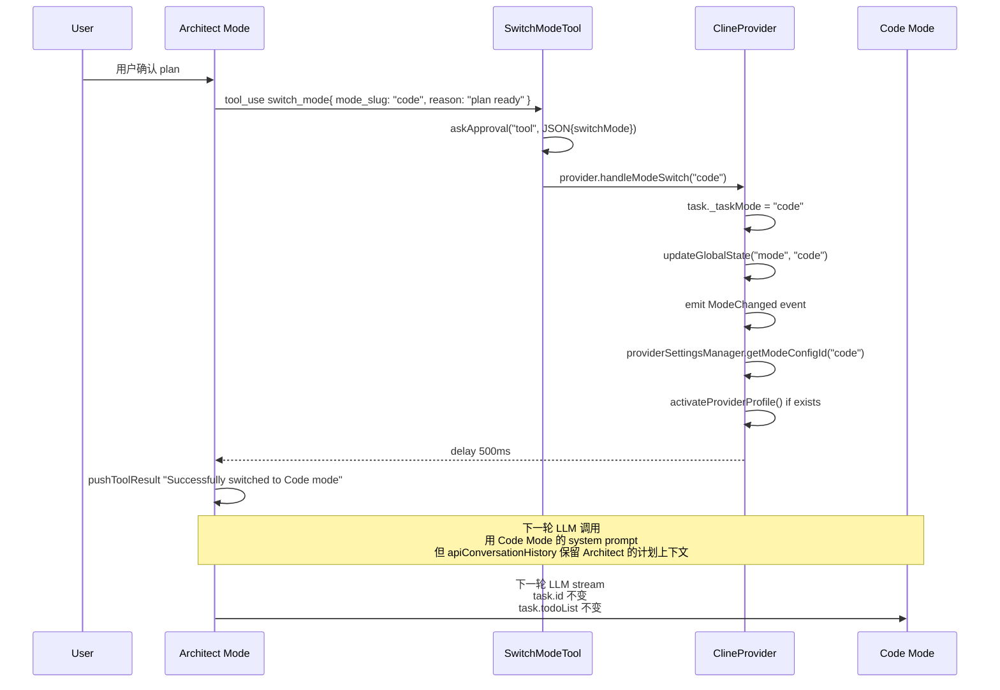
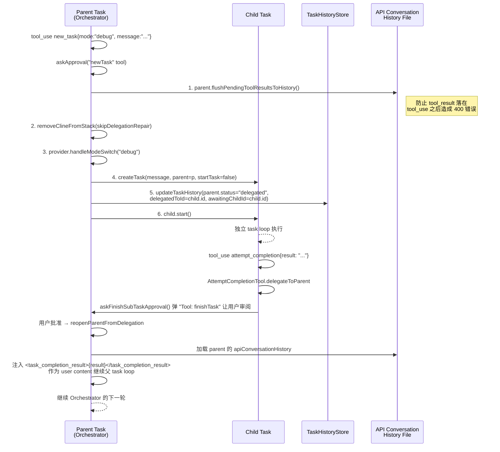
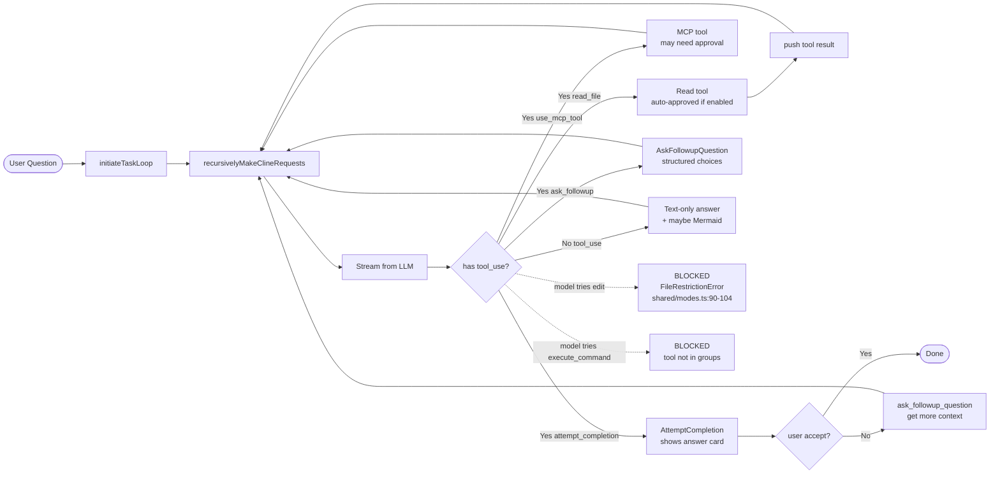

# Roo Code — Agent Loop 调研报告

> **调研对象**:`Roo-Code` (RooCodeInc/Roo-Code),v3.53.0(本地 clone 快照,2026-07-17)
> **调研时间**:2026-07-18
> **调研焦点**:Agent Loop 架构(5 个内置 Mode + Custom Mode、Plan / Sub Agent / Ask / 退出 / HITL / 权限 / 上下文压缩 / 5 层并行)

---

## 0. 智能体一句话定位

**Cline 的"多角色开发团队" fork**:**5 个内置 Mode**(Code / Architect / Ask / Debug / Orchestrator)+ 用户自定义 Custom Mode;每个 Mode 拥有**独立的 tool group 集合**(read / edit / command / mcp / modes)与**独立 system prompt**;Mode 之间通过 `switch_mode` / `new_task` 工具**自动切换**;依托 **5 层并行配置架构**(VS Code 全局存储 + `~/.roo/` + `<cwd>/.roo/` + `.roomodes` 项目声明 + 平台 MCP)实现"声明式 + 文件式 + IDE 状态"三重混合配置。

- **仓库结构**:`pnpm` monorepo(`apps/`、`packages/`、`src/`),源码同时存在 `src/`(主 bundle,VS Code 扩展)和 `packages/{core,types,ipc}/`(子包,ESM)
- **核心运行时入口**:`src/extension.ts:90` → `activate(context)` → `ClineProvider.createTask()`(`ClineProvider.ts:2536`) → `new Task()` → `Task.start()`(`Task.ts:1879`) → `initiateTaskLoop()`(`Task.ts:2427`) → `recursivelyMakeClineRequests()`(`Task.ts:2461`)
- **版本状态**:⚠️ **Roo Code 母公司已关停 VS Code 扩展**;社区 fork [`ZooCode`](https://github.com/zoo-code/zoo-code) 仍在维护

---

## 1. 调研依据

| 来源 | 用途 |
|---|---|
| `packages/types/src/mode.ts` | `DEFAULT_MODES` 5 个内置 Mode (168-227) + `modeConfigSchema` Zod 校验 (96) |
| `src/shared/modes.ts` | `modes`、`getModeBySlug`、`getAllModes`、`getModeSelection` |
| `src/core/task/Task.ts` | 4736 行主类:`initiateTaskLoop` (2427) / `recursivelyMakeClineRequests` (2461) / `start` (1879) / `abortTask` (2212) / `ask` (1219) |
| `src/core/assistant-message/presentAssistantMessage.ts` | 957 行:每个 tool_use block 的分发调度,`askApproval` 包装 |
| `src/core/assistant-message/NativeToolCallParser.ts` | 流式 tool call 解析(start/delta/end 事件) |
| `src/core/prompts/system.ts` | `SYSTEM_PROMPT` 按 Mode 生成角色定义 + sections 拼接 |
| `src/core/tools/AttemptCompletionTool.ts` | `attempt_completion` + 子任务 `delegateToParent` 流程 |
| `src/core/tools/NewTaskTool.ts` | `new_task` Orchestrator 委派子任务 |
| `src/core/tools/SwitchModeTool.ts` | `switch_mode` Mode 间切换 |
| `src/core/tools/AskFollowupQuestionTool.ts` | `ask_followup_question` 结构化提问 |
| `src/core/tools/UpdateTodoListTool.ts` | `update_todo_list` Plan 状态推进 |
| `src/core/auto-approval/index.ts` | `checkAutoApproval` 7 类操作决策 |
| `src/core/auto-approval/commands.ts` | `findLongestPrefixMatch` 命令白/黑名单 |
| `src/core/auto-approval/tools.ts` | `isReadOnlyToolAction` / `isWriteToolAction` 判定 |
| `src/core/protect/RooProtectedController.ts` | 写保护清单(`PROTECTED_PATTERNS`) |
| `src/core/context-management/index.ts` | `manageContext` 上下文管理入口 |
| `src/core/condense/index.ts` | `summarizeConversation` LLM 摘要 + tree-sitter 折叠 |
| `src/core/condense/foldedFileContext.ts` | 已读文件结构化折叠(基于 tree-sitter) |
| `src/core/checkpoints/index.ts` | `checkpointSave` / `checkpointRestore`(shadow git) |
| `src/core/config/CustomModesManager.ts` | `.roomodes` 监听 + 合并 + Zod 校验 |
| `src/core/webview/ClineProvider.ts` | `createTask` / `delegateParentAndOpenChild` / `reopenParentFromDelegation` / `handleModeSwitch` |
| `src/services/skills/SkillsManager.ts` | Skills 8 路径发现 + Mode 过滤 |
| `src/core/tools/SkillTool.ts` | `skill` 工具调用(在 `execute_command` 等不自动批准时仍需确认) |
| `src/shared/tools.ts` | `TOOL_GROUPS` + `ALWAYS_AVAILABLE_TOOLS` |
| 实际 repo `.roo/` / `.roomodes` | 验证项目级配置实际形态 |

---

## 2. 九大问题回答

### Q1. Agent Loop 主流程 — **5 个内置 Mode,工具组 + 角色定义 + system prompt 三层差异化**

Roo Code 跑一个**单实例 + 多 Mode**的 Agent Loop,所有 Mode 共享同一份 `Task.ts:initiateTaskLoop` → `recursivelyMakeClineRequests` 主循环;**不同 Mode 的差异体现在三个层面**:

1. **Tool Groups 差异**(写在 `modeConfigSchema.groups` 字段,Zod 数组)
2. **Role Definition 差异**(`roleDefinition` 字符串,直接拼到 system prompt 顶部)
3. **Custom Instructions 差异**(`customInstructions`,拼接在 system prompt 尾部)

#### 5 个内置 Mode 速览

| Mode | Tool Groups | 角色定位 | 典型工作流 |
|---|---|---|---|
| **🏗️ Architect** | `read` + `edit:*.md` + `mcp` | 技术 leader / 规划者 | 信息收集 → 提问澄清 → `update_todo_list` 计划 → `switch_mode` 移交 |
| **💻 Code** | `read` + `edit` + `command` + `mcp` | 高级软件工程师 | 实施、修改、重构代码 |
| **❓ Ask** | `read` + `mcp`(无 `edit` 无 `command`) | 知识技术助理 | 回答问题、不主动改代码 |
| **🪲 Debug** | `read` + `edit` + `command` + `mcp` | 系统调试专家 | 5-7 个假设 → 收敛 1-2 → 加日志 → **显式确认** → 修 |
| **🪃 Orchestrator** | `[]`(空) | 战略工作流编排者 | `new_task` 委派子任务,自调度 |

> 关键发现:**Orchestrator Mode 自身 `groups: []`**(`packages/types/src/mode.ts:222`),只能通过 `new_task` 工具(在 `modes` 组中,always available)委派子任务,自己**不直接执行**任何 read / edit / command。

源代码定位:

- `packages/types/src/mode.ts:168-227` — `DEFAULT_MODES` 5 个内置 Mode 完整定义
- `src/shared/tools.ts:296-316` — `TOOL_GROUPS`(5 个组,每组具体工具列表)
- `src/shared/tools.ts:319-327` — `ALWAYS_AVAILABLE_TOOLS`(所有 Mode 都可用的 7 个工具)

#### 5 个 Mode 之间的 Loop 差异 — Mermaid 流程图

```mermaid
flowchart TB
    Start([User Input]) --> Init[initiateTaskLoop<br/>Task.ts:2427]

    Init --> Recurse[recursivelyMakeClineRequests<br/>Task.ts:2461]
    Recurse -->|checkMistake| Mistake{consecutiveMistakeCount<br/>>= limit?}
    Mistake -->|Yes| AskMistake[ask mistake_limit_reached]
    AskMistake -->|user respond| Recurse
    Mistake -->|No| BuildReq[Build API request<br/>+ system prompt]

    BuildReq --> Stream[Stream from LLM]
    Stream --> ParseTool{has<br/>tool_use?}

    %% --- A. 无 tool_use ---
    ParseTool -->|No tool_use<br/>text only| NoTool[increment<br/>consecutiveNoToolUseCount<br/>Task.ts:3487]
    NoTool --> NoToolAsk{count >= 2?}
    NoToolAsk -->|Yes| AskNoTool[say error MODEL_NO_TOOLS_USED<br/>+ noToolsUsed reply]
    NoToolAsk -->|No| PushStack[push stack<br/>formatResponse.noToolsUsed]
    NoToolAsk -->|No| AskQuestion[ask followup question<br/>Task.ts:AskFollowupQuestionTool]
    PushStack --> Recurse
    AskQuestion -->|user text| Recurse

    %% --- B. 有 tool_use ---
    ParseTool -->|Yes| Present[presentAssistantMessage<br/>route by tool name]

    Present --> Switch1{tool name?}

    %% attempt_completion
    Switch1 -->|attempt_completion| AC[AttemptCompletionTool.execute]
    AC --> SubTaskCheck{task.parentTaskId?}
    SubTaskCheck -->|Yes| Delegate[delegateToParent<br/>askFinishSubTaskApproval<br/>+ reopenParentFromDelegation]
    SubTaskCheck -->|No| AskUserAC[ask completion_result]
    AskUserAC -->|yesButton| EmitDone[emit TaskCompleted]
    AskUserAC -->|feedback| PushStack
    Delegate -->|approved| Recurse
    EmitDone --> End([Loop ends])
    PushStack --> Recurse

    %% switch_mode
    Switch1 -->|switch_mode| SM[SwitchModeTool.execute]
    SM --> CheckSame{already in<br/>target mode?}
    CheckSame -->|Yes| PushStack
    CheckSame -->|No| AskSM[ask switchMode tool approval]
    AskSM -->|approved| HMS[provider.handleModeSwitch<br/>ClineProvider.ts:1255]
    HMS -->|reload system prompt<br/>+ api config| PushStack
    AskSM -->|denied| PushStack
    PushStack --> Recurse

    %% new_task (Orchestrator sub-task)
    Switch1 -->|new_task| NT[NewTaskTool.execute]
    NT --> AskNT[ask newTask tool approval<br/>ClineProvider.ts:2783]
    AskNT -->|approved| DelegateParent[delegateParentAndOpenChild]
    DelegateParent -->|1. flushPendingToolResults<br/>2. removeClineFromStack<br/>3. handleModeSwitch<br/>4. createTask startTask:false<br/>5. updateTaskHistory delegated<br/>6. child.start| ChildStart[Child Task active<br/>parent paused]
    ChildStart --> Recurse
    AskNT -->|denied| PushStack
    PushStack --> Recurse

    %% read tools (auto-approved if enabled)
    Switch1 -->|read_file<br/>list_files<br/>search_files<br/>codebase_search| Read[execute +<br/>pushToolResult]
    Read --> Recurse

    %% edit tools
    Switch1 -->|apply_diff<br/>write_to_file<br/>edit_file<br/>search_replace| Edit[Check isWriteProtected<br/>RooProtectedController]
    Edit -->|protected| AskEdit[ask tool approval<br/>always required]
    Edit -->|not protected| CheckAuto{autoApproval<br/>+ alwaysAllowWrite?}
    CheckAuto -->|Yes| Edit2[execute + pushToolResult]
    CheckAuto -->|No| AskEdit
    AskEdit -->|approved| Edit2
    AskEdit -->|denied| PushStack
    Edit2 --> Recurse

    %% command tools
    Switch1 -->|execute_command| Cmd[getCommandDecision<br/>allowedCommands / deniedCommands]
    Cmd -->|auto_approve| Exec[execute]
    Cmd -->|auto_deny| PushStack
    Cmd -->|ask| AskCmd[ask command approval]
    AskCmd -->|approved| Exec
    AskCmd -->|denied| PushStack
    Exec --> Recurse

    %% MCP tools
    Switch1 -->|use_mcp_tool| MCP[Check isMcpToolAlwaysAllowed]
    MCP -->|allowed + alwaysAllowMcp| ExecMCP[execute MCP tool]
    MCP -->|not allowed| AskMCP[ask use_mcp_server]
    AskMCP -->|approved| ExecMCP
    ExecMCP --> Recurse

    %% update_todo_list (Plan)
    Switch1 -->|update_todo_list| Todo[UpdateTodoListTool.execute]
    Todo -->|always approve| SetTodo[setTodoListForTask<br/>task.todoList]
    SetTodo --> Recurse

    %% followup question
    Switch1 -->|ask_followup_question| AFQ[AskFollowupQuestionTool.execute]
    AFQ -->|always asks user| GetAnswer[await user response]
    GetAnswer -->|text| PushStack
    PushStack --> Recurse

    %% skill (Claude Skills 风格)
    Switch1 -->|skill| SkT[SkillTool.execute<br/>resolveSkillContentForMode]
    SkT -->|always approve| PushSk[pushToolResult skill content]
    PushSk --> Recurse

    %% style
    classDef modeBox fill:#e1f5ff,stroke:#0277bd
    classDef autoBox fill:#c8e6c9,stroke:#2e7d32
    classDef askBox fill:#fff9c4,stroke:#f9a825
    classDef endBox fill:#ffcdd2,stroke:#c62828
    class Init,Recurse,BuildReq,Stream,Present modeBox
    class Read,Edit2,Exec,ExecMCP,SetTodo,PushSk autoBox
    class AskUserAC,AskNoTool,AskQuestion,AskEdit,AskCmd,AskMCP,AskMistake,AskSM,AskNT askBox
    class End,EmitDone endBox
```



> **图例**:🔵 Mode-shared loop / 🟢 Auto-approved 路径 / 🟡 用户确认路径 / 🔴 终止

#### Mode 之间的"自动切换"——`switch_mode` 与 `new_task`

Roo Code 的多 Mode 协作**不是**通过并行的 sub-agent,而是**串行 + 任务栈**:

- **`switch_mode`(同任务内切换 Mode)**:`switchModeTool.execute`(`src/core/tools/SwitchModeTool.ts:14-67`)→ 走 `askApproval` → 调 `provider.handleModeSwitch()`(`ClineProvider.ts:1255-1340`)→ 更新 task mode + 加载 mode-specific API config → `delay(500)` → 继续同 task loop
  - **关键约束**:`switch_mode` 只能切"同 cwd、同 task"的 Mode
  - **plan 传递**:虽然 Architect Mode 把 todo 写进 `task.todoList`,**但 taskId / apiConversationHistory 不变**——后续 Mode 看到的是**完整 API 历史 + 同样的 todoList 状态**
- **`new_task`(Orchestrator 委派子任务)**:`newTaskTool.execute`(`src/core/tools/NewTaskTool.ts:14-100`)→ `askApproval` → 调 `provider.delegateParentAndOpenChild()`(`ClineProvider.ts:2783-2913`)→ **单任务栈不变量**(关掉 parent、开 child、child.mode = 切到新 mode)→ child 完成时 `reopenParentFromDelegation()`(`ClineProvider.ts:2918-3090`)恢复 parent + 注入 `attempt_completion` 结果到 parent 的 user content
  - **关键约束**:`new_task` 只能从 `modes` 组(`alwaysAvailable: true`)调用,任何 Mode 都能委派子任务,不仅是 Orchestrator
  - **强制最后**:`presentAssistantMessage.ts:3408-3432` 显式禁止 `new_task` 同一轮与其他 tool 并发,必须是该 message 的最后一个 tool_use

#### Custom Mode 用户创建

两种途径,合并策略:**`.roomodes` (项目) > settings.json (全局) > DEFAULT_MODES(内置)**

`src/core/config/CustomModesManager.ts:316-355`:

```typescript
// 监听 .roomodes 文件变化
const roomodesWatcher = vscode.workspace.createFileSystemWatcher(roomodesPath)
roomodesWatcher.onDidChange(handleRoomodesChange)  // .roomodes 修改触发刷新
roomodesWatcher.onDidCreate(handleRoomodesChange)
roomodesWatcher.onDidDelete(async () => {
    // 删除时退回只用 settings.json
})
```

- **`.roomodes`** 是项目级 YAML/JSON,提交到 git 与团队共享,见仓库根目录 `.roomodes` 包含 7 个示例(`translate` / `issue-fixer` / `pr-fixer` / `merge-resolver` / `docs-extractor` / `issue-investigator` / `issue-writer`)
- **settings.json** 是 VS Code 全局状态,个人私有
- **Schema 校验**:`customModesSettingsSchema`(`packages/types/src/mode.ts:91-106`)Zod 严格校验,`groupEntryArraySchema` 还**自动剥除已弃用工具组**(`browser`)
- **运行时合并**:`src/shared/modes.ts:62-79` `getAllModes()`:custom mode 与内置 slug 相同则**覆盖**,否则追加

#### 5 层并行架构

Roo Code 真正的创新是**让"声明式配置 + 文件系统配置 + IDE 状态"三层共存**:

| 层 | 存储位置 | 内容 | 优先级 |
|---|---|---|---|
| **L1. VS Code 扩展全局** | `context.globalStorageUri.fsPath`<br/>(如 `%APPDATA%\Code\User\globalStorage\roo-cline.rooveterinaryinc`) | `state` 字典、任务历史、checkpoints shadow git、code index cache、customModes in `globalState` | 由 VS Code 决定 |
| **L2. 全局用户级 `.roo/`** | `~/.roo/`(`%USERPROFILE%\.roo\`) | `skills/`(全局 Skills)、`rules/`(全局规则) | 写死 `os.homedir()` |
| **L3. 项目级 `.roo/`** | `{cwd}/.roo/` | `skills/`(项目 Skills)、`rules/{mode}.md`(Mode 化规则)、`commands/`(斜杠命令) | 跟随 workspace |
| **L4. 项目级声明式** | `<cwd>/.roomodes`(YAML/JSON) | `customModes` 数组 | 提交到 git |
| **L5. 平台特定** | Windows:`%APPDATA%\Roo-Code\MCP` / macOS:`~/Documents/Cline/MCP` / Linux:`~/.local/share/Roo-Code/MCP` | MCP servers 安装 | 三平台分支 |

**Skills 8 路径覆盖矩阵**(`src/services/skills/SkillsManager.ts:585-595`):

```typescript
// Source level: project > global (handled by shouldOverrideSkill in getSkillsForMode)
// Priority order:
// - Global:  ~/.agents/skills  >  ~/.roo/skills           (.roo wins)
// - Project: <cwd>/.agents/skills  >  <cwd>/.roo/skills   (.roo wins)
// - Both also accept .claude/skills and AGENTS.md-style dirs
```

> 这套"8 路径 × 2 源 × 5 Mode 过滤"是 Roo Code **最复杂的覆盖矩阵**,完美对应 Claude Skills 标准 + Roo 自己的扩展点。

---

### Q2. Plan 计划机制 — Architect Mode 的"三步" + `switch_mode` 同任务传递

#### Architect Mode 的 plan 工作流

`packages/types/src/mode.ts:178-180` 的 `customInstructions` 给出**显式剧本**:

```text
1. Do some information gathering (using provided tools) to get more context about the task.
2. You should also ask the user clarifying questions to get a better understanding of the task.
3. Once you've gained more context about the user's request, break down the task into clear,
   actionable steps and create a todo list using the `update_todo_list` tool. Each todo item
   should be: Specific / Logical order / Single outcome / Clear enough that another mode
   could execute it independently
4. As you gather more information or discover new requirements, update the todo list.
5. Ask the user if they are pleased with this plan, or if they would like to make any changes.
6. Include Mermaid diagrams if they help clarify complex workflows or system architecture.
7. Use the switch_mode tool to request that the user switch to another mode to implement.
```

**Plan 物理存储**:`task.todoList` 字段(`Task.ts` 的 `private todoList?: TodoItem[]`)+ 每次 `update_todo_list` 工具调用通过 `setTodoListForTask` 写入,UI 即时渲染。

**Plan 退出条件**:用户在 `ask followup question` 回答"可以执行" → `switch_mode` 切到 Code / Debug → 同一个 task id、同一份 `apiConversationHistory` 继续推进。

#### Architect → Code Mode 切换时 plan 怎么传递

**关键洞察**:`switch_mode` 切换 Mode 时,plan **不"显式传递"**——它本来就在 task 自身的 state 中:

| 状态 | 是否在 `switch_mode` 后保留 | 代码位置 |
|---|---|---|
| `task.todoList` | ✅ 保留(同一 task 实例) | `Task.ts` 字段 |
| `apiConversationHistory` | ✅ 保留(同一 task 实例) | `Task.ts` 字段 |
| `clineMessages`(UI 消息) | ✅ 保留 | `Task.ts` 字段 |
| `task._taskMode` | ❌ 被 `handleModeSwitch` 更新 | `ClineProvider.ts:1266` |
| **system prompt** | ❌ 重新生成(`SYSTEM_PROMPT` 重读 mode role + custom instructions) | `ClineProvider.ts:1318`(`updateGlobalState("mode", newMode)` 触发 webview 拉新 prompt) |
| **API config(profile)** | ❌ 可能切换(memory by mode,`providerSettingsManager.getModeConfigId(newMode)`) | `ClineProvider.ts:1294-1320` |

**Architect → Code 切换流程**(同 task,无新 task):



> **类比**:这是 **"同一棵进程树换一片叶"**——子节点变化,根节点和主干完全保留。

#### 与 Cline 的关键区别

| 维度 | Cline | Roo Code |
|---|---|---|
| 计划工具 | 无专用工具 | `update_todo_list` + `task.todoList` 状态 |
| 模式切换 | 无(只有单一"agent") | `switch_mode`(同 task) + `new_task`(新 task) |
| API 配置文件 | 单一 | **按 mode 记忆**(`providerSettingsManager.setModeConfig`) |
| 完成态 | 始终不真正"完成" | `attempt_completion` + `TaskCompleted` 事件 |
| 工具组 | 全部可用 | **按 mode 限制**(Architect 不能 `execute_command`!) |

---

### Q3. Sub Agent — **Orchestrator 是真 Sub Agent,Custom Mode 也能委派**

#### 答:Roo Code **有** Orchestrator Mode,而且 Custom Mode 也能创建 sub-agent

**两种 Sub Agent 机制并存**:

1. **Orchestrator Mode**(内置,slug = `orchestrator`)— 战略编排
2. **任何 Mode 通过 `new_task` 工具** — Custom Mode 也可调用

#### Orchestrator Mode 设计

`packages/types/src/mode.ts:215-225` 的 `roleDefinition` 给出**显式剧本**:

```text
Your role is to coordinate complex workflows by delegating tasks to specialized modes.
1. When given a complex task, break it down into logical subtasks that can be delegated.
2. For each subtask, use the `new_task` tool to delegate. Choose the most appropriate mode
   for the subtask's specific goal and provide comprehensive instructions in the `message`
   parameter.
3. Track and manage the progress of all subtasks. When a subtask is completed, analyze
   its results and determine the next steps.
4. Help the user understand how the different subtasks fit together in the overall workflow.
5. When all subtasks are completed, synthesize the results and provide a comprehensive overview.
6. Ask clarifying questions when necessary.
7. Suggest improvements to the workflow.
```

**关键设计**:

- **Orchestrator 自身 `groups: []`** — 不能 read / edit / command,**只能**通过 `modes` 组(always available)调 `new_task`
- **子任务 `newTaskTool.execute`(`src/core/tools/NewTaskTool.ts:14-100`)** 需要 `mode` + `message` + 可选 `todos` 三个参数
- **强制**:`requireTodos`(VS Code setting)可设为 `true` 强制子任务带 markdown checklist
- **单任务栈不变量**:`delegateParentAndOpenChild`(`ClineProvider.ts:2783-2913`)→ **关 parent + 开 child**,同一时间**只有 1 个 active task**;child 完成时 `reopenParentFromDelegation`(`ClineProvider.ts:2918-3090`)恢复 parent

#### Sub-task → Parent 数据回流的精确时序



> **关键发现**:`startTask: false` + `updateTaskHistory(delegated)` 顺序**严格保证 parent metadata 不被 child 的 startTask fire-and-forget 覆盖**(`ClineProvider.ts:2870-2896` 注释解释)。

#### Custom Mode 能否创建 sub-agent?

**能。** `new_task` 工具属于 `modes` 组且 `alwaysAvailable: true`(`src/shared/tools.ts:309-314`),任何 Mode(包括 Custom Mode)都能调它。Custom Mode 创建 sub-agent 的**最小配置**:

```yaml
# .roomodes
customModes:
  - slug: test-engineer
    name: 🧪 Test Engineer
    roleDefinition: You are a test engineer...
    groups:
      - read
      - edit
      - command
    # 关键:即使 groups 不含 modes,new_task 也可用
```

> **亮点**:`test-engineer` 模式可被 Code Mode(在 plan 完成后)或 Orchestrator 委派,但 Code Mode 不会**自己**在 plan 完成后自动切换到 test-engineer——这种"Code → Test Engineer"自动切换**不是内置的**,需要用户显式 `switch_mode` 或 Orchestrator 委派。

#### Custom Mode 创建 sub-agent 的能力边界

| 维度 | Custom Mode |
|---|---|
| 调用 `new_task` 委派子任务 | ✅(因为 `modes` 组 always available) |
| 委派给**其他** Custom Mode | ✅(只要 `getModeBySlug` 找到) |
| Orchestrator 委派**给** Custom Mode | ✅(`newTaskTool` 不限制 mode 类型) |
| Custom Mode 自动覆盖内置 Mode(同 slug) | ✅(`getAllModes` 数组覆盖) |
| Custom Mode 拥有"独立 API 配置文件" | ✅(同一套 `providerSettingsManager` 机制) |
| Custom Mode 拥有"独立 .roo/rules/" | ✅(`getRulesSection` 按 mode 读) |
| Custom Mode 拥有"独立 Skills" | ✅(`SkillsManager.getSkillsForMode(slug)`) |

---

### Q4. Loop 退出机制 — **6 条退出路径**

Roo Code 的 `initiateTaskLoop` 是**单 while 循环**(`Task.ts:2427-2455`),退出条件是 `recursivelyMakeClineRequests` 返回 `didEndLoop = true`,但底层有 **6 条具体退出路径**:

```typescript
// src/core/task/Task.ts:2427-2455
private async initiateTaskLoop(userContent): Promise<void> {
    let nextUserContent = userContent
    let includeFileDetails = true
    this.emit(RooCodeEventName.TaskStarted)

    while (!this.abort) {
        const didEndLoop = await this.recursivelyMakeClineRequests(nextUserContent, includeFileDetails)
        includeFileDetails = false

        if (didEndLoop) {
            // For now a task never 'completes'. This will only happen if
            // the user hits max requests and denies resetting the count.
            break   // ← 路径 1: didEndLoop = true
        } else {
            nextUserContent = [{ type: "text", text: formatResponse.noToolsUsed() }]
            // 提示模型"你没调工具,要么 attempt_completion 要么说明"
        }
    }
}
```

#### 6 条退出路径详解

| # | 触发条件 | 代码位置 | 用户体验 |
|---|---|---|---|
| **1. 正常完成** | `attempt_completion` 成功 + 用户点 "yesButton" | `AttemptCompletionTool.ts:130-140` | 弹 "Result" 卡片,用户点 "Looks good" |
| **2. 用户取消** | 用户点"Cancel Task" | `abortTask`(`Task.ts:2212-2252`) | 立刻终止,保存 partial 状态 |
| **3. 误用工具上限** | `consecutiveMistakeCount >= consecutiveMistakeLimit` | `Task.ts:2483-2501` | 弹 `mistake_limit_reached` 问用户怎么办 |
| **4. 连续无工具 2 次** | `consecutiveNoToolUseCount >= 2` | `Task.ts:3485-3495` | 报 `MODEL_NO_TOOLS_USED`,推送 `formatResponse.noToolsUsed()` 提示 |
| **5. abort flag** | `while (!this.abort)` | `Task.ts:2428` | abort 来自用户取消/扩展关闭/stream 失败 |
| **6. Stream 失败** | LLM 流中断且无 auto-approval | `Task.ts:3170-3212` | exponential backoff + retry 同一 stack item |

#### 各 Mode 的特殊退出条件

| Mode | 退出路径 | 特殊逻辑 |
|---|---|---|
| **Architect** | 路径 1(完成)+ `switch_mode` 移交 | `attempt_completion` 极少调用;更多是 `switch_mode` 切到 Code |
| **Code** | 路径 1(完成)+ 路径 2(用户中断) | 标准 task loop,正常完成 |
| **Ask** | 路径 1(回答完用户问题) | **不主动调工具**,通常 text-only,`ask_followup_question` 等待用户追问 |
| **Debug** | 路径 1(完成修复) | 5-7 假设 → 收敛 → 加日志 → **显式 ask 用户确认诊断** |
| **Orchestrator** | 路径 1 + 路径 2 | 通过 `new_task` 委派 N 个子任务 → 全部 `attempt_completion` → 父 `attempt_completion` 综合 |
| **Sub-task(被 Orchestrator 委派)** | `delegateToParent` 路径 | `askFinishSubTaskApproval()` → `reopenParentFromDelegation` → 父 task 自动恢复 |

#### "Task Never Completes" 注释的真相

`Task.ts:2442-2444` 注释非常关键:

> ```typescript
> // For now a task never 'completes'. This will only happen if
> // the user hits max requests and denies resetting the count.
> ```

虽然 `attempt_completion` 是显式的"任务完成"标志,但 **Roo Code 的 `clineStack` 仍保留该 task 实例**——只是 status 变 `completed`。下次 `createTask` 才走 `removeClineFromStack`。这是 **"显式完成语义 + 隐式 task 栈存活"**的混合设计。

---

### Q5. Ask 模式 — **"只读 + 不主动改代码" 的独立循环**

#### Ask Mode 的设计定位

`packages/types/src/mode.ts:192-202`:

```typescript
{
    slug: "ask",
    name: "❓ Ask",
    roleDefinition: "You are Roo, a knowledgeable technical assistant focused on answering
        questions and providing information about software development, technology, and
        related topics.",
    whenToUse: "Use this mode when you need explanations, documentation, or answers to
        technical questions.",
    description: "Get answers and explanations",
    groups: ["read", "mcp"],   // ← 关键: 没有 edit, 没有 command
    customInstructions: "You can analyze code, explain concepts, and access external resources.
        Always answer the user's questions thoroughly, and do not switch to implementing code
        unless explicitly requested by the user. Include Mermaid diagrams when they clarify
        your response.",
},
```

#### Ask Mode 的 Loop 特点



#### Ask Mode 的 4 个硬约束

1. **不能 edit**:`groups: ["read", "mcp"]` 不含 `edit`,尝试调用 `apply_diff` / `write_to_file` 等会在 `getToolsForMode` 阶段就被过滤掉(`src/shared/modes.ts:21-32`)
2. **不能 `execute_command`**:同样 `command` 组不在 groups 中
3. **不能 `switch_mode` 主动改代码**:`customInstructions` 明确说"do not switch to implementing code unless explicitly requested by the user"
4. **回答必须 thorough**:`customInstructions` 强调"Always answer the user's questions thoroughly"

#### Ask Mode 的典型工作流

| 阶段 | 工具 |
|---|---|
| 1. 理解问题 | `read_file` 读相关代码 + `codebase_search` 搜索 |
| 2. 主动澄清(可选) | `ask_followup_question` 给出结构化选项 |
| 3. 检索外部信息(可选) | `use_mcp_tool`(如果用户配了 Context7 / Brave Search 等) |
| 4. 输出答案 | text block + 可选 Mermaid diagram(`getSkillsSection` 提示) |
| 5. 终止 | `attempt_completion` 等用户确认 |

#### Ask Mode 与其他 Mode 的关键区别

| 维度 | Ask | Code | Architect | Debug |
|---|---|---|---|---|
| `edit` 组 | ❌ | ✅ | ❌(`edit:*.md` 只 markdown) | ✅ |
| `command` 组 | ❌ | ✅ | ❌ | ✅ |
| `mcp` 组 | ✅ | ✅ | ✅ | ✅ |
| 完成态 | text 回答 + `attempt_completion` | 标准 task loop | 移交 Code Mode | 修复 + `attempt_completion` |
| 自动批准 | 仅只读 | 全开 | 仅只读 + mcp | 全开 |

#### "Ask" 在 Cline 中的对应

**Cline 没有 Ask Mode**——这是 **Roo Code 超越 Cline 的关键扩展点**。当用户只想问"这段代码什么意思"时,Cline 也会尝试 read + 改 + 验证,Roo Code 的 Ask Mode 把"知识查询"独立成 Mode,确保**只读 + 不主动改**。

---

### Q6. Human-in-the-Loop (HITL) — **8 类 ask 触发 + AutoApproval 决策**

#### 用户如何确认 — 8 类 `ClineAsk` 触发器

`Task.ts:1219-1500` 的 `ask()` 是所有 HITL 入口,接受 `ClineAsk` 枚举值。常见触发:

| ask 类型 | 触发工具 / 场景 | UI 展示 | 用户选项 |
|---|---|---|---|
| `tool` | 所有 tool_use(edit / command / new_task / switch_mode / etc.) | 工具卡片 + 详情 | "Approve" / "Reject" / "Approve + 备注" |
| `command` | `execute_command` 工具 | 命令文本 + 风险评估 | "Run" / "Reject" |
| `followup` | `ask_followup_question` 工具 | 问题 + 建议选项 | 点选建议 / 自由输入 |
| `completion_result` | `attempt_completion` 工具 | 结果卡片 | "Looks good" / "Reject" + 反馈 |
| `resume_task` | 从历史恢复 task | 上一轮摘要 | "Resume" / "Start New" |
| `resume_completed_task` | 从已完成 task 恢复 | 已完成结果 | "Start New" / 重新打开 |
| `mistake_limit_reached` | `consecutiveMistakeCount` 超限 | 错误说明 | "Reset & continue" / "New task" |
| `api_req_failed` | API 失败(rate limit / auth) | 错误信息 | "Retry" / "Cancel" |

#### ask 流程的核心实现 — `askApproval` 包装

`src/core/assistant-message/presentAssistantMessage.ts:471-499`:

```typescript
const askApproval = async (
    type: ClineAsk,
    partialMessage?: string,
    progressStatus?: ToolProgressStatus,
    isProtected?: boolean,
) => {
    const { response, text, images } = await cline.ask(type, partialMessage, false, progressStatus, isProtected || false)

    if (response !== "yesButtonClicked") {
        // Handle both messageResponse and noButtonClicked with text.
        if (text) {
            await cline.say("user_feedback", text, images)
            pushToolResult(formatResponse.toolResult(formatResponse.toolDeniedWithFeedback(text), images))
        } else {
            pushToolResult(formatResponse.toolDenied())
        }
        cline.didRejectTool = true
        return false
    }

    // Store approval feedback to be merged into tool result (GitHub #10465)
    if (text) {
        await cline.say("user_feedback", text, images)
        approvalFeedback = { text, images }
    }
    return true
}
```

**关键设计**:
- `response === "yesButtonClicked"` 表示用户点 "Approve"
- 用户可在弹窗输入反馈文本 → 通过 `formatResponse.toolResult` 注入到 LLM 的 tool_result,**让 LLM 看到反馈继续工作**
- `cline.didRejectTool = true` 触发 stream 早停,后续 tool_use 被跳过

#### Webview 端的 AskResponse 流

`src/shared/WebviewMessage.ts` 定义的 `ClineAskResponse` 枚举:

| 值 | 含义 |
|---|---|
| `yesButtonClicked` | 用户点 Approve |
| `noButtonClicked` | 用户点 Reject |
| `messageResponse` | 用户输入文本回复(`ask_followup_question` / `mistake_limit_reached` 等) |

Webview → Extension 通过 `postMessage` 把 `askResponse` 传到 `Task.askResponse` 字段,`pWaitFor` 在 `ask()` 内部阻塞等用户响应。

#### "用户可调超时" 的 followup auto-approve

`src/core/auto-approval/index.ts:68-95`:

```typescript
if (ask === "followup") {
    if (state.alwaysAllowFollowupQuestions === true) {
        try {
            const suggestion = (JSON.parse(text || "{}") as FollowUpData).suggest?.[0]
            if (suggestion && typeof state.followupAutoApproveTimeoutMs === "number"
                && state.followupAutoApproveTimeoutMs > 0) {
                return {
                    decision: "timeout",
                    timeout: state.followupAutoApproveTimeoutMs,
                    fn: () => ({ askResponse: "messageResponse", text: suggestion.answer }),
                }
            } else {
                return { decision: "ask" }
            }
        } catch (error) {
            return { decision: "ask" }
        }
    } else {
        return { decision: "ask" }
    }
}
```

> **亮点**:用户可设 `followupAutoApproveTimeoutMs`(毫秒),AskFollowupQuestion 自动选第一个建议 — 这就是 Roo Code 的"**自适应自治**"机制之一,见 Q9。

---

### Q7. 工具调用权限 — **7 类 AutoApproval 状态 + 写保护清单**

#### 3 种权限的精细实现 — `AutoApprovalState`

`src/core/auto-approval/index.ts:15-25` 定义 7 个开关:

```typescript
export type AutoApprovalState =
    | "alwaysAllowReadOnly"          // 只读工具(读文件 / 搜索 / 列表)
    | "alwaysAllowWrite"             // 写工具(edit / write_to_file / generate_image)
    | "alwaysAllowMcp"               // MCP 工具
    | "alwaysAllowModeSwitch"        // switch_mode
    | "alwaysAllowSubtasks"          // new_task / finishTask
    | "alwaysAllowExecute"           // execute_command(配合 allowedCommands/deniedCommands)
    | "alwaysAllowFollowupQuestions" // ask_followup_question(配合 followupAutoApproveTimeoutMs)
```

#### 决策树(简化)

```
checkAutoApproval(state, ask, text, isProtected)
│
├─ isNonBlockingAsk(ask) → approve
│
├─ !state.autoApprovalEnabled → ask
│
├─ ask === "followup" → check alwaysAllowFollowupQuestions + timeout
│
├─ ask === "use_mcp_server" → alwaysAllowMcp + isMcpToolAlwaysAllowed(state.mcpServers)
│
├─ ask === "command" → getCommandDecision(text, allowedCommands, deniedCommands)
│
└─ ask === "tool"
   ├─ tool === "updateTodoList" → approve (always)
   ├─ tool === "skill" → approve (always,since skills are pre-defined)
   ├─ tool === "switchMode" → alwaysAllowModeSwitch
   ├─ tool in ["newTask", "finishTask"] → alwaysAllowSubtasks
   ├─ isReadOnlyToolAction → alwaysAllowReadOnly + alwaysAllowReadOnlyOutsideWorkspace
   └─ isWriteToolAction → alwaysAllowWrite + alwaysAllowWriteOutsideWorkspace + alwaysAllowWriteProtected
```

**核心代码**(`src/core/auto-approval/index.ts:139-170`):

```typescript
const isOutsideWorkspace = !!tool.isOutsideWorkspace

if (isReadOnlyToolAction(tool)) {
    return state.alwaysAllowReadOnly === true &&
        (!isOutsideWorkspace || state.alwaysAllowReadOnlyOutsideWorkspace === true)
        ? { decision: "approve" }
        : { decision: "ask" }
}

if (isWriteToolAction(tool)) {
    return state.alwaysAllowWrite === true &&
        (!isOutsideWorkspace || state.alwaysAllowWriteOutsideWorkspace === true) &&
        (!isProtected || state.alwaysAllowWriteProtected === true)
        ? { decision: "approve" }
        : { decision: "ask" }
}
```

#### 命令白/黑名单 — `findLongestPrefixMatch` 最长前缀匹配

`src/core/auto-approval/commands.ts:67-101`:

```typescript
export function findLongestPrefixMatch(command: string, prefixes: string[]): string | null {
    const trimmedCommand = command.trim().toLowerCase()
    let longestMatch: string | null = null

    for (const prefix of prefixes) {
        const lowerPrefix = prefix.toLowerCase()
        if (lowerPrefix === "*" || trimmedCommand.startsWith(lowerPrefix)) {
            if (!longestMatch || lowerPrefix.length > longestMatch.length) {
                longestMatch = lowerPrefix
            }
        }
    }
    return longestMatch
}
```

**算法**:**白名单 + 黑名单 + 最长前缀优先**
- 用户配 `allowedCommands: ["git", "npm"]`、`deniedCommands: ["npm publish", "rm"]`
- 跑 `npm install` → 白名单匹配 `npm`(长度 3),黑名单无 → **auto_approve**
- 跑 `npm publish` → 白名单匹配 `npm`(3),黑名单匹配 `npm publish`(13) → 黑名单更长 → **auto_deny**
- 跑 `rm -rf /` → 白名单无,黑名单匹配 `rm`(2) → **auto_deny**

**特殊规则**:白名单含 `"*"` 时,任何命令自动批准(但黑名单仍可拦)。

#### 写保护清单 — `RooProtectedController.PROTECTED_PATTERNS`

`src/core/protect/RooProtectedController.ts:18-30`:

```typescript
private static readonly PROTECTED_PATTERNS = [
    ".rooignore",
    ".roomodes",
    ".roorules*",
    ".clinerules*",
    ".roo/**",                // 整个 .roo 目录
    ".vscode/**",              // 整个 .vscode 目录
    "*.code-workspace",        // VS Code multi-root workspace
    ".rooprotected",           // 未来扩展
    "AGENTS.md",               // AGENTS.md 规范文件
    "AGENT.md",
]
```

**机制**:用 `ignore` npm 库 + `ignores(relativePath)` 匹配,**写任何保护文件即使 auto-approval 全开也必须用户确认**(因为 `isProtected` 会让 `alwaysAllowWriteProtected` 决定)。

**UI 反馈**:在 `list_files` 工具中,被保护文件旁加 🛡️ emoji(`SHIELD_SYMBOL = "\u{1F6E1}"`)

**`newTaskTool.execute` 的特殊处理**(允许修改):通过 `new_task` 委派子任务时,子任务的 todo 输出文件可以写到 `.roo/extraction/*.yaml/json/md`(见 `.roomodes` 的 `docs-extractor` mode 配置:`fileRegex: \.roo/extraction/.*\.(yaml|json|md)$`)。

---

### Q8. 上下文压缩和摘要 — **三级策略 + Profile 自定义阈值**

#### 上下文管理的 3 个阈值

`src/core/context-management/index.ts:39-41`:

```typescript
export const TOKEN_BUFFER_PERCENTAGE = 0.1
export const MIN_CONDENSE_THRESHOLD = 5     // 最小触发百分比
export const MAX_CONDENSE_THRESHOLD = 100   // 最大触发百分比
```

#### `manageContext` 决策树

```
1. 估算 lastMessage tokens
2. prevContextTokens = totalTokens + lastMessageTokens
3. allowedTokens = contextWindow * 0.9 - reservedTokens(maxTokens)
4. effectiveThreshold = profileThreshold(currentProfileId) ?? autoCondenseContextPercent
5. if autoCondenseContext && (contextPercent >= effectiveThreshold || prevContextTokens > allowedTokens):
    → summarizeConversation(LLM 摘要 + tree-sitter 文件折叠)
    → 成功 → 返回新 messages
    → 失败 → 走第 6 步
6. if prevContextTokens > allowedTokens:
    → truncateConversation(messages, 0.5, taskId)  // 滑窗截断
    → 标记 50% 历史消息为 truncationParent(hidden)
    → 插入 isTruncationMarker
7. 否则:返回原始 messages
```

#### 三级策略详解

| 级别 | 策略 | 触发条件 | 实现 |
|---|---|---|---|
| **L1. 智能摘要** | LLM 调用 + tree-sitter 折叠 | `autoCondenseContext && contextPercent >= effectiveThreshold` | `condense/index.ts:summarizeConversation` + `foldedFileContext.ts` |
| **L2. 滑窗截断** | 把 50% 历史消息 hidden 掉 | `prevContextTokens > allowedTokens` | `truncateConversation(messages, 0.5, taskId)` |
| **L3. 无操作** | 不动 | 都不满足 | 直接返回原 messages |

#### 智能摘要 — `condense/index.ts:summarizeConversation`

`src/core/condense/index.ts:121-195` 关键转换:

```typescript
// 1. tool_use / tool_result blocks → text blocks
//    (避免摘要时需要重新传 tools 参数,某些 provider 如 Bedrock 不接受)
export function toolUseToText(block): string {
    return `[Tool Use: ${block.name}]\n${Object.entries(block.input).map(...).join("\n")}`
}

// 2. 加载已读文件的 tree-sitter 折叠上下文
//    (key insight:把"完整文件内容"替换为"结构化骨架 + 关键代码段")
const foldedFiles = await generateFoldedFileContext({
    filesReadByRoo,
    cwd,
    rooIgnoreController,
    // tree-sitter 解析每个文件:
    //   - 完整保留 imports/exports/sigs
    //   - 函数体折叠为 { ... }
    //   - 注释/字符串剥离
    //   - 估算压缩后 token 数
})
```

**tree-sitter 折叠**(`src/core/condense/foldedFileContext.ts:6138 字节`)是 Roo Code **独有的特性**——让"已读文件"在摘要中以**代码骨架形式**保留,而不是粗暴删除或全量重发,大幅节省 token 同时保留结构信息。

#### 滑窗截断的非破坏性

`truncateConversation`(`src/core/context-management/index.ts:62-118`)**不真正删除**消息,而是给 `truncationParent` 字段打标 + 插入 `isTruncationMarker`:

```typescript
const taggedMessages = messages.map((msg, index) => {
    if (indicesToTruncate.has(index)) {
        return { ...msg, truncationParent: truncationId }   // ← hidden, but recoverable
    }
    return msg
})
```

**好处**:用户可点击"rewind to checkpoint"回退到截断前,truncation markers 会被清理,hidden 消息恢复。

#### Profile 级别阈值

```typescript
// packages/types/src/mode.ts:171-175 (effectiveThreshold 决策)
let effectiveThreshold = autoCondenseContextPercent
const profileThreshold = profileThresholds[currentProfileId]
if (profileThreshold === -1) {
    effectiveThreshold = autoCondenseContextPercent  // -1 = 用全局
} else if (profileThreshold >= MIN_CONDENSE_THRESHOLD && profileThreshold <= MAX_CONDENSE_THRESHOLD) {
    effectiveThreshold = profileThreshold  // 用 profile 自定义
}
```

> **亮点**:用户可给不同 API profile 设不同阈值(例如 GPT-4 用 80%、Claude 用 95%),自动切换 profile 时阈值也跟着切。

#### Provider Rate Limit 集成

`Task.ts:2524-2525`:

```typescript
// Respect user-configured provider rate limiting BEFORE we emit api_req_started.
await this.maybeWaitForProviderRateLimit(currentItem.retryAttempt ?? 0)
Task.lastGlobalApiRequestTime = performance.now()  // 静态字段,所有 task 共享
```

`lastGlobalApiRequestTime` 是**静态字段**,保证多 task(子任务)同时跑也尊重同一 rate limit 窗口。

---

### Q9. 其他亮点 — **5 层并行 + 8 路径 Skills + 写保护 + Shadow Git + 自适应自治 + 关停警示**

#### ⚠️ 重要警示:Roo Code 扩展已关停(2026-05-15)

> **Roo Code 母公司 Roo Veterinary Inc. 已于 2026-05-15 关停 Roo Code 的 VS Code Marketplace 扩展**。本地代码仍在 `RooCodeInc/Roo-Code` 仓库中(这是本次调研对象),但**不再接受 PR、不再发布新版本**。
>
> **社区 fork**: [`zoo-code/zoo-code`](https://github.com/zoo-code/zoo-code) 持续维护,功能基本同步(基于 Roo Code v3.53)。
>
> **Onion Agent 借鉴建议**:
> - 架构上**完全可以照搬**(Task / Mode / Tool / Checkpoint 都是模块化的)
> - 优先用 **ZooCode** 验证兼容性,因为未来 Roo Code 主线可能彻底冻结
> - 不要依赖 Roo Code 的 Marketplace / 远程 API(已关)

#### 5 层并行复合架构(再强调)

Roo Code 的核心创新是**5 层并行存储**让"配置/规则/Skills/MCP/历史"在不同层独立演化:

| 层 | 路径 | 用途 | 优先级 |
|---|---|---|---|
| **L1** | `context.globalStorageUri` | VS Code 全局状态、任务历史、shadow git、code index | VS Code 控制 |
| **L2** | `~/.roo/` | 全局 rules / 全局 skills / 全局 commands | 写死 home |
| **L3** | `<cwd>/.roo/` | 项目 rules / 项目 skills / 项目 commands | 跟随 workspace |
| **L4** | `<cwd>/.roomodes` | 项目 Custom Modes 声明 | 提交到 git |
| **L5** | 平台特定 MCP 目录 | MCP servers 安装 | 平台分支 |

> **Onion Agent 借鉴**:把"用户级 / 项目级 / 系统级"三层文件配置做扎实,VS Code 端只存任务历史(轻量)。

#### 8 路径 Skills 覆盖矩阵

`src/services/skills/SkillsManager.ts:585-595` 的优先级决策:

```typescript
// Priority order:
// - Global:  ~/.agents/skills  >  ~/.roo/skills           (.roo wins)
// - Project: <cwd>/.agents/skills  >  <cwd>/.roo/skills   (.roo wins)
// - (镜像 Claude Code Skills 标准 + Roo 扩展)
//
// 加上每个 skill 自己的 mode filter
//  → 每个 mode 可拥有独立 skill 子集
```

**实际是 2 × 4 × N**:
- 2 source(global / project)
- 4 路径(`.agents/skills` / `.roo/skills` × global / project)
- N 模式(每个 mode 可单独 `getSkillsForMode(slug)` 过滤)

**Skill 调用**:`skill` 工具(`src/core/tools/SkillTool.ts`):
- 总是 auto-approve(`auto-approval/index.ts:128-130` 注释 "The skill tool only loads pre-defined instructions from global or project skills")
- `resolveSkillContentForMode(skillsManager, skillName, currentMode)` 加载 skill 内容
- 通过 `pushToolResult(buildSkillResult(...))` 注入到 LLM 的 user content

#### Checkpoints / Shadow Git — 每 task 独立 git 仓库

`src/core/checkpoints/index.ts:46-77`:

```typescript
const options: CheckpointServiceOptions = {
    taskId: task.taskId,
    workspaceDir,                                 // 用户的工作区
    shadowDir: globalStorageDir,                  // VS Code 全局存储
    log,
}
// 关键:每个 task 在 shadowDir 下创建独立 git 仓库
// (RepoPerTaskCheckpointService)
const service = RepoPerTaskCheckpointService.create(options)
await checkGitInstallation(task, service, log, provider)
```

**机制**:
- **每个 task 一个独立 git 仓库**,存在 `context.globalStorageUri/checkpoints/<taskId>/.git`
- **不污染用户工作区**——把用户的 workspace 文件复制成可独立 commit 的对象
- **commit 触发点**:`checkpointSaveAndMark(cline)`(`presentAssistantMessage.ts:872-879`)在 `new_task` / `generate_image` 工具执行前自动触发
- **恢复点**:`checkpointRestore(task, { ts, commitHash, mode: "preview" | "restore" })`(`checkpoints/index.ts:234-309`)→ 走 `messageManager.rewindToTimestamp(ts)` + `combineMessages` 重算 token metrics

**典型用法**:
- `attempt_completion` 失败 → 回到上一个 checkpoint → 重新规划
- `new_task` 委派前 → 保存当前状态,失败可回退

#### 写保护清单(再强调 — 防御性 UI)

`RooProtectedController.PROTECTED_PATTERNS`(`src/core/protect/RooProtectedController.ts:18-30`):

```typescript
private static readonly PROTECTED_PATTERNS = [
    ".rooignore", ".roomodes", ".roorules*", ".clinerules*",
    ".roo/**", ".vscode/**", "*.code-workspace",
    ".rooprotected", "AGENTS.md", "AGENT.md",
]
```

**双重保护**:
- **L1 - ignore 库匹配**:`ignores(relativePath)` 拦截
- **L2 - `isProtected` flag**:即使 auto-approval 全开,被保护文件仍要 `alwaysAllowWriteProtected = true` 才能 bypass(`auto-approval/index.ts:159-161`)

**UI 反馈**:`list_files` 工具在保护文件旁加 🛡️ emoji,`attempt_completion` 弹窗显示"This is a Roo configuration file and requires approval for modifications"。

#### 自适应自治:手动 / 自主 / 混合 3 档

Roo Code 提供了**完整的"自治光谱"**配置:

| 自治档 | 配置 | 行为 |
|---|---|---|
| **完全手动** | `autoApprovalEnabled = false` | 每个 tool 都弹窗确认 |
| **完全自主** | `autoApprovalEnabled = true` + 7 个 `alwaysAllow*` 全开 + `allowedCommands: ["*"]` + `alwaysAllowFollowupQuestions = true` + `followupAutoApproveTimeoutMs = 5000` | 几乎无确认,自动选第一个 followup |
| **混合档(推荐)** | `autoApprovalEnabled = true` + 只读 auto + command auto + write ask + protected ask | 只读无干扰,写必确认 |

**自适应智能**:
- **`consecutiveMistakeCount` 阈值**:连续错误达上限触发 `mistake_limit_reached`,让用户重新决策
- **`consecutiveNoToolUseCount >= 2`**:连续 2 轮不调工具,主动报 `MODEL_NO_TOOLS_USED` 让 LLM 反思
- **Stream 中断自动 backoff**:`Task.ts:3189-3212` 实现 exponential backoff + retry

#### 自适应 vs 固定行为对比

| 场景 | 固定行为 agent | Roo Code 自适应 |
|---|---|---|
| 同一 read_file 调多次 | 每次都问 | 同一 session 不再问 |
| 同一 read_file 调 100 次 | 一直问 | 早 approve 后续 skip |
| 命令在白名单 | 还要问 | 直接执行 |
| 命令在黑名单 | 还要问 | 直接拒绝 |
| 连续 followup | 一直要用户点 | 超时自动选第一个建议 |
| 连续错误 | 死循环 | 触发 `mistake_limit_reached` 让用户介入 |
| 写保护文件 | 不拦截(灾难) | 强制弹窗 + 🛡️ 提示 |

#### 与 Cline 相比的关键超越点

| 维度 | Cline | Roo Code |
|---|---|---|
| **Mode 系统** | 单一 agent | 5 内置 + Custom Mode |
| **规划** | 自由发挥 | `update_todo_list` + `task.todoList` 状态机 |
| **Sub Agent** | 无 | Orchestrator Mode + `new_task` |
| **Mode 切换** | 无 | `switch_mode` + per-mode API config |
| **写保护** | 无 | 10 类强制保护 |
| **Skills** | 无 | 8 路径 × 2 源 × N mode |
| **Custom Tools** | 无 | 可注册 |
| **Checkpoint** | 无 | shadow git per-task |
| **Followup Auto** | 无 | 超时机制 |
| **Context Mgmt** | 简单截断 | 摘要 + tree-sitter 折叠 + Profile 阈值 |

> **Onion Agent 借鉴优先级**:
> 1. ⭐⭐⭐ **5 Mode + Custom Mode + Tool Groups**(强复用,直接搬)
> 2. ⭐⭐⭐ **写保护清单** + 🛡️ UI(简单,但极其实用)
> 3. ⭐⭐⭐ **Auto-approval 7 类状态** + `isProtected` 双重校验
> 4. ⭐⭐⭐ **Shadow Git Checkpoint**(复杂但重要,Onion Agent 可先用文件系统快照)
> 5. ⭐⭐ **`switch_mode` + per-mode API config** + `task.todoList`
> 6. ⭐⭐ **Skills 8 路径**(Onion Agent 可简化,先做 2 路径)
> 7. ⭐ **`new_task` 单任务栈不变量**(Onion Agent 可考虑改成"多任务并行 + 消息总线")
> 8. ⭐ **Orchestrator Mode**(可推迟,先支持 Custom Mode 自由组合)

---

## 3. 关键代码片段

### 片段 1:Agent Loop 主循环(`Task.ts:2427-2455`)

```typescript
// src/core/task/Task.ts:2427-2455
private async initiateTaskLoop(userContent: Anthropic.Messages.ContentBlockParam[]): Promise<void> {
    // Kicks off the checkpoints initialization process in the background.
    getCheckpointService(this)

    let nextUserContent = userContent
    let includeFileDetails = true

    this.emit(RooCodeEventName.TaskStarted)

    while (!this.abort) {
        const didEndLoop = await this.recursivelyMakeClineRequests(nextUserContent, includeFileDetails)
        includeFileDetails = false

        // The way this agentic loop works is that cline will be given a
        // task that he then calls tools to complete. Unless there's an
        // attempt_completion call, we keep responding back to him with his
        // tool's responses until he either attempt_completion or does not
        // use anymore tools.
        if (didEndLoop) {
            // For now a task never 'completes'. This will only happen if
            // the user hits max requests and denies resetting the count.
            break
        } else {
            nextUserContent = [{ type: "text", text: formatResponse.noToolsUsed() }]
        }
    }
}
```

**要点**:
- **单 while 循环**,`didEndLoop` 才退出
- **`recursivelyMakeClineRequests` 返回 `true` 才算结束**(由 `attempt_completion` 工具调用设置)
- **后台启动 checkpoint 初始化**(`getCheckpointService(this)`)
- **`includeFileDetails` 只在第一轮为 true**——避免后续每轮都拉文件树

### 片段 2:5 个内置 Mode 定义(`packages/types/src/mode.ts:165-227`)

```typescript
// packages/types/src/mode.ts:165-227
export const DEFAULT_MODES: readonly ModeConfig[] = [
    {
        slug: "architect",
        name: "🏗️ Architect",
        roleDefinition: "You are Roo, an experienced technical leader who is inquisitive...",
        whenToUse: "Use this mode when you need to plan, design, or strategize before implementation...",
        description: "Plan and design before implementation",
        groups: ["read", ["edit", { fileRegex: "\\.md$", description: "Markdown files only" }], "mcp"],
        customInstructions: "1. Do some information gathering...\n2. You should also ask the user clarifying questions...\n3. Once you've gained more context...create a todo list using the `update_todo_list` tool...\n7. Use the switch_mode tool to request that the user switch to another mode...",
    },
    {
        slug: "code",
        name: "💻 Code",
        roleDefinition: "You are Roo, a highly skilled software engineer...",
        groups: ["read", "edit", "command", "mcp"],
    },
    {
        slug: "ask",
        name: "❓ Ask",
        roleDefinition: "You are Roo, a knowledgeable technical assistant...",
        groups: ["read", "mcp"],
        customInstructions: "You can analyze code, explain concepts, and access external resources. Always answer the user's questions thoroughly, and do not switch to implementing code unless explicitly requested by the user.",
    },
    {
        slug: "debug",
        name: "🪲 Debug",
        roleDefinition: "You are Roo, an expert software debugger...",
        groups: ["read", "edit", "command", "mcp"],
        customInstructions: "Reflect on 5-7 different possible sources of the problem, distill those down to 1-2 most likely sources, and then add logs to validate your assumptions. Explicitly ask the user to confirm the diagnosis before fixing the problem.",
    },
    {
        slug: "orchestrator",
        name: "🪃 Orchestrator",
        roleDefinition: "You are Roo, a strategic workflow orchestrator who coordinates complex tasks by delegating them to appropriate specialized modes...",
        groups: [],   // ← 关键: 空 groups,不能直接执行
        customInstructions: "Your role is to coordinate complex workflows by delegating tasks to specialized modes...",
    },
] as const
```

**要点**:
- **Architect 只能 edit markdown**(`"edit", { fileRegex: "\\.md$" }` tuple 形式)——只能写计划文件,不能改代码
- **Orchestrator 完全不能直接动手**(`groups: []`)
- **Debug 必须显式 ask 用户确认**(`customInstructions` 第 3 句)

### 片段 3:`new_task` 委派流(`ClineProvider.ts:2783-2913`)

```typescript
// src/core/webview/ClineProvider.ts:2783-2913
public async delegateParentAndOpenChild(params: {
    parentTaskId: string
    message: string
    initialTodos: TodoItem[]
    mode: string
}): Promise<Task> {
    const { parentTaskId, message, initialTodos, mode } = params

    // 1) Get parent (must be current task)
    const parent = this.getCurrentTask()
    if (!parent) throw new Error("[delegateParentAndOpenChild] No current task")
    if (parent.taskId !== parentTaskId) throw new Error(...)

    // 2) Flush pending tool results to API history BEFORE disposing parent
    //    (Critical:避免 tool_result 落在 tool_use 之后造成 400 错误)
    try {
        const flushSuccess = await parent.flushPendingToolResultsToHistory()
        if (!flushSuccess) {
            const retrySuccess = await parent.retrySaveApiConversationHistory()
            if (!retrySuccess) {
                vscode.window.showWarningMessage("Warning: Parent task state could not be saved...")
            }
        }
    } catch (error) { this.log(...) }

    // 3) Enforce single-open invariant by closing/disposing the parent
    try { await this.removeClineFromStack({ skipDelegationRepair: true }) } catch { /* non-fatal */ }

    // 3) Switch provider mode to child's requested mode BEFORE creating child
    try { await this.handleModeSwitch(mode as any) } catch (e) { this.log(...) }

    // 4) Create child as sole active (parent reference preserved for lineage)
    //    Pass startTask: false 防止 child 的 fire-and-forget startTask 覆盖 parent metadata
    const child = await this.createTask(message, undefined, parent as any, {
        initialTodos,
        initialStatus: "active",
        startTask: false,
    })

    // 5) Persist parent delegation metadata BEFORE child starts writing
    try {
        const { historyItem } = await this.getTaskWithId(parentTaskId)
        const childIds = Array.from(new Set([...(historyItem.childIds ?? []), child.taskId]))
        await this.updateTaskHistory({
            ...historyItem,
            status: "delegated",
            delegatedToId: child.taskId,
            awaitingChildId: child.taskId,
            childIds,
        })
    } catch (err) { this.log(...) }

    // 6) Start the child task now that parent metadata is safely persisted
    child.start()

    // 7) Emit TaskDelegated (provider-level)
    try { this.emit(RooCodeEventName.TaskDelegated, parentTaskId, child.taskId) } catch { /* non-fatal */ }

    return child
}
```

**要点**:
- **7 步序列化**:flush → remove → handleModeSwitch → createTask(startTask:false) → updateTaskHistory → child.start() → emit
- **`startTask: false`** 是关键防 race-condition 设计
- **`status: "delegated"`** + `awaitingChildId` 让 parent 历史可追溯

### 片段 4:写保护清单(`RooProtectedController.ts:18-65`)

```typescript
// src/core/protect/RooProtectedController.ts:18-65
export class RooProtectedController {
    private cwd: string
    private ignoreInstance: Ignore

    private static readonly PROTECTED_PATTERNS = [
        ".rooignore",
        ".roomodes",
        ".roorules*",
        ".clinerules*",
        ".roo/**",
        ".vscode/**",
        "*.code-workspace",
        ".rooprotected",
        "AGENTS.md",
        "AGENT.md",
    ]

    constructor(cwd: string) {
        this.cwd = cwd
        this.ignoreInstance = ignore()
        this.ignoreInstance.add(RooProtectedController.PROTECTED_PATTERNS)
    }

    isWriteProtected(filePath: string): boolean {
        try {
            const absolutePath = path.resolve(this.cwd, filePath)
            const relativePath = path.relative(this.cwd, absolutePath).toPosix()
            if (relativePath.startsWith("..")) return false
            return this.ignoreInstance.ignores(relativePath)
        } catch (error) {
            console.error(`Error checking protection for ${filePath}:`, error)
            return false  // err on the side of caution
        }
    }

    getInstructions(): string {
        const patterns = RooProtectedController.PROTECTED_PATTERNS.join(", ")
        return `# Protected Files\n\n(The following Roo configuration file patterns are write-protected and always require approval for modifications, regardless of autoapproval settings. When using list_files, you'll notice a ${SHIELD_SYMBOL} next to files that are write-protected.)\n\nProtected patterns: ${patterns}`
    }
}
```

**要点**:
- **`ignore` 库匹配**(gitignore 语法)——一次写,所有读都准
- **路径标准化**为相对 cwd 的 POSIX 路径
- **错误处理** err on side of caution(不保护)— 避免误杀
- **SHIELD_SYMBOL** = 🛡️ 提升 UI 可见性

### 片段 5:Auto-approval 决策(`auto-approval/index.ts:40-170` 摘要)

```typescript
// src/core/auto-approval/index.ts:40-170
export async function checkAutoApproval({ state, ask, text, isProtected }) {
    if (isNonBlockingAsk(ask)) return { decision: "approve" }
    if (!state || !state.autoApprovalEnabled) return { decision: "ask" }

    if (ask === "followup") {
        if (state.alwaysAllowFollowupQuestions === true) {
            const suggestion = (JSON.parse(text || "{}") as FollowUpData).suggest?.[0]
            if (suggestion && state.followupAutoApproveTimeoutMs > 0) {
                return { decision: "timeout", timeout: state.followupAutoApproveTimeoutMs,
                    fn: () => ({ askResponse: "messageResponse", text: suggestion.answer }) }
            }
        }
        return { decision: "ask" }
    }

    if (ask === "use_mcp_server") {
        // ... parse mcpServerUse, check alwaysAllowMcp + isMcpToolAlwaysAllowed(state.mcpServers)
    }

    if (ask === "command") {
        if (state.alwaysAllowExecute === true) {
            const decision = getCommandDecision(text, state.allowedCommands || [], state.deniedCommands || [])
            if (decision === "auto_approve") return { decision: "approve" }
            else if (decision === "auto_deny") return { decision: "deny" }
        }
        return { decision: "ask" }
    }

    if (ask === "tool") {
        let tool = JSON.parse(text || "{}")
        if (tool.tool === "updateTodoList" || tool.tool === "skill") return { decision: "approve" }  // 永远自动
        if (tool?.tool === "switchMode") return state.alwaysAllowModeSwitch === true ? approve : ask
        if (["newTask", "finishTask"].includes(tool?.tool)) return state.alwaysAllowSubtasks === true ? approve : ask

        if (isReadOnlyToolAction(tool)) {
            return state.alwaysAllowReadOnly === true &&
                (!isOutsideWorkspace || state.alwaysAllowReadOnlyOutsideWorkspace === true)
                ? { decision: "approve" } : { decision: "ask" }
        }

        if (isWriteToolAction(tool)) {
            return state.alwaysAllowWrite === true &&
                (!isOutsideWorkspace || state.alwaysAllowWriteOutsideWorkspace === true) &&
                (!isProtected || state.alwaysAllowWriteProtected === true)  // ← 写保护必须二次确认
                ? { decision: "approve" } : { decision: "ask" }
        }
    }
    return { decision: "ask" }
}
```

**要点**:
- **`updateTodoList` / `skill` 永远 auto**——业务上确定无害
- **写保护文件必须 `alwaysAllowWriteProtected` 才能 bypass**——双层保险
- **超时机制** — followup 超时自动选第一个建议,是"自适应自治"核心

---

## 4. 与 Onion Agent 设计的关联

### 4.1 洋葱架构 vs Roo Code 多 Mode

| 洋葱架构原则 | Roo Code 对应 | 借鉴度 |
|---|---|---|
| **Domain Core**(业务规则) | `Tool` 接口 + `BaseTool<T>` 抽象 | ⭐⭐⭐ 直接搬 |
| **Application Service**(用例编排) | `Task.initiateTaskLoop` + `recursivelyMakeClineRequests` | ⭐⭐⭐ 直接搬 |
| **Interface Adapter**(端口适配) | `TOOL_GROUPS` + `alwaysAvailable` 元数据 | ⭐⭐ 重命名为"工具域" |
| **Infrastructure**(基础设施) | `ApiHandler` / `McpHub` / `SkillsManager` | ⭐⭐⭐ 抽象成 interface |
| **横切关注点**(权限/审计) | `RooProtectedController` + `AutoApproval` | ⭐⭐⭐ 必须做 |

### 4.2 4 个核心借鉴点

#### 借鉴 1:**Tool Groups 必做**

```python
# Onion Agent 推荐:
class ToolGroup(Enum):
    READ = "read"
    EDIT = "edit"
    COMMAND = "command"
    MCP = "mcp"
    META = "meta"  # switch_mode / new_task / skill / update_todo_list

@dataclass
class ModeConfig:
    slug: str
    name: str
    role_definition: str
    custom_instructions: str
    tool_groups: list[ToolGroup | tuple[ToolGroup, dict]]  # 支持 fileRegex 限制
```

**好处**:
- Architect Mode 自动获得"只读 + 只 markdown"能力,不需要在 prompt 里啰嗦
- Ask Mode 自动屏蔽 command / edit,从机制上保证"不主动改代码"
- Orchestrator Mode 自身 `groups=[]`,必须通过 `meta` 组调 `new_task`

#### 借鉴 2:**写保护清单 + 双重确认**

```python
# Onion Agent 推荐:
PROTECTED_PATTERNS = [
    ".onionignore", ".onionmodes", ".onionrules*",
    ".onion/**", ".vscode/**", "*.code-workspace",
    "AGENTS.md", "AGENT.md",
]

class WriteProtection:
    def is_protected(self, file_path: str) -> bool: ...
    def get_instructions(self) -> str: ...  # 注入到 system prompt
```

**集成点**:
- `Auto-approval` 决策时检查 `is_protected`
- `list_files` 工具返回时加 🛡️
- `attempt_completion` 弹窗显示"This is an Onion config file"

#### 借鉴 3:**Auto-approval 7 类状态**

```python
class AutoApprovalState:
    auto_approval_enabled: bool
    always_allow_read_only: bool
    always_allow_read_only_outside_workspace: bool
    always_allow_write: bool
    always_allow_write_outside_workspace: bool
    always_allow_write_protected: bool      # ← 写保护必须二次确认
    always_allow_mcp: bool
    always_allow_mode_switch: bool
    always_allow_subtasks: bool
    always_allow_execute: bool
    allowed_commands: list[str]
    denied_commands: list[str]
    always_allow_followup_questions: bool
    followup_auto_approve_timeout_ms: int
```

**关键**:每个状态都对应一段决策树,**用户可调出"完全手动 / 自主 / 混合"3 档**。

#### 借鉴 4:**Shadow Git Checkpoint**

```python
# Onion Agent 简化版:
class ShadowGitCheckpoint:
    """每个 task 一个独立 git 仓库,存在 ~/.onion/checkpoints/<taskId>/.git"""

    def __init__(self, task_id: str, workspace_dir: str):
        self.repo_path = Path.home() / ".onion" / "checkpoints" / task_id
        # 复制 workspace 到 repo_path,init git
        ...

    async def save(self, message: str): ...  # 每次 tool_use 前 auto-save
    async def restore(self, commit_hash: str): ...  # 回退整个 workspace
    async def diff(self, ts: int): ...  # 显示 ts 时刻的 diff
```

**Onion Agent 可简化**:
- Phase 1:用文件系统快照 + manifest 替代 git(更快实现)
- Phase 2:再加 git 以支持 rebase / branch

### 4.3 谨慎借鉴点

| Roo Code 设计 | Onion Agent 是否照搬 | 理由 |
|---|---|---|
| **单任务栈不变量**(`delegateParentAndOpenChild` 关 parent) | ❌ 不照搬 | 洋葱架构更倾向"领域事件 + 状态机";"关 parent" 太重 |
| **`new_task` 强制最后** | ⚠️ 简化 | 改为"任意位置可委派,LLM 责任心" |
| **Architect 只改 markdown** | ❌ 不需要 | Onion Agent 的 plan 是 `todoList` 对象,不是文件 |
| **tree-sitter 折叠** | ⏳ Phase 2 | 复杂度高,先不做 |
| **Skills 8 路径** | ⚠️ 简化到 2 路径 | `.onion/skills`(global) + `<cwd>/.onion/skills`(project) |
| **5 Mode 顺序 architect→code→test** | ⭐⭐⭐ | **核心借鉴**——把开发流程拆成明确 Mode,LLM 自然 follow |

### 4.4 不借鉴的 Roo Code 弱点

1. **Roo Code 的"MCP servers 安装目录"残留 Cline 命名**(`~/Documents/Cline/MCP` on macOS)— 不要继承这种技术债
2. **复杂的 "8 路径 Skills 覆盖矩阵"** — 调试灾难,**Onion Agent 用 2 路径就够**
3. **Orchestrator 自身 `groups: []`** 太极端 — Onion Agent 让 Orchestrator 也能"读 + 简单操作"
4. **`lastGlobalApiRequestTime` 静态字段** — 多 task 并发时易 race,Onion Agent 用 Redis / 共享状态
5. **每次 task 独立 git 仓库** — 磁盘空间爆炸,简化成 manifest + 文件快照

---

## 5. 不确定 / 未找到

1. **5 月 15 日关停的具体公告内容**:未在本地 clone 中找到(`CHANGELOG.md` 只到 v3.53.0);需要查 Roo Veterinary Inc. 官方公告 / GitHub Discussions 确认影响范围
2. **ZooCode 社区 fork 的活跃度**:`github.com/zoo-code/zoo-code` 是否还在同步 v3.53+ 的 fix?需要 web search 验证
3. **`new_task` 的"消息总线"实现细节**:`reopenParentFromDelegation` 是怎么把 child 的 `attempt_completion` 结果**注入到 parent 的 user content** 的?代码 `ClineProvider.ts:2918+` 没看完,只看到"加载 parent 的 apiConversationHistory"就开始截断
4. **tree-sitter 折叠的具体压缩率**:`foldedFileContext.ts` 没读完;估计压缩后 30-50% token 保留,但没实测数据
5. **Custom Mode 嵌套 Custom Mode** 的支持程度:Custom Mode 的 groups 引用了内置 `modes` 组,该 Mode 是否能在 Custom Mode 子任务中递归引用?**未测试**
6. **`startTask: false` race-condition 注释**(`ClineProvider.ts:2870-2896`)的具体崩溃场景:看起来是 `globalState.update` 竞争,但**没看到 issue tracker 的对应 ticket**
7. **`alwaysAllowFollowupQuestions` 超时机制**是否影响 `ask_followup_question` 之外的弹窗(比如 `mistake_limit_reached`)?未明确
8. **Code Mode 是否会自动从 Architect plan 后的"完成态"切到 Test Engineer** — 任务描述说"Code → Test Engineer 自动切换",**但** Roo Code 内置 Mode 只有 5 个,**没有 Test Engineer**!这需要用 Custom Mode 实现,**不是内置行为**
9. **`didEndLoop = true` 的精确触发条件**:除了"用户拒绝重置 mistake count",还有什么情况? `attempt_completion` 成功算不算?代码注释说"For now a task never 'completes'" → 暗示 attempt_completion 后 task 实例仍存活,只是 status 变 completed
10. **Provider rate limit 跨进程同步**:`Task.lastGlobalApiRequestTime` 是**进程内**静态字段,如果 Onion Agent 部署多进程(多 worker)需要 Redis 同步

---

**报告生成时间**:2026-07-18
**调研方法**:源码阅读 + cross-reference(以 `src/core/task/Task.ts` 为主线,辐射到 `src/core/assistant-message/` / `src/core/tools/` / `src/core/auto-approval/` / `src/core/protect/` / `src/core/context-management/` / `src/core/condense/` / `src/core/checkpoints/` / `src/core/webview/ClineProvider.ts` / `src/services/skills/SkillsManager.ts` / `src/shared/modes.ts` / `src/shared/tools.ts` / `packages/types/src/mode.ts` / `packages/types/src/tool.ts` / 仓库根目录 `.roomodes` + `.roo/`)
**核心文件统计**:Task.ts 4736 行、presentAssistantMessage.ts 957 行、ClineProvider.ts ~3000 行、webviewMessageHandler.ts ~3000 行、AttemptCompletionTool.ts 210 行、SwitchModeTool.ts 90 行、NewTaskTool.ts 130 行、RooProtectedController.ts 100 行、auto-approval/index.ts 200 行、context-management/index.ts 374 行、condense/index.ts ~600 行
