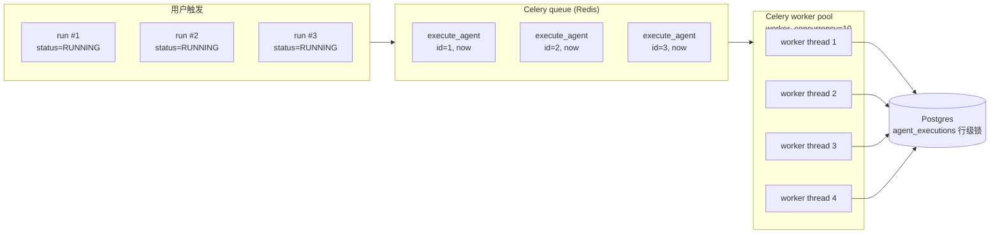
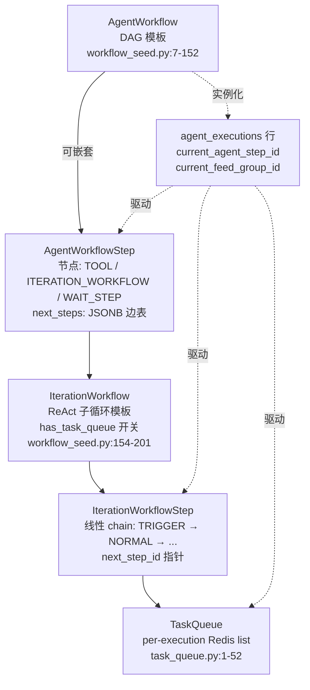
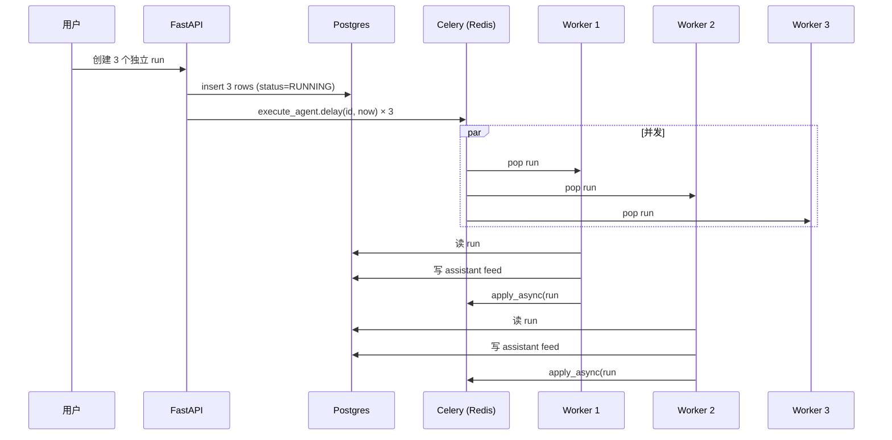
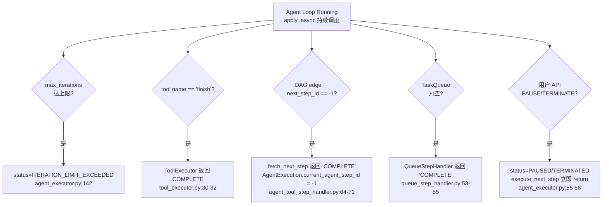
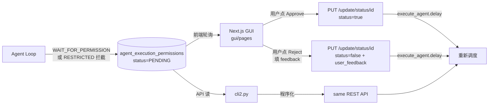
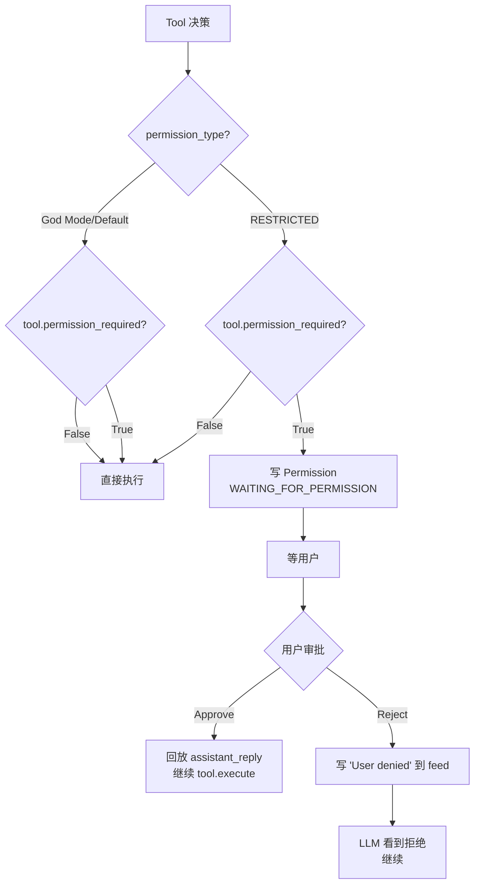
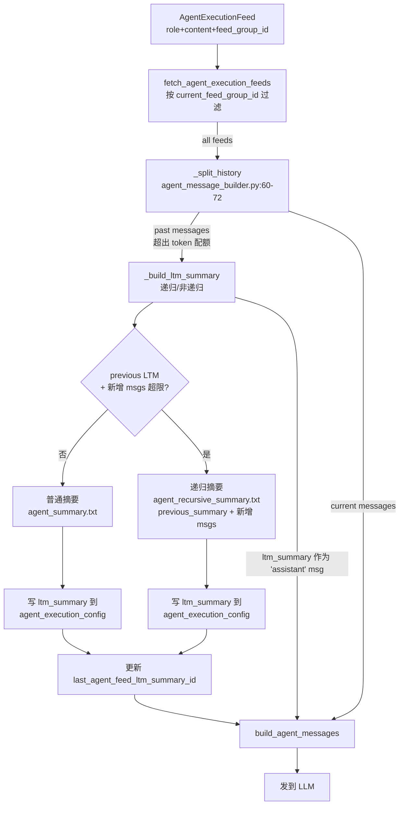

# SuperAGI — Agent Loop 调研报告

> 调研对象:`TransformerOptimus/SuperAGI`(本地 clone 快照)
> 调研范围:Agent Loop 主流程、Plan 计划机制、Sub Agent、Loop 退出、Ask 模式、HITL、工具权限、上下文压缩、其他亮点
> 调研日期:2026-07-18
> 前置阅读:`file_backend.md` / `tool_channel.md`

---

## 0. 智能体一句话定位

**dev-first 自主 Agent 平台**:以 **Celery 单步异步任务** + **Postgres 工作流状态机** + **Redis TaskQueue/向量库**为骨架,把 Agent Loop 拆成"**外层 AgentWorkflow(DAG)→ 内层 IterationWorkflow(ReAct 子循环)→ 单次 LLM 思考-行动-观察**"三层,GUI 实时回放 feeds 流的早期成熟实现。

---

## 1. 调研依据

### 1.1 核心文件清单

| 类别 | 文件 | 作用 |
|-----|-----|-----|
| **Celery 任务入口** | `superagi/worker.py:60-68` | `execute_agent` 任务(单步执行) |
| **Celery app 配置** | `superagi/worker.py:11-20` | `worker_concurrency=10`,Redis broker |
| **执行器主调度** | `superagi/jobs/agent_executor.py:36-150` | `AgentExecutor.execute_next_step` —— 外层主循环 |
| **执行器工作流分派** | `superagi/jobs/agent_executor.py:104-130` | `__execute_workflow_step` 按 action_type 分发 |
| **最大迭代限制** | `superagi/jobs/agent_executor.py:132-147` | `_check_for_max_iterations` 硬上限 |
| **ReAct 内循环** | `superagi/agent/agent_iteration_step_handler.py:42-115` | 一次 LLM 调用 + 一次 tool 执行 |
| **工具子步** | `superagi/agent/agent_tool_step_handler.py:36-58` | 单 tool 步骤(input → execute → output) |
| **任务队列子步** | `superagi/agent/queue_step_handler.py:40-58` | 队列消费(per-task 子循环) |
| **等待子步** | `superagi/agent/agent_workflow_step_wait_handler.py:21-35` | 定时唤醒 |
| **工作流模板** | `superagi/agent/workflow_seed.py:7-152` | 6 套预置 AgentWorkflow(Goal/Task/Sales/Recruitment/Coding/Fixed Task) |
| **Iteration 模板** | `superagi/agent/workflow_seed.py:154-201` | 5 套 IterationWorkflow(单步/动态/固定) |
| **System Prompt** | `superagi/agent/prompts/superagi.txt:1-58` | ReAct 风格 `{thoughts, tool}` JSON 输出 |
| **Tool 步骤 Prompt** | `superagi/agent/prompts/agent_tool_input.txt:1-30` | 单 tool 决策的 prompt |
| **Plan 拆分 Prompt** | `superagi/agent/prompts/create_tasks.txt` | "create a single task in plain english" |
| **任务分析 Prompt** | `superagi/agent/prompts/analyse_task.txt` | "Decide next task and respond with JSON" |
| **Tool 输出 prompt** | `superagi/agent/prompts/agent_tool_output.txt` | "Analyze tool output and respond with one of {output_options}" |
| **LTM 摘要 prompt** | `superagi/agent/prompts/agent_summary.txt` | "generate a concise summary of the previous interactions" |
| **递归 LTM prompt** | `superagi/agent/prompts/agent_recursive_summary.txt` | "integrate the new interactions into the existing summary" |
| **prompt 变量替换** | `superagi/agent/agent_prompt_builder.py:58-83` | `{goals}` / `{instructions}` / `{tools}` 占位符 |
| **Task 模式变量** | `superagi/agent/agent_prompt_builder.py:85-117` | `{current_task}` / `{task_history}` |
| **messages 构造** | `superagi/agent/agent_message_builder.py:31-58` | `build_agent_messages` —— history_enabled + LTM 摘要注入 |
| **History 切分** | `superagi/agent/agent_message_builder.py:60-72` | `_split_history` —— 按 token 配额切 |
| **LTM 摘要** | `superagi/agent/agent_message_builder.py:88-130` | `_build_ltm_summary` —— 递归/非递归 |
| **Tool 执行** | `superagi/agent/tool_executor.py:21-62` | `FINISH` 短路 + ValidationError → retry |
| **Tool 输出处理** | `superagi/agent/output_handler.py:36-60` | 写 `assistant_reply` + `tool_response` 到 feeds 表 |
| **权限拦截** | `superagi/agent/output_handler.py:106-126` | `_check_permission_in_restricted_mode` |
| **Feed 拉取** | `superagi/models/agent_execution_feed.py:60-75` | `fetch_agent_execution_feeds` —— 按 `feed_group_id` 切片 |
| **状态枚举** | `superagi/agent/types/agent_execution_status.py:1-13` | RUNNING / WAITING_FOR_PERMISSION / ITERATION_LIMIT_EXCEEDED / WAIT_STEP / COMPLETED |
| **Permission 表** | `superagi/models/agent_execution_permission.py:1-42` | PENDING / APPROVED / REJECTED + user_feedback |
| **Permission 控制器** | `superagi/controllers/agent_execution_permission.py:90-120` | `PUT /update/status/{id}` 触发 `execute_agent.delay` |
| **Workflow Step** | `superagi/models/workflows/agent_workflow_step.py:1-180` | DAG 边表 `next_steps: JSONB` |
| **Tool Step** | `superagi/models/workflows/agent_workflow_step_tool.py` | `TASK_QUEUE` / `WAIT_FOR_PERMISSION` 特殊 tool |
| **TaskQueue(Redis)** | `superagi/agent/task_queue.py:1-52` | `lpush/lpop` 的 todo list + completed log |
| **Run 创建入口** | `superagi/controllers/agent_execution.py:60-148` | `create_agent_run` → `execute_agent.delay(id, now)` |
| **加密** | `superagi/helper/encyption_helper.py:1-65` | Fernet 加密 + `ENCRYPTION_KEY` 配置 |

### 1.2 核心数据模型速查

| 表 | 关键字段 | 作用 |
|---|---|---|
| `agents` | id, name, project_id, agent_workflow_id | Agent 定义 |
| `agent_executions` | id, status, agent_id, current_agent_step_id, iteration_workflow_step_id, current_feed_group_id, num_of_calls, num_of_tokens, permission_id | **每次 run 实例 + 状态机游标** |
| `agent_execution_feeds` | id, agent_execution_id, role(system/user/assistant), feed, feed_group_id, error_message | **上下文历史 (ReAct 的 memory)** |
| `agent_configurations` | agent_id, key, value | 模板配置(goal/instruction/constraints/tools/permission_type/max_iterations/LTM_DB) |
| `agent_execution_config` | agent_execution_id, key, value | 每次 run 临时配置 |
| `agent_workflow_steps` | id, agent_workflow_id, action_type(TOOL/ITERATION_WORKFLOW/WAIT_STEP), action_reference_id, next_steps(JSONB) | **外层 DAG 节点 + 边表** |
| `iteration_workflows` | id, name, has_task_queue | 内层 ReAct 子循环模板 |
| `iteration_workflow_steps` | id, iteration_workflow_id, prompt, completion_prompt, history_enabled, output_type(tools/tasks/replace_tasks), next_step_id | **内层 ReAct 节点(线性 chain)** |
| `agent_execution_permissions` | id, agent_execution_id, status(PENDING/APPROVED/REJECTED), tool_name, user_feedback, question, assistant_reply | **HITL 审批单** |
| `agent_workflow_step_waits` | id, delay, wait_begin_time, status(WAITING/COMPLETED) | 定时步骤 |

### 1.3 关键发现摘要

1. **三层状态机嵌套**:`AgentWorkflow(DAG)` → `IterationWorkflow(线性 chain)` → `single LLM step`。
2. **Celery 单步异步**:`execute_agent` 跑"一个 step"后 `apply_async(countdown=2)` 排下一个 ——**不是 in-process while 循环**,是**事件驱动 + 状态机**。
3. **ReAct 风格 prompt**:`superagi.txt` 要求 LLM 返回 `{thoughts: {text/reasoning/plan/criticism/speak}, tool: {name, args}}`,没有用 OpenAI `tools=` API。
4. **多任务循环靠 Redis List**:`TaskQueue` 用 `lpush/lpop` 维护 pending/completed 队列,`feed_group_id` 切上下文。
5. **HITL 三层**:`permission_type`(全局)+ `permission_required`(per-tool)+ `WAIT_FOR_PERMISSION` step(显式询问)。
6. **LTM 递归摘要**:`_build_ltm_summary` 超出 token 预算时,prompt 模板切换到 `agent_recursive_summary.txt`,把"上一轮 summary + 新增 messages"再次摘要,`last_agent_feed_ltm_summary_id` 记录"摘要到哪一条 feed 为止"。

---

## 2. 九大问题回答

### Q1. Agent Loop 主流程(并发 + 思考-行动-观察)

#### 2.1.1 整体流程图

```mermaid
flowchart TD
    Start([用户创建 run<br/>POST /agent_executions/add_run]) --> CreateRow[写入 agent_executions<br/>status=CREATED → RUNNING<br/>current_agent_step_id=trigger]
    CreateRow --> PushCelery1[Celery queue<br/>execute_agent.delay<br/>id, now]
    PushCelery1 --> WorkerPick[Celery worker 拾取<br/>concurrency=10]

    WorkerPick --> AgentExec[AgentExecutor.execute_next_step<br/>agent_executor.py:36]

    AgentExec --> CheckRun{状态检查<br/>is_deleted?<br/>status==RUNNING/WAITING_PERMISSION?}
    CheckRun -- 否 --> End1([return: 终止])
    CheckRun -- 是 --> CheckMax[max_iterations 检查<br/>num_of_calls ≥ max_iterations?]

    CheckMax -- 是 --> LimitHit[status=ITERATION_LIMIT_EXCEEDED<br/>EventHandler.create_event]
    CheckMax -- 否 --> Dispatch[__execute_workflow_step<br/>按 action_type 分派]

    Dispatch --> ActionType{action_type}

    ActionType -- TOOL --> ToolHandler[AgentToolStepHandler.execute_step<br/>agent_tool_step_handler.py:36]
    ActionType -- ITERATION_WORKFLOW --> IterHandler[AgentIterationStepHandler.execute_step<br/>agent_iteration_step_handler.py:42]
    ActionType -- WAIT_STEP --> WaitHandler[AgentWaitStepHandler.execute_step<br/>wait → WAIT_STEP 状态]

    %% === Iteration 内层(ReAct 思考-行动-观察) ===
    IterHandler --> IterPre[权限拦截: 若是 WAITING_FOR_PERMISSION<br/>读 permission.status]
    IterPre --> IterPre2{permission<br/>状态?}
    IterPre2 -- PENDING --> Return1([return: 等用户])
    IterPre2 -- APPROVED --> IterNormal[正常推进: 写 assistant reply 到 feed]
    IterPre2 -- REJECTED --> IterDenied[写'用户拒绝'到 feed]
    IterPre2 -- 非等待 --> IterNormal

    IterNormal --> BuildPrompt[_build_agent_prompt<br/>替换 goals/instructions/tools/任务队列变量]
    BuildPrompt --> BuildMsg[AgentLlmMessageBuilder.build_agent_messages<br/>_split_history → LTM 摘要]
    BuildMsg --> LLMCall[llm.chat_completion<br/>max_tokens=token_limit - current]

    LLMCall --> LLMResp{content<br/>合法?}
    LLMResp -- 否 --> RaiseErr[抛 RuntimeError<br/>Celery 兜底 retry]
    LLMResp -- 是 --> OutHandler[ToolOutputHandler.handle<br/>output_handler.py:36]

    OutHandler --> RestrictCheck[permission_type == RESTRICTED?<br/>permission_required?]
    RestrictCheck -- 需权限 --> CreatePerm[写 AgentExecutionPermission<br/>status=WAITING_FOR_PERMISSION<br/>return WAITING_FOR_PERMISSION]
    RestrictCheck -- 无需权限 --> RunTool[ToolExecutor.execute<br/>tool_executor.py:21]

    RunTool --> FinishCheck{tool name ==<br/>'finish'?}
    FinishCheck -- 是 --> CompleteTool[status=COMPLETE]
    FinishCheck -- 否 --> RunReal[tool.execute 实际调用]

    RunReal --> ToolResult[结果 f"Tool X returned: Y"<br/>status=SUCCESS/ERROR]

    CompleteTool --> WriteFeed[写 assistant_reply + tool_result 到<br/>agent_execution_feeds 表]
    ToolResult --> WriteFeed

    WriteFeed --> UpdateStep[execution.iteration_workflow_step_id<br/>= next_step_id]
    UpdateStep --> StatusCheck{status 切换?}

    StatusCheck -- COMPLETE --> SetComplete[execution.status=COMPLETED<br/>current_agent_step_id=-1]
    StatusCheck -- WAITING --> SetWait[execution.status=WAITING_FOR_PERMISSION]
    StatusCheck -- 普通推进 --> ReSched[execute_agent.apply_async<br/>countdown=2]

    SetComplete --> End2([run 结束])
    SetWait --> End3([等用户审批])
    ReSched --> PushCelery1
    LimitHit --> End4([run 强制结束])
    CreatePerm --> ReSched

    %% === Tool 子步分支 ===
    ToolHandler --> ToolType{step_tool.tool_name}
    ToolType -- TASK_QUEUE --> QueueHandler[QueueStepHandler.execute_step<br/>add to queue / consume first task]
    ToolType -- WAIT_FOR_PERMISSION --> CreatePermStep[写 AgentExecutionPermission<br/>execution.status=WAITING_FOR_PERMISSION<br/>return]
    ToolType -- 普通 tool --> ToolSubProc[_process_input_instruction<br/>_process_output_instruction<br/>写 assistant/tool feed]

    ToolSubProc --> FetchNext[AgentWorkflowStep.fetch_next_step<br/>按 step_response 选 edge]
    FetchNext --> EdgeCheck{next step ==<br/>'COMPLETE'?}
    EdgeCheck -- 是 --> SetComplete
    EdgeCheck -- 否 --> AssignStep[execution.current_agent_step_id<br/>= next_step.id]
    AssignStep --> ReSched

    %% === 用户审批回路 ===
    End3 --> UserGUI([用户登录 GUI/CLI])
    UserGUI --> ApproveAPI[PUT /agent_execution_permissions/update/status/{id}<br/>status=APPROVED/REJECTED<br/>user_feedback]
    ApproveAPI --> ReSched

    %% === 等待步骤 ===
    WaitHandler --> BeatJob[Celery beat 每 2 min<br/>execute_waiting_workflows]
    BeatJob --> WaitCheck{wait 时间到?}
    WaitCheck -- 是 --> Resume[status=RUNNING<br/>handle_next_step → 推进]
    WaitCheck -- 否 --> BeatJob
    Resume --> ReSched
```

#### 2.1.2 单次 LLM step 的"思考-行动-观察"细节

**关键代码 `agent_iteration_step_handler.py:42-114` (`execute_step`):**

```python
def execute_step(self):
    # 1) 权限拦截:若是 WAITING_FOR_PERMISSION,从 permission 表读用户审批结果
    if not self._handle_wait_for_permission(execution, agent_config, agent_execution_config,
                                            iteration_workflow_step):
        return

    # 2) 拉历史(按 current_feed_group_id 过滤)
    agent_feeds = AgentExecutionFeed.fetch_agent_execution_feeds(self.session, self.agent_execution_id)

    # 3) 构 tool 列表(ThinkingTool + 用户 tools + resource_summary → QueryResourceTool)
    agent_tools = self._build_tools(agent_config, agent_execution_config)

    # 4) 拼 system prompt(goal/instructions/constraints/tools/{current_task, last_task...})
    prompt = self._build_agent_prompt(iteration_workflow, agent_config,
                                      agent_execution_config,
                                      iteration_workflow_step.prompt, agent_tools)

    # 5) 构 messages(history_enabled 时:LTM 摘要 + 当前 feed_group 历史 + completion_prompt)
    messages = AgentLlmMessageBuilder(...).build_agent_messages(
        prompt, agent_feeds, history_enabled=iteration_workflow_step.history_enabled,
        completion_prompt=iteration_workflow_step.completion_prompt)

    # 6) LLM 调用
    response = self.llm.chat_completion(messages, max_tokens=...)

    # 7) 写回 history(assistant_reply + tool_result)
    output_handler = get_output_handler(iteration_workflow_step.output_type, ...)  # tools/tasks/replace_tasks
    response = output_handler.handle(self.session, assistant_reply)

    # 8) 状态推进
    if response.status == "COMPLETE":
        execution.status = "COMPLETED"
        self._update_agent_execution_next_step(execution, iteration_workflow_step.next_step_id, "COMPLETE")
    elif response.status == "WAITING_FOR_PERMISSION":
        execution.status = "WAITING_FOR_PERMISSION"
        execution.permission_id = response.permission_id
    else:
        self._update_agent_execution_next_step(execution, iteration_workflow_step.next_step_id)

    self.session.flush()  # 后续由 AgentExecutor.execute_next_step 重新 apply_async
```

→ **关键**:此处**没有 `while True`**,一次 `execute_step` 跑**一个 LLM 调用 + 一次 tool 执行**就退出。状态由 `agent_execution.current_agent_step_id` + `iteration_workflow_step_id` 决定下一步。

#### 2.1.3 外层"循环"实为事件驱动 + 状态机

**关键代码 `agent_executor.py:130-150`(外层循环):**

```python
self.__execute_workflow_step(agent, agent_config, agent_execution_id, agent_workflow_step, ...)

agent_execution = session.query(AgentExecution).filter(AgentExecution.id == agent_execution_id).first()
if agent_execution.status == "COMPLETED" or agent_execution.status == "WAITING_FOR_PERMISSION":
    logger.info("Agent Execution is completed or waiting for permission")
    session.close()
    return
# ★ 关键:递归推进通过 Celery 重排
superagi.worker.execute_agent.apply_async((agent_execution_id, datetime.now()), countdown=2)
```

→ **没有 in-process while**;`countdown=2` 把下一步推回 Celery 队列,2 秒后**重新走一遍 `execute_next_step`**,按最新的 `current_agent_step_id` 决定该跑哪个 handler。**理论上无限循环直到 max_iterations 兜底**。

#### 2.1.4 并发执行:不是 sub-agent,是并行 `agent_executions`



**关键代码 `worker.py:18`:**

```python
app.conf.worker_concurrency = 10
```

→ **同/不同 agent 的不同 run 可以并发**;每个 run 有自己的 `agent_executions.id`,在 Celery 队列里独立调度。**不是 sub-agent 树形调度** —— 是"独立进程数=独立 run"。

#### 2.1.5 与标准 ReAct Agent Loop 的对比

| 维度 | 标准 ReAct (LangChain AgentExecutor) | SuperAGI |
|---|---|---|
| 循环驱动 | `while` in-process | **Celery `apply_async(countdown=2)`** 事件驱动 |
| 状态存储 | 内存 `AgentScratchPad` | **Postgres `agent_executions` + `agent_execution_feeds`** |
| 每次推进 | 1 次 LLM + 1 次 tool → 立刻下一步 | **1 次 LLM + 1 次 tool → 写 DB → 退出 → 重新入队** |
| 并发 | 单进程串行 | **多 Celery worker 并发,单 run 串行** |
| 推进延迟 | 0 | **2 秒固定 countdown** |
| 状态恢复 | 进程崩溃 = 上下文丢失 | **DB 持久化,worker 重启可继续** |
| Token 计量 | 在内存累计 | **`num_of_tokens` / `num_of_calls` 写 DB,精确计量** |
| 异常处理 | 进程内 try/except | **Celery `autoretry_for=(Exception,)` + `retry_backoff=2` + `max_retries=5`** |
| 退出条件 | 业务逻辑 | **`max_iterations` 硬上限 + `finish` tool + workflow edge → -1** |

---

### Q2. Plan 计划机制:三层嵌套 + Redis 任务队列

#### 2.2.1 三层 plan 模型

SuperAGI 把"plan"拆成三个正交维度:



#### 2.2.2 Plan 数据存储

| Plan 维度 | 存储位置 | 模板化? |
|---|---|---|
| **外层 DAG** | `agent_workflow_steps` (next_steps: JSONB) | 6 套预置(Sales/Recruitment/Coding/Goal/Task/Fixed) |
| **内层 ReAct 链** | `iteration_workflow_steps` (next_step_id) | 5 套预置(Single/Initialize/Dynamic/Fixed/Action) |
| **Todo list** | Redis `lpush/lpop` list | 运行时,LLM 用 `create_tasks.txt` 动态拆 |
| **Step 实例状态** | `agent_executions.current_agent_step_id` / `iteration_workflow_step_id` | 运行时游标 |
| **上下文分组** | `agent_execution_feeds.feed_group_id` | 默认 `DEFAULT`,每次取 task 时切 `GROUP_<timestamp>` |
| **LTM 摘要** | `agent_execution_config.ltm_summary` (Text) | 递归累计 |

#### 2.2.3 Multi-step plan 怎么管?

**A. 预置 workflow DAG(声明式)**

`agent_workflow_step.py:165-180`:
```python
def add_next_workflow_step(cls, session, current_agent_step_id, next_step_id, step_response="default"):
    """Add Next workflow steps in the next_steps column"""
    next_unique_id = "-1"
    if next_step_id != -1:
        next_workflow_step = AgentWorkflowStep.find_by_id(session, next_step_id)
        next_unique_id = next_workflow_step.unique_id
    current_step = session.query(AgentWorkflowStep).filter(AgentWorkflowStep.id == current_agent_step_id).first()
    next_steps = json.loads(json.dumps(current_step.next_steps))
    next_steps.append({"step_response": str(step_response), "step_id": str(next_unique_id)})
    current_step.next_steps = next_steps
    session.commit()
```

→ `next_steps: [{"step_response": "default", "step_id": "step2"}, {"step_response": "YES", "step_id": "step3"}, ...]` 是**带条件的边表**,支持 YES/NO 分支。

**B. 内层 IterationWorkflow 拆任务(LLM-driven)**

`create_tasks.txt` 模板:
```
Based on this, create a single task in plain english to be completed by your AI system ONLY IF REQUIRED
to get closer to or fully reach your high level goal. Don't create any task if it is already covered
in incomplete or completed tasks.
```

→ 内层 step 用 `output_type="tasks"` 时,LLM 输出**任务数组**写到 Redis list。

**C. TaskQueue 实现(Redis 列表)**

`task_queue.py:9-52`:
```python
def add_task(self, task: str):
    self.db.lpush(self.queue_name, task)        # LEFT push 进 pending 队列

def complete_task(self, response):
    if len(self.get_tasks()) <= 0:
        return
    task = self.db.lpop(self.queue_name)         # 弹出当前 task
    self.db.lpush(self.completed_tasks, str({"task": task, "response": response}))
```

→ pending 队列 + completed 历史 都在 Redis,key 是 `{agent_execution_id}_q` / `{agent_execution_id}_q_completed`。

#### 2.2.4 Plan 推进的完整链路

`agent_executor.py:104-130` 工作流分派:
```python
def __execute_workflow_step(self, agent, agent_config, agent_execution_id, agent_workflow_step, ...):
    if agent_workflow_step.action_type == AgentWorkflowStepAction.TOOL.value:
        AgentToolStepHandler(...).execute_step()    # 普通 tool
    elif agent_workflow_step.action_type == AgentWorkflowStepAction.ITERATION_WORKFLOW.value:
        AgentIterationStepHandler(...).execute_step()  # ★ 内部走 ReAct
    elif agent_workflow_step.action_type == AgentWorkflowStepAction.WAIT_STEP.value:
        AgentWaitStepHandler(...).execute_step()    # 定时等待
```

→ 整个 run 是**"DAG step → 内层 ReAct → DAG 下一 step"** 的"楼梯式"推进。**plan = DAG + LLM 动态拆 todo**。

#### 2.2.5 Task Queue 消费机制

`queue_step_handler.py:40-58`:
```python
def execute_step(self):
    ...
    if task_queue.get_status() == QueueStatus.INITIATED.value:
        self._add_to_queue(task_queue, step_tool)        # 第一次: LLM 拆任务入队
        execution.current_feed_group_id = "DEFAULT"
        task_queue.set_status(QueueStatus.PROCESSING.value)

    if not task_queue.get_tasks():
        task_queue.set_status(QueueStatus.COMPLETE.value)
        return "COMPLETE"
    self._consume_from_queue(task_queue)                  # 后续: pop 一个 task,起新 feed_group
    return "default"

def _consume_from_queue(self, task_queue):
    task = task_queue.get_first_task()
    agent_execution.current_feed_group_id = "GROUP_" + str(int(time.time()))  # ★ 每个 task 独立 context
    self.session.commit()
    task_response_feed = AgentExecutionFeed(...feed="Input: " + task, role="assistant",
                                             feed_group_id=agent_execution.current_feed_group_id)
    task_queue.complete_task("PROCESSED")
```

→ **每个 task 一个独立 feed_group**,完成该 task 后弹出,推到 completed 列表;**所有 task 跑完 = COMPLETE**。

---

### Q3. Sub Agent:不是真 sub-agent,是并行 AgentExecution

#### 2.3.1 关键结论

**SuperAGI 没有 sub-agent / sub-task 树形调度**。

- "Sub Agent"在 SuperAGI 语境下 = **另一个独立 `agent_executions` 行**,通过 Celery 队列并发。
- **没有 in-process delegation 协议**(如 AutoGPT 的 TaskAgent, LangGraph 的 Send API)。
- **没有"父 agent spawn 子 agent"接口**(grep `parent_id|child_agent|sub_agent` 在 `superagi/` 全无匹配)。
- 真正"嵌套"的是 **`AgentWorkflow` 嵌套 `IterationWorkflow`** —— 同一 execution 里 step 跳转,**不是新 execution**。

#### 2.3.2 并发调度机制



#### 2.3.3 隔离与限制

- **路径隔离**:`workspace/output/{agent_name}_{agent.id}/{agent_exec_name}_{agent_exec.id}/`(`helper/resource_helper.py:80-90`)。
- **状态隔离**:每个 run 有自己的 `current_agent_step_id` / `iteration_workflow_step_id` / `permission_id`。
- **共享风险**:
  - **共享 Postgres** —— 大量并发写 `agent_execution_feeds` 表可能成瓶颈。
  - **共享 Redis** —— `LTM_DB` 索引名是**全局** `super-agent-index1`(`agent_executor.py:71`),所有 agent 的 LTM **混在一个索引**!可通过 `agent_execution_id` metadata 区分(`output_handler.py:60-66`)。
  - **共享 Celery worker 池** —— `worker_concurrency=10` 全局池;一个重 run 占住 worker 10s 不会阻塞其他 run 入队但会**拖慢**。
  - **没有分布式锁** —— 没看到 row-level lock 或 Redis lock;同 agent 多次 run 可能竞争 `current_agent_step_id` 写(实际是各跑各的不冲突,因为按 id 隔离)。

#### 2.3.4 "嵌套"的另一种形式:Workflow 嵌套

**虽然不是真 sub-agent**,但**工作流可以嵌套**:
- 外层 `AgentWorkflowStep.action_type = "ITERATION_WORKFLOW"`(`agent_workflow_step.py:131-155`)→ 嵌入一个完整的内层 ReAct。
- 内层跑完才回到外层下一 step。
- **`agent_executions.iteration_workflow_step_id`** 记录当前在内层的哪一步(`agent_execution.py:34`),与外层 `current_agent_step_id` 同时维护。

→ 这是"逻辑嵌套"但**仍是同一个 execution 同一个进程**,**不是 sub-agent**。

---

### Q4. Loop 退出机制:5 种退出路径



#### 2.4.1 退出条件 1:`max_iterations` 硬上限(自动)

**关键代码 `agent_executor.py:132-147`:**
```python
def _check_for_max_iterations(self, session, organisation_id, agent_config, agent_execution_id):
    db_agent_execution = session.query(AgentExecution).filter(AgentExecution.id == agent_execution_id).first()
    if agent_config["max_iterations"] <= db_agent_execution.num_of_calls:
        db_agent_execution.status = AgentExecutionStatus.ITERATION_LIMIT_EXCEEDED.value
        EventHandler(session=session).create_event('run_iteration_limit_crossed', {...})
        session.commit()
        return True
    return False
```

→ `num_of_calls` 在每次 LLM 调用后 `+= 1`(`agent_execution.py:120-124` `update_tokens`)。**默认 `max_iterations` 通常 25-50**(具体值在 `agent_configurations` 表)。

#### 2.4.2 退出条件 2:`finish` 工具(LLM 主动)

**关键代码 `tool_executor.py:30-32`:**
```python
if tool_name == ToolExecutor.FINISH or tool_name == "":
    logger.info("\nTask Finished :) \n")
    return ToolExecutorResponse(status="COMPLETE", result="")
```

→ `agent_prompt_builder.py:5` 定义 `FINISH_NAME = "finish"`,在 system prompt 末尾追加:
```
{len(tools) + 1}. "finish": use this to signal that you have finished all your objectives
```

→ LLM 想结束就输出 `{"tool": {"name": "finish", "args": {"response": "..."}}}`。

#### 2.4.3 退出条件 3:DAG 边到 `step_id=-1`(模板决定)

**关键代码 `agent_workflow_step.py:172-184`:**
```python
@classmethod
def fetch_next_step(cls, session, current_agent_step_id, step_response):
    ...
    matching_steps = [step for step in next_steps if str(step["step_response"]).lower() == step_response.lower()]
    if matching_steps:
        if str(matching_steps[0]["step_id"]) == "-1":
            return "COMPLETE"     # ★ 边指向 -1 = 终止
        return AgentWorkflowStep.find_by_unique_id(session, matching_steps[0]["step_id"])
```

→ **DAG 设计者**通过 `AgentWorkflowStep.add_next_workflow_step(step_id, -1, "COMPLETE")` 来标记终止。

#### 2.4.4 退出条件 4:TaskQueue 空(任务链结束)

`queue_step_handler.py:53-55`:
```python
if not task_queue.get_tasks():
    task_queue.set_status(QueueStatus.COMPLETE.value)
    return "COMPLETE"
```

→ 内层拆出的所有 todo 跑完 → 推回外层。

#### 2.4.5 退出条件 5:用户 API 终止(外部)

`agent_executor.py:53-58`:
```python
if agent.is_deleted or (
        agent_execution.status != AgentExecutionStatus.RUNNING.value and
        agent_execution.status != AgentExecutionStatus.WAITING_FOR_PERMISSION.value):
    logger.error(f"Agent execution stopped. {agent.id}: {agent_execution.status}")
    return
```

→ 任何 `status` 不是 `RUNNING` / `WAITING_FOR_PERMISSION` 时,worker 静默退出。可由 `controllers/agent_execution.py` 的 `pause` / `terminate` 端点设置。

#### 2.4.6 状态枚举

`agent/types/agent_execution_status.py:1-13`:
```python
class AgentExecutionStatus(Enum):
    RUNNING = 'RUNNING'
    WAITING_FOR_PERMISSION = 'WAITING_FOR_PERMISSION'
    ITERATION_LIMIT_EXCEEDED = 'ITERATION_LIMIT_EXCEEDED'
    WAIT_STEP = 'WAIT_STEP'
    COMPLETED = 'COMPLETED'
```

→ 但**代码里实际用到的 status 还有** `CREATED` / `PAUSED` / `TERMINATED` / `PENDING` 等(枚举没穷举,字符串直接用)。

---

### Q5. Ask 模式:三种询问用户的方式

#### 2.5.1 方式 1:`WAIT_FOR_PERMISSION` 步骤(显式 Ask)

最常用的"问用户"机制,通过 `AgentWorkflowStepTool` 标记 `tool_name = "WAIT_FOR_PERMISSION"` 触发。

**关键代码 `agent_tool_step_handler.py:60-73`:**
```python
def _create_permission_request(self, execution, step_tool: AgentWorkflowStepTool):
    new_agent_execution_permission = AgentExecutionPermission(
        agent_execution_id=self.agent_execution_id,
        status="PENDING",
        agent_id=self.agent_id,
        tool_name="WAIT_FOR_PERMISSION",
        question=step_tool.input_instruction,    # ★ LLM/设计者提供的"问题"
        assistant_reply="")
    self.session.add(new_agent_execution_permission)
    self.session.commit()
    execution.permission_id = new_agent_execution_permission.id
    execution.status = "WAITING_FOR_PERMISSION"
    self.session.commit()
```

→ 例子(Sales workflow `workflow_seed.py:78-83`):
```python
step6 = AgentWorkflowStep.find_or_create_tool_workflow_step(...,
    "WAIT_FOR_PERMISSION",
    "Email will be based on this content. Do you want send the email?")  # ★ 这里就是"问题"
```

#### 2.5.2 方式 2:`RESTRICTED` 模式下每个 tool 触发的隐式 Ask

`output_handler.py:106-126`:
```python
def _check_permission_in_restricted_mode(self, session, assistant_reply):
    action = self.output_parser.parse(assistant_reply)
    tools = {t.name: t for t in self.tools}
    excluded_tools = [ToolExecutor.FINISH, '', None]
    if self.agent_config["permission_type"].upper() == "RESTRICTED" and \
            action.name not in excluded_tools and \
            tools.get(action.name) and tools[action.name].permission_required:
        new_agent_execution_permission = AgentExecutionPermission(
            agent_execution_id=self.agent_execution_id,
            status="PENDING",
            ...
            tool_name=action.name,
            assistant_reply=assistant_reply)    # ★ 把 LLM 决策的完整 JSON 存起来,批准后回放
        session.add(new_agent_execution_permission)
        session.commit()
        return ToolExecutorResponse(is_permission_required=True, status="WAITING_FOR_PERMISSION", ...)
    return ToolExecutorResponse(status="PENDING", is_permission_required=False)
```

→ **RESTRICTED 模式下,任何标了 `permission_required=True` 的 tool 都会触发"问用户"**。

#### 2.5.3 方式 3:Coding workflow 的"代码完成"确认

`workflow_seed.py:103-122`:
```python
step4 = AgentWorkflowStep.find_or_create_tool_workflow_step(...,
    "WAIT_FOR_PERMISSION",
    "Your code is ready. Do you want end?")
```

→ 这种"内嵌问句"让 workflow 设计者可以在任何 step 后插入人工确认,**没有专门的"Ask"API**,复用 `WAIT_FOR_PERMISSION` step。

#### 2.5.4 用户响应:控制器 PATCH 端点

`controllers/agent_execution_permission.py:90-120`:
```python
@router.put("/update/status/{agent_execution_permission_id}")
def update_agent_execution_permission_status(agent_execution_permission_id,
                                             status: Annotated[bool, Body(embed=True)],
                                             user_feedback: Annotated[str, Body(embed=True)] = "",
                                             ...):
    agent_execution_permission.status = "APPROVED" if status else "REJECTED"
    agent_execution_permission.user_feedback = user_feedback.strip() if len(user_feedback.strip()) > 0 else None
    db.session.commit()
    execute_agent.delay(agent_execution_permission.agent_execution_id, datetime.now())  # ★ 关键:批准后立即重启
    return {"success": True}
```

→ 用户在前端看到"需要确认"提示 → 选 Approve/Reject + 可填 `user_feedback` → 后端写 status,`execute_agent.delay` 重启 run。

#### 2.5.5 反馈如何写回 history(让 LLM 看到用户拒绝)

`agent_iteration_step_handler.py:127-170` `_handle_wait_for_permission`:
```python
if agent_execution_permission.status == "APPROVED":
    agent_tools = self._build_tools(agent_config, agent_execution_config)
    tool_output_handler = ToolOutputHandler(...)
    tool_result = tool_output_handler.handle_tool_response(self.session,
                                                           agent_execution_permission.assistant_reply)
    result = tool_result.result
else:
    result = f"User denied the permission to run the tool {agent_execution_permission.tool_name}" \
             f"{' and has given the following feedback : ' + agent_execution_permission.user_feedback if agent_execution_permission.user_feedback else ''}"

# ★ 把 assistant_reply 当 LLM 输出,把 result 当 tool 输出,都写进 feed
agent_execution_feed = AgentExecutionFeed(...feed=agent_execution_permission.assistant_reply, role="assistant", ...)
self.session.add(agent_execution_feed)
agent_execution_feed1 = AgentExecutionFeed(...feed=result, role="user", ...)   # 拒绝时 result = "User denied..."
self.session.add(agent_execution_feed1)
agent_execution.status = "RUNNING"
```

→ **ReAct "看到"自己的 assistant_reply + 用户的拒绝反馈**,下次 LLM 调用时自动调整。

---

### Q6. Human-in-the-Loop (HITL):GUI/CLI 全栈

#### 2.6.1 HITL 入口全景



#### 2.6.2 GUI 实现位置(部分)

- `gui/pages/Agents/` —— Agent 列表/详情
- `gui/pages/AgentExecution/RunConsole.js` —— 实时 feed 流
- `gui/utils/api.js` —— REST 客户端
- 前端轮询 `GET /agent_executions/feed/{id}` 拉 feeds,看到 `role=user` 且包含"Permission"就弹模态框

#### 2.6.3 CLI 实现位置

- `cli2.py`(二级 CLI):命令 `superagi run --agent-id X --goal Y`,基本是"创 run → 等结果"。
- **CLI 模式对 HITL 支持弱**,更适合 CI/CD 自动批跑。

#### 2.6.4 手动干预接口(全部走 REST)

| 操作 | 端点 | 作用 |
|---|---|---|
| 暂停 | `POST /agent_executions/pause/{id}` | 改 status=PAUSED,worker 静默退出 |
| 恢复 | `POST /agent_executions/resume/{id}` | status=RUNNING + `execute_agent.delay` |
| 终止 | `POST /agent_executions/stop/{id}` | status=TERMINATED,worker 静默退出 |
| 审批 | `PUT /agent_exececution_permissions/update/status/{id}` | 见 Q5 |
| 编辑 feeds | `PATCH /agent_execution_feeds/{id}` | **可手工改正 LLM 输出**,后续推进会用新值 |

#### 2.6.5 与 Onion Agent 的对比

| 维度 | SuperAGI | Onion Agent (信创) |
|---|---|---|
| HITL 协议 | REST + Celery 重启 | CLI/GUI 同源,信创内网可走 SSH 隧道 |
| Webhook 回调 | ✅ `webhooks` 表 + `webhook_callback` Celery task | 暂无 |
| 状态变更事件 | ✅ `EventHandler` + `events` 表 JSONB | `session.json` 状态字段 |
| 审计追溯 | ✅ 全部写 events 表 | 信创合规刚需,可借鉴 |

---

### Q7. 工具调用权限:三层机制



#### 2.7.1 三层权限配置

**A. 全局:agent_configurations 表 `permission_type`**

`agent_configurations` 表有 `permission_type` 字段(`models/agent.py:83` / `agent_template.py:101-103`),两个值:
- `"God Mode"`(默认 `controllers/api/agent.py:68` / `api/agent.py:215`):**所有 tool 跳过权限检查**
- `"RESTRICTED"`:只跑 `permission_required=False` 的 tool,其他都要审批

**B. Tool 级:BaseTool.permission_required**

`tools/base_tool.py:80`:
```python
permission_required: bool = True    # ★ 默认需要权限
```

→ 每个 tool 类继承时显式声明。比如 `ReadFileTool` 可能设 `permission_required=False`(只读不危险),`SendEmailTool` 设 `True`。

**C. 步骤级:`WAIT_FOR_PERMISSION` step**

`workflow_seed.py:81` 显式插入询问步骤,完全由 workflow 设计者控制。

#### 2.7.2 权限检查代码路径

**RESTRICTED 模式触发点 `output_handler.py:106-126`:** 见 Q5 方式 2。

**Approve 后的 tool 回放 `agent_iteration_step_handler.py:144-148`:**
```python
if agent_execution_permission.status == "APPROVED":
    agent_tools = self._build_tools(agent_config, agent_execution_config)
    tool_output_handler = ToolOutputHandler(self.agent_execution_id, agent_config, agent_tools, self.memory)
    tool_result = tool_output_handler.handle_tool_response(self.session,
                                                           agent_execution_permission.assistant_reply)
    result = tool_result.result
```

→ `assistant_reply` 是 LLM 之前给的那条 JSON 决策,被**完整保留**在 `agent_execution_permissions` 表里;批准后**回放**到 `handle_tool_response`,**避免重新问 LLM**。

#### 2.7.3 GUI 审批弹窗数据流

`controllers/agent_execution_permission.py:55-78` `get_agent_execution_permission`:
```python
@router.get("/get/{agent_execution_permission_id}")
def get_agent_execution_permission(agent_execution_permission_id, ...):
    db_agent_execution_permission = db.session.query(AgentExecutionPermission).get(...)
    return db_agent_execution_permission  # 前端拿 tool_name + question + assistant_reply 渲染
```

→ 前端拿到 `question`(人话)+ `assistant_reply`(LLM 的 JSON)+ `tool_name`,展示"AI 想用 `SendEmailTool`,发邮件给 X,内容是 Y,批准吗?"

---

### Q8. 上下文压缩和摘要:三层 LTM + 任务级 feed_group

#### 2.8.1 整体架构



#### 2.8.2 关键代码 `agent_message_builder.py:31-58`

```python
def build_agent_messages(self, prompt, agent_feeds, history_enabled=False, completion_prompt=None):
    token_limit = TokenCounter(...).token_limit(self.llm_model)
    max_output_token_limit = int(get_config("MAX_TOOL_TOKEN_LIMIT", 800))
    messages = [{"role": "system", "content": prompt}]

    if history_enabled:
        messages.append({"role": "system", "content": f"The current time and date is {time.strftime('%c')}"})
        base_token_limit = TokenCounter.count_message_tokens(messages, self.llm_model)
        full_message_history = [{'role': agent_feed.role, 'content': agent_feed.feed, 'chat_id': agent_feed.id}
                                            for agent_feed in agent_feeds]
        # ★ 关键:按 token 配额切历史
        past_messages, current_messages = self._split_history(
            full_message_history,
            ((token_limit - base_token_limit - max_output_token_limit) // 4) * 3
        )
        if past_messages:
            ltm_summary = self._build_ltm_summary(past_messages=past_messages,
                                              output_token_limit=(token_limit - base_token_limit - max_output_token_limit) // 4)
            messages.append({"role": "assistant", "content": ltm_summary})  # ★ 摘要作为 assistant 角色

        for history in current_messages:
            messages.append({"role": history["role"], "content": history["content"]})
        messages.append({"role": "user", "content": completion_prompt})

    self._add_initial_feeds(agent_feeds, messages)
    return messages
```

#### 2.8.3 `_split_history` 切分算法

`agent_message_builder.py:60-72`:
```python
def _split_history(self, history, pending_token_limit):
    hist_token_count = 0
    i = len(history)
    for message in reversed(history):                              # ★ 从最新往最旧数
        token_count = TokenCounter.count_message_tokens(...)
        hist_token_count += token_count
        if hist_token_count > pending_token_limit:                  # ★ 超过预算就切
            self._add_or_update_last_agent_feed_ltm_summary_id(str(history[i-1]['chat_id']))
            return history[:i], history[i:]                        # past=前半(老), current=后半(新)
        i -= 1
    return [], history                                              # 都没超 → 全是 current
```

→ **简单的"倒序累加 token,超限就切"**;`chat_id` 是 `agent_execution_feeds.id`,被记录到 `last_agent_feed_ltm_summary_id` 持久化,**下次同样 summary 不重算**。

#### 2.8.4 递归 LTM 摘要

`agent_message_builder.py:88-130` `_build_ltm_summary`:
```python
def _build_ltm_summary(self, past_messages, output_token_limit) -> str:
    ltm_prompt = self._build_prompt_for_ltm_summary(past_messages, output_token_limit)
    summary = AgentExecutionConfiguration.fetch_value(self.session, self.agent_execution_id, "ltm_summary")
    previous_ltm_summary = summary.value if summary is not None else ""

    # ★ 检测是否需要递归
    if ((TokenCounter.count_text_tokens(ltm_prompt) + 10 + output_token_limit)
        - TokenCounter(...).token_limit(self.llm_model)) > 0:
        last_agent_feed_ltm_summary_id = AgentExecutionConfiguration.fetch_value(...)
        # 从 last_agent_feed_ltm_summary_id 之后的所有 feed 拉出来
        past_messages = session.query(AgentExecutionFeed...) \
            .filter(AgentExecutionFeed.id > last_agent_feed_ltm_summary_id) \
            .all()
        # 改用递归 prompt
        ltm_prompt = self._build_prompt_for_recursive_ltm_summary_using_previous_ltm_summary(
            previous_ltm_summary, past_messages, output_token_limit)

    msgs = [{"role": "system", "content": "You are GPT Prompt writer"},
            {"role": "assistant", "content": ltm_prompt}]
    ltm_summary = self.llm.chat_completion(msgs)
    # 存回 ltm_summary config
    execution = AgentExecution(id=self.agent_execution_id)
    AgentExecutionConfiguration.add_or_update_agent_execution_config(
        session, execution, {"ltm_summary": ltm_summary["content"]})
    return ltm_summary["content"]
```

→ **核心创新**:如果连"past_messages 拼成 prompt"都超 token 上限,**改用递归 prompt** `agent_recursive_summary.txt`:
```
Previous Summary: {previous_ltm_summary}
{past_messages}
Your final summary should integrate the new interactions into the existing summary...
```

#### 2.8.5 Feed Group 切分(任务级 context)

`queue_step_handler.py:71-78`:
```python
def _consume_from_queue(self, task_queue):
    task = task_queue.get_first_task()
    agent_execution.current_feed_group_id = "GROUP_" + str(int(time.time()))  # ★ 每次换 task 切 group
    self.session.commit()
    task_response_feed = AgentExecutionFeed(...feed="Input: " + task, role="assistant",
                                             feed_group_id=agent_execution.current_feed_group_id)
```

`models/agent_execution_feed.py:60-75`:
```python
@classmethod
def fetch_agent_execution_feeds(cls, session, agent_execution_id):
    agent_execution = AgentExecution.find_by_id(session, agent_execution_id)
    agent_feeds = session.query(AgentExecutionFeed.role, AgentExecutionFeed.feed, AgentExecutionFeed.id) \
        .filter(AgentExecutionFeed.agent_execution_id == agent_execution_id,
                AgentExecutionFeed.feed_group_id == agent_execution.current_feed_group_id) \
        .order_by(asc(AgentExecutionFeed.created_at)) \
        .all()
    if agent_execution.current_feed_group_id != "DEFAULT":
        return agent_feeds
    else:
        return agent_feeds[2:]    # ★ DEFAULT 跳过前 2 条 system prompt
```

→ **每次取 task 时改 `current_feed_group_id` = `GROUP_<ts>`**,后续 LLM 调用**只看到当前 task 的 feed 历史**,不会把上一个 task 的 context 污染进来。

#### 2.8.6 LTM 向量库(长期记忆)

`output_handler.py:60-78` `add_text_to_memory`:
```python
def add_text_to_memory(self, assistant_reply, tool_response_result):
    if self.memory is not None:
        try:
            data = json.loads(assistant_reply)
            task_description = data['thoughts']['text']
            prompt = task_description + final_tool_response
            text_splitter = TokenTextSplitter(chunk_size=1024, chunk_overlap=10)
            chunk_response = text_splitter.split_text(prompt)
            metadata = {"agent_execution_id": self.agent_execution_id}
            metadatas = [metadata] * len(chunk_response)
            self.memory.add_texts(chunk_response, metadatas)    # ★ 写 Redis/Pinecone
        except Exception as exception:
            logger.error(f"Exception: {exception}")
```

→ 每次 think+tool 都向**全局共享的 LTM 向量索引**(`super-agent-index1` 默认)写一条 1024 token 的 chunk,**用 `agent_execution_id` metadata 区分 run**。

**注意**:`super-agent-index1` 索引名是**全局共享**(`agent_executor.py:71`),所有 agent 的 LTM 混在一起 —— 信创场景需要更严格的隔离。

#### 2.8.7 Token 计量

`models/agent_execution.py:120-124`:
```python
@classmethod
def update_tokens(cls, session, agent_execution_id, total_tokens, new_llm_calls=1):
    agent_execution = session.query(AgentExecution).filter(...)
    agent_execution.num_of_calls += new_llm_calls
    agent_execution.num_of_tokens += total_tokens
    session.commit()
```

→ 每次 LLM 调用后**累加**;`num_of_calls` 用于触发 `max_iterations` 退出。

---

### Q9. 其他亮点

#### 2.9.1 图形化界面(GUI + CLI 双形态)

- **GUI**:`gui/` 独立 Next.js 13 项目,Docker 容器 `gui:3000`,Nginx 反代 `80 → 3000`(`docker-compose.yaml:27-37`)。
  - 实时 feeds 流:`gui/pages/AgentExecution/RunConsole.js` 轮询 `GET /agent_execution_feed/{id}`。
  - 工具市场:从 `https://app.superagi.com/api` 拉列表(`tool_channel.md`)。
  - Agent 市场:同样从 `app.superagi.com` 拉 AgentTemplate。
- **CLI**:`cli2.py` + `run_gui.py` + `test.py` 三种启动形态;`cli2.py` 走 `argparse`,适合 CI/CD 批跑。
- **可视化仪表盘**:`gui/pages/Analytics/` 展示 token 消耗/调用次数/事件流;`events` 表 JSONB + `webhook` 回调支持外部 BI 接入。

#### 2.9.2 Agent 市场 + 工具市场

- **AgentTemplate** 表 + 远程 `https://app.superagi.com/api/agent_templates/list`(`knowledges.py:8` / `marketplace_stats.py:5` / `vector_dbs.py:8` 等多文件硬编码此 URL)。
- **Toolkit** 表 + 远程 `https://app.superagi.com/api/tool_kits/list`。
- **下载到本地**:`tool_manager.py:113-126` 拉 ZIP 解压到 `superagi/tools/marketplace_tools/`(gitignore)。
- **注册到 DB**:`register_marketplace_toolkits(session, ...)` 写 `toolkits` + `tools` 表。

#### 2.9.3 并发 Agent 运行

- **Celery worker pool**:`worker_concurrency=10`(`worker.py:18`),Redis broker。
- **每 run 独立执行**:`agent_executions.id` 是 Celery 任务的 key,多个 run 可同时被不同 worker 线程拾取。
- **状态独立**:每个 run 有自己的 `current_agent_step_id` / `current_feed_group_id` / `permission_id`。
- **资源隔离**:`workspace/output/{agent_name}_{id}/{exec_name}_{id}/`(`helper/resource_helper.py:80-90`)。

#### 2.9.4 解决 AutoGPT 痛点

| AutoGPT 痛点 | SuperAGI 解决方案 |
|---|---|
| 跑着跑着 token 撑爆,上下文截断混乱 | **三层 LTM 摘要** + `feed_group_id` 切分(见 Q8) |
| 多 agent 共用一个 workspace 文件相互覆盖 | **路径模板化** + `{agent_id}` / `{agent_execution_id}` 隔离 |
| 工具调用错误无人 review | **RESTRICTED 模式 + permission_required + 审批弹窗** |
| 进程崩溃 = 上下文丢失 | **Postgres 持久化 feeds + Celery `apply_async` 续命** |
| 没有可视化,黑盒跑 | **Next.js GUI 实时 feeds + Analytics 仪表盘** |
| 单进程串行,扩展性差 | **Celery 多 worker 并发** |
| Token/费用无追踪 | **`num_of_tokens` / `num_of_calls` 写 DB + EventHandler APM** |
| Tool 注册只能改代码 | **Toolkit 表 + 远程 marketplace + DB 动态加载** |

#### 2.9.5 路径模板化占位符(**反例**)

`config_template.yaml:24-28`:
```yaml
RESOURCES_INPUT_ROOT_DIR: workspace/input/{agent_id}
RESOURCES_OUTPUT_ROOT_DIR: workspace/output/{agent_id}/{agent_execution_id}
```

`helper/resource_helper.py:78-90`:
```python
@classmethod
def get_formatted_agent_level_path(cls, agent, path):
    formatted_agent_name = agent.name.replace(" ", "")
    return path.replace("{agent_id}", formatted_agent_name + '_' + str(agent.id))   # ★ 反例
```

→ **反例**:用 `name_id` 拼路径 → 用户**改名**或**重建 agent**后路径会变,旧文件可能"丢失"。**Onion Agent 应该只准用纯 UUID/ULID**。

#### 2.9.6 Celery 异步并发

- **worker.py 全部 task**:
  - `execute_agent(agent_execution_id, time)` —— 主循环单步
  - `execute_waiting_workflows()` —— beat 调度
  - `initialize-schedule-agent` —— beat 调度(5 min)
  - `summarize_resource(agent_id, resource_id)` —— 资源摘要
  - `webhook_callback(agent_execution_id, val, old_val)` —— 状态变更 webhooks
- **Celery event listener**(`worker.py:27-30`):
  ```python
  @event.listens_for(AgentExecution.status, "set")
  def agent_status_change(target, val, old_val, initiator):
      if not hasattr(sys, '_called_from_test'):
          webhook_callback.delay(target.id, val, old_val)    # 任何 status 变更触发 webhook
  ```
  → **SQLAlchemy ORM 事件 + Celery 异步 webhook 回调**,解耦状态变更通知。
- **Celery 调度策略**:
  - `apply_async((id, now), countdown=2)` —— 主循环每 2 秒重排
  - `delay()` —— 立即执行
  - `autoretry_for=(Exception,), retry_backoff=2, max_retries=5` —— 自动重试 5 次指数退避
- **Beat 调度**(`worker.py:22-30`):
  ```python
  beat_schedule = {
      'initialize-schedule-agent': {'task': 'initialize-schedule-agent', 'schedule': timedelta(minutes=5)},
      'execute_waiting_workflows': {'task': 'execute_waiting_workflows', 'schedule': timedelta(minutes=2)},
  }
  ```

#### 2.9.7 Fernet 加密(secrets 安全)

`helper/encyption_helper.py:1-65`:
```python
import base64
from cryptography.fernet import Fernet, InvalidToken, InvalidSignature
from superagi.config.config import get_config

key = get_config("ENCRYPTION_KEY")
if key is None:
    raise Exception("Encryption key not found in config file.")
if len(key) != 32:
    raise ValueError("Encryption key must be 32 bytes long.")

key = key.encode("utf-8")
key = base64.urlsafe_b64encode(key)
cipher_suite = Fernet(key)


def encrypt_data(data):
    return cipher_suite.encrypt(data.encode()).decode()


def decrypt_data(encrypted_data):
    return cipher_suite.decrypt(encrypted_data.encode()).decode()


def is_encrypted(value):
    try:
        f = Fernet(key)
        f.decrypt(value)
        return True
    except (InvalidToken, InvalidSignature, ValueError, TypeError):
        return False
```

→ **`configurations` 表**(组织级 KV,存 LLM API key 等)用 `encrypt_data` 存;读取时 `decrypt_data`。
→ `ToolConfig.is_secret=True` 标记的 secret 也走 Fernet 加密。

**注意**:`ENCRYPTION_KEY` 必须 32 字节,Fernet 要求 base64 编码的 32 字节 → 16 字节熵。**信创场景需要 K8s Secret 注入 env**。

#### 2.9.8 其他细节亮点

| 亮点 | 位置 | 说明 |
|---|---|---|
| **APM 事件埋点** | `apm/event_handler.py` + `events` 表 JSONB | 每次 LLM/tool/状态变更都写一条 event,可做时序回放 |
| **Knowledge 知识库** | `models/knowledges.py` + 向量库 | "知识"作为单独概念,与 resources 区分;用户在 GUI 端创建 knowledge → 自动向量化 |
| **Webhook 通知** | `worker.py:27-30` + `helper/webhook_manager.py` | 状态变更时回调用户配置的 URL,适合做企业 IM 通知(Slack/飞书/企微) |
| **定时执行** | `models/agent_schedule.py` + Celery beat | `AgentSchedule` 表配 `recurrence_interval`,beat 每 5 min 扫描到点执行 |
| **Budget 控制** | `models/budget.py` | organization 级别 budget/cycle,超出限速 |
| **多 LLM Provider 抽象** | `llms/llm_model_factory.py` + `llms/{openai,google_palm,replicate,hugging_face,local_llm}.py` | 5 种后端,统一 `chat_completion` 接口 |
| **Local LLM GBNF 强制 JSON** | `llms/local_llm.py:51` + `grammar/json.gbnf` | 用 llama.cpp GBNF grammar 约束采样 100% 输出合法 JSON |
| **Resource 自动摘要** | Celery `summarize_resource` task | 资源上传后异步 LLM 摘要,写 `resources.summary` + 向量化 |
| **S3 存储抽象** | `resource_manager/file_manager.py` + `helper/s3_helper.py` | `STORAGE_TYPE=FILE` / `S3` 一键切换,FileManager 双写 |
| **多组织多租户** | `organisations` → `projects` → `agents` 三级 | org 隔离配置/API key/toolkit |
| **OpenAPI 自动生成** | `controllers/api/` + Swagger | 整套 REST API 有 OpenAPI schema,前端自动生成 client |

---

## 3. 关键代码片段

### 3.1 单步主循环 `agent_executor.py:36-150`

```python
def execute_next_step(self, agent_execution_id):
    engine.dispose()
    session = Session()
    try:
        agent_execution = session.query(AgentExecution).filter(AgentExecution.id == agent_execution_id).first()
        if agent_execution and agent_execution.created_at < datetime.utcnow() - timedelta(days=1):
            return    # 旧 run 跳过
        agent = session.query(Agent).filter(Agent.id == agent_execution.agent_id).first()
        if agent.is_deleted or (agent_execution.status != RUNNING and
                                agent_execution.status != WAITING_FOR_PERMISSION):
            return    # 终止 / 暂停 / 完成 都退出
        if self._check_for_max_iterations(session, organisation.id, agent_config, agent_execution_id):
            return    # 达 max 退出
        # 跑当前 step
        self.__execute_workflow_step(agent, agent_config, agent_execution_id, agent_workflow_step, ...)
        # 重新入队下一步
        agent_execution = session.query(AgentExecution).filter(AgentExecution.id == agent_execution_id).first()
        if agent_execution.status not in ["COMPLETED", "WAITING_FOR_PERMISSION"]:
            superagi.worker.execute_agent.apply_async((agent_execution_id, datetime.now()), countdown=2)
    finally:
        session.close()
        engine.dispose()
```

### 3.2 LLM 调用 + Tool 执行 + Feed 写回 `agent_iteration_step_handler.py:48-110`

```python
def execute_step(self):
    if not self._handle_wait_for_permission(execution, ...):  # 权限拦截
        return
    agent_feeds = AgentExecutionFeed.fetch_agent_execution_feeds(session, agent_execution_id)
    agent_tools = self._build_tools(agent_config, agent_execution_config)
    prompt = self._build_agent_prompt(iteration_workflow, agent_config, agent_execution_config,
                                      iteration_workflow_step.prompt, agent_tools)
    messages = AgentLlmMessageBuilder(...).build_agent_messages(
        prompt, agent_feeds, history_enabled=iteration_workflow_step.history_enabled,
        completion_prompt=iteration_workflow_step.completion_prompt)
    response = self.llm.chat_completion(messages, max_tokens=...)
    assistant_reply = response['content']
    output_handler = get_output_handler(iteration_workflow_step.output_type, ...)
    response = output_handler.handle(session, assistant_reply)  # 含权限检查 + tool 执行 + feed 写回
    if response.status == "COMPLETE":
        execution.status = "COMPLETED"
        self._update_agent_execution_next_step(execution, iteration_workflow_step.next_step_id, "COMPLETE")
    elif response.status == "WAITING_FOR_PERMISSION":
        execution.status = "WAITING_FOR_PERMISSION"
        execution.permission_id = response.permission_id
    else:
        self._update_agent_execution_next_step(execution, iteration_workflow_step.next_step_id)
    self.session.flush()
```

### 3.3 思考-行动-观察 prompt 模板 `agent/prompts/superagi.txt:1-58`

```
You are SuperAGI an AI assistant to solve complex problems.
Your decisions must always be made independently without seeking user assistance.
Play to your strengths as an LLM and pursue simple strategies with no legal complications.
If you have completed all your tasks or reached end state, make sure to use the "finish" tool.

GOALS:
{goals}

{instructions}

CONSTRAINTS:
{constraints}

TOOLS:
{tools}

PERFORMANCE EVALUATION:
1. Continuously review and analyze your actions to ensure you are performing to the best of your abilities.
2. Use instruction to decide the flow of execution and decide the next steps for achieving the task.
3. Constructively self-criticize your big-picture behavior constantly.
4. Reflect on past decisions and strategies to refine your approach.
5. Every tool has a cost, so be smart and efficient.

Respond with only valid JSON conforming to the following schema:
{
    "thoughts": {
        "text": "...", "reasoning": "...", "plan": "- bullet 1\n- bullet 2",
        "criticism": "...", "speak": "..."
    },
    "tool": { "name": "<tool name>", "args": { ... } }
}
```

### 3.4 Tool 执行器 `agent/tool_executor.py:21-62`

```python
def execute(self, session, tool_name, tool_args):
    tools = {t.name.lower().replace(" ", ""): t for t in self.tools}
    tool_name = tool_name.lower().replace(" ", "")
    if tool_name == ToolExecutor.FINISH or tool_name == "":
        return ToolExecutorResponse(status="COMPLETE", result="")     # ★ finish 短路
    if tool_name in tools.keys():
        tool = tools[tool_name]
        try:
            observation = tool.execute(self.clean_tool_args(tool_args))
        except ValidationError as e:
            return ToolExecutorResponse(status="ERROR", result=f"Validation Error: {e}", retry=True)
        except Exception as e:
            return ToolExecutorResponse(status="ERROR", result=f"Error1: {e}", retry=True)
        return ToolExecutorResponse(status="SUCCESS", result=f"Tool {tool.name} returned: {observation}", retry=False)
    else:
        return ToolExecutorResponse(status="ERROR",
            result=f"Unknown tool '{tool_name}'. Please refer to the 'TOOLS' list...", retry=True)
```

### 3.5 LTM 递归摘要 `agent_message_builder.py:88-130`

```python
def _build_ltm_summary(self, past_messages, output_token_limit):
    ltm_prompt = self._build_prompt_for_ltm_summary(past_messages, output_token_limit)
    summary = AgentExecutionConfiguration.fetch_value(self.session, self.agent_execution_id, "ltm_summary")
    previous_ltm_summary = summary.value if summary is not None else ""
    # ★ 检测递归
    if ((TokenCounter.count_text_tokens(ltm_prompt) + 10 + output_token_limit)
        - TokenCounter(...).token_limit(self.llm_model)) > 0:
        last_agent_feed_ltm_summary_id = AgentExecutionConfiguration.fetch_value(
            self.session, self.agent_execution_id, "last_agent_feed_ltm_summary_id")
        past_messages = session.query(AgentExecutionFeed) \
            .filter(AgentExecutionFeed.id > int(last_agent_feed_ltm_summary_id.value)) \
            .all()
        ltm_prompt = self._build_prompt_for_recursive_ltm_summary_using_previous_ltm_summary(
            previous_ltm_summary, past_messages, output_token_limit)
    msgs = [{"role": "system", "content": "You are GPT Prompt writer"},
            {"role": "assistant", "content": ltm_prompt}]
    ltm_summary = self.llm.chat_completion(msgs)
    AgentExecutionConfiguration.add_or_update_agent_execution_config(
        session, execution, {"ltm_summary": ltm_summary["content"]})
    return ltm_summary["content"]
```

### 3.6 ASK 模式(WAIT_FOR_PERMISSION) `agent_tool_step_handler.py:60-73`

```python
def _create_permission_request(self, execution, step_tool):
    new_agent_execution_permission = AgentExecutionPermission(
        agent_execution_id=self.agent_execution_id,
        status="PENDING",
        agent_id=self.agent_id,
        tool_name="WAIT_FOR_PERMISSION",
        question=step_tool.input_instruction,    # ★ 设计者/AI 提的问题
        assistant_reply="")
    self.session.add(new_agent_execution_permission)
    self.session.commit()
    execution.permission_id = new_agent_execution_permission.id
    execution.status = "WAITING_FOR_PERMISSION"
    self.session.commit()
```

### 3.7 Celery 重启 `controllers/agent_execution_permission.py:90-120`

```python
@router.put("/update/status/{agent_execution_permission_id}")
def update_agent_execution_permission_status(agent_execution_permission_id,
                                             status: bool, user_feedback: str = "", ...):
    agent_execution_permission.status = "APPROVED" if status else "REJECTED"
    agent_execution_permission.user_feedback = user_feedback.strip() if user_feedback.strip() else None
    db.session.commit()
    execute_agent.delay(agent_execution_permission.agent_execution_id, datetime.now())  # ★ 立即重启 run
    return {"success": True}
```

---

## 4. 与 Onion Agent 设计的关联

### 4.1 强烈推荐借鉴的设计

1. **三层 LTM 摘要**(`_build_ltm_summary` 递归版)
   - **Onion Agent 的 `session.json` 累加器天然支持 LTM** —— 摘要直接写到 `session.json` 的 `ltm_summary` 字段,不需要另开 DB。
   - 递归模板 `agent_recursive_summary.txt` 是**杀手锏**:previous_summary + new_msgs → 一次 LLM 完成"压缩";Onion 的 namespace 思路可以照搬。

2. **状态机游标持久化**(`current_agent_step_id` + `iteration_workflow_step_id`)
   - 任何时刻**断点可恢复**:进程崩溃后,worker 重启读 `current_agent_step_id` 接着跑。
   - Onion Agent 的 `session.json` + `session.cursor` 字段可以**等价**这套机制,**更轻量**。

3. **Feed 表的"轮子"语义**(`agent_execution_feeds.role=system/user/assistant` + `feed_group_id`)
   - **角色系统是 ReAct 的核心抽象**;Onion Agent 的 `entries.jsonl` 用 `type: user/assistant/tool_result` 直接对应。
   - **`feed_group_id` 切分任务级 context** 是解决"多任务串味"的优雅方案 —— Onion Agent 可以用 `entries.jsonl` 头部插入 `--- GROUP_xxx ---` 分隔符等价实现。

4. **TaskQueue(Redis list)做多任务循环**
   - 简单粗暴但足够;Onion Agent 信创场景用**JSONL 文件**等价:`todo.jsonl` 每行一条 todo,处理完移到 `done.jsonl`。
   - 比起 Redis 依赖,**文件版**更信创友好。

5. **Permission 回放 assistant_reply 机制**
   - `agent_execution_permissions.assistant_reply` 完整保留 LLM 决策,批准后**回放**而不是重新问 LLM —— 节省 token 又保证一致性。
   - Onion Agent 在 `session.json` 加 `pending_decision` 字段,用户审批后**用同一决策**继续。

6. **APM 事件埋点**(`events` 表 JSONB)
   - 信创合规审计刚需;Onion Agent 应该在 `session.json` 加 `events[]` 数组,每次 LLM/tool/状态变更都写一条,供审计追溯。

7. **Fernet 加密 API key**(`helper/encyption_helper.py`)
   - 信创场景**应该用国密 SM4** 替代 Fernet,接口一致;Onion Agent 可以直接做 encryption layer 抽象。

8. **token 计量 + max_iterations 退出**
   - 防止失控跑飞,信创场景特别重要(模型 API 限速 / 月度 budget 限制);Onion Agent 必须有 `max_iterations` + token 累加。

### 4.2 应该规避的坑

1. **路径模板用 `name_id` 而非纯 UUID**(`resource_helper.py:79` 拼接 `agent.name + '_' + id`)
   - **改名即破坏路径**,文件"丢失"。
   - → Onion Agent 只准 `pure_uuid` 或 `sha256(id)`,绝不允许 name 出现。

2. **`os.getcwd() + "/" + path` 字符串拼接**
   - 容器化部署时不同 cwd 会指错;`docker-compose.yaml:22` 把 `workspace` 挂到 `/app/ext` 但代码**完全不用**。
   - → Onion Agent 用 `Path(__file__).parents[2]` 锁定根目录。

3. **38 张表过度依赖 Postgres**
   - 上下文、配置、模板、事件全入 DB,**单文件复盘/迁移/版本控制完全不可能**。
   - 信创场景的 DB 往往是达梦/人大金仓,schema 迁移成本极高。
   - → Onion Agent **坚持 session.json + JSONL 文件**哲学;DB 只存轻量元数据(用户/项目/Agent 定义)。

4. **没有 retry counter**(tool `retry=True` 只写回 history,无 max 限制)
   - LLM 可在一次 execution 中无限循环修复直到 context 撑爆。
   - → Onion Agent 必须有 `max_tool_retry=5` 硬上限,超限强制走"请用户确认"或"终止 run"。

5. **LTM 索引全局共享**(`super-agent-index1` 写死)
   - 所有 agent 的 LTM 混一个索引,只能靠 `agent_execution_id` metadata 区分 —— **隔离性差**。
   - → Onion Agent 用 `{agent_id}` 作为向量索引名,**每个 agent 独立索引**。

6. **硬编码 `app.superagi.com` Marketplace URL**
   - 国内访问困难 + 厂商绑定 + 单点故障。
   - → Onion Agent **绝不允许硬编码云端 URL**,所有外部依赖走用户配置。

7. **Celery 强依赖 Redis broker**
   - 信创内网常常不允许 Redis;`worker.py:18` `worker_concurrency=10` 需要多 worker 进程。
   - → Onion Agent MVP 走**单进程同步 agent loop**,后续再异步化(可选 Celery / 可选自研队列)。

8. **普通 `with open('w')` 写文件**(无 atomic write / 无 0o600)
   - 崩溃可能留半文件;`/workspace/output/` 权限默认走 umask。
   - → Onion Agent 必须 `temp+rename` 原子化 + secrets 文件 0o600。

9. **没有真正的 sub-agent delegation**
   - 想要"主 agent 派生子 agent 协作"做不到;只能"创建独立 run 并发"。
   - → Onion Agent 如果要做主从协作,可以参考 LangGraph 的 `Send` API 或自创 `delegation.json` 协议。

10. **`agent_execution.created_at < utcnow() - 1day` 跳过**(`agent_executor.py:48-50`)
    - "老 run 跳过"是粗暴处理;丢失的上下文不警告。
    - → Onion Agent 应该有"过期 run"告警 + 恢复入口。

### 4.3 信创场景适配建议

| SuperAGI 组件 | Onion Agent 信创替代 |
|---|---|
| Celery + Redis broker | 同步单进程;或自研简单队列;或换 Beanstalkd(国内维护) |
| PostgreSQL | **去掉**;session.json + JSONL 即可;DB 只存 Agent 定义元数据 |
| Fernet 加密 | **国密 SM4**(gmssl Python 包) |
| Next.js GUI | 暂时**只 CLI**;或用 Vue3 + Element Plus 单页;不部署到客户环境 |
| 24 个内置 Toolkit | 内置 5-10 个核心(ReadFile/WriteFile/Search/Bash/GitHub/Jira);其余按需加载 |
| `app.superagi.com` Marketplace | **去掉**;只保留"用户本地 tools/ 目录" |
| 38 张表 | 1 张 Agent 清单 + 文件系统 |
| Local LLM GBNF | 保留;支持 vLLM + Qwen2.5 / DeepSeek |

### 4.4 对 Onion Agent MVP 的 3 条直接行动建议

1. **照搬 LTM 递归摘要模式**:`session.json` 加 `ltm_summary` 字段;超 token 时用递归 prompt 二次压缩。
2. **照搬状态机游标 + feed_group**:`session.json` 加 `cursor: {step_id, step_type}` + `entries` 数组按 `group_id` 切片读取。
3. **照搬 Permission 回放 assistant_reply 机制**:`session.json` 加 `pending_decision` 字段,用户审批后**用同一决策**继续 —— 不重新问 LLM,token 省 + 一致性高。

---

## 5. 不确定 / 未找到

1. **GraphQL/WebSocket 实时推送**:`gui/` 走 REST 轮询,没看到 WebSocket 协议(`grep socketio|websocket` in `gui/` 无结果)。实时性靠 2 秒轮询,可能在大并发下有压力。

2. **Streaming 增量解析**:`llms/` grep `stream|chunk|delta` 全部无结果,确认**完全没有流式**。`output_handler.handle_tool_response` 接收 `assistant_reply: str` 是完整字符串。Onion Agent 如果要做 streaming TUI 体验,需要自己加。

3. **Tool max_retry 上限**:`tool_executor.py` 的 `retry=True` 只写回 history,**无 retry counter**。理论上 LLM 可在一次 execution 中无限循环修复直到 token 撑爆或外层 `max_iterations` 兜底。

4. **LTM 向量库的实际隔离**:`super-agent-index1` 是**全局共享**索引(`agent_executor.py:71`),只靠 `metadata.agent_execution_id` 区分。信创场景这种"全公司所有 agent 共享一个向量库"**会泄露信息**,需要做严格 access control 或 per-agent 索引。

5. **同 agent 多次 run 的并发**:`agent_executions` 是行级隔离,但**同 agent 的多次 run 同时跑**会写同一个 `agent_configurations` 表,理论上可能冲突。**没看到 row-level lock**;实测可能靠"读多写少"侥幸不出问题。

6. **webhook 失败重试**:`webhook_callback` task 是 `autoretry_for=(Exception,), retry_backoff=2, max_retries=5`,但 webhook 目标 URL 死了会一直重试 —— **没有 dead letter queue**。

7. **MCP 协议**:`superagi/` 全 grep `mcp` 无任何匹配,确认**无 MCP 集成**。

8. **Agent Skills(progressive disclosure)**:无 `SKILL.md` / `skills/` / 任何类似物。

9. **Tool 调用 per-tool timeout**:`BaseTool.execute` 没有强制 timeout;一个死循环 tool 会让 Celery worker 永远卡住。**Onion Agent 必须加 `signal.alarm` 或 `asyncio.wait_for` 兜底**。

10. **Celery `countdown=2` 固定 2 秒**:不管 token 多少、step 多轻,**都延迟 2 秒** —— 在做实时演示时感觉"反应迟钝"。Onion Agent 可以用 `apply_async(countdown=0)` 或直接 `delay()`。

11. **`agent_executions.created_at` 比较** (`agent_executor.py:48`):
    ```python
    if agent_execution and agent_execution.created_at < datetime.utcnow() - timedelta(days=1):
        return
    ```
    **1 天前的 run 静默跳过**;意味着如果 worker 队列堵了,run 可能莫名"消失"。Onion Agent 应该改成"过期 run 报警 + 恢复"。

12. **`status` 枚举不完整**:`AgentExecutionStatus` 只列了 5 个值,但代码实际还写 `"CREATED"` / `"PAUSED"` / `"TERMINATED"` 等字符串 —— **枚举和实际状态不一致**,信创场景要做严格状态机时需要补全。

---

## 附:核心文件行号速查表

| 文件 | 行 | 关键内容 |
|---|---|---|
| `superagi/worker.py:11-20` | Celery app 配置 + `worker_concurrency=10` |
| `superagi/worker.py:22-30` | Beat 调度(5 min / 2 min) |
| `superagi/worker.py:60-68` | `execute_agent` task(单步) |
| `superagi/jobs/agent_executor.py:36-150` | `execute_next_step` 主循环 |
| `superagi/jobs/agent_executor.py:71` | LTM 索引名 `super-agent-index1`(全局共享!) |
| `superagi/jobs/agent_executor.py:104-130` | `__execute_workflow_step` 分派 |
| `superagi/jobs/agent_executor.py:132-147` | `_check_for_max_iterations` 硬上限 |
| `superagi/agent/agent_iteration_step_handler.py:42-115` | ReAct 单步 execute |
| `superagi/agent/agent_iteration_step_handler.py:127-170` | `_handle_wait_for_permission` 权限拦截 + 写回 |
| `superagi/agent/agent_tool_step_handler.py:36-58` | TOOL 类型 step 执行 |
| `superagi/agent/agent_tool_step_handler.py:60-73` | `_create_permission_request`(ASK 模式) |
| `superagi/agent/agent_tool_step_handler.py:75-83` | `_handle_next_step`(含 COMPLETE 判断) |
| `superagi/agent/agent_message_builder.py:31-58` | `build_agent_messages`(history + LTM 注入) |
| `superagi/agent/agent_message_builder.py:60-72` | `_split_history`(token 切分) |
| `superagi/agent/agent_message_builder.py:88-130` | `_build_ltm_summary`(递归摘要) |
| `superagi/agent/agent_message_builder.py:131-160` | LTM 摘要 prompt 构建 |
| `superagi/agent/agent_prompt_builder.py:36-56` | `add_tools_to_prompt`(tool 列表注入) |
| `superagi/agent/agent_prompt_builder.py:58-83` | `replace_main_variables`(变量替换) |
| `superagi/agent/agent_prompt_builder.py:85-117` | `replace_task_based_variables`(task 模式变量) |
| `superagi/agent/prompts/superagi.txt:1-58` | 主 ReAct system prompt |
| `superagi/agent/prompts/agent_tool_input.txt:1-30` | 单 tool 决策 prompt |
| `superagi/agent/prompts/agent_tool_output.txt:1-13` | tool 输出后选择 edge prompt |
| `superagi/agent/prompts/create_tasks.txt` | "create a single task" plan 拆分 |
| `superagi/agent/prompts/analyse_task.txt` | "Decide next task" task 分析 |
| `superagi/agent/prompts/agent_summary.txt` | LTM 摘要 prompt(普通版) |
| `superagi/agent/prompts/agent_recursive_summary.txt` | LTM 摘要 prompt(递归版) |
| `superagi/agent/agent_prompt_template.py:25-50` | Prompt 模板封装 |
| `superagi/agent/output_handler.py:36-60` | `ToolOutputHandler.handle`(写 feeds + 权限检查) |
| `superagi/agent/output_handler.py:60-78` | `add_text_to_memory`(LTM 向量库写入) |
| `superagi/agent/output_handler.py:106-126` | `_check_permission_in_restricted_mode` |
| `superagi/agent/output_parser.py:34-50` | `AgentSchemaOutputParser.parse`(JSON 解析) |
| `superagi/agent/tool_executor.py:21-62` | `ToolExecutor.execute`(含 `FINISH` 短路) |
| `superagi/agent/common_types.py:1-15` | `ToolExecutorResponse` / `TaskExecutorResponse` 数据类 |
| `superagi/agent/task_queue.py:1-52` | TaskQueue(Redis list) |
| `superagi/agent/queue_step_handler.py:40-58` | QueueStepHandler(per-task 循环) |
| `superagi/agent/queue_step_handler.py:71-78` | `_consume_from_queue`(改 feed_group_id) |
| `superagi/agent/agent_workflow_step_wait_handler.py:21-35` | 定时 wait step |
| `superagi/agent/workflow_seed.py:7-152` | 6 套 AgentWorkflow 预置 |
| `superagi/agent/workflow_seed.py:154-201` | 5 套 IterationWorkflow 预置 |
| `superagi/agent/types/agent_execution_status.py:1-13` | 状态枚举(不完整) |
| `superagi/models/agent_execution.py:25-46` | AgentExecution 模型字段 |
| `superagi/models/agent_execution.py:120-124` | `update_tokens`(num_of_calls 累加) |
| `superagi/models/agent_execution_feed.py:60-75` | `fetch_agent_execution_feeds`(feed_group 切片) |
| `superagi/models/agent_execution_permission.py:1-42` | Permission 模型 |
| `superagi/models/workflows/agent_workflow_step.py:25-35` | Step 模型字段 |
| `superagi/models/workflows/agent_workflow_step.py:165-180` | `add_next_workflow_step`(DAG 边) |
| `superagi/models/workflows/agent_workflow_step.py:172-184` | `fetch_next_step`(含 `step_id=-1` 终止) |
| `superagi/models/workflows/iteration_workflow.py:1-100` | IterationWorkflow 模型 |
| `superagi/controllers/agent_execution.py:60-148` | Run 创建 + `execute_agent.delay` |
| `superagi/controllers/agent_execution_permission.py:90-120` | 审批端点 + 重新调度 |
| `superagi/helper/encyption_helper.py:1-65` | Fernet 加密 |
| `superagi/helper/resource_helper.py:75-90` | 路径模板占位符(反例 `name_id`) |
| `superagi/tools/base_tool.py:77-93` | `BaseTool` 字段(含 `permission_required`) |
| `main.py:198-260` | startup_event 种入默认数据 |

**报告完。** 基于本地 clone 快照(2026-07)。
