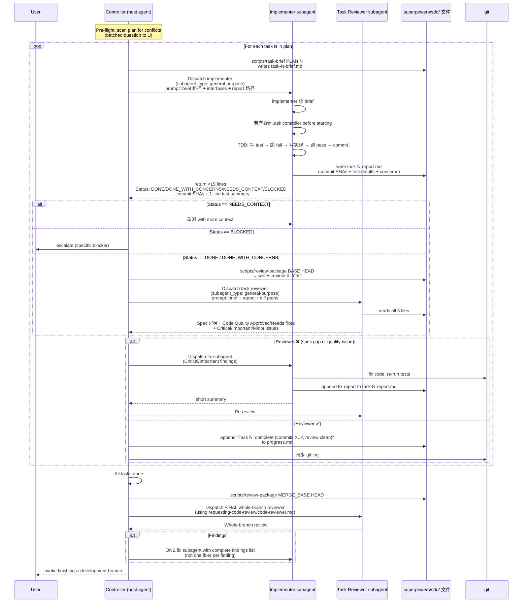
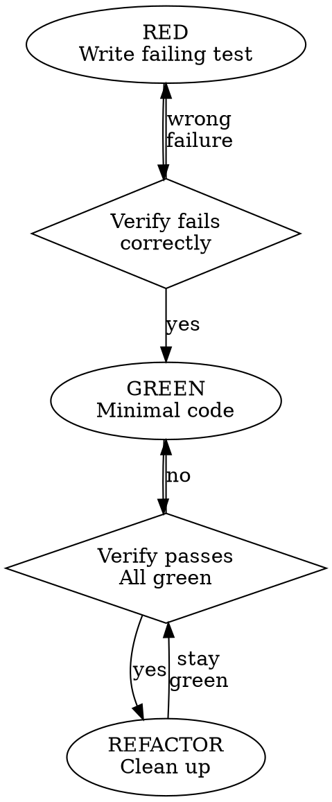

# superpowers — Agent Loop 调研报告

> **调研对象**:obra/superpowers
> **调研日期**:2026-07-18
> **版本依据**:`clone/superpowers/package.json:3` 标记 v6.1.1
> **配套报告**:`superpowers/file_backend.md`(工作区机制) / `superpowers/tool_channel.md` 暂未生成
> **行业参照**:`standard/file_backend.md` / `standard/tool_channel.md`

---

## 0. 智能体一句话定位

**superpowers 不是 agent 本身,而是"给宿主 coding agent 戴的 SDLC 护栏 + 可组合 skill 库插件"** —— 通过 `SessionStart` hook / in-process plugin / 上下文文件 **三种 shape 的 bootstrap 注入器**,把 `using-superpowers` 的方法论规则强行灌进任何宿主 agent(Claude Code / Codex App/CLI / Cursor / Factory Droid / GitHub Copilot CLI / Kimi Code / OpenCode / Pi / Antigravity / Gemini CLI)的每个 session 开头,让 agent 在任何动作前**自动**走一遍"先 brainstorming → 出 plan → TDD 执行 → 双阶段 review → 完成分支"的固定流水线。

**核心信条**:宿主 agent 永远不应该"裸跑",它必须先**识别**当前任务应该触发哪个 skill,然后**严格按 skill 走**。这是 `using-superpowers/SKILL.md:9-13` 的 `<EXTREMELY_IMPORTANT>` 铁律:

> If you think there is even a 1% chance a skill might apply to what you are doing, you ABSOLUTELY MUST invoke the skill. IF A SKILL APPLIES TO YOUR TASK, YOU DO NOT HAVE A CHOICE. YOU MUST USE IT.

---

## 1. 调研依据

### 源码路径

- `C:\workspace\github\onionagent\harness\01_market_research\clone\superpowers\`

### 关键文件 / 关键代码片段(本报告引用)

1. `clone/superpowers/skills/using-superpowers/SKILL.md:9-15` — 整个 superpowers 的灵魂("If a skill applies, you must use it")
2. `clone/superpowers/skills/brainstorming/SKILL.md:19-66` — 9 步 checklist + dot 流程图,内含 `<HARD-GATE>` 不批准不能写代码
3. `clone/superpowers/skills/writing-plans/SKILL.md:54-130` — Plan 文档强制 header(Goal/Architecture/Tech Stack/Global Constraints)+ 任务模板
4. `clone/superpowers/skills/subagent-driven-development/SKILL.md:78-141` — 单 task 子图 + 整体子图,implementer/reviewer/fixer 三角色
5. `clone/superpowers/skills/subagent-driven-development/SKILL.md:30-38` — "Continuous execution: Do not pause to check in with your human partner between tasks"
6. `clone/superpowers/skills/subagent-driven-development/SKILL.md:62-72` — "Model Selection: Use the least powerful model that can handle each role"
7. `clone/superpowers/skills/subagent-driven-development/SKILL.md:166-188` — 4 种 implementer 状态机(DONE / DONE_WITH_CONCERNS / NEEDS_CONTEXT / BLOCKED)
8. `clone/superpowers/skills/subagent-driven-development/SKILL.md:250-263` — progress ledger 跨 compaction 持久化机制
9. `clone/superpowers/skills/subagent-driven-development/implementer-prompt.md` — Implementer subagent 派生命令模板(报告文件 `task-N-report.md`)
10. `clone/superpowers/skills/subagent-driven-development/task-reviewer-prompt.md` — Task reviewer 派生命令模板(spec compliance + code quality 两段裁定)
11. `clone/superpowers/skills/test-driven-development/SKILL.md:21-26` — TDD Iron Law "NO PRODUCTION CODE WITHOUT A FAILING TEST FIRST"
12. `clone/superpowers/skills/verification-before-completion/SKILL.md:13-15` — Gate Function "Evidence before claims, always"
13. `clone/superpowers/skills/requesting-code-review/SKILL.md:7-9` — "Core principle: Review early, review often"
14. `clone/superpowers/skills/finishing-a-development-branch/SKILL.md:60-71` — 4 选项菜单 + 工作树清理策略表
15. `clone/superpowers/hooks/session-start:7-50` — 整个项目的 bootstrap 入口(读 using-superpowers + 包装成 JSON)
16. `clone/superpowers/.opencode/plugins/superpowers.js:48-58` — OpenCode 形状 B 的 in-process 插件(配置 hook + chat messages transform)
17. `clone/superpowers/.pi/extensions/superpowers.ts:14-77` — Pi 形状 B 的 in-process 扩展(`session_compact` 事件再次注入)
18. `clone/superpowers/hooks/hooks.json:1-12` — Claude Code SessionStart hook(用 `${CLAUDE_PLUGIN_ROOT}` 反推)
19. `clone/superpowers/hooks/hooks-cursor.json:1-7` — Cursor sessionStart hook(扁平 `additional_context`)
20. `clone/superpowers/.kimi-plugin/plugin.json:18-21` — Kimi Code sessionStart.skill 直接指向 using-superpowers
21. `clone/superpowers/gemini-extension.json:1-5` — Shape C 走 `contextFileName: "GEMINI.md"` 的 `@`-include
22. `clone/superpowers/docs/porting-to-a-new-harness.md:1-60` — 700 行"如何为新 agent 框架 port"指南,核心是把 bootstrap 做成"可安装",绝不手编用户文件
23. `clone/superpowers/README.md:30-37` — 9 大宿主并列安装方法
24. `clone/superpowers/skills/using-superpowers/SKILL.md:18-25` — "Skill Priority" 决策表
25. `clone/superpowers/skills/brainstorming/SKILL.md:23-24` — "Anti-Pattern: 'This Is Too Simple To Need A Design'"
26. `clone/superpowers/skills/brainstorming/SKILL.md:48-50` — 决策钻石 "User approves design?"
27. `clone/superpowers/skills/writing-plans/SKILL.md:169-189` — "Execution Handoff: Two execution options"
28. `clone/superpowers/skills/dispatching-parallel-agents/SKILL.md:31-46` — "Multiple dispatch calls in one response = parallel execution. One per response = sequential."

### 文档 / README 引用

1. `clone/superpowers/README.md:30-37` — 9 大宿主安装命令(Claude Code / Codex / Cursor / Factory Droid / GitHub Copilot CLI / Kimi Code / OpenCode / Pi / Antigravity)
2. `clone/superpowers/README.md:144-160` — "The Basic Workflow" 7 步法
3. `clone/superpowers/CLAUDE.md:160-176` — "These are not real integrations and will be closed: Manually copying skill files" 维护铁律
4. `clone/superpowers/.kimi-plugin/plugin.json:23-30` — Kimi 显式列出 9 类 Superpowers action → Kimi 工具的 mapping
5. `clone/superpowers/skills/using-superpowers/SKILL.md:18-25` — "Process skills come first" 优先级
6. `clone/superpowers/docs/porting-to-a-new-harness.md:31-40` — "Skills name actions, not tools" + "Everything ships through the harness's own install mechanism"

---

## 2. 九大问题回答

### Q1. Agent Loop 主流程 — "宿主 agent 应该如何工作"

**答:superpowers 自身没有 loop,但通过 5 段强约束 + 1 张 dot 流程图,把所有宿主 agent 都"训练"成同一个 loop**。

#### 1.1 强约束 1:每个 session 开头注入 using-superpowers

不同宿主用不同 shape 注入同一份 `skills/using-superpowers/SKILL.md` 内容,这是 superpowers 一切约束的**根**。

**Shape A(hook/事件型 — Claude Code / Cursor / Copilot CLI)**:`hooks/session-start` 是个 bash 脚本,读 using-superpowers 内容后,根据环境变量切 3 种 JSON 形状:

```bash
# clone/superpowers/hooks/session-start:39-50
if [ -n "${CURSOR_PLUGIN_ROOT:-}" ]; then
  printf '{\n  "additional_context": "%s"\n}\n' "$session_context" | cat
elif [ -n "${CLAUDE_PLUGIN_ROOT:-}" ] && [ -z "${COPILOT_CLI:-}" ]; then
  printf '{\n  "hookSpecificOutput": {\n    "hookEventName": "SessionStart",\n    "additionalContext": "%s" }\n}\n' "$session_context" | cat
else
  printf '{\n  "additionalContext": "%s"\n}\n' "$session_context" | cat
fi
```

**Shape B(in-process 插件型 — OpenCode / Pi)**:插件在 chat messages transform / context 事件中插入 bootstrap 消息。

`clone/superpowers/.opencode/plugins/superpowers.js:108-122` 注释显式说明:"Using a user message instead of a system message avoids: 1. Token bloat from system messages repeated every turn (#750) 2. Multiple system messages breaking Qwen and other models (#894)"。

`clone/superpowers/.pi/extensions/superpowers.ts:31-34` 监听 `session_compact` 事件再次注入(解决 Q5 Q8 上下文压缩问题):

```typescript
pi.on("session_compact", async () => {
  injectBootstrap = true;
});
```

**Shape C(上下文文件型 — Gemini)**:通过 `contextFileName` 让宿主读 `GEMINI.md`(@ 引用 using-superpowers)。

#### 1.2 强约束 2:Skill 优先级(决策表)

宿主 agent 在任何动作前必须按 `using-superpowers/SKILL.md:18-25` 决策:

| 触发 | 第一选择 |
|---|---|
| "Let's build X" | `brainstorming` → 然后再选实现 skill |
| "Fix this bug" | `systematic-debugging` → 然后再选 domain skill |
| 一般场景 | 任何相关 skill 都**必须** invoke |

#### 1.3 强约束 3:"Skill 描述 = when to use, NOT what the skill does"

`clone/superpowers/skills/writing-skills/SKILL.md:75-83` 反复强调:

> Testing revealed that when a description summarizes the skill's workflow, an agent may follow the description instead of reading the full skill content. A description saying "code review between tasks" caused an agent to do ONE review, even though the skill's flowchart clearly showed TWO reviews.

**Onion 启示**:Agent Loop 不能"压缩"成一句话 prompt,否则宿主 agent 会走捷径。

#### 1.4 强约束 4:Skill 状态机有显式 checklist

每个 skill 都有"create a todo for each checklist item"(`brainstorming/SKILL.md:23-29` 9 步 / `subagent-driven-development/SKILL.md:46-76` 双层子图 / `finishing-a-development-branch/SKILL.md:14-94` 6 步)—— 强制宿主 agent **用宿主自己的 todo 工具**显式跟踪。

#### 1.5 强约束 5:"Continuous execution, no check-in between tasks"

`clone/superpowers/skills/subagent-driven-development/SKILL.md:30-33` 显式禁止 mid-execution 询问:

> Do not pause to check in with your human partner between tasks. Execute all tasks from the plan without stopping. The only reasons to stop are: BLOCKED status you cannot resolve, ambiguity that genuinely prevents progress, or all tasks complete.

**Onion 启示**:Agent Loop 内部应该是"封闭执行"模式,只有"决策点"(design 批准 / plan 审查 / 分支完成)才打扰用户。

#### 1.6 Mermaid 流程图:superpowers 方法论完整流程

```mermaid
flowchart TD
    Start([User: "Let's make X"]) --> SS1[SessionStart: hook/plugin 注入<br/>using-superpowers/SKILL.md]
    SS1 --> A0[使用 using-superpowers 决策:<br/>"哪个 skill 适用?"]

    A0 -->|"Let's build X"| Brain[Phase 1: brainstorming<br/>9 步 checklist + dot 流程图]
    A0 -->|"Fix this bug"| Debug[Phase 1: systematic-debugging<br/>4 阶段]
    A0 -->|"Other creative work"| Brain

    Brain --> B1[探索项目上下文]
    B1 --> B2[逐个问澄清问题<br/>one at a time]
    B2 --> B3[提出 2-3 方案]
    B3 --> B4[分段呈现设计]
    B4 --> D1{User 批准设计?}
    D1 -->|no| B2
    D1 -->|yes| B5[写 spec 到<br/>docs/superpowers/specs/]
    B5 --> B6[Spec self-review<br/>修复占位符/矛盾/歧义]
    B6 --> D2{User 审查 spec?}
    D2 -->|changes| B5
    D2 -->|approved| B7[Invoke writing-plans]

    B7 --> W1[Phase 2: writing-plans<br/>写 plan 到 docs/superpowers/plans/]
    W1 --> W2[Header: Goal/Architecture<br/>Tech Stack/Global Constraints]
    W2 --> W3[每 task 2-5 分钟<br/>5 步: RED 写测试 → 跑 fail →<br/>GREEN 最小代码 → 跑 pass → commit]
    W3 --> W4[Plan self-review]
    W4 --> W5{User 选择执行方式}
    W5 -->|Subagent-Driven| SDD[Phase 3a: subagent-driven-development]
    W5 -->|Inline| EP[Phase 3b: executing-plans<br/>批处理 + 人类检查点]

    SDD --> S1[Read plan 一次<br/>所有 task 创建 todos]
    S1 --> Loop{每个 task 都跑<br/>这个子图}
    Loop --> S2[Generate task-N-brief.md<br/>从 plan 抽出本 task 全文]
    S2 --> S3[Dispatch implementer subagent<br/>fresh context + brief 路径]
    S3 --> S4{Implementer 状态?}
    S4 -->|NEEDS_CONTEXT| S5[补 context 重派]
    S4 -->|BLOCKED| S6[escalate to human]
    S4 -->|DONE/ CONCERNS| S7[Generate review-X..Y.diff<br/>via scripts/review-package]
    S7 --> S8[Dispatch task reviewer subagent<br/>spec compliance + code quality]
    S8 --> S9{Reviewer 双段裁定}
    S9 -->|spec ❌ 或 quality ❌| S10[Dispatch fix subagent<br/>Critical/Important]
    S10 --> S8
    S9 -->|spec ✅ + quality ✅| S11[Update progress.md ledger<br/>git log 备份]
    S11 --> Loop
    Loop -->|所有 task 完成| S12[Dispatch final code reviewer<br/>whole-branch review]

    EP --> E1[Read plan + review critically]
    E1 --> E2[Inline 执行 + checkpoint]

    S12 --> CR[Phase 4: requesting-code-review<br/>final whole-branch review]
    E2 --> CR

    CR --> FC[Phase 5: finishing-a-development-branch<br/>1. 验证测试 → 2. 检测环境 →<br/>3. 检测 base branch → 4. 4 选项菜单]

    FC --> F1{选项}
    F1 -->|1. 合并本地| F2[git checkout base<br/>git pull + git merge<br/>verify tests + cleanup]
    F1 -->|2. Push + PR| F3[git push -u origin<br/>保留 worktree]
    F1 -->|3. Keep as-is| F4[保留 worktree + branch]
    F1 -->|4. Discard| F5[typed 'discard' 确认<br/>force-delete branch + worktree]

    F2 --> End([Done])
    F3 --> End
    F4 --> End
    F5 --> End
    Debug -.-> Brain

    classDef human fill:#fef3c7,stroke:#f59e0b
    classDef skill fill:#dbeafe,stroke:#3b82f6
    classDef subagent fill:#e9d5ff,stroke:#7c3aed
    classDef gate fill:#fce7f3,stroke:#ec4899

    class SS1,Brain,W1,W4,SDD,EP,CR,FC skill
    class S3,S7,S8,S10 subagent
    class D1,D2,W5,S4,S9,F1 gate
    class Debug skill
```

**对比标准 Agent Loop**:superpowers **没有** 经典 `think → tool_call → observe → reflect` 的 4 步循环(那是单个 task 内部的事),它的 loop 是在**跨 task / 跨 review** 这个**外层**做编排,具体每个 task 的"思考循环"交给宿主 agent 自己。

---

### Q2. Plan 计划机制

**答:Plan 是一个强格式 markdown 文件,每个 task 自带"完整代码 + 完整测试"且用 5 步 TDD 子步打包,加载方式是"读 plan 一次,按 tasks 顺序执行"**。

#### 2.1 计划文档存储位置

`clone/superpowers/skills/writing-plans/SKILL.md:18-19` 规定:

> **Save plans to:** `docs/superpowers/plans/YYYY-MM-DD-<feature-name>.md`

具体证据:
- 项目自身用同款目录存自己的 plan:`docs/superpowers/plans/2026-06-11-visual-companion-final-hardening-fixup.md`、`docs/superpowers/plans/2026-06-09-sdd-task-scoped-review-dispatch.md` 等(glob `docs/superpowers/plans/*.md` 共 ~12 份)
- 每个 plan 对应一个 spec:**spec 在 `docs/superpowers/specs/`,plan 在 `docs/superpowers/plans/`**,同名异日

**注意**:用户偏好可 override,例如"User preferences for plan location override this default"(同文件 line 19)。

#### 2.2 计划文档格式(强约束)

**强制 header**(`writing-plans/SKILL.md:56-71`):

```markdown
# [Feature Name] Implementation Plan

> **For agentic workers:** REQUIRED SUB-SKILL: Use superpowers:subagent-driven-development
>   (recommended) or superpowers:executing-plans to implement this plan task-by-task.
>   Steps use checkbox (`- [ ]`) syntax for tracking.

**Goal:** [One sentence describing what this builds]
**Architecture:** [2-3 sentences about approach]
**Tech Stack:** [Key technologies/libraries]

## Global Constraints
[The spec's project-wide requirements — version floors, dependency limits,
naming and copy rules, platform requirements — one line each, with exact
values copied verbatim from the spec. Every task's requirements implicitly
include this section.]
```

**Task 模板**(每 task 2-5 分钟,5 步 TDD)(`writing-plans/SKILL.md:80-130`):

```markdown
### Task N: [Component Name]

**Files:**
- Create: `exact/path/to/file.py`
- Modify: `exact/path/to/existing.py:123-145`
- Test: `tests/exact/path/to/test.py`

**Interfaces:**
- Consumes: [what this task uses from earlier tasks — exact signatures]
- Produces: [what later tasks rely on — exact function names, parameter
  and return types. A task's implementer sees only their own task; this
  block is how they learn the names and types neighboring tasks use.]

- [ ] **Step 1: Write the failing test**
```python
def test_specific_behavior():
    result = function(input)
    assert result == expected
```

- [ ] **Step 2: Run test to verify it fails**
Run: `pytest tests/path/test.py::test_name -v`
Expected: FAIL with "function not defined"

- [ ] **Step 3: Write minimal implementation**
```python
def function(input):
    return expected
```

- [ ] **Step 4: Run test to verify it passes**
Run: `pytest tests/path/test.py::test_name -v`
Expected: PASS

- [ ] **Step 5: Commit**
```bash
git add tests/path/test.py src/path/file.py
git commit -m "feat: add specific feature"
```
```

**核心设计哲学**:`writing-plans/SKILL.md:5-7`:

> Write comprehensive implementation plans assuming the engineer has zero context for our codebase and questionable taste. ... Assume they are a skilled developer, but know almost nothing about our toolset or problem domain. Assume they don't know good test design very well.

**即:plan 不是"摘要",而是"傻瓜式脚本"**——implementer 不需要思考,只需要执行。

#### 2.3 Plan 的禁止内容(`writing-plans/SKILL.md:132-141`)

每个"no"都对应一种 known failure 模式:

| 禁止 | 失败模式 |
|---|---|
| "TBD" / "TODO" / "implement later" | implementer 卡住,不知道下一步 |
| "Add appropriate error handling" | 偷懒,plan 不完整 |
| "Write tests for the above" | 没有具体测试代码,implementer 不会写 |
| "Similar to Task N" | 复制粘贴,新 implementer 没看过旧 task |
| 描述做什么不贴代码 | 没有可执行的内容 |

#### 2.4 Plan 的加载方式:抽到独立文件

`clone/superpowers/skills/subagent-driven-development/scripts/task-brief` 是核心:

```bash
# clone/superpowers/skills/subagent-driven-development/scripts/task-brief:1-30
#!/usr/bin/env bash
# Usage: task-brief PLAN_FILE TASK_NUMBER [OUTFILE]
# Default OUTFILE: <repo-root>/.superpowers/sdd/task-<N>-brief.md
```

这个脚本**用 awk 把 plan 里的 `### Task N` 段抽出来**到独立文件 `task-N-brief.md`,然后**让 implementer subagent 只读这一个文件**。证据 `task-brief:18-29`:

```bash
awk -v n="$n" '
  /^```/ { infence = !infence }
  !infence && /^#+[ \t]+Task[ \t]+[0-9]+/ {
    intask = ($0 ~ ("^#+[ \t]+Task[ \t]+" n "([^0-9]|$)"))
  }
  intask { print }
' "$plan" > "$out"
```

**为什么不直接 paste 进 dispatch prompt**?

`subagent-driven-development/SKILL.md:213-218` 解释:

> A dispatch prompt describes one task, not the session's history. Do not paste accumulated prior-task summaries ("state after Tasks 1-3") into later dispatches — a real session's dispatch hit 42k chars of which 99% was pasted history. A fresh subagent needs its task, the interfaces it touches, and the global constraints. Nothing else.

#### 2.5 Plan 自检清单(`writing-plans/SKILL.md:143-162`)

写完 plan 后,作者跑 3 项自检:

1. **Spec coverage**:每个 spec 段都能指向一个 task
2. **Placeholder scan**:搜"TBD"等关键词,inline 修复
3. **Type consistency**:Task 3 叫 `clearLayers()`,Task 7 不能叫 `clearFullLayers()`(这是真 bug)

#### 2.6 Plan 完成后给用户两个选择(`writing-plans/SKILL.md:164-189`)

```
Plan complete and saved to `docs/superpowers/plans/<filename>.md`. Two execution options:

1. Subagent-Driven (recommended) - I dispatch a fresh subagent per task, review between tasks, fast iteration
2. Inline Execution - Execute tasks in this session using executing-plans, batch execution with checkpoints

Which approach?
```

**Onion 启示**:Plan 不是"自动消费",而是"用户审视后选执行策略"。

---

### Q3. Sub Agent 委派

**答:subagent-driven-development 用 3 角色 + 5 步子图实现"per-task fresh subagent + 两阶段 review"**。**通信全是文件**,**没有 in-memory context 共享**。

#### 3.1 三种角色

| 角色 | 模板文件 | 何时派 | 模型选择 |
|---|---|---|---|
| **Implementer** | `implementer-prompt.md` | 每个 task 开头 | 越便宜越好,见 Q9 |
| **Task Reviewer** | `task-reviewer-prompt.md` | implementer DONE 后,每 task | 中等,看 diff 大小 |
| **Fix Subagent** | 同 implementer 模板(带 report append 指引) | reviewer 标 Critical/Important | 同 implementer |

#### 3.2 implementer 状态机(4 状态)

`subagent-driven-development/SKILL.md:166-188`:

| 状态 | 含义 | controller 动作 |
|---|---|---|
| **DONE** | 完成 | 生成 review package → 派 reviewer |
| **DONE_WITH_CONCERNS** | 完成但有疑问 | 读 concerns,真问题就改,假问题直接进 review |
| **NEEDS_CONTEXT** | 信息不足 | 补 context,重派 |
| **BLOCKED** | 卡住 | (1) 给更多 context (2) 升模型 (3) 拆小 (4) 升级到 human |

**反例警告**(`SKILL.md:188`):

> **Never** ignore an escalation or force the same model to retry without changes. If the implementer said it's stuck, something needs to change.

#### 3.3 每个 task 的完整子图(`subagent-driven-development/SKILL.md:43-72`)

```dot
digraph process {
    rankdir=TB;

    subgraph cluster_per_task {
        label="Per Task";
        "Dispatch implementer subagent (./implementer-prompt.md)" [shape=box];
        "Implementer subagent asks questions?" [shape=diamond];
        "Answer questions, provide context" [shape=box];
        "Implementer subagent implements, tests, commits, self-reviews" [shape=box];
        "Write diff file, dispatch task reviewer subagent (./task-reviewer-prompt.md)" [shape=box];
        "Task reviewer reports spec ✅ and quality approved?" [shape=diamond];
        "Dispatch fix subagent for Critical/Important findings" [shape=box];
        "Mark task complete in todo list and progress ledger" [shape=box];
    }
    ...
}
```

#### 3.4 通信机制:**全文件,无 in-context**

文件 handoff 机制(`subagent-driven-development/SKILL.md:208-249`):

| 文件 | 谁写 | 谁读 | 路径 |
|---|---|---|---|
| `task-N-brief.md` | controller(`scripts/task-brief` 生成) | implementer | `.superpowers/sdd/task-N-brief.md` |
| `task-N-report.md` | implementer(自己写,自己 return only status + commits + test summary) | reviewer + controller | `.superpowers/sdd/task-N-report.md` |
| `review-<base7>..<head7>.diff` | controller(`scripts/review-package BASE HEAD` 生成) | reviewer | `.superpowers/sdd/review-X..Y.diff` |
| `progress.md` | controller(每个 task 通过 review 后 append 一行) | controller 自己(跨 compaction 恢复) | `.superpowers/sdd/progress.md` |

**为什么不 paste 进 dispatch prompt**?

`subagent-driven-development/SKILL.md:213-216`:

> A dispatch prompt describes one task, not the session's history. Do not paste accumulated prior-task summaries ("state after Tasks 1-3") into later dispatches — a real session's dispatch hit 42k chars of which 99% was pasted history.

#### 3.5 pre-flight plan review(执行前一次性冲突扫描)

`subagent-driven-development/SKILL.md:74-82`:

> Before dispatching Task 1, scan the plan once for conflicts:
> - tasks that contradict each other or the plan's Global Constraints
> - anything the plan explicitly mandates that the review rubric treats as a defect
>
> Present everything you find to your human partner as one batched question — each finding beside the plan text that mandates it, asking which governs — before execution begins, **not one interrupt per discovery mid-plan**.

**Onion 启示**:loop 开始前一次性暴露冲突,避免 mid-execution 反复打断用户。

#### 3.6 并行 subagent:`dispatching-parallel-agents`

**只用于"独立问题域"**,不用于 SDD 流程(`dispatching-parallel-agents/SKILL.md:5-7`):

> Use when facing 2+ independent tasks that can be worked on without shared state or sequential dependencies

**关键机制**:`dispatching-parallel-agents/SKILL.md:61-62` 显式说明:

> Multiple dispatch calls in one response = parallel execution. One per response = sequential.

**典型场景**:`dispatching-parallel-agents/SKILL.md:96-114` 6 个 test failure 跨 3 个文件 → 1 个响应里发 3 个 dispatch → 3 个 agent 并行调查:

```
Agent 1 → Fix agent-tool-abort.test.ts
Agent 2 → Fix batch-completion-behavior.test.ts
Agent 3 → Fix tool-approval-race-conditions.test.ts
```

**反例**:`subagent-driven-development/SKILL.md:294-296`:

> Never: Dispatch multiple implementation subagents in parallel (conflicts)

**Onion 启示**:"parallel agents" ≠ "faster SDD" —— SDD 必须 sequential,parallel 只用于独立研究。

#### 3.7 完整 subagent 工作流图



#### 3.8 具体的 implementer 派生命令模板

`implementer-prompt.md:1-50`(节选):

```
Subagent (general-purpose):
  description: "Implement Task N: [task name]"
  model: [MODEL — REQUIRED: choose per SKILL.md Model Selection;
         an omitted model silently inherits the session's most expensive one]
  prompt: |
    You are implementing Task N: [task name]

    ## Task Description
    Read your task brief first: [BRIEF_FILE]
    It contains the full task text from the plan.

    ## Context
    [Scene-setting: where this fits, dependencies, architectural context]

    ## Before You Begin
    If you have questions about: ...
    **Ask them now.** Raise any concerns before starting work.

    ## Your Job
    Once you're clear on requirements:
    1. Implement exactly what the task specifies
    2. Write tests (following TDD if task says to)
    3. Verify implementation works
    4. Commit your work
    5. Self-review (see below)
    6. Report back

    ## When You're in Over Your Head
    **STOP and escalate when:**
    - The task requires architectural decisions with multiple valid approaches
    - ...

    ## Report Format
    Write your full report to [REPORT_FILE]:
    - What you implemented (or what you attempted, if blocked)
    - What you tested and test results
    - **TDD Evidence** ...
    - Files changed
    - Self-review findings (if any)
    - Any issues or concerns

    Then report back with ONLY (under 15 lines — the detail lives in the
    report file):
    - **Status:** DONE | DONE_WITH_CONCERNS | BLOCKED | NEEDS_CONTEXT
    - Commits created (short SHA + subject)
    - One-line test summary
    - Your concerns, if any
    - The report file path
```

#### 3.9 具体的 reviewer 派生命令模板

`task-reviewer-prompt.md:8-72`(节选)——明确**两段裁定**:

```
## Part 1: Spec Compliance
Compare the diff against What Was Requested:
- Missing: requirements they skipped, missed, or claimed without implementing
- Extra: features that weren't requested, over-engineering
- Misunderstood: right feature built the wrong way

## Part 2: Code Quality
- Clean separation of concerns?
- Proper error handling?
- DRY without premature abstraction?
- Edge cases handled?

## Output Format
### Spec Compliance
- ✅ Spec compliant | ❌ Issues found: [what's missing/extra/misunderstood]
- ⚠️ Cannot verify from diff: [requirements you could not verify from the diff alone]

### Issues
#### Critical (Must Fix)
#### Important (Should Fix)
#### Minor (Nice to Have)

### Assessment
**Task quality:** [Approved | Needs fixes]
```

**Onion 启示**:"两段裁定"比"一段是否通过"更细,可以让 controller 区分"功能没实现(spec)"vs "实现得不好(quality)"。

---

### Q4. Loop 退出机制

**答:每层 loop 有不同的"完成"信号,总体是"checklist + diamond + 4 选项菜单"**。

#### 4.1 Brainstorming 的 9 步 checklist(`brainstorming/SKILL.md:23-29`)

```
1. Explore project context
2. Offer the visual companion just-in-time
3. Ask clarifying questions
4. Propose 2-3 approaches
5. Present design
6. Write design doc
7. Spec self-review
8. User reviews written spec
9. Transition to implementation
```

**退出 = 第 9 步 = invoke writing-plans**(显式终端节点):

> **The terminal state is invoking writing-plans.** Do NOT invoke frontend-design, mcp-builder, or any other implementation skill. (`brainstorming/SKILL.md:45`)

#### 4.2 Subagent-Driven 的 6 步子图

每 task 子图结束 = 标记 ledger + 回到 "More tasks remain?" 钻石。整体子图结束 = 派 final whole-branch reviewer,review 结束 = invoke `finishing-a-development-branch`(`subagent-driven-development/SKILL.md:69-70`):

> "Dispatch final code reviewer subagent" -> "Use superpowers:finishing-a-development-branch" [style=filled fillcolor=lightgreen]

#### 4.3 Finishing 的 4 选项菜单(`finishing-a-development-branch/SKILL.md:60-71`)

不是"自由询问",而是**结构化菜单**:

```
Implementation complete. What would you like to do?

1. Merge back to <base-branch> locally
2. Push and create a Pull Request
3. Keep the branch as-is (I'll handle it later)
4. Discard this work

Which option?
```

**detached HEAD 特殊处理**:`finishing-a-development-branch/SKILL.md:74-82` 检测 `GIT_DIR != GIT_COMMON` 且 detached → 切到 3 选项菜单(没有本地 merge)。

#### 4.4 Verification-before-completion 的 gate function(`verification-before-completion/SKILL.md:18-26`)

每个 claim 之前有 5 步:

```
1. IDENTIFY: What command proves this claim?
2. RUN: Execute the FULL command (fresh, complete)
3. READ: Full output, check exit code, count failures
4. VERIFY: Does output confirm the claim?
5. ONLY THEN: Make the claim
```

**Onion 启示**:Agent Loop 不是"exit on 0 errors",而是"exit on 0 unverified claims"。

#### 4.5 TDD 的硬性"RED-GREEN-REFACTOR" 循环(`test-driven-development/SKILL.md:40-55`)



**核心**:循环不通过 "verify_red" 或 "verify_green" 不准进下一步。

---

### Q5. Ask 模式

**答:有 ask 模式,但**是**"用户询问"+"视觉伴侣"双轨**;通过宿主 agent 自身的 ask tool 实现,不写死 UI。

#### 5.1 brainstorming 的"逐个问"原则(`brainstorming/SKILL.md:101-107`)

> **One question at a time** - Don't overwhelm with multiple questions
> **Multiple choice preferred** - Easier to answer than open-ended when possible
> **YAGNI ruthlessly** - Remove unnecessary features from all designs

**典型 prompt**:`brainstorming/SKILL.md:99-100`:

> For appropriately-scoped projects, ask questions one at a time to refine the idea
> Only one question per message - if a topic needs more exploration, break it into multiple questions

#### 5.2 Ask 是通过宿主 tool 实现的(无 UI 自定义)

不同宿主映射到不同 ask 工具,见 `clone/superpowers/.kimi-plugin/plugin.json:23-30`:

> When a Superpowers skill says to ask the user, ask clarifying questions, ask one question at a time, present multiple-choice options, use the terminal for a question, or wait for the user's choice, call Kimi Code's `AskUserQuestion` tool. Do not render those choices as plain assistant text unless `AskUserQuestion` is unavailable

| 宿主 | Ask 工具 |
|---|---|
| Claude Code | 原生 `AskUserQuestion`(隐式,见 `using-superpowers/SKILL.md` 未明说但默认) |
| Codex | 同上 |
| Kimi Code | `AskUserQuestion`(`Kimi plugin.json:25`) |
| Antigravity | 通过 task artifact 实现 ask 流程(`antigravity-tools.md`) |
| Pi | 让用户自己 invoke `/skill:name`(`pi-tools.md:7-10`) |

**Onion 启示**:Onion 的 ask 模式应该是**抽象成"问用户一个问题,等回答"**的内部动作,不同 UI 适配。

#### 5.3 视觉伴侣(visual companion)— 可选,just-in-time(`brainstorming/SKILL.md:124-156`)

> A browser-based companion for showing mockups, diagrams, and visual options during brainstorming. Available as a tool — not a mode.

**关键规则**:
1. **不主动开**,等用户问第一个"如果能看就好了"的问题(`brainstorming/SKILL.md:127-130`)
2. **每次问题都要判断**"用文字够还是用图更好"(同 line 138-148)
3. 用户接受后,**作为独立消息发出**("This offer MUST be its own message" 同 line 132)

**实现位置**:`clone/superpowers/skills/brainstorming/scripts/start-server.sh:117` 创建 `.superpowers/brainstorm/<SESSION_ID>/` 状态目录;**用 bash + python 自实现 HTTP server**,无第三方依赖。

**Onion 启示**:ask 模式**不一定非要是结构化表单**,**长对话 + 视觉伴侣**也是一种方式。

---

### Q6. Human-in-the-Loop (HITL)

**答:HitL 不是 mid-loop 询问,而是 5 个显式"决策门"**。

#### 6.1 5 个 HITL 决策门

| # | 门 | 位置 | 用户可做的选择 |
|---|---|---|---|
| 1 | **User 批准设计?** | `brainstorming/SKILL.md:48-50` | yes → 写 spec / no → 改设计 |
| 2 | **User 审查 spec?** | `brainstorming/SKILL.md:55-58` | changes requested → 改 / approved → invoke writing-plans |
| 3 | **User 选择执行方式?** | `writing-plans/SKILL.md:169-189` | Subagent-Driven(推荐)/ Inline |
| 4 | **User 批准 plan?** | `writing-plans/SKILL.md:127-130` Self-Review 之后(隐式,plan 完成后直接给选择) | (含在 #3 里) |
| 5 | **4 选项菜单** | `finishing-a-development-branch/SKILL.md:60-71` | Merge / PR / Keep / Discard |

#### 6.2 mid-loop **禁止**询问

`subagent-driven-development/SKILL.md:30-33`(已引):

> Do not pause to check in with your human partner between tasks. Execute all tasks from the plan without stopping.

**但有 3 个正当打断理由**(同 line 32):

1. BLOCKED 状态你解决不了
2. 真正阻止进度的歧义
3. 所有 task 都完成

#### 6.3 subagent 内部的"先问后做"(`implementer-prompt.md:11-15`)

虽然 controller 不问用户,但 **subagent 自己被强制要求先问**:

> ## Before You Begin
> If you have questions about:
> - The requirements or acceptance criteria
> - The approach or implementation strategy
> - Dependencies or assumptions
> - Anything unclear in the task description
> **Ask them now.** Raise any concerns before starting work.

**Onion 启示**:HITL **delegate 到 subagent**,把 controller 保持"封闭执行"模式。

#### 6.4 pre-flight 一次性冲突扫描(同 3.5)

`subagent-driven-development/SKILL.md:74-82`:**执行前一次性问完所有冲突**,不 mid-execution 反复打扰。

#### 6.5 plan 矛盾的处理(`task-reviewer-prompt.md:85-89`)

> A finding labeled plan-mandated — or any finding that conflicts with what the plan's text requires — is the human's decision, like any plan contradiction: present the finding and the plan text, ask which governs.

**Onion 启示**:"plan 写错了"和"implementer 做错了"是 2 个不同的失败,**永远问用户哪个对**。

---

### Q7. 工具调用权限

**答:superpowers 是 skill 库,不实现权限,也不阻止任何工具**。

#### 7.1 superpowers 0 工具(零工具库)

证据:全项目无 `tools/` 或 `tool_registry/`,只有 `skills/` + `scripts/` + `hooks/`(`bash`:`Get-ChildItem clone/superpowers -Force` 输出)。**所有 14 个 skill 都是流程文档 + bash 脚本**,不暴露 LLM 工具。

#### 7.2 工具调用 = 宿主 agent 的事

skill 用**动作**而不是工具名来描述(`docs/porting-to-a-new-harness.md:21-25`):

> Skills are written to describe *actions* — "invoke a skill", "read a file", "dispatch a subagent", "create a todo" — and never name a specific tool. This is what lets one skill body run on Claude Code, Codex, Gemini, pi, and the rest without edits.

**对照表**:`clone/superpowers/.kimi-plugin/plugin.json:23-30` 显式 mapping:

| Skill 描述的动作 | Kimi 工具 |
|---|---|
| "Ask the user" / "ask clarifying questions" | `AskUserQuestion` |
| "Create a todo" / "mark complete in todo list" | `TodoList` |
| "Dispatch a subagent" | `Agent` |
| "Invoke a skill" | `Skill`(Kimi 原生) |
| "Read a file" | `Read` |
| "Run a shell command" | `Bash` |
| "Search file contents" | `Grep` |
| "Find files by path or pattern" | `Glob` |
| "Fetch a URL" | `FetchURL` |
| "Search the web" | `WebSearch` |

**Onion 启示**:Onion 的 skill 系统(如果要做)**不应该硬绑工具名**,应该描述 action,让不同宿主做 adapter。

#### 7.3 "权限"通过 Iron Law 间接实现

虽然不阻止工具,但通过**强约束**"教"宿主拒绝某些行为:

| 约束 | 来源 | 阻止什么 |
|---|---|---|
| "NO PRODUCTION CODE WITHOUT A FAILING TEST FIRST" | `test-driven-development/SKILL.md:21-22` | 阻止"先写代码后写测试" |
| "NO COMPLETION CLAIMS WITHOUT FRESH VERIFICATION EVIDENCE" | `verification-before-completion/SKILL.md:13-15` | 阻止"看起来过了" |
| "NO FIXES WITHOUT ROOT CAUSE INVESTIGATION FIRST" | `systematic-debugging/SKILL.md:13-15` | 阻止"瞎猜修" |
| "NO SKILL WITHOUT A FAILING TEST FIRST" | `writing-skills/SKILL.md:188-194` | 阻止"未经测试的 skill" |
| "Never start implementation on main/master branch without explicit user consent" | `executing-plans/SKILL.md:30` | 阻止"在 main 上写代码" |

**Onion 启示**:权限不一定是"工具白名单/黑名单",也可以是"行为白名单"。

#### 7.4 跨宿主差异(实际硬权限来自宿主)

| 宿主 | 是否能执行"rm -rf /" |
|---|---|
| Claude Code | sandbox + permission prompts |
| Codex App | sandbox(只能 commit 到 detached HEAD) |
| Pi | 同 shell(无 sandbox) |
| OpenCode | 取决于配置 |

**superpowers 不管**,由宿主决定。

---

### Q8. 上下文压缩和摘要

**答:核心策略是"对话上下文不持久,进度走文件 ledger"**。**Pi/OpenCode 在 session_compact 事件再次注入 bootstrap**。

#### 8.1 核心原则:对话是易失的(`subagent-driven-development/SKILL.md:250-251`)

> Conversation memory does not survive compaction. In real sessions, controllers that lost their place have re-dispatched entire completed task sequences — the single most expensive failure observed. **Track progress in a ledger file, not only in todos.**

#### 8.2 持久化方案:progress.md ledger(`subagent-driven-development/SKILL.md:253-262`)

```bash
# 检查现有 ledger(每个 session 开头)
cat "$(git rev-parse --show-toplevel)/.superpowers/sdd/progress.md"
# 标 complete 的 task = 已完成,不要重派;从第一个未标 complete 的 task 续做

# 每个 task 通过 review 后,append 一行(同 ledger 文件)
Task N: complete (commits <base7>..<head7>, review clean)
```

**关键设计**:`SKILL.md:258-262`:

> The ledger is your recovery map: the commits it names exist in git even when your context no longer remembers creating them. After compaction, trust the ledger and `git log` over your own recollection.

**双轨信源**:ledger(markdown,易读)+ `git log` 提交历史(可验证,不可篡改),互相校验。

#### 8.3 git clean 风险(RELEASE-NOTES / SDD 注释)

`skills/subagent-driven-development/scripts/sdd-workspace:3-9` 注释:

> The workspace lives in the working tree (not under .git/) because Claude Code treats .git/ as a protected path and denies agent writes there — which blocks an implementer subagent from writing its report file.

**但**:`.superpowers/sdd/` 是 git-ignored(`sdd-workspace:21` `printf '*\n' > "$dir/.gitignore"`),所以 `git clean -fdx` 会把它一起删掉。**fallback = 重建从 `git log` 恢复**(ledger 里的 commit SHA 还在 git 里)。

#### 8.4 Pi 的 session_compact 事件再次注入

`clone/superpowers/.pi/extensions/superpowers.ts:31-34`:

```typescript
pi.on("session_compact", async () => {
    injectBootstrap = true;
});
```

`agent_end` 时关闭:

```typescript
pi.on("agent_end", async () => {
    injectBootstrap = false;
});
```

**Onion 启示**:压缩后**不是"重新读 conversation"**,而是**重新注入 bootstrap + 读 ledger** —— superpowers 用"事件 hook"代替"对话恢复"。

#### 8.5 subagent 隔离本身就是 context 管理

`subagent-driven-development/SKILL.md:9-12`:

> **Why subagents:** You delegate tasks to specialized agents with isolated context. By precisely crafting their instructions and context, you ensure they stay focused and succeed at their task. They should never inherit your session's context or history — you construct exactly what they need. This also preserves your own context for coordination work.

#### 8.6 文件 handoff 优于 in-context paste(`subagent-driven-development/SKILL.md:210-218`)

> Everything you paste into a dispatch prompt — and everything a subagent prints back — stays resident in your context for the rest of the session and is re-read on every later turn. Hand artifacts over as files:

#### 8.7 brainstorming 的"spec self-review"是一种 context-saving 习惯(`brainstorming/SKILL.md:81-92`)

写完 spec 后**立即**自检(占位符/矛盾/歧义/范围),不要等用户问:

> Fix any issues inline. No need to re-review — just fix and move on.

---

### Q9. 其他亮点

#### 9.1 跨 10+ 宿主兼容性(同一份 skills 全文,只换 bootstrap 注入器)

`README.md:30-37` 列出 9 大宿主(外加 `gemini-extension.json` = 10),`docs/porting-to-a-new-harness.md` 用 **3 shapes** 抽象所有宿主:

| Shape | 机制 | 代表宿主 | 关键文件 |
|---|---|---|---|
| **A. Hook/事件型** | SessionStart hook 执行 bash,stdout = JSON | Claude Code / Cursor / Copilot CLI | `hooks/session-start` |
| **B. In-process 插件型** | 宿主加载 JS/TS 扩展,扩展在 chat/context 事件里插消息 | OpenCode / Pi | `.opencode/plugins/superpowers.js` / `.pi/extensions/superpowers.ts` |
| **C. 上下文文件型** | 扩展 manifest `contextFileName` 指向包含 @-include 的 .md | Gemini CLI | `gemini-extension.json` + `GEMINI.md` |

**新增宿主 = 写一个 bootstrap 注入器,不动 skills**(porting-to-a-new-harness.md:21-25):

> The bootstrap is the entire integration. Without it, the skill files are inert — present on disk, never invoked.

**Onion 启示**:Onion 不需要支持 10 个宿主,但可以借鉴"3 shapes"思路,让以后扩展新 UI 时不动核心。

#### 9.2 Bootstrap 注入细节(in-process plugin 形态)

`clone/superpowers/.opencode/plugins/superpowers.js:96-122` 注释解释"为什么用 user message 而不是 system message":

> Using a user message instead of a system message avoids:
> 1. Token bloat from system messages repeated every turn (#750)
> 2. Multiple system messages breaking Qwen and other models (#894)
>
> The hook fires on every agent step (not just every turn) because opencode's prompt.ts reloads messages from DB each step.

**Onion 启示**:用"第一条 user 消息 prepend"代替 system message,既减少 token 重复注入,也避免多 system message 触发模型 bug。

**Bootstrap 内容里包含工具 mapping**(.opencode 里的 `toolMapping` 变量 line 64-72),告诉宿主怎么把 skill 里的 action 翻译成 tool name。

#### 9.3 Model Selection:最便宜够用的模型(`subagent-driven-development/SKILL.md:84-104`)

> Use the least powerful model that can handle each role to conserve cost and increase speed.

| 任务类型 | 推荐模型 |
|---|---|
| 机械实现(单文件 + 完整 spec) | 便宜模型(大多数 plan 都是这种) |
| 集成/判断(多文件协调) | 标准模型 |
| 架构/设计 | 最强模型 |
| 整体 review(whole-branch) | 最强模型 |
| 单 task review | 中等,按 diff 大小 |

**`SKILL.md:100-102` 重要警告**:

> **Always specify the model explicitly when dispatching a subagent.** An omitted model inherits your session's model — often the most capable and most expensive — which silently defeats this section.

**Onion 启示**:多模型路由是"按角色分"而不是"按复杂度分",**每个 subagent 自己指定 model**。

#### 9.4 TDD for skills(用 TDD 写 skill)

`clone/superpowers/skills/writing-skills/SKILL.md:8-12` 核心宣言:

> **Writing skills IS Test-Driven Development applied to process documentation.**
> ...You write test cases (pressure scenarios with subagents), watch them fail (baseline behavior), write the skill (documentation), watch tests pass (agents comply), and refactor (close loopholes).

**TDD 映射**(`SKILL.md:21-33`):

| TDD 概念 | Skill 创建 |
|---|---|
| Test case | Pressure scenario with subagent |
| Production code | Skill document (SKILL.md) |
| Test fails (RED) | Agent violates rule without skill |
| Test passes (GREEN) | Agent complies with skill present |
| Refactor | Close loopholes while maintaining compliance |

#### 9.5 抗合理化(rationalization-proofing)框架

`writing-skills/SKILL.md:226-247` 介绍"如何让 skill 不被 agent 绕过去":

1. **关闭每个漏洞**:`Write code before test? Delete it.` + `No exceptions: Don't keep as "reference"...`
2. **处理"精神 vs 字面"**:`Violating the letter of the rules is violating the spirit of the rules.`
3. **建立合理化表**:从 baseline 测试收集所有 agent 的"借口"——见 `test-driven-development/SKILL.md:90-108` 的 11 行 "Common Rationalizations" 表
4. **建立 Red Flags list**: `test-driven-development/SKILL.md:138-152` 13 行

**Onion 启示**:"agent 偷懒"是个**已知失败模式**,必须预先堵上。

#### 9.6 SDO(Skill Discovery Optimization)

`writing-skills/SKILL.md:75-83`:

> **Description = When to Use, NOT What the Skill Does**
>
> The description should ONLY describe triggering conditions. Do NOT summarize the skill's process or workflow in the description.

**反例 vs 正例**(同 line 87-101):

```yaml
# ❌ BAD: Summarizes workflow - agents may follow this instead of reading skill
description: Use when executing plans - dispatches subagent per task with code review between tasks

# ✅ GOOD: Just triggering conditions, no workflow summary
description: Use when executing implementation plans with independent tasks in the current session
```

**`SKILL.md:97-100` 实证**:
> Testing revealed that when a description summarizes the skill's workflow, an agent may follow the description instead of reading the full skill content. A description saying "code review between tasks" caused an agent to do ONE review, even though the skill's flowchart clearly showed TWO reviews.

**Onion 启示**:Skill 描述的"完整性"反而会让 agent 偷懒。

#### 9.7 "Match the Form to the Failure"(`writing-skills/SKILL.md:199-217`)

> Before writing guidance, classify the baseline failure. The form that bulletproofs one failure type measurably backfires on another.

| Baseline failure | Right form | Wrong form |
|---|---|---|
| 压力下跳过规则 | 禁令 + 合理化表 + red flags | 软性指导("prefer...") |
| 输出形状错(冗长 prompt, 埋 verdict) | 正面 recipe:声明输出**是**什么 | 禁令列表("don't restate") |
| 漏掉某元素 | 结构化:在模板里加 REQUIRED 字段 | 在模板附近写 prose 提醒 |
| 行为应该条件化 | 用可观察的 predicate 做条件分支 | 无条件规则 + 例外条款 |

**反直觉发现**:`SKILL.md:204-208`:

> **Why prohibitions backfire on shaping problems:** under a competing incentive ("make the prompt self-contained"), agents negotiate with "don't X". In head-to-head wording tests on dispatch-prompt guidance, the prohibition arm produced clearly more of the unwanted content than the recipe arm (fully separated distributions), and trended worse than even the no-guidance control

**Onion 启示**:**不要默认用禁令(prohibition)**,要看失败类型,有时正面 recipe 更有效。

#### 9.8 "Writing for partner" 语气

CLAUDE.md 反复用"your human partner"(不是"the user"),`SKILL.md:90-96` 把这当成 deliberate design:

> Submitters MUST identify themselves. ... Changes that rewrite the project's voice or restructure its approach without understanding why it exists will be rejected.

**Onion 启示**:用户称呼("partner" vs "user" vs "客户")也是一种品牌选择。

#### 9.9 三大 commit 规范:DRY + YAGNI + TDD + 频繁 commit

`writing-plans/SKILL.md:7`:

> Document everything they need to know: which files to touch for each task, code, testing, docs they might need to check, how to test it. Give them the whole plan as bite-sized tasks. **DRY. YAGNI. TDD. Frequent commits.**

`writing-plans/SKILL.md:71`(plan header 模板):

> Every task ends with a `### Step 5: Commit`(line 126-130)

**Onion 启示**:commit 频率 = task 粒度,而不是 1 个 task = 1 个 commit(实际是每 2-5 分钟一个 commit)。

#### 9.10 进度询问 vs 进度报告

`subagent-driven-development/SKILL.md:33-34`:

> "Should I continue?" prompts and progress summaries waste their time — they asked you to execute the plan, so execute it.

**Onion 启示**:Agent Loop 默认应该"封闭执行",只对**真正决策门**才报告。

---

## 3. 关键代码片段

### 3.1 Bootstrap 注入器(Shape A, Claude Code / Cursor / Copilot CLI)

`clone/superpowers/hooks/session-start:1-50` —— 65 行,**全项目唯一 hook 入口**。

```bash
#!/usr/bin/env bash
# SessionStart hook for superpowers plugin
set -euo pipefail

# 行 9-10:plugin 根从 hook 自身位置反推
SCRIPT_DIR="$(cd "$(dirname "$0")" && pwd)"
PLUGIN_ROOT="$(cd "${SCRIPT_DIR}/.." && pwd)"

# 行 12:读 using-superpowers 全文
using_superpowers_content=$(cat "${PLUGIN_ROOT}/skills/using-superpowers/SKILL.md" 2>&1 || echo "Error reading using-superpowers skill")

# 行 14-23:JSON 转义
escape_for_json() {
    local s="$1"
    s="${s//\\/\\\\}"
    s="${s//\"/\\\"}"
    s="${s//$'\n'/\\n}"
    s="${s//$'\r'/\\r}"
    s="${s//$'\t'/\\t}"
    printf '%s' "$s"
}

using_superpowers_escaped=$(escape_for_json "$using_superpowers_content")

# 行 24-25:包装成 <EXTREMELY_IMPORTANT>
session_context="<EXTREMELY_IMPORTANT>\nYou have superpowers.\n\n**Below is the full content of your 'superpowers:using-superpowers' skill - your introduction to using skills. For all other skills, use the 'Skill' tool:**\n\n${using_superpowers_escaped}\n</EXTREMELY_IMPORTANT>"

# 行 39-50:三选一,根据环境变量切 JSON 形状
if [ -n "${CURSOR_PLUGIN_ROOT:-}" ]; then
  printf '{\n  "additional_context": "%s"\n}\n' "$session_context" | cat
elif [ -n "${CLAUDE_PLUGIN_ROOT:-}" ] && [ -z "${COPILOT_CLI:-}" ]; then
  printf '{\n  "hookSpecificOutput": {\n    "hookEventName": "SessionStart",\n    "additionalContext": "%s" }\n}\n' "$session_context" | cat
else
  printf '{\n  "additionalContext": "%s"\n}\n' "$session_context" | cat
fi
```

### 3.2 Bootstrap 注入器(Shape B, OpenCode)

`clone/superpowers/.opencode/plugins/superpowers.js:48-122` —— 130 行 JS 插件。

```javascript
// 行 48-52:路径计算
const superpowersSkillsDir = path.resolve(__dirname, '../../skills');
const envConfigDir = normalizePath(process.env.OPENCODE_CONFIG_DIR, homeDir);
const configDir = envConfigDir || path.join(homeDir, '.config/opencode');

// 行 76-95:Bootstrap 内容(带 OpenCode 工具 mapping)
const toolMapping = `**Tool Mapping for OpenCode:**
When skills request actions, substitute OpenCode equivalents:
- Create or update todos → \`todowrite\`
- \`Subagent (general-purpose):\` → \`task\` with \`subagent_type: "general"\`
- Invoke a skill → OpenCode's native \`skill\` tool
- Read files → \`read\`
- Create, edit, or delete files → \`apply_patch\`
- Run shell commands → \`bash\`
- Search files → \`grep\`, \`glob\`
- Fetch a URL → \`webfetch\``;

// 行 108-122:在第一条 user 消息里 prepend bootstrap
'experimental.chat.messages.transform': async (_input, output) => {
    const bootstrap = getBootstrapContent();
    if (!bootstrap || !output.messages.length) return;
    const firstUser = output.messages.find(m => m.info.role === 'user');
    if (!firstUser || !firstUser.parts.length) return;
    // 防止重复注入
    if (firstUser.parts.some(p => p.type === 'text' && p.text.includes('EXTREMELY_IMPORTANT'))) return;
    const ref = firstUser.parts[0];
    firstUser.parts.unshift({ ...ref, type: 'text', text: bootstrap });
}
```

### 3.3 task-brief 提取(plan → single task 文件)

`clone/superpowers/skills/subagent-driven-development/scripts/task-brief:1-30`:

```bash
#!/usr/bin/env bash
# Usage: task-brief PLAN_FILE TASK_NUMBER [OUTFILE]
# Default OUTFILE: <repo-root>/.superpowers/sdd/task-<N>-brief.md

set -euo pipefail

if [ $# -lt 2 ] || [ $# -gt 3 ]; then
  echo "usage: task-brief PLAN_FILE TASK_NUMBER [OUTFILE]" >&2
  exit 2
fi

plan=$1
n=$2
[ -f "$plan" ] || { echo "no such plan file: $plan" >&2; exit 2; }

if [ $# -eq 3 ]; then
  out=$3
else
  dir=$("$(cd "$(dirname "$0")" && pwd)/sdd-workspace")
  out="$dir/task-${n}-brief.md"
fi

# 用 awk 抽 ### Task N 段
awk -v n="$n" '
  /^```/ { infence = !infence }
  !infence && /^#+[ \t]+Task[ \t]+[0-9]+/ {
    intask = ($0 ~ ("^#+[ \t]+Task[ \t]+" n "([^0-9]|$)"))
  }
  intask { print }
' "$plan" > "$out"
```

### 3.4 SDD workspace 创建(自屏蔽 .gitignore)

`clone/superpowers/skills/subagent-driven-development/scripts/sdd-workspace:1-22`:

```bash
#!/usr/bin/env bash
set -euo pipefail

# 行 15-22:用 git 根而非 cwd,跟随 worktree
root=$(git rev-parse --show-toplevel)
dir="$root/.superpowers/sdd"
mkdir -p "$dir"
printf '*\n' > "$dir/.gitignore"  # 自屏蔽
cd "$dir" && pwd
```

### 3.5 Implementer 状态报告的"短 reply"约定

`clone/superpowers/skills/subagent-driven-development/implementer-prompt.md:78-95`:

```
Then report back with ONLY (under 15 lines — the detail lives in the
report file):
- **Status:** DONE | DONE_WITH_CONCERNS | BLOCKED | NEEDS_CONTEXT
- Commits created (short SHA + subject)
- One-line test summary (e.g. "14/14 passing, output pristine")
- Your concerns, if any
- The report file path
```

### 3.6 Task Reviewer 两段裁定

`clone/superpowers/skills/subagent-driven-development/task-reviewer-prompt.md:107-126`:

```
## Output Format
### Spec Compliance
- ✅ Spec compliant | ❌ Issues found: [what's missing/extra/misunderstood, with file:line references]
- ⚠️ Cannot verify from diff: [requirements you could not verify from the diff alone...]

### Issues
#### Critical (Must Fix)
#### Important (Should Fix)
#### Minor (Nice to Have)

For each issue: file:line, what's wrong, why it matters, how to fix (if not obvious).

### Assessment
**Task quality:** [Approved | Needs fixes]
**Reasoning:** [1-2 sentence technical assessment]
```

---

## 4. 与 Onion Agent 设计的关联

(对照 Onion Agent "session.json 为核心,围绕它的多模型 + sub-agent + 工具" 哲学)

### 4.1 Onion Agent 应该**直接借鉴**的模式

| # | superpowers 模式 | Onion 怎么做 | 理由 |
|---|---|---|---|
| 1 | **每个 session 开头注入 bootstrap**(3 shapes) | `session.json` 创建时自动 inject `using-onion/SKILL.md` 等 | 强制 agent 知道"有 skill 系统" |
| 2 | **"Skill 描述只写 when-to-use,不写 what"** | Onion 的 skill frontmatter 只写触发条件,流程图在 body 里 | 防止 agent 偷懒走捷径 |
| 3 | **Plan 强格式 markdown,每个 task 5 步 TDD 子步** | `~/.onion/plans/<name>.md` 同样强制 header + task 模板 | 让 sub-agent 不需要思考,只执行 |
| 4 | **task-brief 抽到独立文件,不 paste 进 dispatch** | sub-agent dispatch 时把 brief 路径塞 prompt,不贴文本 | 减少 controller 上下文污染 |
| 5 | **progress.md ledger + git log 双轨持久化** | Onion 的 `session.json.todo_durable[]` 永不被压缩,transient todo 走 history | 解决"compaction 后重做已完成 task" |
| 6 | **3-角色 subagent:implementer + task-reviewer + fix** | Onion 同样分 3 角色,且每 task 都过 review | 质量门 |
| 7 | **状态机 4 状态(DONE/CONCERNS/NEEDS_CONTEXT/BLOCKED)** | Onion 的 sub-agent reply 用相同 4 状态 | controller 可以分情况响应 |
| 8 | **TDD Iron Law + Verification Iron Law** | Onion 的 TDD skill + verification skill 同样用 Iron Law 句式 | 抗合理化 |
| 9 | **每个 task 5 步:RED → run fail → GREEN → run pass → commit** | Onion 的 task 模板用同样 5 步 | 强制 TDD |
| 10 | **pre-flight 一次性冲突扫描,batched question** | Onion 的 plan execute 前批量暴露冲突,mid-exec 不问 | 减少用户打扰 |
| 11 | **4 选项菜单 merge/PR/keep/discard** | Onion 的 finish-branch 同样 4 选项 | 避免开放式"你想怎么办" |
| 12 | **SessionStart hook 跨平台(3 shapes)** | Onion 如果要做 desktop 多端,可以用同样 3 shapes 抽象 | 未来扩展空间 |
| 13 | **Visual companion just-in-time,不是默认** | Onion 如果做 UI,**ask 模式是 fallback,不是默认** | 防止过度 |
| 14 | **dispatch 时显式指定 model** | Onion dispatch sub-agent 时**必须**指定 model,不能 inherit | 防止"全用最贵模型" |
| 15 | **Skill 描述"Use when..." 句式** | Onion 的所有 skill frontmatter 同样用 | 统一元数据 |
| 16 | **"Anti-Pattern: This Is Too Simple To Need A Design"** | Onion 同样有"simple 也要 brainstorming"的 guard | 防止偷懒 |

### 4.2 Onion Agent 应该**避坑**的反例

| # | superpowers 反例 | Onion 怎么避免 | 理由 |
|---|---|---|---|
| 1 | **sub-agent 完全独立,不能共享 in-memory context** | Onion 既然是单一产品,可以设计"sub-agent 共享 session.json 读权限"——只读自己 namespace | superpowers 跨宿主必须独立,Onion 没必要 |
| 2 | **多文件 handoff(task-brief.md / report.md / review.diff)** | Onion 可以用单一 session.json,sub-agent 读自己 namespace 切片 | 减少文件数 |
| 3 | **10 套 manifest + 3 套 bootstrap 注入器** | Onion 既然只 1 个宿主,直接 1 套就够了 | 减少复杂度 |
| 4 | **skill body 用"actions"而不是 tool names** | Onion 可以直接用 tool names(因为宿主唯一) | 减少 adapter 层 |
| 5 | **每个 skill 都要自检(rationalization table + red flags)** | Onion 可以用一个"通用反合理化框架"内嵌到所有 skill 模板 | 减少 boilerplate |

### 4.3 superpowers 没做但 Onion 可以做的

| # | Onion 独有 | 描述 |
|---|---|---|
| 1 | **session.json 单文件状态** | 替代 superpowers 的 5+ 文件(progress.md / task-brief.md / task-report.md / review.diff / todo) |
| 2 | **3 层记忆 namespace**(per superpowers-evals 提到的"lifts drill into evals") | 把 superpowers "skill 库"做成本地化,按 namespace 切分,避免一个巨型 skills/ 目录 |
| 3 | **provider 热插拔** | superpowers 不需要(它跨宿主),Onion 需要(MiniMax / OpenAI 兼容 / Anthropic / Ollama) |
| 4 | **真实进度可视化** | superpowers 的"progress.md"是不可视的,Onion 可以做 web UI 展示 session.json |
| 5 | **强类型 session schema** | superpowers 是 markdown,Onion 可以用 Pydantic model + JSON Schema |

### 4.4 关键差异总览

| 维度 | superpowers | Onion Agent |
|---|---|---|
| **定位** | 跨 10 宿主插件 | 单一产品 |
| **状态存储** | 多个 markdown 文件(progress.md / task-brief.md 等) | 单一 `session.json` |
| **跨宿主** | 10 套 manifest + 3 套 bootstrap 注入器 | 不需要 |
| **sub-agent 通信** | 文件 handoff | 可选文件 handoff + session.json 切片读 |
| **Bootstrap 注入** | SessionStart hook / in-process plugin / context file | 直接 `session_init` API 注入 |
| **HITL 决策门** | 5 个 | 同样 5 个,但 Onion 可以做得更轻量(单文件询问) |
| **TDD** | Iron Law | 同样 Iron Law |
| **进度持久化** | progress.md + git log | session.json.todo_durable + git log |

---

## 5. 不确定 / 未找到

1. **`.superpowers/sdd/progress.md` 的精确格式**:文档说"append one line",但没看到完整示例格式(可能每行就是 `Task N: complete (commits X..Y, review clean)`)。在 `tests/claude-code/test-sdd-workspace.sh` 里可能有完整测试样例,但本次未深入验证。
2. **"Continuous execution" 边界**:理论上 mid-execution 问用户违反 superpowers 哲学,但**`execute plan` 的"重要歧义"怎么判定**没有客观标准——完全靠 controller 自评。
3. **Pi 之外的"session_compact 事件"**:OpenCode 插件在 `experimental.chat.messages.transform` 里每次都重新检测,没有显式监听 compaction 事件(可能是 OpenCode 没有这个事件 hook),所以 OpenCode 的上下文压缩恢复机制更弱。
4. **Model Selection 的"标准模型"具体是哪个**:`subagent-driven-development/SKILL.md:84-104` 提到 "Mechanical/Standard/Most Capable" 3 档,但**没指定具体 model 名字**——显然是为了跨宿主泛化,但对落地不利。
5. **`requesting-code-review` 派 reviewer 的 model 选什么**:`SKILL.md` 没明确,推测是"按 diff 大小"动态选(但没代码证据)。
6. **"9-step brainstorming checklist" vs "实际执行步骤"** 的偏差:文档说 9 步,但流程图有些是"决策钻石",可能某些项目里实际是 7-8 步(取决于 user 是否要 visual companion)。
7. **superpowers 自身用 superpowers 吗?**:看到 `docs/superpowers/specs/` 和 `docs/superpowers/plans/` 的大量文件,推测**是的**(典型的"吃自己的狗粮"),但没看到 `.superpowers/` 在 superpowers 自己的项目根出现——可能在 `.gitignore` 屏蔽。
8. **multi-agent 的 "spawn_agent / wait_agent / close_agent"** 在 Codex 怎么用:`skills/using-superpowers/references/codex-tools.md:5-10` 提到要 `multi_agent = true` 配置,**但 close_agent 是什么时机调用没说明**。
9. **Web fetch / Web search 在 superpowers 里的使用边界**:有几个 skill 提到"fetch URL",但没有专门的 "web-research" skill——推测是各 skill 内联处理。
10. **subagent-driven-development 的"whole-branch review fix wave"**:文档说"one fix subagent with complete findings list"(`SKILL.md:236-237`),但**怎么确保 fix subagent 不会引入新 bug**?没看到二次 review 的强制要求。

---

**调研完成时间**:基于 `clone/superpowers` 当前 `main` 分支(版本 6.1.1,见 `package.json:3`)。
